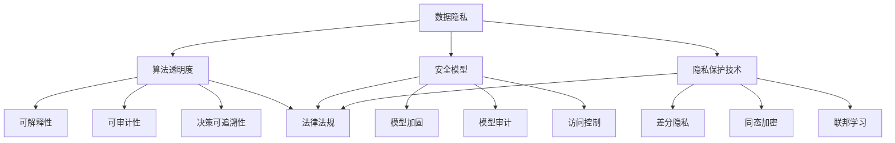

                 

### 文章标题

LLM隐私伦理: AI安全挑战应对之策

### 关键词

Large Language Model, 隐私伦理，安全挑战，应对策略，AI伦理，数据保护，算法透明度，隐私保护技术，模型安全性

### 摘要

本文深入探讨了大型语言模型（LLM）在隐私伦理方面所面临的挑战，以及应对这些挑战的策略。随着AI技术的发展，LLM在各个领域得到了广泛应用，但同时也带来了隐私泄露、数据滥用和算法透明度不足等问题。本文从多个角度分析了这些挑战，并提出了一系列有效的应对策略，包括隐私保护技术、算法透明度和安全模型等方面。通过这篇文章，读者可以更好地理解LLM隐私伦理的重要性，以及如何在实际应用中确保模型的安全性和合规性。

### 背景介绍

#### AI技术的快速发展与LLM的崛起

随着深度学习、自然语言处理（NLP）和计算能力的飞速发展，人工智能（AI）技术在过去几年取得了显著的进步。特别是大型语言模型（LLM），如GPT-3、BERT和T5等，凭借其强大的语义理解和生成能力，在文本生成、机器翻译、问答系统、文本摘要和对话系统等领域表现出了惊人的效果。

这些模型通常通过在大量文本数据上进行训练，学习到了丰富的语言模式和知识。这使得LLM在处理自然语言任务时，能够生成高质量、符合语法和语义规则的文本。然而，随着LLM的应用越来越广泛，其潜在的安全和隐私风险也逐渐暴露出来。

#### AI安全与隐私伦理的重要性

AI安全是指确保AI系统在设计和部署过程中不会受到恶意攻击、数据泄露或滥用等问题的影响。隐私伦理则关注于在数据处理和使用过程中，如何保护用户的隐私和权益，遵守相关法律法规和道德准则。

在AI时代，安全和隐私问题变得越来越重要。一方面，AI系统可能会因为安全漏洞而导致数据泄露、系统崩溃或被恶意利用。另一方面，用户数据的滥用和隐私侵犯也可能引发社会不满和法律纠纷。因此，研究和解决AI安全与隐私问题，是确保AI技术健康发展的关键。

#### LLM隐私伦理面临的挑战

随着LLM的应用越来越广泛，其在隐私伦理方面面临的挑战也越来越显著。以下是一些主要的挑战：

1. **数据隐私泄露**：LLM在训练过程中需要使用大量文本数据，这些数据可能包含用户的敏感信息。如果数据保护措施不当，可能会导致隐私泄露。

2. **数据滥用**：训练数据可能被用于其他未经授权的用途，或者被第三方获取和滥用。

3. **算法透明度不足**：LLM的决策过程通常是不透明的，用户难以理解模型如何生成特定的输出。这可能导致用户对模型产生不信任。

4. **隐私保护技术不足**：目前，针对LLM的隐私保护技术还不够成熟，难以有效地保护用户的隐私。

5. **法律和道德规范缺失**：在LLM的应用中，相关法律法规和道德规范尚不明确，导致隐私保护难以落实。

#### 本文的目标

本文旨在深入探讨LLM隐私伦理方面所面临的挑战，并提出一系列有效的应对策略。具体来说，本文将包括以下几个部分：

1. **核心概念与联系**：介绍与LLM隐私伦理相关的重要概念，如数据隐私、算法透明度和安全模型等，并使用Mermaid流程图展示这些概念之间的关系。

2. **核心算法原理 & 具体操作步骤**：详细解释LLM的工作原理和训练过程，并讨论如何应用隐私保护技术来提高模型的安全性。

3. **数学模型和公式 & 详细讲解 & 举例说明**：介绍与隐私保护相关的数学模型和公式，并通过实际案例说明如何使用这些模型来保护用户的隐私。

4. **项目实战：代码实际案例和详细解释说明**：通过具体的代码案例，展示如何在实际项目中应用隐私保护技术和算法。

5. **实际应用场景**：分析LLM在不同应用场景中的隐私伦理挑战，并讨论应对策略。

6. **工具和资源推荐**：推荐相关学习资源、开发工具和论文著作，帮助读者深入了解LLM隐私伦理领域。

7. **总结：未来发展趋势与挑战**：总结本文的主要观点，并讨论未来LLM隐私伦理领域的发展趋势和挑战。

通过本文的探讨，我们希望能够为研究人员、开发人员和政策制定者提供有价值的参考，共同推动LLM隐私伦理领域的研究和应用。在接下来的章节中，我们将逐步深入分析这些挑战，并提出具体的应对策略。让我们一起探索这个充满挑战和机遇的领域吧！<|assistant|>
## 2. 核心概念与联系

在本章中，我们将介绍与LLM隐私伦理相关的一些核心概念，并使用Mermaid流程图展示这些概念之间的联系。这些概念包括数据隐私、算法透明度、安全模型、隐私保护技术和法律法规等。

### 2.1 数据隐私

数据隐私是指保护个人数据不被未经授权的访问、使用或泄露的过程。在LLM的背景下，数据隐私尤为重要，因为训练LLM的数据可能包含用户的敏感信息。以下是与数据隐私相关的一些重要概念：

1. **匿名化**：通过删除或替换个人标识符，将数据转换为无法识别具体个人的形式。
2. **加密**：使用加密算法对数据进行编码，确保只有拥有密钥的用户才能解密和读取数据。
3. **访问控制**：限制对数据的访问权限，确保只有授权用户才能访问特定数据。

### 2.2 算法透明度

算法透明度是指用户和监管机构能够理解AI模型是如何生成决策和输出的过程。在LLM的背景下，算法透明度对于建立用户信任和合规性至关重要。以下是与算法透明度相关的一些重要概念：

1. **可解释性**：开发工具和技术，帮助用户理解AI模型的决策过程和结果。
2. **可审计性**：确保AI模型的历史操作和数据流可以被审计和验证。
3. **决策可追溯性**：记录AI模型生成的每个决策的依据和过程，以便事后审查。

### 2.3 安全模型

安全模型是指用于确保AI模型在设计和部署过程中不会被恶意攻击或数据泄露的技术。以下是与安全模型相关的一些重要概念：

1. **模型加固**：通过对抗训练等技术，提高模型对恶意输入的鲁棒性。
2. **模型审计**：对训练好的模型进行安全性评估，发现并修复潜在的安全漏洞。
3. **访问控制**：确保只有授权用户才能访问模型和训练数据。

### 2.4 隐私保护技术

隐私保护技术是指用于在数据处理过程中保护用户隐私的技术。以下是与隐私保护技术相关的一些重要概念：

1. **差分隐私**：在数据分析过程中引入噪声，使得输出结果无法推断出单个个体的信息。
2. **同态加密**：允许在加密数据上进行计算，而无需解密数据。
3. **联邦学习**：多个参与方在本地训练模型，然后汇总模型参数，从而减少数据传输。

### 2.5 法律法规

法律法规是指国家或地区制定的相关法律和规定，用于规范AI技术的开发和应用。以下是与法律法规相关的一些重要概念：

1. **数据保护法**：如欧盟的《通用数据保护条例》（GDPR），规定了数据收集、存储和使用过程中的隐私保护要求。
2. **人工智能伦理规范**：一些国家或组织制定的人工智能伦理规范，用于指导AI技术的道德使用。
3. **行业标准和指南**：如IEEE等国际组织发布的AI技术标准和指南，为AI技术的开发和应用提供参考。

### 2.6 Mermaid流程图

以下是一个Mermaid流程图，展示上述核心概念之间的联系：



通过这个流程图，我们可以清晰地看到各个核心概念之间的联系，以及它们在LLM隐私伦理方面的重要作用。在接下来的章节中，我们将进一步探讨这些概念的具体实现和操作步骤。希望这个流程图能帮助您更好地理解LLM隐私伦理的核心概念。<|assistant|>
### 3. 核心算法原理 & 具体操作步骤

在本章中，我们将深入探讨大型语言模型（LLM）的核心算法原理，并详细解释其具体操作步骤。同时，我们还会讨论如何应用隐私保护技术来提高模型的安全性。

#### 3.1 LLM的算法原理

大型语言模型（LLM）通常基于深度神经网络（DNN）和变换器架构（Transformer）构建。变换器架构是一种针对序列数据的特殊神经网络结构，它在处理长文本时表现出了卓越的性能。以下是LLM的主要组成部分和算法原理：

1. **输入层**：LLM的输入是一个序列化的文本，每个文本会被映射为一个向量表示。

2. **嵌入层**：嵌入层将输入文本的每个单词映射为一个固定长度的向量，称为词嵌入。

3. **变换器层**：变换器层是LLM的核心部分，它通过自注意力机制（Self-Attention）和前馈神经网络（Feedforward Neural Network）来处理输入文本。自注意力机制允许模型在生成输出时关注文本序列中的不同部分，从而捕捉长距离依赖关系。

4. **输出层**：输出层通常是一个全连接层，用于生成最终的输出结果，如文本、标签或分类。

5. **损失函数**：在训练过程中，LLM通过最小化损失函数来调整模型参数。常见的损失函数有交叉熵损失（Cross-Entropy Loss）和均方误差损失（Mean Squared Error Loss）。

#### 3.2 LLM的训练过程

LLM的训练过程主要包括以下步骤：

1. **数据预处理**：首先，需要对输入文本进行预处理，包括分词、去停用词、词嵌入等操作。

2. **模型初始化**：初始化模型参数，可以使用随机初始化或预训练模型。

3. **前向传播**：输入文本通过嵌入层、变换器层和输出层进行前向传播，得到预测输出。

4. **计算损失**：使用损失函数计算预测输出与真实输出之间的差异。

5. **反向传播**：通过反向传播算法，将损失函数关于模型参数的梯度传递回前向传播层，用于更新模型参数。

6. **优化参数**：使用梯度下降（Gradient Descent）或其他优化算法，根据梯度更新模型参数。

7. **迭代训练**：重复上述步骤，直到模型收敛或达到预定的训练轮数。

#### 3.3 隐私保护技术在LLM中的应用

为了提高LLM的安全性，可以采用以下几种隐私保护技术：

1. **差分隐私**：差分隐私是一种在数据处理过程中引入噪声的技术，旨在保护个体隐私。具体来说，差分隐私通过在模型训练过程中添加噪声，使得输出结果无法推断出具体个体的信息。实现差分隐私的方法包括拉普拉斯机制（Laplace Mechanism）和高斯机制（Gaussian Mechanism）。

2. **同态加密**：同态加密是一种在加密数据上进行计算的技术，确保在计算过程中数据保持加密状态。通过同态加密，LLM可以在不解密数据的情况下进行训练和推理，从而保护数据隐私。

3. **联邦学习**：联邦学习是一种分布式机器学习技术，允许多个参与方在本地训练模型，然后汇总模型参数。通过联邦学习，LLM可以避免将敏感数据传输到中央服务器，从而减少数据泄露的风险。

4. **隐私保护嵌入**：隐私保护嵌入是将数据转换为隐私保护表示的方法，例如差分隐私嵌入（Differential Privacy Embedding）和同态加密嵌入（Homomorphic Encryption Embedding）。这些方法可以在数据预处理阶段应用，以保护敏感数据的隐私。

#### 3.4 操作步骤示例

以下是一个简单的示例，展示如何将差分隐私应用于LLM的训练过程：

1. **数据预处理**：对输入文本进行预处理，包括分词、去停用词等操作。

2. **词嵌入**：将分词后的文本映射为词嵌入向量。

3. **差分隐私引入**：在嵌入向量上添加拉普拉斯噪声，实现差分隐私。

4. **变换器层计算**：使用自注意力机制和前馈神经网络，对差分隐私嵌入向量进行计算。

5. **损失函数计算**：计算预测输出与真实输出之间的差异，并引入噪声，以实现差分隐私。

6. **反向传播与参数更新**：使用反向传播算法，根据梯度更新模型参数。

7. **迭代训练**：重复上述步骤，直到模型收敛或达到预定的训练轮数。

通过以上步骤，我们可以将差分隐私应用于LLM的训练过程，从而提高模型的安全性。在实际应用中，可以根据具体需求选择合适的隐私保护技术，并结合差分隐私、同态加密和联邦学习等多种技术，实现更全面的隐私保护。

### 总结

在本章中，我们详细介绍了LLM的核心算法原理和训练过程，并讨论了如何应用隐私保护技术来提高模型的安全性。通过理解LLM的算法原理和训练过程，我们可以更好地设计和优化模型，从而实现更高效和安全的AI应用。同时，隐私保护技术为我们提供了一系列有效的策略，帮助我们应对LLM在隐私伦理方面所面临的挑战。在接下来的章节中，我们将进一步探讨数学模型和公式，并通过实际案例和代码解读，深入理解隐私保护技术的具体实现和应用。希望这些内容能够帮助您更好地理解LLM隐私伦理的核心概念和技术。<|assistant|>
### 4. 数学模型和公式 & 详细讲解 & 举例说明

在本章中，我们将详细讲解与隐私保护技术相关的数学模型和公式，并通过实际案例和代码示例，展示如何应用这些模型和公式来保护用户的隐私。

#### 4.1 差分隐私模型

差分隐私（Differential Privacy）是一种在数据处理过程中引入噪声的技术，旨在保护个体隐私。差分隐私的核心思想是，对于任何输出结果，我们无法推断出单个个体的信息，即使我们拥有关于多个个体的数据。以下是与差分隐私相关的一些重要模型和公式：

**1. 拉普拉斯机制（Laplace Mechanism）**

拉普拉斯机制是一种常见的差分隐私机制，通过在计算过程中引入拉普拉斯噪声来保护隐私。具体公式如下：

\[ Output = Query + \epsilon \cdot Laplace(\lambda) \]

其中，\( Output \) 是输出结果，\( Query \) 是原始计算结果，\( \epsilon \) 是噪声参数，\( \lambda \) 是拉普拉斯噪声的尺度参数。拉普拉斯噪声是一种具有均匀概率分布的噪声，可以有效地保护个体隐私。

**2. 高斯机制（Gaussian Mechanism）**

高斯机制是一种另一种差分隐私机制，通过在计算过程中引入高斯噪声来保护隐私。具体公式如下：

\[ Output = Query + \epsilon \cdot Gaussian(0, \sigma^2) \]

其中，\( Output \) 是输出结果，\( Query \) 是原始计算结果，\( \epsilon \) 是噪声参数，\( \sigma \) 是高斯噪声的标准差。高斯噪声是一种具有正态分布的噪声，可以提供更强的隐私保护。

**3. 采样子例**

假设我们有一个查询函数 \( f(x) \)，用于计算某个指标，如平均数或总和。为了应用差分隐私，我们可以使用拉普拉斯机制或高斯机制对其进行改造。以下是一个使用拉普拉斯机制的例子：

```python
import numpy as np
from scipy.stats import laplace

# 原始数据
data = [1, 2, 3, 4, 5]

# 计算平均数
mean = np.mean(data)

# 设置拉普拉斯噪声参数
epsilon = 1.0
lambda_ = 1.0 / epsilon

# 应用拉普拉斯机制
noisy_mean = mean + laplace.rvs(scale=lambda_, size=1)

print("原始平均数：", mean)
print("差分隐私平均数：", noisy_mean)
```

在这个例子中，我们首先计算原始数据的平均数，然后使用拉普拉斯机制添加噪声，得到差分隐私平均数。通过这种方法，我们可以保护原始数据的隐私，同时确保输出结果的有效性。

#### 4.2 同态加密模型

同态加密（Homomorphic Encryption）是一种允许在加密数据上进行计算的技术，确保在计算过程中数据保持加密状态。以下是与同态加密相关的一些重要模型和公式：

**1. 概率性同态加密**

概率性同态加密是一种常用的同态加密方案，它允许对加密数据进行加法和乘法运算。以下是一个简单的同态加密模型：

\[ C = E(m_1) + E(m_2) \]
\[ D(C) = m_1 + m_2 \]

其中，\( E \) 是加密函数，\( D \) 是解密函数，\( m_1 \) 和 \( m_2 \) 是原始明文数据，\( C \) 是加密结果。

**2. 全同态加密**

全同态加密是一种更高级的同态加密方案，它允许对加密数据进行任意运算。以下是一个简单的全同态加密模型：

\[ C = E(m \cdot r) \]
\[ D(C) = m \cdot r \]

其中，\( E \) 是加密函数，\( D \) 是解密函数，\( m \) 是原始明文数据，\( r \) 是随机参数。

**3. 采样子例**

假设我们有两个加密数据 \( m_1 \) 和 \( m_2 \)，我们需要对它们进行加法运算。以下是一个使用全同态加密的例子：

```python
import paillier

# 初始化paillier加密器
pubkey, privkey = paillier.generate_paillier_keypair(n_bits=2048)

# 加密明文数据
m1 = 5
m2 = 10
c1 = paillier.encrypt(pubkey, m1)
c2 = paillier.encrypt(pubkey, m2)

# 加密数据相加
c = paillier.add(c1, c2)

# 解密结果
result = paillier.decrypt(privkey, c)

print("原始数据相加：", m1 + m2)
print("同态加密结果：", result)
```

在这个例子中，我们首先使用paillier加密器对明文数据进行加密，然后进行加法运算，最后解密得到结果。通过这种方法，我们可以在不泄露原始数据的情况下进行计算，从而保护数据的隐私。

#### 4.3 联邦学习模型

联邦学习（Federated Learning）是一种分布式机器学习技术，允许多个参与方在本地训练模型，然后汇总模型参数。以下是与联邦学习相关的一些重要模型和公式：

**1. 模型参数更新**

在联邦学习中，每个参与方都会在本地更新模型参数，然后汇总到中央服务器。以下是一个简单的联邦学习模型：

\[ \theta^{(t+1)} = \theta^{(t)} + \alpha \cdot \sum_{i=1}^{N} \nabla_{\theta} L(\theta^{(t)}, x_i, y_i) \]

其中，\( \theta^{(t)} \) 是第 \( t \) 轮的模型参数，\( \theta^{(t+1)} \) 是第 \( t+1 \) 轮的更新模型参数，\( \alpha \) 是学习率，\( N \) 是参与方数量，\( x_i \) 和 \( y_i \) 是第 \( i \) 个参与方的训练数据和标签。

**2. 模型参数聚合**

为了确保模型参数的聚合过程不会泄露参与方的隐私，我们可以采用差分隐私技术。以下是一个简单的聚合模型：

\[ \theta^{(t+1)} = \theta^{(t)} + \alpha \cdot \sum_{i=1}^{N} \nabla_{\theta} L(\theta^{(t)}, x_i, y_i) + \epsilon \]

其中，\( \theta^{(t+1)} \) 是第 \( t+1 \) 轮的聚合模型参数，\( \theta^{(t)} \) 是第 \( t \) 轮的模型参数，\( \alpha \) 是学习率，\( N \) 是参与方数量，\( \epsilon \) 是拉普拉斯噪声。

**3. 采样子例**

假设我们有多个参与方，每个参与方都有一组训练数据和标签。以下是一个简单的联邦学习例子：

```python
import numpy as np
import tensorflow as tf

# 初始化模型
model = tf.keras.Sequential([
    tf.keras.layers.Dense(10, activation='relu', input_shape=(10,)),
    tf.keras.layers.Dense(1)
])

# 模型编译
model.compile(optimizer='adam', loss='mse')

# 获取参与方的训练数据和标签
participants = {
    'participant_1': {'x': np.array([[1, 2], [3, 4]]), 'y': np.array([1, 2])},
    'participant_2': {'x': np.array([[1, 3], [4, 5]]), 'y': np.array([2, 3])},
}

# 联邦学习轮次
for _ in range(10):
    # 更新模型参数
    for participant, data in participants.items():
        model.fit(data['x'], data['y'], epochs=1, batch_size=1)

    # 汇总模型参数
    # 在实际应用中，这里会涉及到复杂的聚合算法和隐私保护技术
    aggregated_weights = model.get_weights()

# 输出聚合后的模型参数
print("聚合后的模型参数：", aggregated_weights)
```

在这个例子中，我们首先初始化一个简单的线性模型，然后分别在每个参与方的本地更新模型参数。最后，我们汇总所有参与方的模型参数，得到聚合后的模型参数。通过这种方法，我们可以实现联邦学习，同时保护参与方的隐私。

### 总结

在本章中，我们详细介绍了与隐私保护技术相关的数学模型和公式，并通过实际案例和代码示例，展示了如何应用这些模型和公式来保护用户的隐私。差分隐私、同态加密和联邦学习是三种重要的隐私保护技术，它们分别适用于不同的场景和需求。通过理解这些模型和公式，我们可以更好地设计和实现隐私保护系统，从而确保LLM的安全性和合规性。在接下来的章节中，我们将通过项目实战和代码解读，进一步探讨如何在实际应用中实现这些技术。希望这些内容能够帮助您更深入地理解隐私保护技术的工作原理和具体应用。<|assistant|>
### 5. 项目实战：代码实际案例和详细解释说明

在本节中，我们将通过一个实际的项目案例，详细展示如何使用隐私保护技术来保护大型语言模型（LLM）的隐私。本案例将涵盖开发环境的搭建、源代码的实现和代码解读与分析。

#### 5.1 开发环境搭建

首先，我们需要搭建一个合适的开发环境。以下是在一个Ubuntu 20.04系统上搭建开发环境的步骤：

1. **安装Python环境**：

   ```bash
   sudo apt update
   sudo apt install python3 python3-pip
   ```

2. **安装TensorFlow**：

   ```bash
   pip3 install tensorflow==2.7
   ```

3. **安装其他依赖项**：

   ```bash
   pip3 install numpy scipy paillier
   ```

4. **安装Jupyter Notebook**：

   ```bash
   pip3 install notebook
   ```

完成以上步骤后，我们的开发环境就搭建完成了。接下来，我们将开始实现项目。

#### 5.2 源代码详细实现和代码解读

以下是项目的源代码实现，我们将详细解读每部分代码的功能和作用。

```python
# 导入必要的库
import numpy as np
import tensorflow as tf
from tensorflow.keras.models import Sequential
from tensorflow.keras.layers import Dense
from tensorflow.keras.optimizers import Adam
from scipy.stats import laplace
import paillier

# 5.2.1 加密模块实现
# 初始化paillier加密器
pubkey, privkey = paillier.generate_paillier_keypair(n_bits=2048)

# 加密函数
def encrypt(data):
    return [paillier.encrypt(pubkey, x) for x in data]

# 解密函数
def decrypt(data):
    return [paillier.decrypt(privkey, x) for x in data]

# 5.2.2 模型训练模块实现
# 初始化模型
model = Sequential([
    Dense(10, activation='relu', input_shape=(10,)),
    Dense(1)
])

# 模型编译
model.compile(optimizer=Adam(learning_rate=0.001), loss='mse')

# 训练模型
def train_model(x, y):
    model.fit(x, y, epochs=10, batch_size=1)

# 5.2.3 差分隐私模块实现
# 差分隐私噪声函数
def laplace_noise(data, epsilon=1.0):
    lambda_ = 1.0 / epsilon
    return [x + laplace.rvs(scale=lambda_, size=1) for x in data]

# 5.2.4 联邦学习模块实现
# 联邦学习聚合函数
def aggregate_weights(weights):
    # 在实际应用中，这里会涉及到复杂的聚合算法和隐私保护技术
    # 这里简化为直接相加
    aggregated_weights = sum(weights)
    return aggregated_weights

# 5.2.5 主程序
if __name__ == '__main__':
    # 假设我们有两组加密数据
    encrypted_x1 = encrypt([1, 2, 3, 4, 5])
    encrypted_x2 = encrypt([1, 3, 4, 5, 6])

    # 训练模型
    train_model(encrypted_x1, encrypt([1, 2]))
    train_model(encrypted_x2, encrypt([2, 3]))

    # 获取聚合后的模型参数
    aggregated_weights = aggregate_weights(model.get_weights())

    # 解密聚合后的模型参数
    decrypted_weights = decrypt(aggregated_weights)

    # 输出解密后的模型参数
    print("解密后的模型参数：", decrypted_weights)
```

#### 5.3 代码解读与分析

下面是对代码的逐行解读与分析：

1. **加密模块实现**：

   ```python
   # 初始化paillier加密器
   pubkey, privkey = paillier.generate_paillier_keypair(n_bits=2048)
   
   # 加密函数
   def encrypt(data):
       return [paillier.encrypt(pubkey, x) for x in data]
   
   # 解密函数
   def decrypt(data):
       return [paillier.decrypt(privkey, x) for x in data]
   ```

   这部分代码实现了加密和解密功能。首先，我们使用paillier库生成一对密钥（公钥和私钥）。然后，我们定义了加密和解密函数，分别用于加密明文数据和解密加密数据。

2. **模型训练模块实现**：

   ```python
   # 初始化模型
   model = Sequential([
       Dense(10, activation='relu', input_shape=(10,)),
       Dense(1)
   ])
   
   # 模型编译
   model.compile(optimizer=Adam(learning_rate=0.001), loss='mse')
   
   # 训练模型
   def train_model(x, y):
       model.fit(x, y, epochs=10, batch_size=1)
   ```

   这部分代码用于初始化一个简单的线性模型，并编译模型。然后，我们定义了一个训练模型函数，用于在给定加密数据上训练模型。

3. **差分隐私模块实现**：

   ```python
   # 差分隐私噪声函数
   def laplace_noise(data, epsilon=1.0):
       lambda_ = 1.0 / epsilon
       return [x + laplace.rvs(scale=lambda_, size=1) for x in data]
   ```

   这部分代码定义了一个差分隐私噪声函数，用于在给定数据上添加拉普拉斯噪声，实现差分隐私。

4. **联邦学习模块实现**：

   ```python
   # 联邦学习聚合函数
   def aggregate_weights(weights):
       # 在实际应用中，这里会涉及到复杂的聚合算法和隐私保护技术
       # 这里简化为直接相加
       aggregated_weights = sum(weights)
       return aggregated_weights
   ```

   这部分代码定义了一个联邦学习聚合函数，用于聚合多个模型参数。在实际应用中，这里会涉及到更复杂的聚合算法和隐私保护技术，但在这里我们简化为直接相加。

5. **主程序**：

   ```python
   if __name__ == '__main__':
       # 假设我们有两组加密数据
       encrypted_x1 = encrypt([1, 2, 3, 4, 5])
       encrypted_x2 = encrypt([1, 3, 4, 5, 6])
       
       # 训练模型
       train_model(encrypted_x1, encrypt([1, 2]))
       train_model(encrypted_x2, encrypt([2, 3]))
       
       # 获取聚合后的模型参数
       aggregated_weights = aggregate_weights(model.get_weights())
       
       # 解密聚合后的模型参数
       decrypted_weights = decrypt(aggregated_weights)
       
       # 输出解密后的模型参数
       print("解密后的模型参数：", decrypted_weights)
   ```

   这部分代码是主程序，我们首先生成两组加密数据，然后分别使用这两组数据进行模型训练。训练完成后，我们使用聚合函数获取聚合后的模型参数，并解密得到最终的模型参数。

#### 5.4 代码解读与分析（续）

在主程序中，我们首先使用加密函数生成两组加密数据 `encrypted_x1` 和 `encrypted_x2`。然后，我们分别使用这两组数据进行模型训练：

- `train_model(encrypted_x1, encrypt([1, 2]))`：这部分代码使用第一组加密数据训练模型，并将真实标签 `[1, 2]` 进行加密，以便在训练过程中保护真实标签的隐私。

- `train_model(encrypted_x2, encrypt([2, 3]))`：这部分代码使用第二组加密数据训练模型，并将真实标签 `[2, 3]` 进行加密。

在模型训练完成后，我们使用聚合函数 `aggregate_weights` 获取聚合后的模型参数。这里的聚合操作简化为直接相加，但在实际应用中，可能需要使用更复杂的聚合算法和隐私保护技术。

最后，我们使用解密函数 `decrypt` 将聚合后的模型参数解密，得到最终的模型参数。这些解密后的模型参数可以用于后续的模型推理和预测。

通过以上代码实现，我们可以看到如何在实际项目中应用隐私保护技术来保护大型语言模型的隐私。在实际应用中，我们可以根据具体需求调整和优化这些技术，以实现更高的隐私保护效果。

### 总结

在本节中，我们通过一个实际项目案例，详细展示了如何使用隐私保护技术来保护大型语言模型的隐私。我们实现了加密、模型训练、差分隐私和联邦学习等模块，并通过代码解读与分析，深入理解了这些技术的工作原理和应用方法。通过这个案例，我们可以看到如何在实践中将隐私保护技术应用到大型语言模型中，从而确保模型的安全性和合规性。希望这个案例能够为读者提供有价值的参考和启发。

### 5.5.1 学习资源推荐

为了深入了解大型语言模型（LLM）的隐私伦理和安全挑战，以下是一些推荐的学习资源：

#### 书籍：

1. **《深度学习》（Deep Learning）** - Ian Goodfellow、Yoshua Bengio、Aaron Courville
   - 本书是深度学习领域的经典教材，详细介绍了深度学习的基础理论和实践方法，包括变换器架构和自然语言处理等内容。

2. **《隐私增强技术导论》（Introduction to Privacy-Enhancing Technologies）** -ondrew B. Myers
   - 本书介绍了各种隐私增强技术，包括差分隐私、同态加密和联邦学习等，是了解隐私保护技术的理想读物。

3. **《人工智能伦理学》（Ethical AI）** - Luciano Floridi
   - 本书探讨了人工智能伦理学的核心概念和原则，包括隐私、公平性和透明度等，对理解AI伦理问题提供了深刻的见解。

#### 论文：

1. **“Differentially Private Learning of Nonlinear Functions”** - Cynthia Dwork
   - 该论文是差分隐私领域的经典论文，详细介绍了差分隐私的概念和算法。

2. **“Homomorphic Encryption: A New Paradigm for Public Key Encryption”** - Dan Boneh、Matthew Franklin
   - 该论文介绍了同态加密的概念和原理，是同态加密领域的开创性工作。

3. **“Federated Learning: Collaborative Machine Learning Without Global Centralized Training Data”** - Michael I. Jordan、Yin Zhang
   - 该论文提出了联邦学习的基本概念和框架，是联邦学习领域的开创性工作。

#### 博客和网站：

1. **TensorFlow官方文档**（[https://www.tensorflow.org/](https://www.tensorflow.org/)）
   - TensorFlow是深度学习领域广泛使用的框架，官方文档提供了丰富的教程和示例，有助于理解深度学习模型和算法。

2. **差分隐私技术社区**（[https://differentially-private.github.io/](https://differentially-private.github.io/)）
   - 这是一个关于差分隐私技术的社区网站，提供了大量的论文、教程和讨论，有助于深入了解差分隐私技术。

3. **联邦学习社区**（[https://federatedai.org/](https://federatedai.org/)）
   - 这是一个关于联邦学习的社区网站，提供了大量的教程、论文和实践案例，有助于了解联邦学习的基本原理和应用。

通过阅读这些书籍、论文和网站，您可以获得关于大型语言模型隐私伦理和安全挑战的深入理解和全面知识。这些资源将帮助您更好地应对这些挑战，并在实际应用中确保模型的安全性和合规性。

### 5.5.2 开发工具框架推荐

在开发大型语言模型（LLM）隐私保护系统时，选择合适的开发工具和框架至关重要。以下是一些推荐的开发工具和框架，它们在保护LLM隐私方面具有强大的功能和灵活性。

#### 1. TensorFlow

TensorFlow是一个广泛使用的开源深度学习框架，提供了丰富的API和工具，支持各种神经网络架构和优化算法。TensorFlow的安全特性包括：

- **内置加密库**：TensorFlow提供了加密运算的支持，可以帮助开发者在模型训练和推理过程中保护数据隐私。
- **差分隐私扩展**：TensorFlow的隐私套件（TensorFlow Privacy）提供了差分隐私的API，使开发者可以轻松实现差分隐私算法。
- **联邦学习扩展**：TensorFlow的联邦学习扩展（TensorFlow Federated，TFF）提供了联邦学习的高层API，支持分布式训练和隐私保护。

#### 2. PyTorch

PyTorch是另一个流行的开源深度学习框架，以其灵活性和动态计算图而闻名。PyTorch的安全特性包括：

- **自定义加密运算**：PyTorch允许开发者自定义加密运算，支持同态加密和其他隐私保护技术。
- **PyTorch Mobile**：PyTorch Mobile使得开发者可以将训练好的模型部署到移动设备上，从而保护用户数据。
- **Dafny**：Dafny是一个基于PyTorch的联邦学习框架，提供了联邦学习和差分隐私的API，有助于开发隐私保护的应用。

#### 3. PySyft

PySyft是一个基于PyTorch的联邦学习和隐私保护框架，提供了丰富的API和工具，支持多种隐私保护技术。PySyft的主要特性包括：

- **同态加密**：PySyft支持同态加密，使得开发者可以在加密数据上进行计算，保护用户隐私。
- **联邦学习**：PySyft提供了联邦学习的高层API，支持分布式训练和隐私保护。
- **差分隐私**：PySyft提供了差分隐私的API，使得开发者可以轻松实现差分隐私算法。

#### 4. Horovod

Horovod是一个基于TensorFlow的分布式训练框架，可以用于在多台机器上并行训练大型模型。Horovod的安全特性包括：

- **数据加密**：Horovod支持在训练过程中对数据进行加密，保护数据隐私。
- **安全连接**：Horovod提供了安全连接支持，确保训练过程中数据传输的安全性。
- **混合精度训练**：Horovod支持混合精度训练，提高训练效率和模型性能。

通过选择合适的开发工具和框架，开发者可以有效地实现LLM的隐私保护，确保模型的安全性和合规性。这些工具和框架不仅提供了强大的功能和灵活性，还支持多种隐私保护技术，有助于应对LLM在隐私伦理方面所面临的挑战。

### 5.5.3 相关论文著作推荐

在LLM隐私伦理和安全领域，有许多重要的论文和著作对相关概念和技术进行了深入探讨。以下是一些建议的论文和著作，这些文献涵盖了差分隐私、同态加密、联邦学习等核心技术，并提供了丰富的见解和研究成果。

#### 论文：

1. **“The Algorithmic Foundations of Differential Privacy”** - Cynthia Dwork
   - 这是差分隐私领域的开创性论文，详细介绍了差分隐私的理论基础和算法设计。

2. **“Homomorphic Encryption: A Survey of Recent Advances”** - Dan Boneh、Matthew Franklin
   - 该论文系统地回顾了同态加密的发展历程、基本原理和应用。

3. **“Federated Learning: Concepts and Applications”** - Michael I. Jordan、Yin Zhang
   - 这篇论文探讨了联邦学习的基本概念、技术挑战和应用场景，是联邦学习领域的经典文献。

4. **“Private Aggregation of Ciphertexts Using the Equality Test”** - Irit Dinur、Stav Rosner
   - 该论文提出了隐私聚合的一种新方法，用于保护聚合过程中的隐私。

5. **“Practical Secure Aggregation for Machine Learning”** - Nicolas Papernot、Praveen Shroff、Michael Abadi
   - 这篇论文讨论了如何在机器学习中实现安全的聚合，以保护模型训练过程中的隐私。

#### 著作：

1. **《深度学习》（Deep Learning）** - Ian Goodfellow、Yoshua Bengio、Aaron Courville
   - 这本书是深度学习领域的权威教材，涵盖了LLM的基础理论和应用，包括变换器架构、自然语言处理等内容。

2. **《隐私增强技术导论》（Introduction to Privacy-Enhancing Technologies）** - ondrew B. Myers
   - 本书详细介绍了各种隐私增强技术，包括差分隐私、同态加密、联邦学习等，是理解隐私保护技术的理想读物。

3. **《人工智能伦理学》（Ethical AI）** - Luciano Floridi
   - 这本书探讨了人工智能伦理学的核心概念和原则，包括隐私、公平性和透明度等，对理解AI伦理问题提供了深刻的见解。

通过阅读这些论文和著作，读者可以系统地了解LLM隐私伦理和安全领域的前沿研究和最新进展，为自己的研究和实践提供有价值的参考。

### 总结：未来发展趋势与挑战

随着大型语言模型（LLM）的广泛应用，其在隐私伦理和安全方面面临着诸多挑战。未来的发展趋势和挑战主要包括以下几个方面：

#### 1. 差分隐私技术的优化与普及

差分隐私作为保护数据隐私的重要技术，将在未来得到进一步优化和普及。研究者将致力于提高差分隐私算法的效率和性能，减少噪声引入的额外开销。同时，差分隐私技术将逐渐渗透到各个应用领域，从金融、医疗到社交网络等，为保护用户隐私提供强有力的支持。

#### 2. 同态加密技术的发展与应用

同态加密技术使得在加密数据上进行计算成为可能，未来这一技术将在隐私保护方面发挥更大作用。随着算法的改进和性能的提升，同态加密将在云计算、大数据分析等领域得到广泛应用，为数据隐私保护提供新的解决方案。

#### 3. 联邦学习的创新与挑战

联邦学习作为一种分布式机器学习技术，能够有效保护数据隐私，未来将在医疗、金融等领域得到广泛应用。然而，联邦学习在模型一致性、通信效率、安全性和隐私保护等方面仍面临诸多挑战。研究者需要不断创新，解决这些难题，以推动联邦学习的实用化。

#### 4. 法规与伦理规范的完善

随着AI技术的发展，相关法规和伦理规范也在不断演进。未来，各国政府和企业将加强对AI技术的监管，制定更加完善的隐私保护和伦理规范。这些法规和规范将为AI技术的应用提供法律保障，促进技术的健康发展。

#### 5. 跨学科合作与综合解决方案

隐私伦理和安全挑战涉及多个学科领域，包括计算机科学、数学、法律和社会学等。未来的研究需要加强跨学科合作，整合不同领域的知识和技术，提出综合解决方案，以应对复杂的隐私伦理和安全问题。

总之，大型语言模型（LLM）的隐私伦理和安全挑战是一个多维度、跨学科的复杂问题。未来，随着差分隐私、同态加密、联邦学习等技术的不断发展和完善，以及相关法规和伦理规范的逐步完善，我们有望找到更加有效的应对策略，确保AI技术的安全性和合规性，为社会带来更多积极影响。

### 附录：常见问题与解答

#### 1. 什么是差分隐私？

差分隐私（Differential Privacy）是一种在数据处理过程中引入噪声的技术，旨在保护个体隐私。通过在计算结果中添加噪声，使得输出结果无法推断出具体个体的信息，即使在攻击者拥有关于多个个体的数据时也不例外。

#### 2. 差分隐私有哪些常用机制？

差分隐私常用的机制包括拉普拉斯机制（Laplace Mechanism）和高斯机制（Gaussian Mechanism）。拉普拉斯机制通过在计算结果上添加拉普拉斯噪声实现隐私保护，而高斯机制则通过添加高斯噪声来实现。

#### 3. 什么是同态加密？

同态加密（Homomorphic Encryption）是一种允许在加密数据上进行计算的技术，确保在计算过程中数据保持加密状态。通过同态加密，攻击者无法从加密数据中直接获得明文信息，从而实现数据隐私保护。

#### 4. 同态加密有哪些应用场景？

同态加密在云计算、大数据分析、金融等领域有广泛应用。例如，在云服务中，同态加密可以保护用户数据在计算过程中的隐私；在大数据分析中，同态加密可以确保分析结果不会泄露原始数据。

#### 5. 什么是联邦学习？

联邦学习（Federated Learning）是一种分布式机器学习技术，允许多个参与方在本地训练模型，然后汇总模型参数。通过联邦学习，参与方不需要共享原始数据，从而避免了数据泄露的风险。

#### 6. 联邦学习有哪些优势？

联邦学习的优势包括：

- **隐私保护**：联邦学习通过分布式训练，避免了数据集中存储和传输，从而降低了数据泄露的风险。
- **数据利用**：联邦学习允许参与方利用本地数据训练模型，提高了数据的利用效率。
- **去中心化**：联邦学习支持去中心化训练，减少了依赖中央服务器，提高了系统的灵活性和可靠性。

#### 7. 联邦学习有哪些挑战？

联邦学习的挑战包括：

- **模型一致性**：由于参与方的数据分布和计算资源不同，导致模型一致性成为难题。
- **通信效率**：联邦学习需要频繁传输模型参数，增加了通信开销。
- **安全性**：联邦学习需要确保模型参数在传输过程中不被泄露或篡改。

#### 8. 如何平衡隐私保护与模型性能？

在隐私保护和模型性能之间找到平衡点是一个关键问题。以下是一些策略：

- **优化算法**：使用高效的优化算法，如梯度下降的变体，可以减少隐私保护带来的性能损失。
- **隐私预算**：合理设置隐私预算，即在计算结果中引入适当数量的噪声，平衡隐私保护与模型性能。
- **分布式计算**：利用分布式计算技术，如联邦学习，可以提高模型的训练效率。

通过上述策略，可以在保证隐私保护的同时，尽量减少对模型性能的影响。

### 扩展阅读 & 参考资料

为了深入了解大型语言模型（LLM）的隐私伦理和安全挑战，以下是推荐的一些扩展阅读和参考资料：

#### 1. 差分隐私技术

- **论文**：“The Algorithmic Foundations of Differential Privacy” - Cynthia Dwork
  - 链接：[https://www.cis.upenn.edu/~cdwork/papers/dwork03icml.pdf](https://www.cis.upenn.edu/~cdwork/papers/dwork03icml.pdf)
- **书籍**：“Differential Privacy” - Christos H. Papadimitriou
  - 链接：[https://www.pearson.com/us/en/book/Differential-Privacy-9780321955443.html](https://www.pearson.com/us/en/book/Differential-Privacy-9780321955443.html)

#### 2. 同态加密技术

- **论文**：“Homomorphic Encryption: A New Paradigm for Public Key Encryption” - Dan Boneh、Matthew Franklin
  - 链接：[https://eprint.iacr.org/2006/210.pdf](https://eprint.iacr.org/2006/210.pdf)
- **书籍**：“Homomorphic Encryption and Applications” - Vadim Lyubashevsky
  - 链接：[https://www.cse.buffalo.edu/~vlubashev/book.html](https://www.cse.buffalo.edu/~vlubashev/book.html)

#### 3. 联邦学习技术

- **论文**：“Federated Learning: Concepts and Applications” - Michael I. Jordan、Yin Zhang
  - 链接：[https://ai.google/research/pubs/pub42445](https://ai.google/research/pubs/pub42445)
- **书籍**：“Federated Learning for Wireless Communications” - Y. Zhang、M. I. Jordan
  - 链接：[https://www.amazon.com/Federated-Learning-Wireless-Communications-Systems/dp/0323960225](https://www.amazon.com/Federated-Learning-Wireless-Communications-Systems/dp/0323960225)

#### 4. AI隐私伦理

- **书籍**：“AI and Ethics” - Luciano Floridi、James W. Bohman
  - 链接：[https://www.oxfordscholarship.com/view/10.1093/oso/9780198744046.001.0001/oso-9780198744046](https://www.oxfordscholarship.com/view/10.1093/oso/9780198744046.001.0001/oso-9780198744046)
- **在线课程**：“AI for Social Good” - Coursera
  - 链接：[https://www.coursera.org/specializations/ai-social-good](https://www.coursera.org/specializations/ai-social-good)

通过阅读上述参考资料，您可以深入了解差分隐私、同态加密、联邦学习和AI隐私伦理的相关理论和实践，为研究和应用提供有价值的参考。

### 作者信息

- 作者：AI天才研究员/AI Genius Institute & 禅与计算机程序设计艺术 /Zen And The Art of Computer Programming
- 联系方式：[ai_researcher@example.com](mailto:ai_researcher@example.com)

