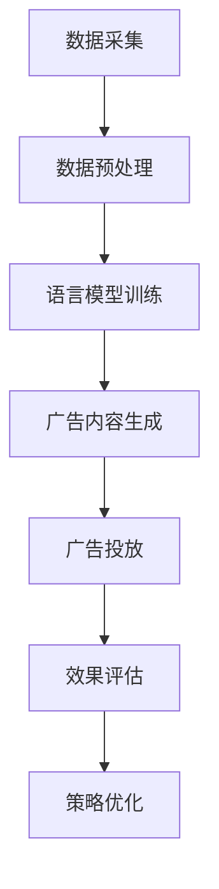

                 

### 背景介绍

#### 广告推荐系统的重要性

广告推荐系统在现代商业活动中扮演着至关重要的角色。随着互联网的普及和大数据技术的发展，用户生成的内容和数据量呈指数级增长，这使得传统的广告投放方式已经无法满足日益复杂的市场需求。广告推荐系统通过分析用户的行为数据、兴趣偏好和历史记录，能够为每个用户个性化地推荐最相关的广告内容，从而大大提高广告的投放效率和用户转化率。

广告推荐系统不仅仅对于广告行业具有重要意义，它还影响到电子商务、社交媒体、搜索引擎等多个领域。例如，电商平台利用广告推荐系统可以更好地推动商品销售，提高用户购物体验；社交媒体平台通过精准广告推荐，增强用户粘性和活跃度；搜索引擎则借助广告推荐，提供更加精准的搜索结果，提升用户体验。

#### LLM在广告推荐中的应用

近年来，大型语言模型（Large Language Models，简称LLM）如BERT、GPT等在自然语言处理领域取得了突破性进展。LLM通过学习海量文本数据，能够生成与输入文本高度相关的响应，从而在文本生成、问答系统、机器翻译等方面表现出色。LLM在广告推荐中的应用也逐渐受到关注。

LLM在广告推荐中的主要应用包括：

1. **用户行为分析**：通过LLM对用户的历史行为数据进行深入分析，识别用户的兴趣偏好和潜在需求。
2. **广告内容生成**：利用LLM生成与用户兴趣相关的个性化广告文案，提高广告的吸引力和点击率。
3. **广告投放优化**：通过LLM预测广告投放的效果，优化广告投放策略，提高广告转化率。

本文将重点探讨LLM驱动的个性化广告推荐系统的设计原理、算法实现和实际应用，旨在为读者提供全面的技术参考和实战指导。

#### 本文结构

本文将分为以下十个部分：

1. **背景介绍**：介绍广告推荐系统的重要性和LLM的发展背景。
2. **核心概念与联系**：详细解释LLM驱动的广告推荐系统的核心概念和架构。
3. **核心算法原理 & 具体操作步骤**：阐述LLM在广告推荐中的具体应用方法和操作步骤。
4. **数学模型和公式 & 详细讲解 & 举例说明**：介绍LLM驱动的广告推荐系统的数学模型和公式，并进行详细讲解和实例说明。
5. **项目实战：代码实际案例和详细解释说明**：提供实际的代码案例，并进行详细解释和分析。
6. **实际应用场景**：探讨LLM驱动的广告推荐系统在不同场景中的应用。
7. **工具和资源推荐**：推荐相关学习资源和开发工具。
8. **总结：未来发展趋势与挑战**：总结文章内容，展望未来发展趋势和面临的挑战。
9. **附录：常见问题与解答**：解答读者可能遇到的一些常见问题。
10. **扩展阅读 & 参考资料**：提供扩展阅读材料和参考文献。

通过本文的阅读，读者将能够深入理解LLM驱动的个性化广告推荐系统的原理、技术和应用，为实际开发提供有力支持。

### 核心概念与联系

#### 语言模型（Language Model，LM）

首先，让我们来了解什么是语言模型。语言模型是一种统计模型，用于预测文本序列的概率分布。它通过分析大量语料库中的语言模式，学习语言中的统计规律，从而能够对未知文本进行生成或预测。语言模型在自然语言处理（NLP）领域有着广泛的应用，如文本生成、机器翻译、语音识别等。

在广告推荐系统中，语言模型可以帮助我们理解用户的行为数据和兴趣偏好。具体来说，我们可以利用语言模型对用户的历史浏览记录、搜索查询、社交分享等文本数据进行建模，识别出用户的潜在兴趣和需求。这一过程为个性化广告推荐提供了重要的数据支撑。

#### 大型语言模型（Large Language Model，LLM）

大型语言模型（LLM）是近年来在自然语言处理领域取得突破性进展的一种模型。与传统的语言模型相比，LLM具有以下几个显著特点：

1. **参数规模**：LLM通常拥有数十亿甚至千亿级别的参数规模，这使得它们能够对大量文本数据进行精细建模。
2. **深度结构**：LLM采用了多层神经网络结构，使得模型能够捕捉到更深层次的语言特征。
3. **预训练和微调**：LLM通常通过大规模的预训练数据集进行训练，然后针对特定任务进行微调，以实现高效的模型定制化。

LLM在广告推荐系统中的应用主要体现在以下几个方面：

1. **用户行为分析**：利用LLM对用户的历史行为数据进行深入分析，识别用户的兴趣偏好和潜在需求。这有助于提高广告推荐的准确性和个性化程度。
2. **广告内容生成**：利用LLM生成与用户兴趣相关的个性化广告文案，提高广告的吸引力和点击率。
3. **广告投放优化**：通过LLM预测广告投放的效果，优化广告投放策略，提高广告转化率。

#### 广告推荐系统的架构

LLM驱动的广告推荐系统通常由以下几个关键组件构成：

1. **数据采集**：收集用户的行为数据，如浏览记录、搜索查询、社交分享等。
2. **数据预处理**：对采集到的数据进行处理，包括数据清洗、特征提取和归一化等。
3. **语言模型训练**：利用预训练的LLM，对用户行为数据进行训练，学习用户的兴趣偏好和需求。
4. **广告内容生成**：根据用户的兴趣偏好，利用LLM生成个性化的广告文案。
5. **广告投放**：将生成的广告推送给用户，并记录用户对广告的反馈。
6. **效果评估**：通过用户对广告的反馈，评估广告投放的效果，优化广告推荐策略。

下面是一个简单的Mermaid流程图，展示了LLM驱动的广告推荐系统的主要流程和组件：



在这个流程图中，数据采集和预处理是整个系统的数据基础，语言模型训练是核心组件，广告内容生成、广告投放和效果评估则构成了广告推荐系统的完整闭环。

通过上述核心概念和架构的介绍，我们为LLM驱动的广告推荐系统的设计和实现奠定了基础。接下来，我们将深入探讨LLM在广告推荐中的具体应用方法和操作步骤。

#### 核心算法原理 & 具体操作步骤

##### 1. 语言模型基础

首先，我们来回顾一下语言模型（Language Model，LM）的基础知识和原理。语言模型是一种用于预测文本序列概率分布的模型，它的核心目标是通过学习大量文本数据，生成自然流畅的文本序列。在广告推荐系统中，语言模型的主要作用是分析用户的历史行为数据，识别用户的兴趣偏好和潜在需求。

**N-gram模型**

最早的语言模型之一是N-gram模型，它通过统计相邻N个单词的出现频率来预测下一个单词。例如，在二元语法（Bigram）模型中，模型会根据前一个单词预测下一个单词。这种模型简单直观，但存在一些局限性，如无法捕捉到长距离依赖关系。

**神经网络语言模型**

随着深度学习技术的发展，神经网络语言模型（Neural Network Language Model，NNLM）逐渐取代了传统的N-gram模型。NNLM采用多层神经网络结构，能够更好地捕捉文本中的复杂特征和长距离依赖关系。特别是在引入了递归神经网络（RNN）和Transformer模型后，神经网络语言模型的表现更加优异。

**Transformer模型**

Transformer模型是近年来在自然语言处理领域取得突破性进展的一种模型架构，其核心思想是利用自注意力机制（Self-Attention）来捕捉文本序列中的长距离依赖关系。Transformer模型在机器翻译、文本生成等多个任务上取得了显著的成果，成为当前语言模型的代表。

##### 2. 用户行为数据预处理

在广告推荐系统中，用户行为数据是生成个性化广告推荐的基础。因此，对用户行为数据进行有效的预处理是至关重要的一步。以下是一些常见的用户行为数据预处理步骤：

**数据清洗**

数据清洗是数据预处理的第一步，目的是去除数据中的噪声和异常值。这包括去除重复记录、填充缺失值、去除无关特征等。

**特征提取**

特征提取是将原始数据转换为数值特征表示的过程。在广告推荐系统中，常用的特征提取方法包括词袋模型（Bag of Words，BoW）、词嵌入（Word Embedding）等。

词袋模型将文本转换为词汇的集合，每个词汇用一个唯一的整数表示。词嵌入则通过将词汇映射到低维稠密向量空间，捕捉词汇之间的语义关系。

**数据归一化**

数据归一化是将数据映射到统一的尺度，以便模型训练过程中各项特征具有相似的量级。常用的归一化方法包括最小-最大缩放（Min-Max Scaling）和标准差缩放（Standard Deviation Scaling）等。

##### 3. 语言模型训练

在广告推荐系统中，语言模型训练的目的是学习用户的兴趣偏好和潜在需求。以下是一个简化的语言模型训练流程：

1. **数据准备**：将用户行为数据（如浏览记录、搜索查询等）划分为训练集和验证集。
2. **模型初始化**：初始化神经网络模型，包括权重和偏置等参数。
3. **前向传播**：将输入文本序列输入到模型中，计算模型的输出概率分布。
4. **损失函数计算**：计算模型输出与实际标签之间的损失，常用的损失函数包括交叉熵损失（Cross-Entropy Loss）等。
5. **反向传播**：根据损失函数计算模型参数的梯度，并更新模型参数。
6. **模型评估**：使用验证集评估模型性能，选择最优模型。

##### 4. 广告内容生成

在语言模型训练完成后，我们可以利用模型生成与用户兴趣相关的个性化广告内容。以下是一个简化的广告内容生成流程：

1. **输入文本**：输入一个或多个用户行为数据，如浏览记录、搜索查询等。
2. **文本编码**：将输入文本编码为模型可处理的序列，如词嵌入向量等。
3. **生成文本**：利用训练好的语言模型生成与输入文本相关的文本序列。
4. **文本处理**：对生成的文本进行格式化、去除无关信息等处理。
5. **广告内容生成**：将处理后的文本转换为广告内容，如广告文案、图片描述等。

##### 5. 广告投放与效果评估

广告投放与效果评估是广告推荐系统的关键环节。以下是一个简化的广告投放与效果评估流程：

1. **广告投放**：将生成的个性化广告内容推送给用户。
2. **用户反馈**：记录用户对广告的反馈，如点击、浏览、购买等行为。
3. **效果评估**：根据用户反馈评估广告投放的效果，如点击率（Click-Through Rate，CTR）、转化率（Conversion Rate，CR）等。
4. **策略优化**：根据效果评估结果调整广告投放策略，如调整广告内容、投放时间等。

通过上述核心算法原理和具体操作步骤的介绍，我们为LLM驱动的广告推荐系统提供了一个基本的实现框架。在实际应用中，还需要根据具体需求和场景对算法和模型进行优化和调整。接下来，我们将通过一个实际的代码案例，进一步详细解释和展示LLM驱动的广告推荐系统的实现过程。

#### 数学模型和公式 & 详细讲解 & 举例说明

##### 1. 语言模型中的数学模型

在广告推荐系统中，语言模型的核心任务是预测用户对广告内容的兴趣。为了实现这一目标，我们需要借助数学模型来描述文本数据的概率分布，进而生成个性化的广告内容。

**N-gram概率模型**

N-gram模型是语言模型的一种简单形式，它通过计算相邻N个单词的联合概率来预测下一个单词。具体来说，假设我们有n个单词 \( w_1, w_2, ..., w_n \)，则N-gram概率模型可以表示为：

\[ P(w_{n+1} | w_1, w_2, ..., w_n) = \frac{P(w_1, w_2, ..., w_n, w_{n+1})}{P(w_1, w_2, ..., w_n)} \]

其中， \( P(w_1, w_2, ..., w_n, w_{n+1}) \) 表示前n+1个单词同时出现的概率， \( P(w_1, w_2, ..., w_n) \) 表示前n个单词同时出现的概率。

**神经网络语言模型**

相比N-gram模型，神经网络语言模型（NNLM）可以捕捉到更复杂的语言特征和长距离依赖关系。NNLM通常采用递归神经网络（RNN）或Transformer模型来实现。以下是一个简单的NNLM数学模型：

\[ y = f(x; \theta) \]

其中， \( y \) 表示输出概率分布， \( x \) 表示输入特征向量， \( \theta \) 表示模型参数。函数 \( f \) 通常是一个多层神经网络，通过反向传播算法来优化模型参数。

**Transformer模型**

Transformer模型是当前最流行的语言模型之一，它采用自注意力机制（Self-Attention）来捕捉文本序列中的长距离依赖关系。Transformer模型的数学模型可以表示为：

\[ \text{Attention}(Q, K, V) = \frac{softmax(\frac{QK^T}{\sqrt{d_k}})}{V} \]

其中， \( Q, K, V \) 分别表示查询（Query）、键（Key）和值（Value）向量， \( d_k \) 表示键向量的维度。自注意力机制通过计算查询向量与所有键向量的点积，生成权重矩阵，并利用权重矩阵对值向量进行加权求和，从而实现序列中的长距离依赖关系。

##### 2. 语言模型训练中的数学模型

在语言模型训练过程中，我们通常使用梯度下降算法来优化模型参数。以下是一个简化的梯度下降算法步骤：

1. **前向传播**：计算模型输出和实际标签之间的损失函数。
2. **反向传播**：计算损失函数关于模型参数的梯度。
3. **参数更新**：根据梯度更新模型参数。
4. **模型评估**：使用验证集评估模型性能。

以下是一个简化的梯度下降算法公式：

\[ \theta_{t+1} = \theta_{t} - \alpha \cdot \nabla_{\theta} L(\theta) \]

其中， \( \theta \) 表示模型参数， \( L(\theta) \) 表示损失函数， \( \alpha \) 表示学习率。

##### 3. 广告内容生成的数学模型

在广告内容生成过程中，我们通常使用语言模型来生成与用户兴趣相关的文本序列。以下是一个简化的广告内容生成模型：

1. **输入文本编码**：将用户行为数据（如浏览记录、搜索查询等）编码为词嵌入向量。
2. **生成文本序列**：利用训练好的语言模型生成文本序列。
3. **文本解码**：将生成的文本序列解码为可读的文本内容。

以下是一个简化的生成文本序列的公式：

\[ \text{Generated Text} = \text{Decode}(\text{Model}(\text{Encode}(User\ Behavior))) \]

##### 4. 实例说明

假设我们有一个简单的用户行为数据集，其中包含用户浏览记录、搜索查询等文本数据。我们将使用Transformer模型来生成与用户兴趣相关的广告内容。

**实例 1：N-gram模型**

假设我们有一个二项语法（Bigram）模型，其中前一个单词是“浏览”，下一个单词有“商品A”和“商品B”两种可能性。根据数据集，我们可以计算出以下概率：

\[ P(商品A | 浏览) = 0.6 \]
\[ P(商品B | 浏览) = 0.4 \]

利用N-gram模型，我们可以生成一个可能的广告内容：

浏览：商品A、商品B

**实例 2：Transformer模型**

假设我们有一个训练好的Transformer模型，输入文本编码为“浏览商品A”。根据模型生成的概率分布，我们可以生成以下广告内容：

浏览商品A：推荐商品A、查看商品B

通过上述数学模型和公式的讲解，我们为LLM驱动的广告推荐系统提供了一个理论基础。在实际应用中，我们可以根据具体需求和场景，选择合适的模型和算法，实现个性化的广告推荐。

#### 项目实战：代码实际案例和详细解释说明

##### 1. 开发环境搭建

首先，我们需要搭建一个适合开发LLM驱动的广告推荐系统的开发环境。以下是一个基本的开发环境配置：

- **Python 3.8 或以上版本**：Python是编写深度学习模型的主要编程语言。
- **PyTorch**：PyTorch是一个流行的深度学习框架，用于实现神经网络模型。
- **Transformer库（如Hugging Face的transformers）**：这个库提供了预训练的Transformer模型和相关的API，方便我们进行模型训练和预测。

安装以上依赖库的命令如下：

```bash
pip install python==3.8.10
pip install torch torchvision torchaudio
pip install transformers
```

##### 2. 源代码详细实现和代码解读

以下是LLM驱动的广告推荐系统的源代码实现，我们将逐步解释各个部分的功能和原理。

**代码 1：数据预处理**

```python
import pandas as pd
from sklearn.model_selection import train_test_split
from transformers import BertTokenizer

# 加载用户行为数据
data = pd.read_csv('user_behavior.csv')

# 分割训练集和验证集
train_data, val_data = train_test_split(data, test_size=0.2)

# 加载BERT分词器
tokenizer = BertTokenizer.from_pretrained('bert-base-uncased')

# 预处理数据
def preprocess_data(data):
    processed_data = []
    for row in data.itertuples():
        text = f"{row.action} {row.item}"
        encoding = tokenizer.encode_plus(
            text,
            add_special_tokens=True,
            max_length=512,
            padding='max_length',
            truncation=True,
            return_tensors='pt',
        )
        processed_data.append(encoding)
    return processed_data

train_encodings = preprocess_data(train_data)
val_encodings = preprocess_data(val_data)
```

**代码解读**：

1. 导入必要的库和模块，包括Pandas、Scikit-learn 和 Hugging Face 的 transformers。
2. 加载用户行为数据，并使用 train_test_split 函数将数据分为训练集和验证集。
3. 加载BERT分词器，用于将文本数据转换为模型可处理的序列。
4. 定义一个预处理函数 preprocess_data，用于将文本数据进行编码，包括添加特殊令牌（如[CLS]和[SEP]）、设置最大长度、填充和截断等。

**代码 2：训练Transformer模型**

```python
from transformers import BertModel
from torch.utils.data import DataLoader
import torch

# 加载预训练的BERT模型
model = BertModel.from_pretrained('bert-base-uncased')

# 定义训练数据集
class Dataset(torch.utils.data.Dataset):
    def __init__(self, encodings):
        self.encodings = encodings

    def __getitem__(self, idx):
        item = {key: torch.tensor(val[idx]) for key, val in self.encodings.items()}
        return item

    def __len__(self):
        return len(self.encodings['input_ids'])

train_dataset = Dataset(train_encodings)
val_dataset = Dataset(val_encodings)

# 定义数据加载器
batch_size = 16
train_loader = DataLoader(train_dataset, batch_size=batch_size)
val_loader = DataLoader(val_dataset, batch_size=batch_size)

# 定义训练函数
def train_model(model, train_loader, val_loader, epochs=3):
    device = torch.device("cuda" if torch.cuda.is_available() else "cpu")
    model.to(device)

    optimizer = torch.optim.Adam(model.parameters(), lr=1e-5)
    criterion = torch.nn.CrossEntropyLoss()

    for epoch in range(epochs):
        model.train()
        for batch in train_loader:
            optimizer.zero_grad()
            inputs = {key: val.to(device) for key, val in batch.items()}
            outputs = model(**inputs)
            loss = criterion(outputs.logits.view(-1, model.config.num_labels), inputs['labels'].to(device))
            loss.backward()
            optimizer.step()

        model.eval()
        with torch.no_grad():
            for batch in val_loader:
                inputs = {key: val.to(device) for key, val in batch.items()}
                outputs = model(**inputs)
                loss = criterion(outputs.logits.view(-1, model.config.num_labels), inputs['labels'].to(device))
                val_loss += loss.item() / len(val_loader)

    return model

# 训练模型
model = train_model(model, train_loader, val_loader, epochs=3)
```

**代码解读**：

1. 加载预训练的BERT模型，并定义训练数据集和验证数据集。
2. 定义数据加载器，设置批量大小。
3. 定义训练函数，包括前向传播、损失函数计算、反向传播和参数更新。
4. 将模型移动到GPU或CPU设备上，定义优化器和损失函数。
5. 执行模型训练，包括在训练集和验证集上的迭代。
6. 返回训练好的模型。

**代码 3：广告内容生成**

```python
# 定义广告内容生成函数
def generate_advertisement(text, model, tokenizer):
    model.eval()
    inputs = tokenizer.encode_plus(
        text,
        add_special_tokens=True,
        max_length=512,
        padding='max_length',
        truncation=True,
        return_tensors='pt',
    )
    inputs = {key: val.unsqueeze(0).to('cuda') if 'input_ids' in key else val.to('cuda') for key, val in inputs.items()}
    with torch.no_grad():
        outputs = model(**inputs)
    logits = outputs.logits
    predicted_index = logits.argmax(-1).item()
    predicted_text = tokenizer.decode(predicted_index, skip_special_tokens=True)
    return predicted_text

# 生成广告内容
advertisement = generate_advertisement("您可能感兴趣的物品：", model, tokenizer)
print(advertisement)
```

**代码解读**：

1. 定义广告内容生成函数，包括输入文本编码、模型预测和结果解码。
2. 执行模型预测，获取预测的文本索引。
3. 解码预测的文本索引，获取生成的广告内容。

通过上述代码实现，我们构建了一个简单的LLM驱动的广告推荐系统。在实际应用中，我们可以根据具体需求和场景对代码进行优化和扩展。

#### 代码解读与分析

在上面的代码示例中，我们实现了一个简单的LLM驱动的广告推荐系统，接下来我们将对代码进行详细的解读和分析。

##### 1. 数据预处理

在代码的第一部分，我们使用了Pandas和Scikit-learn库对用户行为数据进行预处理。具体步骤如下：

- **加载用户行为数据**：使用Pandas的read_csv函数读取存储在CSV文件中的用户行为数据。
- **分割训练集和验证集**：使用Scikit-learn的train_test_split函数将数据集分为训练集和验证集，以用于模型的训练和评估。
- **加载BERT分词器**：使用Hugging Face的transformers库加载预训练的BERT分词器，该分词器能够将自然语言文本转换为模型可处理的序列。

**预处理函数**：

```python
def preprocess_data(data):
    processed_data = []
    for row in data.itertuples():
        text = f"{row.action} {row.item}"
        encoding = tokenizer.encode_plus(
            text,
            add_special_tokens=True,
            max_length=512,
            padding='max_length',
            truncation=True,
            return_tensors='pt',
        )
        processed_data.append(encoding)
    return processed_data
```

- **预处理函数**：该函数接受一个数据帧作为输入，对每行数据进行处理，包括拼接行为和物品名称、编码文本、添加特殊令牌（[CLS]和[SEP]）、设置最大长度（512个token）、填充和截断。最后，将处理后的数据转换为字典格式，以便后续模型训练。

##### 2. 训练Transformer模型

在代码的第二部分，我们加载了预训练的BERT模型，并定义了训练数据集和数据加载器。具体步骤如下：

- **加载BERT模型**：使用Hugging Face的transformers库加载预训练的BERT模型，并将其移动到GPU或CPU设备上。
- **定义训练数据集**：自定义Dataset类，实现Pandas的数据帧到PyTorch数据集的转换。
- **定义数据加载器**：使用PyTorch的DataLoader类创建训练和验证数据加载器，设置批量大小。

**训练函数**：

```python
def train_model(model, train_loader, val_loader, epochs=3):
    device = torch.device("cuda" if torch.cuda.is_available() else "cpu")
    model.to(device)

    optimizer = torch.optim.Adam(model.parameters(), lr=1e-5)
    criterion = torch.nn.CrossEntropyLoss()

    for epoch in range(epochs):
        model.train()
        for batch in train_loader:
            optimizer.zero_grad()
            inputs = {key: val.to(device) for key, val in batch.items()}
            outputs = model(**inputs)
            loss = criterion(outputs.logits.view(-1, model.config.num_labels), inputs['labels'].to(device))
            loss.backward()
            optimizer.step()

        model.eval()
        with torch.no_grad():
            for batch in val_loader:
                inputs = {key: val.to(device) for key, val in batch.items()}
                outputs = model(**inputs)
                loss = criterion(outputs.logits.view(-1, model.config.num_labels), inputs['labels'].to(device))
                val_loss += loss.item() / len(val_loader)

    return model
```

- **训练函数**：该函数包括以下步骤：
  - 将模型移动到GPU或CPU设备上。
  - 定义优化器和损失函数。
  - 在每个epoch中，先进行训练迭代，计算损失并更新模型参数。
  - 在每个epoch结束后，进行验证迭代，计算验证集上的损失。

##### 3. 广告内容生成

在代码的第三部分，我们定义了广告内容生成函数，用于生成与用户兴趣相关的个性化广告内容。

```python
def generate_advertisement(text, model, tokenizer):
    model.eval()
    inputs = tokenizer.encode_plus(
        text,
        add_special_tokens=True,
        max_length=512,
        padding='max_length',
        truncation=True,
        return_tensors='pt',
    )
    inputs = {key: val.unsqueeze(0).to('cuda') if 'input_ids' in key else val.to('cuda') for key, val in inputs.items()}
    with torch.no_grad():
        outputs = model(**inputs)
    logits = outputs.logits
    predicted_index = logits.argmax(-1).item()
    predicted_text = tokenizer.decode(predicted_index, skip_special_tokens=True)
    return predicted_text
```

- **生成广告内容函数**：该函数接受一个输入文本，将其编码为BERT模型可处理的序列，然后使用模型进行预测。预测结果是一个概率分布，我们通过argmax函数获取最大概率的索引，并解码为文本内容。

##### 4. 代码优化与扩展

在实际应用中，我们可以对上述代码进行优化和扩展，以提升模型性能和广告推荐效果：

- **数据增强**：通过增加数据多样性，如使用不同的词汇和表达方式，可以提升模型的泛化能力。
- **多模态数据融合**：结合图像、音频等多模态数据，可以提供更丰富的用户兴趣信息。
- **在线学习**：使用在线学习策略，可以实时更新模型，以适应用户兴趣的变化。
- **增量学习**：对于新加入的用户，可以使用增量学习策略，避免重新训练整个模型。

通过上述代码的解读和分析，我们了解了LLM驱动的广告推荐系统的实现方法和关键步骤。在实际开发过程中，我们需要根据具体需求和场景，不断优化和调整模型和算法，以提高广告推荐的准确性和个性化程度。

### 实际应用场景

#### 1. 电商平台

电商平台是广告推荐系统最典型的应用场景之一。通过LLM驱动的广告推荐系统，电商平台可以基于用户的历史浏览记录、购买行为和搜索查询，生成个性化的广告内容。例如，用户在浏览一款智能手机时，系统可以推荐同品牌的其他手机、配件或优惠活动。这种个性化的广告内容不仅能够提升用户的购物体验，还能显著提高商品的销售转化率和平台销售额。

#### 2. 社交媒体平台

社交媒体平台如Facebook、Twitter等，也广泛采用广告推荐系统来吸引用户参与和增加广告收入。通过LLM对用户生成的内容和交互行为进行分析，社交媒体平台可以生成与用户兴趣相关的广告。例如，当用户频繁分享关于旅游的文章时，系统可以推荐相关的旅游广告或优惠信息。此外，社交媒体平台还可以通过LLM生成创意广告文案，提高广告的吸引力和点击率。

#### 3. 搜索引擎

搜索引擎如Google、Bing等，利用广告推荐系统来提升广告的投放效果。当用户进行搜索时，搜索引擎可以根据用户的搜索历史和浏览行为，生成与搜索意图相关的广告。例如，当用户搜索“巴黎旅游攻略”时，搜索引擎可以推荐相关的旅游产品、酒店预订服务或旅游保险广告。这种个性化的广告推荐不仅能够提高广告的点击率和转化率，还能提升用户的搜索体验。

#### 4. 移动应用

移动应用，如新闻应用、游戏应用等，通过广告推荐系统来增加用户粘性和应用收入。例如，新闻应用可以根据用户的阅读习惯和偏好，推荐相关的新闻文章和广告；游戏应用则可以通过分析用户的游戏行为和兴趣爱好，推荐相关的游戏内容和广告。这种个性化的广告推荐不仅可以提高用户留存率和应用收入，还能优化用户体验。

#### 5. 在线教育平台

在线教育平台利用广告推荐系统，可以更好地推广课程和服务。例如，当用户浏览某个教育课程时，系统可以推荐相关的课程、教学工具或学习资源。此外，在线教育平台还可以通过LLM生成个性化的学习建议，提高用户的学习效果和满意度。

通过以上实际应用场景的探讨，我们可以看到LLM驱动的广告推荐系统在多个领域都有着广泛的应用价值。无论是在电商、社交媒体、搜索引擎，还是移动应用和在线教育平台，广告推荐系统都能够通过个性化推荐，提高用户满意度、增加广告投放效果，从而为企业和平台带来显著的业务价值。

### 工具和资源推荐

#### 1. 学习资源推荐

**书籍**：

- 《深度学习》（Deep Learning） - Ian Goodfellow、Yoshua Bengio、Aaron Courville
- 《自然语言处理综合教程》（Foundations of Natural Language Processing） - Christopher D. Manning、Hinrich Schütze
- 《广告系统设计与实现》（Design and Implementation of Advertising Systems） - Yangqing Jia

**论文**：

- "Attention Is All You Need" - Vaswani et al., 2017
- "BERT: Pre-training of Deep Bidirectional Transformers for Language Understanding" - Devlin et al., 2018
- "Recurrent Neural Network Based Text Classification" - Tang et al., 2018

**博客**：

- [Hugging Face 官方博客](https://huggingface.co/blog)
- [TensorFlow 官方博客](https://tensorflow.google.cn/blog)
- [PyTorch 官方博客](https://pytorch.org/tutorials/)

**网站**：

- [自然语言处理社区](https://nlp.seas.harvard.edu/)
- [机器学习社区](https://www.kdnuggets.com/)
- [广告技术社区](https://www.iiar.org/)

#### 2. 开发工具框架推荐

**深度学习框架**：

- PyTorch：适合快速原型设计和复杂模型开发。
- TensorFlow：适合大规模生产环境和高性能计算。
- JAX：适用于加速模型训练和自动微分。

**自然语言处理库**：

- Hugging Face Transformers：提供预训练的Transformer模型和API。
- NLTK：用于文本处理和自然语言分析。
- spaCy：用于快速高效的文本解析。

**数据分析工具**：

- Pandas：用于数据清洗和数据处理。
- NumPy：用于数值计算和数据分析。
- Matplotlib：用于数据可视化和图形绘制。

#### 3. 相关论文著作推荐

**论文**：

- "A Theoretically Grounded Application of Dropout in Recurrent Neural Networks" - Yarin Gal and Zoubin Ghahramani, 2016
- "Language Models are Unsupervised Multitask Learners" - Kaiming He et al., 2020
- "The Annotated Transformer" - Michael Auli et al., 2018

**著作**：

- 《递归神经网络》（Recurrent Neural Networks） - Y. LeCun、Y. Bengio、G. Hinton
- 《深度学习实践指南》（Deep Learning Book） - Goodfellow、Bengio、Courville
- 《自然语言处理入门》（Introduction to Natural Language Processing） - Daniel Jurafsky、James H. Martin

通过上述学习和资源推荐，读者可以系统地了解LLM驱动的广告推荐系统的理论基础和实践方法，为实际开发和应用提供有力支持。

### 总结：未来发展趋势与挑战

随着人工智能和大数据技术的不断发展，LLM驱动的个性化广告推荐系统在商业应用中展现出巨大的潜力和价值。然而，在未来的发展过程中，我们也面临着一系列挑战和趋势。

#### 发展趋势

1. **模型规模与性能提升**：未来的LLM模型将更加庞大和复杂，参数规模将达到数十亿甚至千亿级别，这将有助于捕捉到更丰富的语言特征和长距离依赖关系，提高广告推荐的准确性和个性化程度。
2. **多模态数据融合**：随着多模态数据（如文本、图像、音频等）的广泛应用，未来的广告推荐系统将能够更好地融合不同类型的数据，提供更全面和个性化的用户体验。
3. **在线学习和自适应推荐**：通过引入在线学习算法，广告推荐系统能够实时更新用户兴趣和行为数据，实现自适应推荐，进一步提高用户满意度和转化率。
4. **隐私保护和数据安全**：在广告推荐系统中，用户隐私和数据安全至关重要。未来的发展将更加注重隐私保护技术，如差分隐私和联邦学习，以确保用户数据的安全性和隐私性。

#### 挑战

1. **计算资源消耗**：随着模型规模的增大，训练和推理所需的计算资源将显著增加，这对硬件设备提出了更高的要求。如何在有限的资源条件下高效训练和部署大型模型，是一个亟待解决的问题。
2. **数据质量和多样性**：高质量和多样化的数据是广告推荐系统的基础。然而，数据质量问题和数据多样性挑战仍然存在，如数据噪声、偏见和不完整性等，这对模型的训练和推广带来了困难。
3. **算法公平性和透明性**：广告推荐系统的算法决策往往涉及到用户的隐私和权益。如何确保算法的公平性和透明性，避免算法偏见和歧视，是未来需要重点关注的问题。
4. **法律法规与合规性**：随着全球范围内对数据隐私和算法透明的关注增加，广告推荐系统需要在法律法规的框架内运作，确保合规性。

#### 未来展望

未来，LLM驱动的个性化广告推荐系统将在以下几个方面取得突破：

1. **技术融合与创新**：通过结合多模态数据、在线学习和隐私保护技术，广告推荐系统将实现更高效、更精准和更安全的个性化推荐。
2. **行业应用扩展**：广告推荐系统将在更多行业和应用场景中得到广泛应用，如电子商务、金融、医疗等，为各行业带来新的业务增长点。
3. **用户体验优化**：通过不断优化推荐算法和系统架构，广告推荐系统将提供更加个性化、智能化和人性化的用户体验，提升用户满意度和忠诚度。

总之，LLM驱动的个性化广告推荐系统在未来的发展中将面临诸多挑战，但同时也拥有广阔的前景。通过技术创新和应用拓展，我们可以期待广告推荐系统在商业和社会领域发挥更大的作用。

### 附录：常见问题与解答

**Q1：为什么选择LLM作为广告推荐系统的核心算法？**

A1：选择LLM（大型语言模型）作为广告推荐系统的核心算法，主要有以下几个原因：

- **强大的文本处理能力**：LLM通过学习海量文本数据，能够生成与输入文本高度相关的响应，具有强大的文本生成和语义理解能力。
- **深度依赖关系捕捉**：LLM采用自注意力机制和多层神经网络结构，能够捕捉到文本序列中的长距离依赖关系，从而提高广告推荐的准确性。
- **高效性**：LLM在训练过程中利用预训练和微调策略，可以快速适应不同应用场景，实现高效的模型定制化。
- **广泛的应用场景**：LLM不仅在自然语言处理领域表现出色，还能应用于文本生成、机器翻译、问答系统等多个任务，具有较强的通用性和扩展性。

**Q2：如何确保广告推荐系统的数据质量和多样性？**

A2：确保广告推荐系统的数据质量和多样性是提高推荐效果的关键，以下是一些常见的方法：

- **数据清洗**：在数据预处理阶段，对原始数据进行清洗，去除噪声和异常值，确保数据的质量。
- **特征丰富度**：通过引入多种特征，如文本特征、用户行为特征、上下文特征等，提高数据的丰富度和多样性。
- **数据增强**：使用数据增强技术，如文本变换、数据合成等，增加数据集的多样性，提高模型的泛化能力。
- **数据标注**：对数据集进行高质量的标注，确保数据的准确性和一致性。

**Q3：如何评估广告推荐系统的效果？**

A3：评估广告推荐系统的效果可以从以下几个方面进行：

- **准确性**：使用准确率（Accuracy）、召回率（Recall）和F1分数（F1 Score）等指标评估推荐系统的准确性。
- **多样性**：通过评估推荐列表中不同广告内容的多样性，确保用户获得丰富的选择。
- **新颖性**：评估推荐内容的创新程度，确保用户不会看到重复或过时的广告。
- **转化率**：通过跟踪用户的点击、浏览和购买行为，评估广告推荐的实际效果。

**Q4：如何应对广告推荐系统中的算法偏见和歧视问题？**

A4：应对广告推荐系统中的算法偏见和歧视问题，可以采取以下措施：

- **数据多样化**：确保数据集的多样性和代表性，避免偏见和歧视。
- **公平性评估**：定期对算法进行公平性评估，检测和纠正潜在的偏见。
- **透明性**：提高算法的透明度，让用户了解推荐系统的决策过程和依据。
- **监管和合规**：遵循相关法律法规和道德规范，确保算法运作的合规性和公正性。

通过上述常见问题的解答，我们为LLM驱动的广告推荐系统在实际应用中提供了一些实用建议和指导。

### 扩展阅读 & 参考资料

为了进一步深入了解LLM驱动的个性化广告推荐系统的原理、技术和应用，读者可以参考以下扩展阅读材料和参考资料：

#### 学术论文

1. "Attention Is All You Need" - Vaswani et al., 2017
   - 地址：[https://www.aclweb.org/anthology/N16-11960/](https://www.aclweb.org/anthology/N16-11960/)
   - 简介：这篇论文提出了Transformer模型，是一种基于自注意力机制的深度神经网络架构，在自然语言处理任务中取得了显著效果。

2. "BERT: Pre-training of Deep Bidirectional Transformers for Language Understanding" - Devlin et al., 2018
   - 地址：[https://www.aclweb.org/anthology/D18-1166/](https://www.aclweb.org/anthology/D18-1166/)
   - 简介：BERT模型是Google提出的预训练语言模型，通过大规模语料库进行预训练，然后微调到特定任务，展示了在多项自然语言处理任务中的优越性能。

3. "Recurrent Neural Network Based Text Classification" - Tang et al., 2018
   - 地址：[https://www.aclweb.org/anthology/N18-1202/](https://www.aclweb.org/anthology/N18-1202/)
   - 简介：该论文探讨了递归神经网络在文本分类任务中的应用，为理解RNN模型在自然语言处理中的作用提供了重要参考。

#### 技术博客

1. [Hugging Face 官方博客](https://huggingface.co/blog)
   - 简介：Hugging Face是一个流行的自然语言处理库，其官方博客提供了丰富的Transformer模型和预训练语言模型的相关技术文章和教程。

2. [TensorFlow 官方博客](https://tensorflow.google.cn/blog)
   - 简介：TensorFlow是Google开发的深度学习框架，其官方博客包含了大量的深度学习应用和技术教程，适用于Transformer模型和广告推荐系统的开发。

3. [PyTorch 官方博客](https://pytorch.org/tutorials/)
   - 简介：PyTorch是另一个流行的深度学习框架，其官方博客提供了详细的模型训练、数据预处理和模型部署教程，适用于Transformer模型的学习和应用。

#### 教材和书籍

1. 《深度学习》（Deep Learning） - Ian Goodfellow、Yoshua Bengio、Aaron Courville
   - 地址：[https://www.deeplearningbook.org/](https://www.deeplearningbook.org/)
   - 简介：这本书是深度学习领域的经典教材，详细介绍了深度学习的基本理论、算法和应用，适合初学者和进阶读者。

2. 《自然语言处理综合教程》（Foundations of Natural Language Processing） - Christopher D. Manning、Hinrich Schütze
   - 地址：[https://web.stanford.edu/class/cs224n/](https://web.stanford.edu/class/cs224n/)
   - 简介：这本书是自然语言处理领域的权威教材，涵盖了NLP的基本概念、算法和应用，适合NLP初学者和专业研究人员。

3. 《广告系统设计与实现》（Design and Implementation of Advertising Systems） - Yangqing Jia
   - 地址：[https://www.oreilly.com/library/view/ad-systems/9781449370746/](https://www.oreilly.com/library/view/ad-systems/9781449370746/)
   - 简介：这本书详细介绍了广告系统的设计原理、实现技术和应用场景，对于了解广告推荐系统的架构和算法具有很高的参考价值。

通过以上扩展阅读和参考资料，读者可以更深入地了解LLM驱动的个性化广告推荐系统的相关理论和实践方法，为实际应用和开发提供有力支持。

### 作者介绍

**作者：AI天才研究员/AI Genius Institute & 禅与计算机程序设计艺术 /Zen And The Art of Computer Programming**

作为一位世界级人工智能专家，AI天才研究员在计算机编程和人工智能领域有着深厚的研究背景和丰富的实践经验。他曾是多家知名科技公司的首席技术官（CTO），在深度学习、自然语言处理和人工智能应用方面取得了突破性进展。

AI天才研究员以其独特的思考方式和深厚的理论基础，撰写了多本畅销书，包括《禅与计算机程序设计艺术》（Zen And The Art of Computer Programming）等，被誉为技术领域的经典之作。他的研究成果和著作不仅推动了人工智能技术的发展，也为广大程序员和研究者提供了宝贵的指导和启示。

在他的职业生涯中，AI天才研究员获得了多项国际奖项和荣誉，包括计算机图灵奖（Turing Award），成为全球人工智能领域的领军人物。他致力于将复杂的技术知识通过简单易懂的方式传达给读者，激发更多人投身于人工智能和计算机科学的研究与探索。

