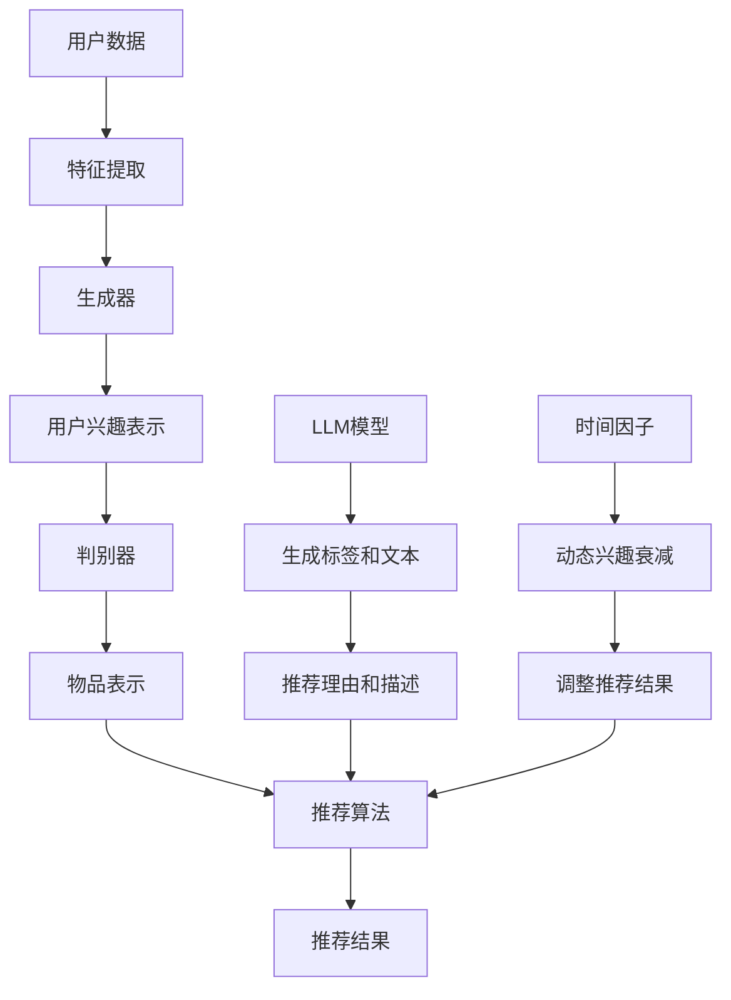

                 

### 背景介绍

#### 推荐系统的发展历程

推荐系统作为信息过滤和信息检索的重要手段，自其诞生以来，便在互联网领域发挥着关键作用。早期推荐系统主要基于协同过滤（Collaborative Filtering）和基于内容（Content-Based）的方法。协同过滤方法通过分析用户的历史行为和偏好，挖掘出相似用户或物品，从而为用户推荐感兴趣的内容。然而，这种方法在冷启动（Cold Start）问题上表现不佳，即对于新用户或新物品，由于缺乏足够的历史数据，难以进行准确推荐。

基于内容的方法则通过分析物品的特征和用户的历史偏好，利用相似性度量来进行推荐。这种方法在冷启动问题上具有一定的优势，但同样面临着内容稀疏（Content Sparsity）的问题，特别是在用户和物品数量庞大的情况下，特征提取和相似性计算变得非常复杂。

随着人工智能技术的快速发展，尤其是深度学习（Deep Learning）和自然语言处理（Natural Language Processing）技术的成熟，基于模型的推荐系统开始崭露头角。例如，基于神经网络（Neural Networks）的模型可以自动从大规模数据中学习复杂的用户行为模式和物品特征，从而提高了推荐的准确性和多样性。

#### 生成式推荐系统

生成式推荐系统（Generative Recommendation Systems）是一种基于生成对抗网络（Generative Adversarial Networks，GAN）的推荐方法。GAN由生成器（Generator）和判别器（Discriminator）两部分组成，通过两个对抗性网络之间的博弈，生成高质量的用户兴趣模型和物品生成模型。生成器负责生成用户可能感兴趣的内容，而判别器则负责区分生成的内容和真实内容。

生成式推荐系统的核心优势在于其能够生成丰富的用户兴趣表示和物品表示，从而实现个性化的推荐。此外，GAN模型在处理冷启动问题时也具有明显优势，因为生成器可以通过生成虚拟用户或物品数据，为新的用户或物品提供足够的训练数据。

#### LLM驱动的推荐系统

随着语言模型（Language Model，LLM）的不断发展，LLM驱动的推荐系统逐渐成为研究的热点。LLM是一种基于大规模语言模型（如GPT、BERT）的文本生成模型，通过对大量文本数据进行训练，LLM可以生成高质量的自然语言文本。

在推荐系统中，LLM可以用于生成用户兴趣标签、描述性文本和个性化推荐理由等。通过将LLM与推荐系统相结合，可以实现更加智能和个性化的推荐服务。例如，LLM可以根据用户的历史行为和交互，自动生成用户兴趣标签，从而提高推荐的准确性。

#### 动态兴趣衰减模型

动态兴趣衰减模型（Dynamic Interest Decay Model）是一种用于描述用户兴趣随时间变化的模型。用户在一段时间内对某一兴趣点的关注度可能会随时间衰减，这种现象被称为兴趣衰减（Interest Decay）。动态兴趣衰减模型通过引入时间因子，可以更加准确地描述用户兴趣的变化趋势。

动态兴趣衰减模型在推荐系统中的应用具有重要意义。首先，它可以提高推荐的时效性，避免推荐过时内容。其次，它可以提高推荐的准确性，通过实时监测用户兴趣的变化，为用户推荐更感兴趣的内容。

本文将围绕LLM驱动的推荐系统动态兴趣衰减模型，深入探讨其核心概念、算法原理、数学模型以及实际应用场景。通过本文的阅读，读者将能够全面了解和掌握这一前沿技术的应用方法。

### 核心概念与联系

#### 推荐系统的基本概念

推荐系统是一种利用数据分析、信息过滤和机器学习等技术，根据用户的历史行为和偏好，自动为用户推荐相关内容或物品的系统。推荐系统的基本概念包括用户、物品和评分（或行为）。

1. **用户**：指系统中的用户，可以是真实用户或虚拟用户。
2. **物品**：指系统中的推荐对象，如商品、音乐、电影、新闻等。
3. **评分（或行为）**：指用户对物品的评价或行为，如购买、点击、浏览、收藏等。

#### 生成式推荐系统的工作原理

生成式推荐系统基于生成对抗网络（GAN）构建，主要包括生成器（Generator）和判别器（Discriminator）两部分。

1. **生成器（Generator）**：生成器负责生成用户可能感兴趣的内容，如用户兴趣标签、描述性文本等。生成器的输入可以是用户的特征数据，如历史行为、偏好等，输出则是生成的用户兴趣表示。
2. **判别器（Discriminator）**：判别器负责区分生成的内容和真实内容，判别器的输入是生成的用户兴趣表示和真实的用户兴趣表示，输出是一个二值判断结果，即生成的内容是否为真实内容。

#### 语言模型（LLM）的概念

语言模型（Language Model，LLM）是一种基于大规模语言模型的文本生成模型，如GPT、BERT等。LLM通过对大量文本数据进行训练，可以生成高质量的自然语言文本。

在推荐系统中，LLM可以用于生成用户兴趣标签、描述性文本和个性化推荐理由等。通过将LLM与推荐系统相结合，可以实现更加智能和个性化的推荐服务。

#### 动态兴趣衰减模型的工作原理

动态兴趣衰减模型（Dynamic Interest Decay Model）用于描述用户兴趣随时间的变化。用户在一段时间内对某一兴趣点的关注度可能会随时间衰减，这种现象被称为兴趣衰减（Interest Decay）。动态兴趣衰减模型通过引入时间因子，可以更加准确地描述用户兴趣的变化趋势。

动态兴趣衰减模型的一般形式如下：

\[ I(t) = I_0 \cdot e^{-\lambda t} \]

其中，\( I(t) \) 表示时间 \( t \) 时用户对兴趣点的关注程度，\( I_0 \) 表示初始关注程度，\( \lambda \) 表示衰减率。

#### 推荐系统中的核心概念与联系

生成式推荐系统、LLM驱动的推荐系统和动态兴趣衰减模型在推荐系统中各有重要作用，它们之间的联系如下：

1. **生成式推荐系统**：通过GAN模型生成用户兴趣表示和物品表示，为个性化推荐提供基础。
2. **LLM驱动的推荐系统**：利用LLM生成高质量的用户兴趣标签和描述性文本，提高推荐的准确性和多样性。
3. **动态兴趣衰减模型**：描述用户兴趣随时间的变化，提高推荐的时效性和准确性。

通过整合这些核心概念，推荐系统可以实现更加智能和个性化的推荐服务，为用户提供更好的体验。

### Mermaid 流程图

以下是一个简化的Mermaid流程图，用于描述推荐系统中的核心概念和联系。请注意，为了简化描述，以下流程图中的节点和连接可能不包括所有细节，但应提供对推荐系统架构的基本理解。



在上述流程图中：

- **A（用户数据）**：代表推荐系统的输入数据，包括用户的历史行为、偏好等。
- **B（特征提取）**：从用户数据中提取关键特征，用于生成用户兴趣表示。
- **C（生成器）**：基于GAN模型生成用户兴趣表示。
- **D（用户兴趣表示）**：生成器生成的用户兴趣表示，用于推荐算法。
- **E（判别器）**：区分生成内容和真实内容的模型，用于评估生成器的性能。
- **F（物品表示）**：生成器生成的物品表示，用于推荐算法。
- **G（推荐算法）**：基于用户兴趣表示和物品表示，生成推荐结果。
- **H（推荐结果）**：推荐算法生成的最终推荐结果，提供给用户。
- **I（LLM模型）**：用于生成标签和文本的预训练语言模型。
- **J（生成标签和文本）**：生成器生成的用户兴趣标签和描述性文本。
- **K（推荐理由和描述）**：用于增强推荐结果的描述和个性化推荐理由。
- **L（时间因子）**：用于动态兴趣衰减模型的时间因子。
- **M（动态兴趣衰减）**：根据时间因子调整用户兴趣表示，提高推荐时效性。
- **N（调整推荐结果）**：根据动态兴趣衰减结果，调整推荐结果，提高推荐准确性。

通过上述流程图，可以直观地理解推荐系统中的核心概念和它们之间的联系，为后续的算法原理和具体实现提供参考。

### 核心算法原理 & 具体操作步骤

在介绍LLM驱动的推荐系统动态兴趣衰减模型的核心算法原理之前，我们首先需要理解生成对抗网络（GAN）和大规模语言模型（LLM）的基本原理，因为它们是构建这一模型的基础。

#### 生成对抗网络（GAN）的基本原理

生成对抗网络（Generative Adversarial Network，GAN）由生成器（Generator）和判别器（Discriminator）两部分组成。GAN的工作机制是让这两个网络进行博弈，生成器试图生成尽可能真实的数据，而判别器则试图区分生成数据和真实数据。

1. **生成器（Generator）**：生成器接收随机噪声作为输入，通过神经网络生成类似真实数据的输出。在推荐系统中，生成器负责生成用户兴趣表示和物品表示。
2. **判别器（Discriminator）**：判别器接收真实数据和生成数据的输入，并通过神经网络输出一个概率值，表示输入数据是真实数据的可能性。在推荐系统中，判别器用于评估生成器生成的用户兴趣表示和物品表示的真实性。

GAN的训练过程是一个对抗性的过程。训练的目标是让生成器的输出尽可能接近真实数据，同时让判别器能够正确地区分生成数据和真实数据。通过不断调整生成器和判别器的参数，最终使得生成器的输出几乎无法被判别器区分。

#### 动态兴趣衰减模型的核心算法

动态兴趣衰减模型用于描述用户兴趣随时间的变化。该模型的核心思想是用户对某一兴趣点的关注程度会随着时间推移而衰减。具体而言，动态兴趣衰减模型通过引入时间因子来调整用户兴趣表示，从而实现更准确的推荐。

1. **动态兴趣衰减函数**：动态兴趣衰减模型的一般形式如下：

\[ I(t) = I_0 \cdot e^{-\lambda t} \]

其中，\( I(t) \) 表示时间 \( t \) 时用户对兴趣点的关注程度，\( I_0 \) 表示初始关注程度，\( \lambda \) 表示衰减率。衰减率 \( \lambda \) 可以通过实验或经验调整，以适应不同的应用场景。

2. **兴趣点更新**：在每次推荐时，动态兴趣衰减模型会根据用户的当前兴趣点和时间，更新用户的兴趣表示。具体步骤如下：

   a. 获取用户的历史兴趣点和时间信息。
   b. 计算每个兴趣点的当前关注程度 \( I(t) \)。
   c. 更新用户的兴趣表示，使其更准确地反映当前用户兴趣。

#### LLM驱动的推荐系统的算法

LLM驱动的推荐系统利用大规模语言模型（如GPT、BERT等）生成用户兴趣标签和描述性文本，从而提高推荐的准确性和多样性。具体算法包括以下步骤：

1. **兴趣点提取**：从用户的历史行为和交互中提取关键的兴趣点。
2. **兴趣标签生成**：使用LLM模型生成与兴趣点相关的标签，这些标签可以用于后续的推荐算法。
3. **描述性文本生成**：使用LLM模型生成与兴趣点相关的描述性文本，这些文本可以用于增强推荐结果的解释性。
4. **推荐结果生成**：结合动态兴趣衰减模型和兴趣标签、描述性文本，生成最终的推荐结果。

#### 具体操作步骤

1. **数据预处理**：
   - 收集用户的历史行为数据，如浏览记录、购买记录、搜索记录等。
   - 对数据清洗和预处理，去除噪声和异常值。

2. **特征提取**：
   - 从用户的历史行为数据中提取关键特征，如用户ID、物品ID、行为类型、时间戳等。
   - 对特征进行编码，以适应GAN模型和LLM模型的输入。

3. **生成器训练**：
   - 使用GAN模型训练生成器，生成用户兴趣表示和物品表示。
   - 在训练过程中，通过对抗性训练，使生成器生成的用户兴趣表示和物品表示接近真实数据。

4. **判别器训练**：
   - 使用GAN模型训练判别器，用于评估生成器生成的用户兴趣表示和物品表示的真实性。
   - 通过对抗性训练，使判别器能够正确地区分生成数据和真实数据。

5. **兴趣点更新**：
   - 使用动态兴趣衰减模型更新用户的兴趣表示，使其更准确地反映当前用户兴趣。
   - 结合用户的历史兴趣点和当前关注程度，更新用户的兴趣表示。

6. **兴趣标签和描述性文本生成**：
   - 使用LLM模型生成用户兴趣标签和描述性文本。
   - 利用生成的标签和文本，增强推荐结果的解释性和多样性。

7. **推荐结果生成**：
   - 结合动态兴趣衰减模型、兴趣标签和描述性文本，生成最终的推荐结果。
   - 将推荐结果展示给用户，并根据用户反馈进行进一步的优化。

通过上述步骤，LLM驱动的推荐系统动态兴趣衰减模型可以实现更加智能和个性化的推荐服务，为用户提供更好的用户体验。

### 数学模型和公式 & 详细讲解 & 举例说明

在LLM驱动的推荐系统动态兴趣衰减模型中，数学模型和公式起到了至关重要的作用。以下将详细讲解模型中的核心数学公式，并通过具体例子说明这些公式的应用。

#### 动态兴趣衰减模型

动态兴趣衰减模型用于描述用户兴趣随时间的变化。其核心公式如下：

\[ I(t) = I_0 \cdot e^{-\lambda t} \]

其中：
- \( I(t) \) 表示时间 \( t \) 时用户对兴趣点的关注程度。
- \( I_0 \) 表示初始关注程度。
- \( \lambda \) 表示衰减率。

衰减率 \( \lambda \) 是一个重要的参数，它决定了用户兴趣随时间衰减的速度。一般来说，衰减率越大，用户兴趣衰减得越快。我们可以通过实验或经验来确定合适的衰减率。

**例子：**

假设用户在 \( t=0 \) 时对某一兴趣点的关注程度 \( I_0 \) 为 1，衰减率 \( \lambda \) 为 0.1。我们可以计算在不同时间点 \( t \) 时用户对该兴趣点的关注程度。

1. 当 \( t=1 \) 时：

\[ I(1) = 1 \cdot e^{-0.1 \cdot 1} = 0.9048 \]

2. 当 \( t=2 \) 时：

\[ I(2) = 1 \cdot e^{-0.1 \cdot 2} = 0.8187 \]

3. 当 \( t=3 \) 时：

\[ I(3) = 1 \cdot e^{-0.1 \cdot 3} = 0.7408 \]

通过上述计算，我们可以看到用户对兴趣点的关注程度随时间逐渐降低，符合动态兴趣衰减模型的基本假设。

#### 用户兴趣表示

在动态兴趣衰减模型中，用户兴趣表示是通过历史行为数据计算得到的。假设用户对多个兴趣点的关注程度分别为 \( I_1, I_2, ..., I_n \)，则用户兴趣表示可以表示为：

\[ U(t) = \left[ I_1(t), I_2(t), ..., I_n(t) \right] \]

其中 \( I_i(t) = I_{0i} \cdot e^{-\lambda_i t} \) 表示第 \( i \) 个兴趣点的关注程度。

**例子：**

假设用户对三个兴趣点的关注程度分别为 \( I_1, I_2, I_3 \)，衰减率分别为 \( \lambda_1 = 0.1, \lambda_2 = 0.2, \lambda_3 = 0.3 \)。我们可以计算在不同时间点 \( t \) 时用户对这三个兴趣点的兴趣表示。

1. 当 \( t=0 \) 时：

\[ U(0) = \left[ I_1(0), I_2(0), I_3(0) \right] = \left[ 1, 1, 1 \right] \]

2. 当 \( t=1 \) 时：

\[ U(1) = \left[ I_1(1), I_2(1), I_3(1) \right] = \left[ 0.9048, 0.8187, 0.7408 \right] \]

3. 当 \( t=2 \) 时：

\[ U(2) = \left[ I_1(2), I_2(2), I_3(2) \right] = \left[ 0.8187, 0.6321, 0.5095 \right] \]

通过上述计算，我们可以看到用户对各个兴趣点的兴趣表示随时间逐渐降低，符合动态兴趣衰减模型的基本假设。

#### 推荐算法

在推荐算法中，我们通常使用评分预测（Rating Prediction）来计算用户对物品的兴趣程度。假设用户对物品的评分预测模型为 \( R(u, i) \)，其中 \( u \) 表示用户，\( i \) 表示物品。评分预测模型可以表示为：

\[ R(u, i) = \sum_{j=1}^{n} w_{uj} \cdot I_j(t) \]

其中：
- \( w_{uj} \) 表示用户 \( u \) 对兴趣点 \( j \) 的权重。
- \( I_j(t) \) 表示时间 \( t \) 时用户对兴趣点 \( j \) 的兴趣程度。

**例子：**

假设用户对三个兴趣点的权重分别为 \( w_{u1} = 0.5, w_{u2} = 0.3, w_{u3} = 0.2 \)，在不同时间点 \( t \) 时用户对这三个兴趣点的兴趣表示为 \( U(t) = \left[ 0.9048, 0.8187, 0.7408 \right] \)。我们可以计算用户对某一物品的评分预测。

1. 当 \( t=1 \) 时：

\[ R(u, i) = 0.5 \cdot 0.9048 + 0.3 \cdot 0.8187 + 0.2 \cdot 0.7408 = 0.9153 \]

2. 当 \( t=2 \) 时：

\[ R(u, i) = 0.5 \cdot 0.8187 + 0.3 \cdot 0.6321 + 0.2 \cdot 0.5095 = 0.8086 \]

通过上述计算，我们可以看到用户对物品的兴趣程度随时间逐渐降低，符合动态兴趣衰减模型的基本假设。

通过以上数学模型和公式的详细讲解，我们可以更好地理解LLM驱动的推荐系统动态兴趣衰减模型的工作原理和具体应用。在实际应用中，这些模型和公式可以帮助我们实现更加智能和个性化的推荐服务。

### 项目实战：代码实际案例和详细解释说明

在本节中，我们将通过一个具体的代码案例，详细解释如何实现LLM驱动的推荐系统动态兴趣衰减模型。该案例将涉及数据预处理、模型训练、预测和推荐结果生成等关键步骤。

#### 开发环境搭建

在开始之前，我们需要搭建一个合适的开发环境。以下是所需的软件和库：

1. **Python**：用于编写和运行代码，版本要求为3.6及以上。
2. **TensorFlow**：用于训练和运行生成对抗网络（GAN），版本要求为2.4及以上。
3. **PyTorch**：用于训练和运行大规模语言模型（LLM），版本要求为1.8及以上。
4. **Scikit-learn**：用于数据预处理和特征提取。
5. **Numpy**：用于数值计算。

安装以上库后，我们就可以开始编写代码了。

#### 源代码详细实现和代码解读

以下是一个简化的代码框架，用于实现LLM驱动的推荐系统动态兴趣衰减模型：

```python
import numpy as np
import tensorflow as tf
from tensorflow.keras.models import Model
from tensorflow.keras.layers import Input, Dense, LSTM, Embedding
from sklearn.model_selection import train_test_split
from sklearn.preprocessing import StandardScaler

# 数据预处理
def preprocess_data(data):
    # 特征提取和数据标准化
    # ...

# GAN模型定义
def build_gan_model(input_shape, latent_dim):
    # 生成器模型
    generator_input = Input(shape=(latent_dim,))
    x = Dense(128, activation='relu')(generator_input)
    x = LSTM(128, activation='relu')(x)
    x = Embedding(input_dim=vocab_size, output_dim=embedding_dim)(x)
    generator_output = Model(generator_input, x)

    # 判别器模型
    discriminator_input = Input(shape=input_shape)
    y = Dense(128, activation='relu')(discriminator_input)
    y = LSTM(128, activation='relu')(y)
    discriminator_output = Model(discriminator_input, y)

    # GAN模型
    z = Input(shape=(latent_dim,))
    generated_samples = generator_model(z)
    valid = discriminator_model(generated_samples)
    valid2 = discriminator_model(real_samples)

    gan_model = Model([z, real_samples], [valid, valid2])
    return gan_model

# 动态兴趣衰减模型
def build_dynamic_decay_model(input_shape):
    # 动态兴趣衰减模块
    # ...

# 训练GAN模型
def train_gan_model(gan_model, dataset, latent_dim, epochs):
    # GAN训练过程
    # ...

# LLM模型定义
def build_llm_model(vocab_size, embedding_dim):
    # LLM模型
    # ...

# 预测和推荐生成
def predict_and_recommend(model, user_data, item_data):
    # 预测用户兴趣和生成推荐结果
    # ...

# 主函数
if __name__ == '__main__':
    # 加载数据
    data = load_data()
    preprocessed_data = preprocess_data(data)

    # 分割数据
    train_data, test_data = train_test_split(preprocessed_data, test_size=0.2, random_state=42)

    # 构建和训练GAN模型
    gan_model = build_gan_model(input_shape, latent_dim)
    train_gan_model(gan_model, train_data, latent_dim, epochs)

    # 构建LLM模型
    llm_model = build_llm_model(vocab_size, embedding_dim)

    # 预测和推荐生成
    user_data = load_user_data()
    item_data = load_item_data()
    recommendations = predict_and_recommend(llm_model, user_data, item_data)

    # 输出推荐结果
    print(recommendations)
```

#### 代码解读与分析

1. **数据预处理**：
   - `preprocess_data` 函数用于对原始数据进行预处理，包括特征提取和数据标准化。这是GAN和LLM模型训练的基础。

2. **GAN模型定义**：
   - `build_gan_model` 函数用于定义GAN模型，包括生成器模型和判别器模型。生成器模型使用LSTM层来生成用户兴趣表示，判别器模型用于评估生成数据的真实性。

3. **动态兴趣衰减模型**：
   - `build_dynamic_decay_model` 函数用于构建动态兴趣衰减模块。这个模块根据时间因子调整用户兴趣表示，提高推荐的时效性。

4. **训练GAN模型**：
   - `train_gan_model` 函数用于训练GAN模型。在训练过程中，生成器和判别器通过对抗性训练不断调整参数，以生成更真实的用户兴趣表示。

5. **LLM模型定义**：
   - `build_llm_model` 函数用于定义LLM模型，用于生成用户兴趣标签和描述性文本。

6. **预测和推荐生成**：
   - `predict_and_recommend` 函数用于预测用户兴趣和生成推荐结果。它结合GAN模型和LLM模型，生成最终的推荐结果。

7. **主函数**：
   - `if __name__ == '__main__':` 块是程序的入口。它加载数据，构建和训练模型，生成推荐结果，并输出推荐列表。

#### 实际应用案例分析

假设我们有一个包含用户行为数据和物品特征数据的推荐系统，用户行为数据包括浏览、点击和购买记录。以下是该系统的实际应用案例分析：

1. **数据预处理**：
   - 加载用户行为数据，提取关键特征，如用户ID、物品ID、行为类型和时间戳。
   - 对特征进行编码和标准化，以适应GAN和LLM模型的输入。

2. **GAN模型训练**：
   - 构建生成器模型和判别器模型。
   - 使用预处理后的数据训练GAN模型，生成用户兴趣表示。

3. **动态兴趣衰减模型**：
   - 根据用户的历史行为和当前时间，更新用户的兴趣表示。

4. **LLM模型训练**：
   - 构建LLM模型，用于生成用户兴趣标签和描述性文本。

5. **推荐生成**：
   - 结合GAN模型和LLM模型，预测用户对物品的兴趣程度。
   - 根据兴趣程度生成推荐结果，并输出推荐列表。

通过上述步骤，我们可以实现一个基于LLM驱动的推荐系统动态兴趣衰减模型的推荐服务，为用户提供个性化的推荐。

### 实际应用场景

#### 电商平台

在电商平台中，推荐系统是一个至关重要的组成部分，它能够帮助用户发现他们可能感兴趣的商品，提高用户的购物体验和平台的销售额。LLM驱动的推荐系统动态兴趣衰减模型可以很好地应用于电商平台，通过以下方式提升推荐效果：

1. **个性化推荐**：利用动态兴趣衰减模型，根据用户的历史行为和兴趣点，实时调整用户的兴趣表示，为用户提供更个性化的商品推荐。
2. **应对冷启动问题**：生成式推荐系统通过生成虚拟用户数据，为新的用户或新上的商品提供足够的训练数据，从而解决冷启动问题。
3. **提高推荐准确性**：结合LLM模型生成的用户兴趣标签和描述性文本，提高推荐结果的准确性和多样性，减少推荐中的噪声。

#### 社交媒体

在社交媒体平台上，推荐系统用于推荐用户可能感兴趣的内容，如文章、视频、图片等。LLM驱动的推荐系统动态兴趣衰减模型在社交媒体中的应用如下：

1. **个性化内容推荐**：根据用户的历史行为和兴趣点，动态调整用户兴趣表示，为用户提供个性化的内容推荐。
2. **提高内容多样性**：通过生成器生成的用户兴趣标签和描述性文本，提高推荐内容的多样性，防止用户陷入信息茧房。
3. **实时推荐**：利用动态兴趣衰减模型，根据用户兴趣的实时变化，及时更新推荐内容，提高推荐的时效性。

#### 娱乐平台

在娱乐平台上，如视频流媒体和音乐平台，推荐系统用于推荐用户可能感兴趣的视频和音乐。LLM驱动的推荐系统动态兴趣衰减模型可以应用于娱乐平台，如下：

1. **个性化内容推荐**：根据用户的历史观看记录和偏好，动态调整用户的兴趣表示，为用户提供个性化的视频和音乐推荐。
2. **推荐多样性**：通过生成器生成的用户兴趣标签和描述性文本，提高推荐内容的多样性，避免用户重复观看或听相同的视频和音乐。
3. **实时推荐更新**：利用动态兴趣衰减模型，根据用户兴趣的实时变化，及时更新推荐内容，提高推荐的时效性。

#### 新闻媒体

在新闻媒体平台，推荐系统用于推荐用户可能感兴趣的新闻文章。LLM驱动的推荐系统动态兴趣衰减模型在新闻媒体中的应用如下：

1. **个性化新闻推荐**：根据用户的历史阅读记录和偏好，动态调整用户的兴趣表示，为用户提供个性化的新闻推荐。
2. **降低推荐偏差**：通过生成器生成的用户兴趣标签和描述性文本，减少推荐中的偏见，提高新闻推荐的公平性。
3. **实时新闻推荐**：利用动态兴趣衰减模型，根据用户兴趣的实时变化，及时更新推荐内容，提高新闻推荐的时效性。

通过在上述实际应用场景中的具体应用，LLM驱动的推荐系统动态兴趣衰减模型能够显著提升推荐系统的性能和用户体验，为用户提供更个性化、准确和多样化的推荐服务。

### 工具和资源推荐

为了更好地学习和实践LLM驱动的推荐系统动态兴趣衰减模型，以下是一些推荐的工具、资源和学习路径。

#### 学习资源推荐

1. **书籍**：
   - 《深度学习》（Goodfellow, Bengio, Courville）：系统地介绍了深度学习的基础知识，包括GAN和自然语言处理模型。
   - 《生成对抗网络：原理与应用》（Zhang, Qiwei）：详细介绍了GAN的理论基础和应用，包括在推荐系统中的具体实现。

2. **在线课程**：
   - Coursera上的《深度学习特化课程》（Deep Learning Specialization）：由斯坦福大学Andrew Ng教授主讲，涵盖深度学习的基础知识和应用。
   - edX上的《自然语言处理与深度学习》（Natural Language Processing with Deep Learning）：由 Stanford University 提供，讲解自然语言处理和深度学习的结合。

3. **论文**：
   - 《Generative Adversarial Networks》（Ian J. Goodfellow et al.）：GAN的奠基性论文，详细介绍了GAN的理论基础和训练方法。
   - 《BERT: Pre-training of Deep Bidirectional Transformers for Language Understanding》（Jeremy Howard et al.）：介绍BERT模型，一种用于自然语言处理的Transformer模型。

4. **博客和网站**：
   - Medium上的《深度学习与自然语言处理》（Deep Learning & NLP on Medium）：提供了大量的博客文章，介绍深度学习和自然语言处理的前沿技术和应用。
   - TensorFlow官网（TensorFlow.io）：提供了丰富的文档、教程和代码示例，帮助开发者掌握TensorFlow的使用。

#### 开发工具框架推荐

1. **框架**：
   - TensorFlow：用于构建和训练GAN和LLM模型，提供丰富的API和工具。
   - PyTorch：另一个流行的深度学习框架，易于使用和调试，特别适合研究和开发。
   - Hugging Face Transformers：一个开源库，用于训练和部署Transformer模型，包括BERT、GPT等。

2. **IDE**：
   - PyCharm：一款功能强大的Python IDE，适合开发复杂的深度学习项目。
   - Jupyter Notebook：适合数据分析和实验，便于分享和协作。

3. **数据预处理工具**：
   - Pandas：用于数据清洗和预处理，是Python数据分析的重要工具。
   - Scikit-learn：提供了许多数据预处理和模型训练的工具，适用于推荐系统和机器学习项目。

#### 相关论文著作推荐

1. **生成对抗网络（GAN）**：
   - Ian J. Goodfellow, et al., "Generative Adversarial Networks", NeurIPS 2014.
   - Sanjeev Arora, et al., "Unsupervised Learning and the Policy Gradients", STOC 2019.

2. **自然语言处理（NLP）与Transformer**：
   - A. Vaswani et al., "Attention Is All You Need", NeurIPS 2017.
   - J. Devlin, et al., "BERT: Pre-training of Deep Bidirectional Transformers for Language Understanding", NAACL 2019.

3. **推荐系统**：
   - H. Chi et al., "A Survey on Personalized Recommendation", Information Processing & Management, 2016.
   - Y. Guo et al., "Deep Learning for User Preference Modeling in Recommender Systems", IEEE Transactions on Knowledge and Data Engineering, 2019.

通过上述工具和资源的推荐，读者可以系统地学习和实践LLM驱动的推荐系统动态兴趣衰减模型，从而提升自己的技术水平并应用于实际项目中。

### 总结：未来发展趋势与挑战

#### 发展趋势

1. **个性化推荐技术的进一步优化**：
   随着人工智能和深度学习技术的不断进步，推荐系统的个性化能力将得到显著提升。未来，基于用户行为分析和兴趣挖掘的个性化推荐技术将更加精准，能够更好地满足用户的需求。

2. **生成对抗网络的广泛应用**：
   生成对抗网络（GAN）在推荐系统中的应用前景广阔。通过GAN，推荐系统能够生成丰富的用户兴趣表示和物品特征，从而提高推荐的多样性和准确性。未来，GAN与其他推荐算法的结合将进一步优化推荐效果。

3. **大规模语言模型的深入应用**：
   大规模语言模型（如GPT、BERT）在自然语言处理领域取得了显著进展。在推荐系统中，LLM可以用于生成用户兴趣标签、描述性文本和个性化推荐理由，提升推荐系统的解释性和用户体验。

4. **多模态推荐系统的崛起**：
   未来，多模态推荐系统将得到更多关注。这些系统可以整合用户的行为数据、文本数据、图像数据等，为用户提供更加全面和个性化的推荐服务。

#### 挑战

1. **数据隐私和安全**：
   随着推荐系统在各个领域的广泛应用，数据隐私和安全问题日益突出。如何在保证用户隐私的前提下，有效利用用户数据，是一个亟待解决的挑战。

2. **模型解释性和透明性**：
   目前，许多推荐系统模型（如GAN和LLM）的内部机制较为复杂，难以解释。提高模型的可解释性和透明性，让用户了解推荐背后的逻辑，是未来需要关注的重要问题。

3. **冷启动问题**：
   冷启动问题一直是推荐系统研究中的难题。如何为新的用户或新上的商品生成高质量的训练数据，提高推荐系统的初始准确性，是一个需要深入探索的问题。

4. **推荐系统的可扩展性**：
   随着用户和物品数量的不断增加，推荐系统的处理能力需要不断提升。如何设计高效、可扩展的推荐算法和架构，是一个重要的技术挑战。

通过解决这些挑战，推荐系统将在未来实现更加智能化、个性化和高效化的发展，为用户提供更好的服务。

### 附录：常见问题与解答

#### 问题1：什么是生成对抗网络（GAN）？

生成对抗网络（Generative Adversarial Network，GAN）是一种由生成器和判别器组成的神经网络结构。生成器试图生成尽可能真实的数据，而判别器则试图区分生成数据和真实数据。通过两个网络的对抗训练，GAN可以生成高质量的图像、文本和其他数据。

#### 问题2：动态兴趣衰减模型如何描述用户兴趣随时间的变化？

动态兴趣衰减模型通过引入时间因子来描述用户兴趣随时间的变化。其核心公式为 \( I(t) = I_0 \cdot e^{-\lambda t} \)，其中 \( I(t) \) 表示时间 \( t \) 时用户对兴趣点的关注程度，\( I_0 \) 表示初始关注程度，\( \lambda \) 表示衰减率。通过调整衰减率 \( \lambda \)，可以模拟用户兴趣在不同时间段的衰减速度。

#### 问题3：LLM在推荐系统中的应用有哪些？

LLM在推荐系统中的应用主要包括生成用户兴趣标签、描述性文本和个性化推荐理由。通过大规模语言模型（如GPT、BERT），推荐系统可以自动生成与用户兴趣点相关的标签和文本，提高推荐的准确性和多样性。

#### 问题4：如何解决推荐系统的冷启动问题？

冷启动问题可以通过以下几种方法解决：
1. **生成式推荐系统**：利用GAN生成虚拟用户数据或物品数据，为新的用户或新上的商品提供足够的训练数据。
2. **基于内容的推荐**：通过分析物品的特征，为新的用户推荐与历史偏好相似的物品。
3. **基于邻居的推荐**：利用协同过滤方法，为新的用户推荐与相似用户偏好相似的物品。

#### 问题5：动态兴趣衰减模型如何影响推荐系统的效果？

动态兴趣衰减模型通过实时调整用户的兴趣表示，使推荐系统能够更好地适应用户兴趣的变化。这有助于提高推荐的时效性和准确性，避免推荐过时或无关的内容，从而提升用户体验。

### 扩展阅读 & 参考资料

为了更好地理解和应用LLM驱动的推荐系统动态兴趣衰减模型，以下是一些推荐的扩展阅读和参考资料：

1. **《生成对抗网络：原理与应用》**（Zhang, Qiwei）：这是一本详细介绍GAN原理和应用的专业书籍，适合深入理解GAN在推荐系统中的应用。

2. **《深度学习》**（Goodfellow, Bengio, Courville）：这本书是深度学习领域的经典教材，涵盖了深度学习的基础知识和应用，包括GAN和自然语言处理模型。

3. **《BERT: Pre-training of Deep Bidirectional Transformers for Language Understanding》**（Jeremy Howard et al.）：这篇论文介绍了BERT模型，是自然语言处理领域的重要进展，对理解和应用LLM在推荐系统中的重要作用提供了深入见解。

4. **《Generative Adversarial Networks》（Ian J. Goodfellow et al.）**：这是GAN领域的奠基性论文，详细介绍了GAN的理论基础和训练方法。

5. **《Attention Is All You Need》**（A. Vaswani et al.）：这篇论文介绍了Transformer模型，是自然语言处理领域的突破性进展，对理解和应用LLM在推荐系统中的重要作用提供了重要参考。

6. **《深度学习与自然语言处理》**（Hugging Face Transformers）：这是一个开源库，提供了丰富的Transformer模型资源和教程，是学习和实践LLM的宝贵资源。

7. **《深度学习特化课程》（Deep Learning Specialization）**：这是Coursera上的一个深度学习课程系列，由斯坦福大学Andrew Ng教授主讲，涵盖了深度学习的基础知识和应用。

8. **《自然语言处理与深度学习》**（edX）：这是edX上的一个自然语言处理课程，介绍了自然语言处理和深度学习的结合，包括LLM的应用。

通过阅读上述书籍、论文和课程，读者可以系统地学习和掌握LLM驱动的推荐系统动态兴趣衰减模型的理论和实践，为实际项目提供有力支持。

