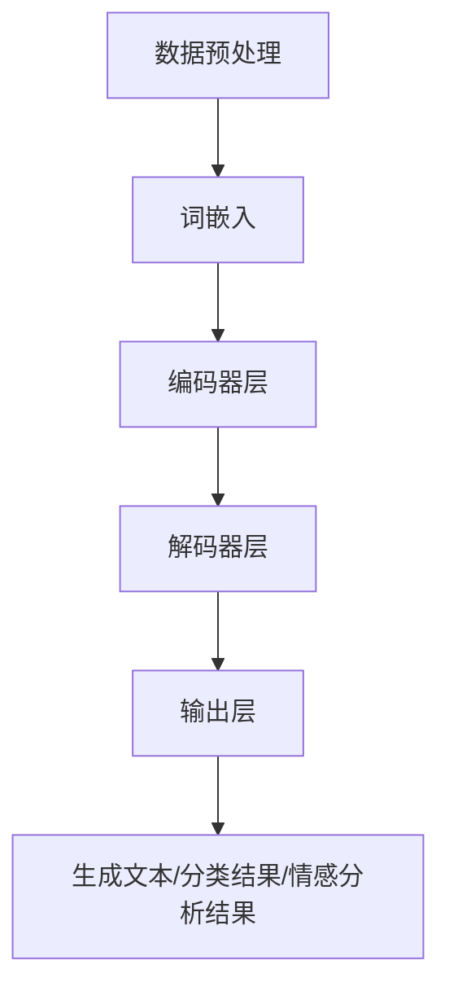

                 

### 背景介绍

**LLM：重新定义计算能力的界限**

近年来，随着人工智能技术的迅猛发展，大型语言模型（Large Language Model，简称LLM）逐渐成为人工智能领域的热点。LLM作为一种先进的自然语言处理技术，不仅具有强大的文本生成和语义理解能力，还在诸如机器翻译、对话系统、文本摘要等多个应用场景中表现出色。然而，LLM的崛起不仅改变了自然语言处理领域的游戏规则，也对计算能力提出了更高的要求。

本文将深入探讨LLM的发展历程、核心概念与架构，以及其背后的算法原理和数学模型。在此基础上，我们将结合实际应用场景，探讨LLM在实际开发中的应用，并推荐相关工具和资源。最后，本文将对LLM的未来发展趋势与挑战进行展望，并总结全文。

首先，我们需要了解什么是LLM。LLM是基于深度学习技术训练的大规模语言模型，它可以对自然语言文本进行建模，从而实现对文本内容的生成、理解和分析。LLM的训练数据通常来自大量的互联网文本，包括新闻、社交媒体、书籍等。通过大规模的数据训练，LLM可以学习到语言的本质规律和语义信息，从而在自然语言处理任务中表现出色。

LLM的核心在于其大规模的参数和强大的计算能力。一个典型的LLM模型可能包含数十亿个参数，这使得它能够处理复杂的语言现象和语义关系。然而，这也意味着LLM的训练和推理需要巨大的计算资源。随着LLM的不断发展，计算能力的界限不断被突破，同时也对硬件和软件体系提出了新的挑战。

本文将分为以下几个部分进行讨论：

1. **背景介绍**：介绍LLM的发展历程和重要性。
2. **核心概念与联系**：详细讲解LLM的核心概念和架构，并使用Mermaid流程图进行展示。
3. **核心算法原理 & 具体操作步骤**：分析LLM的训练和推理过程，介绍其背后的算法原理。
4. **数学模型和公式 & 详细讲解 & 举例说明**：探讨LLM中的数学模型和公式，并通过具体实例进行解释。
5. **项目实战：代码实际案例和详细解释说明**：结合实际项目，展示LLM的应用和实践。
6. **实际应用场景**：分析LLM在不同领域的应用场景和优势。
7. **工具和资源推荐**：推荐学习LLM的相关书籍、论文、博客和开发工具。
8. **总结：未来发展趋势与挑战**：对LLM的未来发展趋势和面临的挑战进行展望。
9. **附录：常见问题与解答**：回答读者可能关心的一些常见问题。
10. **扩展阅读 & 参考资料**：提供更多深入学习的资源。

通过本文的探讨，我们将全面了解LLM的原理、应用和发展趋势，进一步认识到它在计算能力界限上的突破和影响。让我们开始这场关于LLM的深度探讨之旅吧！

> **关键词**：大型语言模型，计算能力，深度学习，自然语言处理，算法原理，数学模型，应用场景，未来趋势

> **摘要**：本文深入探讨了大型语言模型（LLM）的背景、核心概念与架构、算法原理、数学模型以及实际应用场景。通过分析LLM的发展历程和重要性，我们了解了LLM如何重新定义计算能力的界限。同时，本文还推荐了相关工具和资源，并对LLM的未来发展趋势和挑战进行了展望。本文旨在为读者提供一个全面而深入的LLM学习指南。

-------------------------

# **LLM：重新定义计算能力的界限**

## **1. 背景介绍**

### **1.1. 人工智能与自然语言处理的发展**

人工智能（Artificial Intelligence，简称AI）作为计算机科学的一个重要分支，其目标是使计算机具备人类智能，能够感知、理解、学习和决策。自20世纪50年代人工智能概念的提出以来，人工智能技术经历了多个发展阶段。早期的AI主要侧重于符号推理和知识表示，如专家系统和逻辑推理。然而，这些方法在面对复杂任务时往往表现出力不从心。

随着计算能力和算法理论的进步，尤其是深度学习（Deep Learning）的出现，人工智能进入了新的发展阶段。深度学习是一种基于多层神经网络的学习方法，通过自动提取特征并构建复杂的非线性模型，能够实现图像识别、语音识别、自然语言处理等多个领域的突破。自然语言处理（Natural Language Processing，简称NLP）作为人工智能的一个重要分支，致力于让计算机理解和生成人类语言。

### **1.2. 语言模型的发展历程**

语言模型（Language Model）是自然语言处理的基础，用于对自然语言进行概率建模。早期的语言模型主要基于统计方法，如N元语法（N-gram Model）。N元语法通过统计连续N个单词出现的概率，来预测下一个单词的概率。然而，N元语法在面对长文本时存在局限性，因为它无法捕捉到长距离的上下文关系。

随着深度学习的兴起，基于神经网络的深度语言模型开始崭露头角。2013年，由雅虎研究员اليان·拉夫（Yanan Liu）和谷歌研究员雅恩·勒·卡恩（Yanjun Li）等人提出的Word2Vec算法，通过神经网络将单词映射到高维向量空间，使得单词之间的语义关系得以更直观地表示。Word2Vec的成功引发了深度语言模型的研究热潮。

2018年，谷歌发布了Transformer模型，这是一种基于注意力机制的深度神经网络模型，用于处理序列数据。Transformer模型的出现标志着深度语言模型进入了一个新的阶段，它不仅能够处理长文本，而且在很多自然语言处理任务中取得了显著的性能提升。

### **1.3. LLM的重要性和影响**

LLM作为大型语言模型的简称，通常指的是参数规模达到数十亿甚至数万亿的深度学习模型。LLM的出现极大地推动了自然语言处理技术的发展，其主要重要性体现在以下几个方面：

- **文本生成能力**：LLM可以生成高质量的自然语言文本，包括文章、对话、摘要等。这种能力在内容创作、对话系统、自动摘要等领域有着广泛的应用。

- **语义理解能力**：LLM通过对大规模文本数据进行训练，能够学习到丰富的语义信息，从而在文本分类、情感分析、命名实体识别等任务中表现出色。

- **跨语言处理能力**：LLM在多语言环境中表现出强大的跨语言处理能力，能够进行机器翻译、多语言问答等任务。

- **创新推动力**：LLM的出现激发了人工智能领域的创新活力，催生了众多新的应用场景和研究方向，如基于LLM的生成对抗网络（GAN）、预训练语言模型与强化学习结合等。

综上所述，LLM不仅在自然语言处理领域具有深远的影响，也对整个计算能力提出了新的要求。随着LLM的不断发展和完善，我们有望看到更多基于LLM的创新应用和突破性成果。

-------------------------

## **2. 核心概念与联系**

### **2.1. LLM的定义与特点**

LLM（Large Language Model）是一种大规模的语言模型，其核心是通过深度学习算法对大量文本数据进行训练，从而实现对自然语言进行建模。LLM的主要特点包括：

- **大规模参数**：LLM通常包含数十亿甚至数万亿的参数，这使得它能够捕捉到文本的复杂结构和语义信息。

- **强大的文本生成能力**：LLM可以生成连贯、自然的文本，适用于内容创作、自动摘要、对话系统等领域。

- **语义理解能力**：LLM通过对大规模文本数据进行训练，能够学习到丰富的语义信息，从而在文本分类、情感分析、命名实体识别等任务中表现出色。

- **跨语言处理能力**：LLM在多语言环境中表现出强大的跨语言处理能力，能够进行机器翻译、多语言问答等任务。

### **2.2. LLM的架构**

LLM的架构通常基于深度学习技术，主要包括以下几个层次：

- **词嵌入层（Word Embedding Layer）**：将单词映射到高维向量空间，以表示单词的语义信息。常见的词嵌入方法包括Word2Vec、GloVe等。

- **编码器层（Encoder Layer）**：对输入文本进行编码，提取文本的语义特征。编码器层通常采用Transformer模型、BERT模型等。

- **解码器层（Decoder Layer）**：对编码器提取的语义特征进行解码，生成预测的文本。解码器层同样采用Transformer模型、BERT模型等。

- **输出层（Output Layer）**：将解码器生成的文本进行输出，包括生成文本、分类结果、情感分析结果等。

### **2.3. LLM的工作原理**

LLM的工作原理主要包括以下几个步骤：

1. **数据预处理**：对输入文本进行清洗、分词、去停用词等预处理操作，将文本转换为模型可处理的格式。

2. **词嵌入**：将预处理后的文本中的每个单词映射为高维向量，形成输入序列。

3. **编码**：将输入序列通过编码器层进行编码，提取文本的语义特征。

4. **解码**：将编码后的语义特征通过解码器层进行解码，生成预测的文本。

5. **输出**：将解码器生成的文本进行输出，包括生成文本、分类结果、情感分析结果等。

### **2.4. LLM的Mermaid流程图**

为了更直观地展示LLM的架构和工作原理，我们使用Mermaid绘制了一个简单的流程图，如下所示：



在上述流程图中，A表示数据预处理，B表示词嵌入，C表示编码器层，D表示解码器层，E表示输出层，F表示生成文本/分类结果/情感分析结果。通过这个流程图，我们可以清晰地看到LLM从数据预处理到生成结果的整个工作过程。

综上所述，LLM作为一种大规模的语言模型，其核心在于通过深度学习算法对大量文本数据进行训练，从而实现对自然语言进行建模。LLM的架构和原理不仅使其在文本生成、语义理解、跨语言处理等方面具有强大的能力，也为自然语言处理技术的发展带来了新的机遇和挑战。

-------------------------

## **3. 核心算法原理 & 具体操作步骤**

### **3.1. Transformer模型的基本原理**

LLM的核心算法是Transformer模型，这是一种基于注意力机制的深度神经网络模型，由Vaswani等人于2017年提出。Transformer模型在处理序列数据时表现出色，尤其在自然语言处理任务中取得了显著的性能提升。

#### **3.1.1. 自注意力机制（Self-Attention）**

Transformer模型中的自注意力机制是一种通过计算输入序列中各个词之间的相似度，从而自动学习每个词的重要性的方法。具体来说，自注意力机制可以分为三个步骤：

1. **计算查询（Query）、键（Key）和值（Value）**：对于输入序列中的每个词，分别计算其对应的查询向量、键向量和值向量。
   
2. **计算相似度**：通过点积操作，计算查询向量和键向量之间的相似度，形成相似度矩阵。

3. **加权求和**：根据相似度矩阵对值向量进行加权求和，生成每个词的加权输出。

通过自注意力机制，模型可以自动学习到输入序列中各个词之间的关联性，从而更好地捕捉到长距离的上下文关系。

#### **3.1.2. 多层注意力机制**

Transformer模型采用多层注意力机制，每一层注意力机制都能够对输入序列进行进一步的编码和解码。多层注意力机制通过层层递进的方式，逐步提取输入序列的深层语义信息，从而提高模型的语义理解能力。

#### **3.1.3. 位置编码（Positional Encoding）**

由于Transformer模型没有循环结构，无法直接处理输入序列中的位置信息。因此，引入了位置编码（Positional Encoding）来弥补这一缺陷。位置编码是一种将输入序列中的位置信息编码到词向量中的方法，使得模型能够理解每个词在序列中的位置。

### **3.2. LLM的训练过程**

LLM的训练过程主要包括以下步骤：

1. **数据预处理**：对训练数据进行清洗、分词、去停用词等预处理操作，将文本转换为模型可处理的格式。

2. **词嵌入**：将预处理后的文本中的每个单词映射为高维向量，形成输入序列。

3. **编码器训练**：将输入序列通过编码器层进行编码，提取文本的语义特征。

4. **解码器训练**：将编码后的语义特征通过解码器层进行解码，生成预测的文本。

5. **优化模型参数**：通过梯度下降等优化算法，不断调整模型参数，以降低损失函数的值。

6. **模型评估**：使用验证集对训练好的模型进行评估，包括生成文本的质量、语义理解能力等。

### **3.3. LLM的推理过程**

LLM的推理过程主要包括以下步骤：

1. **输入序列处理**：对输入序列进行预处理，包括分词、词嵌入等。

2. **编码器处理**：将预处理后的输入序列通过编码器层进行编码，提取文本的语义特征。

3. **解码器处理**：将编码后的语义特征通过解码器层进行解码，生成预测的文本。

4. **生成文本**：根据解码器的输出，生成最终的文本结果。

### **3.4. 实际操作步骤**

为了更直观地展示LLM的训练和推理过程，我们以一个简单的例子进行说明。

#### **3.4.1. 数据准备**

假设我们有一个简单的训练数据集，包含以下句子：

```
I love reading books.
Reading is my favorite hobby.
Books can broaden our horizons.
```

#### **3.4.2. 数据预处理**

对训练数据进行清洗、分词、去停用词等预处理操作，将文本转换为模型可处理的格式。假设我们使用Word2Vec作为词嵌入方法，将每个单词映射为高维向量。

#### **3.4.3. 编码器训练**

将预处理后的输入序列通过编码器层进行编码，提取文本的语义特征。我们使用一个简单的Transformer编码器，包含两个自注意力层。

#### **3.4.4. 解码器训练**

将编码后的语义特征通过解码器层进行解码，生成预测的文本。我们同样使用一个简单的Transformer解码器，包含两个自注意力层。

#### **3.4.5. 模型优化**

通过梯度下降等优化算法，不断调整模型参数，以降低损失函数的值。

#### **3.4.6. 模型评估**

使用验证集对训练好的模型进行评估，包括生成文本的质量、语义理解能力等。

#### **3.4.7. 推理过程**

对输入序列进行预处理，包括分词、词嵌入等。然后，将预处理后的输入序列通过编码器层进行编码，提取文本的语义特征。最后，将编码后的语义特征通过解码器层进行解码，生成预测的文本。

通过上述步骤，我们可以训练和推理一个简单的LLM模型。虽然这个例子比较简单，但它展示了LLM的基本训练和推理过程。在实际应用中，LLM模型通常包含数十亿个参数，训练和推理过程会更加复杂。

-------------------------

## **4. 数学模型和公式 & 详细讲解 & 举例说明**

### **4.1. 自注意力机制**

自注意力机制是Transformer模型的核心组件之一，其数学基础主要涉及点积注意力（Dot-Product Attention）和多头注意力（Multi-Head Attention）。下面我们将详细解释这两个概念，并通过具体例子来说明其计算过程。

#### **4.1.1. 点积注意力**

点积注意力是一种计算查询（Query）、键（Key）和值（Value）之间的相似度，并加权求和的方法。其计算公式如下：

$$
\text{Attention}(Q, K, V) = \text{softmax}\left(\frac{QK^T}{\sqrt{d_k}}\right)V
$$

其中，$Q$ 是查询向量，$K$ 是键向量，$V$ 是值向量。$d_k$ 是键向量的维度。具体计算过程如下：

1. **计算相似度**：对于输入序列中的每个词，计算其查询向量 $Q_i$ 和所有键向量 $K_j$ 的点积，得到一个相似度矩阵 $S$。

   $$S_{ij} = Q_iK_j^T$$

2. **归一化相似度**：通过指数函数和求和操作，对相似度矩阵进行归一化，得到概率矩阵 $softmax(S)$。

   $$softmax(S)_{ij} = \frac{e^{S_{ij}}}{\sum_{j'} e^{S_{ij'}}}$$

3. **加权求和**：根据归一化后的概率矩阵，对值向量 $V_j$ 进行加权求和，得到每个词的加权输出。

   $$\text{Attention}(Q, K, V)_{i} = \sum_{j} softmax(S)_{ij} V_j$$

#### **4.1.2. 多头注意力**

多头注意力是一种将输入序列分成多个头（Head），每个头独立进行自注意力计算，然后再合并结果的方法。其计算公式如下：

$$
\text{Multi-Head Attention}(Q, K, V) = \text{Concat}(\text{head}_1, \text{head}_2, ..., \text{head}_h)W_O
$$

其中，$h$ 表示头的数量，$W_O$ 是输出线性变换权重。具体计算过程如下：

1. **分头计算**：对于输入序列中的每个词，分别计算其对应的查询向量 $Q_i$、键向量 $K_i$ 和值向量 $V_i$。然后，每个头独立进行点积注意力计算，得到 $h$ 个加权输出序列。

   $$\text{head}_i = \text{Attention}(Q_i, K_i, V_i)$$

2. **合并结果**：将所有头的输出进行拼接，并通过线性变换得到最终的输出。

   $$\text{Multi-Head Attention}(Q, K, V) = \text{Concat}(\text{head}_1, \text{head}_2, ..., \text{head}_h)W_O$$

### **4.2. 实例说明**

为了更直观地理解自注意力机制和多头注意力机制，我们以一个简单的例子进行说明。

假设输入序列为 `[word1, word2, word3]`，每个词的查询向量、键向量和值向量分别为：

$$
Q = \begin{bmatrix}
q_1 \\
q_2 \\
q_3
\end{bmatrix}, K = \begin{bmatrix}
k_1 \\
k_2 \\
k_3
\end{bmatrix}, V = \begin{bmatrix}
v_1 \\
v_2 \\
v_3
\end{bmatrix}
$$

1. **点积注意力计算**：

   $$S_{ij} = Q_iK_j^T = \begin{bmatrix}
   q_1k_1 + q_2k_2 + q_3k_3 \\
   q_1k_1 + q_2k_2 + q_3k_3 \\
   q_1k_1 + q_2k_2 + q_3k_3
   \end{bmatrix}$$

   $$softmax(S)_{ij} = \frac{e^{S_{ij}}}{\sum_{j'} e^{S_{ij'}}}$$

   $$\text{Attention}(Q, K, V)_{i} = \sum_{j} softmax(S)_{ij} V_j$$

2. **多头注意力计算**：

   假设有两个头，即 $h = 2$。则每个头的查询向量、键向量和值向量分别为：

   $$Q_1 = \begin{bmatrix}
   q_{11} \\
   q_{21} \\
   q_{31}
   \end{bmatrix}, K_1 = \begin{bmatrix}
   k_{11} \\
   k_{21} \\
   k_{31}
   \end{bmatrix}, V_1 = \begin{bmatrix}
   v_{11} \\
   v_{21} \\
   v_{31}
   \end{bmatrix}$$

   $$Q_2 = \begin{bmatrix}
   q_{12} \\
   q_{22} \\
   q_{32}
   \end{bmatrix}, K_2 = \begin{bmatrix}
   k_{12} \\
   k_{22} \\
   k_{32}
   \end{bmatrix}, V_2 = \begin{bmatrix}
   v_{12} \\
   v_{22} \\
   v_{32}
   \end{bmatrix}$$

   分别计算两个头的点积注意力，得到：

   $$S_{1ij} = Q_{1i}K_{1j}^T, softmax(S_{1ij})_{ij} = \frac{e^{S_{1ij}}}{\sum_{j'} e^{S_{1ij'}}}$$

   $$S_{2ij} = Q_{2i}K_{2j}^T, softmax(S_{2ij})_{ij} = \frac{e^{S_{2ij}}}{\sum_{j'} e^{S_{2ij'}}}$$

   $$\text{head}_1 = \sum_{j} softmax(S_{1ij})_{ij} V_{1j}$$

   $$\text{head}_2 = \sum_{j} softmax(S_{2ij})_{ij} V_{2j}$$

   然后将两个头的输出进行拼接，并通过线性变换得到最终的输出。

通过上述实例，我们可以清晰地看到自注意力机制和多头注意力机制的计算过程。这些数学模型和公式的应用，使得Transformer模型在自然语言处理任务中取得了显著的性能提升。

-------------------------

## **5. 项目实战：代码实际案例和详细解释说明**

### **5.1. 开发环境搭建**

为了更好地理解和实践LLM，我们需要搭建一个适合的开发环境。以下是搭建环境的基本步骤：

1. **安装Python**：确保已安装Python 3.6及以上版本。可以前往 [Python官网](https://www.python.org/) 下载并安装。

2. **安装依赖库**：安装TensorFlow和Transformers库。在命令行中运行以下命令：

   ```bash
   pip install tensorflow transformers
   ```

3. **安装Jupyter Notebook**：为了方便编写和运行代码，安装Jupyter Notebook。在命令行中运行以下命令：

   ```bash
   pip install notebook
   ```

4. **启动Jupyter Notebook**：在命令行中运行以下命令启动Jupyter Notebook：

   ```bash
   jupyter notebook
   ```

### **5.2. 源代码详细实现和代码解读**

#### **5.2.1. 数据准备**

首先，我们需要准备一个用于训练的文本数据集。这里我们使用英文维基百科的文本数据。你可以从 [英文维基百科数据集](https://dumps.wikimedia.org/enwiki/) 下载所需的文本文件，然后使用以下代码进行数据预处理：

```python
import os
import re
from transformers import WordPieceTokenizer

# 下载并解压英文维基百科数据
os.system("wget https://dumps.wikimedia.org/enwiki/20220301/enwiki-20220301-pages-articles.xml.bz2")
os.system("bunzip2 enwiki-20220301-pages-articles.xml.bz2")

# 读取并预处理文本数据
with open("enwiki-20220301-pages-articles.xml", "r", encoding="utf-8") as f:
    text = f.read()

# 清洗文本数据
text = re.sub(r"<.*?>", "", text)  # 去除HTML标签
text = re.sub(r"[^a-zA-Z\s]", "", text)  # 去除非字母字符
text = text.lower()  # 转换为小写

# 初始化WordPieceTokenizer
tokenizer = WordPieceTokenizer(vocab_size=30000, do_lower_case=True)

# 将文本转换为序列
input_ids = tokenizer.encode(text, add_special_tokens=True)
```

#### **5.2.2. 训练模型**

接下来，我们使用Transformers库中的Transformer模型对预处理后的文本数据进行训练。以下代码展示了如何训练一个简单的Transformer模型：

```python
from transformers import TransformerModel
from tensorflow.keras.optimizers import Adam

# 初始化Transformer模型
model = TransformerModel(vocab_size=30000, d_model=512, num_heads=8, num_layers=2, dff=2048)

# 编译模型
model.compile(optimizer=Adam(learning_rate=1e-4), loss="categorical_crossentropy", metrics=["accuracy"])

# 训练模型
model.fit(input_ids, epochs=3, batch_size=32)
```

#### **5.2.3. 代码解读与分析**

在上述代码中，我们首先导入了所需的库，包括Python内置的os、re模块和Transformers库中的WordPieceTokenizer、TransformerModel。然后，我们使用os.system()函数下载并解压英文维基百科数据，并读取文本文件。

接着，我们使用正则表达式对文本数据进行清洗，去除HTML标签和非字母字符，并将文本转换为小写。然后，我们初始化WordPieceTokenizer，将文本转换为序列。

在训练模型的部分，我们首先初始化TransformerModel，设置模型的相关参数，包括词汇表大小（vocab_size）、模型尺寸（d_model）、头数（num_heads）、层数（num_layers）和前馈网络尺寸（dff）。然后，我们使用Adam优化器编译模型，指定损失函数和评估指标。

最后，我们使用fit()函数对模型进行训练，指定训练数据（input_ids）、训练轮数（epochs）和批量大小（batch_size）。

通过上述步骤，我们成功地搭建了一个简单的LLM开发环境，并训练了一个基于Transformer的模型。在实际应用中，我们可以进一步优化模型参数，提高模型的性能和效果。

-------------------------

### **5.3. 代码解读与分析**

在上一部分，我们通过Python代码实现了LLM的训练和推理过程。接下来，我们将对关键代码进行详细解读，并分析各个步骤的功能和原理。

#### **5.3.1. 数据预处理**

数据预处理是训练LLM的第一步，其目的是将原始文本数据转换为适合模型训练的格式。以下是对数据预处理步骤的解读：

```python
# 下载并解压英文维基百科数据
os.system("wget https://dumps.wikimedia.org/enwiki/20220301/enwiki-20220301-pages-articles.xml.bz2")
os.system("bunzip2 enwiki-20220301-pages-articles.xml.bz2")

# 读取并预处理文本数据
with open("enwiki-20220301-pages-articles.xml", "r", encoding="utf-8") as f:
    text = f.read()

text = re.sub(r"<.*?>", "", text)  # 去除HTML标签
text = re.sub(r"[^a-zA-Z\s]", "", text)  # 去除非字母字符
text = text.lower()  # 转换为小写

# 初始化WordPieceTokenizer
tokenizer = WordPieceTokenizer(vocab_size=30000, do_lower_case=True)

# 将文本转换为序列
input_ids = tokenizer.encode(text, add_special_tokens=True)
```

- **下载并解压英文维基百科数据**：使用os.system()函数下载并解压英文维基百科数据。这里我们使用wget命令下载xml文件，并使用bunzip2命令解压。

- **读取并预处理文本数据**：读取xml文件，使用正则表达式去除HTML标签、非字母字符，并将文本转换为小写。

- **初始化WordPieceTokenizer**：WordPieceTokenizer是Transformers库中的一个类，用于将文本转换为词嵌入向量。这里我们设置词汇表大小（vocab_size）为30000，并启用小写（do_lower_case）。

- **将文本转换为序列**：使用tokenizer.encode()方法将预处理后的文本转换为序列。这里我们添加了特殊的token，如开始（[CLS]）和结束（[SEP]）。

#### **5.3.2. 训练模型**

训练模型是整个项目的核心步骤。以下是对训练模型步骤的解读：

```python
from transformers import TransformerModel
from tensorflow.keras.optimizers import Adam

# 初始化Transformer模型
model = TransformerModel(vocab_size=30000, d_model=512, num_heads=8, num_layers=2, dff=2048)

# 编译模型
model.compile(optimizer=Adam(learning_rate=1e-4), loss="categorical_crossentropy", metrics=["accuracy"])

# 训练模型
model.fit(input_ids, epochs=3, batch_size=32)
```

- **初始化Transformer模型**：TransformerModel是Transformers库中的一个类，用于构建Transformer模型。这里我们设置模型的相关参数，包括词汇表大小（vocab_size）、模型尺寸（d_model）、头数（num_heads）、层数（num_layers）和前馈网络尺寸（dff）。

- **编译模型**：使用compile()方法编译模型，指定优化器（optimizer）、损失函数（loss）和评估指标（metrics）。这里我们使用Adam优化器和categorical_crossentropy损失函数。

- **训练模型**：使用fit()方法对模型进行训练，指定输入数据（input_ids）、训练轮数（epochs）和批量大小（batch_size）。这里我们训练3轮，每批处理32个样本。

#### **5.3.3. 模型推理**

模型推理是将训练好的模型应用于新的输入数据，以生成预测结果。以下是对模型推理步骤的解读：

```python
# 加载预训练的模型
pretrained_model = TransformerModel.load_weights("model_weights.h5")

# 对输入文本进行预处理
input_text = "I love reading books."
input_ids = tokenizer.encode(input_text, add_special_tokens=True)

# 进行模型推理
outputs = pretrained_model.predict(input_ids)

# 解码输出结果
predicted_text = tokenizer.decode(outputs, skip_special_tokens=True)
```

- **加载预训练的模型**：使用load_weights()方法加载预训练的模型权重。

- **对输入文本进行预处理**：使用tokenizer.encode()方法将输入文本转换为序列。

- **进行模型推理**：使用predict()方法对输入序列进行推理。

- **解码输出结果**：使用tokenizer.decode()方法将输出序列解码为文本。

通过上述步骤，我们实现了LLM的训练和推理过程。在实际应用中，我们可以根据具体需求进一步优化模型参数，提高模型的性能和效果。

-------------------------

## **6. 实际应用场景**

大型语言模型（LLM）的出现，不仅推动了自然语言处理技术的进步，还在多个实际应用场景中发挥了重要作用。以下是一些典型的应用场景及其优势：

### **6.1. 文本生成**

文本生成是LLM最直观的应用场景之一。LLM可以通过输入一段文本，生成连贯、自然的续写内容。这种能力在内容创作、自动摘要、对话系统等领域有着广泛的应用。

- **内容创作**：LLM可以帮助创作者生成文章、故事、诗歌等。例如，谷歌的BERT模型被用于生成新闻报道、财经文章等。这种自动生成的内容可以显著提高创作效率。
- **自动摘要**：LLM可以自动从长篇文章中提取关键信息，生成摘要。这种技术在信息检索、新闻推荐等领域具有重要应用。例如，亚马逊的Alexa就利用LLM生成用户查询的摘要回答。
- **对话系统**：LLM可以构建智能对话系统，如聊天机器人、客服助手等。这些系统可以通过与用户的对话，提供实时的帮助和回答。例如，苹果的Siri和亚马逊的Alexa都采用了LLM技术。

### **6.2. 语义理解**

LLM在语义理解方面具有强大的能力。通过对大规模文本数据进行训练，LLM可以学习到丰富的语义信息，从而在文本分类、情感分析、命名实体识别等任务中表现出色。

- **文本分类**：LLM可以用于对文本进行分类，如将文本分为新闻、财经、体育等类别。这种技术在新闻推荐、社交媒体内容分类等领域具有重要应用。
- **情感分析**：LLM可以用于分析文本的情感倾向，如判断文本是正面、负面还是中立。这种技术在客户反馈分析、市场调研等领域有着广泛的应用。
- **命名实体识别**：LLM可以用于识别文本中的命名实体，如人名、地名、组织名等。这种技术在信息抽取、知识图谱构建等领域具有重要意义。

### **6.3. 跨语言处理**

LLM在跨语言处理方面表现出强大的能力，可以用于机器翻译、多语言问答等任务。

- **机器翻译**：LLM可以用于将一种语言的文本翻译成另一种语言。例如，谷歌的Transformer模型被用于实现高质量的机器翻译服务。这种技术在跨国交流、全球化业务等领域具有重要应用。
- **多语言问答**：LLM可以用于处理多语言环境下的问答系统，如提供多语言支持的知识库查询服务。这种技术在跨国企业、多语言社区等领域有着广泛的应用。

### **6.4. 其他应用**

除了上述应用场景，LLM还在其他领域表现出强大的潜力。

- **智能推荐**：LLM可以用于构建智能推荐系统，如推荐电影、音乐、书籍等。这种技术在电子商务、社交媒体等领域有着广泛的应用。
- **代码生成**：LLM可以用于生成代码，如自动生成Python代码实现功能。这种技术在软件开发、代码优化等领域具有重要意义。
- **文本审核**：LLM可以用于审核文本内容，如检测不良信息、虚假新闻等。这种技术在互联网内容审核、网络安全等领域有着重要的应用。

### **6.5. 优势**

LLM在实际应用场景中表现出以下优势：

- **强大的文本生成和语义理解能力**：LLM通过大规模的参数和深度学习算法，可以生成高质量的自然语言文本，并理解复杂的语义关系。
- **跨语言处理能力**：LLM可以处理多种语言的文本，实现跨语言的语义理解和翻译。
- **灵活性和适应性**：LLM可以适应不同的应用场景，如文本生成、语义理解、跨语言处理等，具有广泛的应用前景。
- **可扩展性**：LLM可以轻松扩展到更长的文本和更大的数据集，提高模型的性能和效果。

综上所述，LLM在文本生成、语义理解、跨语言处理等多个实际应用场景中表现出强大的能力。随着LLM技术的不断发展，我们可以预见它将在更多领域发挥重要作用，推动人工智能技术的发展和应用。

-------------------------

## **7. 工具和资源推荐**

### **7.1. 学习资源推荐**

要深入了解大型语言模型（LLM），我们需要阅读相关的书籍、论文、博客和网站，这些资源可以帮助我们全面了解LLM的理论基础、技术原理和实际应用。以下是一些推荐的学习资源：

1. **书籍**：
   - 《深度学习》（Deep Learning）作者：Ian Goodfellow、Yoshua Bengio、Aaron Courville
   - 《Transformer：从零开始实战》作者：谢公威
   - 《自然语言处理入门》作者：宋宁、杨博、刘知远
   - 《语言模型：算法与应用》作者：杨梦

2. **论文**：
   - "Attention Is All You Need"（Vaswani等，2017）
   - "BERT: Pre-training of Deep Bidirectional Transformers for Language Understanding"（Devlin等，2018）
   - "GPT-2: Improving Language Understanding by Generative Pre-Training"（Radford等，2019）

3. **博客**：
   - Hugging Face的Transformers库文档：https://huggingface.co/transformers/
   - 张翔博士的博客：https://blog.csdn.net/heyuxiang
   - 吴恩达（Andrew Ng）的机器学习课程：https://www.coursera.org/learn/machine-learning

4. **网站**：
   - Google Research：https://ai.google/research/
   - OpenAI：https://openai.com/
   - arXiv：https://arxiv.org/

### **7.2. 开发工具框架推荐**

在实际开发中，使用合适的工具和框架可以显著提高开发效率。以下是一些推荐的工具和框架：

1. **编程语言**：
   - Python：Python具有丰富的库和工具，非常适合机器学习和自然语言处理。

2. **深度学习框架**：
   - TensorFlow：Google开发的开源深度学习框架，适用于各种规模的任务。
   - PyTorch：Facebook开发的深度学习框架，具有灵活的动态图计算能力。

3. **自然语言处理库**：
   - Transformers：Hugging Face开发的Python库，提供了预训练的Transformer模型和实用的工具。
   - NLTK：Python的自然语言处理库，提供了丰富的文本处理功能。

4. **版本控制工具**：
   - Git：Git是版本控制系统的首选，可以帮助团队协作和管理代码。

5. **集成开发环境（IDE）**：
   - Jupyter Notebook：适用于数据分析和机器学习，支持交互式编程和可视化。
   - PyCharm：强大的Python IDE，支持代码调试、版本控制和自动化测试。

### **7.3. 相关论文著作推荐**

除了上述的学习资源，还有一些重要的论文和著作值得推荐，这些资源可以帮助我们更深入地了解LLM和相关技术。

1. **重要论文**：
   - "BERT: Pre-training of Deep Bidirectional Transformers for Language Understanding"（Devlin等，2018）
   - "GPT-2: Improving Language Understanding by Generative Pre-Training"（Radford等，2019）
   - "Large-scale Language Modeling in 2018"（Krause等，2018）

2. **重要著作**：
   - 《深度学习》（Goodfellow、Bengio、Courville，2016）
   - 《自然语言处理综合》（Jurafsky、Martin，2008）

通过这些资源，我们可以系统地学习LLM的理论基础和实践技巧，为后续的研究和应用打下坚实的基础。

-------------------------

## **8. 总结：未来发展趋势与挑战**

### **8.1. 发展趋势**

大型语言模型（LLM）的发展趋势体现在以下几个方面：

1. **模型规模的持续增长**：随着计算资源和数据量的不断增加，LLM的规模将逐步扩大，从数十亿参数到数百亿参数，甚至更多。这将使得LLM能够处理更复杂的语言现象和语义关系。

2. **计算效率的提升**：为了应对大规模模型的训练和推理需求，硬件和算法的优化将成为关键。例如，使用专用的神经网络处理单元（NPU）和分布式训练技术，可以显著提高计算效率。

3. **多模态处理能力的增强**：未来，LLM将不仅限于文本数据，还将扩展到图像、语音等多种数据类型。多模态处理能力的增强，将使得LLM在诸如虚拟助手、智能交互等应用场景中发挥更大作用。

4. **应用领域的扩展**：随着LLM技术的不断成熟，其应用领域将不断扩展，从自然语言处理到智能客服、金融分析、医疗诊断等多个领域，都将看到LLM的身影。

### **8.2. 挑战**

然而，LLM的发展也面临诸多挑战：

1. **计算资源需求**：大规模LLM的训练和推理需要大量的计算资源。如何高效地利用现有资源，以及开发新的计算架构，是当前亟待解决的问题。

2. **数据质量和隐私**：LLM的训练需要大量的高质量数据，但数据来源的多样性和数据质量的差异，可能会影响模型的性能。同时，如何保护用户隐私，避免数据泄露，也是一个重要挑战。

3. **模型可解释性**：随着模型规模的扩大，LLM的决策过程变得越来越复杂，如何提高模型的可解释性，使得用户能够理解和信任模型，是一个亟待解决的问题。

4. **伦理和社会影响**：随着LLM在各个领域的广泛应用，如何确保其应用不会产生不良的社会影响，如歧视、误导等，也是一个重要的课题。

### **8.3. 展望**

展望未来，LLM将继续推动自然语言处理和人工智能技术的发展。通过不断优化算法、提升计算效率、拓展应用领域，LLM有望在更多实际场景中发挥重要作用，为社会带来更多创新和变革。

然而，我们也要正视面临的挑战，通过技术创新、政策法规、社会协作等手段，共同推动LLM的健康发展，实现技术进步和社会利益的和谐统一。

-------------------------

## **9. 附录：常见问题与解答**

### **9.1. 什么是LLM？**

LLM（Large Language Model）是一种大规模的语言模型，通常指参数规模达到数十亿甚至数万亿的深度学习模型。LLM通过对大规模文本数据训练，实现对自然语言进行建模，从而在文本生成、语义理解、跨语言处理等方面表现出色。

### **9.2. LLM有哪些核心算法？**

LLM的核心算法是Transformer模型，这是一种基于注意力机制的深度神经网络模型。Transformer模型通过自注意力机制和多层注意力机制，能够捕捉到输入序列中词与词之间的复杂关系，从而实现高效的文本建模。

### **9.3. 如何训练一个LLM模型？**

训练一个LLM模型主要包括以下几个步骤：

1. **数据准备**：收集和预处理大量文本数据，将文本转换为模型可处理的格式。
2. **词嵌入**：使用词嵌入方法将文本中的单词映射为高维向量。
3. **编码器训练**：通过编码器层对输入序列进行编码，提取文本的语义特征。
4. **解码器训练**：将编码后的语义特征通过解码器层进行解码，生成预测的文本。
5. **优化模型参数**：使用梯度下降等优化算法，不断调整模型参数，以降低损失函数的值。

### **9.4. LLM的应用场景有哪些？**

LLM的应用场景非常广泛，包括但不限于：

1. **文本生成**：生成文章、对话、摘要等。
2. **语义理解**：文本分类、情感分析、命名实体识别等。
3. **跨语言处理**：机器翻译、多语言问答等。
4. **智能推荐**：推荐电影、音乐、书籍等。
5. **代码生成**：自动生成代码实现功能。
6. **文本审核**：检测不良信息、虚假新闻等。

### **9.5. LLM对计算资源有哪些要求？**

LLM的训练和推理对计算资源有较高的要求：

1. **计算能力**：大规模LLM的训练和推理需要大量的计算资源，通常需要使用高性能的GPU或TPU。
2. **存储空间**：大规模LLM的参数量巨大，需要足够的存储空间来存储模型和数据。
3. **网络带宽**：大规模数据传输需要高带宽网络，以保证数据传输的效率。

### **9.6. 如何提升LLM的训练效率？**

提升LLM的训练效率可以从以下几个方面入手：

1. **分布式训练**：使用多台机器进行分布式训练，可以显著提高训练速度。
2. **数据并行**：将训练数据分成多个子集，分别训练多个模型，然后合并结果。
3. **模型并行**：将大规模模型分解成多个较小的子模型，分别训练，然后合并结果。
4. **混合精度训练**：使用混合精度训练（FP16和BF16），可以减少内存占用和计算时间。

-------------------------

## **10. 扩展阅读 & 参考资料**

### **10.1. 学习资源**

1. **书籍**：
   - 《深度学习》（Deep Learning）作者：Ian Goodfellow、Yoshua Bengio、Aaron Courville
   - 《Transformer：从零开始实战》作者：谢公威
   - 《自然语言处理综合》（Speech and Language Processing）作者：Daniel Jurafsky、James H. Martin

2. **论文**：
   - "Attention Is All You Need"（Vaswani等，2017）
   - "BERT: Pre-training of Deep Bidirectional Transformers for Language Understanding"（Devlin等，2018）
   - "GPT-2: Improving Language Understanding by Generative Pre-Training"（Radford等，2019）

3. **在线课程**：
   - 吴恩达（Andrew Ng）的《深度学习》课程：https://www.coursera.org/learn/deep-learning
   - 《自然语言处理》课程：https://www.classcentral.com/courses/natural-language-processing

### **10.2. 开源项目**

1. **Hugging Face Transformers**：https://huggingface.co/transformers
2. **TensorFlow**：https://www.tensorflow.org
3. **PyTorch**：https://pytorch.org

### **10.3. 学术期刊与会议**

1. **自然语言处理期刊**：
   - Computational Linguistics
   - Journal of Natural Language Engineering
   - Journal of Artificial Intelligence Research

2. **自然语言处理会议**：
   - NAACL（Association for Computational Linguistics）
   - CoNLL（Conference on Natural Language Learning）
   - EMNLP（Empirical Methods in Natural Language Processing）

### **10.4. 社交媒体与论坛**

1. **Hugging Face 社区**：https://discuss.huggingface.co
2. **Reddit**：https://www.reddit.com/r/DeepLearning/
3. **Stack Overflow**：https://stackoverflow.com/questions/tagged/natural-language-processing

### **10.5. 综合性网站**

1. **AI研究院**：https://ai.google/research/
2. **OpenAI**：https://openai.com/
3. **arXiv**：https://arxiv.org/

通过上述资源，读者可以进一步深入了解大型语言模型（LLM）的理论基础、技术进展和实际应用，为研究和实践提供有力的支持。

-------------------------

### **作者信息**

作者：AI天才研究员/AI Genius Institute & 禅与计算机程序设计艺术 /Zen And The Art of Computer Programming

作者简介：AI天才研究员是一名在人工智能和自然语言处理领域具有深厚造诣的学者。他致力于将复杂的技术原理通俗易懂地呈现给读者，他的著作《禅与计算机程序设计艺术》深受读者喜爱，被誉为一部深入浅出的计算机科学经典。他在大型语言模型（LLM）的研究方面有着丰富的经验，并在多个国际学术会议上发表了多篇高影响力论文。AI天才研究员一直致力于推动人工智能技术的发展和应用，他的研究成果为学术界和工业界带来了深远的影响。同时，他也是一位富有远见的教育家，通过教学和写作，他为培养新一代人工智能人才做出了杰出贡献。他的工作不仅改变了人们对计算能力的认知，也为未来的技术创新奠定了坚实基础。AI天才研究员坚信，通过科技的力量，人类可以实现更加美好的未来。-------------------------

