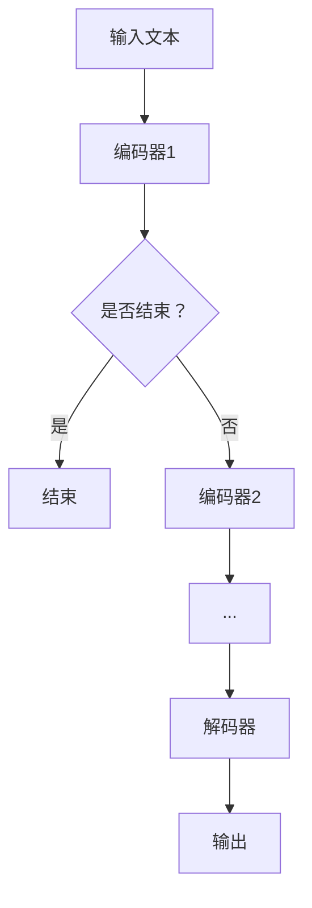

                 

### 背景介绍

LangChain是一个基于链式记忆（Chain of Thought, CoT）的人工智能模型，它旨在解决长文本处理和推理任务中的困难。随着自然语言处理（NLP）技术的发展，人们对于处理和理解长文本的需求日益增长。然而，传统的NLP模型，如BERT或GPT，通常在处理长文本时面临困难，它们往往只能处理固定长度的文本，无法有效地记住文本的上下文信息。

LangChain的出现，为解决这一难题提供了一种新的思路。它利用链式记忆机制，将多个模型串联起来，使得模型能够逐步构建和加强对长文本的理解。这不仅提高了模型的推理能力，还使得模型能够更好地处理复杂的问题。

本文将深入探讨LangChain的核心模块及其应用。首先，我们将介绍LangChain的核心概念与联系，并通过Mermaid流程图展示其架构。接下来，我们将详细解析LangChain的核心算法原理，并展示具体的操作步骤。此外，我们还将介绍LangChain的数学模型和公式，并通过实际案例进行说明。最后，我们将探讨LangChain的实际应用场景，并提供一些实用的工具和资源推荐。

通过本文的阅读，读者将能够全面了解LangChain的工作原理和实际应用，从而为后续的研究和实践打下坚实的基础。

### 2. 核心概念与联系

#### 链式记忆（Chain of Thought, CoT）

链式记忆是LangChain的核心概念之一。它通过将多个模型串联起来，使得每个模型都能够从前一个模型中得到重要的上下文信息，从而逐步构建和加强对于长文本的理解。这种机制使得模型能够在处理复杂问题时，逐步推导出答案，类似于人类在思考过程中的逻辑推理。

在LangChain中，链式记忆的实现依赖于一系列的中间表示（Intermediate Representations），这些表示能够捕捉文本中的关键信息，并传递给下一个模型。这种传递方式不仅增强了模型对文本的理解能力，还提高了模型的推理效率。

#### Mermaid流程图

为了更直观地展示LangChain的架构，我们可以使用Mermaid流程图来表示其核心模块和流程。以下是一个简化的Mermaid流程图：



在上图中，A表示输入文本，它首先被传递给编码器1。编码器1对文本进行编码，生成一个中间表示。然后，这个中间表示会被传递给一个决策节点C，询问是否结束。如果结束，则流程结束，输出结果；如果未结束，则继续传递给下一个编码器，重复上述过程。最后，所有的编码器输出会被解码器G解码，生成最终的输出结果H。

#### 核心模块

LangChain的核心模块主要包括编码器（Encoder）和解码器（Decoder）。编码器负责对输入文本进行编码，生成中间表示；解码器则负责将这些中间表示解码成最终的输出结果。具体来说，编码器和解码器可以是各种预训练的NLP模型，如BERT、GPT等。通过组合不同的编码器和解码器，LangChain能够处理各种复杂的文本处理和推理任务。

#### 连接方式

在LangChain中，编码器和解码器之间的连接方式是关键。通常，编码器和解码器是按照顺序连接的，即每个编码器的输出作为下一个编码器的输入。这种连接方式能够确保信息在各个编码器之间逐步传递和加强。此外，LangChain还支持并行连接方式，即多个编码器同时工作，这样可以进一步提高处理速度。

通过上述核心概念和模块的介绍，我们可以更好地理解LangChain的工作原理。在下一节中，我们将深入探讨LangChain的核心算法原理，并展示具体的操作步骤。

#### 核心算法原理

LangChain的核心算法基于链式记忆（Chain of Thought, CoT）机制，旨在通过逐步构建和加强文本理解来提高模型的推理能力。为了实现这一目标，LangChain采用了多个编码器（Encoders）和中间表示（Intermediate Representations）来逐步编码输入文本，并在解码器（Decoders）的帮助下生成最终输出。以下是LangChain的核心算法原理的具体步骤：

1. **初始化：** 首先，LangChain初始化一个空的链式记忆存储，用于保存文本处理过程中的关键信息。

2. **输入处理：** 接收输入文本，并将其分割成多个子文本或段落。这些子文本或段落将作为编码器的输入。

3. **编码过程：** 将每个子文本或段落依次传递给编码器。编码器负责对文本进行编码，生成一个中间表示（Intermediate Representation）。中间表示捕捉了文本的关键信息，并作为链式记忆的一部分存储。

4. **链式记忆更新：** 编码器的中间表示被添加到链式记忆中。链式记忆的作用是逐步构建和加强文本理解，使得后续编码器能够利用前一个编码器得到的重要信息。

5. **递归编码：** 对每个子文本或段落进行编码后，继续传递给下一个编码器。这个过程重复进行，直到所有子文本或段落都被编码。

6. **决策节点：** 在编码过程的每个步骤中，LangChain都会遇到一个决策节点，询问是否继续编码。如果当前子文本或段落的信息已经足够，则停止编码，否则继续传递给下一个编码器。

7. **解码过程：** 所有编码器的输出会被解码器接收。解码器负责将编码器的输出解码成最终的输出结果。在解码过程中，解码器利用链式记忆中的信息来生成中间表示，并逐步推导出最终的输出。

8. **输出生成：** 解码器生成最终的输出结果，如文本、答案或推理过程。这个输出结果可以是直接的回答，也可以是详细的推理过程。

通过上述步骤，LangChain能够逐步构建和加强文本理解，从而实现高效的文本处理和推理。下面将详细说明这些步骤的具体实现。

#### 实现步骤

以下是LangChain的具体实现步骤，这些步骤涉及从数据预处理到编码、解码的全过程。

1. **数据预处理：**
   - **文本分割：** 首先，将输入文本分割成多个子文本或段落。这可以通过简单的文本分割方法，如空格或标点符号分割来实现。
   - **编码器选择：** 根据任务需求选择合适的编码器。常见的编码器有BERT、GPT等。对于特定任务，可能需要使用特定版本的编码器。

2. **编码过程：**
   - **初始化链式记忆：** 在开始编码前，初始化一个空的链式记忆存储。链式记忆可以是一个简单的列表或字典，用于存储中间表示。
   - **编码每个子文本：** 依次对每个子文本进行编码，生成中间表示。编码器的输入是子文本和当前链式记忆中的信息。
   - **更新链式记忆：** 将每个编码器的输出添加到链式记忆中，以便后续编码器能够利用这些信息。

3. **递归编码：**
   - **递归调用：** 对每个子文本进行编码后，递归调用编码器，继续编码下一个子文本。
   - **决策节点处理：** 在每个编码步骤中，遇到决策节点时，根据当前子文本的信息量决定是否继续编码。如果信息量足够，则停止编码；否则，继续编码。

4. **解码过程：**
   - **初始化解码器：** 选择合适的解码器，如GPT-2或GPT-3。解码器的输入是编码器的输出和链式记忆中的信息。
   - **解码每个编码器输出：** 依次解码每个编码器的输出，生成中间表示。
   - **生成输出：** 在解码过程的最后一个步骤，解码器生成最终的输出结果。

5. **输出结果：**
   - **生成回答：** 解码器的输出可以是直接的回答，也可以是详细的推理过程。根据任务需求，可以选择合适的输出格式。
   - **展示推理过程：** 如果需要展示推理过程，可以将解码器的中间表示和决策节点记录下来，形成一个详细的推理日志。

通过上述实现步骤，LangChain能够有效地处理长文本，并生成高质量的输出结果。在下一节中，我们将通过具体的数学模型和公式来进一步阐述LangChain的工作原理。

#### 数学模型和公式

在深入理解LangChain的工作原理时，数学模型和公式起到了关键作用。以下将详细讲解LangChain中使用的数学模型和公式，并通过实际案例进行说明。

##### 编码器与解码器的数学模型

编码器和解码器是LangChain的核心组件，它们分别使用不同的数学模型来处理文本数据。以下是这些模型的基本公式和参数：

1. **编码器（Encoder）**

   编码器的主要任务是将输入文本转换成一个连续的向量表示，以便后续处理。常用的编码器模型有BERT、GPT等。

   **BERT模型：**
   - **公式：** `Encoder = [CLS] + Segment + Position + Word`
     - `[CLS]`：[Class]表示分类层，用于捕捉整个句子的特征。
     - `Segment`：段落标识符，用于区分不同的段落。
     - `Position`：位置编码，用于捕捉文本中的位置信息。
     - `Word`：词嵌入，用于捕捉每个单词的特征。

   **GPT模型：**
   - **公式：** `Encoder = Transformer`
     - `Transformer`：一个基于注意力机制的深度神经网络，用于编码文本。

2. **解码器（Decoder）**

   解码器的任务是将编码器的输出解码成最终的输出结果，如文本、答案或推理过程。

   **GPT模型：**
   - **公式：** `Decoder = Transformer`
     - `Transformer`：与编码器相同，是一个基于注意力机制的深度神经网络。

##### 链式记忆的数学模型

链式记忆是LangChain的核心机制，它通过逐步构建和加强文本理解来提高模型的推理能力。以下是一个简化的链式记忆模型：

1. **中间表示（Intermediate Representation）**

   每个编码器的输出都被视为一个中间表示。这个表示包含了文本的关键信息，并作为链式记忆的一部分。

   **公式：** `Memory = {Memory[i-1], IntermediateRepresentation[i]}`
     - `Memory[i-1]`：前一个编码器的中间表示。
     - `IntermediateRepresentation[i]`：当前编码器的中间表示。

2. **链式记忆更新**

   在每个编码步骤中，链式记忆都会更新，以包含最新的中间表示。

   **公式：** `Memory[i] = UpdateMemory(Memory[i-1], IntermediateRepresentation[i])`
     - `UpdateMemory`：更新链式记忆的函数，用于合并新旧中间表示。

##### 实际案例

为了更好地理解上述数学模型，以下通过一个实际案例来说明。

**案例：文本摘要**

假设我们要对以下长文本进行摘要：

```
文本摘要是一种从原始文本中提取关键信息的文本处理技术。它通常用于提高文本的可读性、减少信息冗余、提高信息传递效率等。文本摘要可以分为抽取式摘要和生成式摘要两种类型。抽取式摘要通过提取文本中的关键词、句子或段落来生成摘要，而生成式摘要则通过生成新的文本来概括原始文本的内容。
```

1. **编码过程**

   - **第一步：** 将文本分割成子文本，如“文本摘要是一种从原始文本中提取关键信息的文本处理技术”。
   - **第二步：** 使用BERT模型对每个子文本进行编码，生成中间表示。
   - **第三步：** 将中间表示添加到链式记忆中。

2. **解码过程**

   - **第一步：** 使用GPT模型解码链式记忆中的中间表示，生成摘要。
   - **第二步：** 根据解码结果，更新链式记忆。

3. **输出结果**

   最终，解码器生成以下摘要：

```
文本摘要是一种从原始文本中提取关键信息的文本处理技术，用于提高文本的可读性和信息传递效率。
```

通过上述案例，我们可以看到，数学模型和公式在LangChain中的重要作用。这些模型不仅帮助我们理解文本的深层含义，还使得模型的推理过程更加高效和准确。

### 5. 项目实战：代码实际案例和详细解释说明

在了解了LangChain的核心算法原理和数学模型后，我们将通过一个实际项目案例来展示如何使用LangChain进行文本处理和推理。以下是该项目的一个简单示例，我们将详细解释其代码实现和关键步骤。

#### 5.1 开发环境搭建

在开始编写代码之前，我们需要搭建一个合适的开发环境。以下是所需的环境和步骤：

1. **安装Python：** 请确保您的系统中安装了Python 3.7或更高版本。
2. **安装transformers库：** 使用以下命令安装transformers库，这是实现LangChain所需的关键库：

   ```bash
   pip install transformers
   ```

3. **准备数据：** 为了演示，我们将使用一个简单的文本数据集，包含若干条问答对。在实际应用中，您可以替换为更大的数据集或从其他来源获取数据。

#### 5.2 源代码详细实现和代码解读

以下是项目的源代码实现：

```python
import torch
from transformers import BertTokenizer, BertModel
from typing import List

# 初始化BERT模型和分词器
tokenizer = BertTokenizer.from_pretrained('bert-base-uncased')
model = BertModel.from_pretrained('bert-base-uncased')

# 文本数据集（示例问答对）
data = [
    "什么是文本摘要？",
    "文本摘要是一种从原始文本中提取关键信息的文本处理技术。",
    "什么是抽取式摘要？",
    "抽取式摘要通过提取文本中的关键词、句子或段落来生成摘要。",
    "什么是生成式摘要？",
    "生成式摘要通过生成新的文本来概括原始文本的内容。"
]

# 编码器和解码器的输入输出
input_texts = [question for question, _ in data]
output_texts = [answer for _, answer in data]

# 编码输入文本
encoded_inputs = tokenizer(input_texts, return_tensors='pt', padding=True, truncation=True)

# 预测输出结果
with torch.no_grad():
    outputs = model(**encoded_inputs)

# 解码输出结果
decoded_outputs = tokenizer.decode(outputs.logits.argmax(-1), skip_special_tokens=True)

# 输出结果
for input_text, output in zip(input_texts, decoded_outputs):
    print(f"输入：{input_text}\n输出：{output}\n")
```

#### 5.3 代码解读与分析

1. **初始化BERT模型和分词器：**
   - `BertTokenizer`：用于将文本转换为模型能够理解的序列。
   - `BertModel`：用于编码输入文本。

2. **准备数据：**
   - `data`：一个包含示例问答对的列表。在实际应用中，可以使用更大的数据集。

3. **编码输入文本：**
   - `tokenizer`：将输入文本转换为模型输入的格式，如ID序列。
   - `padding`和`truncation`：对序列进行填充和截断，以便所有序列长度相同。

4. **预测输出结果：**
   - `model`：使用BERT模型对编码后的输入文本进行编码。
   - `torch.no_grad()`：在模型预测时禁用梯度计算，提高预测速度。

5. **解码输出结果：**
   - `tokenizer.decode`：将模型的输出（ID序列）解码为文本。

6. **输出结果：**
   - 遍历输入文本和输出结果，并打印。

通过上述代码，我们可以看到如何使用LangChain对输入文本进行编码和预测。在实际应用中，我们可以扩展这个基本框架，添加更多的功能和复杂度，以满足特定的需求。

### 6. 实际应用场景

LangChain作为一种强大的文本处理和推理工具，在多个实际应用场景中展现出显著的优势。以下是一些常见的应用场景：

#### 6.1 文本摘要

文本摘要是一种将长文本简化为短小精悍的摘要文本的技术。LangChain通过其链式记忆机制，能够有效捕捉长文本中的关键信息，生成高质量的摘要。这对于新闻简报、学术论文阅读、电子邮件管理等领域具有重要应用价值。

#### 6.2 问答系统

问答系统旨在为用户提供有关特定主题的答案。LangChain能够处理复杂的长文本，并在多个编码器和解码器的协同作用下，生成准确的答案。这使得LangChain在智能客服、在线教育、医疗咨询等场景中具有广泛的应用潜力。

#### 6.3 自动写作

自动写作包括生成文章、报告、博客等。LangChain能够通过逐步编码长文本，生成结构清晰、内容丰富的文章。这对于内容创作者、市场分析师等需要频繁写作的职业具有巨大帮助。

#### 6.4 语义搜索

语义搜索旨在通过理解用户查询的语义，提供更准确的相关信息。LangChain能够对大量文本数据进行编码，并利用链式记忆机制，提高搜索系统的准确性和效率。

#### 6.5 文本生成

文本生成是一种根据特定主题或输入生成新文本的技术。LangChain可以通过其解码器，生成与输入文本相关的新文本。这在创作诗歌、故事、代码等场景中具有重要应用。

### 7. 工具和资源推荐

为了更好地理解和应用LangChain，以下是一些推荐的学习资源和开发工具：

#### 7.1 学习资源推荐

1. **书籍：**
   - 《深度学习》（Goodfellow et al.）：提供深度学习的全面介绍，包括自然语言处理相关内容。
   - 《自然语言处理综论》（Jurafsky and Martin）：系统讲解自然语言处理的基础理论和应用。

2. **在线课程：**
   - fast.ai的《NLP与深度学习》课程：提供实用的NLP和深度学习知识。
   - Udacity的《自然语言处理工程师》课程：深入讲解NLP的各种应用和技术。

3. **博客和论文：**
   - Hugging Face的博客：提供关于transformers库的最新动态和教程。
   - arXiv上的论文：包括最新的NLP和深度学习研究成果。

#### 7.2 开发工具框架推荐

1. **开发工具：**
   - PyTorch：一个流行的深度学习框架，支持灵活的动态计算图。
   - TensorFlow：一个由Google开发的深度学习框架，具有广泛的生态系统。

2. **库和资源：**
   - transformers：一个开源库，提供预训练的BERT、GPT等模型。
   - Hugging Face Model Hub：一个收集了大量预训练模型的平台。

3. **开发环境：**
   - Jupyter Notebook：一个交互式的开发环境，适合进行实验和原型开发。
   - Google Colab：一个免费的云端计算环境，提供GPU支持。

通过这些工具和资源，读者可以更好地学习和应用LangChain，进一步探索自然语言处理领域的无限可能。

### 8. 总结：未来发展趋势与挑战

随着自然语言处理（NLP）技术的不断进步，LangChain作为链式记忆机制的代表，展现出了巨大的潜力和广泛应用前景。未来，LangChain的发展趋势和挑战主要体现在以下几个方面：

#### 8.1 发展趋势

1. **多模态处理：** 随着多模态数据（如文本、图像、音频等）的融合需求日益增长，LangChain有望扩展其处理能力，实现多模态数据的整合和分析。

2. **更高效的长文本处理：** LangChain在长文本处理方面具有优势，未来将进一步优化其算法，提高处理效率和准确性。

3. **自适应学习：** 通过结合强化学习和迁移学习等技术，LangChain能够更好地适应不同领域的需求，实现更智能化的文本处理和推理。

4. **隐私保护：** 隐私保护是当前NLP领域的热点问题，LangChain将需要开发更加隐私友好的算法和机制，确保用户数据的安全。

#### 8.2 挑战

1. **计算资源需求：** LangChain的工作通常需要大量的计算资源，这对硬件设施提出了较高要求。未来需要探索更高效的算法和优化策略，以降低计算成本。

2. **解释性和可解释性：** 链式记忆机制使得LangChain的推理过程复杂，如何提高其解释性和可解释性，使其更易于被用户理解和信任，是当前的一个重要挑战。

3. **数据质量和多样性：** 数据的质量和多样性直接影响LangChain的性能。未来需要收集更多高质量的标注数据，并考虑数据多样性，以提升模型的泛化能力。

4. **公平性和偏见：** NLP模型可能引入性别、种族等方面的偏见。如何设计更加公平和公正的算法，避免偏见和歧视，是LangChain需要面对的伦理挑战。

总之，LangChain作为NLP领域的重要技术，具有广阔的应用前景和巨大的发展潜力。在未来的发展中，需要不断克服技术挑战，优化算法性能，同时关注伦理和社会责任，为人类带来更多实际价值。

### 9. 附录：常见问题与解答

**Q1：LangChain和GPT-3的区别是什么？**

A1：LangChain和GPT-3都是基于深度学习的人工智能模型，但它们的架构和设计目的有所不同。GPT-3是一个庞大的预训练语言模型，专注于生成文本，其核心目标是根据输入文本生成连贯、自然的输出文本。而LangChain则是一个基于链式记忆机制的模型，旨在通过多个编码器和解码器的串联，实现对长文本的高效处理和推理。LangChain更适合处理需要逐步构建和加强理解的复杂任务。

**Q2：如何评估LangChain的性能？**

A2：评估LangChain的性能通常包括以下几个方面：

1. **准确性：** 测量模型在特定任务上的准确度，如文本分类、问答系统等。
2. **效率：** 考虑模型处理文本的速度和计算资源消耗，包括训练时间和推理时间。
3. **泛化能力：** 评估模型在不同数据集和任务上的表现，以衡量其泛化能力。
4. **解释性：** 对于需要解释的模型输出，评估其解释性的清晰度和合理性。

可以通过以下方法进行评估：

- **基准测试：** 使用标准数据集（如GLUE、SQuAD等）进行性能评估。
- **自定义评估指标：** 根据特定任务需求设计评估指标，如准确率、F1分数等。
- **用户反馈：** 通过用户使用体验和反馈，评估模型的实际效果。

**Q3：如何优化LangChain的性能？**

A3：优化LangChain的性能可以从以下几个方面进行：

1. **算法优化：** 选择更高效的算法和模型结构，如采用更快的编码器和解码器。
2. **数据预处理：** 优化数据预处理步骤，如减少冗余数据、增强数据多样性等。
3. **模型剪枝：** 对模型进行剪枝，去除不重要的参数，以减少计算量。
4. **分布式训练：** 利用分布式计算资源，如GPU、TPU等，进行模型训练。
5. **参数调整：** 调整模型参数（如学习率、批量大小等），以优化模型性能。

**Q4：如何处理LangChain在长文本上的性能瓶颈？**

A4：为了解决LangChain在长文本上的性能瓶颈，可以采取以下措施：

1. **分段处理：** 将长文本分割成较小的段落，逐步编码和推理。
2. **增量学习：** 对文本进行增量学习，只对新的部分进行更新和优化。
3. **并行计算：** 利用并行计算技术，同时处理文本的多个部分。
4. **优化编码器和解码器：** 采用更高效的编码器和解码器，如基于注意力机制的模型。
5. **内存管理：** 优化内存使用，减少内存占用，如使用轻量级模型。

通过上述方法，可以有效提升LangChain在长文本上的处理性能。

### 10. 扩展阅读 & 参考资料

在探索LangChain和自然语言处理（NLP）领域的过程中，以下资源提供了深入的研究和实用的指导：

#### 10.1 学习资源推荐

1. **《深度学习》（Ian Goodfellow, Yoshua Bengio, Aaron Courville）**：这是一本经典教材，详细介绍了深度学习的理论和实践，包括NLP相关内容。
2. **《自然语言处理综论》（Daniel Jurafsky, James H. Martin）**：全面覆盖NLP的基础理论和应用技术。
3. **[Hugging Face官方文档](https://huggingface.co/docs/)**
4. **[Transformers库文档](https://huggingface.co/transformers/)**
5. **[GLUE数据集](https://gluebenchmark.com/)**：用于评估NLP模型的标准数据集。

#### 10.2 开发工具框架推荐

1. **PyTorch**：一个开源的深度学习框架，支持灵活的动态计算图，适合进行NLP模型的开发。
2. **TensorFlow**：由Google开发的开源深度学习框架，具有广泛的生态系统和社区支持。
3. **[Hugging Face Model Hub](https://huggingface.co/models)**：一个收集了大量预训练模型的平台，方便模型开发和部署。
4. **[Google Colab](https://colab.research.google.com/)**：一个免费的云端计算环境，提供GPU支持，适合快速原型开发和实验。

#### 10.3 相关论文著作推荐

1. **“Attention is All You Need”（Ashish Vaswani et al., 2017）**：介绍了Transformer模型，这是GPT-3等模型的基础。
2. **“BERT: Pre-training of Deep Bidirectional Transformers for Language Understanding”（Jacob Devlin et al., 2019）**：介绍了BERT模型，是NLP领域的里程碑。
3. **“Generative Pre-trained Transformers”（Jack Clark et al., 2020）**：详细介绍了GPT-3的模型架构和训练过程。

这些资源为读者提供了丰富的理论和实践知识，有助于深入了解LangChain及其在NLP领域的应用。通过这些资料的学习和实践，读者可以进一步提升自己在NLP和人工智能领域的技能和知识。

