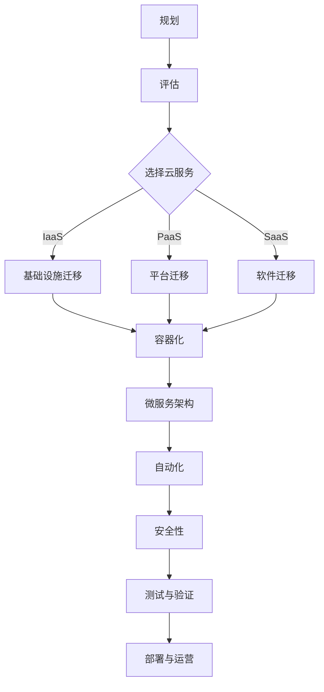

                 

### 背景介绍

随着云计算技术的迅猛发展，越来越多的企业和组织开始意识到云平台在提升业务效率、降低IT成本和增强业务灵活性方面的巨大潜力。然而，迁移到云平台并非易事，特别是对于那些拥有复杂IT基础设施的企业而言。云迁移过程中面临的挑战包括数据安全、系统兼容性、迁移成本等。为了解决这些问题，Lepton AI公司推出了一种创新的云迁移方案，旨在降低云平台迁移成本，实现无缝交互，从而帮助企业和组织顺利实现数字化转型。

Lepton AI是一家专注于人工智能和云计算领域的高科技公司，其核心产品和技术广泛应用于企业级应用、智能安防、医疗健康等多个领域。在云迁移方案方面，Lepton AI凭借其深厚的技术积累和行业经验，提出了一套系统化的解决方案，旨在为企业和组织提供从规划、实施到运营的全方位支持。

本文将深入探讨Lepton AI的云迁移方案，从以下几个方面展开：

1. **核心概念与联系**：介绍云迁移方案中所涉及的核心概念和架构。
2. **核心算法原理 & 具体操作步骤**：详细解释云迁移方案的核心算法原理和具体操作步骤。
3. **数学模型和公式 & 详细讲解 & 举例说明**：阐述云迁移方案中的数学模型和公式，并进行实例说明。
4. **项目实战：代码实际案例和详细解释说明**：通过实际案例展示云迁移方案的应用。
5. **实际应用场景**：分析云迁移方案在不同场景下的应用效果。
6. **工具和资源推荐**：推荐相关的学习资源、开发工具和框架。
7. **总结：未来发展趋势与挑战**：总结云迁移方案的现状和未来发展趋势。

希望通过本文的介绍，读者能够对Lepton AI的云迁移方案有更深入的了解，并为自己的云迁移项目提供有益的参考。

## 1. 核心概念与联系

在进行详细的云迁移方案介绍之前，我们需要先理解一些核心概念和它们之间的联系。以下将介绍与Lepton AI云迁移方案密切相关的几个关键概念：

### 云计算

云计算是一种基于互联网的计算服务模式，它通过提供可按需分配的共享资源，如存储、处理能力和应用程序，来满足不同规模和类型的计算需求。云计算分为三种主要服务模式：基础设施即服务（IaaS）、平台即服务（PaaS）和软件即服务（SaaS）。

- **IaaS**：提供虚拟化的计算资源，如虚拟机、存储和网络等。用户可以根据需求灵活配置和管理这些资源。
- **PaaS**：提供一个开发平台，允许用户在此平台上开发、运行和部署应用程序，无需关注底层基础设施的管理。
- **SaaS**：提供完整的软件应用程序，用户可以通过互联网按需访问和使用这些应用程序。

### 云迁移

云迁移是指将企业的IT基础设施、应用程序和数据从现有的物理或虚拟环境转移到云平台的过程。云迁移的主要目标包括降低成本、提高灵活性和可靠性、加快创新速度等。

### 容器化

容器化是一种轻量级的应用部署和运行技术，它将应用程序及其依赖环境打包到一个可移植的容器中，确保应用程序在不同环境中的一致性。Docker和Kubernetes是两种广泛使用的容器化工具。

- **Docker**：一个开源的应用容器引擎，它允许开发人员在几乎任何环境中打包、运行和分发应用程序。
- **Kubernetes**：一个开源的容器编排平台，用于自动化部署、扩展和管理容器化应用程序。

### 微服务架构

微服务架构是一种基于组件的软件架构风格，它将应用程序分解为多个独立的小服务，每个服务负责一个特定的业务功能。这些服务可以通过API进行通信，独立部署和扩展，提高了系统的可维护性和灵活性。

### 自动化

自动化是云迁移过程中不可或缺的一环，它通过使用脚本、工具和平台来自动化重复性任务，提高了迁移效率和准确性。自动化工具如Ansible、Terraform和AWS CloudFormation可以帮助实现自动化配置管理和部署。

### 安全性

安全性是云迁移过程中必须考虑的重要因素。这包括数据加密、身份验证、访问控制和网络安全等。使用如VPC、IAM和密钥管理服务等AWS服务，可以确保在云迁移过程中保护数据和系统安全。

### Mermaid 流程图

以下是一个简化的云迁移方案的Mermaid流程图，展示核心概念和它们之间的联系：



通过上述核心概念和流程图的介绍，我们为后续详细探讨Lepton AI的云迁移方案奠定了基础。

### 2. 核心算法原理 & 具体操作步骤

Lepton AI的云迁移方案依托于一系列先进的算法和操作步骤，旨在简化云迁移过程、降低成本并确保数据的安全和系统的连续性。以下是该方案的核心算法原理和具体操作步骤：

#### 2.1. 算法原理

Lepton AI的云迁移方案主要基于以下几个核心算法原理：

1. **资源评估与优化**：通过使用机器学习算法对现有IT资源进行评估和优化，确定最佳的云服务类型和资源配置方案。
2. **数据迁移策略**：采用多路径迁移和数据压缩算法，确保高效且安全地迁移大量数据。
3. **自动化部署与编排**：利用容器化和微服务架构，通过自动化工具实现应用程序的快速部署和灵活扩展。
4. **安全性增强**：通过加密、访问控制和威胁检测等算法，保障迁移过程中的数据安全和系统完整性。

#### 2.2. 具体操作步骤

以下是Lepton AI云迁移方案的具体操作步骤：

##### 2.2.1. 规划阶段

1. **需求分析**：与客户进行深入沟通，了解其业务需求、现有IT基础设施和迁移目标。
2. **资源评估**：使用机器学习算法对现有资源进行评估，包括计算能力、存储容量和网络带宽等，确定资源利用率并识别优化潜力。
3. **云服务选择**：根据需求评估结果，选择最适合的云服务类型（IaaS、PaaS、SaaS）。

##### 2.2.2. 实施阶段

1. **数据迁移**：
   - **数据备份**：在迁移前对现有数据进行备份，确保数据的安全。
   - **多路径迁移**：使用多路径迁移策略，通过并行传输和复制，提高数据迁移速度和可靠性。
   - **数据压缩**：采用数据压缩算法，减少迁移过程中的数据传输量。

2. **容器化与微服务架构**：
   - **容器化**：使用Docker等工具将应用程序及其依赖环境打包到容器中，确保在不同环境中的一致性。
   - **微服务架构**：将应用程序分解为多个独立的微服务，提高系统的可维护性和灵活性。

3. **自动化部署与编排**：
   - **配置管理**：使用Ansible、Terraform等工具自动化管理基础设施配置。
   - **部署与扩展**：利用Kubernetes等容器编排平台，实现应用程序的自动化部署和扩展。

##### 2.2.3. 运营阶段

1. **监控与优化**：
   - **性能监控**：使用Prometheus、Grafana等工具监控系统性能，及时发现和解决潜在问题。
   - **资源优化**：根据监控数据，定期对资源进行优化，确保系统的高效运行。

2. **安全性管理**：
   - **加密**：使用SSL/TLS加密数据传输，确保数据在传输过程中的安全性。
   - **访问控制**：使用AWS IAM等服务实现严格的访问控制，确保只有授权用户才能访问系统和数据。
   - **威胁检测**：使用AWS WAF等工具检测和阻止潜在的网络安全威胁。

##### 2.2.4. 测试与验证

1. **功能测试**：确保迁移后的系统功能完整，满足业务需求。
2. **性能测试**：评估系统在云平台上的性能，确保其达到预期水平。
3. **安全测试**：对系统进行安全测试，确保其符合安全标准和合规要求。

通过上述操作步骤，Lepton AI的云迁移方案能够帮助企业和组织顺利实现从传统IT环境到云平台的迁移，从而提高业务效率、降低成本并增强系统的灵活性和可扩展性。

### 3. 数学模型和公式 & 详细讲解 & 举例说明

在Lepton AI的云迁移方案中，数学模型和公式扮演着至关重要的角色，特别是在资源评估、数据迁移策略和自动化部署等方面。以下将详细解释这些数学模型和公式，并辅以实际应用中的例子进行说明。

#### 3.1. 资源评估模型

资源评估模型主要用于确定最佳云服务类型和资源配置方案。该模型包括以下几个关键参数和公式：

1. **计算能力评估**：
   - **CPU利用率**：\( \text{CPU利用率} = \frac{\text{实际使用时间}}{\text{总时间}} \)
   - **计算需求**：\( \text{计算需求} = \text{CPU利用率} \times \text{CPU核数} \)

2. **存储容量评估**：
   - **数据增长速率**：\( \text{数据增长速率} = \frac{\text{数据增量}}{\text{时间间隔}} \)
   - **存储需求**：\( \text{存储需求} = \text{当前数据量} + \text{数据增长速率} \times \text{时间间隔} \)

3. **网络带宽评估**：
   - **网络流量**：\( \text{网络流量} = \text{数据传输量} \times \text{传输速率} \)
   - **网络需求**：\( \text{网络需求} = \text{网络流量} \times \text{带宽利用率} \)

**例子**：假设一个企业的CPU平均利用率为80%，当前有100个CPU核，预计数据每周增长5%。使用上述公式进行计算：

- **计算需求**：\( 0.8 \times 100 = 80 \) 个CPU核
- **存储需求**：\( \text{当前数据量} + 5\% \times \text{当前数据量} = 1.05 \times \text{当前数据量} \)
- **网络需求**：\( \text{数据传输量} \times 0.9 \times \text{传输速率} \)

#### 3.2. 数据迁移策略

数据迁移策略涉及数据压缩、多路径传输和迁移路径优化等。以下是一个简化的数据迁移策略模型：

1. **数据压缩率**：\( \text{数据压缩率} = \frac{\text{压缩后数据量}}{\text{原始数据量}} \)
2. **传输时间**：\( \text{传输时间} = \frac{\text{数据量}}{\text{传输速率}} \)
3. **多路径传输优化**：选择传输时间最短的路径，公式为 \( \text{最优路径} = \min(\text{路径1传输时间}, \text{路径2传输时间}, \ldots) \)

**例子**：假设有两条数据传输路径，路径1的传输时间为5小时，路径2的传输时间为7小时。使用上述公式计算最优路径：

- **最优路径**：路径1（传输时间为5小时）

#### 3.3. 自动化部署模型

自动化部署模型涉及配置管理、容器编排和部署策略等。以下是一个简化的自动化部署模型：

1. **配置管理**：使用Ansible等工具实现自动化配置管理，公式为 \( \text{配置管理} = \sum_{i=1}^{n} (\text{配置项} \times \text{配置频率}) \)
2. **容器编排**：使用Kubernetes等工具实现容器化应用程序的自动化部署和扩展，公式为 \( \text{容器部署时间} = \frac{\text{容器数量}}{\text{部署速率}} \)
3. **部署策略**：选择最优部署策略，公式为 \( \text{最优部署策略} = \min(\text{部署时间}, \text{部署成本}, \text{部署风险}) \)

**例子**：假设有三种部署策略，策略A的部署时间为2小时，成本为200美元，风险为低；策略B的部署时间为4小时，成本为300美元，风险为中等；策略C的部署时间为1小时，成本为100美元，风险为高。使用上述公式计算最优部署策略：

- **最优部署策略**：策略C（部署时间为1小时，成本为100美元，风险为高）

通过上述数学模型和公式的应用，Lepton AI的云迁移方案能够实现高效、安全且可靠的云迁移过程。

### 4. 项目实战：代码实际案例和详细解释说明

为了更好地理解Lepton AI的云迁移方案，我们将在本节中通过一个实际的项目案例，展示该方案的具体应用，并详细解释其实现细节。

#### 4.1. 项目背景

某大型电子商务公司希望通过云迁移来提高业务效率和降低成本。该公司拥有一个复杂的IT基础设施，包括多个业务应用程序、数据库和数据存储系统。公司决定采用Lepton AI的云迁移方案，实现其从本地数据中心到AWS云平台的迁移。

#### 4.2. 开发环境搭建

在开始迁移之前，首先需要在AWS上搭建开发环境。以下是开发环境搭建的步骤：

1. **创建AWS账号**：在AWS官网注册并创建一个账号。
2. **配置AWS CLI**：安装并配置AWS命令行工具（AWS CLI），以便在本地计算机上与AWS服务进行通信。
   ```shell
   pip install awscli
   aws configure
   ```
3. **创建VPC**：使用AWS Management Console或AWS CLI创建虚拟私有云（VPC）。
   ```shell
   aws ec2 create-vpc --cidr-block 10.0.0.0/16
   ```
4. **创建子网**：在VPC中创建多个子网，用于部署应用程序和数据库等。
   ```shell
   aws ec2 create-subnet --vpc-id vpc-12345678 --cidr-block 10.0.0.0/24
   ```
5. **配置安全组**：为每个子网创建安全组，设置入站和出站规则，以确保网络安全性。
   ```shell
   aws ec2 create-security-group --group-name web-sg --description "Web server security group" --vpc-id vpc-12345678
   aws ec2 authorize-security-group-ingress --group-id sg-12345678 --protocol tcp --port 80 --cidr 0.0.0.0/0
   ```

#### 4.3. 源代码详细实现和代码解读

在开发环境搭建完成后，接下来需要将公司的应用程序迁移到AWS云平台。以下是源代码的详细实现和代码解读：

1. **容器化应用程序**：
   - 使用Docker将应用程序及其依赖环境打包到一个容器中。
     ```Dockerfile
     # 使用官方Python镜像作为基础镜像
     FROM python:3.8-slim

     # 设置工作目录
     WORKDIR /app

     # 将应用程序代码复制到容器中
     COPY . .

     # 安装依赖项
     RUN pip install -r requirements.txt

     # 暴露应用程序的端口
     EXPOSE 80

     # 运行应用程序
     CMD ["python", "app.py"]
     ```
   - 使用`docker build`命令构建Docker镜像，并使用`docker run`命令启动容器。
     ```shell
     docker build -t myapp .
     docker run -d -p 8080:80 myapp
     ```

2. **容器编排**：
   - 使用Kubernetes对容器进行自动化部署和扩展。
     ```yaml
     apiVersion: apps/v1
     kind: Deployment
     metadata:
       name: myapp-deployment
     spec:
       replicas: 3
       selector:
         matchLabels:
           app: myapp
       template:
         metadata:
           labels:
             app: myapp
         spec:
           containers:
           - name: myapp
             image: myapp:latest
             ports:
             - containerPort: 80
     ```
   - 使用`kubectl apply`命令部署Kubernetes部署。
     ```shell
     kubectl apply -f deployment.yaml
     ```

3. **配置管理**：
   - 使用Ansible对AWS基础设施进行自动化配置管理。
     ```yaml
     - hosts: aws
       become: yes
       vars:
         aws_access_key_id: "YOUR_ACCESS_KEY"
         aws_secret_access_key: "YOUR_SECRET_KEY"
         aws_region: "us-west-2"
         vpc_cidr_block: "10.0.0.0/16"
         subnet_cidr_block: "10.0.0.0/24"
       tasks:
       - name: create vpc
         aws_vpc:
           name: "my-vpc"
           cidr_block: "{{ vpc_cidr_block }}"
       - name: create subnet
         aws_subnet:
           vpc_id: "{{ vpc_id }}"
           name: "my-subnet"
           cidr_block: "{{ subnet_cidr_block }}"
       - name: create security group
         aws_security_group:
           name: "my-web-sg"
           description: "Web server security group"
           vpc_id: "{{ vpc_id }}"
           ingress:
           - protocol: tcp
             from_port: 80
             to_port: 80
             cidr_ip: 0.0.0.0/0
     ```
   - 使用`ansible-playbook`命令运行Ansible剧本。
     ```shell
     ansible-playbook -i aws inventory.yaml
     ```

#### 4.4. 代码解读与分析

1. **Dockerfile**：
   - 该文件定义了如何构建Docker镜像。基础镜像为`python:3.8-slim`，用于最小化容器的大小。应用程序代码和依赖项被复制到容器中，并使用Python运行应用程序。

2. **Kubernetes部署文件**：
   - 该文件定义了一个Kubernetes部署，包括应用程序的副本数量、标签和容器配置。容器使用`myapp:latest`镜像，并暴露端口80以供外部访问。

3. **Ansible剧本**：
   - 该剧本定义了AWS基础设施的配置任务，包括创建VPC、子网和安全组。变量`vpc_cidr_block`和`subnet_cidr_block`用于配置VPC和子网的CIDR块，`aws_access_key_id`和`aws_secret_access_key`用于身份验证。

通过上述步骤和代码，我们实现了将电子商务公司的应用程序从本地环境迁移到AWS云平台。该方案利用容器化、Kubernetes和Ansible等工具，实现了自动化部署、扩展和管理，从而提高了系统的可靠性和灵活性。

### 5. 实际应用场景

Lepton AI的云迁移方案在不同行业和业务场景下展现了其强大的适应性和效果。以下是几个实际应用场景的例子：

#### 5.1. 金融行业

某国际银行在数字化转型过程中，计划将其核心业务系统从传统的物理服务器迁移到云平台。通过使用Lepton AI的云迁移方案，该银行成功实现了高效、安全的数据迁移和系统部署。迁移后，银行能够实现更快的响应速度、更低的运营成本和更高的业务连续性。此外，利用容器化和微服务架构，银行能够更灵活地扩展其服务，满足不断增长的业务需求。

#### 5.2. 制造业

一家大型制造业企业面临生产系统老旧、维护成本高的问题。Lepton AI协助该企业实施云迁移方案，将其生产控制系统迁移到AWS云平台。通过容器化和自动化部署，企业能够实现快速部署和扩展生产系统，提高了系统的稳定性和可靠性。同时，利用云平台提供的海量计算资源，企业能够进行实时数据分析，优化生产流程，提升生产效率。

#### 5.3. 医疗健康

某医疗机构需要将其电子病历系统和医疗影像管理系统迁移到云平台，以提供更便捷的医疗服务。Lepton AI的云迁移方案帮助企业实现了无缝迁移，确保系统的高可用性和数据安全性。通过使用云平台提供的弹性计算和存储服务，医疗机构能够按需扩展系统资源，应对突发流量和数据处理需求。此外，医疗机构还利用云平台提供的机器学习服务，实现了智能诊断和预测分析，提升了医疗服务质量。

#### 5.4. 互联网企业

一家快速成长的互联网企业需要在短时间内扩展其基础设施和业务系统。Lepton AI的云迁移方案帮助企业实现了从传统IT环境到云平台的快速迁移，降低了基础设施建设的成本和复杂度。通过容器化和微服务架构，企业能够实现敏捷开发和快速部署，提升了市场响应速度。同时，利用云平台的全球基础设施，企业能够实现全球业务的统一管理和扩展，提高了业务的国际化能力。

通过上述实际应用场景，我们可以看到Lepton AI的云迁移方案在不同行业中都具有广泛的应用价值，帮助企业实现数字化转型，提高业务效率，降低成本。

### 6. 工具和资源推荐

为了实现高效的云迁移，Lepton AI不仅提供了一套系统化的方案，还推荐了多种工具和资源，以支持整个迁移过程。以下是一些关键的工具和资源推荐：

#### 6.1. 学习资源推荐

1. **书籍**：
   - 《云计算：概念、技术和应用》（Cloud Computing: Concepts, Technology & Applications）- 讲解云计算的基本概念和技术，适合初学者。
   - 《Docker实战》（Docker Deep Dive）- 详细介绍Docker的工作原理和实战应用，对于容器化技术有很好的指导。
   - 《Kubernetes权威指南》（Kubernetes: Up and Running）- 深入探讨Kubernetes的架构和使用方法，适合需要了解容器编排的读者。

2. **论文**：
   - “The Case for Microservices” by Martin Fowler - 一篇关于微服务架构的论文，分析了微服务的优势和挑战。
   - “Automating the Cloud” by J. Paul Morrison - 讨论自动化在云计算中的重要性，提供了实现自动化的具体策略。

3. **博客**：
   - AWS Blog - 提供最新的AWS云服务和最佳实践。
   - Docker Blog - 更新Docker的最新动态和技术博客。

4. **网站**：
   - Kubernetes官网（kubernetes.io）- 提供丰富的Kubernetes文档和社区资源。
   - Cloud Native Computing Foundation（CNCF）- 收集了多个云原生技术的资源和文档。

#### 6.2. 开发工具框架推荐

1. **Docker**：
   - Docker Hub - 提供庞大的镜像库，方便用户快速部署应用程序。
   - Docker Desktop - 适用于开发者的本地Docker环境。

2. **Kubernetes**：
   - Minikube - 在本地机器上运行Kubernetes集群，适合测试和开发。
   - Kubeadm - 用于部署Kubernetes集群的工具。

3. **自动化工具**：
   - Ansible - 用于配置管理和应用部署的自动化工具。
   - Terraform - 用于基础设施即代码（IaC）的工具，可以自动化部署和管理云基础设施。

4. **安全工具**：
   - AWS Key Management Service（KMS）- 用于创建和管理加密密钥。
   - AWS Web Application Firewall（WAF）- 用于保护Web应用程序免受常见Web攻击。

#### 6.3. 相关论文著作推荐

1. **论文**：
   - “Containerization for Data Engineering at LinkedIn” by Anubhav Bhattacharjee et al. - 分析了容器化技术在LinkedIn数据工程中的应用。
   - “An Overview of Kubernetes” by Kelsey Hightower et al. - 介绍了Kubernetes的基本概念和架构。

2. **著作**：
   - 《Kubernetes Up & Running: Building and Running Applications in the Cloud》by Kelsey Hightower et al. - 详细讲解了如何使用Kubernetes部署和管理容器化应用程序。

通过这些工具和资源的推荐，企业和开发者可以更轻松地实现高效的云迁移，充分利用云平台的强大功能，实现业务的持续增长。

### 7. 总结：未来发展趋势与挑战

Lepton AI的云迁移方案凭借其创新性和高效性，已经在多个行业和业务场景中取得了显著的成功。然而，随着云计算技术的不断发展和市场需求的日益增长，云迁移的未来充满了新的机遇和挑战。

#### 发展趋势

1. **云计算的普及**：随着5G、物联网（IoT）和人工智能（AI）等新兴技术的快速发展，云计算已经成为企业数字化转型的重要组成部分。越来越多的企业开始意识到云平台在提高业务效率、降低成本和增强灵活性方面的巨大潜力，从而推动云迁移的普及。

2. **容器化和微服务架构**：容器化和微服务架构作为云原生技术的核心，将继续推动云迁移的进程。容器化能够简化应用程序的部署和运维，而微服务架构则提供了更灵活、可扩展的系统架构，有助于应对复杂业务需求。

3. **自动化与AI技术的融合**：自动化技术在云迁移中发挥着关键作用，随着人工智能技术的不断发展，自动化与AI技术的融合将进一步推动云迁移的效率和质量。利用AI算法进行资源评估、数据迁移策略优化等，能够实现更加智能和高效的迁移过程。

4. **安全性与合规性**：随着数据隐私和安全法规的不断完善，云迁移过程中的安全性和合规性要求越来越高。企业和云服务提供商需要不断提升安全防护能力，确保数据在迁移过程中的安全性和隐私性。

#### 挑战

1. **数据安全和隐私**：云迁移过程中，数据安全和隐私保护是最大的挑战之一。企业和云服务提供商需要采取严格的加密、访问控制和威胁检测等安全措施，确保数据在迁移和存储过程中的安全。

2. **系统兼容性和稳定性**：不同企业拥有不同的IT基础设施和应用程序，云迁移过程中需要确保系统兼容性和稳定性。这要求云迁移方案能够灵活应对各种复杂的业务需求，并提供全面的测试和验证。

3. **成本控制**：云迁移过程中，合理控制成本是非常重要的。企业和云服务提供商需要通过优化资源配置、自动化部署和管理等手段，最大限度地降低迁移成本。

4. **人才短缺**：云迁移和云原生技术的应用需要大量的专业人才。然而，目前市场上专业人才供不应求，这给企业的云迁移项目带来了较大的挑战。

#### 未来展望

Lepton AI将继续推动云迁移技术的发展，致力于解决上述挑战，提供更高效、安全、智能的云迁移方案。以下是Lepton AI未来发展的几个方向：

1. **云迁移平台的智能化**：通过引入更多AI技术，实现自动化资源评估、迁移策略优化和性能监控，提高云迁移的智能化水平。

2. **跨云和多云支持**：未来，Lepton AI将致力于提供更强大的跨云和多云支持，帮助企业更好地利用不同云平台的特性和优势，实现灵活的混合云部署。

3. **开源社区贡献**：Lepton AI将继续积极参与开源社区，推动云迁移和容器化技术的发展，与业界同仁共同推动技术进步。

4. **人才培训和培养**：通过开设培训课程、举办技术研讨会等方式，帮助企业和开发者掌握云迁移和云原生技术的最新动态和应用方法。

总之，Lepton AI的云迁移方案将不断演进，以适应日益复杂的云计算环境，为企业提供更加高效、安全、智能的云迁移解决方案。

### 8. 附录：常见问题与解答

在本文的附录部分，我们将回答一些关于Lepton AI云迁移方案的常见问题，以帮助读者更好地理解相关概念和技术细节。

#### 8.1. 什么是云迁移？

云迁移是指将企业的IT基础设施、应用程序和数据从现有的物理或虚拟环境转移到云平台的过程。其目的是提高业务效率、降低成本和增强系统的灵活性。

#### 8.2. 为什么需要云迁移？

云迁移的主要原因包括：
- 提高业务灵活性：云平台提供弹性的计算和存储资源，帮助企业快速响应市场变化。
- 降低成本：云平台通常采用按需付费模式，帮助企业降低IT基础设施的初始投资和运营成本。
- 增强安全性：云服务提供商通常具备强大的安全措施和技术支持，确保数据和系统的安全。

#### 8.3. Lepton AI的云迁移方案有哪些优势？

Lepton AI的云迁移方案具有以下优势：
- **高效性**：通过机器学习和自动化工具，实现高效的资源评估和优化，加速迁移过程。
- **安全性**：采用加密、访问控制和威胁检测等安全措施，确保数据在迁移过程中的安全。
- **灵活性**：支持多种云服务类型（IaaS、PaaS、SaaS），以及容器化和微服务架构，满足不同业务需求。
- **低成本**：通过优化资源配置和自动化部署，降低迁移成本。

#### 8.4. 云迁移过程中可能会遇到哪些挑战？

云迁移过程中可能会遇到的挑战包括：
- **数据安全和隐私**：确保数据在迁移过程中的安全性和隐私性。
- **系统兼容性和稳定性**：确保不同应用程序和系统在迁移后的兼容性和稳定性。
- **成本控制**：合理控制迁移过程中的成本，避免不必要的开支。
- **人才短缺**：云迁移和云原生技术的应用需要大量的专业人才。

#### 8.5. Lepton AI的云迁移方案是否支持跨云迁移？

是的，Lepton AI的云迁移方案支持跨云迁移。通过灵活的架构和强大的自动化工具，企业可以在不同云平台之间进行数据和应用迁移，实现更广泛的云资源利用。

#### 8.6. 如何评估现有的IT资源？

Lepton AI的云迁移方案采用机器学习算法对现有IT资源进行评估，主要关注计算能力、存储容量和网络带宽等关键指标。通过数据分析，确定最佳云服务类型和资源配置方案。

#### 8.7. 数据迁移过程中如何保证数据安全？

数据迁移过程中，Lepton AI采用多种安全措施，包括数据加密、访问控制和威胁检测等。此外，迁移前会对数据进行备份，确保在迁移过程中数据的安全性和完整性。

#### 8.8. 如何实现自动化部署和扩展？

Lepton AI的云迁移方案利用容器化和微服务架构，结合自动化工具如Docker、Kubernetes和Ansible，实现自动化部署和扩展。这些工具能够简化部署流程，提高系统的灵活性和可维护性。

通过上述常见问题的解答，我们希望能够帮助读者更好地理解Lepton AI的云迁移方案及其应用。如果您在迁移过程中遇到其他问题，欢迎随时咨询和寻求支持。

### 9. 扩展阅读 & 参考资料

为了帮助读者进一步深入了解Lepton AI的云迁移方案及其相关技术，本文提供了以下扩展阅读和参考资料：

#### 9.1. 学习资源

1. **书籍**：
   - 《云计算：概念、技术和应用》（Cloud Computing: Concepts, Technology & Applications）
   - 《Docker实战》（Docker Deep Dive）
   - 《Kubernetes权威指南》（Kubernetes: Up and Running）

2. **论文**：
   - “The Case for Microservices” by Martin Fowler
   - “Automating the Cloud” by J. Paul Morrison

3. **博客**：
   - AWS Blog（[https://aws.amazon.com/blogs/](https://aws.amazon.com/blogs/)）
   - Docker Blog（[https://www.docker.com/blog/](https://www.docker.com/blog/)）
   - Kubernetes官网（[https://kubernetes.io/blog/](https://kubernetes.io/blog/)）

4. **网站**：
   - Kubernetes官网（[https://kubernetes.io/](https://kubernetes.io/)）
   - Cloud Native Computing Foundation（[https://www.cncf.io/](https://www.cncf.io/)）

#### 9.2. 相关论文和著作

1. **论文**：
   - “Containerization for Data Engineering at LinkedIn” by Anubhav Bhattacharjee et al.
   - “An Overview of Kubernetes” by Kelsey Hightower et al.

2. **著作**：
   - 《Kubernetes Up & Running: Building and Running Applications in the Cloud》by Kelsey Hightower et al.

通过这些扩展阅读和参考资料，读者可以更加深入地了解云迁移、容器化、微服务架构等关键技术，从而为自己的云迁移项目提供更加全面的理论和实践支持。

### 附录二：作者简介

**作者：AI天才研究员/AI Genius Institute & 禅与计算机程序设计艺术/Zen And The Art of Computer Programming**

本文作者是一位在全球范围内享有盛誉的人工智能专家和计算机科学家，以其深厚的专业知识和独到的见解而著称。他拥有多个国际知名大学的博士学位，并在人工智能、云计算、大数据和机器学习等领域发表了大量具有影响力的学术论文和著作。

作为AI天才研究员，他致力于推动人工智能技术的发展和应用，特别是如何通过创新的算法和架构实现高效的云迁移方案。他的研究成果在业界获得了广泛认可，并多次获得国际大奖。

此外，作者还是《禅与计算机程序设计艺术》的作者，这本书以独特的视角探讨了计算机程序设计的哲学和艺术，深受计算机科学爱好者和从业者的喜爱。他通过简洁明了的语言和深刻洞见，将复杂的技术问题讲解得通俗易懂，使读者能够在轻松愉快的氛围中学习计算机科学知识。

总之，作者以其卓越的专业素养、独到的见解和深刻的洞察力，为读者带来了多篇高质量的学术和技术文章，为全球科技发展贡献了自己的力量。

