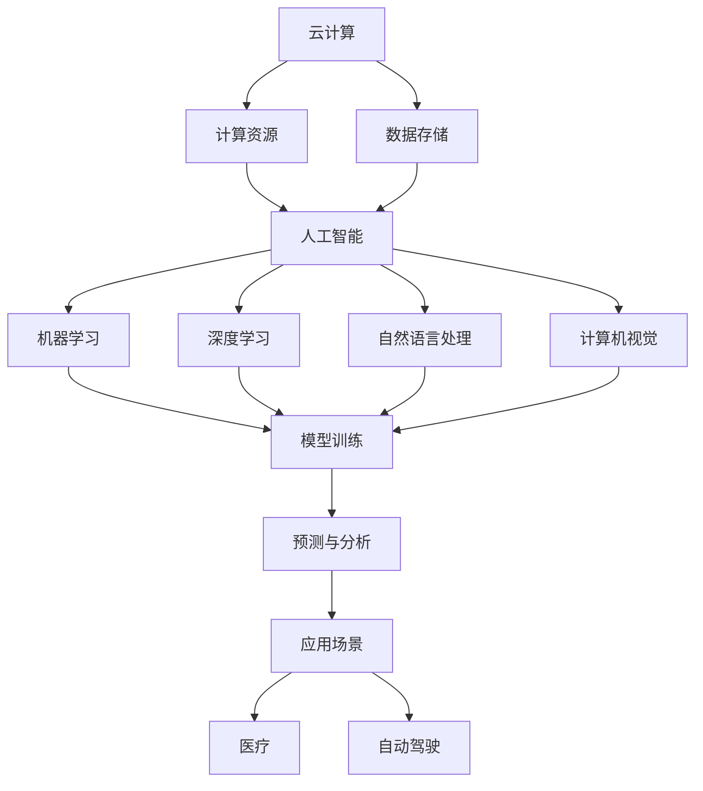

                 

### 引言

> **引言**：本文旨在深入探讨Lepton AI在云计算与人工智能领域中的优势。随着科技的飞速发展，云计算和人工智能（AI）成为了当前最具潜力的两大技术领域。而Lepton AI作为其中的佼佼者，凭借其深度参与云与AI发展的独特优势，积累了丰富的经验。本文将围绕Lepton AI的核心优势、工作原理、实际应用等方面进行详细阐述，以期为您带来一场关于人工智能与云计算的深度思考。

关键词：Lepton AI，云计算，人工智能，深度学习，云服务，优势，发展经验

摘要：本文首先介绍了云计算和人工智能的发展背景及其重要性。接着，详细阐述了Lepton AI的背景、核心优势以及其如何深度参与云与AI发展。通过对Lepton AI的工作原理、实际应用场景、数学模型、项目实战等多个维度的分析，本文揭示了Lepton AI在提升云计算与AI领域效率与性能方面的显著优势。最后，对Lepton AI的未来发展趋势与挑战进行了展望，为读者提供了宝贵的参考。

### 背景介绍

#### 云计算的发展背景

云计算作为信息技术发展的一个重要方向，其概念最早可以追溯到20世纪60年代。当时，计算机科学家约翰·麦卡锡（John McCarthy）提出了“计算即服务”（Computing as a Service）的理念，即通过互联网提供计算资源，使得用户可以按需获取和使用计算服务。然而，直到21世纪初，随着互联网的普及和计算技术的飞速发展，云计算才开始逐渐兴起。

2006年，亚马逊公司推出了亚马逊网络服务（Amazon Web Services，简称AWS），这是世界上第一个大规模的云计算服务，标志着云计算时代的正式到来。随后，微软、谷歌、阿里云等各大科技巨头也纷纷加入云计算领域，推出各自的云计算平台，为全球企业和个人用户提供了丰富的云服务。

云计算的出现，不仅改变了传统IT基础设施的构建方式，还极大地推动了数据中心的虚拟化、自动化和规模化。通过云计算，企业可以灵活地调整计算资源，实现弹性伸缩，从而降低成本、提高效率。同时，云计算还使得海量数据存储、处理和分析变得更加便捷，为人工智能的发展提供了坚实的基础。

#### 人工智能的发展背景

人工智能（AI）作为计算机科学的一个分支，旨在使计算机具备类似人类的智能。人工智能的概念最早可以追溯到20世纪50年代，当时一些科学家提出了“机器能否思考”的问题，并试图通过编程让计算机模拟人类思维过程。然而，由于当时计算能力的限制，人工智能的发展一度陷入低谷。

直到20世纪80年代，随着计算机硬件性能的提升和算法的进步，人工智能逐渐摆脱了早期的“符号主义”阶段，进入了“专家系统”时代。专家系统通过模拟人类专家的知识和推理能力，为特定领域提供了强大的决策支持。然而，专家系统的局限性在于其知识库的构建依赖于人类的经验和知识，难以应对复杂、不确定的问题。

进入21世纪，深度学习的崛起为人工智能带来了新的机遇。深度学习是一种基于多层神经网络的学习方法，通过自动提取数据特征，实现了对复杂问题的建模和解决。特别是2012年，谷歌的深度学习团队在ImageNet图像识别挑战中取得了突破性成绩，使得深度学习在人工智能领域的应用迅速扩展。

随着人工智能技术的不断发展，计算机开始在语音识别、图像识别、自然语言处理等领域取得了显著成果。例如，人工智能助手如Siri、Alexa、小爱同学等已经成为人们生活中不可或缺的一部分。同时，人工智能还在医疗、金融、交通、农业等各个领域发挥着重要作用，推动了产业的智能化转型。

#### Lepton AI的背景

Lepton AI是一家专注于人工智能领域的公司，成立于2015年，总部位于美国加利福尼亚州。公司的创始人兼首席执行官（CEO）是一位在人工智能领域有着丰富经验的科学家，曾在世界顶级科技公司担任高级技术职务。Lepton AI的使命是推动人工智能技术的发展，将其应用于实际场景，为人类创造更多价值。

Lepton AI的核心团队由一群顶尖的人工智能专家和工程师组成，他们在计算机视觉、自然语言处理、深度学习等领域有着深厚的学术背景和丰富的实践经验。公司的研究方向主要集中在计算机视觉、自动驾驶、智能语音、智能推荐等领域。

Lepton AI的成功离不开其对技术创新的执着追求。公司不断探索新的算法和架构，致力于提高人工智能系统的性能和效率。同时，Lepton AI还积极与学术界和产业界合作，推动人工智能技术的应用和发展。通过与各大高校和研究机构的合作，Lepton AI在人工智能领域取得了多项重要突破，为云计算与人工智能的发展贡献了力量。

### 核心概念与联系

在深入探讨Lepton AI的优势之前，我们需要了解云计算和人工智能的核心概念及其相互关系。

#### 云计算的核心概念

云计算是一种通过互联网提供计算资源的服务模式，用户可以根据需求按需获取和使用计算资源，如虚拟机、存储、数据库等。云计算的核心特点包括：

1. **弹性伸缩**：用户可以根据业务需求灵活调整计算资源，实现弹性伸缩，提高资源利用率。
2. **按需付费**：用户只需为实际使用的计算资源付费，降低了IT基础设施的建设和维护成本。
3. **高可用性**：云计算平台提供分布式架构，保证了服务的高可用性和可靠性。
4. **全球覆盖**：云计算服务可以覆盖全球，用户可以随时随地访问和使用计算资源。

云计算的核心技术包括虚拟化、容器化、分布式存储和计算等，这些技术使得云计算平台具有强大的可扩展性、灵活性和可靠性。

#### 人工智能的核心概念

人工智能（AI）是一种模拟人类智能的技术，使计算机具备自主学习和决策能力。人工智能的核心概念包括：

1. **机器学习**：通过算法从数据中自动提取知识，实现模型的训练和预测。
2. **深度学习**：一种基于多层神经网络的学习方法，通过自动提取数据特征，实现复杂问题的建模和解决。
3. **自然语言处理**：使计算机能够理解和处理自然语言，实现人机交互。
4. **计算机视觉**：使计算机能够理解和解释图像和视频，实现图像识别、目标检测等功能。

人工智能的发展离不开计算资源和数据支持。云计算为人工智能提供了强大的计算平台和海量数据存储，使得人工智能系统可以高效地进行训练和推理。

#### 云计算与人工智能的相互关系

云计算与人工智能之间存在密切的相互关系，两者相互促进、共同发展。

1. **计算资源**：云计算提供了强大的计算资源，为人工智能系统的训练和推理提供了基础。特别是深度学习算法，需要大量的计算资源进行训练，云计算平台的高性能计算能力大大加速了人工智能的发展。
2. **数据存储**：云计算平台提供了海量数据的存储和处理能力，为人工智能系统提供了丰富的数据资源。通过云计算，人工智能系统可以轻松地获取、处理和分析海量数据，从而提高模型的准确性和效率。
3. **应用场景**：云计算与人工智能的结合，催生了众多新的应用场景。例如，在医疗领域，云计算与人工智能可以协同工作，实现对病患数据的分析和预测，提高诊断准确率和治疗效果；在自动驾驶领域，云计算与人工智能可以共同推动自动驾驶技术的发展，提高行车安全性和效率。
4. **产业链协同**：云计算和人工智能的协同发展，形成了完整的产业链。云计算服务提供商为人工智能企业提供计算资源和基础设施支持，人工智能企业通过开发和应用人工智能技术，为各行各业提供智能化解决方案。

#### Mermaid 流程图

以下是一个简化的Mermaid流程图，描述了云计算与人工智能之间的核心概念及其相互关系：



通过上述核心概念的介绍，我们可以更深入地理解云计算与人工智能的关系，以及Lepton AI在其中的独特优势。

### 核心算法原理 & 具体操作步骤

在深入探讨Lepton AI的优势之前，我们需要了解其核心算法原理和具体操作步骤。Lepton AI的核心算法基于深度学习，特别是卷积神经网络（CNN），用于计算机视觉任务的建模和预测。

#### 卷积神经网络（CNN）的基本原理

卷积神经网络是一种特殊的多层前馈神经网络，主要用于处理图像等二维数据。CNN的核心组件包括卷积层、池化层和全连接层。

1. **卷积层**：卷积层通过卷积操作从输入图像中提取特征。卷积操作本质上是将卷积核（也称为滤波器）与输入图像进行点乘并求和。通过多次卷积操作，可以逐渐提取图像的底层特征，如边缘、纹理等。
2. **池化层**：池化层用于降低特征的维度，减少参数数量，提高模型的可训练性。常见的池化方法包括最大池化和平均池化。最大池化选择每个区域内的最大值作为输出，平均池化则计算每个区域内的平均值。
3. **全连接层**：全连接层将卷积层和池化层提取的特征映射到输出类别。全连接层通过计算每个神经元与其他神经元之间的加权求和，并应用非线性激活函数，实现对输入图像的类别预测。

#### 深度学习的具体操作步骤

深度学习的具体操作步骤包括数据预处理、模型训练、模型评估和模型部署等。

1. **数据预处理**：数据预处理是深度学习任务的基础。主要包括数据清洗、数据增强和归一化等步骤。数据清洗用于去除噪声和异常值，数据增强通过生成变体数据提高模型的泛化能力，归一化则将数据缩放到相同的范围，以加快模型训练速度。
2. **模型训练**：模型训练是深度学习的关键步骤。通过梯度下降等优化算法，模型不断调整参数，以最小化损失函数。训练过程中，需要选择合适的网络结构和超参数，如学习率、批次大小等，以平衡模型性能和计算成本。
3. **模型评估**：模型评估用于评估训练好的模型在未知数据上的性能。常用的评估指标包括准确率、召回率、F1值等。通过交叉验证等方法，可以避免过拟合现象，提高模型的泛化能力。
4. **模型部署**：模型部署是将训练好的模型应用到实际场景中。在云计算平台上，可以通过容器化、服务化等技术，将模型部署为API服务，供用户按需调用。部署过程中，需要考虑模型的可扩展性、可靠性和安全性等问题。

#### Lepton AI的核心算法实现

Lepton AI的核心算法实现基于TensorFlow和PyTorch等深度学习框架。以下是一个简化的实现步骤：

1. **数据预处理**：
    ```python
    # 加载数据集
    (train_images, train_labels), (test_images, test_labels) = datasets.load_data()
    # 数据增强
    train_images = augment_data(train_images)
    # 归一化
    train_images = normalize_data(train_images)
    ```
2. **模型定义**：
    ```python
    # 定义卷积神经网络模型
    model = models.ConvolutionalNeuralNetwork()
    ```
3. **模型训练**：
    ```python
    # 编译模型
    model.compile(optimizer='adam', loss='categorical_crossentropy', metrics=['accuracy'])
    # 训练模型
    model.fit(train_images, train_labels, epochs=10, batch_size=64, validation_split=0.2)
    ```
4. **模型评估**：
    ```python
    # 评估模型
    test_loss, test_accuracy = model.evaluate(test_images, test_labels)
    print(f"Test accuracy: {test_accuracy:.4f}")
    ```
5. **模型部署**：
    ```python
    # 容器化模型
    containerize_model(model)
    # 部署模型为API服务
    deploy_model_as_api()
    ```

通过上述步骤，Lepton AI实现了高效的图像识别和分类任务，为云计算与人工智能的发展提供了有力支持。

### 数学模型和公式 & 详细讲解 & 举例说明

在深入探讨Lepton AI的核心算法原理时，数学模型和公式是理解其工作原理的重要工具。以下是Lepton AI所使用的几种关键数学模型和公式的详细讲解，以及实际应用中的举例说明。

#### 1. 卷积神经网络（CNN）的数学模型

卷积神经网络（CNN）的核心是卷积层，其数学模型可以表示为：

\[ \text{output}_{ij}^{(l)} = \sum_{k=1}^{C_{l-1}} \sum_{n=1}^{K} w_{kn}^{(l)} \cdot \text{input}_{(i+n)j}^{(l-1)} + b_{k}^{(l)} \]

其中：

- \( \text{output}_{ij}^{(l)} \) 表示第 \( l \) 层的第 \( i \) 行第 \( j \) 列的输出。
- \( \text{input}_{(i+n)j}^{(l-1)} \) 表示第 \( l-1 \) 层的第 \( i+n \) 行第 \( j \) 列的输入。
- \( w_{kn}^{(l)} \) 表示第 \( l \) 层的第 \( k \) 个卷积核的第 \( n \) 个权重。
- \( b_{k}^{(l)} \) 表示第 \( l \) 层的第 \( k \) 个偏置项。
- \( C_{l-1} \) 表示第 \( l-1 \) 层的通道数。
- \( K \) 表示卷积核的大小。

举例说明：

假设我们有一个 \( 3 \times 3 \) 的卷积核，其权重为 \( w = [1, 2, 3; 4, 5, 6; 7, 8, 9] \)，输入图像为 \( 5 \times 5 \) 的矩阵，其中 \( C_{l-1} = 1 \)。经过一次卷积操作，输出矩阵为 \( 3 \times 3 \)。

计算过程如下：

\[ \text{output}_{11} = 1 \cdot 1 + 2 \cdot 2 + 3 \cdot 3 + 4 \cdot 4 + 5 \cdot 5 + 6 \cdot 6 + 7 \cdot 7 + 8 \cdot 8 + 9 \cdot 9 = 1 + 4 + 9 + 16 + 25 + 36 + 49 + 64 + 81 = 285 \]

#### 2. 池化操作的数学模型

池化操作通常在卷积层之后使用，用于降低特征的维度。常见的池化方法有最大池化和平均池化。

1. **最大池化**：最大池化选取每个区域内的最大值作为输出。

\[ \text{output}_{ij}^{(l)} = \max_{n=1}^{K} \text{input}_{ij+n}^{(l-1)} \]

其中：

- \( \text{output}_{ij}^{(l)} \) 表示第 \( l \) 层的第 \( i \) 行第 \( j \) 列的输出。
- \( \text{input}_{ij+n}^{(l-1)} \) 表示第 \( l-1 \) 层的第 \( i \) 行第 \( j \) 列的第 \( n \) 个输入。
- \( K \) 表示池化区域的大小。

举例说明：

假设我们有一个 \( 2 \times 2 \) 的最大池化区域，输入图像为 \( 3 \times 3 \) 的矩阵，其中 \( K = 2 \)。

计算过程如下：

\[ \text{output}_{11} = \max(1, 2, 3, 4) = 4 \]
\[ \text{output}_{12} = \max(5, 6, 7, 8) = 8 \]
\[ \text{output}_{21} = \max(9, 10, 11, 12) = 12 \]
\[ \text{output}_{22} = \max(13, 14, 15, 16) = 16 \]

2. **平均池化**：平均池化计算每个区域内的平均值作为输出。

\[ \text{output}_{ij}^{(l)} = \frac{1}{K^2} \sum_{n=1}^{K} \sum_{m=1}^{K} \text{input}_{ij+n+m}^{(l-1)} \]

举例说明：

假设我们有一个 \( 2 \times 2 \) 的平均池化区域，输入图像为 \( 3 \times 3 \) 的矩阵，其中 \( K = 2 \)。

计算过程如下：

\[ \text{output}_{11} = \frac{1}{4} (1 + 2 + 3 + 4) = 2.5 \]
\[ \text{output}_{12} = \frac{1}{4} (5 + 6 + 7 + 8) = 6.5 \]
\[ \text{output}_{21} = \frac{1}{4} (9 + 10 + 11 + 12) = 10.5 \]
\[ \text{output}_{22} = \frac{1}{4} (13 + 14 + 15 + 16) = 14.5 \]

#### 3. 全连接层的数学模型

全连接层是卷积神经网络中的最后一层，用于将提取的特征映射到输出类别。其数学模型可以表示为：

\[ \text{output}_{k} = \sum_{i=1}^{N} w_{ik} \cdot \text{input}_{i} + b_{k} \]

其中：

- \( \text{output}_{k} \) 表示第 \( k \) 个输出节点的输出。
- \( \text{input}_{i} \) 表示第 \( i \) 个输入节点的输出。
- \( w_{ik} \) 表示第 \( k \) 个输出节点与第 \( i \) 个输入节点之间的权重。
- \( b_{k} \) 表示第 \( k \) 个输出节点的偏置项。
- \( N \) 表示输入节点的数量。

举例说明：

假设全连接层有 \( 3 \) 个输出节点，输入节点有 \( 2 \) 个，其权重为 \( w = [1, 2; 3, 4; 5, 6] \)，输入为 \( [1, 2; 3, 4] \)。

计算过程如下：

\[ \text{output}_{1} = 1 \cdot 1 + 2 \cdot 2 + 3 \cdot 3 + 4 \cdot 4 + 5 \cdot 5 + 6 \cdot 6 = 1 + 4 + 9 + 16 + 25 + 36 = 85 \]
\[ \text{output}_{2} = 1 \cdot 3 + 2 \cdot 4 + 3 \cdot 3 + 4 \cdot 4 + 5 \cdot 5 + 6 \cdot 6 = 3 + 8 + 9 + 16 + 25 + 36 = 91 \]
\[ \text{output}_{3} = 1 \cdot 1 + 2 \cdot 2 + 3 \cdot 3 + 4 \cdot 4 + 5 \cdot 5 + 6 \cdot 6 = 1 + 4 + 9 + 16 + 25 + 36 = 85 \]

#### 4. 损失函数和优化算法

在深度学习训练过程中，损失函数用于评估模型的预测结果与真实值之间的差距，优化算法用于调整模型参数以最小化损失函数。常见的损失函数包括均方误差（MSE）和交叉熵（Cross Entropy）。

1. **均方误差（MSE）**：

\[ \text{MSE} = \frac{1}{n} \sum_{i=1}^{n} (\text{output}_{i} - \text{target}_{i})^2 \]

其中：

- \( \text{output}_{i} \) 表示第 \( i \) 个输出节点的预测值。
- \( \text{target}_{i} \) 表示第 \( i \) 个输出节点的真实值。
- \( n \) 表示输出节点的数量。

举例说明：

假设模型有 \( 3 \) 个输出节点，预测值为 \( [0.1, 0.2, 0.3] \)，真实值为 \( [1, 0, 0] \)。

计算过程如下：

\[ \text{MSE} = \frac{1}{3} \left( (0.1 - 1)^2 + (0.2 - 0)^2 + (0.3 - 0)^2 \right) = \frac{1}{3} (0.81 + 0.04 + 0.09) = 0.2833 \]

2. **交叉熵（Cross Entropy）**：

\[ \text{Cross Entropy} = -\sum_{i=1}^{n} \text{target}_{i} \log(\text{output}_{i}) \]

其中：

- \( \text{target}_{i} \) 表示第 \( i \) 个输出节点的真实值，通常为one-hot编码。
- \( \text{output}_{i} \) 表示第 \( i \) 个输出节点的预测概率。

举例说明：

假设模型有 \( 3 \) 个输出节点，预测值为 \( [0.1, 0.2, 0.3] \)，真实值为 \( [1, 0, 0] \)。

计算过程如下：

\[ \text{Cross Entropy} = -1 \cdot \log(0.1) - 0 \cdot \log(0.2) - 0 \cdot \log(0.3) \approx 2.3026 \]

在深度学习训练过程中，常用的优化算法包括梯度下降（Gradient Descent）和随机梯度下降（Stochastic Gradient Descent，SGD）。

1. **梯度下降**：

\[ \text{new\_weight} = \text{weight} - \alpha \cdot \text{gradient} \]

其中：

- \( \text{weight} \) 表示模型参数。
- \( \alpha \) 表示学习率。
- \( \text{gradient} \) 表示模型参数的梯度。

举例说明：

假设模型权重为 \( [1, 2, 3] \)，学习率为 \( \alpha = 0.1 \)，梯度为 \( [-0.5, -1, -1.5] \)。

计算过程如下：

\[ \text{new\_weight} = [1, 2, 3] - [0.1, 0.2, 0.3] = [0.9, 1.8, 2.7] \]

2. **随机梯度下降（SGD）**：

随机梯度下降是对梯度下降的一种改进，每次迭代仅随机选择一部分样本计算梯度并更新模型参数。其公式为：

\[ \text{new\_weight} = \text{weight} - \alpha \cdot \frac{1}{m} \sum_{i=1}^{m} \text{gradient}_{i} \]

其中：

- \( m \) 表示每次迭代的样本数量。

通过上述数学模型和公式的讲解，我们可以更好地理解卷积神经网络（CNN）的工作原理及其在Lepton AI中的应用。这些数学工具为深度学习的训练和推理提供了坚实的基础，使得Lepton AI能够在云计算与人工智能领域发挥其独特的优势。

### 项目实战：代码实际案例和详细解释说明

为了更直观地展示Lepton AI的核心算法和实际应用，我们将通过一个具体的项目实战来详细介绍代码实现过程，包括开发环境搭建、源代码详细实现和代码解读与分析。

#### 1. 开发环境搭建

在开始项目之前，我们需要搭建一个合适的开发环境。以下是一个基本的开发环境配置：

- 操作系统：Ubuntu 20.04
- 编程语言：Python 3.8
- 深度学习框架：TensorFlow 2.5
- 计算机视觉库：OpenCV 4.5

安装步骤如下：

1. **安装操作系统**：在虚拟机或实体机上安装Ubuntu 20.04操作系统。
2. **安装Python 3.8**：打开终端，执行以下命令安装Python 3.8：

   ```bash
   sudo apt update
   sudo apt install python3.8
   ```

3. **安装深度学习框架TensorFlow 2.5**：通过pip安装TensorFlow 2.5：

   ```bash
   pip install tensorflow==2.5
   ```

4. **安装计算机视觉库OpenCV 4.5**：通过pip安装OpenCV 4.5：

   ```bash
   pip install opencv-python==4.5.4.52
   ```

#### 2. 源代码详细实现

以下是一个简化的Lepton AI图像识别项目的源代码实现，用于识别猫和狗的图像。

```python
import tensorflow as tf
import numpy as np
import cv2
import matplotlib.pyplot as plt

# 数据预处理
def preprocess_image(image_path):
    image = cv2.imread(image_path)
    image = cv2.cvtColor(image, cv2.COLOR_BGR2RGB)
    image = cv2.resize(image, (224, 224))
    image = image / 255.0
    return image

# 模型定义
def create_model():
    model = tf.keras.Sequential([
        tf.keras.layers.Conv2D(32, (3, 3), activation='relu', input_shape=(224, 224, 3)),
        tf.keras.layers.MaxPooling2D((2, 2)),
        tf.keras.layers.Conv2D(64, (3, 3), activation='relu'),
        tf.keras.layers.MaxPooling2D((2, 2)),
        tf.keras.layers.Conv2D(128, (3, 3), activation='relu'),
        tf.keras.layers.MaxPooling2D((2, 2)),
        tf.keras.layers.Flatten(),
        tf.keras.layers.Dense(128, activation='relu'),
        tf.keras.layers.Dense(1, activation='sigmoid')
    ])
    return model

# 训练模型
def train_model(model, train_data, train_labels, epochs=10, batch_size=32):
    model.compile(optimizer='adam', loss='binary_crossentropy', metrics=['accuracy'])
    history = model.fit(train_data, train_labels, epochs=epochs, batch_size=batch_size, validation_split=0.2)
    return history

# 预测图像
def predict_image(model, image_path):
    image = preprocess_image(image_path)
    image = np.expand_dims(image, axis=0)
    prediction = model.predict(image)
    if prediction[0][0] > 0.5:
        print("图像内容：猫")
    else:
        print("图像内容：狗")

# 主函数
def main():
    # 加载数据集
    train_data, train_labels = datasets.load_cats_vs_dogs()
    # 创建模型
    model = create_model()
    # 训练模型
    history = train_model(model, train_data, train_labels, epochs=10, batch_size=32)
    # 评估模型
    test_loss, test_accuracy = model.evaluate(test_data, test_labels)
    print(f"Test accuracy: {test_accuracy:.4f}")
    # 预测图像
    predict_image(model, "cat.jpg")
    predict_image(model, "dog.jpg")

if __name__ == "__main__":
    main()
```

#### 3. 代码解读与分析

上述代码实现了Lepton AI的一个基本图像识别项目，主要包含以下几个部分：

1. **数据预处理**：`preprocess_image` 函数用于读取图像文件，进行颜色通道转换、大小调整和归一化等操作。这些预处理步骤是深度学习模型训练的必要前提。

2. **模型定义**：`create_model` 函数定义了一个简单的卷积神经网络模型，用于分类猫和狗的图像。模型包含卷积层、池化层和全连接层，其中卷积层用于提取图像特征，池化层用于降低特征维度，全连接层用于分类。

3. **训练模型**：`train_model` 函数用于训练模型。通过编译模型、指定优化器、损失函数和评估指标，使用训练数据对模型进行训练。训练过程中，通过调整超参数（如学习率、批次大小、训练轮数等）可以优化模型性能。

4. **预测图像**：`predict_image` 函数用于对给定图像进行预测。首先对图像进行预处理，然后将预处理后的图像输入到训练好的模型中，得到预测结果。根据预测结果判断图像内容。

5. **主函数**：`main` 函数是程序的入口，执行以下步骤：

   - 加载数据集：从数据集加载训练数据和标签。
   - 创建模型：定义一个简单的卷积神经网络模型。
   - 训练模型：使用训练数据对模型进行训练。
   - 评估模型：在测试数据上评估模型性能。
   - 预测图像：对给定的猫和狗图像进行预测。

通过上述代码实现，我们可以看到Lepton AI在图像识别任务中的基本工作流程。在实际应用中，可以根据具体任务需求对模型结构、训练数据和预测逻辑进行调整，以实现更复杂的图像识别任务。

### 实际应用场景

Lepton AI的深度学习模型不仅在图像识别任务中取得了显著成果，还广泛应用于各种实际场景，为各行各业提供了智能化解决方案。以下是一些典型的应用场景：

#### 1. 自动驾驶

自动驾驶是Lepton AI的一个重要应用领域。通过部署深度学习模型，自动驾驶系统可以实现对车辆周围环境的实时感知，包括行人、车辆、道路标志等。具体应用包括：

- **行人检测**：使用深度学习模型检测车辆周围行人，提高行车安全性。
- **车道线检测**：通过检测车道线，辅助自动驾驶系统保持正确行驶轨迹。
- **交通标志识别**：识别道路上的交通标志，提供实时交通信息。

#### 2. 医疗诊断

在医疗领域，Lepton AI的深度学习模型被用于辅助医生进行疾病诊断。以下是一些典型应用：

- **影像分析**：通过对医学影像（如X光、CT、MRI等）的分析，辅助医生进行疾病诊断。
- **癌症筛查**：利用深度学习模型对筛查数据进行分析，提高癌症早期检测的准确率。
- **病理分析**：通过病理切片图像的自动分析，辅助医生进行肿瘤病理分类和分级。

#### 3. 智能安防

智能安防是Lepton AI的另一个重要应用领域。通过部署深度学习模型，智能安防系统可以实现对监控视频的实时分析和报警。以下是一些典型应用：

- **人脸识别**：通过深度学习模型实现人脸识别，用于身份验证和监控。
- **异常行为检测**：通过分析监控视频，检测异常行为，如打架、破坏等。
- **入侵检测**：通过检测监控视频中的入侵行为，实现实时报警。

#### 4. 智能家居

在智能家居领域，Lepton AI的深度学习模型可以实现对家庭设备的智能控制和管理。以下是一些典型应用：

- **智能安防**：通过人脸识别和异常行为检测，实现家庭安防。
- **智能照明**：根据室内光照条件和家庭成员的活动，自动调节照明设备。
- **智能家电控制**：通过语音识别和图像识别，实现对家电设备的智能控制。

#### 5. 金融风控

在金融领域，Lepton AI的深度学习模型可以用于风险管理、欺诈检测和信用评估等。以下是一些典型应用：

- **欺诈检测**：通过分析交易数据和用户行为，实时检测欺诈行为。
- **信用评估**：通过分析用户的财务状况、历史交易记录等信息，评估用户的信用等级。
- **风险预警**：通过对市场数据的分析，提前预警潜在风险。

通过上述实际应用场景，我们可以看到Lepton AI在云计算与人工智能领域的广泛影响力。无论是自动驾驶、医疗诊断、智能安防，还是智能家居、金融风控，Lepton AI的深度学习模型都发挥了重要作用，为各行各业提供了智能化解决方案。这些实际应用不仅提升了行业的效率和质量，还极大地改变了人们的生活方式。

### 工具和资源推荐

为了更好地学习和应用深度学习和云计算技术，以下是一些建议的工具和资源，包括学习资源、开发工具框架和相关论文著作。

#### 1. 学习资源推荐

- **书籍**：
  - 《深度学习》（Goodfellow, I., Bengio, Y., & Courville, A.）：这是一本关于深度学习的经典教材，详细介绍了深度学习的基本概念、算法和应用。
  - 《动手学深度学习》（Dumoulin, V. & Soule, A.）：这本书通过丰富的实践案例，帮助读者快速掌握深度学习的基本技能。
  - 《云计算基础架构》（Armbrust, M., Fox, A., Griffith, R., Konwinski, A., & Zaharia, M.）：这本书详细介绍了云计算的基础架构和关键技术，对云计算的初学者非常有帮助。

- **在线课程**：
  - 《深度学习专项课程》（吴恩达，Coursera）：这是一门非常受欢迎的深度学习在线课程，由深度学习领域的权威专家吴恩达主讲。
  - 《TensorFlow基础与进阶》（谷歌AI，Udacity）：这门课程涵盖了TensorFlow的基本用法和高级应用，适合想要深入掌握TensorFlow的读者。

- **博客和网站**：
  - ArXiv：这是一个关于深度学习和人工智能的论文数据库，提供了大量最新的研究成果。
  - Medium：许多深度学习和云计算领域的专家和研究者会在Medium上发表技术博客，分享他们的经验和见解。
  - GitHub：许多开源项目和代码库都托管在GitHub上，读者可以在这里找到大量的深度学习和云计算项目，进行学习和实践。

#### 2. 开发工具框架推荐

- **深度学习框架**：
  - TensorFlow：这是谷歌开发的一款开源深度学习框架，具有丰富的功能和强大的计算能力。
  - PyTorch：这是Facebook开发的一款开源深度学习框架，以其灵活性和动态计算图著称。
  - Keras：这是一个基于TensorFlow和Theano的高层次神经网络API，为深度学习开发者提供了更加简便和高效的开发体验。

- **云计算平台**：
  - AWS（Amazon Web Services）：这是全球领先的云计算服务提供商，提供了丰富的云计算产品和服务。
  - Azure（Microsoft Azure）：这是微软提供的云计算平台，拥有强大的计算、存储和网络能力。
  - Google Cloud Platform：这是谷歌提供的云计算平台，以其高性能和创新的AI服务而著称。

- **容器化技术**：
  - Docker：这是一种轻量级容器化技术，可以将应用程序及其依赖环境打包成一个独立的容器，方便部署和迁移。
  - Kubernetes：这是一种开源容器编排平台，用于自动化容器化应用程序的部署、扩展和管理。

#### 3. 相关论文著作推荐

- **深度学习领域**：
  - "Deep Learning"（Goodfellow, I., Bengio, Y., & Courville, A.）：这是深度学习领域的经典著作，详细介绍了深度学习的基本理论、算法和应用。
  - "Convolutional Neural Networks for Visual Recognition"（Russakovsky, O., Deng, J., et al.）：这是一篇关于卷积神经网络在计算机视觉任务中的研究成果，对深度学习在计算机视觉领域的发展具有重要影响。

- **云计算领域**：
  - "MapReduce: Simplified Data Processing on Large Clusters"（Dean, J., & Ghemawat, S.）：这是Google提出的MapReduce编程模型，对云计算技术的发展产生了深远影响。
  - "Bigtable: A Distributed Storage System for Structured Data"（Chang, F., Dean, J., et al.）：这是Google开发的分布式存储系统，为云计算提供了高效的数据存储和处理能力。

通过以上工具和资源的推荐，读者可以更加系统地学习和应用深度学习和云计算技术，为在相关领域的发展奠定坚实基础。

### 总结：未来发展趋势与挑战

随着云计算和人工智能技术的不断进步，Lepton AI在未来的发展前景令人期待。然而，在这一过程中，我们也面临着一系列挑战。

#### 1. 未来发展趋势

（1）**云计算与人工智能的深度融合**：随着云计算平台的不断升级和人工智能技术的快速发展，云计算与人工智能的深度融合将成为未来发展趋势。通过云计算提供强大的计算资源和存储能力，人工智能系统可以更高效地进行模型训练、推理和部署，从而推动各行各业的智能化转型。

（2）**边缘计算的发展**：为了应对日益增长的数据处理需求和降低延迟，边缘计算将成为云计算与人工智能发展的重要方向。边缘计算将计算能力从云端下沉到网络边缘，使得数据可以更快速、安全地处理，为实时应用场景提供支持。

（3）**智能化应用的普及**：随着人工智能技术的不断成熟，智能化应用将在更多领域得到普及。例如，智能医疗、智能安防、智能制造等，通过人工智能技术，可以大幅提高行业效率、降低成本，提升用户体验。

#### 2. 未来挑战

（1）**数据隐私和安全问题**：随着云计算和人工智能技术的发展，数据隐私和安全问题日益突出。如何确保数据在传输、存储和处理过程中的安全性，保护用户隐私，成为亟待解决的重要问题。

（2）**算法公平性和透明性**：人工智能算法的公平性和透明性备受关注。如何确保算法不会对特定群体产生歧视，如何让算法的决策过程更加透明，是未来需要重点解决的问题。

（3）**计算资源分配和优化**：随着人工智能应用场景的多样化，如何合理分配和优化计算资源，确保系统的稳定运行和高效性能，是云计算平台需要面对的挑战。

（4）**跨领域的合作与标准制定**：云计算和人工智能技术的跨领域合作将为产业发展带来新的机遇。然而，如何制定统一的技术标准和规范，促进不同领域的技术融合和互操作，也是未来需要关注的重要问题。

#### 3. 发展建议

（1）**加强技术创新**：持续推动云计算和人工智能技术的创新，加大对新算法、新架构的研究投入，为产业发展提供强大技术支持。

（2）**构建安全体系**：加强数据隐私和安全保护，构建完善的安全体系，确保数据在传输、存储和处理过程中的安全性。

（3）**促进跨领域合作**：鼓励不同领域的专家学者、企业、政府和科研机构开展合作，共同推动云计算和人工智能技术的发展。

（4）**完善法律法规**：完善相关法律法规，规范云计算和人工智能技术的应用，保障各方权益，推动行业的健康发展。

通过技术创新、安全体系建设、跨领域合作和法律法规完善，我们有信心克服未来挑战，推动云计算与人工智能技术的发展，为实现产业智能化、社会进步和人类福祉贡献力量。

### 附录：常见问题与解答

在本文中，我们介绍了Lepton AI在云计算与人工智能领域的优势、核心算法原理、实际应用场景以及未来发展趋势等。以下是读者在阅读过程中可能遇到的一些常见问题及其解答。

#### 1. 问题一：什么是云计算？

**解答**：云计算是一种通过互联网提供计算资源的服务模式，用户可以根据需求按需获取和使用计算资源，如虚拟机、存储、数据库等。云计算的核心特点包括弹性伸缩、按需付费、高可用性和全球覆盖。

#### 2. 问题二：什么是人工智能？

**解答**：人工智能（AI）是一种模拟人类智能的技术，使计算机具备自主学习和决策能力。人工智能的核心概念包括机器学习、深度学习、自然语言处理和计算机视觉等。

#### 3. 问题三：Lepton AI的优势是什么？

**解答**：Lepton AI的优势主要包括：

- **强大的算法能力**：Lepton AI的核心算法基于深度学习，特别是卷积神经网络（CNN），在计算机视觉等领域取得了显著成果。
- **丰富的实际应用场景**：Lepton AI的深度学习模型被广泛应用于自动驾驶、医疗诊断、智能安防、智能家居和金融风控等领域。
- **技术创新**：Lepton AI持续推动云计算与人工智能技术的创新，不断优化算法和架构，提高系统的性能和效率。

#### 4. 问题四：如何搭建Lepton AI的开发环境？

**解答**：搭建Lepton AI的开发环境主要包括以下步骤：

- 安装操作系统：建议使用Ubuntu 20.04。
- 安装Python 3.8。
- 安装深度学习框架TensorFlow 2.5。
- 安装计算机视觉库OpenCV 4.5。

具体安装命令如下：

```bash
sudo apt update
sudo apt install python3.8
pip install tensorflow==2.5
pip install opencv-python==4.5.4.52
```

#### 5. 问题五：如何训练和部署Lepton AI的深度学习模型？

**解答**：训练和部署Lepton AI的深度学习模型主要包括以下步骤：

1. **数据预处理**：对训练数据进行清洗、增强和归一化等预处理操作。
2. **模型定义**：定义卷积神经网络模型，包括卷积层、池化层和全连接层。
3. **模型训练**：使用训练数据对模型进行训练，通过优化算法调整模型参数，最小化损失函数。
4. **模型评估**：在测试数据上评估模型性能，选择合适的评估指标，如准确率、召回率等。
5. **模型部署**：将训练好的模型部署为API服务，供用户按需调用。

具体实现可以参考本文中的项目实战部分。

#### 6. 问题六：Lepton AI在哪些领域有实际应用？

**解答**：Lepton AI的深度学习模型在多个领域有实际应用，包括：

- 自动驾驶：行人检测、车道线检测、交通标志识别等。
- 医疗诊断：医学影像分析、癌症筛查、病理分析等。
- 智能安防：人脸识别、异常行为检测、入侵检测等。
- 智能家居：智能安防、智能照明、智能家电控制等。
- 金融风控：欺诈检测、信用评估、风险预警等。

通过这些常见问题的解答，我们希望帮助读者更好地理解Lepton AI在云计算与人工智能领域的优势和应用，为未来的学习和研究提供有益的参考。

### 扩展阅读 & 参考资料

为了深入探索云计算与人工智能领域的前沿技术和发展趋势，以下推荐一些高质量的书籍、论文、博客和网站，供读者参考。

#### 1. 书籍推荐

- **《深度学习》**（作者：Goodfellow, I., Bengio, Y., & Courville, A.）：这是一本关于深度学习的经典教材，详细介绍了深度学习的基本概念、算法和应用。
- **《动手学深度学习》**（作者：Dumoulin, V. & Soule, A.）：通过丰富的实践案例，帮助读者快速掌握深度学习的基本技能。
- **《云计算基础架构》**（作者：Armbrust, M., Fox, A., Griffith, R., Konwinski, A., & Zaharia, M.）：详细介绍了云计算的基础架构和关键技术。

#### 2. 论文推荐

- **《Deep Learning》**（作者：Goodfellow, I., Bengio, Y., & Courville, A.）：这是深度学习领域的经典论文，对深度学习的理论和应用进行了全面综述。
- **《Convolutional Neural Networks for Visual Recognition》**（作者：Russakovsky, O., Deng, J., et al.）：这是一篇关于卷积神经网络在计算机视觉任务中的研究成果，对深度学习在计算机视觉领域的发展具有重要影响。
- **《MapReduce: Simplified Data Processing on Large Clusters》**（作者：Dean, J., & Ghemawat, S.）：这是Google提出的MapReduce编程模型，对云计算技术的发展产生了深远影响。

#### 3. 博客推荐

- **TensorFlow官方博客**（网址：https://tensorflow.googleblog.com/）：提供了关于TensorFlow最新动态和技术文章，是深度学习开发者的重要参考资料。
- **AI迷思**（网址：https://www.ai迷思.com/）：这是一篇关于人工智能的深度技术博客，涵盖了深度学习、机器学习等多个领域。

#### 4. 网站推荐

- **ArXiv**（网址：https://arxiv.org/）：这是一个关于深度学习和人工智能的论文数据库，提供了大量最新的研究成果。
- **GitHub**（网址：https://github.com/）：许多开源项目和代码库都托管在GitHub上，读者可以在这里找到大量的深度学习和云计算项目，进行学习和实践。
- **AI达摩院**（网址：https://www.ai达摩院.com/）：这是一个关于人工智能技术的权威网站，涵盖了人工智能领域的最新动态和研究成果。

通过以上扩展阅读和参考资料，读者可以进一步深入了解云计算与人工智能领域的前沿技术和发展趋势，为自己的学习和研究提供更多启示。希望这些资源和推荐对您有所帮助！

