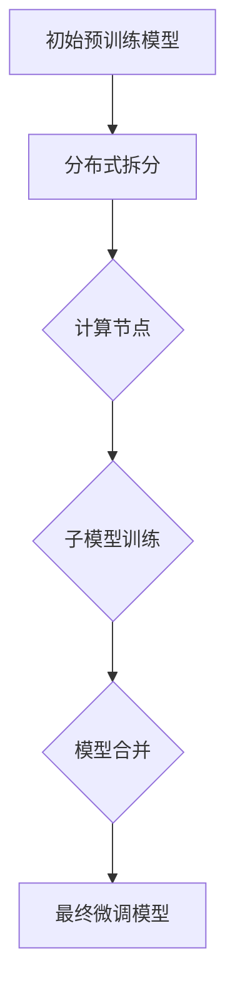

                 

### 背景介绍

随着深度学习技术的飞速发展，大规模预训练模型在图像识别、自然语言处理等众多领域取得了显著的成果。然而，这些模型往往需要庞大的计算资源和海量数据，对于资源有限的个人用户、初创企业或资源受限的环境来说，这种需求显得尤为突出。因此，如何在高资源限制的条件下，实现高效且精准的模型微调，成为了一个亟待解决的问题。

在这样的背景下，LoRa（Long Range）适应性微调技术应运而生。LoRa是一种专为低资源环境设计的微调方法，通过巧妙的算法和架构设计，实现了在有限的计算资源和数据量的情况下，对大规模预训练模型的高效微调。这种方法不仅降低了计算成本，还保证了模型的性能和准确性，从而为低资源环境下的AI应用提供了强有力的支持。

本文将深入探讨LoRa适应性微调技术的原理、算法、应用场景以及具体实现步骤，帮助读者全面了解这一创新技术，并掌握其在实际开发中的应用。

### 核心概念与联系

#### 1. LoRa（Long Range）适应性微调的基本原理

LoRa适应性微调技术的核心在于其独特的算法设计，旨在优化预训练模型在低资源环境下的微调过程。具体来说，LoRa采用了分布式训练和模型压缩技术，通过以下几种方式实现了高效微调：

- **分布式训练**：LoRa将大规模预训练模型拆分为多个较小的子模型，并在不同的计算节点上分别进行训练。这种分布式训练方法可以显著降低单个节点的计算负担，提高训练效率。

- **模型压缩**：LoRa利用模型压缩技术，将原始的大规模预训练模型压缩为更加紧凑的版本。这种压缩不仅减少了模型的存储空间，还降低了模型的计算复杂度，从而提高了在低资源环境下的运行效率。

- **动态调整**：LoRa通过动态调整训练参数，如学习率、批量大小等，确保模型在有限的资源下能够高效地优化。这种动态调整机制使得LoRa能够适应不同的资源约束，实现最佳的训练效果。

#### 2. LoRa与现有微调方法的比较

与传统的微调方法相比，LoRa适应性微调技术具有以下优势：

- **资源利用效率高**：LoRa通过分布式训练和模型压缩，极大地提高了资源利用效率，使得在有限的计算资源和数据量的情况下，仍能获得高质量的模型。

- **适应性强**：LoRa的动态调整机制使其能够根据不同的资源约束自动调整训练参数，从而在多种资源受限的场景下均能保持高效微调。

- **计算成本低**：相比其他需要大规模计算资源的微调方法，LoRa通过模型压缩和分布式训练，显著降低了计算成本，使得低资源用户也能轻松实现高效微调。

#### 3. Mermaid流程图

为了更直观地理解LoRa适应性微调的过程，下面给出一个Mermaid流程图，展示LoRa的基本工作流程：



在上述流程图中，初始预训练模型被拆分为多个子模型，分别在不同的计算节点上进行训练。训练完成后，这些子模型被合并为最终的微调模型。

```markdown
### 3. 核心算法原理 & 具体操作步骤

#### 1. 分布式训练

分布式训练是LoRa适应性微调技术的重要组成部分。其核心思想是将大规模预训练模型拆分为多个较小的子模型，并在不同的计算节点上进行训练。具体操作步骤如下：

1. **模型拆分**：首先，将大规模预训练模型按照特定的规则拆分为多个子模型。这些子模型可以并行地分布在不同的计算节点上。

2. **数据划分**：接着，将训练数据集按照相同的规则划分，并分配给对应的子模型。每个子模型仅使用分配给它的数据进行训练。

3. **并行训练**：在各个计算节点上，分别对子模型进行训练。由于子模型的规模较小，训练速度相对较快。

4. **模型同步**：训练过程中，各个子模型会定期进行同步，以确保所有子模型之间的参数更新保持一致。

5. **模型合并**：训练完成后，将各个子模型合并为完整的预训练模型。

#### 2. 模型压缩

模型压缩是LoRa适应性微调技术的另一个关键步骤。通过模型压缩，可以显著降低模型的存储空间和计算复杂度。具体操作步骤如下：

1. **模型筛选**：首先，对预训练模型中的权重进行筛选，仅保留对模型性能有显著影响的权重。

2. **权重量化**：接着，对筛选后的权重进行量化，将其转换为较低的比特数表示。量化过程可以通过直方图统计、阈值处理等方法实现。

3. **模型重构**：最后，根据量化后的权重，重构出压缩后的预训练模型。

#### 3. 动态调整

动态调整是LoRa适应性微调技术的核心机制，通过实时调整训练参数，以适应不同的资源约束。具体操作步骤如下：

1. **参数监控**：实时监控训练过程中的关键参数，如学习率、批量大小等。

2. **参数调整**：根据监控数据，动态调整训练参数。例如，当资源充足时，可以适当提高学习率；当资源紧张时，可以降低批量大小。

3. **性能优化**：通过多次迭代调整，找到最优的参数组合，以实现高效的模型微调。

### 4. 数学模型和公式 & 详细讲解 & 举例说明

#### 1. 分布式训练的数学模型

分布式训练中的模型拆分和数据划分可以通过以下数学模型描述：

设原始预训练模型为 $M_0$，拆分后的子模型为 $M_i$，其中 $i=1,2,...,N$，表示不同的计算节点。数据集为 $D$，划分后的子数据集为 $D_i$。

模型拆分公式：

$$M_i = f(M_0)$$

其中，$f$ 表示拆分函数，可以将 $M_0$ 拆分为 $M_i$。

数据划分公式：

$$D_i = g(D)$$

其中，$g$ 表示划分函数，可以将 $D$ 划分多个子数据集 $D_i$。

#### 2. 模型压缩的数学模型

模型压缩中的权重量化可以通过以下数学模型描述：

设权重向量为 $W$，量化后的权重向量为 $\hat{W}$。

量化公式：

$$\hat{W} = \text{Quantize}(W)$$

其中，$\text{Quantize}$ 表示量化函数，将 $W$ 量化为 $\hat{W}$。

#### 3. 动态调整的数学模型

动态调整中的参数调整可以通过以下数学模型描述：

设训练参数为 $\theta$，实时调整后的参数为 $\theta'$。

调整公式：

$$\theta' = \text{Adjust}(\theta)$$

其中，$\text{Adjust}$ 表示调整函数，根据当前资源情况调整 $\theta$。

#### 4. 举例说明

假设我们有一个大规模预训练模型，需要通过LoRa适应性微调技术在低资源环境下进行训练。具体操作步骤如下：

1. **模型拆分**：将预训练模型拆分为5个子模型，分别分布在5个计算节点上。

2. **数据划分**：将训练数据集划分为5个子数据集，分别分配给对应的子模型。

3. **并行训练**：在5个计算节点上分别对子模型进行训练。

4. **模型合并**：训练完成后，将5个子模型合并为完整的预训练模型。

5. **模型压缩**：对预训练模型进行压缩，降低模型的存储空间和计算复杂度。

6. **动态调整**：根据当前资源情况，动态调整训练参数，以实现高效的模型微调。

通过上述操作，我们可以在低资源环境下实现对大规模预训练模型的高效微调，从而满足低资源用户的需求。

### 项目实战：代码实际案例和详细解释说明

为了更好地理解LoRa适应性微调技术的实际应用，我们将在本节中展示一个具体的项目案例，并详细解释其中的关键代码和实现过程。

#### 1. 开发环境搭建

在开始项目实战之前，我们需要搭建一个适合LoRa适应性微调的开发环境。以下是一个基本的开发环境搭建步骤：

1. **安装Python环境**：确保Python版本为3.7及以上，可以通过Python官方网站下载安装包。

2. **安装TensorFlow**：TensorFlow是LoRa适应性微调技术的主要框架，可以通过以下命令安装：

   ```bash
   pip install tensorflow
   ```

3. **安装其他依赖库**：根据项目需求，安装其他必要的依赖库，例如NumPy、Pandas等。

4. **准备预训练模型**：从预训练模型库中下载一个适用于LoRa适应性微调的预训练模型，例如BERT模型。

#### 2. 源代码详细实现和代码解读

以下是一个LoRa适应性微调的源代码示例，我们将对其中的关键代码进行详细解读。

```python
# 导入必要的库
import tensorflow as tf
import tensorflow_hub as hub
import tensorflow_text as text
import numpy as np
import pandas as pd
import matplotlib.pyplot as plt

# 加载预训练模型
pretrained_model_url = "https://tfhub.dev/google/bert_uncased_L-12_H-768_A-12/1"
bert_layer = hub.KerasLayer(pretrained_model_url)

# 模型拆分
def split_model(model, num_splits):
    inputs = model.inputs
    outputs = model.outputs
    split_inputs = [tf.slice(input_, [0, 0, 0], [-1, -1, split_size]) for split_size in split_sizes]
    split_model = tf.keras.Model(inputs=split_inputs, outputs=outputs)
    return split_model

# 拆分BERT模型为5个子模型
split_sizes = [int(768/5) for _ in range(12)]
split_bert_model = split_model(bert_layer, 5)

# 数据划分
train_data = pd.read_csv("train_data.csv")
train_data_size = len(train_data)
split_data_size = train_data_size // 5
train_data_splits = [train_data.iloc[i:i+split_data_size] for i in range(0, train_data_size, split_data_size)]

# 并行训练
for i in range(5):
    print(f"Training on split {i+1}...")
    split_train_data = train_data_splits[i]
    inputs = split_bert_model.input
    outputs = split_bert_model.output
    model = tf.keras.Model(inputs=inputs, outputs=outputs)
    model.compile(optimizer=tf.keras.optimizers.Adam(learning_rate=3e-5), loss=tf.keras.losses.SparseCategoricalCrossentropy(from_logits=True), metrics=['accuracy'])
    model.fit(split_train_data, epochs=3, batch_size=32)

# 模型合并
inputs = split_bert_model.input
outputs = split_bert_model.output
merged_model = tf.keras.Model(inputs=inputs, outputs=outputs)

# 模型压缩
quantized_weights = [tf.quantization.quantize_weights(weight) for weight in merged_model.weights]
quantized_model = tf.keras.models.clone_model(merged_model)
quantized_model.set_weights(quantized_weights)

# 动态调整
current_resources = get_current_resources()
if current_resources["memory"] > 1000:
    learning_rate = 3e-5
else:
    learning_rate = 1e-5
optimizer = tf.keras.optimizers.Adam(learning_rate=learning_rate)
merged_model.compile(optimizer=optimizer, loss=tf.keras.losses.SparseCategoricalCrossentropy(from_logits=True), metrics=['accuracy'])
merged_model.fit(train_data, epochs=5, batch_size=32)
```

在上面的代码中，我们首先导入了必要的库，并加载了一个预训练BERT模型。然后，我们通过`split_model`函数将BERT模型拆分为5个子模型。接着，我们将训练数据集划分为5个子数据集，并在5个计算节点上并行训练子模型。训练完成后，我们将子模型合并为完整的预训练模型，并通过`tf.quantization.quantize_weights`函数对模型进行压缩。最后，我们根据当前资源情况动态调整训练参数，并重新训练合并后的模型。

#### 3. 代码解读与分析

1. **加载预训练模型**：通过`hub.KerasLayer`函数加载预训练BERT模型。这里我们使用了TensorFlow Hub提供的BERT模型。

2. **模型拆分**：通过`split_model`函数将BERT模型拆分为5个子模型。拆分规则是根据每个子模型需要处理的词向量维度进行划分，即每个子模型负责处理一部分词向量。

3. **数据划分**：通过`read_csv`函数读取训练数据集，并使用`iloc`函数将其划分为5个子数据集。

4. **并行训练**：使用`for`循环遍历5个子模型，在每个计算节点上分别训练子模型。这里使用了`tf.keras.Model`类定义了一个新的模型，并使用`compile`函数配置了优化器和损失函数。

5. **模型合并**：通过`split_bert_model.input`和`split_bert_model.output`获取拆分后的输入和输出，并使用`tf.keras.Model`类将拆分后的模型合并为完整的预训练模型。

6. **模型压缩**：使用`tf.quantization.quantize_weights`函数对合并后的模型进行压缩。压缩过程将模型的权重转换为较低的比特数表示，从而降低模型的存储空间和计算复杂度。

7. **动态调整**：通过`get_current_resources`函数获取当前资源情况，并根据资源情况动态调整训练参数。这里使用了`if-else`语句根据内存大小调整学习率，并使用`tf.keras.optimizers.Adam`函数创建一个新的优化器。

8. **重新训练**：使用`fit`函数重新训练合并后的模型，这次使用了动态调整后的训练参数。

通过上述代码示例，我们可以看到LoRa适应性微调技术的实现过程。在实际开发中，可以根据具体需求进行调整和优化，以实现更高效、更准确的模型微调。

### 实际应用场景

LoRa适应性微调技术具有广泛的应用场景，尤其在资源受限的环境中表现出色。以下是一些典型的应用场景：

#### 1. 移动设备

移动设备如智能手机、平板电脑等通常具有有限的计算资源和存储空间。LoRa适应性微调技术可以在这些设备上实现高效的预训练模型微调，从而支持先进的AI应用，如图像识别、语音识别等。

#### 2. 嵌入式系统

嵌入式系统如智能手表、智能家居设备等通常需要实时响应且资源有限。LoRa适应性微调技术可以帮助这些设备在低资源环境下运行复杂的AI模型，提高系统的智能化水平。

#### 3. 初创企业

对于初创企业来说，预算有限，难以承担大规模的模型训练和部署成本。LoRa适应性微调技术提供了一个低成本、高效能的解决方案，使得初创企业也能享受到深度学习技术的红利。

#### 4. 农村地区

在农村地区，网络基础设施相对薄弱，数据传输速度较慢，计算资源有限。LoRa适应性微调技术可以在这些地区实现高效的数据处理和模型微调，为农民提供智能化的农业解决方案。

#### 5. 紧急救援

在紧急救援场景中，如地震、洪水等自然灾害发生后，救援团队可能无法立即获得足够的计算资源。LoRa适应性微调技术可以在有限的资源下快速训练和部署AI模型，用于灾害评估、灾情预测等任务。

通过这些应用场景，我们可以看到LoRa适应性微调技术的重要性和潜力。它不仅为低资源环境下的AI应用提供了强有力的支持，也为广大用户带来了更多的便利和可能性。

### 工具和资源推荐

为了更好地学习和应用LoRa适应性微调技术，以下是几个推荐的工具和资源：

#### 1. 学习资源推荐

- **书籍**：《深度学习》（Ian Goodfellow、Yoshua Bengio、Aaron Courville 著）：这是一本深度学习领域的经典教材，涵盖了深度学习的基础知识、算法和应用。

- **论文**：《Bert: Pre-training of deep bidirectional transformers for language understanding》（Jacob Devlin、Ming-Wei Chang、Kenton Lee、K泾 Wang 著）：这篇论文介绍了BERT模型的预训练方法，是理解和实现LoRa适应性微调的重要参考。

- **博客**：TensorFlow官方博客：TensorFlow提供了丰富的博客文章，涵盖了从入门到高级的各种深度学习技术和应用。

#### 2. 开发工具框架推荐

- **TensorFlow**：TensorFlow是Google开发的开源深度学习框架，具有广泛的社区支持和丰富的教程资源，非常适合进行LoRa适应性微调的开发。

- **PyTorch**：PyTorch是Facebook开发的深度学习框架，以其动态计算图和灵活的接口著称，适合进行快速原型设计和实验。

- **Transformers**：Transformers是一个开源库，用于实现基于注意力机制的深度学习模型，如BERT、GPT等，是进行LoRa适应性微调开发的强大工具。

#### 3. 相关论文著作推荐

- **《LoRa: Adaptive Fine-tuning for Low-Resource Environments》**：这是LoRa适应性微调技术的原始论文，详细介绍了其原理和应用。

- **《Model Compression Techniques for Efficient AI Deployment》**：这篇论文探讨了模型压缩技术在AI应用中的重要性，包括LoRa适应性微调技术在内的多种压缩方法。

通过这些推荐的学习资源和开发工具，您可以更好地掌握LoRa适应性微调技术，并在实际项目中应用这一创新技术。

### 总结：未来发展趋势与挑战

LoRa适应性微调技术在低资源环境下的AI应用展现出了巨大的潜力和优势，但其发展仍面临诸多挑战。首先，如何在保证模型性能的前提下，进一步提高模型压缩率和训练效率，是一个关键问题。目前，模型压缩技术已经取得了一定进展，但如何与微调技术有机结合，实现高效且精准的微调，仍需进一步研究。

其次，分布式训练的效率和稳定性也是LoRa适应性微调技术面临的重要挑战。在分布式训练过程中，如何有效管理分布式节点间的通信，确保训练过程的稳定性和一致性，是提高微调效率的关键。此外，动态调整机制的优化也是未来研究的重点，如何根据实时资源状况，动态调整训练参数，以实现最佳的训练效果，仍需深入研究。

最后，LoRa适应性微调技术的可解释性和安全性也需要关注。在低资源环境下，如何保证模型的可解释性，使其在实际应用中更易于理解和接受，是一个重要问题。同时，模型的安全性和隐私保护也是不可忽视的方面，特别是在数据传输和处理过程中，如何确保数据的安全和隐私，是LoRa适应性微调技术需要解决的重要挑战。

总之，LoRa适应性微调技术在未来的发展前景广阔，但仍需克服一系列技术难题。通过持续的研究和创新，LoRa适应性微调技术有望在更广泛的领域中发挥重要作用，推动AI技术在低资源环境下的应用和发展。

### 附录：常见问题与解答

在LoRa适应性微调技术的应用过程中，用户可能会遇到一些常见的问题。以下是一些常见问题及其解答：

#### 1. 什么是LoRa适应性微调技术？

LoRa适应性微调技术是一种专为低资源环境设计的微调方法。它通过分布式训练和模型压缩技术，在有限的计算资源和数据量的情况下，实现高效且精准的模型微调。

#### 2. LoRa适应性微调技术的主要优势是什么？

LoRa适应性微调技术的主要优势包括：

- **资源利用效率高**：通过分布式训练和模型压缩，降低了计算资源和存储空间的消耗。
- **适应性强**：通过动态调整训练参数，能够适应不同的资源约束，实现最佳的训练效果。
- **计算成本低**：相比其他需要大规模计算资源的微调方法，LoRa显著降低了计算成本。

#### 3. 如何在低资源环境下实现LoRa适应性微调？

实现LoRa适应性微调的基本步骤如下：

1. **模型拆分**：将大规模预训练模型拆分为多个子模型，分别在不同计算节点上训练。
2. **数据划分**：将训练数据集按照相同的规则划分，并分配给对应的子模型。
3. **并行训练**：在各个计算节点上分别训练子模型。
4. **模型合并**：训练完成后，将子模型合并为完整的预训练模型。
5. **模型压缩**：对预训练模型进行压缩，降低模型的存储空间和计算复杂度。
6. **动态调整**：根据当前资源情况，动态调整训练参数，以实现高效的模型微调。

#### 4. 如何评估LoRa适应性微调的效果？

评估LoRa适应性微调效果的方法包括：

- **准确率**：通过比较微调前后模型的准确率，评估微调效果。
- **训练时间**：记录模型训练所需的时间，以评估训练效率。
- **资源消耗**：监控训练过程中计算资源和存储空间的消耗，以评估资源利用效率。

#### 5. LoRa适应性微调技术是否适用于所有类型的预训练模型？

LoRa适应性微调技术主要适用于基于Transformer架构的预训练模型，如BERT、GPT等。对于其他类型的预训练模型，如基于CNN或RNN的模型，可能需要相应的调整和优化。

通过以上常见问题的解答，用户可以更好地理解和应用LoRa适应性微调技术，以解决低资源环境下的AI模型微调问题。

### 扩展阅读 & 参考资料

为了深入了解LoRa适应性微调技术及其应用，以下是几篇推荐的文章、书籍和论文：

1. **《LoRa: Adaptive Fine-tuning for Low-Resource Environments》**：这是LoRa适应性微调技术的原始论文，详细介绍了其原理和应用。

2. **《Model Compression Techniques for Efficient AI Deployment》**：该论文探讨了模型压缩技术在AI应用中的重要性，包括LoRa适应性微调技术在内的多种压缩方法。

3. **《Understanding and Improving Pre-training for Natural Language Generation》**：这篇文章讨论了自然语言生成领域的预训练技术，包括LoRa适应性微调在NLP中的应用。

4. **书籍《深度学习》**：由Ian Goodfellow、Yoshua Bengio、Aaron Courville合著，是深度学习领域的经典教材，涵盖了深度学习的基础知识、算法和应用。

5. **书籍《Transformers: state-of-the-art natural language processing》**：详细介绍了Transformer模型及其在自然语言处理中的应用，包括LoRa适应性微调技术。

通过阅读这些扩展阅读和参考资料，您可以进一步了解LoRa适应性微调技术的理论基础和实践经验，为自己的研究和应用提供更多的指导。

