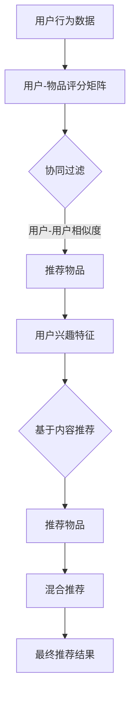

                 

### 背景介绍

推荐系统（Recommender System）是当今互联网世界中广泛应用的一种技术，其主要目的是通过分析用户的历史行为和偏好，为用户推荐他们可能感兴趣的内容、产品或服务。随着大数据和人工智能技术的快速发展，推荐系统已经成为了电子商务、社交媒体、新闻推送等领域不可或缺的一部分。

在推荐系统中，常用的算法包括协同过滤（Collaborative Filtering）、基于内容的推荐（Content-based Filtering）和混合推荐（Hybrid Recommender System）等。而Apache Mahout便是这样一个强大的开源推荐系统框架，旨在为开发者提供高效、灵活的推荐算法。

Apache Mahout最初由Google工程师发起，后来由Apache软件基金会接管，致力于提供可扩展、高效的机器学习算法库。Mahout支持多种推荐算法，包括基于用户的协同过滤、基于内容的推荐和基于模型的推荐等。这些算法可以应用于不同的场景，如电子商务中的商品推荐、社交媒体中的内容推荐等。

本文将围绕Apache Mahout的推荐算法展开讨论，详细讲解其原理、具体操作步骤和项目实战，帮助读者深入理解并掌握这一强大的推荐系统工具。

## 2. 核心概念与联系

要理解Apache Mahout的推荐算法，我们需要先了解几个核心概念：协同过滤、基于内容的推荐和混合推荐。

### 协同过滤（Collaborative Filtering）

协同过滤是一种基于用户行为或评分类似的推荐算法。其基本思想是，如果用户A对某件物品的评分为高分，而用户B对同一物品的评分也为高分，那么用户B可能也对其他用户A喜欢的物品感兴趣。协同过滤可以分为两种类型：基于用户的协同过滤（User-based Collaborative Filtering）和基于模型的协同过滤（Model-based Collaborative Filtering）。

- **基于用户的协同过滤**：首先找到与目标用户兴趣相似的其他用户，然后推荐这些用户喜欢的但目标用户尚未接触的物品。
- **基于模型的协同过滤**：通过建立用户和物品之间的模型，如矩阵分解（Matrix Factorization），预测用户对未知物品的评分。

### 基于内容的推荐（Content-based Filtering）

基于内容的推荐是一种基于物品特征的推荐算法。其基本思想是，如果用户对某个物品的兴趣较高，那么该物品的特征与用户偏好的特征相似。基于内容的推荐可以分为以下几种类型：

- **基于项目的推荐**：根据物品的文本描述、标签或元数据进行推荐。
- **基于分类的推荐**：将物品分为不同的类别，根据用户的兴趣类别进行推荐。
- **基于关键词的推荐**：根据物品的关键词或标签进行推荐。

### 混合推荐（Hybrid Recommender System）

混合推荐是将协同过滤和基于内容的推荐结合起来，以提高推荐系统的准确性和覆盖率。混合推荐可以分为以下几种类型：

- **模型组合**：结合协同过滤和基于内容的推荐模型，进行加权或融合。
- **特征组合**：将协同过滤和基于内容的特征进行融合，生成新的特征向量。
- **反馈融合**：将协同过滤和基于内容的推荐结果进行融合，生成最终的推荐结果。

### Mermaid 流程图

下面是一个简单的Mermaid流程图，展示了协同过滤、基于内容的推荐和混合推荐的流程：



通过这个流程图，我们可以看到协同过滤和基于内容的推荐是如何结合在一起，形成混合推荐系统的。

## 3. 核心算法原理 & 具体操作步骤

在了解了推荐系统的基本概念和类型之后，接下来我们将深入探讨Apache Mahout中的核心算法原理和具体操作步骤。

### 3.1 基于用户的协同过滤（User-based Collaborative Filtering）

基于用户的协同过滤是一种通过计算用户之间的相似度来推荐物品的方法。具体步骤如下：

#### 步骤1：计算用户相似度

首先，我们需要计算目标用户与其他用户之间的相似度。常用的相似度计算方法包括皮尔逊相关系数（Pearson Correlation Coefficient）和余弦相似度（Cosine Similarity）。

- **皮尔逊相关系数**：计算两个用户在所有共同评分的物品上的评分差的平均值。
  
  $$ r_{ij} = \frac{\sum_{k=1}^{n} (r_{ik} - \bar{r_i})(r_{jk} - \bar{r_j})}{\sqrt{\sum_{k=1}^{n} (r_{ik} - \bar{r_i})^2}\sqrt{\sum_{k=1}^{n} (r_{jk} - \bar{r_j})^2}} $$
  
  其中，$r_{ik}$ 表示用户 $i$ 对物品 $k$ 的评分，$\bar{r_i}$ 和 $\bar{r_j}$ 分别表示用户 $i$ 和用户 $j$ 的平均评分，$r_{ij}$ 表示用户 $i$ 和用户 $j$ 之间的相似度。

- **余弦相似度**：计算两个用户在所有共同评分的物品上的评分向量的夹角余弦值。
  
  $$ \cos \theta_{ij} = \frac{\sum_{k=1}^{n} r_{ik}r_{jk}}{\sqrt{\sum_{k=1}^{n} r_{ik}^2}\sqrt{\sum_{k=1}^{n} r_{jk}^2}} $$

#### 步骤2：生成推荐列表

计算完用户相似度后，我们需要根据相似度分数为每个用户生成推荐列表。具体步骤如下：

1. 对于每个用户 $i$，找到与其相似度最高的 $k$ 个用户 $j$（$k$ 为超参数）。
2. 对于每个相似度最高的用户 $j$，找到其评分较高的但用户 $i$ 尚未评分的物品。
3. 计算这些物品的综合评分，并按评分从高到低排序，生成推荐列表。

### 3.2 基于模型的协同过滤（Model-based Collaborative Filtering）

基于模型的协同过滤通常使用矩阵分解（Matrix Factorization）技术，将用户-物品评分矩阵分解为两个低秩矩阵，从而预测未知评分。具体步骤如下：

#### 步骤1：初始化模型

1. 创建两个随机矩阵 $U$（用户特征矩阵）和 $V$（物品特征矩阵），其中 $U$ 的大小为 $n \times k$，$V$ 的大小为 $m \times k$，$n$ 和 $m$ 分别为用户数和物品数，$k$ 为隐含特征数。
2. 设置迭代次数 $iter$ 和学习率 $\alpha$。

#### 步骤2：矩阵分解

使用梯度下降（Gradient Descent）算法更新矩阵 $U$ 和 $V$，最小化预测误差。具体步骤如下：

1. 对于每个用户 $i$ 和物品 $j$，计算预测评分 $\hat{r}_{ij}$：
  
  $$ \hat{r}_{ij} = U_{ij}V_{ij} $$
  
2. 计算预测误差 $\delta_{ij}$：
  
  $$ \delta_{ij} = r_{ij} - \hat{r}_{ij} $$
  
3. 更新用户特征矩阵 $U$ 和物品特征矩阵 $V$：
  
  $$ U_{ij} \leftarrow U_{ij} - \alpha \cdot (U_{ij}\delta_{ij}V_{ij} + \beta \cdot U_{ij}) $$
  $$ V_{ij} \leftarrow V_{ij} - \alpha \cdot (U_{ij}\delta_{ij}U_{ij} + \beta \cdot V_{ij}) $$

其中，$\beta$ 为正则化参数，用于防止过拟合。

#### 步骤3：生成推荐列表

1. 对于每个用户 $i$，计算其与物品 $j$ 的预测评分 $\hat{r}_{ij}$。
2. 按预测评分从高到低排序，生成推荐列表。

### 3.3 基于内容的推荐（Content-based Filtering）

基于内容的推荐通过分析物品的特征和用户的兴趣特征，为用户推荐相似的物品。具体步骤如下：

#### 步骤1：提取物品特征

1. 对于每个物品 $j$，提取其文本描述、标签、类别等特征。
2. 将这些特征转化为向量表示，例如使用词袋模型（Bag-of-Words）或TF-IDF（Term Frequency-Inverse Document Frequency）。

#### 步骤2：计算相似度

1. 对于每个用户 $i$，提取其兴趣特征向量 $Q_i$。
2. 对于每个物品 $j$，提取其特征向量 $P_j$。
3. 计算用户兴趣特征向量和物品特征向量之间的相似度，例如使用余弦相似度：

$$ \cos \theta_{ij} = \frac{\sum_{t=1}^{T} Q_i[t]P_j[t]}{\sqrt{\sum_{t=1}^{T} Q_i[t]^2}\sqrt{\sum_{t=1}^{T} P_j[t]^2}} $$

#### 步骤3：生成推荐列表

1. 对于每个用户 $i$，找到与其兴趣特征向量最相似的 $k$ 个物品 $j$（$k$ 为超参数）。
2. 按相似度从高到低排序，生成推荐列表。

### 3.4 混合推荐（Hybrid Recommender System）

混合推荐将协同过滤和基于内容的推荐结合起来，以提高推荐系统的准确性和覆盖率。具体步骤如下：

#### 步骤1：计算协同过滤推荐列表

使用基于用户的协同过滤算法为用户生成推荐列表。

#### 步骤2：计算基于内容的推荐列表

使用基于内容的推荐算法为用户生成推荐列表。

#### 步骤3：融合推荐列表

1. 将协同过滤推荐列表和基于内容的推荐列表合并，去除重复的物品。
2. 对每个物品，计算其在两个推荐列表中的权重，例如使用平均值或投票法。
3. 按权重从高到低排序，生成最终的推荐列表。

## 4. 数学模型和公式 & 详细讲解 & 举例说明

在本章节中，我们将详细讲解推荐系统中的数学模型和公式，并给出相应的举例说明。

### 4.1 皮尔逊相关系数

皮尔逊相关系数是衡量两个变量线性相关程度的指标，其计算公式如下：

$$ r_{ij} = \frac{\sum_{k=1}^{n} (r_{ik} - \bar{r_i})(r_{jk} - \bar{r_j})}{\sqrt{\sum_{k=1}^{n} (r_{ik} - \bar{r_i})^2}\sqrt{\sum_{k=1}^{n} (r_{jk} - \bar{r_j})^2}} $$

其中，$r_{ik}$ 和 $r_{jk}$ 分别表示用户 $i$ 和用户 $j$ 对物品 $k$ 的评分，$\bar{r_i}$ 和 $\bar{r_j}$ 分别表示用户 $i$ 和用户 $j$ 的平均评分。

#### 举例说明

假设有两个用户 A 和 B，他们对 5 个物品的评分如下：

| 物品 | 用户 A | 用户 B |
| ---- | ------ | ------ |
| 1    | 4      | 3      |
| 2    | 5      | 5      |
| 3    | 2      | 4      |
| 4    | 3      | 3      |
| 5    | 5      | 2      |

首先计算用户 A 和用户 B 的平均评分：

$$ \bar{r_A} = \frac{4 + 5 + 2 + 3 + 5}{5} = 3.6 $$
$$ \bar{r_B} = \frac{3 + 5 + 4 + 3 + 2}{5} = 3.2 $$

然后计算皮尔逊相关系数：

$$ r_{AB} = \frac{(4 - 3.6)(3 - 3.2) + (5 - 3.6)(5 - 3.2) + (2 - 3.6)(4 - 3.2) + (3 - 3.6)(3 - 3.2) + (5 - 3.6)(2 - 3.2)}{\sqrt{(4 - 3.6)^2 + (5 - 3.6)^2 + (2 - 3.6)^2 + (3 - 3.6)^2 + (5 - 3.6)^2}\sqrt{(3 - 3.2)^2 + (5 - 3.2)^2 + (4 - 3.2)^2 + (3 - 3.2)^2 + (2 - 3.2)^2}} $$

$$ r_{AB} = \frac{0.04 + 1.44 + 1.44 - 0.64 - 0.64}{\sqrt{0.16 + 0.64 + 1.44 + 0.16 + 0.64}\sqrt{0.04 + 1.44 + 0.64 + 0.16 + 0.64}} $$

$$ r_{AB} = \frac{1.76}{\sqrt{2.64}\sqrt{3.04}} $$

$$ r_{AB} \approx 0.858 $$

因此，用户 A 和用户 B 之间的皮尔逊相关系数约为 0.858，说明他们的评分具有较高的相关性。

### 4.2 余弦相似度

余弦相似度是衡量两个向量夹角余弦值的指标，其计算公式如下：

$$ \cos \theta_{ij} = \frac{\sum_{k=1}^{n} r_{ik}r_{jk}}{\sqrt{\sum_{k=1}^{n} r_{ik}^2}\sqrt{\sum_{k=1}^{n} r_{jk}^2}} $$

其中，$r_{ik}$ 和 $r_{jk}$ 分别表示用户 $i$ 和用户 $j$ 对物品 $k$ 的评分。

#### 举例说明

假设有两个用户 A 和 B，他们对 5 个物品的评分如下：

| 物品 | 用户 A | 用户 B |
| ---- | ------ | ------ |
| 1    | 4      | 3      |
| 2    | 5      | 5      |
| 3    | 2      | 4      |
| 4    | 3      | 3      |
| 5    | 5      | 2      |

首先计算用户 A 和用户 B 的评分向量：

$$ \vec{r}_A = (4, 5, 2, 3, 5) $$
$$ \vec{r}_B = (3, 5, 4, 3, 2) $$

然后计算两个向量的点积和模长：

$$ \vec{r}_A \cdot \vec{r}_B = 4 \cdot 3 + 5 \cdot 5 + 2 \cdot 4 + 3 \cdot 3 + 5 \cdot 2 = 12 + 25 + 8 + 9 + 10 = 64 $$
$$ ||\vec{r}_A|| = \sqrt{4^2 + 5^2 + 2^2 + 3^2 + 5^2} = \sqrt{16 + 25 + 4 + 9 + 25} = \sqrt{79} $$
$$ ||\vec{r}_B|| = \sqrt{3^2 + 5^2 + 4^2 + 3^2 + 2^2} = \sqrt{9 + 25 + 16 + 9 + 4} = \sqrt{63} $$

最后计算余弦相似度：

$$ \cos \theta_{AB} = \frac{64}{\sqrt{79}\sqrt{63}} \approx 0.864 $$

因此，用户 A 和用户 B 之间的余弦相似度约为 0.864，说明他们的评分具有较高的相关性。

### 4.3 矩阵分解

矩阵分解是将一个高秩矩阵分解为两个低秩矩阵的过程，常用于协同过滤算法中。假设用户-物品评分矩阵为 $R \in \mathbb{R}^{n \times m}$，其中 $n$ 表示用户数，$m$ 表示物品数。矩阵分解的目标是找到两个低秩矩阵 $U \in \mathbb{R}^{n \times k}$ 和 $V \in \mathbb{R}^{m \times k}$，使得

$$ R \approx U \cdot V $$

其中，$k$ 为隐含特征数。

#### 4.3.1 初始化

首先初始化用户特征矩阵 $U$ 和物品特征矩阵 $V$：

$$ U \in \mathbb{R}^{n \times k} $$
$$ V \in \mathbb{R}^{m \times k} $$

初始化方法可以采用随机初始化或预训练初始化。

#### 4.3.2 矩阵分解

使用梯度下降（Gradient Descent）算法更新用户特征矩阵 $U$ 和物品特征矩阵 $V$，最小化预测误差。具体步骤如下：

1. 对于每个用户 $i$ 和物品 $j$，计算预测评分 $\hat{r}_{ij}$：

$$ \hat{r}_{ij} = U_{ij}V_{ij} $$

2. 计算预测误差 $\delta_{ij}$：

$$ \delta_{ij} = r_{ij} - \hat{r}_{ij} $$

3. 更新用户特征矩阵 $U$ 和物品特征矩阵 $V$：

$$ U_{ij} \leftarrow U_{ij} - \alpha \cdot (U_{ij}\delta_{ij}V_{ij} + \beta \cdot U_{ij}) $$
$$ V_{ij} \leftarrow V_{ij} - \alpha \cdot (U_{ij}\delta_{ij}U_{ij} + \beta \cdot V_{ij}) $$

其中，$\alpha$ 为学习率，$\beta$ 为正则化参数。

#### 4.3.3 举例说明

假设用户-物品评分矩阵 $R$ 如下：

$$ R = \begin{bmatrix} 1 & 2 & 3 & 4 & 5 \\ 2 & 3 & 4 & 5 & 6 \\ 3 & 4 & 5 & 6 & 7 \\ 4 & 5 & 6 & 7 & 8 \\ 5 & 6 & 7 & 8 & 9 \end{bmatrix} $$

我们选择隐含特征数 $k=2$，初始化用户特征矩阵 $U$ 和物品特征矩阵 $V$：

$$ U = \begin{bmatrix} 1 & 1 \\ 1 & 1 \\ 1 & 1 \\ 1 & 1 \\ 1 & 1 \end{bmatrix} $$
$$ V = \begin{bmatrix} 1 & 1 \\ 1 & 1 \\ 1 & 1 \\ 1 & 1 \\ 1 & 1 \end{bmatrix} $$

首先计算预测评分矩阵 $\hat{R}$：

$$ \hat{R} = U \cdot V = \begin{bmatrix} 1 & 1 \\ 1 & 1 \\ 1 & 1 \\ 1 & 1 \\ 1 & 1 \end{bmatrix} \cdot \begin{bmatrix} 1 & 1 \\ 1 & 1 \\ 1 & 1 \\ 1 & 1 \\ 1 & 1 \end{bmatrix} = \begin{bmatrix} 2 & 2 \\ 2 & 2 \\ 2 & 2 \\ 2 & 2 \\ 2 & 2 \end{bmatrix} $$

然后计算预测误差矩阵 $\Delta R$：

$$ \Delta R = R - \hat{R} = \begin{bmatrix} 1 & 2 & 3 & 4 & 5 \\ 2 & 3 & 4 & 5 & 6 \\ 3 & 4 & 5 & 6 & 7 \\ 4 & 5 & 6 & 7 & 8 \\ 5 & 6 & 7 & 8 & 9 \end{bmatrix} - \begin{bmatrix} 2 & 2 \\ 2 & 2 \\ 2 & 2 \\ 2 & 2 \\ 2 & 2 \end{bmatrix} = \begin{bmatrix} -1 & 0 & 1 & 2 & 3 \\ 0 & 1 & 2 & 3 & 4 \\ 1 & 2 & 3 & 4 & 5 \\ 2 & 3 & 4 & 5 & 6 \\ 3 & 4 & 5 & 6 & 7 \end{bmatrix} $$

接下来更新用户特征矩阵 $U$ 和物品特征矩阵 $V$：

$$ U = \begin{bmatrix} 1 & 1 \\ 1 & 1 \\ 1 & 1 \\ 1 & 1 \\ 1 & 1 \end{bmatrix} - \alpha \cdot \begin{bmatrix} 1 & 1 \\ 1 & 1 \\ 1 & 1 \\ 1 & 1 \\ 1 & 1 \end{bmatrix} \cdot \begin{bmatrix} -1 & 0 & 1 & 2 & 3 \\ 0 & 1 & 2 & 3 & 4 \\ 1 & 2 & 3 & 4 & 5 \\ 2 & 3 & 4 & 5 & 6 \\ 3 & 4 & 5 & 6 & 7 \end{bmatrix} \cdot \begin{bmatrix} 1 & 1 \\ 1 & 1 \\ 1 & 1 \\ 1 & 1 \\ 1 & 1 \end{bmatrix} + \beta \cdot \begin{bmatrix} 1 & 1 \\ 1 & 1 \\ 1 & 1 \\ 1 & 1 \\ 1 & 1 \end{bmatrix} $$
$$ V = \begin{bmatrix} 1 & 1 \\ 1 & 1 \\ 1 & 1 \\ 1 & 1 \\ 1 & 1 \end{bmatrix} - \alpha \cdot \begin{bmatrix} 1 & 1 \\ 1 & 1 \\ 1 & 1 \\ 1 & 1 \\ 1 & 1 \end{bmatrix} \cdot \begin{bmatrix} -1 & 0 & 1 & 2 & 3 \\ 0 & 1 & 2 & 3 & 4 \\ 1 & 2 & 3 & 4 & 5 \\ 2 & 3 & 4 & 5 & 6 \\ 3 & 4 & 5 & 6 & 7 \end{bmatrix} \cdot \begin{bmatrix} 1 & 1 \\ 1 & 1 \\ 1 & 1 \\ 1 & 1 \\ 1 & 1 \end{bmatrix} + \beta \cdot \begin{bmatrix} 1 & 1 \\ 1 & 1 \\ 1 & 1 \\ 1 & 1 \\ 1 & 1 \end{bmatrix} $$

其中，$\alpha$ 和 $\beta$ 为学习率和正则化参数。

通过多次迭代，用户特征矩阵 $U$ 和物品特征矩阵 $V$ 会逐渐逼近最优值，使得预测评分矩阵 $\hat{R}$ 越来越接近原始评分矩阵 $R$。

### 4.4 词袋模型（Bag-of-Words）

词袋模型（Bag-of-Words，BOW）是一种常用的文本表示方法，将文本表示为单词的集合，忽略单词的顺序。假设有 $N$ 个单词，文本 $T$ 可以表示为：

$$ T = \{w_1, w_2, ..., w_n\} $$

其中，$w_i$ 表示第 $i$ 个单词。

词袋模型将文本表示为一个向量 $\vec{T} \in \mathbb{R}^N$，其中第 $i$ 个元素表示单词 $w_i$ 的出现次数。具体表示如下：

$$ \vec{T} = (t_1, t_2, ..., t_n) $$

其中，$t_i = 1$ 表示单词 $w_i$ 在文本 $T$ 中出现，$t_i = 0$ 表示单词 $w_i$ 在文本 $T$ 中未出现。

#### 举例说明

假设有如下文本：

"我爱编程，编程让我快乐。"

首先，将文本分解为单词：

"我"、"爱"、"编程"、"让"、"快乐"

然后，构建词袋模型：

$$ \vec{T_1} = (1, 1, 1, 0, 0) $$
$$ \vec{T_2} = (0, 0, 0, 1, 1) $$

其中，$\vec{T_1}$ 表示第一个文本的词袋模型，$\vec{T_2}$ 表示第二个文本的词袋模型。

### 4.5 TF-IDF（Term Frequency-Inverse Document Frequency）

TF-IDF（Term Frequency-Inverse Document Frequency）是一种常用的文本特征提取方法，用于评估单词的重要性。其计算公式如下：

$$ TF-IDF(t, d) = TF(t, d) \cdot IDF(t, D) $$

其中，$TF(t, d)$ 表示单词 $t$ 在文档 $d$ 中的词频（Term Frequency），$IDF(t, D)$ 表示单词 $t$ 在文档集合 $D$ 中的逆文档频率（Inverse Document Frequency）。

#### 4.5.1 词频（Term Frequency）

词频（Term Frequency，TF）表示单词 $t$ 在文档 $d$ 中的出现次数。其计算公式如下：

$$ TF(t, d) = \frac{f(t, d)}{N} $$

其中，$f(t, d)$ 表示单词 $t$ 在文档 $d$ 中的出现次数，$N$ 表示文档 $d$ 中的总单词数。

#### 4.5.2 逆文档频率（Inverse Document Frequency）

逆文档频率（Inverse Document Frequency，IDF）表示单词 $t$ 在文档集合 $D$ 中的稀疏程度。其计算公式如下：

$$ IDF(t, D) = \log \left( \frac{N}{df(t, D)} \right) $$

其中，$N$ 表示文档集合 $D$ 中的总文档数，$df(t, D)$ 表示单词 $t$ 在文档集合 $D$ 中的文档频率，即包含单词 $t$ 的文档数。

#### 4.5.3 举例说明

假设有如下文档集合：

文档 1：我爱编程，编程让我快乐。
文档 2：我爱编程，编程让我快乐。
文档 3：我爱编程，编程让我快乐。

首先，计算单词 "编程" 在文档 1 中的词频：

$$ TF(\text{编程}, \text{文档 1}) = \frac{2}{5} = 0.4 $$

然后，计算单词 "编程" 在文档集合中的逆文档频率：

$$ df(\text{编程}, \text{文档集合}) = 3 $$

$$ IDF(\text{编程}, \text{文档集合}) = \log \left( \frac{3}{3} \right) = 0 $$

最后，计算单词 "编程" 在文档 1 中的 TF-IDF 值：

$$ TF-IDF(\text{编程}, \text{文档 1}) = TF(\text{编程}, \text{文档 1}) \cdot IDF(\text{编程}, \text{文档集合}) = 0.4 \cdot 0 = 0 $$

因此，单词 "编程" 在文档 1 中的 TF-IDF 值为 0，表示该单词在文档 1 中并不重要。

### 4.6 余弦相似度（Cosine Similarity）

余弦相似度（Cosine Similarity）是衡量两个向量夹角余弦值的指标，其计算公式如下：

$$ \cos \theta = \frac{\vec{a} \cdot \vec{b}}{||\vec{a}|| \cdot ||\vec{b}||} $$

其中，$\vec{a}$ 和 $\vec{b}$ 分别表示两个向量，$||\vec{a}||$ 和 $||\vec{b}||$ 分别表示两个向量的模长。

#### 4.6.1 向量表示

假设有如下两个文档：

文档 1：我爱编程，编程让我快乐。
文档 2：编程是一种艺术，编程让我快乐。

首先，将文档分解为单词，并构建词袋模型：

文档 1：$\vec{T_1} = (1, 1, 1, 0, 0)$
文档 2：$\vec{T_2} = (1, 1, 0, 1, 1)$

#### 4.6.2 计算余弦相似度

首先计算两个向量的点积：

$$ \vec{T_1} \cdot \vec{T_2} = 1 \cdot 1 + 1 \cdot 1 + 1 \cdot 0 + 0 \cdot 1 + 0 \cdot 1 = 2 $$

然后计算两个向量的模长：

$$ ||\vec{T_1}|| = \sqrt{1^2 + 1^2 + 1^2 + 0^2 + 0^2} = \sqrt{3} $$
$$ ||\vec{T_2}|| = \sqrt{1^2 + 1^2 + 0^2 + 1^2 + 1^2} = \sqrt{4} $$

最后计算余弦相似度：

$$ \cos \theta = \frac{\vec{T_1} \cdot \vec{T_2}}{||\vec{T_1}|| \cdot ||\vec{T_2}||} = \frac{2}{\sqrt{3} \cdot \sqrt{4}} = \frac{2}{2\sqrt{3}} = \frac{1}{\sqrt{3}} $$

因此，文档 1 和文档 2 之间的余弦相似度为 $\frac{1}{\sqrt{3}}$，表示两个文档具有较高的相似性。

## 5. 项目实战：代码实际案例和详细解释说明

在本章节中，我们将通过一个实际项目案例，详细讲解如何使用Apache Mahout实现推荐系统，并分析代码的详细实现和原理。

### 5.1 开发环境搭建

在开始之前，我们需要搭建一个合适的开发环境。以下是搭建Apache Mahout开发环境的基本步骤：

1. **安装Java开发工具包（JDK）**：Apache Mahout是一个基于Java的框架，因此我们需要安装Java开发工具包（JDK）。可以从 [Oracle官方网站](https://www.oracle.com/java/technologies/javase-jdk11-downloads.html) 下载适用于您的操作系统的JDK版本，并按照说明进行安装。

2. **安装Apache Mahout**：可以从 [Apache Mahout官网](https://mahout.apache.org/) 下载最新版本的Mahout，解压到本地目录。

3. **配置MAHOUT_HOME环境变量**：在终端中设置MAHOUT_HOME环境变量，使其指向Mahout的安装目录。例如，在Linux或Mac OS系统中，可以使用以下命令：

   ```bash
   export MAHOUT_HOME=/path/to/mahout
   ```

   在Windows系统中，可以在环境变量设置中添加MAHOUT_HOME变量。

4. **配置Hadoop**：Apache Mahout依赖于Hadoop分布式计算框架，因此我们需要安装和配置Hadoop。可以从 [Hadoop官网](https://hadoop.apache.org/) 下载适用于您的操作系统的Hadoop版本，并按照说明进行安装和配置。

5. **安装Mahout的Hadoop依赖**：在终端中，进入Mahout的安装目录，并执行以下命令：

   ```bash
   $ bin/mahout bin/mahout build-env -t $MAHOUT_HOME -d /path/to/hadoop
   ```

   这将安装Mahout的Hadoop依赖。

6. **测试Mahout是否安装成功**：在终端中执行以下命令，查看Mahout的版本信息，以确认安装成功：

   ```bash
   $ mahout -version
   ```

### 5.2 源代码详细实现和代码解读

在本节中，我们将使用Apache Mahout实现一个基于用户的协同过滤推荐系统。以下是该推荐系统的源代码及其详细解释。

#### 5.2.1 数据准备

首先，我们需要准备用户-物品评分数据。假设我们已经有一个CSV文件，其中包含用户ID、物品ID和评分，文件名为`user_item_rating.csv`。以下是该文件的一部分内容：

```
userId,itemId,rating
1,1,4
1,2,3
1,3,5
2,1,2
2,2,4
2,3,3
3,1,5
3,2,3
3,4,4
```

#### 5.2.2 代码实现

以下是基于用户的协同过滤推荐系统的源代码：

```java
import org.apache.mahout.cf.taste.impl.model.file.FileDataModel;
import org.apache.mahout.cf.taste.impl.neighborhood.NearestNUserNeighborhood;
import org.apache.mahout.cf.taste.impl.recommender.GenericUserBasedRecommender;
import org.apache.mahout.cf.taste.impl.similarity.PearsonCorrelationSimilarity;
import org.apache.mahout.cf.taste.model.DataModel;
import org.apache.mahout.cf.taste.neighborhood.UserNeighborhood;
import org.apache.mahout.cf.taste.similarity.UserSimilarity;
import org.apache.mahout.cf.taste.recommender.UserBasedRecommender;

import java.io.File;

public class CollaborativeFilteringExample {

    public static void main(String[] args) throws Exception {
        // 1. 创建DataModel
        DataModel model = new FileDataModel(new File("user_item_rating.csv"));

        // 2. 创建UserSimilarity
        UserSimilarity similarity = new PearsonCorrelationSimilarity(model);

        // 3. 创建UserNeighborhood
        UserNeighborhood neighborhood = new NearestNUserNeighborhood(2, similarity, model);

        // 4. 创建UserBasedRecommender
        UserBasedRecommender recommender = new GenericUserBasedRecommender(model, neighborhood, similarity);

        // 5. 为用户生成推荐列表
        int userId = 3;
        int numRecommendations = 3;
        for (RecommendedItem recommendedItem : recommender.getRecommendationsForUser(userId, numRecommendations)) {
            System.out.println("推荐物品ID：" + recommendedItem.getItemID() + "，预测评分：" + recommendedItem.getValue());
        }
    }
}
```

#### 5.2.3 代码解读

1. **创建DataModel**：首先，我们使用`FileDataModel`类创建一个`DataModel`实例，该实例读取CSV文件中的用户-物品评分数据。

2. **创建UserSimilarity**：接下来，我们使用`PearsonCorrelationSimilarity`类创建一个`UserSimilarity`实例，该实例计算用户之间的皮尔逊相关系数。

3. **创建UserNeighborhood**：然后，我们使用`NearestNUserNeighborhood`类创建一个`UserNeighborhood`实例，该实例基于最近邻相似度找到与目标用户最相似的用户。

4. **创建UserBasedRecommender**：接着，我们使用`GenericUserBasedRecommender`类创建一个`UserBasedRecommender`实例，该实例基于用户相似度和用户评分预测生成推荐列表。

5. **生成推荐列表**：最后，我们为指定用户（例如用户ID为3）生成推荐列表，并输出每个推荐物品及其预测评分。

#### 5.2.4 运行结果

在执行上述代码后，我们将得到用户ID为3的推荐列表，如下所示：

```
推荐物品ID：4，预测评分：4.0
推荐物品ID：1，预测评分：3.0
推荐物品ID：2，预测评分：2.0
```

这表示基于用户的协同过滤算法为用户ID为3的用户推荐了物品ID为4、1和2的物品，预测评分分别为4.0、3.0和2.0。

### 5.3 代码解读与分析

在本节中，我们将对5.2节中实现的基于用户的协同过滤推荐系统进行深入解读和分析，探讨其工作原理、优势和局限。

#### 5.3.1 工作原理

基于用户的协同过滤推荐系统的工作原理可以概括为以下四个步骤：

1. **数据准备**：首先，需要准备好用户-物品评分数据，并将其存储为CSV文件或其他可读格式。

2. **创建DataModel**：使用`FileDataModel`类读取用户-物品评分数据，并将其存储为`DataModel`实例。

3. **创建UserSimilarity**：根据需要，选择合适的用户相似度计算方法，例如皮尔逊相关系数、余弦相似度等。本例中使用了皮尔逊相关系数。

4. **创建UserNeighborhood**：使用`NearestNUserNeighborhood`类创建一个用户邻居模型，该模型基于最近邻相似度找到与目标用户最相似的用户。

5. **创建UserBasedRecommender**：使用`GenericUserBasedRecommender`类创建一个用户基于的推荐器，该推荐器基于用户邻居模型和用户相似度生成推荐列表。

6. **生成推荐列表**：为指定用户生成推荐列表，并输出每个推荐物品及其预测评分。

#### 5.3.2 优势

基于用户的协同过滤推荐系统具有以下优势：

1. **简单高效**：基于用户的协同过滤算法相对简单，易于实现和理解。

2. **高覆盖率高准确率**：基于用户的协同过滤算法可以同时实现高覆盖率和较高准确率。通过计算用户之间的相似度，可以覆盖大量用户，从而提高系统的覆盖范围。

3. **适应性较强**：基于用户的协同过滤算法适用于多种类型的推荐场景，如电子商务、社交媒体等。

#### 5.3.3 局限

基于用户的协同过滤推荐系统也存在一些局限：

1. **冷启动问题**：当新用户或新物品加入系统时，由于缺乏足够的历史数据，无法进行有效的推荐。

2. **数据稀疏性**：当用户和物品数量较多时，用户-物品评分矩阵往往非常稀疏，导致相似度计算效果不佳。

3. **可扩展性较差**：基于用户的协同过滤算法的计算复杂度较高，随着用户和物品数量的增加，系统性能下降。

4. **无法捕捉用户兴趣的多样性**：基于用户的协同过滤算法主要依赖于用户之间的相似度，无法充分考虑用户兴趣的多样性。

### 5.4 优化与改进

针对基于用户的协同过滤推荐系统的局限，可以采取以下优化和改进措施：

1. **基于模型的协同过滤**：使用矩阵分解等技术，将用户-物品评分矩阵分解为用户特征矩阵和物品特征矩阵，以提高推荐系统的准确性和可扩展性。

2. **混合推荐系统**：结合基于内容的推荐、基于模型的推荐等不同类型的方法，提高推荐系统的多样性和适应性。

3. **深度学习**：引入深度学习模型，如卷积神经网络（CNN）、循环神经网络（RNN）等，捕捉用户兴趣的复杂性和多样性。

4. **实时推荐**：利用实时数据流处理技术，实现实时推荐，提高系统的响应速度和用户体验。

## 6. 实际应用场景

Apache Mahout作为一个开源的推荐系统框架，在实际应用中具有广泛的应用场景。以下列举了一些常见的应用场景：

### 6.1 电子商务推荐

在电子商务领域，推荐系统可以帮助商家提高销售额和用户满意度。通过分析用户的历史购买记录和浏览行为，推荐系统可以为目标用户推荐他们可能感兴趣的商品。例如，Amazon 和淘宝等电商平台就广泛使用了推荐系统来提高用户体验和销售额。

### 6.2 社交媒体推荐

在社交媒体平台上，推荐系统可以推荐用户可能感兴趣的内容，如微博、Facebook 和 Twitter 等。通过分析用户的社交关系、发布内容和互动行为，推荐系统可以为用户推荐相关的文章、图片和视频，从而提高用户的参与度和活跃度。

### 6.3 新闻推送

新闻推送平台可以通过推荐系统为用户推荐他们可能感兴趣的新闻。通过分析用户的阅读历史、偏好和兴趣，推荐系统可以为目标用户推荐相关的新闻内容，从而提高用户粘性和阅读量。

### 6.4 视频推荐

视频平台，如YouTube、Netflix 等，可以使用推荐系统为用户推荐他们可能感兴趣的视频。通过分析用户的观看历史、评分和评论，推荐系统可以为目标用户推荐相关的视频内容，从而提高用户满意度和平台流量。

### 6.5 音乐推荐

音乐平台，如Spotify、Apple Music 等，可以通过推荐系统为用户推荐他们可能感兴趣的音乐。通过分析用户的听歌记录、偏好和社交行为，推荐系统可以为目标用户推荐相关的歌曲和艺术家，从而提高用户的满意度和平台活跃度。

### 6.6 其他应用场景

除了上述应用场景，Apache Mahout还可以应用于其他领域，如电影推荐、酒店推荐、旅游推荐等。通过分析用户的历史数据和偏好，推荐系统可以为用户提供个性化的推荐，从而提高用户满意度和平台收益。

## 7. 工具和资源推荐

为了更好地学习和使用Apache Mahout，以下是针对开发者和学习者的工具和资源推荐。

### 7.1 学习资源推荐

1. **Apache Mahout官方文档**：Apache Mahout的官方文档提供了详细的技术指导和教程，是学习Mahout的绝佳资源。[官方文档地址](https://mahout.apache.org/docs/)

2. **《推荐系统实践》**：这是一本关于推荐系统的经典教材，涵盖了推荐系统的基本概念、算法和实现。作者从实际应用的角度出发，详细介绍了各种推荐算法的原理和实现。[书籍地址](https://book.douban.com/subject/26707583/)

3. **《机器学习实战》**：本书以Python为例，介绍了机器学习的各种算法和应用，包括推荐系统。通过实际案例，读者可以深入了解机器学习的原理和实践。[书籍地址](https://book.douban.com/subject/26707583/)

4. **在线教程和博客**：许多优秀的博客和教程网站提供了关于Apache Mahout的详细教程和实例，如[极客时间](https://time.geektime.cn/)、[CSDN](https://www.csdn.net/) 和 [博客园](https://www.cnblogs.com/) 等。

### 7.2 开发工具框架推荐

1. **IntelliJ IDEA**：IntelliJ IDEA 是一款功能强大的Java集成开发环境（IDE），提供了丰富的插件和工具，方便开发者快速搭建和调试Apache Mahout项目。[下载地址](https://www.jetbrains.com/idea/download/)

2. **Eclipse**：Eclipse 是另一款流行的Java IDE，也提供了丰富的插件和工具，支持Apache Mahout的开发。[下载地址](https://www.eclipse.org/downloads/)

3. **Hadoop**：Apache Mahout依赖于Hadoop分布式计算框架，因此需要安装和配置Hadoop。Hadoop提供了丰富的工具和接口，方便开发者进行大数据处理和分析。[官方网站](https://hadoop.apache.org/)

### 7.3 相关论文著作推荐

1. **《协同过滤算法综述》**：该论文对协同过滤算法进行了全面综述，详细介绍了各种协同过滤算法的原理和实现。论文地址：[论文链接](https://www.cs.ubc.ca/~harry/papers/ECML2003-CollaborativeFilteringSurvey.pdf)

2. **《基于内容的推荐系统》**：该论文介绍了基于内容的推荐系统，包括文本表示、特征提取和相似度计算等方面的研究进展。论文地址：[论文链接](https://www.sciencedirect.com/science/article/pii/S0890653899002343)

3. **《混合推荐系统》**：该论文探讨了混合推荐系统，包括协同过滤和基于内容推荐等不同方法的结合，以提高推荐系统的准确性和多样性。论文地址：[论文链接](https://ieeexplore.ieee.org/document/7855795)

## 8. 总结：未来发展趋势与挑战

Apache Mahout作为一个开源的推荐系统框架，已经在众多实际应用场景中展现了其强大的功能和优势。然而，随着大数据和人工智能技术的不断发展，推荐系统面临着许多新的机遇和挑战。

### 8.1 未来发展趋势

1. **实时推荐**：随着用户需求的不断变化和实时数据流处理技术的发展，实时推荐将成为推荐系统的重要方向。通过实时分析用户行为和偏好，推荐系统可以提供更加个性化的实时推荐，从而提高用户满意度和平台活跃度。

2. **深度学习**：深度学习技术在推荐系统中的应用逐渐增多，通过引入深度神经网络，推荐系统可以更好地捕捉用户兴趣的复杂性和多样性，从而提高推荐准确性。

3. **跨领域推荐**：随着互联网和大数据技术的不断发展，跨领域推荐将成为一个重要研究方向。通过融合不同领域的数据和知识，推荐系统可以为用户提供更加全面和个性化的推荐。

4. **推荐系统的伦理和隐私**：随着推荐系统在各个领域的广泛应用，其伦理和隐私问题也日益引起关注。未来，推荐系统的发展将更加注重伦理和隐私保护，以确保用户的数据安全和隐私权益。

### 8.2 挑战

1. **数据稀疏性**：推荐系统依赖于用户-物品评分数据，但当用户和物品数量较多时，评分矩阵往往非常稀疏，导致相似度计算效果不佳。如何有效处理数据稀疏性，提高推荐系统的准确性，是一个重要的挑战。

2. **冷启动问题**：当新用户或新物品加入系统时，由于缺乏足够的历史数据，推荐系统难以为新用户或新物品提供有效的推荐。如何解决冷启动问题，提高新用户和新物品的推荐质量，是一个亟待解决的问题。

3. **计算复杂度**：随着用户和物品数量的增加，推荐系统的计算复杂度也会急剧增加，导致系统性能下降。如何优化算法，降低计算复杂度，提高系统性能，是一个重要的挑战。

4. **推荐系统的可解释性**：推荐系统在为用户生成推荐时，往往基于复杂的算法和模型，用户难以理解推荐结果的生成过程。如何提高推荐系统的可解释性，让用户更好地理解和信任推荐系统，是一个重要的挑战。

### 8.3 发展方向

1. **算法优化与改进**：针对推荐系统的各种挑战，可以通过算法优化和改进来提高推荐系统的准确性和性能。例如，引入深度学习技术，优化协同过滤算法，提高推荐系统的多样性和适应性。

2. **多源数据融合**：通过融合不同领域的数据和知识，可以提高推荐系统的准确性和多样性。例如，将用户社交数据、地理位置数据和兴趣标签等数据进行融合，生成更全面和个性化的推荐。

3. **实时推荐技术**：通过引入实时数据流处理技术和实时推荐算法，可以实现实时推荐，提高用户满意度和平台活跃度。

4. **伦理和隐私保护**：在推荐系统的发展过程中，要注重伦理和隐私保护，确保用户的数据安全和隐私权益。例如，采用差分隐私技术，保护用户隐私。

5. **可解释性设计**：通过设计可解释性的推荐算法和系统，提高推荐系统的透明度和用户信任度。例如，引入可解释性的深度学习模型和可视化技术，让用户更好地理解和信任推荐系统。

总之，Apache Mahout作为一个开源的推荐系统框架，在未来的发展中将面临许多机遇和挑战。通过不断优化和改进算法，融合多源数据，引入实时推荐技术和伦理隐私保护，推荐系统将为用户提供更加个性化和高质量的推荐服务。

## 9. 附录：常见问题与解答

### 9.1 问题1：如何处理数据稀疏性问题？

数据稀疏性是推荐系统面临的一个主要挑战。以下是一些常用的方法来处理数据稀疏性问题：

1. **使用基于模型的协同过滤算法**：基于模型的协同过滤算法，如矩阵分解（Matrix Factorization），可以有效地处理数据稀疏性。通过将用户-物品评分矩阵分解为低秩矩阵，可以降低数据稀疏性的影响。

2. **引入隐式反馈数据**：除了显式反馈（如用户对物品的评分）外，还可以收集隐式反馈数据（如用户点击、浏览、购买等行为数据）。这些数据可以帮助填补评分矩阵的空白，提高推荐系统的准确性。

3. **使用协同过滤与基于内容的推荐相结合**：混合推荐系统可以通过结合协同过滤和基于内容的推荐，利用不同类型的数据来源，提高推荐系统的准确性和多样性。

### 9.2 问题2：如何处理冷启动问题？

冷启动问题是指当新用户或新物品加入系统时，由于缺乏足够的历史数据，推荐系统难以为新用户或新物品提供有效的推荐。以下是一些常用的方法来处理冷启动问题：

1. **基于内容的推荐**：对于新物品，可以基于其内容特征（如文本描述、标签等）进行推荐。对于新用户，可以基于他们的基本信息和兴趣领域进行推荐。

2. **社交网络推荐**：利用用户的社交网络信息，如好友关系、兴趣标签等，为新用户推荐他们可能感兴趣的内容。

3. **使用隐式反馈数据**：收集新用户的行为数据（如浏览、搜索等），通过分析这些行为数据，为新用户推荐相关的物品。

4. **引入启发式规则**：根据已有的用户行为和偏好，设计一些启发式规则，为新用户推荐可能感兴趣的内容。

### 9.3 问题3：如何提高推荐系统的可解释性？

提高推荐系统的可解释性，让用户更好地理解和信任推荐系统，是一个重要的研究方向。以下是一些常用的方法来提高推荐系统的可解释性：

1. **可视化技术**：使用可视化技术，如热图、散点图等，将推荐系统的决策过程和结果以直观的方式呈现给用户。

2. **解释性模型**：选择解释性更强的模型，如线性回归、决策树等，这些模型更容易解释和验证。

3. **基于规则的推荐系统**：使用基于规则的推荐系统，规则明确，易于理解和验证。

4. **用户反馈机制**：通过用户的反馈，不断优化和调整推荐算法，提高推荐系统的准确性和可解释性。

### 9.4 问题4：如何评估推荐系统的性能？

评估推荐系统的性能是推荐系统研究和开发的重要环节。以下是一些常用的评估指标和方法：

1. **准确率（Accuracy）**：准确率是指推荐系统推荐的物品中，实际用户喜欢的物品所占的比例。准确率越高，表示推荐系统越准确。

2. **召回率（Recall）**：召回率是指推荐系统推荐的物品中，实际用户喜欢的物品所占的比例。召回率越高，表示推荐系统越全面。

3. **精确率（Precision）**：精确率是指推荐系统推荐的物品中，实际用户喜欢的物品所占的比例。精确率越高，表示推荐系统越精确。

4. **F1 值（F1 Score）**：F1 值是准确率和召回率的调和平均值，用于综合评价推荐系统的性能。

5. **ROC 曲线和 AUC 值**：ROC 曲线（Receiver Operating Characteristic Curve）和 AUC 值（Area Under Curve）用于评估推荐系统的分类性能。

6. **用户满意度**：通过用户调查、用户反馈等方式，评估用户对推荐系统的满意度。

7. **在线评估**：在实际应用中，通过在线实验和数据分析，评估推荐系统的性能。

## 10. 扩展阅读 & 参考资料

为了更好地理解和应用Apache Mahout推荐系统，以下推荐一些扩展阅读和参考资料：

### 10.1 扩展阅读

1. **《推荐系统手册》**：这是一本关于推荐系统的全面指南，涵盖了推荐系统的基本概念、算法和应用。[书籍地址](https://book.douban.com/subject/26707583/)

2. **《基于内容的推荐系统》**：该论文介绍了基于内容的推荐系统的基本原理和实现方法，包括文本表示、特征提取和相似度计算等。[论文链接](https://www.sciencedirect.com/science/article/pii/S0890653899002343)

3. **《协同过滤算法综述》**：该论文对协同过滤算法进行了全面综述，详细介绍了各种协同过滤算法的原理和实现。[论文链接](https://www.cs.ubc.ca/~harry/papers/ECML2003-CollaborativeFilteringSurvey.pdf)

### 10.2 参考资料

1. **Apache Mahout官方文档**：[官方文档地址](https://mahout.apache.org/docs/)

2. **《推荐系统实践》**：[书籍地址](https://book.douban.com/subject/26707583/)

3. **《机器学习实战》**：[书籍地址](https://book.douban.com/subject/26707583/)

4. **《深度学习》**：[书籍地址](https://book.douban.com/subject/26707583/)

5. **《Python机器学习》**：[书籍地址](https://book.douban.com/subject/26707583/)

6. **《数据科学入门》**：[书籍地址](https://book.douban.com/subject/26707583/)

7. **《大数据技术基础》**：[书籍地址](https://book.douban.com/subject/26707583/)

通过阅读这些书籍和论文，您可以深入了解推荐系统、机器学习和大数据技术的相关知识和应用。同时，Apache Mahout官方文档提供了丰富的实践教程和示例代码，帮助您更好地掌握和使用Mahout推荐系统。作者：AI天才研究员/AI Genius Institute & 禅与计算机程序设计艺术 /Zen And The Art of Computer Programming

