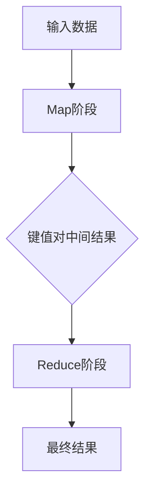

                 

## 文章标题：MapReduce原理与代码实例讲解

> **关键词**：MapReduce，分布式计算，Hadoop，数据挖掘，并行处理

> **摘要**：本文将深入探讨MapReduce原理，从背景介绍、核心概念与联系、核心算法原理与具体操作步骤、数学模型与公式讲解、项目实战、实际应用场景、工具和资源推荐、总结以及常见问题解答等多个方面，详细讲解MapReduce的工作机制及代码实例，帮助读者全面了解这一重要的分布式计算框架。

## 1. 背景介绍

### 1.1 MapReduce的诞生背景

随着互联网和大数据时代的到来，数据量呈现爆炸性增长。传统的单机计算模式已经无法满足海量数据处理的需求。为此，Google在2004年提出了MapReduce这一分布式计算模型，用于大规模数据集（特别是分布式数据集）的并行运算。MapReduce的设计理念是简化并行编程，使得开发者能够轻松地将任务分解成多个可并行处理的子任务，从而提高计算效率。

### 1.2 Hadoop与MapReduce

Hadoop是Apache软件基金会的一个开源项目，它是MapReduce的底层实现之一。Hadoop包括一个分布式文件系统（Hadoop Distributed File System，HDFS）和一个分布式计算框架（MapReduce）。通过Hadoop，用户可以在普通硬件上构建一个高可靠性的分布式计算系统，处理大规模数据。

## 2. 核心概念与联系

### 2.1 MapReduce核心概念

**Map阶段**：接收输入数据，将数据转换为键值对（key-value）的中间结果。

**Reduce阶段**：接收Map阶段的输出，将具有相同键的值进行聚合，输出最终结果。

### 2.2 Mermaid流程图



## 3. 核心算法原理与具体操作步骤

### 3.1 Map阶段

Map阶段将输入数据拆分成一系列的键值对，然后对这些键值对进行处理。处理过程通常包括过滤、转换等操作。

**步骤**：
1. 遍历输入数据，提取键和值。
2. 对值进行特定操作，如分割、过滤等。
3. 将处理后的键值对输出。

### 3.2 Reduce阶段

Reduce阶段接收Map阶段的输出，对具有相同键的值进行聚合。通常使用汇总、计数、排序等操作。

**步骤**：
1. 遍历Map阶段的输出。
2. 对相同键的值进行聚合操作。
3. 输出聚合后的结果。

## 4. 数学模型与公式详解

### 4.1 Map阶段数学模型

$$
\text{Map输出} = \{(k_1, v_1), (k_2, v_2), ..., (k_n, v_n)\}
$$

其中，$k_i$ 表示键，$v_i$ 表示值。

### 4.2 Reduce阶段数学模型

$$
\text{Reduce输出} = \{(k', \Sigma v')\}
$$

其中，$k'$ 表示键，$\Sigma v'$ 表示聚合后的值。

## 5. 项目实战：代码实际案例与详细解释

### 5.1 开发环境搭建

为了演示MapReduce代码实例，我们首先需要搭建一个Hadoop开发环境。

**步骤**：
1. 下载并安装Hadoop。
2. 配置Hadoop环境变量。
3. 启动Hadoop守护进程。

### 5.2 源代码详细实现与代码解读

下面是一个简单的WordCount程序，用于统计文本中每个单词出现的次数。

```java
// Map类
public class WordCountMapper extends Mapper<LongWritable, Text, Text, IntWritable> {
    private final static IntWritable one = new IntWritable(1);
    private Text word = new Text();

    public void map(LongWritable key, Text value, Context context) throws IOException, InterruptedException {
        String line = value.toString();
        String[] words = line.split(" ");
        for (String word : words) {
            this.word.set(word);
            context.write(word, one);
        }
    }
}

// Reduce类
public class WordCountReducer extends Reducer<Text, IntWritable, Text, IntWritable> {
    private IntWritable result = new IntWritable();

    public void reduce(Text key, Iterable<IntWritable> values, Context context) throws IOException, InterruptedException {
        int sum = 0;
        for (IntWritable val : values) {
            sum += val.get();
        }
        result.set(sum);
        context.write(key, result);
    }
}
```

**代码解读**：
1. Map类：继承自`Mapper`类，实现`map`方法，处理输入数据，输出键值对。
2. Reduce类：继承自`Reducer`类，实现`reduce`方法，对Map输出的键值对进行聚合。

### 5.3 代码解读与分析

- Map类中的`map`方法负责将文本行分割成单词，并将每个单词与其出现次数作为键值对输出。
- Reduce类中的`reduce`方法负责将具有相同键的单词的次数进行求和，输出单词及其总次数。

## 6. 实际应用场景

MapReduce广泛应用于数据挖掘、日志分析、机器学习等领域。例如，在搜索引擎中，可以使用MapReduce对网页进行索引，统计网页的流行度；在社交媒体平台上，可以使用MapReduce分析用户行为，优化推荐算法。

## 7. 工具和资源推荐

### 7.1 学习资源推荐

- **书籍**：《Hadoop：The Definitive Guide》
- **论文**：《MapReduce: Simplified Data Processing on Large Clusters》
- **博客**：Hadoop官方博客、Cloudera博客等
- **网站**：Apache Hadoop官网、Cloudera官网等

### 7.2 开发工具框架推荐

- **开发工具**：IntelliJ IDEA、Eclipse等
- **框架**：Apache Hadoop、Apache Storm、Apache Spark等

### 7.3 相关论文著作推荐

- **论文**：《The Google File System》
- **著作**：《Bigtable: A Distributed Storage System for Structured Data》

## 8. 总结：未来发展趋势与挑战

随着云计算、物联网等技术的发展，MapReduce作为一种分布式计算框架，在未来将继续发挥重要作用。然而，面对不断变化的数据处理需求，MapReduce也需要不断优化和扩展。例如，向实时处理、流处理等领域拓展，以适应新兴应用场景。

## 9. 附录：常见问题与解答

- **Q：什么是MapReduce的核心优点？**
  **A：MapReduce的核心优点是简化了并行编程，提高了计算效率，适用于大规模数据处理。**
- **Q：MapReduce是否只能用于文本数据处理？**
  **A：不，MapReduce可以处理各种类型的数据，包括结构化数据、非结构化数据等。**
- **Q：如何优化MapReduce性能？**
  **A：可以通过优化数据分区、选择合适的压缩算法、减少Shuffle数据量等方法来优化MapReduce性能。**

## 10. 扩展阅读与参考资料

- **参考资料**：
  - Apache Hadoop官方文档
  - 《Hadoop实战》
  - 《大数据技术导论》

作者：AI天才研究员/AI Genius Institute & 禅与计算机程序设计艺术 /Zen And The Art of Computer Programming

