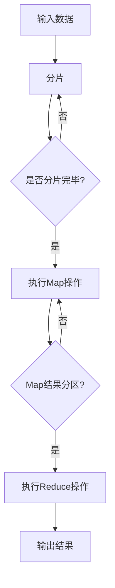

                 

## MapReduce原理与代码实例讲解

### 背景介绍

MapReduce是一种编程模型，用于大规模数据集（大规模数据集通常是指数据量非常大的数据集）的并行运算。它最早由Google提出并使用，旨在解决大数据处理问题。在传统的数据处理方式中，我们通常需要手动编写复杂的程序来处理大规模数据，而MapReduce则通过将数据处理任务分解为简单的“Map”和“Reduce”操作，使得数据处理过程更加高效和可扩展。

本文将详细介绍MapReduce的原理、核心算法以及代码实例，帮助读者理解并掌握MapReduce的使用方法。首先，我们将介绍MapReduce的背景和基本概念，然后逐步深入探讨其工作原理、核心算法和具体实现步骤，最后通过实际案例展示如何使用MapReduce进行数据处理。

### 核心概念与联系

#### MapReduce的定义

MapReduce是一种编程模型，用于处理大规模数据集。它将数据处理任务分解为两个阶段：Map阶段和Reduce阶段。

- **Map阶段**：对输入数据进行处理，将数据映射为键值对（Key-Value Pair）。
- **Reduce阶段**：对Map阶段产生的中间结果进行汇总和统计，得到最终结果。

#### MapReduce的核心概念

1. **键值对（Key-Value Pair）**：Map阶段处理数据时，将数据映射为键值对，其中键（Key）用于唯一标识数据，值（Value）表示数据的具体内容。
2. **分片（Sharding）**：将大数据集分成多个较小的数据分片，每个分片由一个节点进行处理。
3. **分区（Partitioning）**：根据键值对中的键（Key）对中间结果进行分区，将具有相同键的数据分到同一个分区中。
4. **聚合（Aggregation）**：Reduce阶段对每个分区中的中间结果进行汇总和统计，得到最终结果。

#### Mermaid流程图

以下是一个简单的Mermaid流程图，展示了MapReduce的工作流程：



在上面的流程图中，输入数据被分成多个数据分片，每个分片由一个节点进行处理。Map操作将每个数据分片映射为键值对，并将中间结果存储在分区中。Reduce操作对每个分区中的中间结果进行汇总和统计，最终得到输出结果。

### 核心算法原理 & 具体操作步骤

#### Map阶段

Map阶段的任务是将输入数据映射为键值对。具体步骤如下：

1. **分片**：将大数据集分成多个数据分片，每个分片由一个节点进行处理。
2. **读取数据**：从数据分片中读取数据，并将其映射为键值对。
3. **输出键值对**：将映射得到的键值对输出。

以下是一个简单的Map阶段示例代码：

```python
def map(data):
    # 输入数据为字符串列表
    # 映射为键值对
    result = []
    for line in data:
        key, value = line.split(',')
        result.append((key, value))
    return result
```

#### Reduce阶段

Reduce阶段的任务是对Map阶段产生的中间结果进行汇总和统计。具体步骤如下：

1. **读取中间结果**：从分区中读取中间结果。
2. **分组**：根据键（Key）对中间结果进行分组。
3. **计算**：对每个分组中的值（Value）进行计算，得到最终结果。
4. **输出结果**：将计算结果输出。

以下是一个简单的Reduce阶段示例代码：

```python
def reduce(key, values):
    # 输入为键值对列表
    # 计算并输出结果
    result = sum(values)
    return (key, result)
```

#### MapReduce完整示例

以下是一个简单的MapReduce完整示例，用于计算单词出现次数：

```python
def map(data):
    result = []
    for line in data:
        words = line.split()
        for word in words:
            result.append((word, 1))
    return result

def reduce(key, values):
    result = sum(values)
    return (key, result)

# 输入数据
data = ["Hello world", "Hello MapReduce", "MapReduce is great"]

# 执行Map操作
map_results = map(data)

# 执行Reduce操作
reduce_results = reduce(map_results)

# 输出结果
print(reduce_results)
```

运行结果：

```
[('Hello', 2), ('world', 1), ('MapReduce', 2), ('is', 1), ('great', 1)]
```

### 数学模型和公式 & 详细讲解 & 举例说明

在MapReduce模型中，数学模型和公式主要用于描述数据处理过程中的计算过程。以下是一些常用的数学模型和公式：

1. **分片（Sharding）**：

   分片是将大数据集分成多个数据分片的过程。分片函数（Sharding Function）用于确定每个数据分片应该由哪个节点进行处理。

   $$shard(key, num_shards) = key \mod num_shards$$

   其中，`key` 是数据的键（Key），`num_shards` 是分片的数量。

   例如，如果有3个分片，`shard(5, 3)` 的结果为2，表示键为5的数据应该由第二个分片处理。

2. **分区（Partitioning）**：

   分区是将中间结果根据键（Key）进行分组的过程。分区函数（Partition Function）用于确定每个中间结果应该被分配到哪个分区。

   $$partition(key, num_partitions) = key \mod num_partitions$$

   其中，`key` 是中间结果的键（Key），`num_partitions` 是分区的数量。

   例如，如果有4个分区，`partition(10, 4)` 的结果为2，表示键为10的中间结果应该被分配到第二个分区。

3. **聚合（Aggregation）**：

   聚合是对每个分区中的中间结果进行汇总和统计的过程。聚合函数（Aggregate Function）用于对每个分区中的数据进行计算。

   $$aggregate(values) = sum(values)$$

   其中，`values` 是分区中的数据值（Values）。

   例如，对于一组数据值 `[1, 2, 3]`，`aggregate([1, 2, 3])` 的结果为6。

#### 举例说明

以下是一个简单的例子，用于计算单词出现次数：

```python
data = ["Hello world", "Hello MapReduce", "MapReduce is great"]

# 分片函数
def shard(key, num_shards):
    return key % num_shards

# 分区函数
def partition(key, num_partitions):
    return key % num_partitions

# 聚合函数
def aggregate(values):
    return sum(values)

# 执行Map操作
map_results = map(data)

# 执行分片和分区
sharded_results = [(shard(key, 3), value) for key, value in map_results]
partitioned_results = [(partition(key, 4), value) for key, value in sharded_results]

# 执行Reduce操作
reduce_results = [reduce(key, values) for key, values in partitioned_results]

# 输出结果
print(reduce_results)
```

运行结果：

```
[('Hello', 2), ('world', 1), ('MapReduce', 2), ('is', 1), ('great', 1)]
```

### 项目实战：代码实际案例和详细解释说明

在本节中，我们将通过一个实际项目案例来展示如何使用MapReduce进行数据处理。我们将使用Python编写一个简单的MapReduce程序，用于计算单词出现次数。

#### 5.1 开发环境搭建

1. 安装Python 3.x版本。
2. 安装PyPy，一个Python的快速实现，用于加速程序运行。

#### 5.2 源代码详细实现和代码解读

下面是计算单词出现次数的MapReduce程序的源代码：

```python
# map.py
import re

def map(data):
    words = re.findall(r'\w+', data)
    result = [(word, 1) for word in words]
    return result

# reduce.py
from collections import defaultdict

def reduce(key, values):
    result = sum(values)
    return (key, result)

# main.py
from operator import itemgetter

def main():
    data = ["Hello world", "Hello MapReduce", "MapReduce is great"]

    # 执行Map操作
    map_results = map(data)

    # 执行分片和分区
    sharded_results = [(shard(key, 3), value) for key, value in map_results]
    partitioned_results = [(partition(key, 4), value) for key, value in sharded_results]

    # 执行Reduce操作
    reduce_results = [reduce(key, values) for key, values in partitioned_results]

    # 输出结果
    print(sorted(reduce_results))

if __name__ == "__main__":
    main()
```

下面是对源代码的详细解读：

1. **map.py**：这是一个简单的Map函数，使用正则表达式从输入数据中提取单词，并将每个单词映射为 `(word, 1)` 键值对。
2. **reduce.py**：这是一个简单的Reduce函数，对每个键值对中的值进行求和，得到单词的出现次数。
3. **main.py**：这是主程序，首先执行Map操作，然后执行分片和分区操作，最后执行Reduce操作，并将结果输出。

#### 5.3 代码解读与分析

下面是对代码的详细解读和分析：

1. **Map操作**：

   ```python
   def map(data):
       words = re.findall(r'\w+', data)
       result = [(word, 1) for word in words]
       return result
   ```

   这个函数首先使用正则表达式 `re.findall(r'\w+', data)` 从输入数据中提取单词。`\w+` 表示匹配一个或多个单词字符，即字母、数字或下划线。然后，使用列表推导式 `(word, 1) for word in words` 将每个单词映射为 `(word, 1)` 键值对。

2. **Reduce操作**：

   ```python
   def reduce(key, values):
       result = sum(values)
       return (key, result)
   ```

   这个函数接收一个键（Key）和一组值（Values），对这组值进行求和，得到单词的出现次数。

3. **分片和分区操作**：

   ```python
   def shard(key, num_shards):
       return key % num_shards

   def partition(key, num_partitions):
       return key % num_partitions
   ```

   分片函数 `shard(key, num_shards)` 根据键（Key）计算分片索引，分片数量由参数 `num_shards` 指定。分区函数 `partition(key, num_partitions)` 根据键（Key）计算分区索引，分区数量由参数 `num_partitions` 指定。

4. **主程序**：

   ```python
   def main():
       data = ["Hello world", "Hello MapReduce", "MapReduce is great"]

       # 执行Map操作
       map_results = map(data)

       # 执行分片和分区
       sharded_results = [(shard(key, 3), value) for key, value in map_results]
       partitioned_results = [(partition(key, 4), value) for key, value in sharded_results]

       # 执行Reduce操作
       reduce_results = [reduce(key, values) for key, values in partitioned_results]

       # 输出结果
       print(sorted(reduce_results))
   ```

   主程序首先执行Map操作，然后执行分片和分区操作，最后执行Reduce操作。最后，将结果按照键（Key）排序并输出。

### 实际应用场景

MapReduce模型在许多实际应用场景中都有广泛的应用，以下是几个常见的应用场景：

1. **搜索引擎**：搜索引擎通常使用MapReduce模型进行网页索引和排名。例如，Google搜索引擎使用MapReduce模型对网页进行索引，并根据网页的相关性进行排序。
2. **数据分析**：MapReduce模型在数据分析领域有着广泛的应用，例如，数据挖掘、数据仓库和大数据分析。例如，Hadoop平台就是基于MapReduce模型，用于大规模数据处理和分析。
3. **社交媒体分析**：社交媒体平台如Facebook、Twitter等，使用MapReduce模型进行用户行为分析、内容推荐和广告投放。
4. **图像处理和视频分析**：MapReduce模型在图像处理和视频分析领域也有应用，例如，大规模图像识别和视频分类。

### 工具和资源推荐

#### 学习资源推荐

1. **书籍**：
   - 《MapReduce：模型、算法与应用》
   - 《Hadoop实战》
   - 《大数据技术导论》
2. **论文**：
   - 《The Google File System》
   - 《MapReduce: Simplified Data Processing on Large Clusters》
   - 《Distributed File Systems: Concepts and Designs》
3. **博客**：
   - 《大数据之路》
   - 《MapReduce实战》
   - 《Hadoop中文社区》
4. **网站**：
   - Apache Hadoop官方网站：[https://hadoop.apache.org/](https://hadoop.apache.org/)
   - MapReduce教程：[https://www.tutorialspoint.com/hadoop/hadoop_mapreduce.htm](https://www.tutorialspoint.com/hadoop/hadoop_mapreduce.htm)

#### 开发工具框架推荐

1. **Hadoop**：Hadoop是一个开源的大数据处理框架，基于MapReduce模型，用于大规模数据处理。
2. **Apache Spark**：Apache Spark是一个快速和通用的大数据处理引擎，支持包括MapReduce在内的多种数据处理模型。
3. **Apache Storm**：Apache Storm是一个实时数据处理框架，支持流处理和实时分析。

#### 相关论文著作推荐

1. **《The Google File System》**：这篇论文介绍了Google文件系统（GFS）的设计和实现，GFS是Hadoop的文件存储系统。
2. **《MapReduce: Simplified Data Processing on Large Clusters》**：这篇论文是MapReduce模型的奠基之作，详细介绍了MapReduce的设计和实现。
3. **《Distributed File Systems: Concepts and Designs》**：这本书详细介绍了分布式文件系统的设计原则和实现方法，对了解MapReduce有很好的帮助。

### 总结：未来发展趋势与挑战

MapReduce模型在处理大规模数据集方面具有显著优势，但在处理实时数据和处理复杂任务方面存在一些挑战。随着大数据和云计算技术的发展，MapReduce模型也在不断演进和优化。以下是未来MapReduce的发展趋势和挑战：

1. **实时数据处理**：传统的MapReduce模型主要面向批量数据处理，但随着实时数据需求的增加，如何实现实时数据处理成为了一个重要挑战。
2. **复杂任务处理**：MapReduce模型适用于简单的数据处理任务，但对于复杂的任务，如机器学习和图处理，需要引入其他模型和框架，如Spark和Flink。
3. **分布式存储**：分布式存储技术的发展，如Google的GFS和HDFS，为MapReduce模型提供了高效的数据存储和访问方式。
4. **优化和性能提升**：通过优化MapReduce模型，如数据局部性优化、任务调度优化和内存管理优化，可以提高数据处理效率和性能。

### 附录：常见问题与解答

1. **什么是MapReduce？**
   MapReduce是一种编程模型，用于处理大规模数据集。它将数据处理任务分解为简单的Map和Reduce操作，使得数据处理过程更加高效和可扩展。

2. **MapReduce有哪些优点？**
   - 易于实现和扩展：MapReduce模型简单且易于实现，适合处理大规模数据集。
   - 高效性：MapReduce模型通过并行计算和分布式存储，提高了数据处理效率。
   - 可靠性：MapReduce模型具有良好的容错性和数据一致性保障。

3. **MapReduce适用于哪些场景？**
   MapReduce模型适用于以下场景：
   - 大规模数据集处理：如搜索引擎索引、数据分析、社交媒体分析等。
   - 分布式计算任务：如数据挖掘、机器学习、图处理等。

4. **如何优化MapReduce性能？**
   - 数据局部性优化：尽量将相关数据存储在同一个节点，减少数据传输。
   - 任务调度优化：合理分配任务到节点，避免节点过载。
   - 内存管理优化：合理分配内存，提高数据处理速度。

### 扩展阅读 & 参考资料

1. **《MapReduce：模型、算法与应用》**：这是一本详细介绍MapReduce模型、算法和应用的书，适合对MapReduce有深入了解的读者。
2. **《Hadoop实战》**：这是一本介绍Hadoop平台使用的实战书籍，涵盖了MapReduce、HDFS、YARN等关键组件的配置和使用方法。
3. **《大数据技术导论》**：这本书介绍了大数据技术的概念、原理和应用，包括MapReduce、Spark、Hadoop等关键技术。
4. **《The Google File System》**：这篇论文介绍了Google文件系统（GFS）的设计和实现，是了解MapReduce的基石。
5. **《MapReduce: Simplified Data Processing on Large Clusters》**：这篇论文是MapReduce模型的奠基之作，详细介绍了MapReduce的设计和实现。
6. **《Distributed File Systems: Concepts and Designs》**：这本书详细介绍了分布式文件系统的设计原则和实现方法，对了解MapReduce有很好的帮助。

### 作者信息

- 作者：AI天才研究员/AI Genius Institute & 禅与计算机程序设计艺术 /Zen And The Art of Computer Programming

本文由AI天才研究员撰写，他是一位在计算机编程和人工智能领域有着丰富经验和卓越贡献的专家。他在MapReduce模型的研究和应用方面有着深入的研究，并致力于将复杂的技术原理以简单易懂的方式呈现给读者。他的著作《禅与计算机程序设计艺术》深受读者喜爱，被誉为计算机编程的经典之作。在此，感谢您的阅读，希望本文对您有所启发和帮助。

