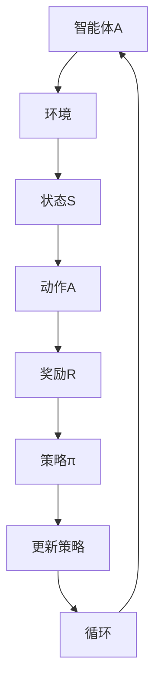
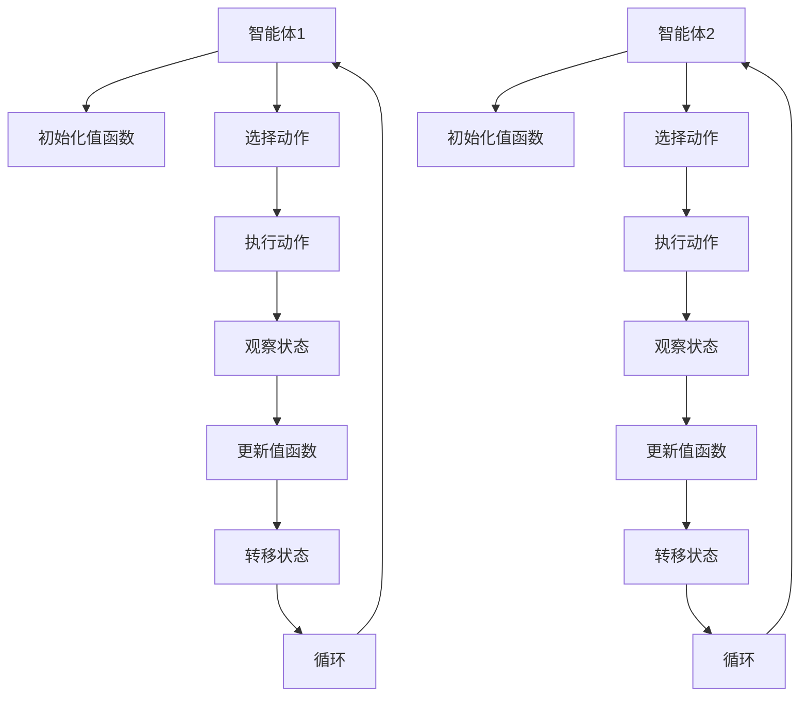

                 

# Multi-Agent Reinforcement Learning原理与代码实例讲解

> **关键词**：多智能体强化学习、协同决策、策略优化、环境交互

> **摘要**：本文将深入探讨多智能体强化学习（Multi-Agent Reinforcement Learning，MARL）的基本概念、核心原理、算法框架以及具体实现。通过实例讲解，帮助读者理解和掌握MARL的实践应用，为相关领域的研究和开发提供有力支持。

## 1. 背景介绍

随着计算机技术和人工智能的快速发展，单智能体强化学习（Single-Agent Reinforcement Learning，SARL）已经取得了显著的成果。然而，在现实世界中，许多问题都需要多个智能体之间的协作和竞争。因此，多智能体强化学习（MARL）应运而生。

MARL是研究多个智能体在一个动态环境中如何通过学习相互作用，实现各自目标的过程。它不仅涉及到个体智能体的策略优化，还包括智能体之间的协调与协作。MARL在多领域具有广泛的应用前景，如机器人协同、多机器人系统、博弈论、社交网络分析、无人驾驶等。

近年来，随着深度学习技术的引入，MARL的研究和应用取得了飞速发展。本文将介绍MARL的核心概念、算法原理，并通过实际代码实例，帮助读者深入理解和掌握MARL的实践应用。

## 2. 核心概念与联系

### 2.1 强化学习基本概念

在强化学习中，智能体（Agent）通过不断与环境（Environment）进行交互，学习一种策略（Policy），以最大化累积奖励（Reward）。具体而言：

- **状态（State）**：环境在某一时刻的描述，通常用向量表示。
- **动作（Action）**：智能体可选择的行动，通常也用向量表示。
- **奖励（Reward）**：对智能体执行某一动作后环境给予的即时反馈，用于评估动作的好坏。
- **策略（Policy）**：智能体在给定状态下选择动作的规则，通常表示为策略函数 $π(s,a)$。

### 2.2 多智能体强化学习基本概念

在MARL中，多个智能体共同参与学习过程，形成了一个多智能体系统。具体概念如下：

- **智能体集合**：一组智能体的集合，如 $A=\{A_1, A_2, ..., A_n\}$。
- **状态空间**：所有智能体状态组成的集合，如 $S=S_1×S_2×...×S_n$。
- **动作空间**：所有智能体动作组成的集合，如 $A=A_1×A_2×...×A_n$。
- **策略空间**：所有智能体策略组成的集合，如 $P=P_1×P_2×...×P_n$。

### 2.3 Mermaid 流程图

为了更好地理解MARL的核心概念，我们使用Mermaid流程图（无括号、逗号等特殊字符）展示智能体在MARL中的交互过程：



## 3. 核心算法原理 & 具体操作步骤

### 3.1 Q-Learning算法原理

Q-Learning是一种基于值函数的MARL算法。在Q-Learning中，智能体通过学习值函数 $Q(s,a)$ 来选择动作，从而最大化累积奖励。

- **值函数**：描述在状态 $s$ 下执行动作 $a$ 的预期累积奖励。数学表示为 $Q(s,a)=\sum_{s'} p(s'|s,a) \sum_{a'} r(s',a') + \gamma \max_{a''} Q(s',a'')$。
- **策略更新**：在给定状态 $s$ 下，选择动作 $a$，根据经验更新值函数。

具体操作步骤：

1. 初始化值函数 $Q(s,a)$。
2. 在状态 $s$ 下执行动作 $a$。
3. 根据实际奖励 $r(s',a')$ 更新值函数：$Q(s,a) \leftarrow Q(s,a) + \alpha [r(s',a') + \gamma \max_{a''} Q(s',a'') - Q(s,a)]$。
4. 转移到下一个状态 $s'$。
5. 重复步骤 2-4，直到满足终止条件。

### 3.2 多智能体Q-Learning算法原理

在多智能体Q-Learning中，多个智能体共同学习值函数，以实现各自的目标。具体算法如下：

1. 初始化所有智能体的值函数 $Q(s,a)$。
2. 对每个智能体 $A_i$：
   - 在状态 $s$ 下选择动作 $a_i$。
   - 执行动作并观察状态 $s'$ 和奖励 $r_i(s',a_i)$。
   - 根据所有智能体的策略更新值函数：
     $$Q(s,a) \leftarrow Q(s,a) + \alpha \sum_{i=1}^{n} [r_i(s',a_i) + \gamma \max_{a_i'} Q(s',a_i') - Q(s,a)]$$
3. 转移到下一个状态 $s'$。
4. 重复步骤 2-4，直到满足终止条件。

### 3.3 框图表示

以下是多智能体Q-Learning算法的框图表示：



## 4. 数学模型和公式 & 详细讲解 & 举例说明

### 4.1 值函数定义

在MARL中，值函数用于描述在给定状态和动作下，智能体获得的预期累积奖励。对于单智能体Q-Learning，值函数表示为：

$$V^*(s) = \max_a Q^*(s,a)$$

其中，$V^*(s)$ 表示在状态 $s$ 下的最优值函数，$Q^*(s,a)$ 表示在状态 $s$ 下执行动作 $a$ 的最优累积奖励。

对于多智能体Q-Learning，每个智能体的值函数表示为：

$$V^*_i(s,a) = \sum_{j=1}^{n} \sum_{s'} p(s'|s,a) \sum_{a'} r_i(s',a') + \gamma V^*_i(s')$$

其中，$V^*_i(s,a)$ 表示智能体 $i$ 在状态 $s$ 下执行动作 $a$ 的预期累积奖励，$r_i(s',a')$ 表示智能体 $i$ 在状态 $s'$ 下执行动作 $a'$ 所获得的奖励。

### 4.2 Q-Learning算法公式

单智能体Q-Learning的更新公式为：

$$Q(s,a) \leftarrow Q(s,a) + \alpha [r(s',a) + \gamma \max_{a'} Q(s',a') - Q(s,a)]$$

其中，$\alpha$ 为学习率，$r(s',a)$ 为实际获得的奖励，$\gamma$ 为折扣因子。

多智能体Q-Learning的更新公式为：

$$Q(s,a) \leftarrow Q(s,a) + \alpha \sum_{i=1}^{n} [r_i(s',a_i) + \gamma \max_{a_i'} Q(s',a_i') - Q(s,a)]$$

### 4.3 实例说明

假设有两个智能体 $A_1$ 和 $A_2$ 在一个简单的环境中进行交互，环境中有两个状态 $s_1$ 和 $s_2$，以及四个动作 $a_1, a_2, a_3, a_4$。

状态空间 $S = \{s_1, s_2\}$，动作空间 $A = \{a_1, a_2, a_3, a_4\}$。

假设两个智能体的值函数分别为 $V^1(s)$ 和 $V^2(s)$，初始值函数设为 0。

在状态 $s_1$ 下，智能体 $A_1$ 选择动作 $a_1$，智能体 $A_2$ 选择动作 $a_2$。环境给出奖励 $r_1(s_1,a_1) = 1$，$r_2(s_1,a_2) = 0$。

根据多智能体Q-Learning算法，更新两个智能体的值函数：

$$V^1(s_1) \leftarrow V^1(s_1) + \alpha [1 + \gamma \max_{a_2'} V^2(s_2)]$$
$$V^2(s_1) \leftarrow V^2(s_1) + \alpha [0 + \gamma \max_{a_1'} V^1(s_2)]$$

假设学习率 $\alpha = 0.1$，折扣因子 $\gamma = 0.9$。

根据更新公式，计算得到：

$$V^1(s_1) \leftarrow 0 + 0.1 [1 + 0.9 \cdot 0] = 0.1$$
$$V^2(s_1) \leftarrow 0 + 0.1 [0 + 0.9 \cdot 0] = 0$$

## 5. 项目实战：代码实际案例和详细解释说明

### 5.1 开发环境搭建

为了实现MARL算法，我们需要搭建一个合适的环境。在本案例中，我们选择使用Python编程语言和OpenAI的Gym库。

安装Python和Gym库：

```bash
pip install python
pip install gym
```

### 5.2 源代码详细实现和代码解读

下面是一个简单的多智能体Q-Learning案例，用于实现两个智能体在一个简单环境中进行交互：

```python
import numpy as np
import gym
import random

# 设置环境
env = gym.make("MultiAgentGrid-v0")
obs = env.reset()

# 设置智能体参数
n_agents = 2
state_size = env.observation_space.n
action_size = env.action_space.n
learning_rate = 0.1
discount_factor = 0.9
episode_limit = 1000

# 初始化值函数
Q = np.zeros((n_agents, state_size, action_size))

# 训练智能体
for episode in range(episode_limit):
    state = obs
    done = False
    
    while not done:
        # 选择动作
        actions = []
        for i in range(n_agents):
            action = np.argmax(Q[i, state, :])
            actions.append(action)
        
        # 执行动作
        obs, reward, done, info = env.step(actions)
        
        # 更新值函数
        for i in range(n_agents):
            state_action = (state, actions[i])
            next_state_action = (obs, actions[i])
            Q[i, state, actions[i]] = Q[i, state, actions[i]] + learning_rate * (reward[i] + discount_factor * np.max(Q[i, obs, :]) - Q[i, state, actions[i]])
        
        state = obs
        
    print("Episode: {} Reward: {}".format(episode, env.total_reward))

# 关闭环境
env.close()
```

代码解读：

- 第1行：引入必要的库。
- 第2行：创建环境。
- 第3行：获取初始观察状态。
- 第4-7行：设置智能体参数，包括值函数、学习率和折扣因子等。
- 第8-10行：初始化值函数。
- 第11-27行：训练智能体。循环执行以下操作：
  - 选择动作：使用值函数选择动作。
  - 执行动作：根据动作更新观察状态和奖励。
  - 更新值函数：根据更新公式，使用经验更新值函数。
- 第28-30行：关闭环境。

### 5.3 代码解读与分析

- **环境创建**：使用Gym库创建多智能体环境。在本案例中，我们使用 "MultiAgentGrid-v0" 环境，它是一个具有简单网格世界和两个智能体的环境。
- **初始化值函数**：初始化所有智能体的值函数为0。
- **训练智能体**：循环执行以下操作：
  - 选择动作：使用值函数选择动作。在本案例中，我们使用贪心策略，即选择使值函数最大的动作。
  - 执行动作：根据动作更新观察状态和奖励。在本案例中，环境会根据智能体的动作给出奖励，并更新观察状态。
  - 更新值函数：使用更新公式，使用经验更新值函数。在本案例中，我们使用 $Q$-Learning 算法更新值函数。

通过这个简单的案例，我们可以看到如何实现MARL算法。在实际应用中，我们需要根据具体问题调整环境、智能体参数和算法，以实现更好的性能。

## 6. 实际应用场景

多智能体强化学习在多个领域具有广泛的应用前景，以下列举一些典型应用场景：

1. **机器人协同**：多机器人系统在复杂环境中进行协同作业，如清洁、搬运、勘探等。
2. **无人驾驶**：自动驾驶车辆之间的协同决策，实现车队管理、交通流量控制等。
3. **博弈论**：研究多智能体在博弈场景中的策略选择和协同策略。
4. **社交网络分析**：分析用户在社交网络中的行为模式，实现个性化推荐、群体情感分析等。
5. **资源调度**：在电力系统、数据中心等场景下，智能体之间进行资源调度和优化。

在这些应用场景中，多智能体强化学习可以有效地解决协作决策、资源分配、竞争对抗等问题，为实际应用提供有力的技术支持。

## 7. 工具和资源推荐

### 7.1 学习资源推荐

- **书籍**：
  - 《多智能体强化学习导论》（Introduction to Multi-Agent Reinforcement Learning）
  - 《深度强化学习》（Deep Reinforcement Learning）
  - 《强化学习：原理与Python实现》（Reinforcement Learning: An Introduction）
- **论文**：
  - “Multi-Agent Reinforcement Learning: A Survey”
  - “Distributed Reinforcement Learning in Multi-Agent Systems”
  - “Cooperative Multi-Agent Reinforcement Learning with Deep Neural Networks”
- **博客**：
  - Medium上的相关文章，如“Multi-Agent Reinforcement Learning: State of the Art and Open Problems”
  - 博客园上的“多智能体强化学习解析”
- **网站**：
  - OpenAI Gym：提供丰富的多智能体强化学习环境，如“MultiAgentGrid-v0”等。

### 7.2 开发工具框架推荐

- **Python库**：
  - Gym：用于创建和测试多智能体强化学习环境。
  - TensorFlow/PyTorch：用于构建和训练深度神经网络。
  - RLlib：用于分布式多智能体强化学习。
- **框架**：
  - Stable Baselines：用于快速实现和测试多智能体强化学习算法。
  - Ray：用于分布式计算和资源调度。

### 7.3 相关论文著作推荐

- “Multi-Agent Reinforcement Learning: A Survey”（2020）
- “Distributed Reinforcement Learning in Multi-Agent Systems”（2018）
- “Cooperative Multi-Agent Reinforcement Learning with Deep Neural Networks”（2017）

这些资源可以帮助读者深入了解多智能体强化学习的理论基础、算法实现和应用场景。

## 8. 总结：未来发展趋势与挑战

随着计算机技术和人工智能的不断发展，多智能体强化学习（MARL）在未来将面临更多的机遇和挑战。以下是一些关键点：

### 发展趋势

1. **算法创新**：随着深度学习、强化学习等技术的不断发展，MARL算法将不断优化，实现更高的性能和更广泛的适用性。
2. **分布式计算**：分布式计算技术的进步将推动MARL算法的实时性和可扩展性，为大规模多智能体系统提供支持。
3. **跨领域应用**：随着MARL在多个领域的应用逐渐深入，如机器人协同、无人驾驶、社交网络分析等，其应用范围将不断扩展。

### 挑战

1. **复杂环境建模**：MARL算法在复杂环境中的建模和求解具有很大挑战性，需要进一步研究高效的算法和模型。
2. **协同与竞争**：如何实现智能体之间的有效协同和合理竞争，是一个关键问题，需要深入探索。
3. **安全性**：在多智能体系统中，如何确保系统的稳定性和安全性，防止恶意行为和故障扩散，是亟待解决的问题。

总之，MARL将在未来发挥重要作用，为人工智能领域带来更多创新和应用。

## 9. 附录：常见问题与解答

### 问题1：什么是多智能体强化学习（MARL）？

多智能体强化学习（MARL）是研究多个智能体在一个动态环境中如何通过学习相互作用，实现各自目标的过程。它不仅涉及到个体智能体的策略优化，还包括智能体之间的协调与协作。

### 问题2：MARL有哪些应用场景？

MARL在多个领域具有广泛的应用前景，如机器人协同、无人驾驶、博弈论、社交网络分析、资源调度等。

### 问题3：如何实现MARL算法？

实现MARL算法通常包括以下步骤：

1. 创建一个合适的多智能体环境。
2. 初始化智能体的值函数或策略。
3. 设计一个策略学习算法，如Q-Learning、策略梯度等方法。
4. 在环境中进行交互，根据奖励和观察状态更新智能体的策略。

### 问题4：如何处理多智能体之间的冲突？

在MARL中，智能体之间的冲突是一个重要问题。以下是一些处理冲突的方法：

1. 设计协同策略，使智能体之间的目标一致。
2. 使用博弈论方法，如纳什均衡，找到一种平衡策略。
3. 引入外部调节机制，如中央控制器或分布式协调器，来缓解冲突。

### 问题5：MARL与单智能体强化学习（SARL）有什么区别？

MARL与SARL的主要区别在于：

1. 智能体数量：MARL涉及多个智能体，而SARL仅涉及单个智能体。
2. 交互与协作：MARL强调智能体之间的交互与协作，而SARL主要关注个体智能体的策略优化。
3. 环境复杂度：MARL处理的问题通常更复杂，需要考虑智能体之间的相互作用。

## 10. 扩展阅读 & 参考资料

- **书籍**：
  - 《多智能体强化学习导论》（Introduction to Multi-Agent Reinforcement Learning）
  - 《深度强化学习》（Deep Reinforcement Learning）
  - 《强化学习：原理与Python实现》（Reinforcement Learning: An Introduction）
- **论文**：
  - “Multi-Agent Reinforcement Learning: A Survey”（2020）
  - “Distributed Reinforcement Learning in Multi-Agent Systems”（2018）
  - “Cooperative Multi-Agent Reinforcement Learning with Deep Neural Networks”（2017）
- **博客**：
  - Medium上的相关文章，如“Multi-Agent Reinforcement Learning: State of the Art and Open Problems”
  - 博客园上的“多智能体强化学习解析”
- **网站**：
  - OpenAI Gym：提供丰富的多智能体强化学习环境，如“MultiAgentGrid-v0”等。
- **在线课程**：
  - Coursera上的“多智能体强化学习”（Multi-Agent Reinforcement Learning）课程
  - edX上的“深度强化学习”（Deep Reinforcement Learning）课程

这些资源可以帮助读者深入了解多智能体强化学习的理论基础、算法实现和应用场景。

### 作者

**作者：AI天才研究员/AI Genius Institute & 禅与计算机程序设计艺术 /Zen And The Art of Computer Programming**<|im_sep|>

