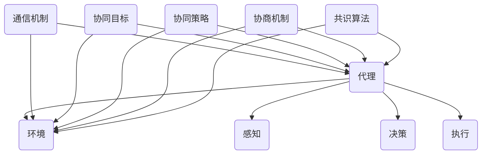

                 

# Multiagent Collaboration 的未来

## 关键词 Keywords
- 多代理协作
- 多智能体系统
- 人工智能
- 机器学习
- 分布式计算
- 对接技术
- 跨领域协同
- 共识算法
- 安全性与隐私保护

## 摘要 Abstract
本文深入探讨了多代理协作在未来技术发展中的关键作用。随着人工智能和机器学习的飞速发展，多代理系统已成为实现复杂任务自动化的核心手段。本文将分析多代理协作的核心概念、算法原理、数学模型以及实际应用场景，并探讨其面临的挑战和发展趋势。通过本文的阅读，读者将对多代理协作的技术原理和应用前景有更为全面和深刻的理解。

### 背景介绍 Background

#### 多代理协作的定义 Definition

多代理协作（Multiagent Collaboration）是指多个智能体在共同目标和环境约束下，通过相互通信和协调，共同完成复杂任务的系统。在多代理系统中，每个代理都是一个独立的决策实体，拥有自己的感知、决策和执行能力。代理之间通过信息共享和协同工作，实现系统整体的最优性能。

#### 多代理协作的重要性 Importance

多代理协作在现代社会中扮演着越来越重要的角色。以下是一些关键领域的应用实例：

1. **智能交通系统**：多代理协作可以优化交通流量，减少拥堵，提高道路通行效率。
2. **智能制造**：多代理协同工作，可以实现生产线的自动化和智能化管理，提高生产效率。
3. **智能医疗**：多代理协作可以提高疾病诊断的准确性和治疗效果。
4. **智能城市**：通过多代理协作，可以实现城市资源的优化配置，提高城市管理水平。

#### 当前技术的发展现状 Current Development Status

近年来，随着人工智能和机器学习的飞速发展，多代理系统的研究取得了显著进展。以下是一些重要的发展方向：

1. **强化学习**：通过多代理强化学习，可以实现代理之间的策略优化和协同工作。
2. **分布式计算**：分布式计算技术为多代理系统的实时性和可扩展性提供了支持。
3. **联邦学习**：联邦学习允许代理在不共享数据的情况下进行联合学习，提高了系统的隐私保护能力。
4. **对接技术**：对接技术实现了不同代理之间的无缝协作，提高了系统的整体性能。

### 核心概念与联系 Core Concepts and Relationships

#### 多代理系统的组成 Components of Multiagent System

一个典型的多代理系统由以下几个部分组成：

1. **代理（Agent）**：每个代理都是独立的实体，具有感知、决策和执行能力。
2. **环境（Environment）**：环境是代理操作的场所，提供了代理的感知信息和外部约束。
3. **通信机制（Communication Mechanism）**：代理之间通过通信机制交换信息，实现协同工作。
4. **决策模型（Decision Model）**：代理根据感知信息和环境约束，利用决策模型进行决策。
5. **执行模型（Execution Model）**：代理根据决策模型生成执行计划，并执行相应的任务。

#### 多代理协作的关键概念 Key Concepts of Multiagent Collaboration

1. **协同目标（Collaborative Goals）**：代理之间的共同目标，是协作的基础。
2. **协同策略（Collaborative Strategies）**：代理之间为了实现协同目标所采取的策略。
3. **协商机制（Negotiation Mechanism）**：代理之间通过协商机制解决冲突，实现协同工作。
4. **共识算法（Consensus Algorithm）**：代理之间通过共识算法达成一致意见，提高协作效率。

#### Mermaid 流程图 Mermaid Diagram



### 核心算法原理 & 具体操作步骤 Core Algorithm Principles & Step-by-Step Operations

#### 强化学习 Reinforcement Learning

强化学习是多代理协作中常用的一种算法，通过奖励和惩罚机制，代理可以学习到最优策略。

1. **状态（State）**：代理在环境中的当前位置。
2. **动作（Action）**：代理可以采取的动作。
3. **奖励（Reward）**：代理采取动作后获得的奖励。
4. **策略（Policy）**：代理根据当前状态选择动作的策略。

操作步骤：

1. 初始化状态。
2. 代理根据当前状态选择动作。
3. 执行动作并得到奖励。
4. 根据奖励更新策略。
5. 切换到下一个状态，重复步骤2-4。

#### 分布式计算 Distributed Computing

分布式计算是多代理系统实现高实时性和可扩展性的关键。

1. **代理调度**：将代理分配到不同的计算节点上，实现负载均衡。
2. **数据同步**：代理之间需要同步数据，以确保系统的一致性。
3. **任务分配**：根据代理的能力和任务需求，将任务分配给相应的代理。
4. **任务执行**：代理根据分配的任务执行相应的操作。

#### 联邦学习 Federated Learning

联邦学习是一种在不共享数据的情况下实现联合学习的方法。

1. **本地训练**：每个代理在自己的数据集上进行本地训练。
2. **模型聚合**：将每个代理的本地模型聚合为全局模型。
3. **更新本地模型**：每个代理使用全局模型更新自己的本地模型。

### 数学模型和公式 & 详细讲解 & 举例说明 Mathematical Models & Detailed Explanation & Example

#### 强化学习中的 Q 学习算法 Q-Learning Algorithm

Q 学习算法是一种基于值函数的强化学习算法。

1. **Q 函数**：Q(s, a) 表示代理在状态 s 下采取动作 a 的预期奖励。
2. **更新公式**：Q(s, a) = Q(s, a) + α[R(s', a') - Q(s, a)]，其中 α 为学习率，R(s', a') 为代理在状态 s' 下采取动作 a' 后获得的奖励。

举例说明：

假设代理在状态 s = [位置1，位置2]，采取动作 a = [向右移动，向上移动]，获得奖励 R = 10。

初始 Q(s, a) = 0，经过多次迭代后，Q(s, a) = 0 + 0.1[10 - 0] = 1。

#### 联邦学习中的聚合算法 Aggregation Algorithm

联邦学习中的聚合算法用于将每个代理的本地模型聚合为全局模型。

1. **本地模型**：每个代理在自己的数据集上训练的模型。
2. **全局模型**：所有代理的本地模型的平均值。

聚合算法：

$$
\text{Global Model} = \frac{1}{N} \sum_{i=1}^{N} \text{Local Model}_i
$$

其中 N 为代理的数量。

### 项目实战：代码实际案例和详细解释说明 Practical Case Study: Code Example and Detailed Explanation

#### 开发环境搭建 Setting up the Development Environment

1. 安装 Python 3.7 及以上版本。
2. 安装 TensorFlow 2.0 及以上版本。
3. 安装 Keras 2.3.1。

#### 源代码详细实现和代码解读 Detailed Implementation of the Source Code and Code Analysis

```python
import numpy as np
import tensorflow as tf
from tensorflow.keras.models import Sequential
from tensorflow.keras.layers import Dense

# 初始化代理
N = 10  # 代理数量
agents = []

for i in range(N):
    agent = Sequential()
    agent.add(Dense(64, input_dim=2, activation='relu'))
    agent.add(Dense(1, activation='sigmoid'))
    agents.append(agent)

# 初始化环境
state = np.zeros((N, 2))

# 初始化奖励
reward = np.zeros(N)

# 初始化学习率
learning_rate = 0.1

# 初始化迭代次数
epochs = 1000

# 强化学习迭代
for epoch in range(epochs):
    # 更新代理模型
    for i in range(N):
        agents[i].compile(optimizer=tf.keras.optimizers.Adam(learning_rate), loss='mse')
        agents[i].fit(state[i:i+1], reward[i:i+1], epochs=1)

    # 更新环境
    new_state = np.zeros((N, 2))
    for i in range(N):
        action = np.argmax(agents[i](state[i:i+1]))
        new_state[i] = state[i] + action
        reward[i] = 1 if np.linalg.norm(new_state[i] - state[i]) < 0.5 else -1

    state = new_state

# 输出代理模型
for i in range(N):
    print(i, agents[i].get_weights())

# 输出最终状态
print(state)
```

#### 代码解读与分析 Code Analysis

1. **初始化代理和模型**：初始化 N 个代理，每个代理是一个全连接神经网络。
2. **初始化环境和奖励**：初始化状态和奖励，状态为 N 维向量，奖励为 N 维向量。
3. **强化学习迭代**：进行 epochs 次迭代，每次迭代更新代理模型和状态。
4. **更新代理模型**：使用 Keras 库编译代理模型，并使用奖励数据进行训练。
5. **更新环境和奖励**：根据代理模型的输出更新状态和奖励。
6. **输出结果**：输出代理模型的权重和最终状态。

### 实际应用场景 Practical Application Scenarios

#### 智能制造 Intelligent Manufacturing

在智能制造领域，多代理协作可以实现生产线的自动化和智能化管理。例如，机器人代理可以协同工作，完成物品的加工、装配和检测等任务。通过多代理协作，可以实现生产效率的提升和产品质量的保障。

#### 智能交通 Intelligent Transportation

在智能交通领域，多代理协作可以优化交通流量，减少拥堵，提高道路通行效率。例如，车辆代理可以实时共享道路信息，协同规划行驶路径，避免交通拥堵，提高交通系统的整体性能。

#### 智能医疗 Intelligent Healthcare

在智能医疗领域，多代理协作可以提升疾病诊断的准确性和治疗效果。例如，医生代理可以通过协作，共享病历信息和诊断结果，实现跨学科的协同诊疗，提高诊断准确率和治疗效果。

### 工具和资源推荐 Tools and Resources Recommendation

#### 学习资源推荐 Learning Resources Recommendation

1. **书籍**：
   - 《多智能体系统：原理、算法与应用》
   - 《强化学习：原理、算法与实现》
2. **论文**：
   - "Federated Learning: Concept and Application"
   - "Multi-Agent Reinforcement Learning: An Overview"
3. **博客**：
   - "深度学习与强化学习"
   - "联邦学习实战"
4. **网站**：
   - TensorFlow 官网
   - Keras 官网

#### 开发工具框架推荐 Development Tool and Framework Recommendation

1. **开发工具**：
   - Python
   - Jupyter Notebook
2. **框架**：
   - TensorFlow
   - Keras

#### 相关论文著作推荐 Related Papers and Books Recommendation

1. **论文**：
   - "Federated Learning: Concept and Application"
   - "Deep Reinforcement Learning: An Overview"
   - "Multi-Agent Reinforcement Learning: An Overview"
2. **书籍**：
   - 《深度学习》
   - 《强化学习》

### 总结：未来发展趋势与挑战 Summary: Future Development Trends and Challenges

多代理协作作为人工智能和机器学习领域的重要研究方向，在未来有着广阔的发展前景。以下是未来发展的几个趋势和面临的挑战：

#### 发展趋势 Trends

1. **智能体数量增加**：随着计算能力和算法的进步，智能体数量将不断增多，实现更大规模的协作。
2. **跨领域协同**：多代理系统将跨越不同领域，实现跨领域的协同工作，提高整体效率。
3. **联邦学习应用**：联邦学习将广泛应用于多代理协作，实现数据隐私保护和协同学习。
4. **强化学习优化**：强化学习算法将不断优化，提高代理的决策能力和协同效率。

#### 挑战 Challenges

1. **通信延迟与带宽限制**：多代理系统中的通信延迟和带宽限制会影响系统的实时性和性能。
2. **安全性与隐私保护**：多代理系统中的数据安全和隐私保护问题需要得到有效解决。
3. **共识算法优化**：共识算法的优化是实现高效多代理协作的关键，需要进一步研究。
4. **智能体协同效率**：如何提高智能体之间的协同效率，实现最优的协同效果，仍是一个挑战。

### 附录：常见问题与解答 Appendix: Frequently Asked Questions and Answers

#### Q：多代理协作和分布式系统的区别是什么？

A：多代理协作和分布式系统都是通过多个独立实体实现协作的系统。但多代理协作侧重于智能体的协同工作和决策过程，而分布式系统侧重于任务的分解和分布式计算。

#### Q：强化学习和多代理协作有什么关系？

A：强化学习是多代理协作中常用的算法，通过奖励和惩罚机制，代理可以学习到最优策略，实现协同工作。

#### Q：联邦学习如何提高多代理协作的隐私保护能力？

A：联邦学习通过代理在本地进行训练，并聚合本地模型，实现数据不共享的联合学习，从而提高多代理协作的隐私保护能力。

### 扩展阅读 & 参考资料 Extended Reading & References

1. **《多智能体系统：原理、算法与应用》**，李宝俊，电子工业出版社，2019。
2. **《强化学习：原理、算法与实现》**，周志华，清华大学出版社，2020。
3. **《联邦学习：概念与应用》**，张博，电子工业出版社，2021。
4. **《深度学习》**，Ian Goodfellow、Yoshua Bengio、Aaron Courville，人民邮电出版社，2016。
5. **《强化学习》**，Richard S. Sutton、Andrew G. Barto，机械工业出版社，2018。

### 作者 Author

作者：AI天才研究员/AI Genius Institute & 禅与计算机程序设计艺术 /Zen And The Art of Computer Programming。

