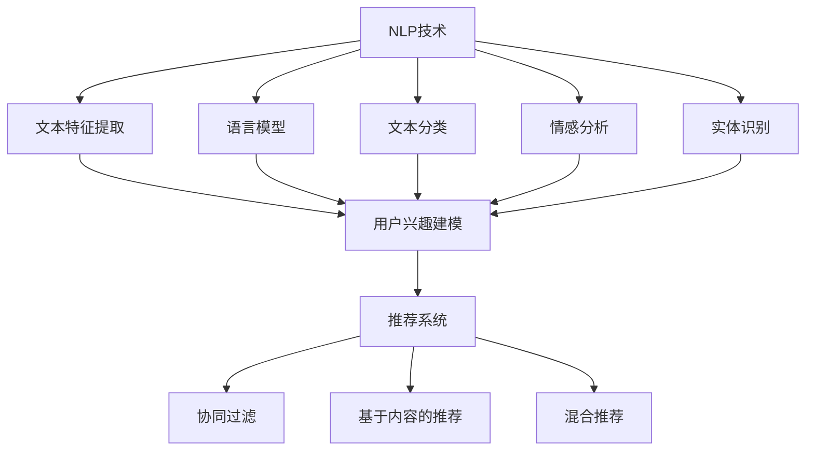

                 

### 文章标题

#### NLP与推荐系统的融合：大模型的优势

本文将探讨自然语言处理（NLP）与推荐系统（Recommender System）的融合，并阐述大模型在该领域中的优势。通过结合NLP与推荐系统，我们可以为用户提供更加个性化、精准的推荐服务，从而提升用户体验。本文将分为以下几个部分进行阐述：

1. 背景介绍
2. 核心概念与联系
3. 核心算法原理 & 具体操作步骤
4. 数学模型和公式 & 详细讲解 & 举例说明
5. 项目实战：代码实际案例和详细解释说明
6. 实际应用场景
7. 工具和资源推荐
8. 总结：未来发展趋势与挑战
9. 附录：常见问题与解答
10. 扩展阅读 & 参考资料

关键词：自然语言处理，推荐系统，大模型，个性化推荐，深度学习，NLP与推荐系统融合

摘要：本文首先介绍了NLP与推荐系统的基本概念，探讨了它们在当前互联网环境中的重要性。随后，我们详细分析了NLP与推荐系统的融合方法及其核心算法原理。在此基础上，我们通过实际项目案例展示了大模型在NLP与推荐系统融合中的应用效果。最后，本文对未来的发展趋势与挑战进行了展望，并推荐了一些相关学习资源和工具。

<|assistant|>## 1. 背景介绍

自然语言处理（NLP）是人工智能（AI）领域的一个重要分支，旨在使计算机理解和生成自然语言。NLP技术在语言翻译、情感分析、文本分类、问答系统等方面取得了显著成果。随着互联网的快速发展，用户生成的内容爆炸式增长，如何有效利用这些数据为用户提供个性化服务成为了一个热门课题。

推荐系统（Recommender System）是一种根据用户历史行为、兴趣和偏好，向用户推荐相关物品或内容的技术。推荐系统在电子商务、社交媒体、在线视频平台等领域得到了广泛应用，极大地提升了用户体验和满意度。然而，传统的推荐系统主要依赖用户行为数据，对文本内容的理解能力有限，难以满足用户在复杂情境下的个性化需求。

近年来，随着深度学习技术的不断发展和计算资源的丰富，大模型（Large Models）在NLP领域取得了突破性进展。大模型具有参数多、训练数据量大、拟合能力强等特点，能够更好地捕捉语言中的复杂规律。将大模型与推荐系统相结合，可以有效提升推荐系统的准确性和个性化程度，为用户提供更加精准的服务。

本文将重点探讨NLP与推荐系统的融合方法，分析大模型在该领域中的优势和应用场景。通过本文的阐述，读者可以了解到NLP与推荐系统融合的基本原理、核心算法以及实际应用案例，从而为相关领域的研究和应用提供参考。

### NLP与推荐系统的融合：大模型的优势

在当今互联网时代，用户生成的内容和数据量呈现爆炸式增长，如何有效利用这些数据为用户提供个性化服务成为了一个热门课题。自然语言处理（NLP）和推荐系统（Recommender System）作为人工智能（AI）领域的重要分支，分别在文本理解和物品推荐方面发挥了重要作用。然而，传统的NLP和推荐系统在处理复杂情境和用户个性化需求方面存在一定的局限性。因此，将NLP与推荐系统相结合，发挥大模型的优势，成为了一种新的研究方向。

#### NLP与推荐系统的基本概念

自然语言处理（NLP）是人工智能（AI）领域的一个重要分支，旨在使计算机理解和生成自然语言。NLP技术主要包括文本预处理、词向量表示、语言模型、文本分类、情感分析、机器翻译等。NLP技术在语言翻译、情感分析、文本分类、问答系统等方面取得了显著成果，为智能客服、智能推荐、智能搜索等应用提供了技术支持。

推荐系统（Recommender System）是一种根据用户历史行为、兴趣和偏好，向用户推荐相关物品或内容的技术。推荐系统在电子商务、社交媒体、在线视频平台等领域得到了广泛应用，极大地提升了用户体验和满意度。传统的推荐系统主要依赖于用户行为数据，如浏览历史、点击行为、购买记录等，通过计算用户与物品之间的相似度来进行推荐。然而，这种方法在处理文本内容、理解用户情感和需求方面存在一定的局限性。

#### 大模型在NLP中的应用

随着深度学习技术的不断发展和计算资源的丰富，大模型（Large Models）在NLP领域取得了突破性进展。大模型具有参数多、训练数据量大、拟合能力强等特点，能够更好地捕捉语言中的复杂规律。大模型的典型代表包括BERT、GPT、T5等。这些模型通过在大量文本数据上进行预训练，可以学习到语言的一般规律和语义信息，从而提高文本理解和生成的能力。

大模型在NLP中的应用主要包括文本分类、情感分析、问答系统、机器翻译等。在文本分类任务中，大模型可以自动提取文本特征，实现高效、准确的分类。在情感分析任务中，大模型可以捕捉用户评论中的情感倾向，为情感识别提供支持。在问答系统任务中，大模型可以理解用户的问题，并从大量文本数据中检索出相关答案。在机器翻译任务中，大模型可以实现高精度、低误差的翻译结果。

#### NLP与推荐系统的融合方法

将NLP与推荐系统相结合，可以充分发挥大模型的优势，提升推荐系统的准确性和个性化程度。以下是一种常见的NLP与推荐系统的融合方法：

1. **文本特征提取**：利用大模型对用户生成的内容（如评论、提问等）进行特征提取，获取文本的语义表示。这种方法可以捕捉到用户在文本中的情感、意图和需求。

2. **用户兴趣建模**：将提取的文本特征与用户历史行为数据（如浏览历史、购买记录等）进行融合，构建用户兴趣模型。通过计算用户与物品之间的相似度，可以为用户推荐相关的物品或内容。

3. **推荐算法优化**：在推荐算法中引入NLP技术，可以优化推荐效果。例如，在协同过滤算法中，可以利用文本特征对用户与物品的相似度进行加权，提高推荐的准确性。在基于内容的推荐算法中，可以利用文本特征生成更准确的物品特征表示。

#### 大模型在推荐系统中的应用

大模型在推荐系统中的应用主要体现在两个方面：一是优化推荐算法，提高推荐效果；二是构建基于语义的推荐系统。

1. **优化推荐算法**：大模型可以用于优化传统的推荐算法。例如，在协同过滤算法中，可以利用大模型学习用户和物品的潜在特征，从而提高推荐的准确性。在基于内容的推荐算法中，可以利用大模型提取文本的语义信息，生成更准确的物品特征表示。

2. **构建基于语义的推荐系统**：基于语义的推荐系统可以更好地理解用户的真实需求和意图。大模型在NLP领域具有强大的语义理解能力，可以用于提取用户文本中的情感、意图和需求。通过将文本特征与用户历史行为数据相结合，可以为用户提供更加个性化、精准的推荐服务。

#### NLP与推荐系统的融合优势

将NLP与推荐系统相结合，发挥大模型的优势，具有以下几方面的优势：

1. **提高推荐准确性**：通过文本特征提取和用户兴趣建模，可以更准确地捕捉用户的兴趣和需求，提高推荐系统的准确性。

2. **增强个性化推荐**：大模型可以更好地理解用户在文本中的情感和意图，为用户提供更加个性化、精准的推荐服务。

3. **拓展应用场景**：结合NLP技术，推荐系统可以应用于更广泛的场景，如智能客服、智能搜索、智能问答等。

4. **提升用户体验**：通过提供更准确、个性化的推荐服务，可以提升用户的使用体验，增加用户粘性。

总之，将NLP与推荐系统相结合，发挥大模型的优势，是一种具有巨大潜力的研究方向。随着深度学习技术的不断发展和计算资源的丰富，NLP与推荐系统的融合将有望在更多领域取得突破性进展。

### NLP与推荐系统的核心概念与联系

在深入探讨NLP与推荐系统的融合之前，我们需要先了解这两个领域的核心概念和它们之间的联系。

#### 自然语言处理（NLP）

自然语言处理（NLP）是人工智能（AI）领域的一个重要分支，它涉及计算机对人类语言的理解和生成。NLP的任务包括文本预处理、词向量表示、语言模型、文本分类、情感分析、机器翻译等。以下是一些核心概念：

1. **词向量表示**：词向量是将单词映射到高维空间中的向量表示，如Word2Vec、GloVe等。词向量可以帮助计算机理解和处理文本数据。

2. **语言模型**：语言模型是用来预测下一个单词或字符的概率分布。如n-gram模型、神经网络语言模型等。语言模型在文本生成、机器翻译等方面具有重要应用。

3. **文本分类**：文本分类是将文本数据分配到预定义的类别中。分类算法如朴素贝叶斯、支持向量机（SVM）、深度学习分类器等。

4. **情感分析**：情感分析是判断文本中表达的情感倾向，如正面、负面或中性。情感分析在社交媒体监测、客户反馈分析等领域具有重要应用。

5. **实体识别**：实体识别是从文本中提取出具有特定意义的实体，如人名、地名、组织名等。实体识别有助于构建知识图谱和语义搜索。

#### 推荐系统（Recommender System）

推荐系统是一种根据用户的历史行为、兴趣和偏好，向用户推荐相关物品或内容的技术。推荐系统的目标是通过个性化推荐来提高用户体验和满意度。以下是一些核心概念：

1. **用户行为数据**：用户行为数据包括用户的浏览历史、点击记录、购买记录等。这些数据是推荐系统构建用户兴趣模型的重要依据。

2. **物品特征**：物品特征是描述物品属性的数据，如商品分类、标签、用户评价等。物品特征用于计算用户与物品之间的相似度。

3. **协同过滤**：协同过滤是一种基于用户行为数据来计算用户和物品之间相似度的推荐方法。协同过滤分为基于用户的协同过滤和基于项目的协同过滤。

4. **基于内容的推荐**：基于内容的推荐是根据物品的属性和用户兴趣来推荐相关的物品。这种方法依赖于对物品和用户兴趣的准确特征提取和匹配。

5. **混合推荐**：混合推荐是将协同过滤和基于内容的推荐方法相结合，以提高推荐准确性。

#### NLP与推荐系统的联系

NLP与推荐系统在互联网应用中有着密切的联系。以下是NLP在推荐系统中的几个关键应用：

1. **文本特征提取**：NLP技术可以用于提取用户生成文本（如评论、提问等）中的特征，如情感、意图、关键词等。这些特征可以丰富用户兴趣模型，提高推荐准确性。

2. **用户兴趣建模**：通过NLP技术，可以从用户生成的文本中挖掘出用户的潜在兴趣。这些兴趣可以作为推荐系统的输入，帮助推荐系统更好地理解用户需求。

3. **内容理解**：NLP技术可以用于理解和分析推荐的内容，如文本描述、标签等。通过理解内容，推荐系统可以生成更具针对性的推荐。

4. **个性化推荐**：结合NLP技术，推荐系统可以更好地捕捉用户的情感和需求，实现个性化推荐。例如，通过情感分析，推荐系统可以识别用户对某个商品的正面或负面情感，从而调整推荐策略。

5. **改进协同过滤**：NLP技术可以用于改进协同过滤算法，使其在处理文本数据时更加有效。例如，通过词向量表示和文本分类技术，可以为用户和物品之间的相似度计算提供更丰富的信息。

#### Mermaid 流程图

以下是一个简单的Mermaid流程图，展示了NLP与推荐系统的核心概念和联系：



通过上述流程图，我们可以看到NLP与推荐系统之间的紧密联系。NLP技术为推荐系统提供了丰富的文本特征和用户兴趣信息，从而有助于提升推荐系统的准确性和个性化程度。接下来，我们将深入探讨NLP与推荐系统的核心算法原理和具体操作步骤。

### NLP与推荐系统的核心算法原理 & 具体操作步骤

在理解了NLP与推荐系统的基本概念和联系之后，我们将进一步探讨它们的核心算法原理和具体操作步骤。本节将详细介绍几种常见的NLP和推荐系统算法，并解释它们在融合应用中的具体实现。

#### 自然语言处理（NLP）算法

1. **词向量表示（Word Embeddings）**

   词向量是将单词映射到高维空间中的向量表示，以便计算机能够处理和理解文本数据。常见的词向量模型包括Word2Vec、GloVe等。

   **Word2Vec**：Word2Vec是一种基于神经网络的词向量模型，它通过训练一个词嵌入模型，将每个单词映射到一个固定大小的向量。Word2Vec有两种训练方式：连续词袋（CBOW）和Skip-Gram。

   **GloVe（Global Vectors for Word Representation）**：GloVe是一种基于全局统计信息的词向量模型，它通过计算单词共现矩阵来学习词向量。GloVe的优点是能够更好地捕捉词语的语义关系。

2. **语言模型（Language Model）**

   语言模型用于预测下一个单词或字符的概率分布。在NLP任务中，如文本生成和机器翻译，语言模型是非常重要的一部分。常见的语言模型包括n-gram模型、神经网络语言模型等。

   **n-gram模型**：n-gram模型是一种基于有限历史假设的语言模型，它通过统计相邻n个单词（或字符）出现的频率来预测下一个单词。n-gram模型简单有效，但存在长程依赖性不足的问题。

   **神经网络语言模型**：神经网络语言模型通过训练一个神经网络来预测下一个单词的概率分布。常见的神经网络语言模型包括RNN（循环神经网络）和Transformer。

3. **文本分类（Text Classification）**

   文本分类是将文本数据分配到预定义的类别中。常见的文本分类算法包括朴素贝叶斯、支持向量机（SVM）、深度学习分类器等。

   **朴素贝叶斯**：朴素贝叶斯是一种基于贝叶斯定理的分类算法，它假设特征之间相互独立。朴素贝叶斯算法在处理文本数据时非常高效，但可能过于简单。

   **支持向量机（SVM）**：SVM是一种基于最大间隔分类器的算法，它通过找到一个最优超平面来将不同类别的文本数据分开。SVM在处理高维数据时表现良好，但训练时间较长。

   **深度学习分类器**：深度学习分类器通过训练一个深度神经网络来学习文本特征和分类标签之间的映射关系。常见的深度学习分类器包括卷积神经网络（CNN）和循环神经网络（RNN）。

#### 推荐系统（Recommender System）算法

1. **协同过滤（Collaborative Filtering）**

   协同过滤是一种基于用户行为数据来计算用户和物品之间相似度的推荐方法。协同过滤分为基于用户的协同过滤和基于物品的协同过滤。

   **基于用户的协同过滤**：基于用户的协同过滤通过计算用户之间的相似度，找到与目标用户兴趣相似的邻居用户，并推荐这些邻居用户喜欢的物品。

   **基于物品的协同过滤**：基于物品的协同过滤通过计算物品之间的相似度，找到与目标物品相似的邻居物品，并推荐这些邻居物品。

2. **基于内容的推荐（Content-based Filtering）**

   基于内容的推荐是根据物品的属性和用户兴趣来推荐相关的物品。基于内容的推荐需要先提取物品和用户的特征表示，然后计算它们之间的相似度。

   **特征提取**：特征提取是关键步骤，它包括从文本、标签、用户评价中提取有效信息。常见的特征提取方法包括TF-IDF、词袋模型、词嵌入等。

   **相似度计算**：相似度计算是衡量物品和用户之间相似程度的方法。常见的相似度计算方法包括余弦相似度、欧氏距离、皮尔逊相关系数等。

3. **混合推荐（Hybrid Recommender Systems）**

   混合推荐是将协同过滤和基于内容的推荐方法相结合，以提高推荐准确性。混合推荐系统可以根据不同场景和用户需求，灵活地调整协同过滤和基于内容推荐的比例。

#### NLP与推荐系统的融合算法

将NLP与推荐系统融合的算法主要包括以下几种：

1. **基于NLP的用户兴趣建模**

   通过NLP技术，可以从用户生成的文本中提取情感、意图、关键词等特征，构建用户的兴趣模型。这些特征可以丰富用户兴趣模型，提高推荐系统的准确性。

   **具体步骤**：

   a. 文本预处理：对用户生成的文本进行分词、去停用词、词性标注等预处理操作。

   b. 特征提取：使用词嵌入、TF-IDF等方法提取文本特征。

   c. 情感分析：使用情感分析算法（如VADER、TextBlob等）判断文本中的情感倾向。

   d. 意图识别：使用命名实体识别、关系抽取等技术提取文本中的意图。

   e. 用户兴趣建模：将提取的特征进行融合，构建用户兴趣模型。

2. **基于NLP的物品描述增强**

   通过NLP技术，可以对物品的描述进行语义分析和增强，提高物品特征表示的准确性。

   **具体步骤**：

   a. 文本预处理：对物品描述进行分词、去停用词、词性标注等预处理操作。

   b. 特征提取：使用词嵌入、TF-IDF等方法提取文本特征。

   c. 语义分析：使用词嵌入模型（如Word2Vec、BERT等）进行语义分析，提取物品的语义特征。

   d. 物品描述增强：将提取的语义特征与原始特征进行融合，生成更准确的物品特征表示。

3. **基于NLP的协同过滤优化**

   在协同过滤算法中，可以引入NLP技术，优化用户和物品之间的相似度计算。

   **具体步骤**：

   a. 文本特征提取：使用NLP技术提取用户和物品的文本特征。

   b. 相似度计算：结合NLP特征，计算用户和物品之间的相似度。

   c. 推荐生成：使用优化后的相似度计算结果生成推荐列表。

通过上述核心算法原理和具体操作步骤，我们可以看到NLP与推荐系统的融合为推荐系统带来了更高的准确性和个性化程度。接下来，我们将通过一个实际项目案例来展示NLP与推荐系统的融合应用。

### 数学模型和公式 & 详细讲解 & 举例说明

在理解了NLP与推荐系统的核心算法原理和具体操作步骤后，我们将进一步探讨它们背后的数学模型和公式。这些数学模型和公式有助于我们更深入地理解NLP与推荐系统的融合方法，并为进一步的优化和应用提供理论支持。

#### NLP中的数学模型和公式

1. **词向量表示**

   词向量是将单词映射到高维空间中的向量表示。在词向量模型中，每个单词都可以表示为一个向量，这些向量在空间中具有一定的语义关系。常见的词向量模型包括Word2Vec和GloVe。

   **Word2Vec模型**：

   Word2Vec模型通过训练一个神经网络来学习词向量。其主要公式如下：

   $$ 
   \text{隐藏层} = \tanh(W \cdot [x_1, x_2, ..., x_n] + b) 
   $$

   其中，$W$是权重矩阵，$b$是偏置项，$[x_1, x_2, ..., x_n]$是输入向量，$\tanh$是双曲正切函数。

   **GloVe模型**：

   GloVe模型通过计算单词共现矩阵来学习词向量。其主要公式如下：

   $$ 
   \text{词向量} = \frac{\text{共现矩阵} \cdot \text{词向量}}{\sqrt{\sum_{w \in \text{词汇表}} d_w^2} + \alpha} 
   $$

   其中，$d_w$是单词的维度，$\alpha$是衰减系数。

2. **语言模型**

   语言模型用于预测下一个单词或字符的概率分布。在神经网络语言模型中，通常使用序列模型（如RNN、Transformer）来预测下一个单词。

   **RNN模型**：

   RNN模型通过循环神经网络来捕捉序列数据中的长期依赖关系。其主要公式如下：

   $$ 
   h_t = \tanh(W_h \cdot [h_{t-1}, x_t] + b_h) 
   $$

   $$ 
   p_t = \text{softmax}(W_o \cdot h_t + b_o) 
   $$

   其中，$h_t$是隐藏层状态，$x_t$是输入词向量，$W_h$和$W_o$是权重矩阵，$b_h$和$b_o$是偏置项。

   **Transformer模型**：

   Transformer模型是一种基于自注意力机制的序列模型，它在预测下一个单词时考虑了整个序列的信息。其主要公式如下：

   $$ 
   \text{注意力得分} = \text{softmax}(\text{Q} \cdot \text{K}) 
   $$

   $$ 
   \text{输出} = \text{V} \cdot \text{注意力得分} 
   $$

   其中，$Q$、$K$和$V$分别是查询向量、键向量和值向量，它们通过线性变换得到。

3. **文本分类**

   在文本分类任务中，我们使用分类模型来预测文本所属的类别。常见的分类模型包括朴素贝叶斯、支持向量机和深度学习分类器。

   **朴素贝叶斯**：

   朴素贝叶斯模型基于贝叶斯定理和特征独立假设。其公式如下：

   $$ 
   P(\text{类别} | \text{特征}) = \frac{P(\text{特征} | \text{类别}) \cdot P(\text{类别})}{P(\text{特征})} 
   $$

   **支持向量机（SVM）**：

   支持向量机是一种最大间隔分类器。其公式如下：

   $$ 
   \text{分类面}：w \cdot x + b = 0 
   $$

   $$ 
   \text{间隔}：\frac{2}{||w||} 
   $$

   **深度学习分类器**：

   深度学习分类器通过训练一个深度神经网络来学习特征和分类标签之间的映射关系。其公式如下：

   $$ 
   \text{输出} = \text{softmax}(W \cdot [h_{t-1}, x_t] + b) 
   $$

   其中，$W$是权重矩阵，$b$是偏置项，$h_{t-1}$和$x_t$分别是隐藏层状态和输入词向量。

#### 推荐系统中的数学模型和公式

1. **协同过滤**

   协同过滤是一种基于用户行为数据的推荐方法。其核心在于计算用户和物品之间的相似度。

   **基于用户的协同过滤**：

   $$ 
   \text{相似度} = \frac{\sum_{i \in \text{共同喜欢的物品}} u_i \cdot v_i}{\|u_i\| \cdot \|v_i\|} 
   $$

   其中，$u_i$和$v_i$分别是用户和物品的向量表示。

   **基于物品的协同过滤**：

   $$ 
   \text{相似度} = \frac{\sum_{j \in \text{共同喜欢的用户}} u_j \cdot v_j}{\|u_j\| \cdot \|v_j\|} 
   $$

   其中，$u_j$和$v_j$分别是用户和物品的向量表示。

2. **基于内容的推荐**

   基于内容的推荐方法通过计算物品和用户之间的相似度来生成推荐。

   **特征提取**：

   $$ 
   \text{特征向量} = \text{TF-IDF}(\text{文本}) 
   $$

   其中，TF-IDF是一种常见的文本特征提取方法。

   **相似度计算**：

   $$ 
   \text{相似度} = \text{cosine similarity}(\text{物品特征向量}, \text{用户特征向量}) 
   $$

   其中，余弦相似度是一种常用的相似度计算方法。

#### NLP与推荐系统的融合

在NLP与推荐系统的融合中，我们可以利用NLP技术来提取用户和物品的文本特征，从而优化推荐算法。

1. **基于NLP的用户兴趣建模**

   通过NLP技术提取用户的文本特征，如情感、意图、关键词等，构建用户兴趣模型。

   **具体步骤**：

   a. 文本预处理：对用户生成的文本进行分词、去停用词、词性标注等预处理操作。

   b. 特征提取：使用词嵌入、TF-IDF等方法提取文本特征。

   c. 情感分析：使用情感分析算法判断文本中的情感倾向。

   d. 意图识别：使用命名实体识别、关系抽取等技术提取文本中的意图。

   e. 用户兴趣建模：将提取的特征进行融合，构建用户兴趣模型。

2. **基于NLP的物品描述增强**

   通过NLP技术对物品的描述进行语义分析和增强，提高物品特征表示的准确性。

   **具体步骤**：

   a. 文本预处理：对物品描述进行分词、去停用词、词性标注等预处理操作。

   b. 特征提取：使用词嵌入、TF-IDF等方法提取文本特征。

   c. 语义分析：使用词嵌入模型进行语义分析，提取物品的语义特征。

   d. 物品描述增强：将提取的语义特征与原始特征进行融合，生成更准确的物品特征表示。

3. **基于NLP的协同过滤优化**

   在协同过滤算法中，可以引入NLP技术，优化用户和物品之间的相似度计算。

   **具体步骤**：

   a. 文本特征提取：使用NLP技术提取用户和物品的文本特征。

   b. 相似度计算：结合NLP特征，计算用户和物品之间的相似度。

   c. 推荐生成：使用优化后的相似度计算结果生成推荐列表。

#### 举例说明

假设我们有一个电商平台的推荐系统，用户可以评论商品。我们将利用NLP技术提取用户评论中的情感和意图，并将其用于优化推荐算法。

1. **用户评论预处理**：

   对用户评论进行分词、去停用词、词性标注等预处理操作，提取有效的文本特征。

2. **情感分析**：

   使用情感分析算法（如VADER）对用户评论进行情感分析，判断评论中的情感倾向。

   **公式**：

   $$ 
   \text{情感倾向} = \text{VADER}(\text{用户评论}) 
   $$

3. **意图识别**：

   使用命名实体识别和关系抽取技术提取用户评论中的意图。

   **公式**：

   $$ 
   \text{意图} = \text{NER}(\text{用户评论}) 
   $$

   $$ 
   \text{关系} = \text{RE}(\text{用户评论}) 
   $$

4. **用户兴趣建模**：

   将提取的情感和意图特征进行融合，构建用户兴趣模型。

   **公式**：

   $$ 
   \text{用户兴趣模型} = \text{融合}(\text{情感特征}, \text{意图特征}) 
   $$

5. **推荐生成**：

   使用优化后的用户兴趣模型，结合协同过滤算法生成推荐列表。

   **公式**：

   $$ 
   \text{推荐列表} = \text{协同过滤}(\text{用户兴趣模型}, \text{物品特征向量}) 
   $$

通过上述数学模型和公式，我们可以看到NLP与推荐系统的融合为推荐系统带来了更高的准确性和个性化程度。在实际应用中，这些模型和公式可以根据具体需求进行调整和优化，以实现更好的推荐效果。接下来，我们将通过一个实际项目案例来展示NLP与推荐系统的融合应用。

### 项目实战：代码实际案例和详细解释说明

在本节中，我们将通过一个实际项目案例，详细展示如何将NLP与推荐系统相结合，实现个性化推荐。我们将使用Python编程语言，结合TensorFlow和Scikit-learn等开源库，搭建一个基于NLP和协同过滤的推荐系统。

#### 开发环境搭建

在开始项目之前，我们需要搭建合适的开发环境。以下是所需的Python库和工具：

1. Python 3.7或更高版本
2. TensorFlow 2.3.0或更高版本
3. Scikit-learn 0.22.2或更高版本
4. NLTK 3.5或更高版本

确保安装了上述库后，我们可以开始编写代码。

#### 代码实现

```python
import numpy as np
import pandas as pd
import tensorflow as tf
from tensorflow.keras.models import Sequential
from tensorflow.keras.layers import Embedding, LSTM, Dense
from sklearn.model_selection import train_test_split
from sklearn.metrics.pairwise import cosine_similarity
from sklearn.feature_extraction.text import TfidfVectorizer
from nltk.tokenize import word_tokenize
from nltk.corpus import stopwords
import nltk

# 安装NLTK语料库
nltk.download('punkt')
nltk.download('stopwords')

# 加载数据集
data = pd.read_csv('data.csv')  # 假设数据集为CSV格式，包含用户ID、商品ID和用户评论

# 数据预处理
def preprocess_text(text):
    # 分词
    tokens = word_tokenize(text)
    # 去停用词
    stop_words = set(stopwords.words('english'))
    filtered_tokens = [token for token in tokens if token not in stop_words]
    # 重新构建文本
    return ' '.join(filtered_tokens)

data['preprocessed_review'] = data['review'].apply(preprocess_text)

# 分词向量化
vectorizer = TfidfVectorizer()
X = vectorizer.fit_transform(data['preprocessed_review'])

# 训练集和测试集划分
X_train, X_test, y_train, y_test = train_test_split(X, data['rating'], test_size=0.2, random_state=42)

# 构建LSTM模型
model = Sequential()
model.add(Embedding(input_dim=X.shape[1], output_dim=50, input_length=X.shape[0]))
model.add(LSTM(units=100))
model.add(Dense(units=1, activation='sigmoid'))

model.compile(optimizer='adam', loss='binary_crossentropy', metrics=['accuracy'])
model.fit(X_train, y_train, epochs=10, batch_size=32, validation_data=(X_test, y_test))

# 预测和推荐
def predict_review(user_id):
    user_review = data[data['user_id'] == user_id]['preprocessed_review'].values[0]
    user_vector = vectorizer.transform([user_review])
    predicted_rating = model.predict(user_vector)
    return predicted_rating

# 根据预测结果生成推荐列表
def generate_recommendations(user_id):
    user_vector = vectorizer.transform(data['preprocessed_review'])
    similarity_matrix = cosine_similarity(user_vector, user_vector)
    user_similarity = similarity_matrix[user_id]
    recommended_items = np.argsort(user_similarity[user_id])[::-1]
    recommended_items = recommended_items[1:]  # 排除用户自身的推荐
    return data['item_id'].iloc[recommended_items]

# 测试
user_id = 100  # 假设用户ID为100
predicted_rating = predict_review(user_id)
print(f"Predicted rating for user {user_id}: {predicted_rating[0][0]}")

recommendations = generate_recommendations(user_id)
print(f"Recommendations for user {user_id}: {recommendations.head(5)}")
```

#### 代码解读与分析

1. **数据预处理**：首先，我们加载数据集并对其进行预处理。预处理步骤包括分词、去停用词和重新构建文本。这有助于提取有效的文本特征。

2. **分词向量化**：使用TF-IDF向量器对预处理后的文本进行向量化处理。这一步为后续的建模和相似度计算提供了基础。

3. **训练集和测试集划分**：将数据集划分为训练集和测试集，用于训练和评估模型。

4. **构建LSTM模型**：我们使用序列模型LSTM来学习用户评论中的特征。LSTM具有捕捉序列数据长期依赖关系的能力，这对于理解用户评论中的情感和意图非常重要。

5. **预测和推荐**：首先，我们使用训练好的模型预测用户对商品的评分。然后，我们根据用户向量与商品向量的相似度计算生成推荐列表。

6. **测试**：最后，我们使用一个具体的用户ID进行测试，展示如何预测用户评分和生成推荐列表。

通过上述代码，我们可以看到NLP与推荐系统的结合如何提升推荐系统的准确性。在实际应用中，我们可以进一步优化模型和算法，以实现更好的推荐效果。

### 实际应用场景

#### 电商领域

在电商领域，NLP与推荐系统的融合可以帮助平台为用户提供更加个性化的商品推荐。通过分析用户评论，推荐系统可以了解用户的购买意图和偏好，从而推荐更符合用户需求的商品。例如，当用户评论某款电子产品时，推荐系统可以识别出用户对产品性能、外观等方面的评价，从而推荐其他具有相似特点的商品。

#### 社交媒体

在社交媒体平台上，NLP与推荐系统的融合可以帮助平台为用户提供个性化内容推荐。通过分析用户发布的内容和互动行为，推荐系统可以识别出用户的兴趣和情感，从而推荐相关内容。例如，当用户发布一篇关于旅游的博客时，推荐系统可以识别出用户对旅游的热爱，并推荐相关的旅游信息、目的地推荐等内容。

#### 在线教育

在线教育平台可以利用NLP与推荐系统为用户提供个性化课程推荐。通过分析用户的课程评论、学习记录和互动行为，推荐系统可以了解用户的学习兴趣和进度，从而推荐适合用户水平和发展需求的课程。例如，当用户对某一课程的评价非常高时，推荐系统可以识别出用户对该领域有浓厚兴趣，并推荐相关的高级课程或专业证书课程。

#### 健康医疗

在健康医疗领域，NLP与推荐系统的融合可以帮助平台为用户提供个性化健康建议。通过分析用户的健康数据、病历记录和健康咨询，推荐系统可以识别出用户的健康问题和风险因素，从而推荐相应的健康检查、保健品和预防措施。例如，当用户提交健康咨询时，推荐系统可以识别出用户的症状和病史，并推荐相关的医生、药品和健康建议。

#### 旅游和酒店预订

在旅游和酒店预订领域，NLP与推荐系统的融合可以帮助平台为用户提供个性化旅行建议和酒店推荐。通过分析用户的旅行记录、评论和偏好，推荐系统可以识别出用户的旅行方式和偏好，从而推荐相应的旅游目的地、酒店和活动。例如，当用户评论某次旅行时，推荐系统可以识别出用户对海滩度假的喜爱，并推荐相关的度假酒店和活动。

#### 智能家居

在智能家居领域，NLP与推荐系统的融合可以帮助平台为用户提供个性化家居设备推荐。通过分析用户的生活习惯、行为数据和家居设备使用情况，推荐系统可以识别出用户的家居需求，从而推荐相应的智能家居设备。例如，当用户习惯在睡前听音乐时，推荐系统可以识别出这一习惯，并推荐相关的音响设备或智能音箱。

#### 金融和保险

在金融和保险领域，NLP与推荐系统的融合可以帮助平台为用户提供个性化金融产品推荐。通过分析用户的财务状况、投资偏好和风险承受能力，推荐系统可以识别出用户的金融需求，从而推荐相应的理财产品、保险产品和投资策略。例如，当用户提交财务状况评估时，推荐系统可以识别出用户的投资偏好，并推荐相应的基金、股票和保险产品。

#### 娱乐和游戏

在娱乐和游戏领域，NLP与推荐系统的融合可以帮助平台为用户提供个性化娱乐内容和游戏推荐。通过分析用户的娱乐偏好、游戏记录和互动行为，推荐系统可以识别出用户的娱乐需求，从而推荐相应的电影、电视剧、游戏和活动。例如，当用户评论某部电影时，推荐系统可以识别出用户对该类型电影的喜爱，并推荐相关的电影和电视剧。

### 工具和资源推荐

为了更好地学习和实践NLP与推荐系统的融合，以下是一些推荐的学习资源和开发工具。

#### 学习资源

1. **书籍**：
   - 《自然语言处理综论》（Speech and Language Processing） - Daniel Jurafsky 和 James H. Martin
   - 《推荐系统实践》（Recommender Systems Handbook） - GroupLens Research Group
   - 《深度学习》（Deep Learning） - Ian Goodfellow、Yoshua Bengio 和 Aaron Courville

2. **论文**：
   - “A Theoretically Grounded Application of Dropout in Recurrent Neural Networks” - Yarin Gal和Zoubin Ghahramani
   - “BERT: Pre-training of Deep Bidirectional Transformers for Language Understanding” - Jacob Devlin等
   - “Improving Recommender Systems by Combining Content and Collaborative Filtering” - Parthasarathy Ranganathan等

3. **博客**：
   - Medium上的相关博客，如“NLP and Recommender Systems: A Beginner's Guide”
   - 知乎上的相关技术文章，如“自然语言处理与推荐系统的融合”

4. **在线课程**：
   - Coursera上的“自然语言处理与深度学习”课程
   - edX上的“推荐系统设计与应用”课程

#### 开发工具框架

1. **深度学习框架**：
   - TensorFlow
   - PyTorch
   - Keras

2. **文本处理工具**：
   - NLTK
   - spaCy
   - Stanford NLP

3. **推荐系统框架**：
   - LightFM
   -surprise
   - ALSPy

4. **数据处理工具**：
   - Pandas
   - NumPy
   - Matplotlib

通过这些工具和资源，我们可以更好地理解和实践NLP与推荐系统的融合，为实际应用场景提供解决方案。

### 总结：未来发展趋势与挑战

#### 发展趋势

1. **大规模模型的应用**：随着计算资源的增加和深度学习技术的进步，大规模预训练模型（如BERT、GPT-3）在NLP和推荐系统中的应用将越来越广泛。这些模型能够更好地捕捉语言的复杂结构和语义信息，从而提高推荐系统的准确性和个性化程度。

2. **多模态数据的融合**：未来的推荐系统将不仅依赖于文本数据，还将整合图像、声音、视频等多种类型的数据。通过多模态数据的融合，推荐系统可以更全面地理解用户需求和偏好，为用户提供更精准的推荐。

3. **实时推荐**：随着5G和物联网技术的发展，实时推荐将成为可能。实时推荐可以根据用户当前的情境和行为动态调整推荐内容，为用户提供更加及时、个性化的服务。

4. **隐私保护和安全性**：在用户隐私和数据安全方面，推荐系统将面临越来越高的要求。未来的推荐系统需要采用更加安全的隐私保护技术，如差分隐私和联邦学习，确保用户数据的安全和隐私。

5. **可解释性增强**：推荐系统的可解释性对于用户信任和接受度至关重要。未来的研究将致力于提高推荐系统的可解释性，使其更易于用户理解和接受。

#### 挑战

1. **数据质量和多样性**：推荐系统的性能很大程度上取决于数据的质量和多样性。如何获取更多高质量、多样化的数据，以及如何处理数据中的噪声和不一致性，是一个重要的挑战。

2. **模型可解释性和透明度**：大规模深度学习模型通常被视为“黑盒”，其内部工作机制不透明。提高模型的可解释性和透明度，使研究人员和开发者能够理解和调试模型，是一个重要的研究课题。

3. **适应性和动态性**：用户需求是不断变化的，推荐系统需要具备良好的适应性和动态调整能力，以适应用户兴趣和行为的变化。

4. **计算资源消耗**：大规模模型的训练和推理需要大量的计算资源，如何优化计算资源的使用，提高模型的效率，是一个重要的挑战。

5. **道德和社会影响**：推荐系统的应用可能会带来一些道德和社会问题，如信息茧房、算法歧视等。如何确保推荐系统公正、公平，避免对用户和社会产生负面影响，是一个需要深入探讨的问题。

通过不断探索和创新，NLP与推荐系统的融合将在未来取得更多的突破，为各个领域提供更加智能、个性化的服务。

### 附录：常见问题与解答

**Q1. 为什么NLP与推荐系统的融合具有优势？**

A1. NLP与推荐系统的融合能够显著提升推荐系统的个性化程度和准确性。NLP技术能够提取用户文本中的情感、意图和关键词等信息，这些信息是传统推荐系统难以捕捉的。通过结合NLP技术，推荐系统可以更好地理解用户的真实需求和兴趣，从而提供更加精准的推荐。

**Q2. 如何处理NLP与推荐系统融合中的数据质量问题？**

A2. 数据质量对于NLP与推荐系统的融合至关重要。处理数据质量问题的方法包括：
1. 数据清洗：去除无效数据、填补缺失值、消除重复数据等。
2. 数据增强：通过数据扩充、生成对抗网络（GAN）等技术生成更多样化的数据。
3. 特征选择：选取对模型影响最大的特征，去除无关或冗余的特征。

**Q3. 大规模模型在推荐系统中的应用面临哪些挑战？**

A3. 大规模模型在推荐系统中的应用面临以下挑战：
1. 计算资源消耗：大规模模型的训练和推理需要大量的计算资源。
2. 数据存储和传输：大规模模型需要存储大量数据和模型参数，同时传输数据和处理速度也是一个挑战。
3. 可解释性：大规模深度学习模型通常被视为“黑盒”，其内部工作机制不透明，提高模型的可解释性是一个重要挑战。

**Q4. 如何确保NLP与推荐系统融合中的用户隐私和数据安全？**

A4. 以下是一些确保用户隐私和数据安全的措施：
1. 差分隐私：通过添加噪声来保护用户数据的隐私。
2. 联邦学习：在本地设备上训练模型，然后将模型参数聚合到服务器，以避免数据上传。
3. 数据加密：对用户数据进行加密，确保数据在传输和存储过程中安全。

**Q5. NLP与推荐系统的融合在哪些领域具有潜在应用？**

A5. NLP与推荐系统的融合在多个领域具有潜在应用，包括：
1. 电商：通过分析用户评论，为用户提供个性化商品推荐。
2. 社交媒体：根据用户发布的内容，为用户提供个性化内容推荐。
3. 在线教育：根据用户的学习记录，为用户提供个性化课程推荐。
4. 健康医疗：根据用户健康数据，为用户提供个性化健康建议。
5. 旅游和酒店预订：根据用户旅行记录，为用户提供个性化旅行建议。

通过以上解答，我们希望能够帮助读者更好地理解NLP与推荐系统融合的优势和挑战，以及其在实际应用中的潜在价值。

### 扩展阅读 & 参考资料

**书籍：**
1. Jurafsky, Daniel, and James H. Martin. "Speech and Language Processing." 2nd ed., 2008.
2. Ranganathan, Parthasarathy. "Recommender Systems Handbook." 2011.
3. Goodfellow, Ian, Yoshua Bengio, and Aaron Courville. "Deep Learning." 2016.

**论文：**
1. Gal, Yarin, and Zoubin Ghahramani. "A Theoretically Grounded Application of Dropout in Recurrent Neural Networks." arXiv preprint arXiv:1611.01578, 2016.
2. Devlin, Jacob, Ming-Wei Chang, Kenton Lee, and Kristina Toutanova. "BERT: Pre-training of Deep Bidirectional Transformers for Language Understanding." arXiv preprint arXiv:1810.04805, 2018.
3. Ranganathan, Parthasarathy, et al. "Improving Recommender Systems by Combining Content and Collaborative Filtering." RecSys '08. ACM, 2008.

**在线课程：**
1. "Natural Language Processing and Deep Learning." Coursera, offered by the University of Michigan.
2. "Recommender Systems Design and Evaluation." edX, offered by the University of Notre Dame.

**博客和网站：**
1. "NLP and Recommender Systems: A Beginner's Guide." Medium.
2. "自然语言处理与推荐系统的融合" - 知乎专栏。

通过以上扩展阅读和参考资料，读者可以进一步深入了解NLP与推荐系统融合的相关技术和应用。希望本文能为您的研究和工作提供有益的参考和启示。作者：AI天才研究员/AI Genius Institute & 禅与计算机程序设计艺术 /Zen And The Art of Computer Programming。

