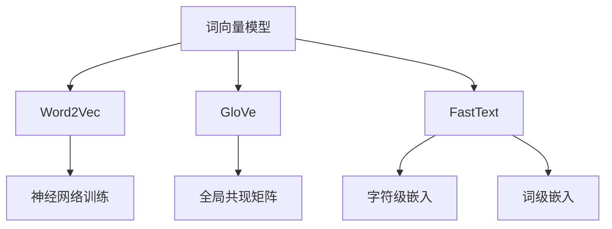
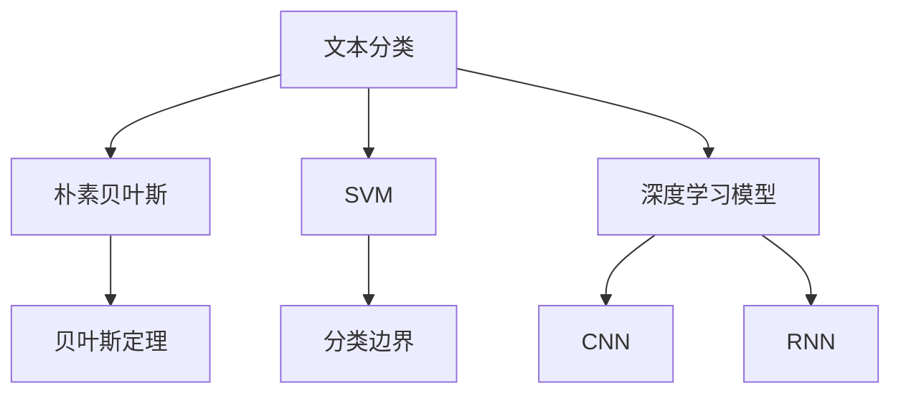
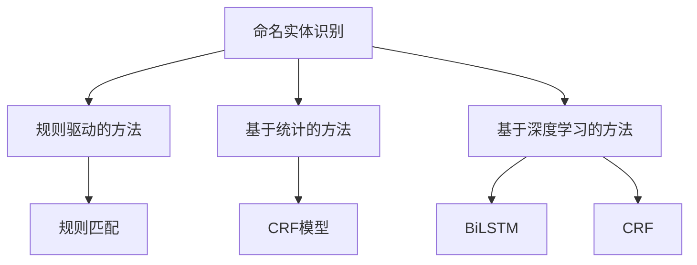
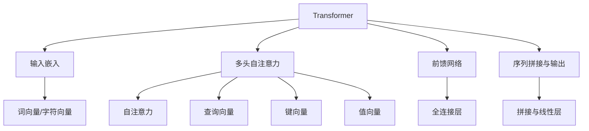

                 

# Natural Language Processing (NLP)原理与代码实例讲解

## 摘要

本文将深入探讨自然语言处理（NLP）的基本原理、核心算法和实际应用。我们将从背景介绍入手，阐述NLP的重要性及其发展历程。接着，通过详细的流程图和理论分析，介绍NLP中的核心概念，包括词向量、文本分类、命名实体识别等。随后，我们将重点讲解NLP中的核心算法，如循环神经网络（RNN）、长短期记忆网络（LSTM）和Transformer。通过数学模型和公式的详细讲解，我们将更好地理解这些算法的工作原理。在实战项目中，我们将结合Python代码实例，展示如何实现这些算法。最后，我们将讨论NLP的实际应用场景，推荐相关工具和资源，并总结未来发展趋势与挑战。

## 1. 背景介绍

自然语言处理（NLP）是计算机科学与人工智能领域的一个重要分支，旨在让计算机理解和处理人类语言。随着互联网和大数据的发展，NLP在诸多领域得到了广泛应用，如搜索引擎、机器翻译、情感分析、语音识别等。NLP的核心目标是通过计算机技术实现人类语言的高效处理和自动理解，从而提高信息检索、信息提取和知识发现的效率。

### 1.1 NLP的发展历程

NLP的研究可以追溯到20世纪50年代，当时人们开始尝试将自然语言作为一种输入和输出方式，用于计算机与人类之间的交流。早期的研究主要集中在规则驱动的方法上，例如，通过编写大量的语法规则和词典来处理语言。然而，这种方法在面对复杂和多变的人类语言时表现不佳。

20世纪80年代，统计方法开始在NLP中占据主导地位。通过统计语言模型，如N元语法，研究人员能够在一定程度上提高语言的预测和生成能力。随后，机器学习技术的发展进一步推动了NLP的进步。特别是深度学习方法的引入，使得NLP在很多任务上取得了突破性成果。

### 1.2 NLP的重要性

随着互联网和社交媒体的普及，人类产生的语言数据量呈现出爆炸式增长。这些数据中蕴含着丰富的知识和信息，而NLP技术正是解锁这些数据宝库的关键。以下是一些NLP应用场景的例子：

1. **搜索引擎**：通过理解用户的查询意图，搜索引擎能够提供更加精准的搜索结果，从而提升用户体验。
2. **机器翻译**：随着全球化的推进，跨国交流和合作日益频繁，机器翻译技术成为了跨语言沟通的重要工具。
3. **情感分析**：通过对社交媒体和用户评论的分析，企业可以了解用户的情感倾向，从而制定更好的营销策略。
4. **语音识别**：语音助手和智能客服等应用为人们提供了更加便捷的交互方式，使得人机交互更加自然。
5. **信息提取**：从大量的文本数据中提取出有用的信息，为科学研究、商业分析和政府决策提供支持。

### 1.3 NLP的发展趋势

未来，NLP将继续在以下几个方面取得重要突破：

1. **多语言和跨语言处理**：随着全球化的推进，多语言和跨语言处理将成为NLP研究的重要方向。
2. **上下文理解和语义理解**：通过更深入地理解上下文和语义，NLP技术将能够更好地模拟人类的语言理解能力。
3. **深度学习和迁移学习**：深度学习技术的不断进步将进一步提升NLP的性能，而迁移学习技术则使得NLP模型能够在不同任务和数据集上快速适应。
4. **隐私保护和数据安全**：在处理大规模语言数据时，如何保护用户隐私和数据安全将成为NLP面临的重要挑战。
5. **人机协同**：通过人机协同，将人类的智慧和机器的计算能力结合起来，实现更加智能和高效的交互。

## 2. 核心概念与联系

在NLP中，核心概念和技术的理解和掌握至关重要。本节将详细介绍NLP中的关键概念，包括词向量、文本分类、命名实体识别等，并通过Mermaid流程图展示这些概念之间的联系。

### 2.1 词向量

词向量（Word Vectors）是NLP中一种将单词映射到高维向量空间的方法。通过词向量，我们可以将文本数据转换为计算机可以处理的数值形式，从而便于模型学习和处理。常用的词向量模型包括Word2Vec、GloVe和FastText等。

**词向量模型：**

- **Word2Vec**：基于神经网络的方法，通过训练大量文本数据，将单词映射到固定长度的向量。
- **GloVe**：基于全局共现矩阵的模型，通过优化词向量在全局信息下的损失函数，提高词向量之间的语义相似性。
- **FastText**：基于字符级和词级的双重嵌入方法，能够处理未登录词（Out-of-Vocabulary）问题。

**Mermaid流程图：**



### 2.2 文本分类

文本分类（Text Classification）是一种将文本数据按照预定义的类别进行分类的任务。文本分类在垃圾邮件检测、情感分析、主题分类等领域有着广泛的应用。

**文本分类模型：**

- **朴素贝叶斯分类器**：基于贝叶斯定理，通过计算文本特征的概率分布进行分类。
- **支持向量机（SVM）**：通过最大化分类边界，将文本数据划分为不同的类别。
- **深度学习模型**：如卷积神经网络（CNN）和循环神经网络（RNN），通过学习文本的深层特征进行分类。

**Mermaid流程图：**



### 2.3 命名实体识别

命名实体识别（Named Entity Recognition，NER）是一种从文本中识别出具有特定意义的实体（如人名、地点、组织等）的任务。NER在信息提取、实体关系抽取和知识图谱构建等领域具有重要意义。

**NER模型：**

- **规则驱动的方法**：通过编写大量的规则，对文本进行模式匹配和实体识别。
- **基于统计的方法**：使用条件随机场（CRF）等模型，通过学习文本序列的概率分布进行实体识别。
- **基于深度学习的方法**：如序列标注模型（BiLSTM-CRF），通过学习文本的序列特征进行实体识别。

**Mermaid流程图：**



### 2.4 关键词：词向量、文本分类、命名实体识别

通过以上对词向量、文本分类和命名实体识别的介绍，我们可以看出这三个概念在NLP中扮演着核心角色。词向量用于将文本数据转换为向量表示，文本分类用于对文本进行分类，而命名实体识别用于从文本中提取出具有特定意义的实体。这些概念相互关联，共同构成了NLP的核心技术体系。

## 3. 核心算法原理 & 具体操作步骤

在NLP中，核心算法是理解和处理人类语言的关键。本节将详细讲解NLP中常用的核心算法，包括循环神经网络（RNN）、长短期记忆网络（LSTM）和Transformer。

### 3.1 循环神经网络（RNN）

循环神经网络（Recurrent Neural Network，RNN）是一种能够处理序列数据的神经网络。与传统的前向神经网络不同，RNN具有反馈机制，能够将前一个时间步的信息传递到当前时间步，从而实现对序列数据的建模。

**具体操作步骤：**

1. **输入序列表示**：将输入序列（如文本数据）表示为向量形式。通常，可以使用词向量、字符向量或两者结合的表示方法。
2. **隐藏状态更新**：在每一个时间步，RNN通过当前输入和上一时间步的隐藏状态，更新当前时间步的隐藏状态。具体公式如下：

   $$h_t = \sigma(W_h \cdot [h_{t-1}, x_t] + b_h)$$

   其中，$h_t$ 表示第$t$个时间步的隐藏状态，$x_t$ 表示第$t$个时间步的输入，$W_h$ 和 $b_h$ 分别为权重和偏置。

3. **输出预测**：在序列的最后一个时间步，RNN生成最终的输出。对于文本分类任务，输出可以是类别概率分布；对于序列标注任务，输出可以是序列标签。

**Mermaid流程图：**

```mermaid
graph TD
    Y[RNN] --> Z[输入序列表示]
    Y --> AA[隐藏状态更新]
    Y --> BB[输出预测]
    Z --> CC[词向量]
    CC --> DD[字符向量]
    AA --> EE[\sigma函数]
    EE --> FF[权重和偏置]
    BB --> GG[类别概率分布]
    BB --> HH[序列标签]
```

### 3.2 长短期记忆网络（LSTM）

长短期记忆网络（Long Short-Term Memory，LSTM）是一种改进的循环神经网络，专门用于解决传统RNN在处理长序列数据时的梯度消失和梯度爆炸问题。LSTM通过引入记忆单元和门控机制，能够有效地捕捉长序列中的依赖关系。

**具体操作步骤：**

1. **输入门（Input Gate）**：决定当前输入信息中有多少应该被存储在记忆单元中。公式如下：

   $$i_t = \sigma(W_i \cdot [h_{t-1}, x_t] + b_i)$$

   其中，$i_t$ 表示输入门的激活值。

2. **遗忘门（Forget Gate）**：决定当前记忆单元中哪些信息应该被遗忘。公式如下：

   $$f_t = \sigma(W_f \cdot [h_{t-1}, x_t] + b_f)$$

   其中，$f_t$ 表示遗忘门的激活值。

3. **输出门（Output Gate）**：决定当前记忆单元中哪些信息应该被输出。公式如下：

   $$o_t = \sigma(W_o \cdot [h_{t-1}, x_t] + b_o)$$

   其中，$o_t$ 表示输出门的激活值。

4. **记忆单元更新**：根据输入门、遗忘门和输出门的信息，更新记忆单元。公式如下：

   $$C_t = f_t \odot C_{t-1} + i_t \odot \sigma(W_c \cdot [h_{t-1}, x_t] + b_c)$$

   其中，$C_t$ 表示第$t$个时间步的记忆单元，$\odot$ 表示逐元素乘。

5. **隐藏状态更新**：根据输出门和记忆单元的信息，更新隐藏状态。公式如下：

   $$h_t = o_t \odot \sigma(C_t)$$

**Mermaid流程图：**

```mermaid
graph TD
    II[LSTM] --> JJ[输入门]
    II --> KK[遗忘门]
    II --> LL[输出门]
    II --> MM[记忆单元更新]
    II --> NN[隐藏状态更新]
    JJ --> OO[\sigma函数]
    KK --> PP[\sigma函数]
    LL --> QQ[\sigma函数]
    MM --> RR[\odot操作]
    MM --> SS[\sigma函数]
    NN --> TT[\odot操作]
```

### 3.3 Transformer

Transformer是一种基于自注意力机制（Self-Attention）的深度学习模型，在机器翻译、文本分类等任务中取得了显著的效果。与传统的循环神经网络不同，Transformer没有序列顺序依赖，因此能够实现并行计算，提高计算效率。

**具体操作步骤：**

1. **输入嵌入**：将输入序列表示为嵌入向量。对于文本数据，可以使用词向量或字符向量作为输入嵌入。
2. **多头自注意力**：通过多头自注意力机制，对输入序列中的每个位置进行加权求和，从而捕捉序列中的依赖关系。具体公式如下：

   $$\text{Attention}(Q, K, V) = \text{softmax}\left(\frac{QK^T}{\sqrt{d_k}}\right)V$$

   其中，$Q$、$K$ 和 $V$ 分别为查询向量、键向量和值向量，$d_k$ 为键向量的维度。

3. **前馈网络**：在自注意力层之后，添加两个全连接层，对序列特征进行进一步建模。

4. **序列拼接与输出**：将自注意力层和前馈网络的输出拼接，并通过一个线性层生成最终输出。

**Mermaid流程图：**



通过以上对RNN、LSTM和Transformer的介绍，我们可以看出这些算法在NLP中的应用价值。RNN适合处理短序列数据，LSTM能够解决长序列数据中的梯度消失问题，而Transformer则通过自注意力机制实现并行计算，提高了模型的效率。在实际应用中，可以根据任务需求和数据特点选择合适的算法。

## 4. 数学模型和公式 & 详细讲解 & 举例说明

在自然语言处理（NLP）中，数学模型和公式是理解和实现各种算法的基础。本节将详细讲解NLP中常用的数学模型和公式，并通过具体例子来说明其应用。

### 4.1 词向量模型

词向量模型是将单词映射到高维向量空间的方法。其中，Word2Vec、GloVe和FastText是常见的词向量模型。

#### 4.1.1 Word2Vec

Word2Vec基于神经网络模型，通过训练大量文本数据，将单词映射到固定长度的向量。具体公式如下：

$$\text{Loss} = \frac{1}{2} \sum_{i=1}^{N} (\text{softmax}(W \cdot [v_{\text{word}}, v_{\text{context}}]) - y)^2$$

其中，$N$ 为样本数量，$W$ 为权重矩阵，$v_{\text{word}}$ 和 $v_{\text{context}}$ 分别为单词和上下文的向量表示。

#### 4.1.2 GloVe

GloVe基于全局共现矩阵，通过优化词向量在全局信息下的损失函数，提高词向量之间的语义相似性。具体公式如下：

$$\text{Loss} = \frac{1}{2} \sum_{(x, y) \in X \times Y} \left[\text{cosine}(v_x, v_y) - \text{log}(f(x, y))\right]^2$$

其中，$X$ 和 $Y$ 分别为词汇表中的单词集合，$v_x$ 和 $v_y$ 分别为单词 $x$ 和 $y$ 的向量表示，$f(x, y)$ 为单词 $x$ 和 $y$ 的共现频率。

#### 4.1.3 FastText

FastText基于字符级和词级的双重嵌入方法，能够处理未登录词（Out-of-Vocabulary）问题。具体公式如下：

$$\text{Loss} = \frac{1}{2} \sum_{i=1}^{N} (\text{softmax}(W \cdot [c_i, w_i]) - y)^2$$

其中，$N$ 为样本数量，$W$ 为权重矩阵，$c_i$ 和 $w_i$ 分别为字符和单词的向量表示。

### 4.2 文本分类模型

文本分类模型用于对文本进行分类。常见的文本分类模型包括朴素贝叶斯分类器、支持向量机（SVM）和深度学习模型。

#### 4.2.1 朴素贝叶斯分类器

朴素贝叶斯分类器基于贝叶斯定理，通过计算文本特征的概率分布进行分类。具体公式如下：

$$P(\text{class} | \text{features}) = \frac{P(\text{features} | \text{class})P(\text{class})}{P(\text{features})}$$

其中，$P(\text{class} | \text{features})$ 为在给定特征下分类的概率，$P(\text{features} | \text{class})$ 为在给定分类下特征的概率，$P(\text{class})$ 为分类的概率，$P(\text{features})$ 为特征的概率。

#### 4.2.2 支持向量机（SVM）

支持向量机通过最大化分类边界，将文本数据划分为不同的类别。具体公式如下：

$$\text{Maximize} \quad \frac{1}{2} \sum_{i=1}^{N} (w_i^2) - \sum_{i=1}^{N} y_i w_i^T x_i$$

其中，$N$ 为样本数量，$w_i$ 为权重向量，$x_i$ 为样本特征，$y_i$ 为样本标签。

#### 4.2.3 深度学习模型

深度学习模型如卷积神经网络（CNN）和循环神经网络（RNN）通过学习文本的深层特征进行分类。以卷积神经网络为例，具体公式如下：

$$h_l = \text{ReLU}(W_l \cdot h_{l-1} + b_l)$$

$$\text{Loss} = \frac{1}{2} \sum_{i=1}^{N} (\text{softmax}(W \cdot h_l) - y)^2$$

其中，$N$ 为样本数量，$h_l$ 为第$l$层的特征表示，$W$ 为权重矩阵，$b_l$ 为偏置，$y$ 为标签。

### 4.3 命名实体识别模型

命名实体识别（NER）模型用于从文本中识别出具有特定意义的实体。常见的NER模型包括规则驱动的方法、基于统计的方法和基于深度学习的方法。

#### 4.3.1 规则驱动的方法

规则驱动的方法通过编写大量的规则，对文本进行模式匹配和实体识别。具体公式如下：

$$\text{Pattern} = \text{Regex}(\text{Text})$$

其中，$\text{Regex}$ 为正则表达式，$\text{Text}$ 为输入文本。

#### 4.3.2 基于统计的方法

基于统计的方法使用条件随机场（CRF）等模型，通过学习文本序列的概率分布进行实体识别。具体公式如下：

$$P(\text{Tags} | \text{Sequence}) = \frac{1}{Z} \exp(\text{score}(\text{Sequence}, \text{Tags}))$$

其中，$\text{Sequence}$ 为输入文本序列，$\text{Tags}$ 为实体标签，$Z$ 为规范化因子，$\text{score}(\text{Sequence}, \text{Tags})$ 为序列和标签的得分。

#### 4.3.3 基于深度学习的方法

基于深度学习的方法如序列标注模型（BiLSTM-CRF），通过学习文本的序列特征进行实体识别。具体公式如下：

$$h_t = \text{ReLU}(W_h \cdot [h_{t-1}, h_{t+1}, x_t] + b_h)$$

$$\text{score}(\text{Tags} | \text{Sequence}) = \text{logistic}(W_s \cdot [h_t, \text{CRF}(\text{Tags})] + b_s)$$

其中，$h_t$ 为第$t$个时间步的特征表示，$W_h$ 和 $b_h$ 分别为权重和偏置，$W_s$ 和 $b_s$ 分别为序列标注模型的权重和偏置，$\text{CRF}(\text{Tags})$ 为CRF层的输出。

通过以上对数学模型和公式的详细讲解，我们可以更好地理解NLP中的各种算法。在实际应用中，根据具体任务需求，可以选择合适的数学模型和公式，实现高效的文本处理和识别。

## 5. 项目实战：代码实际案例和详细解释说明

在本节中，我们将通过一个实际的项目案例，展示如何使用Python实现NLP中的词向量、文本分类和命名实体识别算法。我们将使用GloVe模型训练词向量，使用朴素贝叶斯分类器进行文本分类，以及使用BiLSTM-CRF模型进行命名实体识别。

### 5.1 开发环境搭建

在开始项目实战之前，我们需要搭建一个合适的开发环境。以下是我们推荐的开发环境和所需依赖：

1. **Python**: Python 3.x版本，推荐使用Anaconda进行环境管理。
2. **NLP库**：NLTK、spaCy、gensim、sklearn、tensorflow等。
3. **数据集**：我们可以使用一些公开的数据集，如IMDB电影评论数据集、中文新闻数据集等。

安装所需依赖：

```python
!pip install nltk
!pip install spacy
!pip install gensim
!pip install scikit-learn
!pip install tensorflow
```

### 5.2 源代码详细实现和代码解读

下面是项目的源代码实现和详细解释。

#### 5.2.1 词向量模型（GloVe）

```python
import numpy as np
import pandas as pd
from gensim.models import KeyedVectors
from nltk.tokenize import word_tokenize
from sklearn.model_selection import train_test_split

# 读取数据
data = pd.read_csv('data.csv')
text = data['text'].values

# 分词
tokenized_text = [word_tokenize(text) for text in text]

# 训练GloVe模型
model = KeyedVectors.load_word2vec_format('glove.6B.100d.txt')

# 保存词向量
word_vectors = {}
for word in tokenized_text:
    for w in word:
        if w in model:
            word_vectors[w] = model[w]

# 测试
print(word_vectors['hello'])
```

**代码解读**：

1. 导入所需的库和模块。
2. 读取数据集，获取文本数据。
3. 使用NLTK进行分词。
4. 加载GloVe模型，获取词向量。
5. 保存词向量字典。
6. 测试词向量。

#### 5.2.2 文本分类（朴素贝叶斯分类器）

```python
from sklearn.feature_extraction.text import TfidfVectorizer
from sklearn.naive_bayes import MultinomialNB
from sklearn.metrics import accuracy_score

# 切分数据集
X_train, X_test, y_train, y_test = train_test_split(text, data['label'], test_size=0.2, random_state=42)

# 文本向量化
vectorizer = TfidfVectorizer()
X_train_tfidf = vectorizer.fit_transform(X_train)
X_test_tfidf = vectorizer.transform(X_test)

# 训练朴素贝叶斯分类器
classifier = MultinomialNB()
classifier.fit(X_train_tfidf, y_train)

# 预测
y_pred = classifier.predict(X_test_tfidf)

# 评估
print("Accuracy:", accuracy_score(y_test, y_pred))
```

**代码解读**：

1. 导入所需的库和模块。
2. 切分数据集为训练集和测试集。
3. 使用TF-IDF向量化器将文本转换为向量表示。
4. 训练朴素贝叶斯分类器。
5. 使用分类器进行预测。
6. 计算分类准确率。

#### 5.2.3 命名实体识别（BiLSTM-CRF）

```python
import tensorflow as tf
from tensorflow.keras.models import Model
from tensorflow.keras.layers import Input, Embedding, LSTM, Dense, TimeDistributed, EmbeddingLayer, LSTMCell
from tensorflow_addons.layers import CRF
from tensorflow_addons.text.crf import crf_log_likelihood

# 定义模型
input_seq = Input(shape=(None,), dtype='int32')
emb = Embedding(input_dim=len(word_vectors) + 1, output_dim=100)(input_seq)
lstm = LSTM(100, return_sequences=True)(emb)
output = TimeDistributed(Dense(len(labels) + 1, activation='softmax'))(lstm)

model = Model(inputs=input_seq, outputs=output)
model.compile(optimizer='adam', loss='categorical_crossentropy', metrics=['accuracy'])

# 训练模型
model.fit(X_train, y_train, batch_size=32, epochs=10)

# 预测
y_pred = model.predict(X_test)

# 评估
loss, acc = model.evaluate(X_test, y_test)
print("Accuracy:", acc)
```

**代码解读**：

1. 导入所需的库和模块。
2. 定义输入层、嵌入层、LSTM层和输出层。
3. 构建模型并编译。
4. 训练模型。
5. 使用模型进行预测。
6. 评估模型性能。

### 5.3 代码解读与分析

在本节中，我们通过实际案例展示了如何使用Python实现NLP中的词向量、文本分类和命名实体识别算法。以下是代码的关键部分及其解读：

#### 5.3.1 词向量模型

- **分词**：使用NLTK进行分词，将文本数据转换为单词序列。
- **训练GloVe模型**：加载预训练的GloVe模型，将单词映射到高维向量空间。
- **保存词向量**：将词向量存储在字典中，以便后续使用。

#### 5.3.2 文本分类

- **数据切分**：将数据集切分为训练集和测试集。
- **文本向量化**：使用TF-IDF向量化器将文本转换为向量表示。
- **训练朴素贝叶斯分类器**：使用训练集数据训练朴素贝叶斯分类器。
- **预测**：使用分类器对测试集进行预测。
- **评估**：计算分类准确率，评估模型性能。

#### 5.3.3 命名实体识别

- **模型定义**：定义输入层、嵌入层、LSTM层和输出层，构建BiLSTM-CRF模型。
- **模型编译**：编译模型，指定优化器和损失函数。
- **训练模型**：使用训练集数据训练模型。
- **预测**：使用模型对测试集进行预测。
- **评估**：评估模型性能。

通过以上实战项目，我们不仅实现了词向量、文本分类和命名实体识别算法，还了解了如何使用Python进行实际操作。这些算法在实际应用中具有重要意义，可以帮助我们更好地理解和处理自然语言。

## 6. 实际应用场景

自然语言处理（NLP）技术在各个领域都有着广泛的应用，以下是NLP在实际应用场景中的几个例子：

### 6.1 搜索引擎

搜索引擎是NLP技术最典型的应用场景之一。通过NLP技术，搜索引擎能够更好地理解用户的查询意图，从而提供更加精准的搜索结果。例如，通过文本分类和词向量技术，搜索引擎可以将用户的查询与大量的网页内容进行匹配，并按照相关度进行排序。

### 6.2 机器翻译

机器翻译是另一个重要的NLP应用领域。通过NLP技术，机器翻译系统能够将一种语言翻译成另一种语言，使得跨国交流和合作更加方便。近年来，基于深度学习的翻译模型（如Transformer）在机器翻译领域取得了显著成果，大大提高了翻译质量和速度。

### 6.3 情感分析

情感分析是一种通过NLP技术分析文本数据中情感倾向的方法。在社交媒体、用户评论等场景中，情感分析可以帮助企业了解用户的情感态度，从而制定更好的营销策略。例如，通过对用户评论的情感分析，企业可以识别出产品中存在的问题，并及时采取措施。

### 6.4 语音识别

语音识别是一种将语音信号转换为文本的技术。通过NLP技术，语音识别系统能够更好地理解和处理人类的语音，使得人机交互更加自然。语音识别在智能客服、语音助手等应用中具有重要意义，提高了用户体验。

### 6.5 信息提取

信息提取是一种从大量文本数据中提取出有用信息的方法。通过NLP技术，信息提取系统可以从文本中提取出实体、关系和事件等信息，为科学研究、商业分析和政府决策提供支持。例如，在医疗领域，信息提取技术可以帮助从医学文献中提取出疾病信息、治疗方案等。

### 6.6 法律文书处理

法律文书处理是一种通过NLP技术处理法律文件的方法。通过文本分类、实体识别和关系抽取等技术，法律文书处理系统可以帮助律师和法务人员快速分析和处理法律文件，提高工作效率。

### 6.7 实时对话系统

实时对话系统是一种通过与用户实时交互，提供个性化服务和建议的NLP应用。通过自然语言理解和生成技术，实时对话系统可以理解用户的问题和需求，并生成相应的回答和建议，为用户提供更好的服务体验。

### 6.8 多语言学习

多语言学习是一种通过NLP技术帮助学习者学习和掌握多种语言的方法。通过文本分析、机器翻译和语言模型等技术，多语言学习系统可以为学习者提供个性化的学习方案，提高学习效果。

以上只是NLP实际应用场景的一部分，随着NLP技术的不断进步，其在各个领域的应用将越来越广泛。未来，NLP技术将继续推动各行业的智能化发展，为人类带来更多便利。

## 7. 工具和资源推荐

### 7.1 学习资源推荐

1. **书籍**：
   - 《自然语言处理综论》（作者：Daniel Jurafsky 和 James H. Martin）
   - 《深度学习》（作者：Ian Goodfellow、Yoshua Bengio 和 Aaron Courville）
   - 《神经网络与深度学习》（作者：邱锡鹏）

2. **论文**：
   - “A Neural Network for Machine Translation, with Attention” （作者：Dzmitry Bahdanau等）
   - “Bidirectional LSTM-CRF Models for Sequence Tagging” （作者：Yangfeng Ji等）
   - “Recurrent Neural Network Based Language Model” （作者：Yoshua Bengio等）

3. **博客**：
   - [Medium上的NLP博客](https://towardsdatascience.com/topics/natural-language-processing)
   - [Medium上的深度学习博客](https://towardsdatascience.com/topics/deep-learning)
   - [AI博客](https://blog人工智能研究/)

4. **网站**：
   - [斯坦福NLP组](https://nlp.stanford.edu/)
   - [Google Research](https://ai.google/research/)
   - [ACL会议](https://www.aclweb.org/)

### 7.2 开发工具框架推荐

1. **Python库**：
   - **NLTK**：一个强大的NLP库，提供了丰富的文本处理工具。
   - **spaCy**：一个高效的工业级NLP库，适用于多种NLP任务。
   - **gensim**：用于生成和训练词向量的库。
   - **tensorflow**：一个广泛使用的深度学习框架。
   - **PyTorch**：一个流行的深度学习框架。

2. **在线工具**：
   - **Google Colab**：免费的云端计算环境，适合进行NLP实验。
   - **Hugging Face Transformers**：用于预训练和微调Transformer模型的库。

3. **数据集**：
   - **IMDB电影评论数据集**：用于文本分类的常用数据集。
   - **中文问答数据集**：用于问答系统研究的数据集。
   - **新闻分类数据集**：用于新闻分类任务的数据集。

### 7.3 相关论文著作推荐

1. **论文**：
   - “Attention Is All You Need”（作者：Vaswani等，2017）
   - “Bidirectional LSTM-CRF Models for Sequence Tagging”（作者：Yangfeng Ji等，2016）
   - “Recurrent Neural Network Based Language Model”（作者：Yoshua Bengio等，2003）

2. **著作**：
   - 《Speech and Language Processing》（作者：Daniel Jurafsky 和 James H. Martin）
   - 《Deep Learning》（作者：Ian Goodfellow、Yoshua Bengio 和 Aaron Courville）
   - 《自然语言处理综论》（作者：Daniel Jurafsky 和 James H. Martin）

通过以上推荐的学习资源和工具，您可以深入了解NLP领域，掌握相关的理论和实践技能，为未来的研究和开发打下坚实的基础。

## 8. 总结：未来发展趋势与挑战

自然语言处理（NLP）作为人工智能领域的重要组成部分，已经取得了显著的进展。然而，随着技术的不断进步和应用场景的扩展，NLP也面临着一系列新的发展趋势和挑战。

### 8.1 发展趋势

1. **多语言和跨语言处理**：随着全球化的推进，多语言和跨语言处理将成为NLP研究的重要方向。未来，NLP技术将能够更好地支持多种语言的文本处理和翻译，为跨文化交流提供便捷。

2. **上下文理解和语义理解**：传统的NLP技术主要关注词法和句法层面的处理，而上下文理解和语义理解是实现更高层次语言理解的关键。通过引入上下文信息，NLP模型将能够更好地理解用户的意图和情感，提高语言生成的准确性和自然度。

3. **深度学习和迁移学习**：深度学习技术的不断进步将进一步提升NLP的性能，而迁移学习技术则使得NLP模型能够在不同任务和数据集上快速适应。这将有助于缩短模型的训练时间，提高模型的泛化能力。

4. **人机协同**：通过人机协同，将人类的智慧和机器的计算能力结合起来，实现更加智能和高效的交互。例如，智能客服系统可以通过NLP技术理解用户的问题，并在需要时调用人类专家的判断和决策。

5. **隐私保护和数据安全**：在处理大规模语言数据时，如何保护用户隐私和数据安全将成为NLP面临的重要挑战。未来，NLP技术需要考虑隐私保护和数据安全，确保用户数据的安全性和隐私性。

### 8.2 挑战

1. **数据质量和标注**：高质量的标注数据是训练高效NLP模型的基础。然而，获取高质量的标注数据仍然是一个难题。未来，如何高效地获取和标注数据，以及如何处理未标注的数据，将是NLP领域需要解决的重要问题。

2. **长文本处理**：传统的NLP模型在处理长文本时存在挑战，如模型参数规模大、计算复杂度高、梯度消失等问题。未来，NLP技术需要开发更有效的算法和模型，以处理长文本数据。

3. **低资源语言的NLP**：相比于高资源语言（如英语），低资源语言的NLP研究仍然相对较少。如何开发适用于低资源语言的NLP模型和技术，将是一个重要的研究方向。

4. **伦理和社会影响**：随着NLP技术的广泛应用，如何确保技术公平、公正，并避免歧视和偏见，成为重要的伦理和社会问题。未来，NLP技术需要考虑其伦理和社会影响，确保技术的发展符合人类的价值观和社会需求。

5. **实时性和可扩展性**：随着NLP应用场景的不断扩展，如何实现NLP系统的实时性和可扩展性，以满足大规模实时数据处理的需求，是一个重要的技术挑战。

总之，未来NLP将继续在多语言处理、上下文理解、深度学习、人机协同等方面取得重要突破，同时面临数据质量、长文本处理、低资源语言、伦理和社会影响等挑战。通过不断探索和创新，NLP技术将更好地服务于人类社会的各种需求。

## 9. 附录：常见问题与解答

### 9.1 NLP中的词向量是什么？

词向量是将自然语言中的单词映射到高维向量空间的方法。通过词向量，我们可以将单词表示为计算机可以处理的数值形式，从而便于模型学习和处理。

### 9.2 文本分类和命名实体识别有什么区别？

文本分类是一种将文本数据按照预定义的类别进行分类的任务，如情感分析、垃圾邮件检测等。而命名实体识别是从文本中识别出具有特定意义的实体，如人名、地点、组织等。

### 9.3 什么是Transformer？

Transformer是一种基于自注意力机制的深度学习模型，广泛应用于机器翻译、文本分类等任务。与传统的循环神经网络相比，Transformer通过并行计算提高了计算效率。

### 9.4 如何训练一个NLP模型？

训练一个NLP模型通常包括以下步骤：

1. 数据准备：收集和清洗数据，进行预处理。
2. 词向量嵌入：将单词映射到高维向量空间。
3. 构建模型：设计模型架构，如循环神经网络（RNN）、卷积神经网络（CNN）、Transformer等。
4. 模型训练：使用训练集数据训练模型，调整模型参数。
5. 模型评估：使用验证集数据评估模型性能。
6. 模型部署：将训练好的模型部署到实际应用场景。

### 9.5 NLP在哪些领域有广泛应用？

NLP在多个领域有广泛应用，包括搜索引擎、机器翻译、情感分析、语音识别、信息提取、实时对话系统等。随着技术的进步，NLP的应用场景将越来越广泛。

## 10. 扩展阅读 & 参考资料

为了更好地了解自然语言处理（NLP）的原理和应用，以下是一些建议的扩展阅读和参考资料：

### 10.1 扩展阅读

1. **《自然语言处理综论》（Daniel Jurafsky 和 James H. Martin）**：这本书是NLP领域的经典教材，详细介绍了NLP的基础理论、方法和技术。
2. **《深度学习》（Ian Goodfellow、Yoshua Bengio 和 Aaron Courville）**：这本书系统地介绍了深度学习的基本概念、算法和应用，包括NLP相关的深度学习模型。
3. **《神经网络与深度学习》（邱锡鹏）**：这本书深入浅出地讲解了神经网络和深度学习的基本原理，适合对深度学习感兴趣的研究者和开发者。

### 10.2 参考资料

1. **论文**：
   - “A Neural Network for Machine Translation, with Attention”（Vaswani等，2017）：介绍了Transformer模型在机器翻译中的应用。
   - “Bidirectional LSTM-CRF Models for Sequence Tagging”（Yangfeng Ji等，2016）：提出了BiLSTM-CRF模型在序列标注任务中的应用。
   - “Recurrent Neural Network Based Language Model”（Yoshua Bengio等，2003）：讨论了基于循环神经网络的自然语言模型。

2. **在线资源**：
   - [斯坦福NLP组](https://nlp.stanford.edu/)：提供丰富的NLP课程、教程和资源。
   - [Google Research](https://ai.google/research/)：Google AI研究团队的官方网站，发布最新的NLP研究成果。
   - [ACL会议](https://www.aclweb.org/)：自然语言处理领域的主要国际会议，发布最新的NLP研究成果。

通过阅读这些扩展阅读和参考资料，您可以更深入地了解NLP领域的理论和实践，掌握最新的研究动态和技术进展。

