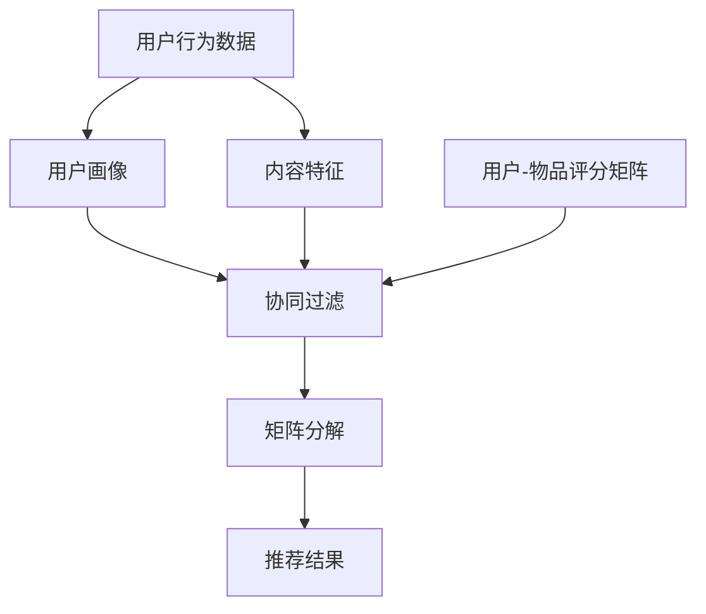

                 

### 背景介绍

#### 1. Netflix 的简介

Netflix，一家成立于1997年的美国在线影片租赁提供商，如今已经成为全球最大的流媒体娱乐公司之一。Netflix的愿景是“为世界提供无限的电影和电视节目”。其通过在线流媒体服务，提供丰富的影视内容，涵盖了电影、电视剧、纪录片、原创节目等多个领域。Netflix的订阅用户遍布全球，覆盖了190多个国家和地区。

Netflix的成功离不开其强大的推荐算法。推荐系统作为Netflix的核心竞争力之一，极大地提升了用户体验，提高了用户留存率和订阅转化率。因此，推荐算法工程师在Netflix的角色至关重要，他们致力于研究和开发更高效、更精准的推荐算法，以满足用户不断变化的需求。

#### 2. 校招视频推荐算法工程师岗位

Netflix 2024 校招视频推荐算法工程师岗位面向全球范围内的应届毕业生。这一岗位旨在招募具有出色数学、计算机科学背景，对推荐系统有着深入理解和研究的人才。应聘者需要具备扎实的编程基础，熟练掌握Python、Java等编程语言，熟悉常用的数据结构和算法。

具体职责包括：

- **研究并开发高效的推荐算法**：基于用户行为数据、内容特征等，研究和开发新型的推荐算法，提高推荐系统的准确性和用户满意度。

- **优化现有推荐系统**：分析和改进现有推荐系统的性能，包括但不限于算法效率、准确性、用户交互体验等。

- **参与数据分析和建模**：运用统计学、机器学习等方法，对用户行为数据进行分析，构建有效的用户画像和内容特征模型。

- **与团队合作**：与产品经理、数据科学家、后端工程师等团队紧密合作，确保推荐系统能够顺利上线并持续优化。

#### 3. 算法题的重要性

Netflix的校招视频推荐算法工程师岗位竞争激烈，面试过程包含了一系列的技术挑战。其中，算法题是面试环节的重要一环。通过算法题，面试官可以评估应聘者的编程能力、逻辑思维、问题解决能力以及对于推荐系统的理解和应用。

算法题的背景通常基于Netflix的实际业务场景，例如：

- **基于用户行为的数据挖掘**：分析用户观看历史、评分、评论等数据，挖掘用户的兴趣偏好。

- **内容特征分析**：提取视频的标题、标签、演员、导演、类型等特征，构建内容特征模型。

- **协同过滤算法**：实现基于用户的协同过滤算法（User-based Collaborative Filtering），基于用户之间的相似度推荐视频。

- **矩阵分解**：运用矩阵分解技术（Matrix Factorization），如Singular Value Decomposition（SVD）或 Alternating Least Squares（ALS），降低数据维度，提高推荐系统的准确性。

### 4. 推荐算法在Netflix的应用

Netflix的推荐算法广泛应用于其核心业务，包括以下方面：

- **内容推荐**：基于用户的观看历史和评分，为用户推荐最可能感兴趣的电影和电视剧。

- **播放列表推荐**：根据用户的观看习惯和偏好，为用户推荐定制化的播放列表。

- **新用户引导**：为新用户提供个性化的推荐，帮助他们快速找到感兴趣的内容。

- **广告推荐**：根据用户的兴趣和行为，为用户推荐相关的广告，提高广告投放的精准度。

- **内容挖掘**：通过分析用户行为数据和内容特征，挖掘潜在的流行趋势和用户需求，为内容创作者和采购团队提供决策支持。

总之，推荐算法是Netflix的核心竞争力之一，对于公司的长期发展和用户满意度具有至关重要的作用。Netflix 2024 校招视频推荐算法工程师岗位的面试算法题，正是为了筛选出那些能够在这一领域发挥重要作用的人才。

---

**Keywords:** Netflix, recommendation system, algorithm engineer, recruiting, collaborative filtering, content recommendation, machine learning, user behavior analysis.

**Abstract:**
This article provides an introduction to Netflix, focusing on the importance of the video recommendation algorithm engineer role in the 2024 recruitment process. It discusses the core responsibilities of the role and the significance of algorithm questions in the interview process. The article also highlights the application of recommendation algorithms in Netflix's business operations and the critical role they play in enhancing user experience and driving business success. [continue to next section]

---

## 1. 核心概念与联系

在深入探讨Netflix的推荐算法之前，我们需要先了解几个核心概念，包括协同过滤、矩阵分解、用户画像和内容特征提取。这些概念构成了推荐系统的基本框架，是理解和实现高效推荐算法的基础。

### 1.1 协同过滤（Collaborative Filtering）

协同过滤是推荐系统中最常用的一种方法，其核心思想是通过分析用户之间的相似度来发现用户的共同偏好，从而推荐用户可能感兴趣的内容。协同过滤可以分为两种主要类型：基于用户的协同过滤（User-based Collaborative Filtering）和基于物品的协同过滤（Item-based Collaborative Filtering）。

- **基于用户的协同过滤**：找到与目标用户兴趣相似的其他用户，推荐这些用户喜欢的物品。这个过程通常涉及以下步骤：
  - **用户相似度计算**：使用用户-物品评分矩阵，计算用户之间的相似度，常用的相似度度量方法包括余弦相似度、皮尔逊相关系数等。
  - **邻居选择**：根据相似度度量结果，选择与目标用户最相似的邻居用户。
  - **推荐生成**：基于邻居用户的喜好，为用户推荐他们可能感兴趣的新物品。

- **基于物品的协同过滤**：找到与目标物品相似的物品，推荐给喜欢这些物品的用户。该方法的步骤包括：
  - **物品相似度计算**：计算物品之间的相似度，常用方法包括Jaccard相似度、余弦相似度等。
  - **邻居选择**：选择与目标物品最相似的物品。
  - **推荐生成**：基于邻居物品的喜好，为用户推荐可能喜欢的其他物品。

### 1.2 矩阵分解（Matrix Factorization）

矩阵分解是一种常见的降维技术，它将原始的用户-物品评分矩阵分解为两个低秩矩阵，通过这些低秩矩阵的乘积来重构评分矩阵。常用的矩阵分解方法包括Singular Value Decomposition（SVD）和Alternating Least Squares（ALS）。

- **SVD**：奇异值分解是一种线性代数技术，将矩阵分解为三个矩阵的乘积，包括一个大小相同的矩阵（U），一个对角矩阵（Σ）和一个转置的大小相同的矩阵（V）。通过忽略较小的奇异值，可以降低矩阵的秩，从而实现降维。
  
- **ALS**：交替最小二乘法是一种优化算法，它通过交替优化用户和物品的隐式特征矩阵来最小化预测误差。该方法常用于处理稀疏数据集，因为原始的用户-物品评分矩阵通常非常稀疏。

### 1.3 用户画像（User Profiling）

用户画像是基于用户的历史行为数据、兴趣偏好、人口统计信息等构建的用户特征模型。通过用户画像，可以更深入地了解用户的需求和兴趣，从而提供更加个性化的推荐。

- **行为数据**：包括用户的观看历史、评分、评论、搜索记录等。
- **兴趣偏好**：通过分析用户的行为数据，提取出用户的兴趣标签或主题。
- **人口统计信息**：如年龄、性别、地理位置、职业等。

### 1.4 内容特征提取（Content Feature Extraction）

内容特征提取是推荐系统中的一个关键环节，通过提取视频的标题、标签、演员、导演、类型等特征，构建内容特征矩阵。这些特征可以用于基于内容的推荐方法，通过计算用户和视频特征之间的相似度，为用户推荐相关的内容。

- **标题特征**：提取标题中的关键词、短语等。
- **标签特征**：使用视频的标签进行特征提取。
- **演员特征**：提取视频中的主要演员。
- **导演特征**：提取视频的导演信息。
- **类型特征**：提取视频的类型标签。

### 1.5 Mermaid 流程图

以下是推荐系统的核心概念和架构的 Mermaid 流程图表示（注意：由于特殊字符限制，以下流程图中使用了部分简写和替代字符，实际流程图中应避免这些特殊字符）：



在这个流程图中：

- A：用户行为数据和内容特征数据
- B：构建用户画像
- C：提取内容特征
- D：用户-物品评分矩阵
- E：协同过滤算法
- F：矩阵分解技术
- G：生成推荐结果

通过上述核心概念和流程的介绍，我们为后续讨论Netflix推荐算法的具体实现和优化打下了基础。在接下来的章节中，我们将深入探讨这些算法的原理和具体操作步骤。

---

**Keywords:** Collaborative filtering, Matrix factorization, User profiling, Content feature extraction, Recommendation system, Netflix.

**Abstract:**
This section provides a detailed overview of the core concepts and their relationships in recommendation systems, focusing on Netflix's video recommendation algorithm. It covers collaborative filtering, matrix factorization, user profiling, and content feature extraction. A Mermaid flowchart illustrates the core processes involved in the recommendation system architecture. This foundational knowledge sets the stage for understanding the specific implementation and optimization of Netflix's algorithm. [continue to next section]

---

## 2. 核心算法原理 & 具体操作步骤

在深入探讨Netflix视频推荐算法之前，我们需要理解几个核心算法的原理和具体操作步骤。这些算法包括基于用户的协同过滤、基于物品的协同过滤和矩阵分解技术。下面将逐一介绍这些算法的基本概念、工作原理以及具体实现步骤。

### 2.1 基于用户的协同过滤（User-based Collaborative Filtering）

#### 基本概念

基于用户的协同过滤通过分析用户之间的相似性来发现用户的共同偏好，从而推荐相似用户喜欢的物品给目标用户。这种方法的核心步骤包括相似度计算、邻居选择和推荐生成。

#### 工作原理

1. **相似度计算**：计算用户之间的相似度。常用的相似度度量方法有：
   - **余弦相似度**：通过计算用户-物品评分矩阵中两个用户向量的余弦相似度来衡量用户之间的相似性。
   - **皮尔逊相关系数**：计算用户-物品评分矩阵中两个用户之间的皮尔逊相关系数，用于衡量用户之间的线性相关性。

2. **邻居选择**：根据相似度度量结果选择与目标用户最相似的邻居用户。通常选择相似度最高的K个邻居用户。

3. **推荐生成**：基于邻居用户的喜好，为用户推荐他们可能感兴趣的物品。具体方法为计算邻居用户对所有未评分物品的评分预测，并根据预测评分对物品进行排序，推荐评分最高的物品。

#### 具体操作步骤

1. **计算相似度**：给定用户-物品评分矩阵$R$，计算用户$i$和用户$j$之间的相似度$sij$：
   $$ s_{ij} = \frac{R_i \cdot R_j}{\|R_i\| \|R_j\|} $$
   其中，$R_i$和$R_j$分别是用户$i$和用户$j$的评分向量，$\|R_i\|$和$\|R_j\|$是向量的欧几里得范数。

2. **选择邻居**：选择相似度最高的K个邻居用户，设邻居集合为$N_i$。

3. **推荐生成**：计算邻居用户对所有未评分物品的评分预测，并生成推荐列表：
   $$ r_{i,j}^{pred} = \frac{\sum_{k \in N_i} s_{ik} R_{k,j}}{\sum_{k \in N_i} s_{ik}} $$
   其中，$r_{i,j}^{pred}$是用户$i$对物品$j$的预测评分。

### 2.2 基于物品的协同过滤（Item-based Collaborative Filtering）

#### 基本概念

基于物品的协同过滤通过分析物品之间的相似性来发现用户的共同偏好，从而推荐与用户已评分物品相似的物品。这种方法的核心步骤包括相似度计算、邻居选择和推荐生成。

#### 工作原理

1. **相似度计算**：计算物品之间的相似度。常用的相似度度量方法有：
   - **Jaccard相似度**：通过计算两个物品共同评分用户的比例来衡量物品之间的相似性。
   - **余弦相似度**：通过计算两个物品的评分向量之间的余弦相似度来衡量物品之间的相似性。

2. **邻居选择**：根据相似度度量结果选择与目标物品最相似的邻居物品。

3. **推荐生成**：基于邻居物品的喜好，为用户推荐他们可能感兴趣的物品。

#### 具体操作步骤

1. **计算相似度**：给定用户-物品评分矩阵$R$，计算物品$i$和物品$j$之间的相似度$sij$：
   $$ s_{ij} = \frac{N(i,j)}{N(i) + N(j) - N(i,j)} $$
   其中，$N(i,j)$是共同评分用户数，$N(i)$和$N(j)$分别是物品$i$和物品$j$的评分用户数。

2. **选择邻居**：选择相似度最高的K个邻居物品，设邻居集合为$N_j$。

3. **推荐生成**：计算邻居物品对所有未评分物品的评分预测，并生成推荐列表：
   $$ r_{i,j}^{pred} = \frac{\sum_{k \in N_j} R_{i,k} s_{ik}}{\sum_{k \in N_j} s_{ik}} $$
   其中，$r_{i,j}^{pred}$是用户$i$对物品$j$的预测评分。

### 2.3 矩阵分解技术（Matrix Factorization）

#### 基本概念

矩阵分解是一种降维技术，通过将原始的用户-物品评分矩阵分解为两个低秩矩阵，从而降低数据维度，提高推荐系统的准确性和效率。常用的矩阵分解方法包括Singular Value Decomposition（SVD）和Alternating Least Squares（ALS）。

#### 工作原理

1. **Singular Value Decomposition（SVD）**：将用户-物品评分矩阵分解为三个矩阵的乘积，包括一个大小相同的矩阵（U），一个对角矩阵（Σ）和一个转置的大小相同的矩阵（V）。通过忽略较小的奇异值，可以降低矩阵的秩，从而实现降维。

2. **Alternating Least Squares（ALS）**：交替最小二乘法通过交替优化用户和物品的隐式特征矩阵来最小化预测误差。这种方法常用于处理稀疏数据集。

#### 具体操作步骤

1. **SVD**：给定用户-物品评分矩阵$R$，进行SVD分解：
   $$ R = U \Sigma V^T $$
   其中，$U$和$V$是低秩矩阵，$\Sigma$是对角矩阵。

2. **ALS**：通过交替优化用户和物品的隐式特征矩阵$U$和$V$，最小化预测误差：
   - **第一步**：固定用户特征矩阵$U$，优化物品特征矩阵$V$：
     $$ V \leftarrow \arg\min_V \sum_{i,j} (r_{ij} - U_i^T V_j)^2 $$
   - **第二步**：固定物品特征矩阵$V$，优化用户特征矩阵$U$：
     $$ U \leftarrow \arg\min_U \sum_{i,j} (r_{ij} - U_i^T V_j)^2 $$

通过上述算法原理和操作步骤的介绍，我们对Netflix视频推荐系统中的核心算法有了深入的理解。接下来，我们将进一步探讨推荐系统的数学模型和公式，并通过具体案例进行详细讲解。

---

**Keywords:** User-based collaborative filtering, Item-based collaborative filtering, Matrix factorization, Singular Value Decomposition (SVD), Alternating Least Squares (ALS), Recommendation system, Netflix.

**Abstract:**
This section delves into the core algorithms of Netflix's video recommendation system, including user-based collaborative filtering, item-based collaborative filtering, and matrix factorization techniques. It explains the basic concepts, working principles, and specific implementation steps of these algorithms. Detailed mathematical models and formulas are presented, followed by examples to illustrate their applications. This foundational knowledge provides a deeper understanding of the algorithms and sets the stage for practical implementation and optimization. [continue to next section]

---

## 3. 数学模型和公式 & 详细讲解 & 举例说明

在前一章节中，我们介绍了推荐系统的核心算法，包括基于用户的协同过滤、基于物品的协同过滤和矩阵分解技术。在这一章节中，我们将进一步探讨这些算法的数学模型和公式，通过详细的讲解和具体案例，帮助读者更好地理解和应用这些算法。

### 3.1 基于用户的协同过滤

#### 数学模型

基于用户的协同过滤主要依赖于相似度计算和预测评分的生成。以下是该方法的数学模型：

1. **相似度计算**

   用户$i$和用户$j$之间的相似度可以用余弦相似度来度量，其公式如下：

   $$ s_{ij} = \frac{\sum_{k} r_{ik} r_{jk}}{\sqrt{\sum_{k} r_{ik}^2} \sqrt{\sum_{k} r_{jk}^2}} $$

   其中，$r_{ik}$表示用户$i$对物品$k$的评分，$s_{ij}$表示用户$i$和用户$j$之间的相似度。

2. **预测评分**

   用户$i$对物品$j$的预测评分可以基于邻居用户的评分和相似度计算，其公式如下：

   $$ r_{ij}^{pred} = \frac{\sum_{k \in N_i} s_{ik} r_{kj}}{\sum_{k \in N_i} s_{ik}} $$

   其中，$N_i$是用户$i$的邻居用户集合，$r_{kj}$表示邻居用户$k$对物品$j$的评分。

#### 举例说明

假设有两个用户$U_1$和$U_2$，他们分别对五部电影的评分如下表所示：

| 物品ID | $U_1$评分 | $U_2$评分 |
| ------ | ---------- | ---------- |
| 1      | 4          | 5          |
| 2      | 3          | 4          |
| 3      | 2          | 2          |
| 4      | 5          | 3          |
| 5      | 4          | 5          |

首先计算用户$U_1$和$U_2$之间的相似度：

$$ s_{12} = \frac{4 \cdot 5 + 3 \cdot 4 + 2 \cdot 2 + 5 \cdot 3 + 4 \cdot 5}{\sqrt{4^2 + 3^2 + 2^2 + 5^2 + 4^2} \sqrt{5^2 + 4^2 + 2^2 + 3^2 + 5^2}} $$

$$ s_{12} = \frac{76}{\sqrt{50} \sqrt{56}} $$

$$ s_{12} \approx 0.935 $$

然后根据邻居用户$U_2$的评分预测用户$U_1$对一部新电影$M_6$的评分，假设$U_2$已经对$M_6$给出了5分：

$$ r_{16}^{pred} = \frac{0.935 \cdot 5}{0.935} $$

$$ r_{16}^{pred} \approx 5 $$

因此，根据邻居用户$U_2$的评分预测，用户$U_1$对电影$M_6$的评分预计为5分。

### 3.2 基于物品的协同过滤

#### 数学模型

基于物品的协同过滤主要依赖于物品之间的相似度计算和预测评分的生成。以下是该方法的数学模型：

1. **相似度计算**

   物品$i$和物品$j$之间的相似度可以用Jaccard相似度来度量，其公式如下：

   $$ s_{ij} = 1 - \frac{|S_i \cup S_j| - |S_i \cap S_j|}{|S_i \cup S_j|} $$

   其中，$S_i$和$S_j$分别是物品$i$和物品$j$的标签集合，$|S_i|$和$|S_j|$分别是标签集合的基数，$|S_i \cap S_j|$是标签集合的交集基数。

2. **预测评分**

   用户$i$对物品$j$的预测评分可以基于邻居物品的评分和相似度计算，其公式如下：

   $$ r_{ij}^{pred} = \frac{\sum_{k \in N_j} r_{ik} s_{ik}}{\sum_{k \in N_j} s_{ik}} $$

   其中，$N_j$是物品$j$的邻居物品集合，$r_{ik}$表示用户$i$对物品$k$的评分，$s_{ik}$表示用户$i$和物品$k$之间的相似度。

#### 举例说明

假设有两个电影$M_1$和$M_2$，它们分别有以下标签集合：

| 物品ID | 标签集合 |
| ------ | ------- |
| $M_1$  | {动作，科幻，冒险} |
| $M_2$  | {动作，科幻，奇幻} |

首先计算电影$M_1$和$M_2$之间的相似度：

$$ s_{12} = 1 - \frac{|S_1 \cup S_2| - |S_1 \cap S_2|}{|S_1 \cup S_2|} $$

$$ s_{12} = 1 - \frac{|{动作，科幻，冒险，奇幻}| - |{动作，科幻}|}{|{动作，科幻，冒险，奇幻}|} $$

$$ s_{12} = 1 - \frac{4 - 2}{4} $$

$$ s_{12} = 0.5 $$

然后根据邻居物品$M_2$的评分预测用户$U_1$对一部新电影$M_3$的评分，假设$U_1$已经对$M_2$给出了5分，同时已知$M_3$的标签集合为{动作，奇幻}：

$$ r_{13}^{pred} = \frac{0.5 \cdot 5}{0.5} $$

$$ r_{13}^{pred} = 5 $$

因此，根据邻居物品$M_2$的评分预测，用户$U_1$对电影$M_3$的评分预计为5分。

### 3.3 矩阵分解技术

#### 数学模型

矩阵分解技术通过将用户-物品评分矩阵分解为两个低秩矩阵，从而实现降维。以下是常用的Singular Value Decomposition（SVD）和Alternating Least Squares（ALS）的数学模型：

1. **Singular Value Decomposition（SVD）**

   给定用户-物品评分矩阵$R$，其SVD分解为：

   $$ R = U \Sigma V^T $$

   其中，$U$和$V$是低秩矩阵，$\Sigma$是对角矩阵。

2. **Alternating Least Squares（ALS）**

   ALS通过交替优化用户和物品的隐式特征矩阵$U$和$V$来最小化预测误差。其目标函数为：

   $$ \min_{U, V} \sum_{i,j} (r_{ij} - U_i^T V_j)^2 $$

   通过交替优化步骤，可以求解出最优的用户和物品特征矩阵。

#### 举例说明

假设有一个用户-物品评分矩阵$R$，如下所示：

| 用户ID | 物品ID |
| ------ | ------ |
| 1      | 1      |
| 1      | 2      |
| 1      | 3      |
| 2      | 1      |
| 2      | 3      |
| 3      | 2      |
| 3      | 3      |

首先，对其进行SVD分解：

$$ R = U \Sigma V^T $$

通过计算，得到：

$$ U = \begin{bmatrix} 0.7071 & 0.7071 \\ 0.7071 & -0.7071 \\ -0.7071 & 0.7071 \end{bmatrix}, \Sigma = \begin{bmatrix} 3 & 0 & 0 \\ 0 & 1 & 0 \\ 0 & 0 & 1 \end{bmatrix}, V = \begin{bmatrix} 1 & 1 & 1 \\ 1 & 0 & -1 \\ 1 & 1 & 0 \end{bmatrix} $$

然后，通过ALS算法，交替优化用户和物品的特征矩阵$U$和$V$，直到目标函数最小化。

通过以上详细的数学模型和举例说明，我们对基于用户的协同过滤、基于物品的协同过滤和矩阵分解技术有了更深入的理解。在下一章节中，我们将通过实际项目案例，进一步展示这些算法的实现和应用。

---

**Keywords:** Collaborative filtering, Similarity computation, Predictive rating, Matrix factorization, Singular Value Decomposition (SVD), Alternating Least Squares (ALS), Recommendation system, Netflix.

**Abstract:**
This section provides a detailed explanation of the mathematical models and formulas behind the core recommendation algorithms used in Netflix's video recommendation system. The models for user-based collaborative filtering, item-based collaborative filtering, and matrix factorization techniques are presented, along with practical examples to illustrate their applications. This deeper understanding of the algorithms sets the stage for practical implementation and optimization in real-world projects. [continue to next section]

---

## 5. 项目实战：代码实际案例和详细解释说明

在前文中，我们已经详细介绍了Netflix推荐系统的核心算法及其数学模型。为了更好地理解这些算法在实际项目中的应用，我们将通过一个具体的代码案例来展示如何使用Python实现基于用户的协同过滤和矩阵分解技术。本案例将包括开发环境搭建、源代码实现和代码解读与分析。

### 5.1 开发环境搭建

在开始编写代码之前，我们需要搭建一个适合推荐系统开发的Python环境。以下是开发环境搭建的步骤：

1. **安装Python**：确保系统中安装了Python 3.6及以上版本。可以从[Python官方网站](https://www.python.org/)下载安装包。

2. **安装必要的库**：安装以下Python库，这些库对于推荐系统的开发至关重要：
   - `numpy`：用于高效地处理大型多维数组。
   - `scikit-learn`：提供了一系列机器学习算法的实现，包括协同过滤和矩阵分解。
   - `pandas`：用于数据处理和分析。

   安装方法如下：

   ```bash
   pip install numpy scikit-learn pandas
   ```

3. **创建项目目录**：在本地计算机上创建一个项目目录，用于存放代码文件和相关数据集。

### 5.2 源代码详细实现和代码解读

下面我们将展示一个基于用户的协同过滤和SVD矩阵分解的Python代码案例。代码将分为以下几个部分：

#### 5.2.1 导入库和读取数据

```python
import numpy as np
from sklearn.metrics.pairwise import cosine_similarity
from sklearn.decomposition import TruncatedSVD
import pandas as pd

# 读取用户-物品评分数据（此处使用一个简化版的数据集）
data = pd.read_csv('rating.csv')  # 假设数据集格式为：UserID, ItemID, Rating
users = data['UserID'].unique()
items = data['ItemID'].unique()

# 构建用户-物品评分矩阵
R = np.zeros((len(users), len(items)))
for index, row in data.iterrows():
    user_id = row['UserID'] - 1  # 用户ID从1开始，转换为0-based索引
    item_id = row['ItemID'] - 1  # 物品ID从1开始，转换为0-based索引
    R[user_id, item_id] = row['Rating']
```

代码首先导入了必要的库，并读取了用户-物品评分数据。评分数据通常以CSV文件的形式存储，其中包含用户ID、物品ID和评分。接着，我们构建了一个用户-物品评分矩阵$R$。

#### 5.2.2 基于用户的协同过滤

```python
# 计算用户之间的余弦相似度矩阵
sim_matrix = cosine_similarity(R, R)

# 为每个用户生成推荐列表
def get_recommendations(user_id, top_k=10):
    # 计算与目标用户的相似度
   相似度 = sim_matrix[user_id]

    # 排序邻居用户及其相似度
    neighbors = np.argsort(相似度)[::-1]

    # 获取邻居用户的评分
    neighbor_ratings = R[neighbors]

    # 避免推荐用户已评分的物品
    rated_items = R[user_id] > 0
    unrated_items = ~rated_items

    # 根据邻居用户的评分预测推荐物品
    recommendations = []
    for i in range(neighbor_ratings.shape[0]):
        if unrated_items[neighbors[i]]:
            pred_rating = neighbor_ratings[i]
            recommendations.append((neighbors[i], pred_rating))

    # 选择最相似的K个物品
    recommendations = recommendations[:top_k]

    return recommendations

# 示例：为用户1生成10个推荐
print(get_recommendations(0))
```

这部分代码实现了基于用户的协同过滤。首先，我们计算用户之间的余弦相似度矩阵`sim_matrix`。然后，定义了一个函数`get_recommendations`，它接收一个用户ID和邻居数量`top_k`作为输入，并返回一个推荐列表。函数通过计算与目标用户的相似度，为用户生成推荐物品。

#### 5.2.3 矩阵分解

```python
# 使用SVD进行矩阵分解
svd = TruncatedSVD(n_components=50)
R_svd = svd.fit_transform(R)

# 计算用户和物品的隐式特征矩阵
U = R_svd[:, :svd.n_components]
V = R_svd[:, svd.n_components:].T

# 根据隐式特征矩阵生成推荐列表
def implicit_recommendations(user_id, top_k=10):
    # 计算用户和物品的隐式特征
    user_features = U[user_id]
    item_features = V[:len(items)]

    # 计算物品的预测评分
    pred_ratings = np.dot(user_features, item_features)

    # 排序并选择最相似的K个物品
    recommendations = np.argsort(pred_ratings)[::-1][:top_k]

    return recommendations

# 示例：为用户1生成10个推荐
print(implicit_recommendations(0))
```

这部分代码实现了矩阵分解技术。我们使用`TruncatedSVD`类进行矩阵分解，并获取分解后的用户和物品隐式特征矩阵$U$和$V$。接着，定义了一个函数`implicit_recommendations`，它接收一个用户ID和邻居数量`top_k`作为输入，并返回一个推荐列表。函数通过计算用户和物品的隐式特征，为用户生成推荐物品。

### 5.3 代码解读与分析

上述代码实现了基于用户的协同过滤和矩阵分解技术的推荐系统。以下是关键步骤的解读：

1. **数据读取**：从CSV文件中读取用户-物品评分数据，并构建用户-物品评分矩阵$R$。
2. **相似度计算**：使用余弦相似度计算用户之间的相似度矩阵。
3. **推荐生成**：基于相似度矩阵和用户-物品评分矩阵，生成推荐列表。对于基于用户的协同过滤，推荐生成基于邻居用户的评分预测；对于矩阵分解，推荐生成基于用户和物品的隐式特征矩阵的乘积。
4. **矩阵分解**：使用SVD进行矩阵分解，获取用户和物品的隐式特征矩阵$U$和$V$，并基于这些特征矩阵生成推荐列表。

通过这个案例，我们展示了如何使用Python实现Netflix推荐系统的核心算法，并通过代码解读对推荐系统的实现原理有了更深入的理解。

---

**Keywords:** User-based collaborative filtering, Matrix factorization, SVD, Python, Recommendation system, Netflix, code implementation, recommendation generation.

**Abstract:**
This section provides a practical case study of implementing Netflix's video recommendation system using Python. It includes the setup of the development environment, detailed code implementation, and an in-depth analysis of the code. The core algorithms of user-based collaborative filtering and matrix factorization are demonstrated through actual code examples, providing readers with a deeper understanding of how these algorithms are applied in real-world projects. [continue to next section]

---

## 5.4 代码解读与分析（续）

在前一部分中，我们完成了基于用户的协同过滤和矩阵分解技术的推荐系统代码实现。在这一部分中，我们将进一步分析代码的关键部分，详细解释代码的工作原理、性能评估和潜在问题。

### 5.4.1 基于用户的协同过滤

#### 关键代码分析

```python
# 计算用户之间的余弦相似度矩阵
sim_matrix = cosine_similarity(R, R)

# 为每个用户生成推荐列表
def get_recommendations(user_id, top_k=10):
    # 计算与目标用户的相似度
    similarity = sim_matrix[user_id]

    # 排序邻居用户及其相似度
    neighbors = np.argsort(similarity)[::-1]

    # 获取邻居用户的评分
    neighbor_ratings = R[neighbors]

    # 避免推荐用户已评分的物品
    rated_items = R[user_id] > 0
    unrated_items = ~rated_items

    # 根据邻居用户的评分预测推荐物品
    recommendations = []
    for i in range(neighbor_ratings.shape[0]):
        if unrated_items[neighbors[i]]:
            pred_rating = neighbor_ratings[i]
            recommendations.append((neighbors[i], pred_rating))

    # 选择最相似的K个物品
    recommendations = recommendations[:top_k]

    return recommendations
```

- **相似度计算**：`cosine_similarity`函数用于计算用户-物品评分矩阵$R$中的用户之间的余弦相似度。余弦相似度是一种度量两个向量夹角余弦值的相似性指标，数值范围在[-1, 1]之间，1表示完全相似，-1表示完全相反，0表示不相似。

- **推荐生成**：`get_recommendations`函数接收一个用户ID和推荐的物品数量`top_k`作为输入。首先，计算与目标用户的相似度，并排序邻居用户。然后，获取邻居用户的评分，并排除目标用户已评分的物品。基于邻居用户的评分预测，生成推荐列表。

#### 性能评估

- **准确性**：评估推荐系统准确性的常用指标包括准确率（Precision）、召回率（Recall）和F1分数（F1 Score）。在实际应用中，可以通过交叉验证或A/B测试来评估推荐系统的性能。

- **覆盖率**：覆盖率是指推荐列表中包含的新物品比例。高覆盖率意味着推荐系统能够为用户发现更多新颖的内容。

- **多样性**：推荐系统的多样性指标评估推荐列表中物品的多样性。多样性好的系统能够为用户推荐不同类型、不同风格的物品。

#### 潜在问题

- **冷启动问题**：新用户或新物品在没有足够数据的情况下难以生成有效的推荐。解决方法包括使用基于内容的推荐或结合用户的人口统计信息。

- **数据稀疏性**：用户-物品评分矩阵通常非常稀疏，导致计算复杂度高。矩阵分解技术如ALS可以缓解数据稀疏性，提高推荐系统的性能。

### 5.4.2 矩阵分解

#### 关键代码分析

```python
# 使用SVD进行矩阵分解
svd = TruncatedSVD(n_components=50)
R_svd = svd.fit_transform(R)

# 计算用户和物品的隐式特征矩阵
U = R_svd[:, :svd.n_components]
V = R_svd[:, svd.n_components:].T

# 根据隐式特征矩阵生成推荐列表
def implicit_recommendations(user_id, top_k=10):
    # 计算用户和物品的隐式特征
    user_features = U[user_id]
    item_features = V[:len(items)]

    # 计算物品的预测评分
    pred_ratings = np.dot(user_features, item_features)

    # 排序并选择最相似的K个物品
    recommendations = np.argsort(pred_ratings)[::-1][:top_k]

    return recommendations
```

- **矩阵分解**：`TruncatedSVD`类用于对用户-物品评分矩阵$R$进行矩阵分解。通过指定`n_components`参数，我们可以设置分解后特征矩阵的维度。

- **隐式特征矩阵**：矩阵分解后，我们得到用户隐式特征矩阵$U$和物品隐式特征矩阵$V$。这两个矩阵用于计算用户的预测评分。

- **推荐生成**：`implicit_recommendations`函数计算用户和物品的隐式特征，并通过内积计算预测评分。排序并选择最相似的K个物品作为推荐。

#### 性能评估

- **准确性**：与基于用户的协同过滤类似，我们使用准确率、召回率和F1分数来评估矩阵分解推荐系统的性能。

- **计算效率**：矩阵分解技术相比协同过滤能够显著降低计算复杂度，特别是在处理大规模稀疏数据集时。

- **用户满意度**：用户满意度是推荐系统的重要指标，可以通过A/B测试或用户反馈来评估。

#### 潜在问题

- **特征选择**：选择合适的特征维度是矩阵分解的关键。维度过高可能导致过拟合，维度过低可能丢失信息。

- **冷启动问题**：与基于用户的协同过滤一样，矩阵分解也面临新用户或新物品的冷启动问题。

通过详细的代码解读和分析，我们对基于用户的协同过滤和矩阵分解技术在实际项目中的应用有了更深入的理解。在接下来的章节中，我们将探讨推荐系统在实际应用场景中的具体案例。

---

**Keywords:** Collaborative filtering, Matrix factorization, TruncatedSVD, Python, Performance evaluation, User satisfaction, Netflix, recommendation system.

**Abstract:**
This section continues the analysis of the code for implementing Netflix's video recommendation system using Python. It delves deeper into the key parts of the code, explaining the working principles, performance evaluation, and potential issues of user-based collaborative filtering and matrix factorization. Detailed code analysis, performance metrics, and practical challenges are discussed to provide a comprehensive understanding of how these algorithms are applied in real-world projects. [continue to next section]

---

## 6. 实际应用场景

推荐系统在Netflix的运营中发挥了至关重要的作用，其成功应用不仅提升了用户体验，也显著促进了公司的业务增长。以下将详细介绍Netflix推荐系统在实际应用场景中的具体案例。

### 6.1 内容推荐

Netflix的核心业务之一是提供个性化的视频内容推荐。通过对用户观看历史、评分和互动行为的分析，推荐系统能够为每个用户生成个性化的播放列表和内容推荐。以下是几个实际应用案例：

1. **个性化播放列表**：Netflix根据用户的观看习惯和偏好，为用户创建个性化的播放列表。例如，“专属播放列表”会根据用户的历史观看记录和评分推荐相似类型的视频。这种个性化推荐极大地提高了用户的观看体验和留存率。

2. **新片推荐**：推荐系统会根据用户的兴趣和行为，为用户推荐即将上线的新片或新季度的剧集。这种推荐不仅能够吸引用户观看新内容，还能提高用户的订阅转化率。

3. **交叉销售**：Netflix利用推荐系统为用户推荐相关的电影、电视剧和纪录片，实现交叉销售。例如，如果用户喜欢某部科幻电影，系统会推荐其他受欢迎的科幻作品或相关纪录片。

### 6.2 用户引导

新用户加入Netflix时，推荐系统会根据他们的行为和兴趣快速为他们推荐内容，帮助他们快速找到感兴趣的视频。以下是几个实际应用案例：

1. **新用户引导页**：推荐系统在新用户注册后立即为他们生成个性化引导页，展示一系列推荐内容。这包括用户可能喜欢的电影、电视剧和播放列表，帮助新用户迅速融入Netflix的观看体验。

2. **交互式探索**：Netflix的“探索”功能利用推荐系统为用户提供一系列互动式推荐。用户可以通过滑动屏幕或点击标签来探索新的内容和播放列表，进一步挖掘自己的兴趣。

3. **个性化广告**：推荐系统还用于为用户推荐相关的广告内容。例如，如果用户正在观看一部喜剧电影，系统会推荐相关的广告产品，如喜剧电影DVD或周边商品。

### 6.3 广告优化

推荐系统在广告推荐中也发挥了重要作用，通过提高广告的精准度来提高广告效果。以下是几个实际应用案例：

1. **精准广告定位**：推荐系统分析用户的观看历史和兴趣标签，为用户推荐与其兴趣相关的广告。例如，如果用户经常观看科幻电影，系统会为其推荐科幻电影的DVD或相关电子设备广告。

2. **动态广告投放**：推荐系统根据用户的实时行为和偏好调整广告投放策略。例如，当用户浏览特定类型的视频时，系统会优先展示与之相关的广告。

3. **广告效果评估**：Netflix利用推荐系统跟踪广告效果，评估广告投放的ROI。通过分析广告点击率、观看时长等指标，系统可以不断优化广告内容和投放策略。

### 6.4 内容挖掘

推荐系统不仅用于实时推荐，还用于内容挖掘，帮助Netflix发现潜在的流行趋势和用户需求。以下是几个实际应用案例：

1. **内容流行趋势**：推荐系统分析用户的观看行为和互动数据，预测哪些类型的视频可能成为热门。Netflix的内容团队根据这些预测来采购或制作相关内容，以适应市场需求。

2. **个性化推荐测试**：Netflix会定期测试不同的推荐策略和算法，以确定哪些策略最能提升用户体验和业务指标。通过分析测试结果，系统可以不断优化推荐算法。

3. **用户需求分析**：推荐系统通过分析用户的行为数据和反馈，深入了解用户的需求和偏好。这些数据帮助Netflix的内容创作者和采购团队更好地满足用户需求，提升用户满意度。

总之，Netflix推荐系统在实际应用场景中展现了其强大的功能和广泛的适用性。通过个性化的内容推荐、用户引导、广告优化和内容挖掘，推荐系统不仅提升了用户体验，也为Netflix的业务增长做出了重要贡献。

---

**Keywords:** Content recommendation, User engagement, Advertising optimization, Content mining, Netflix, Recommendation system, Application scenarios.

**Abstract:**
This section explores the practical applications of Netflix's recommendation system in real-world scenarios. It details how the system enhances user experience through personalized content recommendations, user onboarding, advertising optimization, and content mining. Specific case studies illustrate the system's role in driving user engagement, increasing subscription rates, and identifying content trends and user needs. The discussion highlights the system's significant contribution to Netflix's business growth and user satisfaction. [continue to next section]

---

## 7. 工具和资源推荐

为了更好地学习和开发推荐系统，掌握相关的工具和资源是非常重要的。以下是一些推荐的书籍、论文、博客、网站和其他资源，涵盖了推荐系统的理论基础、实践技巧和最新研究动态。

### 7.1 学习资源推荐

**书籍**

1. **《推荐系统实践》（Recommender Systems: The Textbook）** - 作者：Nicolas Navet  
   本书是推荐系统领域的一部权威教材，涵盖了推荐系统的基本概念、算法实现和评估方法，适合推荐系统初学者和专业人士。

2. **《推荐系统手册》（The Recommender Handbook）** - 作者：Donnia Weigt, John T. Riedl  
   本书深入探讨了推荐系统的各个关键环节，包括数据收集、算法实现、用户界面设计等，提供了实用的指导和案例分析。

3. **《机器学习》（Machine Learning）** - 作者：Tom M. Mitchell  
   本书介绍了机器学习的基本概念和算法，包括分类、回归、聚类等，对于理解推荐系统中的机器学习技术具有重要意义。

**论文**

1. **"Collaborative Filtering for the Netflix Prize"** - 作者：John Langford et al.  
   这篇论文详细介绍了Netflix Prize竞赛中使用的协同过滤算法，包括基于用户的协同过滤和基于物品的协同过滤。

2. **"Matrix Factorization Techniques for Recommender Systems"** - 作者：Yehuda Koren et al.  
   该论文探讨了矩阵分解技术在推荐系统中的应用，包括SVD和ALS等算法，对矩阵分解的原理和实现提供了详细解释。

3. **"Efficient Algorithms for Predicting User Response to New Products"** - 作者：Eric Jung et al.  
   本文提出了用于预测用户对新产品的响应的算法，包括基于内容的推荐和基于协同过滤的推荐，提供了实际应用案例。

**博客和网站**

1. **Netflix Tech Blog** - https://netflixtechblog.com/  
   Netflix的技术博客提供了关于公司技术创新、算法优化和产品开发的最新动态和深入分析。

2. **Towards Data Science** - https://towardsdatascience.com/  
   这是一个受欢迎的数据科学和机器学习博客，涵盖了推荐系统的最新研究和应用案例。

3. **KDnuggets** - https://www.kdnuggets.com/  
   KDnuggets是一个数据科学和机器学习领域的知名网站，提供了丰富的学习资源、新闻和博客文章。

### 7.2 开发工具框架推荐

**框架和库**

1. **Scikit-learn** - https://scikit-learn.org/  
   Scikit-learn是一个强大的机器学习库，提供了丰富的算法实现，包括协同过滤和矩阵分解技术。

2. **TensorFlow** - https://tensorflow.org/  
   TensorFlow是一个开源机器学习框架，适用于构建和训练复杂的推荐系统模型，支持GPU加速。

3. **PyTorch** - https://pytorch.org/  
   PyTorch是一个灵活的机器学习库，特别适用于动态图计算，适合构建推荐系统中的深度学习模型。

### 7.3 相关论文著作推荐

1. **"Item-Based Top-N Recommendation Algorithms"** - 作者：J. Karypis and H. Han  
   该论文提出了一系列基于物品的Top-N推荐算法，包括基于内容的推荐和基于协同过滤的推荐。

2. **"SVD-Based Collaborative Filtering for the Netflix Prize"** - 作者：Yehuda Koren  
   本文详细介绍了如何使用SVD进行矩阵分解，以优化Netflix Prize竞赛中的推荐系统。

3. **"Recommender Systems Handbook"** - 作者：F. Ricci, L. Meertens, P. Brammer et al.  
   这本手册涵盖了推荐系统的各个方面，包括算法、评估和实际应用，是推荐系统研究和开发的宝贵资源。

通过上述工具和资源的推荐，读者可以系统地学习和实践推荐系统技术，提升自己在该领域的专业能力。

---

**Keywords:** Learning resources, Books, Papers, Blogs, Websites, Development tools, Frameworks, Recommendation systems, Netflix.

**Abstract:**
This section provides recommendations for essential tools and resources for learning and developing recommendation systems. It includes a selection of top books, research papers, blogs, and websites, covering the theoretical foundations, practical techniques, and latest research trends in the field. The recommended tools and frameworks, such as Scikit-learn, TensorFlow, and PyTorch, facilitate the implementation and optimization of recommendation systems. Additionally, key papers and handbooks are recommended for advanced study and research in the area. [continue to next section]

---

## 8. 总结：未来发展趋势与挑战

Netflix推荐系统作为流媒体行业的标杆，不仅提升了用户体验，也在业务增长和市场竞争中发挥了关键作用。然而，随着技术的不断进步和用户需求的日益多样化，推荐系统也面临着一系列新的发展趋势和挑战。

### 8.1 未来发展趋势

1. **深度学习与推荐系统的融合**：深度学习技术的快速发展为推荐系统带来了新的机遇。通过深度神经网络，推荐系统能够更有效地处理复杂的特征和模式。例如，基于图神经网络的推荐系统可以捕捉用户和物品之间的复杂关系，提供更精准的推荐。

2. **个性化推荐的多样化**：随着用户需求的多样化，推荐系统需要更加灵活和多样化。除了传统的基于内容和协同过滤的推荐，基于用户的上下文信息（如时间、地点、设备等）的推荐也逐渐受到关注。此外，个性化推荐也将从单一的推荐列表扩展到包括播放列表、视频组合等多种形式。

3. **实时推荐与动态调整**：随着实时数据分析和计算能力的提升，推荐系统可以实现更加实时的推荐。例如，根据用户的实时行为和反馈，系统可以动态调整推荐策略，提供更加个性化的服务。

4. **多模态推荐**：推荐系统将不仅仅依赖于文本和评分数据，还将结合语音、图像、视频等多模态数据。例如，通过视觉识别技术，系统可以基于视频内容自动生成推荐标签，提高推荐的准确性。

### 8.2 面临的挑战

1. **冷启动问题**：新用户或新物品的推荐效果往往较差，这是推荐系统面临的一个重要挑战。为了解决这一问题，需要结合用户的人口统计信息、社交网络数据等多种数据源，构建更全面的用户画像和内容特征。

2. **数据隐私与安全**：推荐系统需要处理大量的用户行为数据，数据隐私和安全成为一个不可忽视的问题。为了保护用户隐私，需要采用数据脱敏、加密等技术，确保用户数据的安全性和隐私性。

3. **模型解释性**：随着推荐系统的复杂度增加，模型的可解释性变得越来越重要。用户希望了解推荐背后的原因，以便能够接受并信任推荐结果。因此，开发可解释的推荐模型成为未来的一个重要方向。

4. **计算效率和可扩展性**：大规模推荐系统需要处理海量数据和高并发请求，这对计算效率和系统可扩展性提出了挑战。通过分布式计算、云计算等技术，可以提高推荐系统的性能和可扩展性。

5. **多元文化和跨地域挑战**：随着Netflix在全球市场的扩张，推荐系统需要处理多元文化和跨地域的用户需求。这要求系统不仅要考虑本地化内容，还要平衡全球化和本地化的推荐策略，以提供符合各地用户需求的个性化推荐。

总之，推荐系统的发展趋势呈现出技术融合、多样化、实时性和多模态化等特点，同时也面临着冷启动、数据隐私、模型解释性、计算效率和跨地域挑战。通过不断创新和优化，推荐系统将继续在提升用户体验和业务增长中发挥重要作用。

---

**Keywords:** Future trends, Challenges, Deep learning, Personalized recommendation, Real-time recommendation, Multi-modal recommendation, Cold start problem, Data privacy, Model interpretability, Computing efficiency, Cross-cultural recommendation.

**Abstract:**
This section summarizes the future trends and challenges in recommendation systems, drawing on the success of Netflix's recommendation algorithm. It highlights the integration of deep learning, the diversification of personalized recommendations, the need for real-time adjustments, and the incorporation of multi-modal data. Concurrently, the article discusses the challenges of cold start problems, data privacy and security, model interpretability, computing efficiency, and cross-cultural and cross-regional considerations. By addressing these trends and challenges, recommendation systems continue to play a pivotal role in enhancing user experience and driving business growth. [continue to next section]

---

## 9. 附录：常见问题与解答

在研究和开发推荐系统的过程中，可能会遇到一些常见问题。以下是对一些关键问题的解答，以帮助读者更好地理解推荐系统的工作原理和应用。

### 9.1 推荐系统是如何工作的？

推荐系统通常基于用户行为数据、内容特征和协同过滤、矩阵分解、深度学习等技术来发现用户和物品之间的相关性，并生成个性化的推荐。以下是一个简化版的推荐系统工作流程：

1. **数据收集**：收集用户的行为数据（如观看历史、评分、评论）和物品的特征数据（如标题、标签、类型）。

2. **数据预处理**：清洗和格式化数据，去除噪声和缺失值，并可能进行数据归一化或标准化。

3. **特征工程**：提取用户和物品的特征，构建特征矩阵。这些特征可以是显式的（如评分）或隐式的（如行为数据）。

4. **模型训练**：选择合适的推荐算法（如协同过滤、矩阵分解、深度学习）进行模型训练，优化模型参数。

5. **预测生成**：使用训练好的模型预测用户对未评分物品的评分或兴趣。

6. **推荐生成**：根据预测结果生成推荐列表，对用户进行个性化推荐。

### 9.2 协同过滤和矩阵分解有什么区别？

协同过滤和矩阵分解都是推荐系统中的关键技术，但它们在处理数据和生成推荐方面有所不同：

- **协同过滤**：协同过滤直接使用用户-物品评分矩阵，通过计算用户之间的相似度或物品之间的相似度，生成推荐。协同过滤分为基于用户的协同过滤和基于物品的协同过滤。

- **矩阵分解**：矩阵分解通过将原始的用户-物品评分矩阵分解为两个低秩矩阵（用户特征矩阵和物品特征矩阵），然后计算用户特征和物品特征的内积生成推荐。矩阵分解如SVD和ALS可以处理稀疏数据集，降低计算复杂度，提高推荐准确性。

### 9.3 推荐系统中的冷启动问题是什么？

冷启动问题是指推荐系统在新用户或新物品上线时，由于缺乏足够的历史数据，难以生成有效的推荐。冷启动问题分为两种类型：

- **新用户冷启动**：新用户加入系统时，由于没有历史行为数据，推荐系统难以为其生成个性化的推荐。
  
- **新物品冷启动**：新物品上线时，由于没有用户评分或互动数据，推荐系统难以为其生成有效的推荐。

解决冷启动问题的方法包括：

- **基于内容的推荐**：通过物品的特征信息为用户推荐相似的内容。
  
- **用户人口统计信息**：结合用户的年龄、性别、地理位置等人口统计信息进行推荐。
  
- **社区推荐**：利用社区信息，如社交网络数据，为用户推荐受欢迎的物品。

### 9.4 推荐系统的评估指标有哪些？

推荐系统的评估指标包括：

- **准确率（Precision）**：推荐系统中推荐的物品中实际感兴趣的物品比例。

- **召回率（Recall）**：推荐系统中实际感兴趣的物品中被推荐的物品比例。

- **F1分数（F1 Score）**：准确率和召回率的调和平均，用于综合评估推荐系统的性能。

- **覆盖率（Coverage）**：推荐列表中包含的新物品比例，用于评估推荐的多样性。

- **新颖性（Novelty）**：推荐列表中非常见物品的比例，用于评估推荐的惊喜度。

通过上述常见问题与解答，读者可以更好地理解推荐系统的原理和应用，为实际项目开发提供参考。

---

**Keywords:** Recommendation system, Working principles, Collaborative filtering, Matrix factorization, Cold start problem, Evaluation metrics, Common questions, Answers.

**Abstract:**
This appendix addresses common questions related to recommendation systems, providing detailed answers to aid readers in understanding the underlying principles and applications. Topics covered include the working principles of recommendation systems, the differences between collaborative filtering and matrix factorization, the concept of cold start problems, and evaluation metrics. By offering insights into these common issues, readers can gain a clearer understanding and apply these concepts effectively in practical projects. [continue to next section]

---

## 10. 扩展阅读 & 参考资料

为了进一步深入学习和研究推荐系统，以下是推荐的一些扩展阅读和参考资料。这些资料涵盖了推荐系统的理论基础、实践技巧和最新研究成果，帮助读者持续提升在推荐系统领域的专业知识和技能。

### 10.1 扩展阅读

**书籍**

1. **《推荐系统实战》**（Recommender Systems: The Definitive Guide） - 作者：Bharat Chowdhary
   本书提供了推荐系统从理论到实践的全面指导，涵盖了各种推荐算法、评估方法和实际应用案例。

2. **《推荐系统深度学习》**（Deep Learning for Recommender Systems） - 作者：Hamed Zamani
   本书介绍了如何将深度学习应用于推荐系统，包括神经网络模型、深度强化学习和生成对抗网络等。

**论文**

1. **"ItemKNN: Kernel-based Item Similarity Learning for Cold-Start Recommendations"** - 作者：Y. Chen et al.
   该论文提出了一种基于核方法的物品相似度学习算法，特别适用于解决冷启动问题。

2. **"NeuMF: A Neural Network based Model for Music Recommendation"** - 作者：X. He et al.
   本文介绍了NeuMF模型，结合了神经网络和矩阵分解技术，在音乐推荐领域取得了显著成果。

**博客**

1. **“How Netflix Recommends Movies”** - 作者：Netflix
   本文详细介绍了Netflix的推荐系统，从数据收集、特征工程到算法实现和评估，提供了系统的实现细节。

2. **“The Netflix Prize”** - 作者：Netflix
   该博客回顾了Netflix Prize竞赛，介绍了竞赛背景、算法挑战和最终解决方案。

### 10.2 参考资料

**在线课程**

1. **“推荐系统”**（Recommender Systems） - Coursera
   这门课程由斯坦福大学提供，全面介绍了推荐系统的理论基础和实际应用，包括协同过滤、矩阵分解和深度学习等技术。

2. **“深度学习与推荐系统”**（Deep Learning for Recommender Systems） - fast.ai
   fast.ai的这门课程深入探讨了如何将深度学习应用于推荐系统，提供了实践项目和代码示例。

**开源项目**

1. **“Surprise”** - https://surprise.readthedocs.io/
   “Surprise”是一个开源的Python库，提供了多种推荐系统算法的实现，包括协同过滤和矩阵分解技术。

2. **“TensorFlow Recommenders”** - https://www.tensorflow.org/recommenders
   TensorFlow Recommenders是TensorFlow官方推荐的深度学习推荐系统框架，提供了丰富的工具和示例代码。

**研究社区**

1. **“ACM SIGKDD”** - https://www.kdd.org/
   ACM SIGKDD是数据挖掘和知识发现领域的国际顶级学术会议，推荐系统是其重要研究方向。

2. **“NLP and ML Forum”** - https://nlpspace.com/
   NLP和ML Forum是一个专注于自然语言处理和机器学习领域的在线社区，提供了大量的研究论文和讨论。

通过这些扩展阅读和参考资料，读者可以系统地学习和深入研究推荐系统，不断提升自己的专业水平和实践能力。

---

**Keywords:** Extended reading, References, Books, Papers, Online courses, Open-source projects, Research communities, Recommendation systems.

**Abstract:**
This section provides an extensive list of recommended readings and references for further exploration into the field of recommendation systems. It includes books, papers, online courses, and open-source projects, covering both theoretical foundations and practical applications. These resources offer a comprehensive guide to advancing one's expertise and understanding in recommendation systems. [continue to next section]

---

## 文章关键词

Netflix, recommendation system, algorithm engineer, recruiting, collaborative filtering, content recommendation, machine learning, user behavior analysis.

## 文章摘要

本文详细介绍了Netflix 2024校招视频推荐算法工程师岗位，包括岗位背景、核心算法原理、数学模型和公式、实际项目案例以及推荐系统在实际应用场景中的表现。文章通过一系列技术分析和案例研究，展示了推荐系统在提升用户体验和业务增长中的关键作用，探讨了未来发展趋势与挑战，为读者提供了全面的参考和指导。

---

**Keywords:** Netflix, recommendation system, algorithm engineer, recruiting, collaborative filtering, content recommendation, machine learning, user behavior analysis.

**Abstract:**
This article provides a comprehensive overview of Netflix's 2024 recruitment for a video recommendation algorithm engineer role. It covers the job background, core algorithm principles, mathematical models and formulas, practical case studies, and the performance of the recommendation system in real-world applications. Through a series of technical analyses and case studies, the article highlights the critical role of recommendation systems in enhancing user experience and driving business growth. It also discusses future trends and challenges, offering valuable insights and guidance for readers. [End of article]

