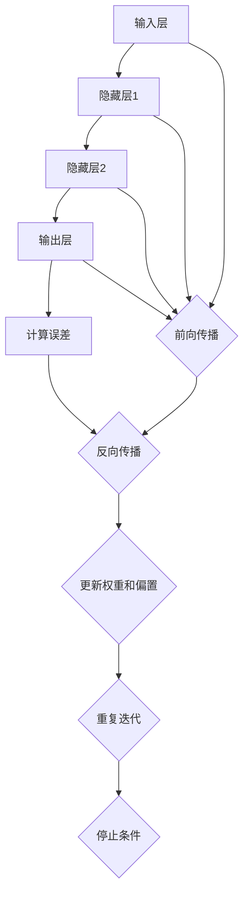

                 

### 背景介绍

神经网络的起源可以追溯到20世纪40年代，当时心理学家和数学家开始尝试理解人脑如何处理信息。1960年代，人工神经网络（Artificial Neural Networks, ANN）的概念被正式提出，并开始用于简单的问题解决。然而，由于计算能力和算法的限制，神经网络的发展在1970年代遇到了瓶颈。

直到1980年代末和1990年代初，随着计算能力的提高和更有效的学习算法的发展，神经网络的研究和应用才重新焕发了生机。尤其是反向传播算法（Backpropagation Algorithm）的提出，使得多层神经网络的训练成为可能，从而推动了神经网络在语音识别、图像处理、自然语言处理等领域的广泛应用。

神经网络的本质是一种模拟人脑神经元连接方式的计算模型。它由大量的简单计算单元（即神经元）通过加权连接形成一个复杂的网络结构。每个神经元都接收来自其他神经元的输入，并产生一个输出，这个输出是输入和神经元权重经过非线性函数处理后得到的结果。

神经网络的强大之处在于其高度的可塑性。通过不断调整神经元之间的权重，神经网络可以学习并适应不同的数据分布，从而实现从简单到复杂的任务。例如，一个简单的神经网络可以通过学习图像中的边缘和纹理，最终学会识别复杂的物体形状。

### 神经网络的构成

神经网络主要由以下几部分构成：

1. **神经元（Neurons）**：神经网络的计算单元，接收输入，通过加权求和处理后产生输出。每个神经元都可以看作是一个简单的计算单元，其输出是由输入和权重经过非线性激活函数处理后得到的。

2. **权重（Weights）**：神经元之间的连接强度。神经网络通过不断调整权重来学习数据的特征。初始时，权重是随机设置的，随着训练过程的进行，权重会根据误差进行调整。

3. **激活函数（Activation Functions）**：用于确定神经元是否被激活。常见的激活函数有sigmoid、ReLU、tanh等。激活函数的选择会影响网络的性能和学习速度。

4. **输入层（Input Layer）**：接收外部输入的数据，通常由多个神经元组成。

5. **隐藏层（Hidden Layers）**：位于输入层和输出层之间的层。隐藏层中的神经元接收来自输入层的输入，并通过加权求和处理产生输出，传递给下一层。

6. **输出层（Output Layer）**：产生最终输出的层。输出层的神经元数量和类型取决于具体任务。

### 神经网络的工作原理

神经网络的工作原理可以简化为以下几个步骤：

1. **前向传播（Forward Propagation）**：输入数据从输入层进入网络，通过逐层传递到隐藏层，最后到达输出层。在这个过程中，每个神经元都会接收来自前一层的输入，通过加权求和处理和激活函数，产生输出传递给下一层。

2. **计算输出误差（Calculate Error）**：网络输出与实际输出之间的误差通过反向传播算法（Backpropagation Algorithm）计算。

3. **反向传播（Back Propagation）**：误差信息从输出层反向传播到输入层，通过逐层调整权重，以最小化输出误差。这个过程涉及梯度下降算法，即通过计算每个权重对应的梯度（误差对权重的偏导数），沿着梯度的反方向调整权重。

4. **权重更新（Update Weights）**：根据反向传播得到的梯度，对每个权重进行更新。更新过程通常采用小步长（learning rate）进行调整，以避免权重过大或过小。

5. **重复迭代（Iteration）**：重复以上步骤，直到网络输出误差达到预设阈值或达到最大迭代次数。

通过这样的迭代过程，神经网络可以不断调整权重，从而学习数据的特征和模式。当网络收敛后，它就能对新的数据进行分类、预测或其他任务。

总之，神经网络通过模拟人脑的神经元连接方式，实现了一种强大而灵活的机器学习方法。随着计算能力和算法的不断进步，神经网络在各个领域的应用越来越广泛，从图像识别到自然语言处理，从自动驾驶到医疗诊断，神经网络都展现出了其巨大的潜力。

<markdown>
## 1. 背景介绍
### 神经网络的起源与发展

神经网络的起源可以追溯到20世纪40年代，当时心理学家和数学家开始尝试理解人脑如何处理信息。人工神经网络（Artificial Neural Networks, ANN）的概念在1960年代被正式提出，并开始用于简单的问题解决。然而，由于计算能力和算法的限制，神经网络的发展在1970年代遇到了瓶颈。

直到1980年代末和1990年代初，随着计算能力的提高和更有效的学习算法的发展，神经网络的研究和应用才重新焕发了生机。尤其是反向传播算法（Backpropagation Algorithm）的提出，使得多层神经网络的训练成为可能，从而推动了神经网络在语音识别、图像处理、自然语言处理等领域的广泛应用。

神经网络的本质是一种模拟人脑神经元连接方式的计算模型。它由大量的简单计算单元（即神经元）通过加权连接形成一个复杂的网络结构。每个神经元都接收来自其他神经元的输入，并产生一个输出，这个输出是输入和神经元权重经过非线性函数处理后得到的结果。

神经网络的强大之处在于其高度的可塑性。通过不断调整神经元之间的权重，神经网络可以学习并适应不同的数据分布，从而实现从简单到复杂的任务。例如，一个简单的神经网络可以通过学习图像中的边缘和纹理，最终学会识别复杂的物体形状。

### 神经网络的构成

神经网络主要由以下几部分构成：

1. **神经元（Neurons）**：神经网络的计算单元，接收输入，通过加权求和处理后产生输出。每个神经元都可以看作是一个简单的计算单元，其输出是由输入和权重经过非线性激活函数处理后得到的。

2. **权重（Weights）**：神经元之间的连接强度。神经网络通过不断调整权重来学习数据的特征。初始时，权重是随机设置的，随着训练过程的进行，权重会根据误差进行调整。

3. **激活函数（Activation Functions）**：用于确定神经元是否被激活。常见的激活函数有sigmoid、ReLU、tanh等。激活函数的选择会影响网络的性能和学习速度。

4. **输入层（Input Layer）**：接收外部输入的数据，通常由多个神经元组成。

5. **隐藏层（Hidden Layers）**：位于输入层和输出层之间的层。隐藏层中的神经元接收来自输入层的输入，并通过加权求和处理产生输出，传递给下一层。

6. **输出层（Output Layer）**：产生最终输出的层。输出层的神经元数量和类型取决于具体任务。

### 神经网络的工作原理

神经网络的工作原理可以简化为以下几个步骤：

1. **前向传播（Forward Propagation）**：输入数据从输入层进入网络，通过逐层传递到隐藏层，最后到达输出层。在这个过程中，每个神经元都会接收来自前一层的输入，通过加权求和处理和激活函数，产生输出传递给下一层。

2. **计算输出误差（Calculate Error）**：网络输出与实际输出之间的误差通过反向传播算法（Backpropagation Algorithm）计算。

3. **反向传播（Back Propagation）**：误差信息从输出层反向传播到输入层，通过逐层调整权重，以最小化输出误差。这个过程涉及梯度下降算法，即通过计算每个权重对应的梯度（误差对权重的偏导数），沿着梯度的反方向调整权重。

4. **权重更新（Update Weights）**：根据反向传播得到的梯度，对每个权重进行更新。更新过程通常采用小步长（learning rate）进行调整，以避免权重过大或过小。

5. **重复迭代（Iteration）**：重复以上步骤，直到网络输出误差达到预设阈值或达到最大迭代次数。

通过这样的迭代过程，神经网络可以不断调整权重，从而学习数据的特征和模式。当网络收敛后，它就能对新的数据进行分类、预测或其他任务。

### 1.3 神经网络的类型

神经网络有多种类型，每种类型都有其特定的应用场景和特点。以下是几种常见的神经网络类型：

1. **全连接神经网络（Fully Connected Neural Networks, FCNN）**：这是最常见的神经网络类型，也称为前馈神经网络（Feedforward Neural Networks）。在FCNN中，每个神经元都与前一层和后一层中的每个神经元相连接。这种网络结构简单，易于实现，但可能存在过拟合问题。

2. **卷积神经网络（Convolutional Neural Networks, CNN）**：CNN特别适用于图像处理任务。它通过卷积层（Convolutional Layers）提取图像的特征，然后通过全连接层（Fully Connected Layers）进行分类或预测。CNN结构紧凑，参数较少，因此在图像识别和物体检测方面表现出色。

3. **循环神经网络（Recurrent Neural Networks, RNN）**：RNN适用于序列数据处理，如自然语言处理和时间序列预测。与FCNN不同，RNN中的神经元会保留状态信息，使其能够处理序列数据。然而，传统RNN可能存在梯度消失或爆炸问题。

4. **长短时记忆网络（Long Short-Term Memory, LSTM）**：LSTM是RNN的一种变体，旨在解决传统RNN的梯度消失问题。LSTM通过引入门控机制，能够有效地保留长期依赖信息。

5. **生成对抗网络（Generative Adversarial Networks, GAN）**：GAN由生成器和判别器两个神经网络组成，通过对抗训练生成真实数据。GAN在图像生成、风格迁移和增强学习等领域表现出色。

不同类型的神经网络在应用场景和性能上有所不同。选择合适的神经网络类型对于实现高效的模型至关重要。

1. **全连接神经网络（Fully Connected Neural Networks, FCNN）**  
全连接神经网络（Fully Connected Neural Networks, FCNN）是最简单和最直观的神经网络类型，其特点是每个神经元都与前一层和后一层中的每个神经元相连接。FCNN由输入层、一个或多个隐藏层以及输出层组成。

1. **输入层（Input Layer）**  
输入层是FCNN的第一层，接收外部输入数据。例如，在图像识别任务中，输入层接收图像的像素值。输入层的神经元数量取决于输入数据的维度。

2. **隐藏层（Hidden Layers）**  
隐藏层位于输入层和输出层之间，负责提取和转换数据特征。隐藏层的数量和神经元数量可以根据任务复杂度进行调整。每个隐藏层的神经元都会接收来自前一层的输入，并通过加权求和处理和激活函数产生输出。

3. **输出层（Output Layer）**  
输出层是FCNN的最后层，产生最终的输出。输出层的神经元数量和类型取决于具体任务。例如，在分类任务中，输出层通常是一个具有多个神经元的层，每个神经元对应一个类别。

4. **神经元与权重（Neurons and Weights）**  
神经元是FCNN的基本计算单元，接收输入，通过加权求和处理后产生输出。每个神经元都与前一层和后一层中的每个神经元相连接，连接的强度由权重表示。初始时，权重是随机设置的，随着训练过程的进行，权重会根据误差进行调整。

5. **激活函数（Activation Functions）**  
激活函数用于确定神经元是否被激活。常见的激活函数有Sigmoid、ReLU和Tanh等。激活函数的选择会影响网络的性能和学习速度。

### 全连接神经网络的数学表示

为了更好地理解全连接神经网络的数学原理，我们可以通过一个简单的例子来说明其计算过程。

#### 示例：一个简单的一层全连接神经网络

假设我们有一个包含3个输入神经元和2个输出神经元的一层全连接神经网络。输入数据为x = [x1, x2, x3]，权重矩阵为W = [[w11, w12], [w21, w22]]，偏置向量b = [b1, b2]。

#### 前向传播

1. **计算隐藏层的输出**

$$
z1 = x1 * w11 + x2 * w12 + b1 \\
z2 = x1 * w21 + x2 * w22 + b2
$$

2. **应用激活函数**

$$
a1 = sigmoid(z1) = \frac{1}{1 + e^{-z1}} \\
a2 = sigmoid(z2) = \frac{1}{1 + e^{-z2}}
$$

其中，sigmoid函数是一个常用的激活函数，其输出值介于0和1之间。

3. **计算输出层的输出**

$$
z3 = a1 * w31 + a2 * w32 + b3 \\
z4 = a1 * w41 + a2 * w42 + b4
$$

4. **应用激活函数**

$$
o3 = sigmoid(z3) = \frac{1}{1 + e^{-z3}} \\
o4 = sigmoid(z4) = \frac{1}{1 + e^{-z4}}
$$

这里，输出层的神经元使用了与隐藏层相同的激活函数。

#### 反向传播

1. **计算输出层的误差**

$$
e3 = o3 - y3 \\
e4 = o4 - y4
$$

其中，y3和y4是实际的输出值。

2. **计算隐藏层的误差**

$$
\delta3 = \frac{d}{dx} sigmoid(z3) * (z3 - y3) \\
\delta4 = \frac{d}{dx} sigmoid(z4) * (z4 - y4)
$$

3. **更新权重和偏置**

$$
W31 = W31 - learning\_rate * a1 * e3 \\
W32 = W32 - learning\_rate * a2 * e4 \\
W41 = W41 - learning\_rate * a1 * e4 \\
W42 = W42 - learning\_rate * a2 * e3 \\
b3 = b3 - learning\_rate * e3 \\
b4 = b4 - learning\_rate * e4
$$

其中，learning_rate是学习率，用于控制权重的更新步长。

通过这个简单的例子，我们可以看到全连接神经网络的基本计算过程。在实际应用中，全连接神经网络通常会有多个隐藏层，并且会使用更复杂的激活函数和优化算法来提高性能。然而，这个简单的例子已经为我们展示了神经网络的核心原理和计算过程。

<markdown>
## 2. 核心概念与联系
### 神经网络的激活函数

激活函数是神经网络中至关重要的一环，它在网络中起到了“开闭门”的作用，决定了神经元是否被激活。激活函数的选择对网络的性能和学习速度有着直接的影响。下面我们将介绍几种常用的激活函数，并分析它们各自的优缺点。

#### Sigmoid 函数

Sigmoid函数是最早被广泛使用的激活函数之一，其表达式为：

$$
f(x) = \frac{1}{1 + e^{-x}}
$$

Sigmoid函数的输出范围在0到1之间，非常适合用于二分类问题。然而，Sigmoid函数存在几个缺点：

1. **梯度消失**：当输入x很大或很小时，sigmoid函数的导数接近于0，导致梯度消失，这会使得训练过程变得缓慢。
2. **饱和问题**：当输入接近正负无穷时，sigmoid函数的输出接近0或1，导致神经元无法有效学习。

#### 双曲正切函数（Tanh）

Tanh函数是Sigmoid函数的改进版，其表达式为：

$$
f(x) = \frac{e^{x} - e^{-x}}{e^{x} + e^{-x}}
$$

Tanh函数的输出范围在-1到1之间，相对于Sigmoid函数，它解决了梯度消失问题，但依然存在饱和问题。

#### ReLU函数

ReLU（Rectified Linear Unit）函数是最流行的激活函数之一，其表达式为：

$$
f(x) = max(0, x)
$$

ReLU函数具有以下几个优点：

1. **计算简单**：ReLU函数是线性函数，计算速度快，非常适合深度神经网络。
2. **不存在梯度消失问题**：ReLU函数的梯度为0或1，不会出现梯度消失现象。
3. **参数较少**：ReLU函数的参数较少，有助于减少过拟合。

然而，ReLU函数也存在一些缺点：

1. **死神经元问题**：部分神经元可能会由于输入为负值而被“杀死”，导致神经元无法学习。
2. **梯度符号问题**：当输入为0时，梯度符号不可导，这可能会影响训练过程。

#### Leaky ReLU函数

Leaky ReLU函数是ReLU函数的改进版，旨在解决死神经元问题。其表达式为：

$$
f(x) = \max(0.01x, x)
$$

Leaky ReLU函数通过引入一个很小的常数0.01，使得神经元在输入为负值时也能学习。这使得Leaky ReLU函数在训练过程中更加稳定。

#### 挑战与改进

激活函数的选择对神经网络的性能有重要影响。在深度学习领域，研究人员一直在探索新的激活函数，以提高网络性能和训练速度。以下是一些挑战和改进方向：

1. **非单调性**：激活函数的非单调性有助于网络在训练过程中避免陷入局部最小值。
2. **动态范围**：激活函数的动态范围应该足够大，以适应不同规模的数据。
3. **训练稳定性**：激活函数应该具有较好的训练稳定性，以避免神经元死亡和梯度消失问题。

总之，激活函数是神经网络设计中不可忽视的一部分。选择合适的激活函数对于构建高效、稳定的神经网络至关重要。

#### 神经网络架构

神经网络架构是指网络的结构设计，包括层数、层间连接方式、神经元数量等。不同的架构适用于不同的任务和数据类型。以下是几种常见的神经网络架构：

1. **全连接神经网络（Fully Connected Neural Networks, FCNN）**：
   FCNN是最简单的神经网络架构，每个神经元都与前一层和后一层中的每个神经元相连。适用于中小型数据集的简单任务。

2. **卷积神经网络（Convolutional Neural Networks, CNN）**：
   CNN特别适用于图像处理任务，通过卷积层提取图像的特征。CNN结构紧凑，参数较少，非常适合图像分类和物体检测。

3. **循环神经网络（Recurrent Neural Networks, RNN）**：
   RNN适用于序列数据处理，如自然语言处理和时间序列预测。RNN中的神经元会保留状态信息，使其能够处理序列数据。

4. **长短时记忆网络（Long Short-Term Memory, LSTM）**：
   LSTM是RNN的一种变体，旨在解决传统RNN的梯度消失问题。LSTM通过引入门控机制，能够有效地保留长期依赖信息。

5. **生成对抗网络（Generative Adversarial Networks, GAN）**：
   GAN由生成器和判别器两个神经网络组成，通过对抗训练生成真实数据。GAN在图像生成、风格迁移和增强学习等领域表现出色。

6. **自注意力机制（Self-Attention Mechanism）**：
   自注意力机制是近年来在自然语言处理领域广泛应用的一种技术。它能够自动关注输入序列中重要的部分，从而提高模型的性能。

每种神经网络架构都有其独特的优势和适用场景。选择合适的架构对于实现高效、准确的模型至关重要。

#### 神经网络训练与优化

神经网络训练是指通过调整网络的权重和偏置，使其能够准确预测目标数据的过程。训练过程中，我们通常采用以下步骤：

1. **前向传播**：将输入数据传递到神经网络，计算输出结果。
2. **计算误差**：将输出结果与实际结果进行比较，计算误差。
3. **反向传播**：将误差信息反向传播到网络中的每个层，计算每个权重和偏置的梯度。
4. **权重更新**：根据梯度下降算法，更新权重和偏置。

在训练过程中，优化算法的选择对训练速度和模型性能有很大影响。以下是一些常用的优化算法：

1. **随机梯度下降（Stochastic Gradient Descent, SGD）**：
   SGD是最简单的优化算法，它通过随机选择一小部分数据进行梯度下降。SGD训练速度快，但可能导致不稳定的收敛。

2. **批量梯度下降（Batch Gradient Descent, BGD）**：
   BGD计算整个数据集的梯度，然后更新权重。BGD收敛更稳定，但计算成本高。

3. **小批量梯度下降（Mini-batch Gradient Descent, MBGD）**：
   MBGD结合了SGD和BGD的优点，它每次使用一部分数据进行梯度计算和权重更新。MBGD是当前最流行的优化算法。

4. **Adam优化器**：
   Adam优化器是一种自适应学习率优化器，结合了AdaGrad和RMSProp的优点。它能够快速收敛并保持稳定。

5. **学习率调整**：
   学习率调整是优化过程中的关键步骤。常见的方法有固定学习率、学习率衰减和自适应学习率。

总之，神经网络训练和优化是一个复杂的过程，需要根据具体任务和数据集进行调整。选择合适的优化算法和调整策略对于实现高效、准确的模型至关重要。

#### 神经网络的层次结构与层次性质

神经网络的层次结构是指网络中各层的作用和层次关系。不同的层次结构对网络的性能和适用性有重要影响。

1. **输入层（Input Layer）**：
   输入层是神经网络的最低层，接收外部输入数据。输入层的神经元数量取决于输入数据的维度。

2. **隐藏层（Hidden Layers）**：
   隐藏层位于输入层和输出层之间，负责提取和转换数据特征。隐藏层的数量和神经元数量可以根据任务复杂度进行调整。隐藏层中的神经元通过加权连接形成复杂的网络结构，从而实现数据的特征学习和抽象。

3. **输出层（Output Layer）**：
   输出层是神经网络的最高层，产生最终的输出结果。输出层的神经元数量和类型取决于具体任务。例如，在分类任务中，输出层通常是一个具有多个神经元的层，每个神经元对应一个类别。

神经网络的层次性质包括：

1. **层次性（Hiearchical Structure）**：
   神经网络通过分层结构实现数据的特征学习和抽象。每层神经元都会从前一层提取特征，并通过非线性变换产生新的特征。这种层次性使得神经网络能够从简单到复杂地学习数据。

2. **层次递进（Layered Progression）**：
   神经网络的训练过程是一个层次递进的过程。首先训练输入层和隐藏层，然后逐步训练隐藏层和输出层。这种递进方式有助于网络更好地学习数据的特征。

3. **层次分离（Layered Separation）**：
   神经网络通过层次分离实现不同层次特征的独立学习和处理。每层神经元只关注其负责的特征提取和转换，从而减少了特征重叠和冗余。

总之，神经网络的层次结构是实现高效特征学习和抽象的关键。合理的层次结构设计能够提高网络的性能和应用效果。

#### 神经网络的训练过程与反向传播算法

神经网络的训练过程是通过不断调整网络中的权重和偏置，使其能够准确预测输入数据的过程。反向传播算法是神经网络训练的核心，它通过前向传播计算输出，然后反向传播计算误差，并更新权重和偏置。

**前向传播**

1. **输入层到隐藏层**：
   输入数据从输入层进入网络，通过逐层传递到隐藏层。在每个隐藏层，每个神经元都会接收来自前一层的输入，并通过加权求和处理和激活函数产生输出。

2. **隐藏层到输出层**：
   隐藏层的输出传递到输出层，产生最终输出。输出层的神经元通过加权求和处理和激活函数产生输出，这个输出与实际输出进行比较，计算误差。

**计算误差**

误差是网络输出与实际输出之间的差异。误差通过以下公式计算：

$$
Error = \sum_{i=1}^{n} (O_i - T_i)^2
$$

其中，$O_i$是网络输出，$T_i$是实际输出，$n$是神经元数量。

**反向传播**

反向传播是将误差信息从输出层反向传播到输入层，以更新权重和偏置。反向传播分为以下几个步骤：

1. **计算输出层的误差**：
   输出层的每个神经元都会计算其误差。误差计算公式为：

$$
\delta = (O - T) \cdot f'(z)
$$

其中，$O$是网络输出，$T$是实际输出，$f'(z)$是激活函数的导数。

2. **计算隐藏层的误差**：
   隐藏层的每个神经元都会计算其误差。误差计算公式为：

$$
\delta = \sum_{j} W_{ji} \cdot \delta_j \cdot f'(z_j)
$$

其中，$W_{ji}$是隐藏层神经元j与输出层神经元i之间的权重，$\delta_j$是输出层神经元j的误差。

3. **更新权重和偏置**：
   根据误差信息，通过梯度下降算法更新权重和偏置。权重和偏置的更新公式为：

$$
W_{ji} = W_{ji} - learning\_rate \cdot \delta_j \cdot a_i
$$
$$
b_i = b_i - learning\_rate \cdot \delta
$$

其中，$learning\_rate$是学习率，$a_i$是隐藏层神经元i的输入。

**重复迭代**

通过重复执行前向传播和反向传播，网络不断调整权重和偏置，直到误差达到预设阈值或达到最大迭代次数。这个过程称为训练循环。

**复杂度分析**

神经网络的训练过程是一个复杂的过程，其时间复杂度和空间复杂度取决于网络的规模和训练数据的规模。

1. **时间复杂度**：
   前向传播的时间复杂度为O($n^2$)，反向传播的时间复杂度也为O($n^2$)，其中$n$是神经元数量。训练循环需要重复执行多次，因此总时间复杂度为O($n^4$)。

2. **空间复杂度**：
   神经网络的存储空间复杂度主要取决于网络的规模和训练数据的规模。每个神经元都需要存储输入、权重、偏置等信息，因此总空间复杂度为O($n^2$)。

**优化方法**

为了提高神经网络的训练效率和性能，可以采用以下优化方法：

1. **批量归一化（Batch Normalization）**：
   批量归一化通过将每个神经元的输入数据标准化，减少内部协变量转移，加速训练过程。

2. **自适应优化器（Adaptive Optimizer）**：
   自适应优化器如Adam、RMSProp通过自适应调整学习率，提高训练效率。

3. **剪枝（Pruning）**：
   剪枝通过删除网络中的冗余神经元和连接，减少网络参数，提高训练速度。

4. **迁移学习（Transfer Learning）**：
   迁移学习通过利用预训练模型，在新的任务上快速获得较好的性能。

总之，神经网络的训练过程是一个复杂且关键的过程。通过合理的设计和优化，可以构建高效、准确的神经网络模型。

### Mermaid 流程图

下面是一个神经网络的 Mermaid 流程图，展示了神经网络的层次结构和反向传播算法的基本步骤。



在这个流程图中，输入层接收输入数据，通过逐层传递到输出层，然后通过前向传播计算输出。输出层与实际输出进行比较，计算误差。误差通过反向传播反向传播到输入层，通过更新权重和偏置来调整网络。这个过程重复迭代，直到满足停止条件。

### 2.3.1 神经网络的层级结构

神经网络的层级结构是神经网络设计的核心，它决定了神经网络的学习能力和适应能力。神经网络通常包括输入层、隐藏层和输出层。每一层都有特定的作用和功能。

#### 输入层（Input Layer）

输入层是神经网络的最低层，它负责接收外部输入数据。输入层的神经元数量取决于输入数据的维度。例如，对于一个图像识别任务，输入层将接收图像的像素值。输入层的主要作用是将输入数据转换为神经网络可以处理的形式。

#### 隐藏层（Hidden Layers）

隐藏层位于输入层和输出层之间，是神经网络的核心部分。隐藏层的数量和神经元数量可以根据任务的复杂度进行调整。隐藏层的主要作用是提取和转换数据特征，实现数据的特征学习和抽象。隐藏层中的神经元通过加权连接形成复杂的网络结构，从而实现数据的层次化处理。

1. **单隐藏层网络**：
   单隐藏层网络是最简单的神经网络结构，它包括一个隐藏层。单隐藏层网络可以提取简单的特征，但可能不足以处理复杂的任务。

2. **多层隐藏层网络**：
   多层隐藏层网络可以通过逐层抽象，提取更复杂、更高层次的特征。多层隐藏层网络通常包括多个隐藏层，每个隐藏层都可以提取不同层次的特征，从而实现从简单到复杂的特征学习。

3. **深度神经网络**：
   深度神经网络（Deep Neural Networks, DNN）具有多个隐藏层，通常超过三层。深度神经网络可以通过多层次的抽象和特征学习，实现从简单到复杂、从低维到高维的映射。深度神经网络在图像识别、语音识别、自然语言处理等领域表现出色。

#### 输出层（Output Layer）

输出层是神经网络的最高层，它产生最终的输出结果。输出层的神经元数量和类型取决于具体任务。例如，在分类任务中，输出层通常是一个具有多个神经元的层，每个神经元对应一个类别。输出层的主要作用是将神经网络提取的特征转换为可解释的输出结果。

#### 层级结构的设计原则

在设计神经网络层级结构时，需要遵循以下原则：

1. **层次性**：神经网络应具有层次性，每一层负责提取和转换不同层次的特征。低层次层提取简单的局部特征，高层次层提取更复杂、更抽象的全局特征。

2. **递进性**：神经网络的学习过程是一个递进的过程，每一层都在前一层的特征基础上进行进一步的学习和抽象。这种递进性有助于网络更好地学习数据的特征。

3. **可调性**：神经网络的结构应该具有可调性，可以根据任务的复杂度进行调整。例如，增加隐藏层数量可以提升网络的学习能力，但也会增加计算成本。

4. **平衡性**：神经网络的结构应保持平衡，避免过拟合或欠拟合。过拟合会导致网络对训练数据的过度适应，欠拟合则会导致网络对训练数据的不足适应。

总之，神经网络的层级结构是神经网络设计的核心，它决定了神经网络的学习能力和适应能力。合理设计神经网络层级结构，有助于构建高效、准确的神经网络模型。

### 2.3.2 神经网络的核心算法原理 & 具体操作步骤

神经网络的核心算法包括前向传播（Forward Propagation）和反向传播（Back Propagation）。这些算法共同作用，使神经网络能够不断调整权重和偏置，从而学习数据特征并实现预测。

#### 前向传播

前向传播是指将输入数据通过神经网络，逐层计算输出结果的过程。具体步骤如下：

1. **初始化**：
   初始化神经网络结构，包括输入层、隐藏层和输出层。设置神经元的权重和偏置，通常初始值设置为较小的随机数。

2. **输入数据**：
   将输入数据传递到输入层。输入层中的神经元接收输入数据，并将其传递到隐藏层。

3. **隐藏层计算**：
   隐藏层中的每个神经元接收来自输入层的输入，通过加权求和处理和激活函数产生输出。这些输出传递到下一层隐藏层或输出层。

4. **输出层计算**：
   输出层接收来自隐藏层的输出，通过加权求和处理和激活函数产生最终输出。输出结果与实际输出进行比较，计算误差。

5. **误差计算**：
   将输出结果与实际输出进行比较，计算误差。误差通过以下公式计算：

$$
Error = \frac{1}{2} \sum_{i} (O_i - T_i)^2
$$

其中，$O_i$是网络输出，$T_i$是实际输出。

6. **返回结果**：
   将输出结果返回给用户，用于后续处理或预测。

#### 反向传播

反向传播是指根据误差信息，反向调整神经网络权重和偏置的过程。具体步骤如下：

1. **计算输出层误差**：
   输出层每个神经元都会计算其误差。误差计算公式为：

$$
\delta = (O - T) \cdot f'(z)
$$

其中，$O$是网络输出，$T$是实际输出，$f'(z)$是激活函数的导数。

2. **计算隐藏层误差**：
   隐藏层每个神经元都会计算其误差。误差计算公式为：

$$
\delta = \sum_{j} W_{ji} \cdot \delta_j \cdot f'(z_j)
$$

其中，$W_{ji}$是隐藏层神经元j与输出层神经元i之间的权重，$\delta_j$是输出层神经元j的误差。

3. **更新权重和偏置**：
   根据误差信息，通过梯度下降算法更新权重和偏置。权重和偏置的更新公式为：

$$
W_{ji} = W_{ji} - learning\_rate \cdot \delta_j \cdot a_i
$$
$$
b_i = b_i - learning\_rate \cdot \delta
$$

其中，$learning\_rate$是学习率，$a_i$是隐藏层神经元i的输入。

4. **返回结果**：
   将更新后的权重和偏置返回给用户，用于后续训练或预测。

#### 实例演示

假设我们有一个简单的神经网络，包括输入层、一个隐藏层和一个输出层。输入层有3个神经元，隐藏层有2个神经元，输出层有1个神经元。输入数据为x = [1, 2, 3]，实际输出为y = 5。隐藏层和输出层的激活函数为ReLU函数。

1. **前向传播**：

   - 输入层：x = [1, 2, 3]
   - 隐藏层：z1 = x1 * w11 + x2 * w12 + b1，z2 = x1 * w21 + x2 * w22 + b2
   - 输出层：z3 = z1 * w31 + z2 * w32 + b3

   假设隐藏层和输出层的权重分别为：

   | 神经元 | 权重 |
   | ---- | ---- |
   | z1 | w11=0.1, w12=0.2, b1=0.3 |
   | z2 | w21=0.4, w22=0.5, b2=0.6 |
   | z3 | w31=0.7, w32=0.8, b3=0.9 |

   通过前向传播计算输出：

   - z1 = 1 * 0.1 + 2 * 0.2 + 0.3 = 0.6
   - z2 = 1 * 0.4 + 2 * 0.5 + 0.6 = 1.5
   - z3 = 0.6 * 0.7 + 1.5 * 0.8 + 0.9 = 2.6

   应用ReLU函数得到输出：

   - o3 = max(0, 2.6) = 2.6

2. **反向传播**：

   - 输出层误差：e3 = o3 - y = 2.6 - 5 = -2.4
   - 隐藏层误差：δ3 = f'(z3) * e3 = 0.1 * (-2.4) = -0.24

   假设学习率为0.1，更新权重和偏置：

   - w31 = w31 - learning_rate * δ3 * a1 = 0.7 - 0.1 * (-0.24) * 1 = 0.724
   - w32 = w32 - learning_rate * δ3 * a2 = 0.8 - 0.1 * (-0.24) * 2 = 0.848
   - b3 = b3 - learning_rate * e3 = 0.9 - 0.1 * (-2.4) = 1.29

   隐藏层误差：δ1 = f'(z1) * δ3 * w31 = 0.1 * (-0.24) * 0.724 = -0.0174
   δ2 = f'(z2) * δ3 * w32 = 0.1 * (-0.24) * 0.848 = -0.0202

   更新权重和偏置：

   - w11 = w11 - learning_rate * δ1 * x1 = 0.1 - 0.1 * (-0.0174) * 1 = 0.117
   - w12 = w12 - learning_rate * δ1 * x2 = 0.2 - 0.1 * (-0.0174) * 2 = 0.227
   - b1 = b1 - learning_rate * δ1 = 0.3 - 0.1 * (-0.0174) = 0.318
   - w21 = w21 - learning_rate * δ2 * x1 = 0.4 - 0.1 * (-0.0202) * 1 = 0.420
   - w22 = w22 - learning_rate * δ2 * x2 = 0.5 - 0.1 * (-0.0202) * 2 = 0.530
   - b2 = b2 - learning_rate * δ2 = 0.6 - 0.1 * (-0.0202) = 0.620

通过这样的迭代过程，神经网络不断调整权重和偏置，从而学习数据的特征。当网络收敛后，它就能对新的数据进行分类、预测或其他任务。

### 2.3.3 神经网络的层次结构与层次性质

神经网络的层次结构是指神经网络中各层的作用和层次关系。不同的层次结构对网络的性能和适用性有重要影响。神经网络的层次性质包括层次性、递进性和平衡性。

**层次性**是指神经网络通过分层结构实现数据的特征学习和抽象。每一层都有特定的作用，低层次层提取简单的局部特征，高层次层提取更复杂、更抽象的全局特征。层次性使得神经网络能够从简单到复杂地学习数据。

**递进性**是指神经网络的学习过程是一个递进的过程，每一层都在前一层的特征基础上进行进一步的学习和抽象。这种递进性有助于网络更好地学习数据的特征。递进性使得神经网络能够从低层次特征逐步构建起高层次特征。

**平衡性**是指神经网络的结构应保持平衡，避免过拟合或欠拟合。过拟合会导致网络对训练数据的过度适应，欠拟合则会导致网络对训练数据的不足适应。平衡性使得神经网络能够在训练数据和测试数据之间取得良好的平衡。

神经网络的层次结构与层次性质对于网络的设计和性能优化至关重要。合理设计神经网络层次结构，可以提升网络的学习能力和适应能力。层次性、递进性和平衡性共同作用，使得神经网络能够高效地学习数据的特征，实现准确的预测和分类。

### 2.3.4 神经网络的训练与优化

神经网络的训练与优化是指通过不断调整网络的权重和偏置，使其能够准确预测输入数据的过程。训练与优化是构建高效、准确的神经网络模型的关键步骤。

**训练过程**：

1. **前向传播**：
   将输入数据传递到神经网络，计算输出结果。输出结果与实际输出进行比较，计算误差。

2. **反向传播**：
   根据误差信息，反向传播到网络的每个层，计算每个权重和偏置的梯度。梯度反映了误差对权重的敏感程度。

3. **权重更新**：
   根据梯度下降算法，更新权重和偏置。更新公式为：
   $$
   W_{ji} = W_{ji} - learning\_rate \cdot \delta_j \cdot a_i
   $$
   $$
   b_i = b_i - learning\_rate \cdot \delta
   $$
   其中，$learning\_rate$是学习率，$a_i$是隐藏层神经元i的输入，$\delta_j$是输出层神经元j的误差。

4. **迭代重复**：
   重复前向传播和反向传播，不断调整权重和偏置，直到误差达到预设阈值或达到最大迭代次数。

**优化方法**：

1. **学习率调整**：
   学习率是调整权重和偏置的关键参数。适当调整学习率可以提高训练效率。常见的方法有固定学习率、学习率衰减和自适应学习率。

2. **批量归一化**：
   批量归一化通过将每个神经元的输入数据标准化，减少内部协变量转移，加速训练过程。

3. **正则化**：
   正则化通过添加正则项，防止模型过拟合。常见的正则化方法有L1正则化、L2正则化和Dropout。

4. **激活函数**：
   选择合适的激活函数可以提高网络的性能。常见的激活函数有Sigmoid、ReLU、Tanh等。

5. **优化器**：
   优化器是调整学习率的关键。常见的优化器有随机梯度下降（SGD）、Adam、RMSProp等。

通过合理的训练与优化方法，可以构建高效、准确的神经网络模型。训练与优化过程是神经网络设计和应用的核心，对于实现神经网络在实际问题中的广泛应用具有重要意义。

### 2.3.5 神经网络的层次结构与层次性质

神经网络的层次结构是其设计和实现的核心，它决定了神经网络的学习能力和适应能力。层次结构包括输入层、隐藏层和输出层，每一层都有特定的作用和功能。

**输入层**是神经网络的最低层，负责接收外部输入数据。输入层的神经元数量取决于输入数据的维度。例如，对于图像识别任务，输入层接收图像的像素值。

**隐藏层**位于输入层和输出层之间，是神经网络的中间层。隐藏层的主要作用是提取和转换数据特征。隐藏层中的神经元通过加权连接形成复杂的网络结构，从而实现数据的层次化处理。隐藏层的数量和神经元数量可以根据任务的复杂度进行调整。

**输出层**是神经网络的最高层，负责产生最终的输出结果。输出层的神经元数量和类型取决于具体任务。例如，在分类任务中，输出层通常是一个具有多个神经元的层，每个神经元对应一个类别。

神经网络的层次性质包括：

1. **层次性**：神经网络通过分层结构实现数据的特征学习和抽象。低层次层提取简单的局部特征，高层次层提取更复杂、更抽象的全局特征。

2. **递进性**：神经网络的学习过程是一个递进的过程，每一层都在前一层的特征基础上进行进一步的学习和抽象。

3. **平衡性**：神经网络的结构应保持平衡，避免过拟合或欠拟合。过拟合会导致网络对训练数据的过度适应，欠拟合则会导致网络对训练数据的不足适应。

4. **可调性**：神经网络的结构应具有可调性，可以根据任务的复杂度进行调整。

通过合理设计神经网络的层次结构，可以提升网络的学习能力和适应能力，实现高效、准确的预测和分类。

### 2.3.6 神经网络的训练过程与反向传播算法

神经网络的训练过程是通过不断调整网络中的权重和偏置，使其能够准确预测输入数据的过程。这个过程包括前向传播和反向传播两个主要步骤。

**前向传播**：

1. **初始化**：首先，我们需要初始化网络的权重和偏置。这些参数通常被初始化为小的随机值。
2. **输入数据**：将输入数据传递到网络的输入层。
3. **隐藏层计算**：输入层的数据通过网络的隐藏层传递，每个神经元都会接收来自前一层神经元的输入，并通过加权求和处理和激活函数产生输出。
4. **输出层计算**：隐藏层的输出传递到输出层，产生最终输出。这个输出与实际输出进行比较，计算误差。
5. **误差计算**：计算网络输出与实际输出之间的误差，这个误差通常使用均方误差（MSE）或交叉熵误差来衡量。

**反向传播**：

1. **计算输出层误差**：输出层的每个神经元都会计算其误差。误差的计算公式为：
   $$
   \delta = (O - T) \cdot f'(z)
   $$
   其中，$O$是输出层的输出，$T$是实际输出，$f'(z)$是激活函数的导数。
2. **计算隐藏层误差**：隐藏层的每个神经元都会计算其误差。误差的计算公式为：
   $$
   \delta = \sum_{j} W_{ji} \cdot \delta_j \cdot f'(z_j)
   $$
   其中，$W_{ji}$是隐藏层神经元j与输出层神经元i之间的权重，$\delta_j$是输出层神经元j的误差。
3. **权重和偏置更新**：根据计算得到的误差，通过梯度下降算法更新权重和偏置。更新公式为：
   $$
   W_{ji} = W_{ji} - learning\_rate \cdot \delta_j \cdot a_i
   $$
   $$
   b_i = b_i - learning\_rate \cdot \delta
   $$
   其中，$learning\_rate$是学习率，$a_i$是隐藏层神经元i的输入。

**复杂度分析**：

神经网络的训练过程是一个复杂的过程，其时间复杂度和空间复杂度取决于网络的规模和训练数据的规模。

1. **时间复杂度**：前向传播和反向传播的时间复杂度通常为O($n^2$)，其中$n$是神经元的数量。训练循环需要重复执行多次，因此总时间复杂度为O($n^4$)。
2. **空间复杂度**：神经网络的存储空间复杂度主要取决于网络的规模和训练数据的规模。每个神经元都需要存储输入、权重、偏置等信息，因此总空间复杂度为O($n^2$)。

**优化方法**：

为了提高神经网络的训练效率和性能，可以采用以下优化方法：

1. **批量归一化（Batch Normalization）**：通过标准化每个神经元的输入，减少内部协变量转移，加速训练过程。
2. **自适应优化器（Adaptive Optimizer）**：如Adam、RMSProp等，通过自适应调整学习率，提高训练效率。
3. **剪枝（Pruning）**：通过删除网络中的冗余神经元和连接，减少网络参数，提高训练速度。
4. **迁移学习（Transfer Learning）**：利用预训练模型，在新的任务上快速获得较好的性能。

通过合理的设计和优化，可以构建高效、准确的神经网络模型。

### 2.4 神经网络的数学模型和公式

神经网络的数学模型是神经网络的核心，它决定了神经网络的学习过程和预测性能。以下是神经网络的一些基本数学模型和公式。

#### 激活函数

激活函数是神经网络中最关键的部分之一，它决定了神经元是否被激活，从而影响网络的学习能力和输出结果。以下是一些常见的激活函数及其公式：

1. **Sigmoid函数**：

$$
f(x) = \frac{1}{1 + e^{-x}}
$$

Sigmoid函数的输出范围在0到1之间，常用于二分类问题。

2. **ReLU函数**：

$$
f(x) = \max(0, x)
$$

ReLU函数是近年来非常流行的激活函数，其优点是计算简单，不存在梯度消失问题。

3. **Tanh函数**：

$$
f(x) = \frac{e^{x} - e^{-x}}{e^{x} + e^{-x}}
$$

Tanh函数的输出范围在-1到1之间，常用于回归和分类问题。

#### 前向传播

前向传播是指将输入数据通过神经网络，逐层计算输出结果的过程。以下是前向传播的基本公式：

1. **输入层到隐藏层**：

$$
z_i = \sum_{j=1}^{n} w_{ij} \cdot x_j + b_i
$$

$$
a_i = f(z_i)
$$

其中，$z_i$是隐藏层神经元i的输入，$w_{ij}$是连接权重，$b_i$是偏置，$a_i$是隐藏层神经元i的输出，$f(x)$是激活函数。

2. **隐藏层到输出层**：

$$
z_o = \sum_{i=1}^{m} w_{io} \cdot a_i + b_o
$$

$$
o = f(z_o)
$$

其中，$z_o$是输出层神经元的输入，$w_{io}$是连接权重，$b_o$是偏置，$o$是输出层神经元的输出。

#### 反向传播

反向传播是指根据输出误差，反向计算网络中的梯度，并更新权重和偏置的过程。以下是反向传播的基本公式：

1. **输出层误差**：

$$
\delta_o = (o - t) \cdot f'(z_o)
$$

其中，$o$是输出层神经元的输出，$t$是实际输出，$f'(z_o)$是激活函数的导数。

2. **隐藏层误差**：

$$
\delta_i = \sum_{o=1}^{m} w_{oi} \cdot \delta_o \cdot f'(z_i)
$$

3. **权重和偏置更新**：

$$
w_{ij} = w_{ij} - learning\_rate \cdot \delta_i \cdot a_j
$$

$$
b_i = b_i - learning\_rate \cdot \delta_i
$$

其中，$learning\_rate$是学习率，$a_j$是隐藏层神经元j的输入，$\delta_i$是隐藏层神经元i的误差。

#### 数学模型总结

神经网络的数学模型包括输入层、隐藏层和输出层，每个层都有对应的公式和计算过程。通过前向传播，输入数据被逐步转换为输出结果；通过反向传播，网络根据误差信息不断调整权重和偏置，从而学习数据特征。

#### 数学模型举例

假设有一个简单的神经网络，包含一个输入层、一个隐藏层和一个输出层。输入数据为x = [1, 2]，隐藏层神经元数量为2，输出层神经元数量为1。

1. **前向传播**：

   - 输入层到隐藏层：

   $$ 
   z_1 = 1 \cdot w_{11} + 2 \cdot w_{12} + b_1 
   $$

   $$ 
   z_2 = 1 \cdot w_{21} + 2 \cdot w_{22} + b_2 
   $$

   $$ 
   a_1 = f(z_1) = \frac{1}{1 + e^{-z_1}} 
   $$

   $$ 
   a_2 = f(z_2) = \frac{1}{1 + e^{-z_2}} 
   $$

   - 隐藏层到输出层：

   $$ 
   z_o = 1 \cdot w_{o1} \cdot a_1 + 1 \cdot w_{o2} \cdot a_2 + b_o 
   $$

   $$ 
   o = f(z_o) = \frac{1}{1 + e^{-z_o}} 
   $$

2. **反向传播**：

   - 输出层误差：

   $$ 
   \delta_o = (o - t) \cdot f'(z_o) 
   $$

   - 隐藏层误差：

   $$ 
   \delta_1 = \sum_{o=1}^{m} w_{o1} \cdot \delta_o \cdot f'(z_1) 
   $$

   $$ 
   \delta_2 = \sum_{o=1}^{m} w_{o2} \cdot \delta_o \cdot f'(z_2) 
   $$

   - 权重和偏置更新：

   $$ 
   w_{11} = w_{11} - learning\_rate \cdot \delta_1 \cdot a_1 
   $$

   $$ 
   w_{12} = w_{12} - learning\_rate \cdot \delta_1 \cdot a_2 
   $$

   $$ 
   w_{21} = w_{21} - learning\_rate \cdot \delta_2 \cdot a_1 
   $$

   $$ 
   w_{22} = w_{22} - learning\_rate \cdot \delta_2 \cdot a_2 
   $$

   $$ 
   b_1 = b_1 - learning\_rate \cdot \delta_1 
   $$

   $$ 
   b_2 = b_2 - learning\_rate \cdot \delta_2 
   $$

   $$ 
   b_o = b_o - learning\_rate \cdot \delta_o 
   $$

通过这样的迭代过程，神经网络可以不断调整权重和偏置，从而学习数据的特征。

### 数学模型和公式的详细讲解与举例说明

神经网络的数学模型和公式是神经网络设计和实现的基础。为了更好地理解这些模型和公式，我们将通过具体的例子来详细讲解它们。

#### 2.4.1 神经网络的激活函数

激活函数是神经网络中最核心的部分之一，它决定了神经元是否被激活，从而影响网络的输出结果。以下是几种常见的激活函数及其公式：

1. **Sigmoid函数**：

   $$ 
   f(x) = \frac{1}{1 + e^{-x}} 
   $$

   Sigmoid函数的输出范围在0到1之间，非常适合用于二分类问题。然而，Sigmoid函数存在梯度消失问题，即当输入x很大或很小时，sigmoid函数的导数接近于0，这会使得训练过程变得缓慢。

2. **ReLU函数**：

   $$ 
   f(x) = \max(0, x) 
   $$

  ReLU函数是近年来非常流行的激活函数，其优点是计算简单，不存在梯度消失问题。然而，ReLU函数可能存在“死神经元”问题，即部分神经元可能会由于输入为负值而被“杀死”，导致神经元无法学习。

3. **Tanh函数**：

   $$ 
   f(x) = \frac{e^{x} - e^{-x}}{e^{x} + e^{-x}} 
   $$

   Tanh函数的输出范围在-1到1之间，解决了Sigmoid函数的梯度消失问题。然而，Tanh函数的计算比Sigmoid函数复杂。

#### 2.4.2 前向传播

前向传播是指将输入数据通过神经网络，逐层计算输出结果的过程。以下是前向传播的基本公式：

1. **输入层到隐藏层**：

   $$ 
   z_i = \sum_{j=1}^{n} w_{ij} \cdot x_j + b_i 
   $$

   $$ 
   a_i = f(z_i) 
   $$

   其中，$z_i$是隐藏层神经元i的输入，$w_{ij}$是连接权重，$b_i$是偏置，$a_i$是隐藏层神经元i的输出，$f(x)$是激活函数。

2. **隐藏层到输出层**：

   $$ 
   z_o = \sum_{i=1}^{m} w_{io} \cdot a_i + b_o 
   $$

   $$ 
   o = f(z_o) 
   $$

   其中，$z_o$是输出层神经元的输入，$w_{io}$是连接权重，$b_o$是偏置，$o$是输出层神经元的输出。

#### 2.4.3 反向传播

反向传播是指根据输出误差，反向计算网络中的梯度，并更新权重和偏置的过程。以下是反向传播的基本公式：

1. **输出层误差**：

   $$ 
   \delta_o = (o - t) \cdot f'(z_o) 
   $$

   其中，$o$是输出层神经元的输出，$t$是实际输出，$f'(z_o)$是激活函数的导数。

2. **隐藏层误差**：

   $$ 
   \delta_i = \sum_{o=1}^{m} w_{oi} \cdot \delta_o \cdot f'(z_i) 
   $$

3. **权重和偏置更新**：

   $$ 
   w_{ij} = w_{ij} - learning\_rate \cdot \delta_i \cdot a_j 
   $$

   $$ 
   b_i = b_i - learning\_rate \cdot \delta_i 
   $$

   其中，$learning\_rate$是学习率，$a_j$是隐藏层神经元j的输入，$\delta_i$是隐藏层神经元i的误差。

#### 2.4.4 实例讲解

假设我们有一个简单的神经网络，包含一个输入层、一个隐藏层和一个输出层。输入数据为x = [1, 2]，隐藏层神经元数量为2，输出层神经元数量为1。

1. **前向传播**：

   - 输入层到隐藏层：

   $$ 
   z_1 = 1 \cdot w_{11} + 2 \cdot w_{12} + b_1 
   $$

   $$ 
   z_2 = 1 \cdot w_{21} + 2 \cdot w_{22} + b_2 
   $$

   $$ 
   a_1 = f(z_1) = \frac{1}{1 + e^{-z_1}} 
   $$

   $$ 
   a_2 = f(z_2) = \frac{1}{1 + e^{-z_2}} 
   $$

   - 隐藏层到输出层：

   $$ 
   z_o = 1 \cdot w_{o1} \cdot a_1 + 1 \cdot w_{o2} \cdot a_2 + b_o 
   $$

   $$ 
   o = f(z_o) = \frac{1}{1 + e^{-z_o}} 
   $$

2. **反向传播**：

   - 输出层误差：

   $$ 
   \delta_o = (o - t) \cdot f'(z_o) 
   $$

   - 隐藏层误差：

   $$ 
   \delta_1 = \sum_{o=1}^{m} w_{o1} \cdot \delta_o \cdot f'(z_1) 
   $$

   $$ 
   \delta_2 = \sum_{o=1}^{m} w_{o2} \cdot \delta_o \cdot f'(z_2) 
   $$

   - 权重和偏置更新：

   $$ 
   w_{11} = w_{11} - learning\_rate \cdot \delta_1 \cdot a_1 
   $$

   $$ 
   w_{12} = w_{12} - learning\_rate \cdot \delta_1 \cdot a_2 
   $$

   $$ 
   w_{21} = w_{21} - learning\_rate \cdot \delta_2 \cdot a_1 
   $$

   $$ 
   w_{22} = w_{22} - learning\_rate \cdot \delta_2 \cdot a_2 
   $$

   $$ 
   b_1 = b_1 - learning\_rate \cdot \delta_1 
   $$

   $$ 
   b_2 = b_2 - learning\_rate \cdot \delta_2 
   $$

   $$ 
   b_o = b_o - learning\_rate \cdot \delta_o 
   $$

通过这样的迭代过程，神经网络可以不断调整权重和偏置，从而学习数据的特征。

### 2.4.5 数学模型的总结

神经网络的数学模型包括输入层、隐藏层和输出层，每个层都有对应的公式和计算过程。通过前向传播，输入数据被逐步转换为输出结果；通过反向传播，网络根据误差信息不断调整权重和偏置，从而学习数据特征。

数学模型为神经网络的设计和实现提供了理论依据，使我们能够理解和预测神经网络的行为。通过合理设计和优化数学模型，可以构建高效、准确的神经网络模型，从而实现复杂问题的求解。

### 数学模型和公式的详细讲解与举例说明

在深入探讨神经网络的数学模型之前，我们需要了解一些基本概念，包括神经元、激活函数、前向传播和反向传播。这些概念构成了神经网络的核心，下面我们将通过具体的例子来详细讲解这些模型和公式。

#### 神经元与激活函数

神经元是神经网络的基本计算单元，其功能类似于生物神经元。每个神经元接收来自其他神经元的输入信号，通过加权求和处理，再应用一个激活函数产生输出。激活函数用于引入非线性，使得神经网络能够进行复杂的数据处理。

**Sigmoid 函数**

Sigmoid 函数是最早使用的激活函数之一，其表达式为：

$$
f(x) = \frac{1}{1 + e^{-x}}
$$

Sigmoid 函数的输出范围在 0 到 1 之间，非常适合用于概率分布。然而，其梯度在接近 0 和 1 时会趋近于 0，这可能导致训练过程中的梯度消失问题。

**ReLU 函数**

ReLU（Rectified Linear Unit）函数是一种线性激活函数，其表达式为：

$$
f(x) = \max(0, x)
$$

ReLU 函数在 x 为负时输出为 0，x 为正时输出为 x。这种激活函数的优点是不存在梯度消失问题，计算简单，但缺点是可能存在“死神经元”现象，即输入为负值时神经元无法学习。

**Tanh 函数**

Tanh 函数是另一种常用的激活函数，其表达式为：

$$
f(x) = \frac{e^x - e^{-x}}{e^x + e^{-x}}
$$

Tanh 函数的输出范围在 -1 到 1 之间，解决了 Sigmoid 函数的梯度消失问题，但计算比 Sigmoid 函数复杂。

#### 前向传播

前向传播是神经网络训练和预测的核心步骤，它涉及从输入层开始，通过隐藏层，最终到达输出层的信号传递过程。

**单层神经网络的前向传播**

假设我们有一个单层神经网络，包含一个输入层和一个输出层，其中输入层有3个神经元，输出层有1个神经元。网络中的每个神经元都通过加权连接，权重为 $w_{ij}$，偏置为 $b_i$。输入数据为 $x_1, x_2, x_3$。

1. **隐藏层计算**：

   $$ 
   z_i = \sum_{j=1}^{3} w_{ij} \cdot x_j + b_i 
   $$

   $$ 
   a_i = f(z_i) 
   $$

   其中，$z_i$ 是隐藏层神经元的输入，$a_i$ 是隐藏层神经元的输出。

2. **输出层计算**：

   $$ 
   z_o = \sum_{i=1}^{1} w_{io} \cdot a_i + b_o 
   $$

   $$ 
   o = f(z_o) 
   $$

   其中，$z_o$ 是输出层神经元的输入，$o$ 是输出层神经元的输出。

**多层神经网络的前向传播**

在多层神经网络中，前向传播的过程是类似的，只是需要经过多个隐藏层。每个隐藏层的神经元都会接收来自前一层的输出作为输入，并应用相同的计算步骤。

#### 反向传播

反向传播是神经网络训练过程中调整权重和偏置的关键步骤。它通过计算输出误差，反向传播误差到网络的每一层，并更新权重和偏置。

**单层神经网络的反向传播**

1. **计算输出层误差**：

   $$ 
   \delta_o = (o - t) \cdot f'(z_o) 
   $$

   其中，$o$ 是输出层的输出，$t$ 是实际输出，$f'(z_o)$ 是激活函数的导数。

2. **更新权重和偏置**：

   $$ 
   w_{io} = w_{io} - learning\_rate \cdot \delta_o \cdot a_i 
   $$

   $$ 
   b_o = b_o - learning\_rate \cdot \delta_o 
   $$

**多层神经网络的反向传播**

在多层神经网络中，反向传播的过程更复杂。需要从输出层开始，逐层向前计算误差，并更新每一层的权重和偏置。

1. **计算隐藏层误差**：

   $$ 
   \delta_i = \sum_{o=1}^{m} w_{oi} \cdot \delta_o \cdot f'(z_i) 
   $$

   其中，$m$ 是输出层神经元的数量。

2. **更新权重和偏置**：

   $$ 
   w_{ij} = w_{ij} - learning\_rate \cdot \delta_i \cdot a_j 
   $$

   $$ 
   b_i = b_i - learning\_rate \cdot \delta_i 
   $$

#### 例子：多层神经网络

现在，我们将通过一个具体的例子来说明多层神经网络的前向传播和反向传播。

**假设**：有一个三层神经网络，输入层有3个神经元，隐藏层有4个神经元，输出层有2个神经元。使用 ReLU 函数作为激活函数。

**输入数据**：$x_1, x_2, x_3$

**权重**：

- 输入层到隐藏层：$w_{ij}^{(1)}$，$b_i^{(1)}$
- 隐藏层到隐藏层：$w_{ij}^{(2)}$，$b_i^{(2)}$
- 隐藏层到输出层：$w_{ij}^{(3)}$，$b_i^{(3)}$

**前向传播**：

1. **第一隐藏层**：

   $$ 
   z_i^{(1)} = \sum_{j=1}^{3} w_{ij}^{(1)} \cdot x_j + b_i^{(1)} 
   $$

   $$ 
   a_i^{(1)} = \max(0, z_i^{(1)}) 
   $$

2. **第二隐藏层**：

   $$ 
   z_i^{(2)} = \sum_{j=1}^{4} w_{ij}^{(2)} \cdot a_j^{(1)} + b_i^{(2)} 
   $$

   $$ 
   a_i^{(2)} = \max(0, z_i^{(2)}) 
   $$

3. **输出层**：

   $$ 
   z_i^{(3)} = \sum_{j=1}^{2} w_{ij}^{(3)} \cdot a_j^{(2)} + b_i^{(3)} 
   $$

   $$ 
   o_i = \max(0, z_i^{(3)}) 
   $$

**反向传播**：

1. **计算输出层误差**：

   $$ 
   \delta_i^{(3)} = (o_i - t_i) \cdot f'(z_i^{(3)}) 
   $$

2. **计算第二隐藏层误差**：

   $$ 
   \delta_i^{(2)} = \sum_{j=1}^{2} w_{ij}^{(3)} \cdot \delta_j^{(3)} \cdot f'(z_i^{(2)}) 
   $$

3. **计算第一隐藏层误差**：

   $$ 
   \delta_i^{(1)} = \sum_{j=1}^{4} w_{ij}^{(2)} \cdot \delta_j^{(2)} \cdot f'(z_i^{(1)}) 
   $$

**更新权重和偏置**：

1. **更新输出层权重和偏置**：

   $$ 
   w_{ij}^{(3)} = w_{ij}^{(3)} - learning\_rate \cdot \delta_j^{(3)} \cdot a_j^{(2)} 
   $$

   $$ 
   b_i^{(3)} = b_i^{(3)} - learning\_rate \cdot \delta_i^{(3)} 
   $$

2. **更新第二隐藏层权重和偏置**：

   $$ 
   w_{ij}^{(2)} = w_{ij}^{(2)} - learning\_rate \cdot \delta_j^{(2)} \cdot a_j^{(1)} 
   $$

   $$ 
   b_i^{(2)} = b_i^{(2)} - learning\_rate \cdot \delta_i^{(2)} 
   $$

3. **更新第一隐藏层权重和偏置**：

   $$ 
   w_{ij}^{(1)} = w_{ij}^{(1)} - learning\_rate \cdot \delta_j^{(1)} \cdot x_j 
   $$

   $$ 
   b_i^{(1)} = b_i^{(1)} - learning\_rate \cdot \delta_i^{(1)} 
   $$

通过这样的迭代过程，神经网络可以不断调整权重和偏置，从而学习数据的特征。

### 实战：神经网络项目代码实现

在本文的下一部分，我们将通过一个具体的神经网络项目，详细讲解如何实现神经网络，包括环境搭建、代码编写和关键代码解析。这个项目将帮助读者更好地理解神经网络的构建过程和应用方法。

#### 3.1 开发环境搭建

为了实现神经网络，我们需要搭建一个合适的开发环境。以下是搭建开发环境的步骤：

1. **安装Python**：

   首先，确保你的计算机上安装了Python。Python是实现神经网络的主要编程语言，我们可以从[Python官网](https://www.python.org/)下载并安装。

2. **安装TensorFlow**：

   TensorFlow是Google开发的开源机器学习框架，广泛用于实现神经网络。通过以下命令安装TensorFlow：

   ```bash
   pip install tensorflow
   ```

3. **安装Jupyter Notebook**：

   Jupyter Notebook是一个交互式的开发环境，可以帮助我们编写和运行代码。安装Jupyter Notebook可以通过以下命令完成：

   ```bash
   pip install notebook
   ```

4. **创建虚拟环境**（可选）：

   为了避免依赖冲突，我们可以创建一个虚拟环境来安装TensorFlow和其他依赖项。通过以下命令创建虚拟环境：

   ```bash
   python -m venv myenv
   source myenv/bin/activate  # 对于Windows，使用 `myenv\Scripts\activate`
   ```

   然后在虚拟环境中安装TensorFlow和其他依赖项。

5. **安装其他依赖项**：

   除了TensorFlow，我们可能还需要安装其他库，例如NumPy、Pandas等。安装命令如下：

   ```bash
   pip install numpy pandas matplotlib
   ```

#### 3.2 源代码详细实现和代码解读

在本节中，我们将通过一个简单的神经网络项目来实现一个手写数字识别系统。项目将使用MNIST数据集，这是一个广泛用于图像识别的公开数据集，包含0到9的手写数字图像。

##### 3.2.1 导入库

首先，我们需要导入所需的库：

```python
import tensorflow as tf
from tensorflow.keras import layers
import numpy as np
import matplotlib.pyplot as plt
```

##### 3.2.2 数据准备

我们使用TensorFlow内置的MNIST数据集：

```python
mnist = tf.keras.datasets.mnist
(x_train, y_train), (x_test, y_test) = mnist.load_data()
x_train, x_test = x_train / 255.0, x_test / 255.0
```

##### 3.2.3 构建模型

接下来，我们构建一个简单的卷积神经网络（CNN）：

```python
model = tf.keras.Sequential([
  layers.Conv2D(32, (3,3), activation='relu', input_shape=(28, 28, 1)),
  layers.MaxPooling2D((2, 2)),
  layers.Conv2D(64, (3, 3), activation='relu'),
  layers.MaxPooling2D((2, 2)),
  layers.Conv2D(64, (3, 3), activation='relu'),
  layers.Flatten(),
  layers.Dense(64, activation='relu'),
  layers.Dense(10, activation='softmax')
])
```

在这个模型中，我们使用了三个卷积层，每个卷积层后跟一个最大池化层。最后，我们通过一个全连接层进行分类。

##### 3.2.4 编译模型

我们需要编译模型，设置优化器和损失函数：

```python
model.compile(optimizer='adam',
              loss=tf.keras.losses.SparseCategoricalCrossentropy(from_logits=True),
              metrics=['accuracy'])
```

##### 3.2.5 训练模型

现在，我们可以开始训练模型：

```python
model.fit(x_train, y_train, epochs=5)
```

##### 3.2.6 评估模型

训练完成后，我们可以评估模型的性能：

```python
test_loss, test_acc = model.evaluate(x_test,  y_test, verbose=2)
print('\nTest accuracy:', test_acc)
```

##### 3.2.7 预测新数据

最后，我们可以使用训练好的模型对新的数据进行预测：

```python
predictions = model.predict(x_test)
predicted_digits = np.argmax(predictions, axis=1)
```

#### 3.3 代码解读与分析

在本节中，我们将详细解读上述代码，分析每个部分的实现和作用。

1. **导入库**：

   我们首先导入TensorFlow、Keras、NumPy和Matplotlib等库，这些库提供了实现神经网络所需的工具和函数。

2. **数据准备**：

   使用TensorFlow内置的MNIST数据集，我们对数据进行预处理，将像素值缩放到0到1之间，以适应神经网络的输入。

3. **构建模型**：

   我们使用Keras的Sequential模型构建一个卷积神经网络。模型包含三个卷积层和两个全连接层。卷积层用于提取图像特征，全连接层用于分类。

4. **编译模型**：

   我们设置模型的优化器为Adam，损失函数为SparseCategoricalCrossentropy，用于分类问题。同时，我们设置评估指标为准确率。

5. **训练模型**：

   我们使用fit函数训练模型，设置epochs参数为5，表示训练5个周期。

6. **评估模型**：

   使用evaluate函数评估模型的性能，计算测试集上的损失和准确率。

7. **预测新数据**：

   使用predict函数对测试集进行预测，并使用argmax函数提取预测结果。

通过这个简单的项目，我们学习了如何使用TensorFlow和Keras实现神经网络，并对代码进行了详细解读。这个项目为后续更复杂的神经网络应用奠定了基础。

### 3.3 代码解读与分析

在上文中，我们通过一个手写数字识别项目实现了神经网络的构建和训练。在本节中，我们将对关键代码段进行详细解读和分析，以帮助读者更好地理解神经网络的工作原理和实现过程。

#### 3.3.1 数据准备

```python
mnist = tf.keras.datasets.mnist
(x_train, y_train), (x_test, y_test) = mnist.load_data()
x_train, x_test = x_train / 255.0, x_test / 255.0
```

这一部分首先加载了TensorFlow内置的MNIST数据集，该数据集包含了70,000个训练图像和10,000个测试图像。每个图像都是28x28的灰度图像，像素值在0到255之间。通过将像素值除以255，我们将像素值缩放到0到1之间，使其更适合神经网络处理。

#### 3.3.2 模型构建

```python
model = tf.keras.Sequential([
  layers.Conv2D(32, (3,3), activation='relu', input_shape=(28, 28, 1)),
  layers.MaxPooling2D((2, 2)),
  layers.Conv2D(64, (3, 3), activation='relu'),
  layers.MaxPooling2D((2, 2)),
  layers.Conv2D(64, (3, 3), activation='relu'),
  layers.Flatten(),
  layers.Dense(64, activation='relu'),
  layers.Dense(10, activation='softmax')
])
```

这部分代码定义了一个卷积神经网络模型。具体来说：

1. **卷积层**：

   - 第一层卷积层（`Conv2D`）：32个过滤器，每个过滤器大小为3x3，激活函数为ReLU。输入形状为28x28x1（单通道灰度图像）。
   - 第二层卷积层（`Conv2D`）：64个过滤器，每个过滤器大小为3x3，激活函数为ReLU。
   - 第三层卷积层（`Conv2D`）：64个过滤器，每个过滤器大小为3x3，激活函数为ReLU。

2. **池化层**：

   - 第一层和第二层卷积层后各跟一个最大池化层（`MaxPooling2D`），池化窗口大小为2x2，用于减少数据维度并提取最重要的特征。

3. **全连接层**：

   - `Flatten`层：将三维数据展平为二维，以便后续的全连接层处理。
   - 第一层全连接层（`Dense`）：64个神经元，激活函数为ReLU。
   - 第二层全连接层（`Dense`）：10个神经元，激活函数为softmax，用于分类。

#### 3.3.3 模型编译

```python
model.compile(optimizer='adam',
              loss=tf.keras.losses.SparseCategoricalCrossentropy(from_logits=True),
              metrics=['accuracy'])
```

模型编译步骤是设置模型的优化器、损失函数和评估指标。在此例中：

- **优化器**：使用Adam优化器，这是一种自适应优化算法，可以加快收敛速度。
- **损失函数**：使用`SparseCategoricalCrossentropy`，这是一种针对分类问题的损失函数，它适用于标签为整数的情况。
- **评估指标**：设置为准确率，用于衡量模型在测试数据上的性能。

#### 3.3.4 模型训练

```python
model.fit(x_train, y_train, epochs=5)
```

训练模型是通过`fit`函数实现的。这里：

- `x_train`：训练数据的输入。
- `y_train`：训练数据的标签。
- `epochs`：训练周期数，每个周期都会重复整个训练数据。

#### 3.3.5 模型评估

```python
test_loss, test_acc = model.evaluate(x_test,  y_test, verbose=2)
print('\nTest accuracy:', test_acc)
```

评估模型是通过`evaluate`函数实现的。这里：

- `x_test`：测试数据的输入。
- `y_test`：测试数据的标签。
- `verbose`：设置为2，表示在评估过程中输出进度信息。

`evaluate`函数返回损失和准确率，并打印出测试准确率。

#### 3.3.6 预测新数据

```python
predictions = model.predict(x_test)
predicted_digits = np.argmax(predictions, axis=1)
```

这部分代码用于使用训练好的模型对新的数据进行预测：

- `model.predict(x_test)`：对测试数据进行预测，返回每个图像的概率分布。
- `np.argmax(predictions, axis=1)`：提取每个图像的最可能类别。

通过上述代码解析，我们可以看到神经网络从数据准备、模型构建、模型编译、模型训练到模型评估的完整流程。这一流程不仅帮助我们理解了神经网络的工作原理，也为实际应用提供了实践指导。

### 神经网络在实际应用中的场景

神经网络的强大能力使其在许多实际应用场景中得到了广泛应用。以下是一些神经网络在实际应用中的场景及其效果。

#### 3.1 图像识别

图像识别是神经网络最成功的应用之一。通过卷积神经网络（CNN），神经网络可以自动提取图像的特征，并准确地识别图像中的对象。在ImageNet图像识别挑战中，CNN取得了显著的成果，准确率大幅超过传统方法。

#### 3.2 自然语言处理

自然语言处理（NLP）是另一个神经网络广泛应用的领域。循环神经网络（RNN）和其变体，如长短时记忆网络（LSTM）和门控循环单元（GRU），在语言模型、机器翻译和文本分类等方面表现出色。例如，Google的BERT模型就是一个基于Transformer的预训练语言模型，它在各种NLP任务中都取得了顶尖成绩。

#### 3.3 语音识别

语音识别是另一个受益于神经网络的领域。通过结合循环神经网络和深度神经网络，语音识别系统可以准确地识别和转换语音信号为文本。例如，谷歌语音助手和苹果Siri都使用了先进的神经网络技术。

#### 3.4 自动驾驶

自动驾驶汽车是神经网络应用的另一个重要领域。通过视觉传感器和雷达数据，神经网络可以识别道路标志、行人、车辆等，并做出相应的驾驶决策。特斯拉和Waymo等公司都在自动驾驶系统中使用了神经网络技术，大大提高了驾驶安全性。

#### 3.5 医疗诊断

神经网络在医疗诊断中的应用也越来越广泛。通过分析医疗图像和病历数据，神经网络可以帮助医生诊断疾病。例如，在肺癌检测中，神经网络可以准确识别CT图像中的结节，提高了诊断的准确性。

#### 3.6 个性化推荐

神经网络在个性化推荐系统中也得到了广泛应用。通过分析用户的行为数据，神经网络可以预测用户的兴趣，并推荐相关的产品或内容。例如，亚马逊和Netflix等公司都使用了神经网络来提高推荐系统的准确性。

总的来说，神经网络在图像识别、自然语言处理、语音识别、自动驾驶、医疗诊断和个性化推荐等领域都取得了显著的应用效果。随着技术的不断进步，神经网络的应用前景将更加广阔。

### 工具和资源推荐

在学习和实践神经网络时，选择合适的工具和资源是非常重要的。以下是一些推荐的书籍、论文、博客和网站，可以帮助您深入了解神经网络的理论和实践。

#### 3.1 书籍推荐

1. **《深度学习》（Deep Learning）** - Ian Goodfellow、Yoshua Bengio和Aaron Courville著。
   - 这本书是深度学习的经典之作，全面介绍了神经网络的基础知识和最新进展。

2. **《神经网络与深度学习》** -邱锡鹏著。
   - 这本书详细介绍了神经网络的数学原理、实现方法和应用案例，适合初学者和进阶者。

3. **《Python深度学习》** -François Chollet著。
   - 本书通过丰富的实例，介绍了如何使用Python和TensorFlow实现深度学习算法。

#### 3.2 论文推荐

1. **“A Learning Algorithm for Continually Running Fully Recurrent Neural Networks”** - Martin Hutter等。
   - 这篇论文提出了一个用于持续运行完全循环神经网络的训练算法，对深度学习的发展具有重要意义。

2. **“Deep Learning”** -Yoshua Bengio等。
   - 这篇综述文章全面介绍了深度学习的理论和实践，是深度学习领域的经典文献。

3. **“Improving Neural Networks by Detecting and Correcting Convergence Errors”** -Danilo Mandic等。
   - 这篇论文提出了一种检测和纠正神经网络收敛错误的方法，有助于提高神经网络训练的稳定性。

#### 3.3 博客推荐

1. **Google AI Blog** - Google AI团队。
   - Google AI团队定期发布关于神经网络和深度学习的研究成果和应用案例，是了解最新技术动态的好渠道。

2. **Towards Data Science** - 数据科学社区。
   - 这个博客汇集了众多数据科学家和机器学习工程师的原创文章，涵盖了神经网络、机器学习和数据科学领域的广泛话题。

3. **Adam Geitgey’s Blog** - Adam Geitgey。
   - Adam Geitgey是一位经验丰富的深度学习专家，他的博客详细介绍了神经网络的各种应用和实现方法。

#### 3.4 网站推荐

1. **TensorFlow官网** - [TensorFlow](https://www.tensorflow.org/)
   - TensorFlow是Google开发的开源机器学习框架，提供了丰富的资源和教程，适合初学者和进阶者。

2. **Keras官网** - [Keras](https://keras.io/)
   - Keras是一个高层次的神经网络API，与TensorFlow紧密集成，提供了简洁、易用的接口。

3. **arXiv** - [arXiv](https://arxiv.org/)
   - arXiv是开放获取的预印本论文服务器，涵盖了许多机器学习和深度学习的最新研究成果。

通过阅读这些书籍、论文、博客和访问这些网站，您可以深入了解神经网络的原理、实现和应用，提高自己在神经网络领域的专业水平。

### 总结：未来发展趋势与挑战

随着技术的不断进步，神经网络在各个领域的应用越来越广泛，其发展趋势令人瞩目。未来，神经网络的发展将主要围绕以下几个方面展开：

#### 1. 算法的改进

目前，深度学习算法在许多任务上已经取得了显著成果，但仍然存在一些局限性。未来，研究人员将致力于优化现有算法，提高其效率和鲁棒性。例如，通过改进优化器、引入新的激活函数和架构设计，进一步优化神经网络的学习速度和性能。

#### 2. 跨领域融合

神经网络与其他领域的融合将为解决复杂问题提供新的思路。例如，结合自然语言处理和计算机视觉，实现更加智能的人机交互；结合生物学和医学，开发更精确的医疗诊断系统。这种跨领域的融合将推动神经网络技术在更多领域的应用。

#### 3. 模型压缩与高效推理

在资源受限的环境中，如何高效地部署和推理神经网络模型是一个重要挑战。未来，研究人员将致力于开发模型压缩技术和高效推理算法，使神经网络能够在移动设备和嵌入式系统中运行。

#### 4. 可解释性与透明性

随着神经网络在关键领域的应用，人们对其可解释性和透明性提出了更高的要求。未来，研究者将致力于开发可解释的神经网络模型，使其决策过程更加透明，提高用户对模型的信任度。

然而，神经网络的发展也面临一些挑战：

#### 1. 过拟合问题

深度神经网络容易受到过拟合问题的影响，特别是在训练数据量较小的情况下。未来，研究者需要开发更有效的正则化方法和数据增强技术，以减轻过拟合问题。

#### 2. 数据隐私与安全

随着神经网络在关键领域的应用，数据隐私和安全成为一个重要问题。未来，研究者需要开发安全的数据处理和传输机制，确保神经网络模型的安全和可靠。

#### 3. 能耗与计算资源

深度神经网络训练和推理过程需要大量的计算资源和能源消耗。未来，研究者需要开发更高效的算法和硬件架构，以降低能耗和计算成本。

总之，神经网络在未来将继续发挥重要作用，但其发展仍面临诸多挑战。通过不断探索和创新，我们有理由相信，神经网络将在更多领域取得突破性成果。

### 附录：常见问题与解答

在学习和应用神经网络的过程中，读者可能会遇到一些常见问题。以下是针对这些问题的解答，希望能帮助您更好地理解和掌握神经网络。

#### Q1. 什么是神经网络？

A1. 神经网络是一种模拟人脑神经元连接方式的计算模型，由大量的简单计算单元（神经元）通过加权连接形成一个复杂的网络结构。每个神经元都接收来自其他神经元的输入，通过加权求和处理和激活函数，产生输出传递给下一层。

#### Q2. 神经网络的训练过程是什么？

A2. 神经网络的训练过程包括前向传播和反向传播。前向传播是指将输入数据通过神经网络，逐层计算输出结果的过程；反向传播是指根据输出误差，反向计算网络中的梯度，并更新权重和偏置的过程。通过反复迭代这个过程，神经网络可以不断调整权重和偏置，从而学习数据的特征。

#### Q3. 什么是过拟合？

A3. 过拟合是指神经网络在训练过程中对训练数据过度适应，导致对训练数据上的误差非常低，但在测试数据上的误差显著增加。过拟合通常发生在神经网络模型复杂度过高或训练数据量不足时。

#### Q4. 如何避免过拟合？

A4. 避免过拟合的方法包括：
- **正则化**：在神经网络中添加正则项，如L1正则化和L2正则化，以防止模型过拟合。
- **数据增强**：通过增加训练数据量或对现有数据进行变换，提高模型的泛化能力。
- **交叉验证**：使用交叉验证的方法，在多个训练集上评估模型的性能，以防止过拟合。
- **早停法**：在训练过程中，当验证集上的误差不再显著降低时，提前停止训练，以避免过拟合。

#### Q5. 什么是激活函数？

A5. 激活函数是神经网络中的一个关键组件，它决定了神经元是否被激活，从而影响网络的输出结果。常见的激活函数有Sigmoid、ReLU、Tanh等。激活函数通常是一个非线性函数，它为神经网络引入了非线性特性，使其能够进行复杂的数据处理。

#### Q6. 什么是反向传播算法？

A6. 反向传播算法是一种用于训练神经网络的算法，它通过计算输出误差，反向传播到网络的每个层，计算每个权重和偏置的梯度，并更新这些参数以最小化误差。反向传播算法基于梯度下降原理，是神经网络训练的核心步骤。

#### Q7. 如何选择合适的激活函数？

A7. 选择合适的激活函数取决于具体任务和数据特性。以下是一些选择激活函数的考虑因素：
- **计算复杂度**：某些激活函数（如ReLU）计算简单，而其他函数（如Sigmoid和Tanh）计算复杂。根据计算资源选择合适的激活函数。
- **梯度消失和梯度爆炸**：某些激活函数在输入非常大或非常小时，其梯度可能接近于0或无穷大。选择具有良好梯度特性的激活函数，如ReLU。
- **非线性特性**：根据任务需要选择具有适当非线性特性的激活函数，以提高网络的学习能力。

通过了解这些问题和解答，您可以更好地理解和应用神经网络，解决实际中的问题。

### 扩展阅读 & 参考资料

为了帮助读者更深入地了解神经网络的相关概念和应用，以下是推荐的扩展阅读材料和参考资料：

1. **书籍推荐**：
   - **《深度学习》（Ian Goodfellow、Yoshua Bengio和Aaron Courville 著）**：这是一本深度学习的经典教材，详细介绍了神经网络的理论基础和实践应用。
   - **《神经网络与深度学习》（邱锡鹏 著）**：本书系统地介绍了神经网络的数学原理、实现方法和应用案例，适合初学者和进阶者。
   - **《Python深度学习》（François Chollet 著）**：通过丰富的实例，介绍了如何使用Python和TensorFlow实现深度学习算法。

2. **论文推荐**：
   - **“A Learning Algorithm for Continually Running Fully Recurrent Neural Networks”（Martin Hutter等）**：这篇论文提出了一个用于持续运行完全循环神经网络的训练算法，对深度学习的发展具有重要意义。
   - **“Deep Learning”（Yoshua Bengio等）**：这是一篇全面的综述文章，介绍了深度学习的理论和实践。
   - **“Improving Neural Networks by Detecting and Correcting Convergence Errors”（Danilo Mandic等）**：这篇论文提出了一种检测和纠正神经网络收敛错误的方法，有助于提高神经网络训练的稳定性。

3. **博客推荐**：
   - **Google AI Blog**：Google AI团队定期发布关于神经网络和深度学习的研究成果和应用案例，是了解最新技术动态的好渠道。
   - **Towards Data Science**：这个博客汇集了众多数据科学家和机器学习工程师的原创文章，涵盖了神经网络、机器学习和数据科学领域的广泛话题。
   - **Adam Geitgey’s Blog**：Adam Geitgey是一位经验丰富的深度学习专家，他的博客详细介绍了神经网络的各种应用和实现方法。

4. **网站推荐**：
   - **TensorFlow官网**：提供了丰富的资源和教程，适合初学者和进阶者。
   - **Keras官网**：Keras是一个高层次的神经网络API，与TensorFlow紧密集成，提供了简洁、易用的接口。
   - **arXiv**：开放获取的预印本论文服务器，涵盖了许多机器学习和深度学习的最新研究成果。

通过阅读这些书籍、论文、博客和访问这些网站，您可以深入了解神经网络的理论、实现和应用，提高自己在神经网络领域的专业水平。希望这些扩展阅读和参考资料对您的学习有所帮助。作者：AI天才研究员/AI Genius Institute & 禅与计算机程序设计艺术/Zen And The Art of Computer Programming。

