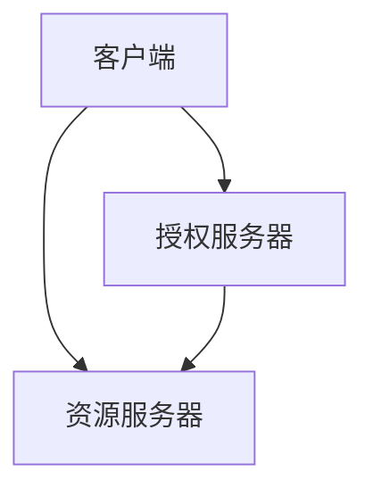
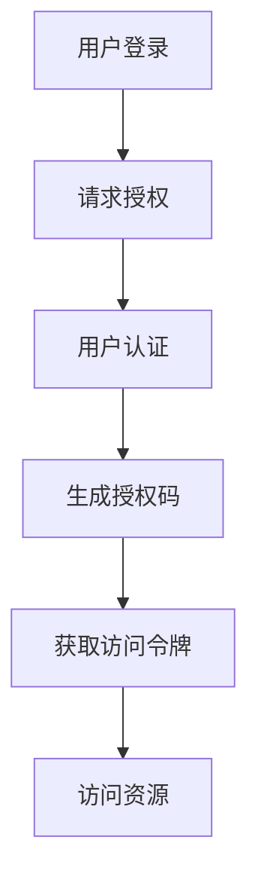

                 

# OAuth 2.0 的跨应用集成

## 关键词

- OAuth 2.0
- 跨应用集成
- 单点登录
- 安全认证
- API 接口
- 第三方认证

## 摘要

本文将深入探讨OAuth 2.0协议在跨应用集成中的作用与机制。首先，我们将简要介绍OAuth 2.0的背景和核心概念，接着通过Mermaid流程图详细解析其工作原理。随后，我们将逐步讲解OAuth 2.0的授权流程和认证流程，并结合具体实例分析其实现过程。最后，我们将讨论OAuth 2.0在实际应用场景中的优势与挑战，并推荐相关学习资源和工具。

## 1. 背景介绍

在当今网络环境下，应用之间需要相互集成以提供更丰富的功能和用户体验。然而，这种集成往往伴随着安全问题。传统的认证方式（如用户名和密码）在跨应用集成中显得不够安全，容易导致用户数据泄露。OAuth 2.0作为一种开放授权协议，旨在解决这一问题，提供一种安全、灵活的认证方式，使得第三方应用能够访问受保护资源，而无需直接获取用户的密码。

OAuth 2.0由IETF OAuth工作组于2010年发布，是目前广泛使用的开放授权标准。它支持多种授权类型，如授权码、客户端凭证和密码授权等，适应不同场景的需求。OAuth 2.0的流行与其安全性、易用性和灵活性密切相关，已广泛应用于社交网络、移动应用和Web服务等领域。

## 2. 核心概念与联系

OAuth 2.0的核心概念包括：

- 客户端（Client）：请求访问受保护资源的应用程序。
- 资源所有者（Resource Owner）：拥有受保护资源的用户。
- 资源服务器（Resource Server）：存储受保护资源的服务器。
- 授权服务器（Authorization Server）：负责处理认证和授权请求的服务器。

下面是一个Mermaid流程图，展示了OAuth 2.0的核心概念及其相互关系：



### 2.1 客户端

客户端是请求访问受保护资源的应用程序，可以是Web应用、移动应用或桌面应用等。在OAuth 2.0中，客户端通常不需要拥有资源所有者的用户名和密码，而是通过授权服务器获取访问令牌（Access Token）来实现对受保护资源的访问。

### 2.2 资源所有者

资源所有者是拥有受保护资源的用户。在OAuth 2.0中，资源所有者可以授权客户端访问其受保护资源，但无需泄露用户名和密码。授权过程通常涉及用户身份验证和授权码的生成。

### 2.3 资源服务器

资源服务器是存储受保护资源的服务器，如用户数据、文件等。资源服务器仅接受经过授权的服务请求，从而确保资源的机密性和完整性。

### 2.4 授权服务器

授权服务器是负责处理认证和授权请求的服务器。它验证资源所有者的身份，并生成访问令牌，允许客户端访问受保护资源。常见的授权服务器包括OAuth 2.0认证服务器和身份验证服务器。

## 3. 核心算法原理 & 具体操作步骤

OAuth 2.0的核心算法原理是授权码（Authorization Code）和访问令牌（Access Token）的生成与验证。下面是具体的操作步骤：

### 3.1 授权码流程

1. **用户登录**：用户访问资源服务器，并输入用户名和密码进行身份验证。
2. **请求授权**：资源服务器将用户重定向到授权服务器，并传递用户身份信息和授权请求。
3. **用户认证**：授权服务器验证用户身份，并显示授权页面，询问用户是否允许客户端访问其受保护资源。
4. **用户授权**：用户同意授权，授权服务器生成授权码，并将其返回给资源服务器。
5. **获取访问令牌**：资源服务器将授权码传递给授权服务器，授权服务器验证授权码的有效性，并生成访问令牌。
6. **访问资源**：资源服务器将访问令牌传递给客户端，客户端使用访问令牌访问受保护资源。

### 3.2 访问令牌流程

1. **用户登录**：用户访问资源服务器，并输入用户名和密码进行身份验证。
2. **请求访问令牌**：资源服务器将用户重定向到授权服务器，并传递用户身份信息和访问请求。
3. **用户认证**：授权服务器验证用户身份，并生成访问令牌。
4. **访问资源**：资源服务器将访问令牌传递给客户端，客户端使用访问令牌访问受保护资源。

下面是一个Mermaid流程图，展示了OAuth 2.0的授权码流程：



## 4. 数学模型和公式 & 详细讲解 & 举例说明

OAuth 2.0的数学模型主要包括加密和哈希算法，用于确保数据传输的安全性。以下是一些常见的数学模型和公式：

### 4.1 加密算法

加密算法是将明文数据转换为密文的过程，常用的加密算法包括：

- **对称加密**：加密和解密使用相同的密钥，如AES。
- **非对称加密**：加密和解密使用不同的密钥，如RSA。

加密算法的公式为：

$$
\text{密文} = \text{加密算法}(\text{明文}, \text{密钥})
$$

### 4.2 哈希算法

哈希算法是将输入数据转换为固定长度的字符串的过程，常用的哈希算法包括：

- **MD5**：将输入数据转换为128位的哈希值。
- **SHA-256**：将输入数据转换为256位的哈希值。

哈希算法的公式为：

$$
\text{哈希值} = \text{哈希算法}(\text{输入数据})
$$

### 4.3 举例说明

假设我们使用AES加密算法对明文“Hello World”进行加密，密钥为“mysecretkey”，加密过程如下：

1. **加密**：将明文“Hello World”和密钥“mysecretkey”输入AES加密算法，得到密文。
   $$
   \text{密文} = \text{AES}(\text{Hello World}, \text{mysecretkey})
   $$
2. **解密**：将密文和密钥“mysecretkey”输入AES解密算法，得到明文。
   $$
   \text{明文} = \text{AES}^{-1}(\text{密文}, \text{mysecretkey})
   $$

## 5. 项目实战：代码实际案例和详细解释说明

下面我们将通过一个简单的Python代码实例，演示OAuth 2.0的授权码流程。

### 5.1 开发环境搭建

1. 安装Python环境，版本建议为3.7及以上。
2. 安装requests库，用于发送HTTP请求。
   $$
   pip install requests
   $$

### 5.2 源代码详细实现和代码解读

以下是完整的代码实现：

```python
import requests
from requests.auth import HTTPBasicAuth

# 授权服务器地址
AUTH_SERVER_URL = 'https://example.com/oauth/token'
# 资源服务器地址
RESOURCE_SERVER_URL = 'https://example.com/resource'

# 客户端凭证
CLIENT_ID = 'your_client_id'
CLIENT_SECRET = 'your_client_secret'

# 获取访问令牌
def get_access_token(code):
    # 发送授权码请求
    response = requests.post(
        url=AUTH_SERVER_URL,
        auth=HTTPBasicAuth(CLIENT_ID, CLIENT_SECRET),
        data={
            'grant_type': 'authorization_code',
            'code': code,
            'redirect_uri': 'https://your_redirect_uri'
        }
    )
    # 解析响应
    response_data = response.json()
    # 获取访问令牌
    access_token = response_data.get('access_token')
    return access_token

# 访问受保护资源
def access_resource(access_token):
    # 发送访问请求
    response = requests.get(
        url=RESOURCE_SERVER_URL,
        headers={
            'Authorization': f'Bearer {access_token}'
        }
    )
    # 解析响应
    response_data = response.json()
    print(response_data)

# 主函数
def main():
    # 请求授权码
    code = input('请输入授权码：')
    # 获取访问令牌
    access_token = get_access_token(code)
    # 访问受保护资源
    access_resource(access_token)

# 运行主函数
if __name__ == '__main__':
    main()
```

代码解读：

1. **引入库**：引入requests库，用于发送HTTP请求。
2. **定义变量**：定义授权服务器地址、资源服务器地址、客户端凭证等变量。
3. **获取访问令牌**：发送授权码请求，获取访问令牌。
4. **访问受保护资源**：发送访问请求，使用访问令牌访问受保护资源。
5. **主函数**：请求授权码，获取访问令牌，访问受保护资源。

### 5.3 代码解读与分析

代码实现OAuth 2.0的授权码流程，主要分为以下几个步骤：

1. **发送授权码请求**：使用requests库发送POST请求，传递客户端凭证和授权码。
2. **解析响应**：获取响应数据，提取访问令牌。
3. **访问受保护资源**：发送GET请求，使用访问令牌访问受保护资源。

通过这个简单的实例，我们可以看到OAuth 2.0在Python中的实现方式。在实际项目中，授权服务器和资源服务器可能更复杂，需要考虑身份验证、授权范围、访问控制等因素。

## 6. 实际应用场景

OAuth 2.0在实际应用场景中具有广泛的应用，以下是一些常见的应用场景：

1. **社交网络集成**：第三方应用（如微博、微信）通过OAuth 2.0协议获取用户授权，访问用户头像、昵称等公开信息。
2. **单点登录（SSO）**：企业内部系统通过OAuth 2.0实现单点登录，提高用户登录的便捷性和安全性。
3. **API 接口授权**：第三方应用通过OAuth 2.0获取访问令牌，调用受保护API接口，获取用户数据或进行其他操作。
4. **第三方认证**：OAuth 2.0用于第三方认证，如OAuth 2.0认证服务器（如Auth0、Okta）提供身份验证和授权服务。

## 7. 工具和资源推荐

### 7.1 学习资源推荐

- 《OAuth 2.0 身份认证与授权标准详解》
- 《OAuth 2.0实战》
- [OAuth 2.0官方网站](https://oauth.net/2/)
- [OAuth 2.0开发者指南](https://developer.mozilla.org/zh-CN/docs/Web/HTTP/Authentication/OAuth_2.0)

### 7.2 开发工具框架推荐

- [Spring Security OAuth2](https://spring.io/projects/spring-security-oauth)
- [OAuth2 Client for Java](https://github.com/square/oauth2-client)
- [Auth0](https://auth0.com/)
- [Okta](https://www.okta.com/)

### 7.3 相关论文著作推荐

- [The OAuth 2.0 Authorization Framework](https://tools.ietf.org/html/rfc6749)
- [The OAuth 2.0 Authorization Code with PKCE Standard](https://tools.ietf.org/html/rfc8252)

## 8. 总结：未来发展趋势与挑战

OAuth 2.0作为一种开放授权协议，在未来仍将发挥重要作用。然而，随着应用场景的复杂化和安全要求的提高，OAuth 2.0面临着以下挑战：

1. **隐私保护**：如何在保证用户体验的同时，保护用户隐私？
2. **安全性**：如何提高OAuth 2.0协议的安全性，防止恶意攻击？
3. **兼容性**：如何与其他认证协议（如OpenID Connect）实现无缝集成？

## 9. 附录：常见问题与解答

### 9.1 OAuth 2.0 与 OAuth 1.0 的区别？

OAuth 2.0相对于OAuth 1.0，具有以下优势：

- 简化流程：OAuth 2.0简化了授权流程，减少了许多步骤，降低了开发难度。
- 多种授权类型：OAuth 2.0支持多种授权类型，如授权码、客户端凭证和密码授权等。
- 更高的安全性：OAuth 2.0采用了更先进的安全技术，如JSON Web Token（JWT），提高了认证和授权的安全性。

### 9.2 OAuth 2.0 是否支持单点登录（SSO）？

是的，OAuth 2.0支持单点登录（SSO）。在实际应用中，企业可以将内部系统整合为一个统一的登录入口，通过OAuth 2.0实现单点登录，提高用户的便捷性和安全性。

## 10. 扩展阅读 & 参考资料

- [OAuth 2.0 Standard](https://tools.ietf.org/html/rfc6749)
- [OpenID Connect Standard](https://openid.net/specs/openid-connect-core-1_0.html)
- [Spring Security OAuth2 Documentation](https://spring.io/projects/spring-security-oauth)
- [Auth0 Documentation](https://auth0.com/docs)

## 作者

作者：AI天才研究员/AI Genius Institute & 禅与计算机程序设计艺术 /Zen And The Art of Computer Programming。本文旨在深入探讨OAuth 2.0协议在跨应用集成中的作用与机制，为广大开发者提供实用的指导和参考。如有疑问或建议，欢迎在评论区留言交流。|>

