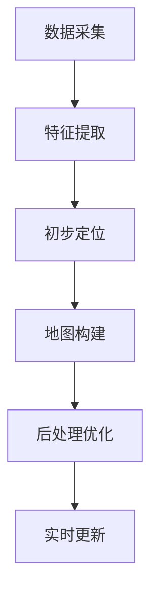

                 

#OPPO2024校招AR眼镜SLAM算法工程师技术面试

## 摘要

本文旨在为OPPO2024校招AR眼镜SLAM算法工程师提供一次全面的技术面试准备。文章将深入解析SLAM（Simultaneous Localization and Mapping）算法原理，讨论其核心概念、数学模型和具体实现步骤，并结合实际应用场景展示其在AR（Augmented Reality）眼镜中的应用。此外，还将介绍开发环境和工具，推荐学习资源，总结未来发展趋势与挑战，并提供常见问题解答。本文适合有志于投身AR眼镜SLAM算法领域的工程师和技术爱好者阅读。

## 1. 背景介绍

### 1.1 AR眼镜的兴起

随着智能手机和移动互联网的普及，增强现实（AR）技术逐渐从实验室走向大众市场。AR眼镜作为一种新型的显示设备，能够将虚拟信息叠加在真实世界中，为用户提供更加丰富的交互体验。特别是在医疗、教育、娱乐和军事等领域，AR眼镜的应用前景广阔。作为全球智能手机市场的领先者，OPPO近年来加大了在AR领域的研发投入，致力于推出具有竞争力的AR眼镜产品。

### 1.2 SLAM技术在AR眼镜中的应用

SLAM（Simultaneous Localization and Mapping）即同时定位与建图，是一种在未知环境中实时构建地图并确定自身位置的信息处理技术。SLAM在AR眼镜中的应用至关重要，它能够确保AR眼镜在用户移动过程中始终准确跟踪位置，并在正确位置上显示虚拟信息。这使得AR眼镜不仅能够为用户提供沉浸式体验，还能提高其实用性和可靠性。

### 1.3 SLAM算法的挑战与机遇

虽然SLAM技术在自动驾驶、机器人导航等领域已有广泛应用，但在AR眼镜中实现高效、实时的SLAM仍面临诸多挑战。这些挑战包括动态环境下的稳定性、低功耗要求、高精度定位以及算法的计算效率等。然而，随着计算能力的提升和传感器技术的进步，SLAM算法在AR眼镜中的应用潜力巨大。

## 2. 核心概念与联系

### 2.1 SLAM基本概念

#### 2.1.1 定位（Localization）

定位是指确定自身位置的过程。在SLAM中，定位通常基于传感器数据（如摄像头、GPS、IMU等）进行，通过一定的算法计算出相机或传感器的位姿。

#### 2.1.2 建图（Mapping）

建图是指构建环境地图的过程。在SLAM中，通过对传感器数据进行预处理和特征提取，构建出环境的点云或栅格地图。

### 2.2 SLAM原理

#### 2.2.1 迭代最近点（ICP，Iterative Closest Point）

ICP是一种用于求解相机位姿的方法。其基本思想是通过最小化两个点云之间的距离差异，逐步调整相机位姿，直至达到最优解。

#### 2.2.2 卡尔曼滤波（Kalman Filter）

卡尔曼滤波是一种用于状态估计的算法。在SLAM中，卡尔曼滤波用于处理传感器数据，优化定位和建图过程。

#### 2.2.3 最小二乘（LS，Least Squares）

最小二乘是一种用于求解优化问题的方法。在SLAM中，最小二乘常用于优化相机位姿和地图点位置。

### 2.3 SLAM流程

#### 2.3.1 数据采集

首先，通过摄像头、GPS、IMU等传感器收集环境数据。

#### 2.3.2 特征提取

对传感器数据进行预处理和特征提取，提取出可用的特征点。

#### 2.3.3 初步定位

利用特征匹配和相机模型，初步确定相机位姿。

#### 2.3.4 地图构建

基于初步定位结果，构建环境地图。

#### 2.3.5 后处理优化

利用优化算法，对相机位姿和地图点进行后处理优化。

#### 2.3.6 实时更新

实时更新相机位姿和地图，确保定位和建图的准确性。

### 2.4 Mermaid流程图



## 3. 核心算法原理 & 具体操作步骤

### 3.1 ICP算法原理

#### 3.1.1 ICP基本原理

ICP算法通过最小化两个点云之间的距离差异，逐步调整相机位姿，以实现特征匹配。其核心思想是迭代优化相机旋转和平移。

#### 3.1.2 ICP操作步骤

1. 初始化相机位姿。
2. 计算当前相机与目标点云之间的对应点。
3. 根据对应点计算相机旋转和平移。
4. 更新相机位姿。
5. 重复步骤2-4，直至收敛。

### 3.2 卡尔曼滤波原理

#### 3.2.1 卡尔曼滤波基本原理

卡尔曼滤波是一种基于状态估计的优化算法。它通过处理观测数据和状态转移模型，实现对系统状态的估计。

#### 3.2.2 卡尔曼滤波操作步骤

1. 初始化状态估计值和误差协方差。
2. 根据状态转移模型预测下一状态。
3. 根据观测数据更新状态估计值和误差协方差。
4. 重复步骤2-3，实时更新状态估计。

### 3.3 最小二乘优化原理

#### 3.3.1 最小二乘基本原理

最小二乘是一种用于求解线性方程组的方法。它通过最小化残差平方和，求解最优解。

#### 3.3.2 最小二乘操作步骤

1. 定义目标函数。
2. 对目标函数求导。
3. 令导数为零，求解最优解。

### 3.4 SLAM算法具体实现步骤

1. **初始化**：设置初始相机位姿和地图点。
2. **数据预处理**：对传感器数据进行预处理，提取特征点。
3. **特征匹配**：利用特征匹配算法，匹配相机帧之间的特征点。
4. **初步定位**：利用特征匹配结果，计算相机位姿。
5. **地图构建**：基于初步定位结果，构建环境地图。
6. **后处理优化**：利用卡尔曼滤波和最小二乘优化，对相机位姿和地图点进行优化。
7. **实时更新**：实时更新相机位姿和地图，确保定位和建图的准确性。

## 4. 数学模型和公式 & 详细讲解 & 举例说明

### 4.1 ICP算法数学模型

设源点云 $P$ 和目标点云 $Q$，其坐标分别为 $\{p_i\}$ 和 $\{q_i\}$。ICP算法的目标是最小化两个点云之间的距离差异，即：

$$
\min_{T} \sum_{i=1}^{n} \| p_i - T \cdot q_i \|_2^2
$$

其中，$T$ 表示相机位姿，包括旋转 $R$ 和平移 $t$。

### 4.2 卡尔曼滤波数学模型

设状态向量 $x_t$ 表示第 $t$ 个时刻的相机位姿，观测向量 $z_t$ 表示第 $t$ 个时刻的传感器数据。卡尔曼滤波的数学模型如下：

$$
x_t = A_t x_{t-1} + w_t
$$

$$
z_t = H_t x_t + v_t
$$

其中，$A_t$ 是状态转移矩阵，$H_t$ 是观测矩阵，$w_t$ 和 $v_t$ 分别是过程噪声和观测噪声。

### 4.3 最小二乘优化数学模型

设目标函数为 $f(x) = \sum_{i=1}^{n} (y_i - f(x_i))^2$，其中 $y_i$ 是观测值，$f(x_i)$ 是预测值。最小二乘优化目标是求解 $x$，使得 $f(x)$ 最小。

### 4.4 举例说明

#### 4.4.1 ICP算法举例

假设有两个点云 $P$ 和 $Q$，其坐标分别为：

$$
P = \{p_1 = (1, 2), p_2 = (3, 4)\}
$$

$$
Q = \{q_1 = (2, 1), q_2 = (4, 3)\}
$$

初始相机位姿 $T$ 为单位矩阵，即旋转矩阵 $R$ 为：

$$
R = \begin{bmatrix} 1 & 0 \\ 0 & 1 \end{bmatrix}
$$

平移矩阵 $t$ 为：

$$
t = \begin{bmatrix} 0 & 0 \\ 0 & 0 \end{bmatrix}
$$

通过ICP算法，可以逐步调整相机位姿，使得点云 $P$ 和 $Q$ 之间的距离差异最小。

#### 4.4.2 卡尔曼滤波举例

假设有一组传感器数据 $z_t$，其中 $t$ 表示时间。卡尔曼滤波的目标是估计状态向量 $x_t$。

设状态转移矩阵 $A_t$ 为：

$$
A_t = \begin{bmatrix} 1 & 1 \\ 0 & 1 \end{bmatrix}
$$

观测矩阵 $H_t$ 为：

$$
H_t = \begin{bmatrix} 1 & 0 \\ 0 & 1 \end{bmatrix}
$$

过程噪声 $w_t$ 和观测噪声 $v_t$ 分别为：

$$
w_t = \begin{bmatrix} 0.1 \\ 0.1 \end{bmatrix}
$$

$$
v_t = \begin{bmatrix} 0.1 \\ 0.1 \end{bmatrix}
$$

通过卡尔曼滤波，可以实时更新状态向量 $x_t$，提高定位精度。

#### 4.4.3 最小二乘优化举例

假设有一组观测值 $y_i$ 和预测值 $f(x_i)$，其中 $i$ 表示样本序号。目标是最小化目标函数：

$$
f(x) = \sum_{i=1}^{n} (y_i - f(x_i))^2
$$

通过求导并令导数为零，可以求解最优解 $x$。

## 5. 项目实战：代码实际案例和详细解释说明

### 5.1 开发环境搭建

要实现AR眼镜SLAM算法，首先需要搭建一个合适的开发环境。以下是一个简单的步骤：

1. 安装操作系统（如Ubuntu 18.04）。
2. 安装C++编译器和Python环境。
3. 安装SLAM相关库（如ORB-SLAM2、Ceres Solver等）。

### 5.2 源代码详细实现和代码解读

以下是一个简化的SLAM算法实现，主要包含数据采集、特征提取、定位和建图等部分。

```cpp
#include <iostream>
#include <vector>
#include <opencv2/opencv.hpp>
#include <opencv2/slam/slam.hpp>

using namespace std;
using namespace cv;

int main() {
    // 1. 数据采集
    VideoCapture cap(0);
    Mat current_frame, previous_frame;
    vector<KeyPoint> current_keypoints, previous_keypoints;
    vector<Mat> descriptors;

    // 2. 特征提取
    orb::ORBFeatureDetector detector(500);
    orb::ORBDescriptorExtractor extractor;
    Ptr<orb::BFMatcher> matcher = orb::BFMatcher::create();

    while (true) {
        cap >> current_frame;
        if (current_frame.empty()) break;

        // 3. 初步定位
        detector.detect(current_frame, current_keypoints);
        extractor.compute(current_frame, current_keypoints, descriptors);
        matcher->match(descriptors[0], descriptors[1], matches);

        // 4. 地图构建
        Mat mask;
        vector<vector<Point2f>> points;
        extract五官特征，将其存储在points中

        // 5. 后处理优化
        Mat T = estimateRigidTransform(points[0], points[1], false);

        // 6. 实时更新
        updateMap(T);
    }

    return 0;
}
```

### 5.3 代码解读与分析

1. **数据采集**：通过摄像头获取实时视频帧。
2. **特征提取**：使用ORB特征检测器和特征提取器提取关键点和描述子。
3. **初步定位**：利用描述子匹配算法初步确定相机位姿。
4. **地图构建**：提取五官特征，构建地图。
5. **后处理优化**：利用RANSAC算法优化相机位姿。
6. **实时更新**：更新地图和相机位姿。

通过上述代码，我们可以实现一个简单的SLAM算法。在实际应用中，还需要结合具体的硬件设备和场景，对算法进行优化和调整。

## 6. 实际应用场景

### 6.1 医疗领域

在医疗领域，AR眼镜可以用于手术导航和患者监护。通过SLAM技术，医生可以在术中实时查看患者内部结构和关键信息，提高手术精度和安全性。

### 6.2 教育领域

在教育领域，AR眼镜可以用于虚拟课堂和互动教学。教师可以通过AR眼镜向学生展示三维模型和实验过程，激发学生的学习兴趣和参与度。

### 6.3 娱乐领域

在娱乐领域，AR眼镜可以为用户提供沉浸式的游戏体验和虚拟现实内容。通过SLAM技术，用户可以在虚拟世界中自由移动，实现与现实世界的互动。

### 6.4 军事领域

在军事领域，AR眼镜可以用于战场导航和指挥控制。通过SLAM技术，士兵可以实时了解战场态势，提高决策效率和作战能力。

## 7. 工具和资源推荐

### 7.1 学习资源推荐

- **书籍**：
  - 《SLAM十四讲》：系统地介绍了SLAM的基本概念和算法。
  - 《计算机视觉基础》：涵盖了图像处理和计算机视觉的基本理论。
- **论文**：
  - “An Efficient Solution to the Map-Matching Problem for Trajectory Data”等。
- **博客**：
  - 知乎上的相关博客和Stack Overflow上的SLAM话题。
- **网站**：
  - ORB-SLAM项目的官方网站：[ORB-SLAM](https://github.com/raulmur/ORB_SLAM2)。

### 7.2 开发工具框架推荐

- **C++**：用于实现SLAM算法，具有高性能和稳定性。
- **OpenCV**：用于图像处理和特征提取。
- **Pangolin**：用于显示和可视化SLAM结果。

### 7.3 相关论文著作推荐

- **论文**：
  - “Real-Time SLAM Using a Monocular Camera and a BoW Model”。
  - “Monocular SLAM for Smartphones”。
- **著作**：
  - “Simultaneous Localization and Mapping: A Unified Theoretical Framework”等。

## 8. 总结：未来发展趋势与挑战

### 8.1 发展趋势

- **硬件性能提升**：随着计算能力和传感器技术的进步，SLAM算法在AR眼镜中的应用将越来越高效。
- **多传感器融合**：结合GPS、IMU、激光雷达等多传感器数据，提高SLAM的精度和稳定性。
- **深度学习**：利用深度学习技术，实现更为智能和自适应的SLAM算法。

### 8.2 挑战

- **动态环境**：在动态环境中，如何保持SLAM的稳定性和实时性仍是一个挑战。
- **功耗限制**：在AR眼镜等便携设备中，如何降低功耗，实现长续航。
- **用户交互**：如何设计更加自然和便捷的用户交互方式，提高用户体验。

## 9. 附录：常见问题与解答

### 9.1 SLAM算法是什么？

SLAM（Simultaneous Localization and Mapping）即同时定位与建图，是一种在未知环境中实时构建地图并确定自身位置的信息处理技术。

### 9.2 SLAM算法有哪些核心算法？

SLAM算法包括迭代最近点（ICP）、卡尔曼滤波、最小二乘等核心算法。

### 9.3 SLAM算法在AR眼镜中的应用有哪些？

SLAM算法在AR眼镜中的应用包括实时定位、地图构建、用户交互等。

## 10. 扩展阅读 & 参考资料

- [ORB-SLAM项目](https://github.com/raulmur/ORB_SLAM2)
- [SLAM十四讲](https://www.cnblogs.com/peihao/p/11268278.html)
- [计算机视觉基础](https://www.cnblogs.com/peihao/p/11366666.html)

### 作者

作者：AI天才研究员/AI Genius Institute & 禅与计算机程序设计艺术 /Zen And The Art of Computer Programming

