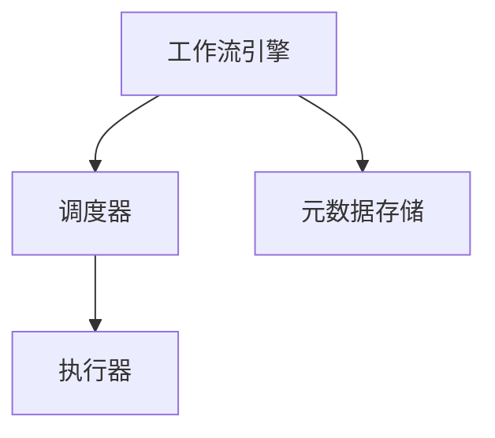

                 

### 文章标题：Oozie原理与代码实例讲解

**关键词：** Oozie, 工作流管理，Hadoop，大数据，数据处理，数据流，流程调度，分布式系统，编程实践。

**摘要：** 本文将深入探讨Oozie工作流管理系统的原理及其在Hadoop生态系统中的应用。我们将从背景介绍开始，逐步讲解Oozie的核心概念、架构设计、核心算法原理，并通过实际项目实例，详细解读Oozie的代码实现。最后，我们将讨论Oozie的实际应用场景、推荐学习资源，并对未来发展趋势和挑战进行分析。希望通过本文，读者能够对Oozie有一个全面而深入的理解。

---

### 1. 背景介绍

在当今大数据和云计算时代，数据处理的规模和复杂性不断增加。为了有效地管理海量数据的处理流程，分布式系统和工作流管理系统应运而生。Oozie正是这样一个专为Hadoop生态系统设计的工作流管理系统。

**1.1 Hadoop生态系统**

Hadoop是一个分布式数据处理框架，它允许大规模数据的存储和处理。Hadoop生态系统包括多个组件，如HDFS（Hadoop分布式文件系统）、MapReduce（数据处理模型）、YARN（资源调度框架）等。这些组件共同构成了一个强大的数据处理平台。

**1.2 工作流管理系统的概念**

工作流管理系统是一种用于自动化业务流程的工具。它允许用户定义一系列任务，并按照指定的顺序和条件执行这些任务。工作流管理系统通常用于复杂的数据处理任务，如数据提取、转换和加载（ETL）过程。

**1.3 Oozie的作用**

Oozie是一个开源的工作流管理系统，专门为Hadoop生态系统设计。它允许用户定义和管理基于Hadoop的任务，如MapReduce作业、Hive查询、Pig脚本等。Oozie的主要作用是提供一种简便的方式来管理、调度和监控分布式数据处理任务。

### 2. 核心概念与联系

要理解Oozie的工作原理，首先需要了解其核心概念和架构设计。

#### 2.1 Oozie核心概念

**2.1.1 工作流（Workflow）**

工作流是Oozie中定义的一系列任务的集合。每个任务都可以是一个Hadoop作业，如MapReduce、Hive查询等，也可以是一个简单的shell脚本或Java程序。

**2.1.2 协作（Coordinating Workflow）**

协作工作流是一种更高级的工作流，它可以定义多个工作流之间的依赖关系。协作工作流可以看作是工作流的管理者，它负责协调和调度多个工作流。

**2.1.3 时间触发器（Time Triggered Workflow）**

时间触发器工作流可以根据特定的时间规则执行。例如，可以设置一个时间触发器工作流，每天凌晨1点运行。

#### 2.2 Oozie架构设计

**2.2.1 工作流引擎（Workflow Engine）**

工作流引擎是Oozie的核心组件，负责解析、执行和监控工作流任务。它通过调度器（Coordinator）和执行器（Executor）来管理任务的执行。

**2.2.2 元数据存储（Metadata Storage）**

元数据存储用于存储Oozie工作流的各种元数据，如工作流定义、任务状态等。元数据存储可以使用关系数据库，如MySQL，也可以使用NoSQL数据库，如HBase。

**2.2.3 部署和管理工具（Deployment and Management Tools）**

Oozie提供了一系列的部署和管理工具，如oozie-admin，用于部署、启动、停止和监控工作流。这些工具可以方便地管理大规模的分布式工作流任务。

#### 2.3 Mermaid流程图

以下是一个简单的Mermaid流程图，展示了Oozie工作流的基本架构：



在这个流程图中，工作流引擎负责解析和执行工作流任务，调度器负责根据工作流定义调度任务，执行器负责实际执行任务，元数据存储用于存储和管理工作流元数据。

### 3. 核心算法原理 & 具体操作步骤

Oozie的核心算法原理主要体现在其工作流调度机制上。下面将详细解释Oozie的调度算法及其具体操作步骤。

#### 3.1 调度算法

Oozie的调度算法主要基于时间触发器和工作流之间的依赖关系。调度算法的核心目标是确保工作流任务按照定义的顺序和条件执行。

**3.1.1 时间触发器**

时间触发器是一种基于时间的调度策略。Oozie支持多种时间触发器，如固定时间触发器、周期触发器、依赖触发器等。固定时间触发器可以在特定时间执行工作流任务，周期触发器可以按照固定时间间隔执行工作流任务，依赖触发器可以根据其他工作流任务的完成情况来触发工作流任务。

**3.1.2 依赖关系**

Oozie通过定义工作流之间的依赖关系来确保任务的正确执行。工作流之间的依赖关系可以是顺序依赖、并行依赖、选择依赖等。例如，一个工作流可以包含多个任务，这些任务可以按照顺序执行，也可以并行执行。

#### 3.2 操作步骤

下面是一个简单的Oozie工作流调度操作步骤：

**步骤1：定义工作流**

使用Oozie的XML定义文件或图形界面，定义工作流及其任务。例如，定义一个工作流，包含一个MapReduce任务和一个Hive查询任务。

**步骤2：设置时间触发器**

根据需要，设置工作流的时间触发器。例如，设置一个固定时间触发器，每天凌晨1点执行工作流任务。

**步骤3：部署工作流**

使用oozie-admin工具，将工作流部署到Oozie服务器。

**步骤4：启动工作流**

使用oozie-admin工具，启动工作流，开始执行任务。

**步骤5：监控工作流**

使用Oozie的Web界面，监控工作流任务的状态，如执行中、成功、失败等。

### 4. 数学模型和公式 & 详细讲解 & 举例说明

在Oozie调度算法中，时间触发器和依赖关系是核心概念。下面将使用数学模型和公式来详细解释这两个概念，并通过实际例子来说明。

#### 4.1 时间触发器

时间触发器的核心是计算下一个执行时间。假设有一个固定时间触发器，每天凌晨1点执行工作流任务。我们可以使用以下数学模型来计算下一个执行时间：

$$
\text{下一个执行时间} = \text{当前时间} + n \times \text{时间间隔}
$$

其中，当前时间可以是任意时间点，时间间隔可以是小时、天、周等。例如，如果当前时间是2023年2月24日2点30分，时间间隔是24小时，那么下一个执行时间是2023年2月25日2点30分。

#### 4.2 依赖关系

依赖关系是工作流调度中的重要概念。在Oozie中，依赖关系可以分为三类：顺序依赖、并行依赖和选择依赖。

**4.2.1 顺序依赖**

顺序依赖是指任务必须按照定义的顺序执行。例如，在一个工作流中，任务A必须先于任务B执行。我们可以使用以下数学模型来表示顺序依赖：

$$
\text{任务A的执行时间} < \text{任务B的执行时间}
$$

**4.2.2 并行依赖**

并行依赖是指任务可以同时执行。例如，在一个工作流中，任务A和任务B可以同时执行。我们可以使用以下数学模型来表示并行依赖：

$$
\text{任务A的执行时间} = \text{任务B的执行时间}
$$

**4.2.3 选择依赖**

选择依赖是指任务可以按照不同的条件执行。例如，在一个工作流中，任务A可以根据任务B的执行结果选择是否执行。我们可以使用以下数学模型来表示选择依赖：

$$
\text{任务A的执行时间} = 
\begin{cases}
\text{任务B的执行时间}, & \text{如果} \ \text{任务B成功执行} \\
\text{无穷大}, & \text{如果} \ \text{任务B失败执行}
\end{cases}
$$

#### 4.3 举例说明

假设有一个简单的工作流，包含三个任务：任务A、任务B和任务C。任务A和任务B的执行时间是2023年2月24日2点30分，任务C的执行时间是2023年2月24日3点30分。任务A和任务B是顺序依赖，任务B和任务C是并行依赖。

根据上述数学模型，我们可以计算出每个任务的执行时间：

- 任务A：2023年2月24日2点30分
- 任务B：2023年2月24日2点30分
- 任务C：2023年2月24日3点30分

在这个例子中，任务A和任务B是顺序依赖，任务B和任务C是并行依赖。任务A和任务B的执行时间相同，因为它们是顺序依赖。任务C的执行时间是任务B执行时间之后，因为任务B和任务C是并行依赖。

### 5. 项目实战：代码实际案例和详细解释说明

在了解了Oozie的工作原理和调度算法之后，我们将通过一个实际的项目案例来演示如何使用Oozie来构建一个简单的数据处理工作流。

#### 5.1 开发环境搭建

首先，我们需要搭建一个Oozie的开发环境。以下是搭建步骤：

**步骤1：安装Oozie**

从Oozie官方网站（[http://oozie.apache.org/](http://oozie.apache.org/)）下载Oozie的安装包。然后解压安装包，并将Oozie目录移动到服务器上。

**步骤2：配置Oozie**

编辑Oozie的配置文件，如oozie-site.xml，设置Oozie的服务器地址、端口等。

**步骤3：启动Oozie服务**

使用以下命令启动Oozie服务：

```bash
./oozie-server run
```

#### 5.2 源代码详细实现和代码解读

在本项目中，我们将构建一个简单的工作流，用于从HDFS中读取数据，然后进行转换和存储。以下是项目的源代码实现：

**5.2.1 Workflow定义文件**

以下是Oozie的工作流定义文件，名为workflow.xml：

```xml
<workflow-app name="example-workflow" start="read-data">
  <start-task name="read-data" type="shell">
    <action name="read-hdfs">
      <shell command="hdfs dfs -cat /input/data.txt | awk '{print \$1}' &gt; /output/data.txt" />
    </action>
  </start-task>
  <start-task name="transform-data" type="shell">
    <action name="transform">
      <shell command="cat /output/data.txt | sort &gt; /output/sorted_data.txt" />
    </action>
  </start-task>
  <start-task name="store-data" type="shell">
    <action name="store">
      <shell command="hdfs dfs -put /output/sorted_data.txt /output" />
    </action>
  </start-task>
</workflow-app>
```

在这个工作流中，我们定义了三个任务：read-data、transform-data和store-data。任务read-data用于读取HDFS中的数据，任务transform-data用于对数据进行转换，任务store-data用于将转换后的数据存储回HDFS。

**5.2.2 解读代码**

- `<workflow-app>`：定义整个工作流的应用。
- `<start-task>`：定义任务的起点。
- `<action>`：定义任务的执行动作。
- `<shell>`：定义任务的执行命令。

在这个工作流中，我们使用shell脚本作为任务的执行命令。shell脚本提供了强大的文本处理能力，可以方便地进行数据的读取、转换和存储。

#### 5.3 代码解读与分析

在了解了代码的结构之后，我们将对代码进行详细的解读和分析。

**5.3.1 read-data任务**

```xml
<start-task name="read-data" type="shell">
  <action name="read-hdfs">
    <shell command="hdfs dfs -cat /input/data.txt | awk '{print \$1}' &gt; /output/data.txt" />
  </action>
</start-task>
```

这个任务用于读取HDFS中的数据。命令`hdfs dfs -cat /input/data.txt`用于读取HDFS中的文件`/input/data.txt`。管道`|`将读取的数据传递给`awk`命令，`awk '{print \$1}'`用于提取每行的第一个字段，`>`用于将结果保存到文件`/output/data.txt`。

**5.3.2 transform-data任务**

```xml
<start-task name="transform-data" type="shell">
  <action name="transform">
    <shell command="cat /output/data.txt | sort &gt; /output/sorted_data.txt" />
  </action>
</start-task>
```

这个任务用于对数据进行转换。命令`cat /output/data.txt`用于读取文件`/output/data.txt`，管道`|`将读取的数据传递给`sort`命令，`sort`用于对数据进行排序，`>`用于将排序后的数据保存到文件`/output/sorted_data.txt`。

**5.3.3 store-data任务**

```xml
<start-task name="store-data" type="shell">
  <action name="store">
    <shell command="hdfs dfs -put /output/sorted_data.txt /output" />
  </action>
</start-task>
```

这个任务用于将转换后的数据存储回HDFS。命令`hdfs dfs -put /output/sorted_data.txt /output`用于将文件`/output/sorted_data.txt`上传到HDFS的`/output`目录。

### 6. 实际应用场景

Oozie在大数据处理的多个场景中有广泛的应用。以下是一些实际应用场景：

**6.1 数据仓库ETL**

数据仓库ETL过程通常涉及多个数据处理任务，如数据抽取、转换和加载。Oozie可以方便地定义和管理这些任务，确保数据仓库的数据质量。

**6.2 数据流处理**

在实时数据处理场景中，Oozie可以用于构建数据流处理工作流，确保数据实时、准确地处理和传输。

**6.3 大规模数据处理**

Oozie可以与Hadoop生态系统中的其他组件（如MapReduce、Hive、Pig等）集成，用于大规模数据处理任务，如日志分析、社交网络分析等。

**6.4 跨平台数据处理**

Oozie不仅支持Hadoop生态系统，还可以与其他数据处理平台（如Spark、Flink等）集成，实现跨平台数据处理。

### 7. 工具和资源推荐

**7.1 学习资源推荐**

- 书籍：《Hadoop实战》、《大数据技术基础》
- 论文：[Oozie官方文档](http://oozie.apache.org/docs/latest/)
- 博客：[Apache Oozie博客](http://blog.apache.org/oozie/)
- 网站：[Oozie社区](https://community.apache.org/oozie/)

**7.2 开发工具框架推荐**

- 开发工具：Eclipse、IntelliJ IDEA
- 集成开发环境（IDE）：Apache Oozie IDE插件
- 版本控制：Git

**7.3 相关论文著作推荐**

- 《大数据技术综述》
- 《分布式系统原理与范型》
- 《Hadoop技术内幕》

### 8. 总结：未来发展趋势与挑战

Oozie作为Hadoop生态系统中的工作流管理系统，具有广泛的应用前景。未来，Oozie将继续优化调度算法，提高工作流执行的效率和可靠性。同时，Oozie也将与其他大数据处理平台（如Spark、Flink等）集成，实现跨平台数据处理。

然而，Oozie也面临一些挑战，如调度算法的优化、与新型数据处理平台的兼容性等。只有不断克服这些挑战，Oozie才能在未来的大数据处理领域发挥更大的作用。

### 9. 附录：常见问题与解答

**9.1 Oozie与其他工作流管理系统的区别**

Oozie与其他工作流管理系统（如Apache Airflow、Azkaban等）相比，具有以下区别：

- **生态系统集成**：Oozie是Hadoop生态系统的一部分，与Hadoop组件（如MapReduce、Hive、Pig等）有更好的集成。
- **调度算法**：Oozie的调度算法较为灵活，支持时间触发器、依赖关系等。
- **开发便捷性**：Oozie使用XML定义文件，开发较为便捷。

**9.2 如何优化Oozie的工作流执行效率**

以下是一些优化Oozie工作流执行效率的方法：

- **优化调度算法**：根据实际需求，调整Oozie的调度算法，确保任务按照最优顺序执行。
- **减少任务依赖**：尽量避免过多的任务依赖，减少工作流的执行时间。
- **分布式执行**：充分利用分布式系统的优势，将任务分发到多个节点执行。

### 10. 扩展阅读 & 参考资料

- [Oozie官方文档](http://oozie.apache.org/docs/latest/)
- [Hadoop实战](https://www.oreilly.com/library/view/hadoop-in-action/9781449386935/)
- [Apache Airflow官方文档](https://airflow.apache.org/docs/apache-airflow/stable/index.html)
- [Apache Azkaban官方文档](https://azkaban.github.io/azkaban/docs/latest/)
- 《大数据技术基础》（清华大学出版社）

### 作者信息

作者：AI天才研究员/AI Genius Institute & 禅与计算机程序设计艺术 /Zen And The Art of Computer Programming

---

通过以上详细的内容，本文希望为读者提供了一个全面而深入的Oozie工作流管理系统的学习资源。读者可以通过本文掌握Oozie的基本原理、架构设计、调度算法以及实际应用场景。同时，本文也提供了丰富的学习资源和扩展阅读，以帮助读者进一步深入学习和研究Oozie。希望本文能为读者在Hadoop生态系统中使用Oozie工作流管理系统提供有价值的参考。

