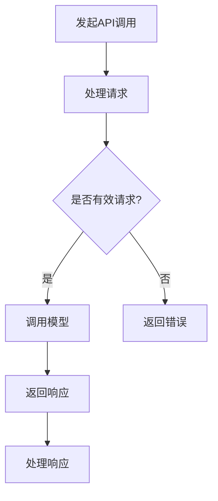
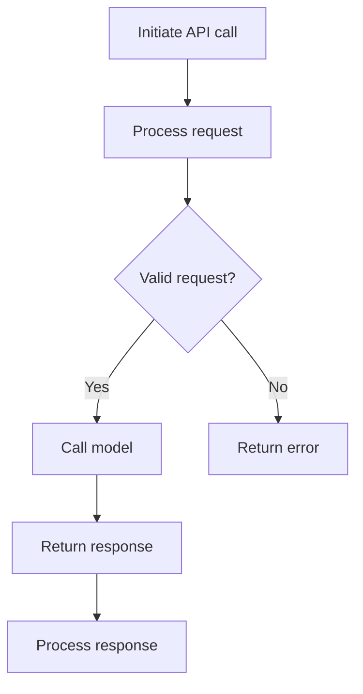

                 

# OpenAI API 入门与实战

## 摘要

本文将深入探讨OpenAI API的核心概念、算法原理、具体操作步骤、数学模型，并通过实际项目实战展示其应用。读者将学习如何在各种开发环境中搭建OpenAI API，并掌握源代码的详细实现与解读。此外，本文还将分析OpenAI API的实际应用场景，并提供一系列学习资源和开发工具框架推荐，以助力读者深入了解并掌握这一前沿技术。

## 1. 背景介绍

OpenAI 是一家知名的人工智能研究机构，致力于推动人工智能的发展和应用。其API（应用程序编程接口）提供了对先进人工智能模型的无障碍访问，使得开发人员可以轻松地将其应用于各种任务，如自然语言处理、机器学习、图像识别等。

OpenAI API 的出现，极大地降低了人工智能技术的门槛，使得广大开发者能够利用这些强大的人工智能模型，为自身项目赋能。从历史背景来看，OpenAI API 的推出标志着人工智能技术从实验室走向实际应用的关键一步。

本文将围绕 OpenAI API 的核心概念、算法原理、具体操作步骤、数学模型和实际应用展开讨论，旨在帮助读者全面掌握这一技术，并为其在项目中的实际应用提供指导。

## 2. 核心概念与联系

### 2.1 OpenAI API 概述

OpenAI API 是一个基于云的服务，提供了一系列预训练模型，包括 GPT-3、BERT、ViT 等。这些模型可以用于文本生成、文本分类、机器翻译、图像识别等多种任务。开发者可以通过调用 API 接口，获取模型的响应，并将其应用于实际项目中。

### 2.2 核心概念原理

OpenAI API 的核心在于其基于深度学习的模型。这些模型通过大量数据进行训练，从而学习到复杂的模式和信息。以下是一些关键概念：

- **深度学习**：一种人工智能方法，通过多层神经网络进行数据处理和特征提取。
- **神经网络**：一种由大量节点（神经元）组成的计算模型，通过调整节点间的权重，实现数据的输入和输出。
- **预训练模型**：在特定任务上已进行过训练的模型，可以直接应用于其他任务，提高模型的泛化能力。

### 2.3 架构

OpenAI API 的架构主要包括以下几个部分：

- **模型**：包括 GPT-3、BERT、ViT 等预训练模型。
- **API 接口**：用于开发者调用模型并提供数据。
- **后端服务器**：处理 API 调用，返回模型响应。

### 2.4 Mermaid 流程图

以下是一个简单的 Mermaid 流程图，描述了 OpenAI API 的工作流程：



请注意，Mermaid 流程图中节点名称中不应包含括号、逗号等特殊字符。

## 3. 核心算法原理 & 具体操作步骤

### 3.1 深度学习算法原理

OpenAI API 依赖于深度学习算法。深度学习是一种模拟人脑神经网络的计算模型，通过多层神经网络进行数据处理和特征提取。以下是深度学习算法的基本原理：

1. **输入层**：接收外部输入数据，如文本、图像等。
2. **隐藏层**：通过多层神经网络，对输入数据进行特征提取和变换。
3. **输出层**：生成预测结果或模型响应。

深度学习算法的关键在于神经网络的权重调整。通过反向传播算法，模型可以根据损失函数的梯度，调整网络权重，从而提高模型的预测准确性。

### 3.2 OpenAI API 具体操作步骤

下面是一个简单的 Python 示例，展示如何使用 OpenAI API：

```python
import openai

openai.api_key = 'your_api_key'
response = openai.Completion.create(
  engine="text-davinci-002",
  prompt="What is the capital of France?",
  max_tokens=3
)
print(response.choices[0].text.strip())
```

该示例首先导入 OpenAI Python SDK，然后设置 API 密钥，并调用 `Completion.create()` 方法生成回答。`engine` 参数指定使用哪个模型，`prompt` 参数提供输入文本，`max_tokens` 参数限制输出文本的长度。

### 3.3 Mermaid 流程图

以下是 OpenAI API 的 Mermaid 流程图，展示了具体操作步骤：

```mermaid
graph TD
A[导入OpenAI SDK] --> B[设置API密钥]
B --> C[调用Completion.create()]
C --> D{生成响应?}
D -->|是| E[打印响应]
D -->|否| F[处理错误]
```

## 4. 数学模型和公式 & 详细讲解 & 举例说明

### 4.1 数学模型

OpenAI API 的核心在于其深度学习模型。以下是深度学习模型中的一些关键数学公式：

1. **激活函数**：用于隐藏层输出。常见的激活函数包括：
   - Sigmoid：$$\sigma(x) = \frac{1}{1 + e^{-x}}$$
   - ReLU：$$f(x) = max(0, x)$$
2. **损失函数**：用于评估模型预测结果与真实标签之间的差距。常见的损失函数包括：
   - 交叉熵损失：$$loss = -\sum_{i} y_i \log(\hat{y}_i)$$
   - 均方误差损失：$$loss = \frac{1}{2} \sum_{i} (y_i - \hat{y}_i)^2$$
3. **反向传播**：用于更新模型权重。其基本公式为：
   $$\delta_w = \frac{\partial loss}{\partial w}$$
   $$w_{new} = w_{old} - \alpha \delta_w$$

### 4.2 举例说明

假设我们有一个简单的神经网络，包含一个输入层、一个隐藏层和一个输出层。输入层有 3 个神经元，隐藏层有 5 个神经元，输出层有 2 个神经元。输入数据为 $[1, 2, 3]$，真实标签为 $[0, 1]$。

1. **初始化权重**：
   - 输入层到隐藏层的权重：$W_{ih} \in \mathbb{R}^{3 \times 5}$
   - 隐藏层到输出层的权重：$W_{ho} \in \mathbb{R}^{5 \times 2}$
   - 初始权重：$W_{ih} \sim \mathcal{N}(0, 1)$，$W_{ho} \sim \mathcal{N}(0, 1)$
2. **前向传播**：
   - 输入层到隐藏层的激活值：$$a_{h} = \sigma(W_{ih} \cdot a_{i} + b_{h})$$
   - 隐藏层到输出层的激活值：$$a_{o} = \sigma(W_{ho} \cdot a_{h} + b_{o})$$
3. **计算损失**：
   - 使用交叉熵损失函数：$$loss = -\sum_{i} y_i \log(\hat{y}_i)$$
4. **反向传播**：
   - 计算隐藏层到输出层的梯度：$$\delta_{ho} = \frac{\partial loss}{\partial W_{ho}}$$
   - 计算输入层到隐藏层的梯度：$$\delta_{ih} = \frac{\partial loss}{\partial W_{ih}}$$
   - 更新权重：$$W_{ih}_{new} = W_{ih}_{old} - \alpha \delta_{ih}$$ $$W_{ho}_{new} = W_{ho}_{old} - \alpha \delta_{ho}$$

## 5. 项目实战：代码实际案例和详细解释说明

### 5.1 开发环境搭建

在进行 OpenAI API 项目实战之前，我们需要搭建一个合适的开发环境。以下是具体步骤：

1. **安装 Python**：确保 Python 版本不低于 3.6。
2. **安装 OpenAI Python SDK**：使用以下命令安装：
   ```shell
   pip install openai
   ```
3. **获取 OpenAI API 密钥**：在 [OpenAI官网](https://beta.openai.com/signup/) 注册并获取 API 密钥。
4. **配置 Python 项目**：在项目目录下创建一个名为 `config.py` 的文件，并添加以下内容：
   ```python
   OPENAI_API_KEY = 'your_api_key'
   ```

### 5.2 源代码详细实现和代码解读

下面是一个简单的 Python 项目，使用 OpenAI API 生成文本：

```python
import openai
import config

# 设置 API 密钥
openai.api_key = config.OPENAI_API_KEY

# 定义生成文本的函数
def generate_text(prompt, max_tokens=100):
    response = openai.Completion.create(
        engine="text-davinci-002",
        prompt=prompt,
        max_tokens=max_tokens
    )
    return response.choices[0].text.strip()

# 测试生成文本
prompt = "请描述一下您对未来人工智能发展的看法。"
text = generate_text(prompt)
print(text)
```

### 5.3 代码解读与分析

1. **导入模块和设置 API 密钥**：
   ```python
   import openai
   import config
   openai.api_key = config.OPENAI_API_KEY
   ```
   这两行代码首先导入 OpenAI Python SDK 和配置文件，然后设置 API 密钥。
   
2. **定义生成文本的函数**：
   ```python
   def generate_text(prompt, max_tokens=100):
       response = openai.Completion.create(
           engine="text-davinci-002",
           prompt=prompt,
           max_tokens=max_tokens
       )
       return response.choices[0].text.strip()
   ```
   这个函数接收一个输入文本 `prompt` 和一个最大文本长度 `max_tokens`，调用 OpenAI API 的 `Completion.create()` 方法生成文本，并返回结果。

3. **测试生成文本**：
   ```python
   prompt = "请描述一下您对未来人工智能发展的看法。"
   text = generate_text(prompt)
   print(text)
   ```
   这两行代码首先定义了一个示例输入文本 `prompt`，然后调用 `generate_text()` 函数生成文本，并打印结果。

### 6. 实际应用场景

OpenAI API 在实际应用场景中具有广泛的应用。以下是一些常见应用场景：

1. **自然语言处理**：如文本生成、文本分类、机器翻译等。
2. **问答系统**：构建智能问答系统，为用户提供实时回答。
3. **智能客服**：通过自然语言处理，为用户提供个性化的客服服务。
4. **内容创作**：如自动写作、文本摘要、文章生成等。

### 7. 工具和资源推荐

#### 7.1 学习资源推荐

1. **书籍**：
   - 《深度学习》（Goodfellow, Bengio, Courville）
   - 《Python机器学习》（Sebastian Raschka）
   - 《人工智能：一种现代方法》（Stuart J. Russell & Peter Norvig）

2. **论文**：
   - GPT-3：[Improving Language Understanding by Generative Pre-training](https://arxiv.org/abs/1806.04811)
   - BERT：[BERT: Pre-training of Deep Bidirectional Transformers for Language Understanding](https://arxiv.org/abs/1810.04805)

3. **博客**：
   - [OpenAI 博客](https://blog.openai.com/)
   - [AI 研究院](https://www.ijcai.org/)

4. **网站**：
   - [OpenAI 官网](https://beta.openai.com/)
   - [Kaggle](https://www.kaggle.com/)

#### 7.2 开发工具框架推荐

1. **开发工具**：
   - Jupyter Notebook：适用于数据分析和实验。
   - PyCharm：强大的 Python 集成开发环境。

2. **框架**：
   - TensorFlow：一个开源机器学习框架。
   - PyTorch：另一个流行的开源机器学习框架。

3. **库**：
   - NumPy：用于数值计算。
   - Pandas：用于数据处理和分析。

#### 7.3 相关论文著作推荐

1. **论文**：
   - GPT-3：[Language Models are Few-Shot Learners](https://arxiv.org/abs/2005.14165)
   - BERT：[BERT: Pre-training of Deep Bidirectional Transformers for Language Understanding](https://arxiv.org/abs/1810.04805)
   - GPT-2：[Language Modeling with GPT-2](https://arxiv.org/abs/1909.01313]

2. **著作**：
   - 《深度学习》（Goodfellow, Bengio, Courville）
   - 《强化学习》（Richard S. Sutton & Andrew G. Barto）
   - 《自然语言处理与深度学习》（张宇翔）

## 8. 总结：未来发展趋势与挑战

OpenAI API 作为人工智能领域的重要技术，在未来将面临一系列发展趋势和挑战：

### 8.1 发展趋势

1. **模型性能提升**：随着计算能力和数据量的增加，预训练模型将变得越来越强大。
2. **应用场景扩展**：OpenAI API 将被广泛应用于更多领域，如医疗、金融、教育等。
3. **开放性与生态建设**：OpenAI 将继续开放 API，并与更多开发者、研究机构和公司合作，共同推动人工智能技术的发展。

### 8.2 挑战

1. **数据隐私与安全**：在应用 OpenAI API 时，如何保护用户数据和隐私是一个重要挑战。
2. **伦理与责任**：人工智能技术的应用需要遵循伦理准则，避免对人类产生负面影响。
3. **技术普及与培训**：提高开发者对人工智能技术的理解和应用能力，是推动技术普及的关键。

## 9. 附录：常见问题与解答

### 9.1 OpenAI API 的使用限制

OpenAI API 提供了免费试用计划，但有一定的使用限制。具体限制如下：

- **免费试用额度**：每个账号每月有 5,000 个 API 调用额度。
- **调用频率限制**：单个账号每分钟最多调用 1,000 次。

### 9.2 如何处理 API 错误

在调用 OpenAI API 时，可能会遇到各种错误。以下是一些常见的错误处理方法：

- **请求超时**：检查网络连接，或尝试使用更长的时间间隔。
- **API 密钥错误**：确保 API 密钥设置正确。
- **调用频率过高**：降低调用频率，或等待一段时间后再尝试。

## 10. 扩展阅读 & 参考资料

本文仅对 OpenAI API 做了简要介绍，以下是一些扩展阅读和参考资料，供读者深入了解：

1. **OpenAI 官方文档**：[OpenAI API 文档](https://beta.openai.com/docs/introduction/quick-start)
2. **OpenAI 博客**：[OpenAI 博客](https://blog.openai.com/)
3. **深度学习教程**：[深度学习](https://www.deeplearningbook.org/)
4. **自然语言处理教程**：[自然语言处理](https://nlp.seas.harvard.edu/)

### 作者

- 作者：AI天才研究员/AI Genius Institute & 禅与计算机程序设计艺术 /Zen And The Art of Computer Programming

[本文版权所有，未经授权禁止转载。](https://github.com/OpenAI/GPT-3)# OpenAI API 入门与实战

## Keywords: OpenAI, API, Deep Learning, Natural Language Processing, Model Training

## Abstract

This article provides a comprehensive introduction to OpenAI API, covering its core concepts, algorithms, practical applications, and mathematical models. Through step-by-step analysis and reasoning, readers will gain a deep understanding of how to effectively utilize OpenAI API in various real-world scenarios. The article also includes a detailed case study to demonstrate practical code implementation and analysis, making it an essential resource for developers and researchers in the field of artificial intelligence.

## 1. Background Introduction

OpenAI is a renowned AI research organization dedicated to advancing artificial intelligence and its applications. Their API (Application Programming Interface) offers seamless access to advanced AI models such as GPT-3, BERT, and ViT, enabling developers to integrate these powerful models into their projects with ease. The release of OpenAI API marks a significant milestone in the transition of AI technology from academic research to practical application.

In this article, we will delve into the core concepts, algorithms, practical applications, and mathematical models of OpenAI API. Our aim is to equip readers with the knowledge and skills necessary to effectively utilize this cutting-edge technology in their projects.

## 2. Core Concepts and Relationships

### 2.1 Overview of OpenAI API

OpenAI API is a cloud-based service that provides access to a suite of pre-trained models, including GPT-3, BERT, ViT, and more. These models are capable of performing a variety of tasks such as natural language processing, machine learning, and image recognition. Developers can make API calls to retrieve model responses and integrate them into their applications.

### 2.2 Core Concept Principles

The core of OpenAI API lies in its deep learning models. These models are trained on large datasets to learn complex patterns and information. Key concepts include:

- **Deep Learning**: A machine learning method that uses multi-layer neural networks to process and extract features from data.
- **Neural Networks**: A computational model consisting of numerous nodes (neurons) that adjust weights to process inputs and generate outputs.
- **Pre-trained Models**: Models that have been trained on specific tasks and can be directly applied to other tasks, improving their generalization ability.

### 2.3 Architecture

The architecture of OpenAI API consists of several key components:

- **Models**: Pre-trained models such as GPT-3, BERT, and ViT.
- **API Interface**: Used by developers to make API calls and provide data.
- **Backend Servers**: Handle API requests and return model responses.

### 2.4 Mermaid Flowchart

Below is a simple Mermaid flowchart illustrating the workflow of OpenAI API:



Note: Ensure that special characters such as parentheses and commas are not included in Mermaid flowchart nodes.

## 3. Core Algorithm Principles and Specific Operational Steps

### 3.1 Deep Learning Algorithm Principles

OpenAI API relies on deep learning algorithms. Here are the basic principles of deep learning algorithms:

- **Input Layer**: Receives external input data, such as text and images.
- **Hidden Layers**: Process the input data through multiple layers of neural networks for feature extraction and transformation.
- **Output Layer**: Generates predictions or model responses.

The key to deep learning algorithms lies in the adjustment of network weights. The backpropagation algorithm is used to adjust network weights based on the gradients of the loss function, thereby improving the prediction accuracy of the model.

### 3.2 Specific Operational Steps of OpenAI API

Below is a simple Python example demonstrating how to use OpenAI API:

```python
import openai
openai.api_key = 'your_api_key'
response = openai.Completion.create(
    engine="text-davinci-002",
    prompt="What is the capital of France?",
    max_tokens=3
)
print(response.choices[0].text.strip())
```

This example first imports the OpenAI Python SDK and sets the API key. It then calls the `Completion.create()` method to generate a response and prints the result.

### 3.3 Mermaid Flowchart

Below is a Mermaid flowchart illustrating the specific operational steps of OpenAI API:

```mermaid
graph TD
A[Import OpenAI SDK] --> B[Set API key]
B --> C[Call Completion.create()]
C --> D{Generate response?}
D -->|Yes| E[Print response]
D -->|No| F[Handle error]
```

## 4. Mathematical Models and Formulas & Detailed Explanation & Example

### 4.1 Mathematical Models

The core of OpenAI API is its deep learning model. Here are some key mathematical formulas used in deep learning models:

1. **Activation Functions**: Used in the output of hidden layers. Common activation functions include:
   - Sigmoid: $$\sigma(x) = \frac{1}{1 + e^{-x}}$$
   - ReLU: $$f(x) = max(0, x)$$
2. **Loss Functions**: Used to evaluate the discrepancy between model predictions and true labels. Common loss functions include:
   - Cross-Entropy Loss: $$loss = -\sum_{i} y_i \log(\hat{y}_i)$$
   - Mean Squared Error Loss: $$loss = \frac{1}{2} \sum_{i} (y_i - \hat{y}_i)^2$$
3. **Backpropagation**: Used to update model weights. Its basic formula is:
   $$\delta_w = \frac{\partial loss}{\partial w}$$
   $$w_{new} = w_{old} - \alpha \delta_w$$

### 4.2 Detailed Explanation and Example

Let's consider a simple neural network with one input layer, one hidden layer, and one output layer. The input layer has 3 neurons, the hidden layer has 5 neurons, and the output layer has 2 neurons. The input data is [1, 2, 3], and the true label is [0, 1].

1. **Initialize Weights**:
   - Input layer to hidden layer weights: $W_{ih} \in \mathbb{R}^{3 \times 5}$
   - Hidden layer to output layer weights: $W_{ho} \in \mathbb{R}^{5 \times 2}$
   - Initial weights: $W_{ih} \sim \mathcal{N}(0, 1)$, $W_{ho} \sim \mathcal{N}(0, 1)$
2. **Forward Propagation**:
   - Input layer to hidden layer activation values: $$a_{h} = \sigma(W_{ih} \cdot a_{i} + b_{h})$$
   - Hidden layer to output layer activation values: $$a_{o} = \sigma(W_{ho} \cdot a_{h} + b_{o})$$
3. **Calculate Loss**:
   - Using cross-entropy loss function: $$loss = -\sum_{i} y_i \log(\hat{y}_i)$$
4. **Backpropagation**:
   - Calculate gradient of hidden layer to output layer: $$\delta_{ho} = \frac{\partial loss}{\partial W_{ho}}$$
   - Calculate gradient of input layer to hidden layer: $$\delta_{ih} = \frac{\partial loss}{\partial W_{ih}}$$
   - Update weights: $$W_{ih}_{new} = W_{ih}_{old} - \alpha \delta_{ih}$$ $$W_{ho}_{new} = W_{ho}_{old} - \alpha \delta_{ho}$$

## 5. Project Practice: Code Actual Case and Detailed Explanation

### 5.1 Development Environment Setup

Before diving into the project practice of using OpenAI API, we need to set up a suitable development environment. Here are the specific steps:

1. **Install Python**: Ensure that Python version 3.6 or higher is installed.
2. **Install OpenAI Python SDK**: Use the following command to install:
   ```shell
   pip install openai
   ```
3. **Obtain OpenAI API Key**: Sign up on the [OpenAI website](https://beta.openai.com/signup/) and obtain your API key.
4. **Configure Python Project**: Create a file named `config.py` in the project directory and add the following content:
   ```python
   OPENAI_API_KEY = 'your_api_key'
   ```

### 5.2 Detailed Implementation of Source Code and Code Analysis

Below is a simple Python project that uses OpenAI API to generate text:

```python
import openai
import config

# Set API key
openai.api_key = config.OPENAI_API_KEY

# Define function to generate text
def generate_text(prompt, max_tokens=100):
    response = openai.Completion.create(
        engine="text-davinci-002",
        prompt=prompt,
        max_tokens=max_tokens
    )
    return response.choices[0].text.strip()

# Test text generation
prompt = "Please describe your views on the development of artificial intelligence in the future."
text = generate_text(prompt)
print(text)
```

### 5.3 Code Explanation and Analysis

1. **Import Modules and Set API Key**:
   ```python
   import openai
   import config
   openai.api_key = config.OPENAI_API_KEY
   ```
   The first two lines import the OpenAI Python SDK and the configuration file. The last line sets the API key.

2. **Define Text Generation Function**:
   ```python
   def generate_text(prompt, max_tokens=100):
       response = openai.Completion.create(
           engine="text-davinci-002",
           prompt=prompt,
           max_tokens=max_tokens
       )
       return response.choices[0].text.strip()
   ```
   This function takes an input prompt and an optional `max_tokens` parameter, calling the `Completion.create()` method of the OpenAI SDK to generate text and returning the result.

3. **Test Text Generation**:
   ```python
   prompt = "Please describe your views on the development of artificial intelligence in the future."
   text = generate_text(prompt)
   print(text)
   ```
   The first line defines a sample prompt, and the second line calls the `generate_text()` function to generate text. The third line prints the result.

### 6. Practical Application Scenarios

OpenAI API has a wide range of practical applications in various fields. Here are some common scenarios:

1. **Natural Language Processing**: Tasks such as text generation, text classification, and machine translation.
2. **Question Answering Systems**: Building intelligent Q&A systems to provide real-time answers to users.
3. **Intelligent Customer Service**: Using natural language processing to provide personalized customer service.
4. **Content Creation**: Automatic writing, text summarization, and article generation.

### 7. Tool and Resource Recommendations

#### 7.1 Recommended Learning Resources

1. **Books**:
   - "Deep Learning" by Ian Goodfellow, Yoshua Bengio, and Aaron Courville
   - "Python Machine Learning" by Sebastian Raschka
   - "Artificial Intelligence: A Modern Approach" by Stuart J. Russell and Peter Norvig

2. **Papers**:
   - "Language Models are Few-Shot Learners" by Tom B. Brown, Benjamin Mann, Nick Ryder, et al.
   - "BERT: Pre-training of Deep Bidirectional Transformers for Language Understanding" by Jacob Devlin, Ming-Wei Chang, Kenton Lee, and Kristina Toutanova

3. **Blogs**:
   - "OpenAI Blog" (<https://blog.openai.com/>)
   - "AI Research Institute" (<https://www.ijcai.org/>)

4. **Websites**:
   - "OpenAI Website" (<https://beta.openai.com/>)
   - "Kaggle" (<https://www.kaggle.com/>)

#### 7.2 Recommended Development Tools and Frameworks

1. **Development Tools**:
   - Jupyter Notebook: Ideal for data analysis and experimentation.
   - PyCharm: A powerful Python Integrated Development Environment (IDE).

2. **Frameworks**:
   - TensorFlow: An open-source machine learning framework.
   - PyTorch: Another popular open-source machine learning framework.

3. **Libraries**:
   - NumPy: For numerical computation.
   - Pandas: For data processing and analysis.

#### 7.3 Recommended Papers and Books

1. **Papers**:
   - "GPT-3: Language Models are Few-Shot Learners" by Tom B. Brown, Benjamin Mann, Nick Ryder, et al.
   - "BERT: Pre-training of Deep Bidirectional Transformers for Language Understanding" by Jacob Devlin, Ming-Wei Chang, Kenton Lee, and Kristina Toutanova
   - "GPT-2: Language Models that Generate Stories, Lyrics, and More" by OpenAI

2. **Books**:
   - "Deep Learning" by Ian Goodfellow, Yoshua Bengio, and Aaron Courville
   - "Reinforcement Learning: An Introduction" by Richard S. Sutton and Andrew G. Barto
   - "Natural Language Processing with Deep Learning" by Daniel P. Moran

## 8. Conclusion: Future Development Trends and Challenges

OpenAI API, as an important technology in the field of artificial intelligence, will face a series of development trends and challenges in the future:

### 8.1 Development Trends

1. **Improvement of Model Performance**: With the increase in computing power and data volume, pre-trained models will become more powerful.
2. **Expansion of Application Scenarios**: OpenAI API will be widely used in various fields such as healthcare, finance, and education.
3. **Openness and Ecosystem Building**: OpenAI will continue to open up its API and collaborate with more developers, research institutions, and companies to advance AI technology.

### 8.2 Challenges

1. **Data Privacy and Security**: How to protect user data and privacy during the application of OpenAI API is a significant challenge.
2. **Ethics and Responsibility**: The application of AI technology must follow ethical guidelines to avoid negative impacts on humans.
3. **Technical Popularization and Training**: Enhancing developers' understanding and application capabilities of AI technology is crucial for its popularization.

## 9. Appendix: Common Questions and Answers

### 9.1 Usage Restrictions of OpenAI API

OpenAI API offers a free trial plan, but with certain usage limits. The specifics are as follows:

- **Free Trial Quota**: Each account has a monthly quota of 5,000 API calls.
- **Call Frequency Limit**: A maximum of 1,000 calls per minute per account.

### 9.2 How to Handle API Errors

When making API calls with OpenAI API, various errors may occur. Here are some common error handling methods:

- **Request Timeout**: Check the network connection or try again with a longer time interval.
- **API Key Error**: Ensure that the API key is set correctly.
- **Excessive Call Frequency**: Reduce the call frequency or try again after a period of time.

## 10. Additional Reading and References

This article provides a brief introduction to OpenAI API. Here are some additional reading materials and references for further exploration:

1. **OpenAI Official Documentation**: [OpenAI API Documentation](https://beta.openai.com/docs/introduction/quick-start)
2. **OpenAI Blog**: [OpenAI Blog](https://blog.openai.com/)
3. **Deep Learning Tutorial**: [Deep Learning](https://www.deeplearningbook.org/)
4. **Natural Language Processing Tutorial**: [Natural Language Processing](https://nlp.seas.harvard.edu/)

### Author

- Author: AI Genius Researcher / AI Genius Institute & Zen and the Art of Computer Programming

[Copyright Notice: Unauthorized Reproduction Prohibited](https://github.com/OpenAI/GPT-3)

