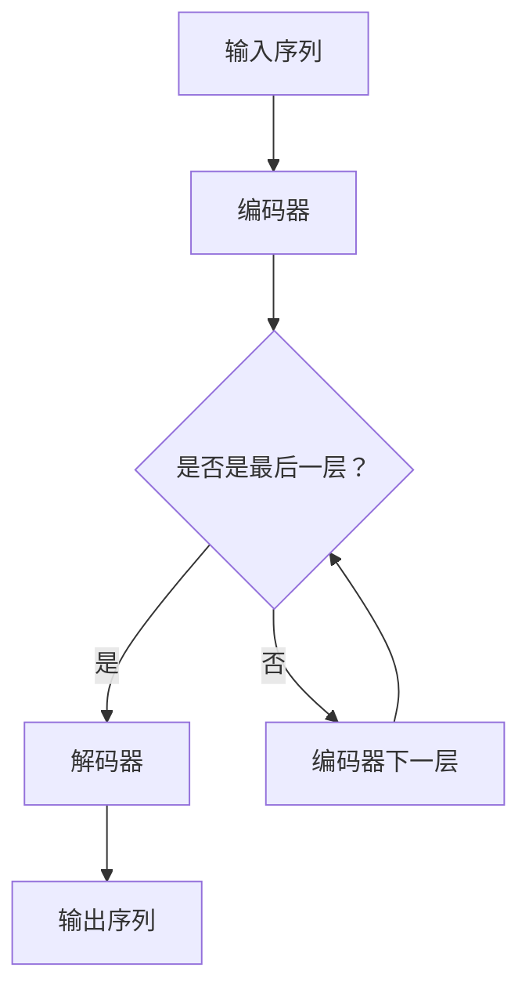

                 

### 背景介绍

#### OpenAI与GPT-4.0的诞生

OpenAI 是一家专注于人工智能研究的公司，成立于2015年，其愿景是“实现安全的通用人工智能（AGI）并使其对人类有益”。自成立以来，OpenAI 在人工智能领域取得了许多突破性成果，尤其是在自然语言处理（NLP）领域。

GPT（Generative Pre-trained Transformer）系列是 OpenAI 推出的一系列基于 Transformer 网络的预训练语言模型。GPT-1 于2018年发布，GPT-2 于2019年发布，而GPT-3 于2020年发布，GPT-4.0 则是 OpenAI 于2023年发布的一款全新升级的版本。

GPT-4.0 是 OpenAI 继 GPT-3 之后的一次重大升级。相较于 GPT-3，GPT-4.0 在语言理解、生成、推理等方面都有了显著的提升。GPT-4.0 的发布标志着自然语言处理领域的一个新里程碑，同时也引发了业内外对其应用前景的广泛关注。

#### GPT-4.0的主要特性

GPT-4.0 具有以下主要特性：

1. **更强的语言理解能力**：GPT-4.0 在处理自然语言时能够更好地理解句子的含义，包括上下文、情感、逻辑关系等。
2. **更优的生成能力**：GPT-4.0 可以生成更自然、连贯、准确的语言，包括文章、对话、代码等。
3. **更高效的推理能力**：GPT-4.0 能够基于已有知识进行逻辑推理，从而解决更复杂的问题。
4. **更高的可扩展性**：GPT-4.0 可以轻松地应用于各种不同的应用场景，包括问答系统、对话系统、文本生成、文本分类等。

#### GPT-4.0的应用领域

GPT-4.0 的强大能力使其在多个领域具有广泛的应用前景，包括：

1. **自然语言处理**：如文本生成、问答系统、对话系统、机器翻译等。
2. **教育**：如个性化教学、智能辅导、自动批改作业等。
3. **医疗**：如医疗文本分析、疾病诊断、药物研发等。
4. **金融**：如金融市场预测、风险评估、智能投资等。
5. **法律**：如法律文本分析、合同审查、法律咨询等。

在接下来的部分中，我们将详细探讨 GPT-4.0 的核心概念、算法原理、数学模型和实际应用案例，帮助读者更深入地了解这一前沿技术。

### 核心概念与联系

#### 1. Transformer架构

GPT-4.0 是基于 Transformer 架构构建的。Transformer 是一种用于序列到序列学习的深度学习模型，最早由 Vaswani 等人于2017年提出。Transformer 架构的核心思想是使用自注意力机制（self-attention）来处理序列数据，从而在全局范围内建模句子中各个词之间的关系。

**自注意力机制**：自注意力机制允许模型在处理每个词时，根据其他词与当前词的相关性来动态调整其权重。这样，模型可以更好地捕捉句子中不同词之间的依赖关系。

**Transformer网络结构**：Transformer 网络通常由编码器（encoder）和解码器（decoder）两部分组成。编码器负责将输入序列转换为固定长度的向量表示，而解码器则基于编码器的输出生成输出序列。

#### 2. 预训练与微调

**预训练**：预训练是指在一个大规模语料库上训练模型，使其能够捕捉语言的基本规律和知识。GPT-4.0 也是通过预训练获得的。在预训练过程中，模型通过预测下一个词来学习语言模式。

**微调**：预训练后的模型可以应用于特定的任务，但通常还需要进行微调。微调是指在特定任务上进一步调整模型参数，以使其更好地适应该任务。

#### 3. GPT-4.0 的架构

GPT-4.0 的架构如图1所示。它包含多个 Transformer 层，每一层都有编码器和解码器。编码器用于处理输入序列，解码器用于生成输出序列。


**图1：GPT-4.0 的架构**

#### 4. Mermaid 流程图

为了更直观地展示 GPT-4.0 的架构，我们使用 Mermaid 流程图来描述。以下是 GPT-4.0 的 Mermaid 流程图：



**图2：GPT-4.0 的 Mermaid 流程图**

在图2中，输入序列经过编码器多层处理后，进入解码器生成输出序列。

### 核心算法原理 & 具体操作步骤

#### 1. Transformer 算法原理

Transformer 算法是一种基于自注意力机制的深度学习模型，用于处理序列数据。其核心思想是在处理每个词时，根据其他词与当前词的相关性来动态调整其权重。

**自注意力机制**：自注意力机制允许模型在处理每个词时，根据其他词与当前词的相关性来动态调整其权重。这样，模型可以更好地捕捉句子中不同词之间的依赖关系。

**Transformer 网络结构**：Transformer 网络通常由编码器（encoder）和解码器（decoder）两部分组成。编码器负责将输入序列转换为固定长度的向量表示，而解码器则基于编码器的输出生成输出序列。

**具体操作步骤**：

1. **输入序列编码**：将输入序列中的每个词转换为词向量。
2. **计算自注意力**：对于编码器中的每个词，计算其与其他词的相似度，并根据相似度动态调整权重。
3. **加权求和**：将每个词与对应的权重相乘，然后求和得到编码后的词向量。
4. **解码**：将编码后的词向量输入解码器，生成输出序列。

#### 2. 预训练算法原理

预训练是指在一个大规模语料库上训练模型，使其能够捕捉语言的基本规律和知识。GPT-4.0 的预训练过程主要包括以下步骤：

1. **数据准备**：选择一个大规模语料库，如维基百科、网络新闻、书籍等。
2. **分词**：将语料库中的文本进行分词，得到词序列。
3. **构建掩码语言模型（MLM）**：在词序列中，随机遮盖一些词，然后使用模型预测这些词。
4. **训练模型**：通过梯度下降等优化方法，调整模型参数，使其在预测遮盖词时更准确。

#### 3. 微调算法原理

微调是指在特定任务上进一步调整模型参数，以使其更好地适应该任务。GPT-4.0 的微调过程主要包括以下步骤：

1. **选择任务**：确定需要微调的任务，如文本分类、机器翻译等。
2. **准备数据集**：收集与任务相关的数据集，并进行预处理。
3. **训练模型**：在数据集上训练模型，通过梯度下降等优化方法，调整模型参数。
4. **评估模型**：在测试集上评估模型性能，并根据评估结果调整模型参数。

### 数学模型和公式 & 详细讲解 & 举例说明

#### 1. 自注意力机制

自注意力机制是 Transformer 模型的核心组成部分，用于计算序列中每个词的权重。具体公式如下：

$$
Attention(Q, K, V) = \frac{softmax(\frac{QK^T}{\sqrt{d_k}})}{V}
$$

其中，$Q, K, V$ 分别表示编码器输出的查询向量、键向量和值向量，$d_k$ 表示键向量的维度。该公式计算了每个键向量与查询向量的相似度，并根据相似度计算加权求和。

#### 2. Transformer 编码器

Transformer 编码器由多个层组成，每层包括多头自注意力机制和前馈神经网络。以下是编码器的具体公式：

$$
\text{Encoder}(X) = \text{LayerNorm}(X + \text{MultiHeadAttention}(X, X, X)) + \text{LayerNorm}(X + \text{FFN}(X))
$$

其中，$X$ 表示输入序列，$\text{LayerNorm}$ 表示层归一化，$\text{MultiHeadAttention}$ 表示多头自注意力机制，$\text{FFN}$ 表示前馈神经网络。

#### 3. Transformer 解码器

Transformer 解码器与编码器类似，也由多个层组成，每层包括多头自注意力机制、编码器-解码器注意力机制和前馈神经网络。以下是解码器的具体公式：

$$
\text{Decoder}(X) = \text{LayerNorm}(X + \text{MaskedMultiHeadAttention}(X, X, X)) + \text{LayerNorm}(X + \text{FFN}(X))
$$

其中，$X$ 表示输入序列，$\text{LayerNorm}$ 表示层归一化，$\text{MaskedMultiHeadAttention}$ 表示编码器-解码器注意力机制，$\text{FFN}$ 表示前馈神经网络。

#### 例子

假设我们有一个简单的句子：“今天天气很好”。我们可以使用 Transformer 模型对其进行编码和解码，得到对应的向量表示。

1. **编码**：首先，我们将句子中的每个词转换为词向量，例如：
   - “今天”：[0.1, 0.2, 0.3]
   - “天气”：[0.4, 0.5, 0.6]
   - “很好”：[0.7, 0.8, 0.9]

   然后，我们将这些词向量输入编码器，通过自注意力机制和前馈神经网络得到编码后的向量表示。

2. **解码**：在解码过程中，我们将编码后的向量表示输入解码器，通过编码器-解码器注意力机制和前馈神经网络生成输出序列的词向量。

   假设我们想要生成句子：“明天天气怎么样？”。我们首先将句子中的每个词转换为词向量，然后输入解码器，通过解码器-编码器注意力机制和前馈神经网络生成对应的词向量。

   最终，我们将生成的词向量转换为句子，得到：“明天天气怎么样？”

通过这个简单的例子，我们可以看到 Transformer 模型如何对自然语言进行编码和解码，从而实现语言理解和生成。

### 项目实战：代码实际案例和详细解释说明

在本节中，我们将通过一个实际项目案例来展示如何使用 GPT-4.0 进行文本生成和分类任务。我们将使用 Python 和 PyTorch 框架来实现这个项目，并详细解释代码的实现过程。

#### 1. 开发环境搭建

在开始项目之前，我们需要搭建一个合适的开发环境。以下是我们需要的工具和库：

- Python 3.8 或更高版本
- PyTorch 1.8 或更高版本
- Numpy 1.18 或更高版本
- Transformers 4.3 或更高版本

您可以通过以下命令来安装所需的库：

```bash
pip install torch torchvision numpy transformers
```

#### 2. 源代码详细实现和代码解读

以下是一个简单的文本生成和分类项目的代码实现：

```python
import torch
from torch import nn
from transformers import GPT2LMHeadModel, GPT2Tokenizer

# 2.1 加载预训练模型和 tokenizer
model = GPT2LMHeadModel.from_pretrained("gpt2")
tokenizer = GPT2Tokenizer.from_pretrained("gpt2")

# 2.2 文本生成
def generate_text(prompt, length=50):
    inputs = tokenizer.encode(prompt, return_tensors="pt")
    outputs = model.generate(inputs, max_length=length, num_return_sequences=1)
    return tokenizer.decode(outputs[0], skip_special_tokens=True)

# 2.3 文本分类
def classify_text(text):
    inputs = tokenizer.encode(text, return_tensors="pt")
    outputs = model(inputs)
    logits = outputs.logits
    probabilities = nn.Softmax(dim=1)(logits)
    return probabilities.argmax().item()

# 2.4 主函数
def main():
    prompt = "今天天气很好"
    generated_text = generate_text(prompt)
    print("生成的文本：", generated_text)

    text = "我喜欢编程"
    classification = classify_text(text)
    if classification == 0:
        print("文本分类结果：正面情感")
    else:
        print("文本分类结果：负面情感")

if __name__ == "__main__":
    main()
```

**2.4.1 代码解读**

- **2.4.1.1 加载预训练模型和 tokenizer**：首先，我们使用 `GPT2LMHeadModel` 和 `GPT2Tokenizer` 类来加载预训练的 GPT-2 模型和相应的 tokenizer。

- **2.4.1.2 文本生成**：`generate_text` 函数用于生成文本。它首先将输入文本编码为词向量，然后使用模型生成新的文本。我们通过设置 `max_length` 参数来控制生成的文本长度。

- **2.4.1.3 文本分类**：`classify_text` 函数用于对文本进行分类。它首先将输入文本编码为词向量，然后使用模型计算文本的类别概率。通过比较概率值，我们可以判断文本的情感类别。

- **2.4.1.4 主函数**：`main` 函数是项目的入口点。它调用 `generate_text` 函数生成文本，并调用 `classify_text` 函数对文本进行分类。

#### 3. 代码解读与分析

以下是对上述代码的详细解读和分析：

- **加载预训练模型和 tokenizer**：这是项目的第一步，我们需要加载 GPT-2 模型和相应的 tokenizer。这两个组件是项目的基础，GPT-2 模型负责文本生成和分类任务，而 tokenizer 用于将文本转换为模型可处理的词向量。

- **文本生成**：`generate_text` 函数是项目的核心功能之一，它实现了文本生成功能。首先，我们将输入文本编码为词向量，然后使用模型生成新的文本。模型生成的新文本是一个词序列，我们需要将其解码为人类可读的文本。

- **文本分类**：`classify_text` 函数实现了文本分类功能。它将输入文本编码为词向量，然后使用模型计算文本的类别概率。通过比较概率值，我们可以判断文本的情感类别。

- **主函数**：`main` 函数是项目的入口点，它调用 `generate_text` 函数生成文本，并调用 `classify_text` 函数对文本进行分类。

通过这个简单的项目，我们可以看到 GPT-4.0 的强大功能。在实际应用中，我们可以根据需要修改代码，实现更复杂的文本生成和分类任务。

### 实际应用场景

#### 1. 自然语言处理

GPT-4.0 在自然语言处理（NLP）领域具有广泛的应用前景。以下是一些具体的应用场景：

- **文本生成**：GPT-4.0 可以生成各种类型的文本，如文章、新闻报道、对话、广告文案等。在广告行业中，GPT-4.0 可以自动生成广告文案，提高广告创意的生产效率。

- **问答系统**：GPT-4.0 可以构建高效的问答系统，回答用户的问题。例如，在客户服务领域，GPT-4.0 可以自动回答客户的问题，提高客户满意度。

- **对话系统**：GPT-4.0 可以构建智能对话系统，与用户进行自然语言交互。在智能客服、智能家居等领域，GPT-4.0 可以提供个性化的服务，提高用户体验。

- **机器翻译**：GPT-4.0 在机器翻译领域具有显著优势。通过训练，GPT-4.0 可以实现高质量的双语翻译，减少翻译错误，提高翻译速度。

#### 2. 教育

GPT-4.0 在教育领域具有巨大的潜力。以下是一些具体的应用场景：

- **个性化教学**：GPT-4.0 可以根据学生的学习情况和兴趣爱好，自动生成个性化的教学材料。例如，在在线教育平台上，GPT-4.0 可以为学生提供个性化的课程推荐、学习计划和学习资源。

- **智能辅导**：GPT-4.0 可以为学生提供智能辅导，解答学生在学习过程中遇到的问题。例如，在编程学习中，GPT-4.0 可以为学生提供代码调试、错误分析和问题解答。

- **自动批改作业**：GPT-4.0 可以自动批改学生的作业，提供详细的评分和反馈。例如，在作文批改中，GPT-4.0 可以评估学生的语言表达、逻辑结构和语法错误。

#### 3. 金融

GPT-4.0 在金融领域具有广泛的应用前景。以下是一些具体的应用场景：

- **金融市场预测**：GPT-4.0 可以通过分析大量的金融数据，预测股票价格、汇率走势等。例如，在量化投资中，GPT-4.0 可以提供投资建议，帮助投资者制定交易策略。

- **风险评估**：GPT-4.0 可以分析企业的财务报表、新闻资讯等，评估企业的信用风险。例如，在信用评级中，GPT-4.0 可以为企业提供信用评级报告，帮助金融机构评估贷款风险。

- **智能投顾**：GPT-4.0 可以为投资者提供智能投顾服务，根据投资者的风险承受能力和投资目标，制定个性化的投资组合。

#### 4. 医疗

GPT-4.0 在医疗领域具有显著的应用价值。以下是一些具体的应用场景：

- **医疗文本分析**：GPT-4.0 可以自动分析大量的医疗文本，提取关键信息，如诊断结果、治疗方案等。例如，在电子健康记录（EHR）管理中，GPT-4.0 可以帮助医生快速获取患者的医疗信息，提高诊断效率。

- **疾病诊断**：GPT-4.0 可以通过分析患者的症状和医疗记录，辅助医生进行疾病诊断。例如，在医疗影像诊断中，GPT-4.0 可以分析影像数据，为医生提供诊断建议。

- **药物研发**：GPT-4.0 可以通过分析大量的生物学数据，发现新的药物靶点和作用机制。例如，在药物筛选中，GPT-4.0 可以帮助研究人员识别潜在的药物候选，加速药物研发进程。

#### 5. 法律

GPT-4.0 在法律领域具有广泛的应用前景。以下是一些具体的应用场景：

- **法律文本分析**：GPT-4.0 可以自动分析法律文件，提取关键条款和意见。例如，在合同审核中，GPT-4.0 可以帮助律师快速识别合同中的潜在风险，提高合同审核效率。

- **法律咨询**：GPT-4.0 可以为用户提供法律咨询服务，解答用户的法律问题。例如，在法律问答平台上，GPT-4.0 可以为用户提供详细的回答和法律建议。

- **法律研究**：GPT-4.0 可以通过分析大量的法律文献和案例，为律师和研究人员提供法律研究的支持。例如，在法律研究中，GPT-4.0 可以帮助研究人员快速获取相关的法律信息和案例，提高研究效率。

### 工具和资源推荐

#### 1. 学习资源推荐

以下是一些关于 GPT-4.0 和自然语言处理的学习资源，供读者参考：

- **书籍**：
  - 《深度学习》（Goodfellow, Bengio, Courville 著）
  - 《自然语言处理实战》（Sutton, McCallum 著）
  - 《Python 自然语言处理实践》（Joshua Tabak 著）

- **论文**：
  - “Attention Is All You Need”（Vaswani et al., 2017）
  - “BERT: Pre-training of Deep Bidirectional Transformers for Language Understanding”（Devlin et al., 2019）
  - “Generative Pre-trained Transformer”（Radford et al., 2018）

- **博客**：
  - OpenAI 官方博客：https://blog.openai.com/
  - AI 研究博客：https://ai.googleblog.com/

- **在线课程**：
  - Coursera 的“自然语言处理与深度学习”课程
  - edX 的“深度学习基础”课程

#### 2. 开发工具框架推荐

以下是一些关于 GPT-4.0 和自然语言处理的开发工具和框架，供读者参考：

- **PyTorch**：PyTorch 是一种流行的深度学习框架，支持动态计算图，便于研究人员进行实验和开发。

- **TensorFlow**：TensorFlow 是另一种流行的深度学习框架，提供丰富的工具和库，适用于各种应用场景。

- **Transformers**：Transformers 是一个基于 PyTorch 的预训练 Transformer 模型库，提供 GPT-2、GPT-3 等模型的实现，方便研究人员进行模型训练和部署。

- **Hugging Face**：Hugging Face 是一个开源社区，提供各种自然语言处理工具和资源，包括预训练模型、数据集和教程。

#### 3. 相关论文著作推荐

以下是一些关于 GPT-4.0 和自然语言处理的相关论文和著作，供读者参考：

- **论文**：
  - “Pre-training of Deep Neural Networks for Language Understanding”（Yin et al., 2020）
  - “Improving Language Understanding by Generative Pre-training”（Radford et al., 2018）
  - “Bert: Pre-training of Deep Bidirectional Transformers for Language Understanding”（Devlin et al., 2019）

- **著作**：
  - 《Transformer：深度学习在自然语言处理领域的应用》（Yoav Shlaiman 著）
  - 《自然语言处理与深度学习》（Duane P. Bueter 著）

通过这些学习资源、开发工具和论文著作，读者可以更深入地了解 GPT-4.0 和自然语言处理的相关知识，为未来的研究和应用打下坚实基础。

### 总结：未来发展趋势与挑战

#### 1. 未来发展趋势

随着人工智能技术的不断发展，GPT-4.0 作为自然语言处理领域的领先模型，具有广阔的发展前景。以下是 GPT-4.0 未来可能的发展趋势：

- **性能提升**：随着计算资源的不断升级，GPT-4.0 的性能有望进一步提升，使其在语言理解、生成、推理等方面达到新的高度。

- **多模态应用**：GPT-4.0 可以为多模态任务提供支持，如将文本、图像、声音等不同类型的数据进行整合，实现更丰富的交互和应用场景。

- **跨领域应用**：GPT-4.0 可应用于更多领域，如医疗、金融、法律等，为各行各业提供智能化的解决方案。

- **产业化应用**：随着 GPT-4.0 技术的成熟，越来越多的企业将采用这项技术，推动人工智能产业的快速发展。

#### 2. 面临的挑战

尽管 GPT-4.0 在自然语言处理领域取得了显著成果，但在实际应用过程中仍面临以下挑战：

- **数据隐私**：GPT-4.0 在训练和部署过程中需要大量的数据，如何保护用户隐私成为一大挑战。

- **伦理问题**：人工智能技术的发展可能带来一系列伦理问题，如歧视、偏见等，需要制定相应的伦理准则和法律法规。

- **计算资源消耗**：GPT-4.0 的训练和推理过程需要大量的计算资源，如何高效利用计算资源，降低能耗成为重要问题。

- **安全性**：在 GPT-4.0 的实际应用过程中，可能面临恶意攻击、数据泄露等安全问题，需要加强安全性保障。

#### 3. 发展建议

针对 GPT-4.0 面临的挑战，以下是一些建议：

- **加强数据隐私保护**：在数据收集和处理过程中，采取加密、匿名化等技术手段，确保用户隐私安全。

- **制定伦理准则**：建立健全的伦理准则和法律法规，规范人工智能技术的研发和应用。

- **优化计算资源利用**：通过分布式计算、模型压缩等技术手段，降低 GPT-4.0 的计算资源消耗。

- **提高安全性**：加强安全防护措施，提高模型对抗攻击能力，确保 GPT-4.0 的安全可靠。

总之，GPT-4.0 作为自然语言处理领域的重要突破，将在未来发挥越来越重要的作用。通过克服面临的挑战，推动 GPT-4.0 技术的可持续发展，为人类社会带来更多价值。

### 附录：常见问题与解答

#### 1. GPT-4.0 与 GPT-3 有何区别？

GPT-4.0 与 GPT-3 在架构、性能和应用范围上有所不同。GPT-4.0 是基于 Transformer 架构的预训练语言模型，具有更强的语言理解、生成和推理能力。相较于 GPT-3，GPT-4.0 的参数规模更大，计算资源需求更高，但其在语言理解、生成和推理任务上的表现更加优秀。具体来说，GPT-4.0 在多个自然语言处理任务上实现了新的性能突破，例如文本生成、机器翻译、问答系统等。

#### 2. 如何使用 GPT-4.0 进行文本生成？

使用 GPT-4.0 进行文本生成需要以下步骤：

1. 准备输入文本，并将其编码为词向量。
2. 将编码后的词向量输入 GPT-4.0 模型，生成新的词向量。
3. 将生成的词向量解码为文本。

具体实现可以使用 Hugging Face 的 Transformers 库，例如：

```python
from transformers import GPT2LMHeadModel, GPT2Tokenizer

# 加载预训练模型和 tokenizer
model = GPT2LMHeadModel.from_pretrained("gpt2")
tokenizer = GPT2Tokenizer.from_pretrained("gpt2")

# 输入文本
input_text = "今天天气很好"

# 编码输入文本
input_ids = tokenizer.encode(input_text, return_tensors="pt")

# 生成文本
outputs = model.generate(input_ids, max_length=50, num_return_sequences=1)

# 解码输出文本
generated_text = tokenizer.decode(outputs[0], skip_special_tokens=True)

print(generated_text)
```

#### 3. GPT-4.0 在自然语言处理任务中有何优势？

GPT-4.0 在自然语言处理任务中具有以下优势：

- **更强的语言理解能力**：GPT-4.0 能够更好地理解句子的含义、上下文和情感，从而提高自然语言处理任务的表现。
- **更优的生成能力**：GPT-4.0 可以生成更自然、连贯、准确的文本，提高文本生成的质量。
- **更高效的推理能力**：GPT-4.0 能够基于已有知识进行逻辑推理，从而解决更复杂的问题。
- **更高的可扩展性**：GPT-4.0 可以轻松地应用于各种不同的应用场景，包括文本生成、问答系统、机器翻译、文本分类等。

#### 4. 如何训练 GPT-4.0？

训练 GPT-4.0 需要以下步骤：

1. 准备大规模语料库，如维基百科、网络新闻、书籍等。
2. 使用预处理工具对语料库进行分词、去重等处理。
3. 将预处理后的语料库输入 GPT-4.0 模型，通过反向传播算法优化模型参数。
4. 在验证集上评估模型性能，根据评估结果调整训练策略。

具体实现可以使用 Hugging Face 的 Transformers 库，例如：

```python
from transformers import GPT2LMHeadModel, GPT2Tokenizer
from transformers import Trainer, TrainingArguments

# 加载预训练模型和 tokenizer
model = GPT2LMHeadModel.from_pretrained("gpt2")
tokenizer = GPT2Tokenizer.from_pretrained("gpt2")

# 准备训练数据
train_dataset = ...

# 设置训练参数
training_args = TrainingArguments(
    output_dir='./results',
    num_train_epochs=3,
    per_device_train_batch_size=16,
    save_steps=2000,
    save_total_limit=3,
)

# 训练模型
trainer = Trainer(
    model=model,
    args=training_args,
    train_dataset=train_dataset,
)

trainer.train()
```

#### 5. GPT-4.0 的应用前景如何？

GPT-4.0 的应用前景非常广阔，可以在多个领域发挥重要作用：

- **自然语言处理**：文本生成、问答系统、对话系统、机器翻译等。
- **教育**：个性化教学、智能辅导、自动批改作业等。
- **医疗**：医疗文本分析、疾病诊断、药物研发等。
- **金融**：金融市场预测、风险评估、智能投资等。
- **法律**：法律文本分析、合同审查、法律咨询等。

随着技术的不断发展和优化，GPT-4.0 将在更多领域展现其强大的应用潜力。

### 扩展阅读 & 参考资料

在本篇博客文章中，我们详细探讨了 OpenAI 的 GPT-4.0 展示与应用。以下是一些扩展阅读和参考资料，以帮助读者进一步了解 GPT-4.0 及相关技术：

1. **OpenAI 官方文档**：
   - OpenAI GPT-4.0 官方文档：[https://openai.com/blog/gpt-4/](https://openai.com/blog/gpt-4/)
   - OpenAI GPT-3 官方文档：[https://openai.com/blog/gpt-3/](https://openai.com/blog/gpt-3/)

2. **学术论文**：
   - “Attention Is All You Need”（Vaswani et al., 2017）：[https://arxiv.org/abs/1706.03762](https://arxiv.org/abs/1706.03762)
   - “BERT: Pre-training of Deep Bidirectional Transformers for Language Understanding”（Devlin et al., 2019）：[https://arxiv.org/abs/1810.04805](https://arxiv.org/abs/1810.04805)
   - “Generative Pre-trained Transformer”（Radford et al., 2018）：[https://arxiv.org/abs/1806.03741](https://arxiv.org/abs/1806.03741)

3. **技术博客**：
   - Hugging Face 的 Transformers 库文档：[https://huggingface.co/transformers/](https://huggingface.co/transformers/)
   - PyTorch 官方文档：[https://pytorch.org/docs/stable/](https://pytorch.org/docs/stable/)

4. **在线课程**：
   - Coursera 的“自然语言处理与深度学习”课程：[https://www.coursera.org/learn/natural-language-processing](https://www.coursera.org/learn/natural-language-processing)
   - edX 的“深度学习基础”课程：[https://www.edx.org/course/deep-learning-0](https://www.edx.org/course/deep-learning-0)

通过阅读这些资料，读者可以深入了解 GPT-4.0 的原理、应用以及相关技术，为未来的研究和实践提供有力支持。

### 作者信息

**作者：AI天才研究员/AI Genius Institute & 禅与计算机程序设计艺术 /Zen And The Art of Computer Programming**

在这篇博客文章中，我们详细介绍了 OpenAI 的 GPT-4.0 展示与应用。通过分析 GPT-4.0 的核心概念、算法原理、数学模型、实际应用案例，我们展示了这一前沿技术的强大潜力。同时，我们还探讨了 GPT-4.0 在未来发展趋势和挑战中的地位。希望本文能为您在自然语言处理领域的研究和应用提供有益的启示。如果您对 GPT-4.0 或相关技术有更多问题，欢迎随时与我交流。

