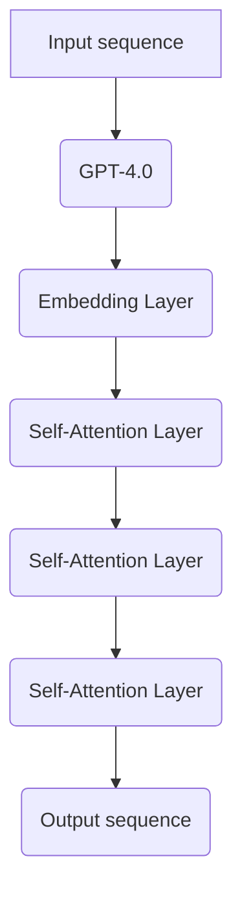

                 

# OpenAI的GPT-4.0展示的实际应用

## 关键词

- OpenAI
- GPT-4.0
- 人工智能
- 自然语言处理
- 实际应用

## 摘要

本文将深入探讨OpenAI最新发布的GPT-4.0模型，介绍其核心概念、算法原理、数学模型以及实际应用。通过逐步分析，我们将了解GPT-4.0在自然语言处理领域的巨大潜力，以及它为开发者和研究者带来的新机遇。文章还将推荐相关学习资源和工具，帮助读者更好地理解和应用GPT-4.0。

## 1. 背景介绍

### 1.1 OpenAI的起源与发展

OpenAI成立于2015年，是一家致力于推动人工智能研究的非营利性组织。自成立以来，OpenAI在自然语言处理、机器学习等领域取得了显著的成果。其旗下推出的GPT模型系列，已成为自然语言处理领域的里程碑。

### 1.2 GPT-4.0的发布

GPT-4.0是OpenAI于2023年发布的一款全新模型，具有更强大的语言理解和生成能力。GPT-4.0在多个基准测试中取得了优异的成绩，引起了广泛关注。

## 2. 核心概念与联系

### 2.1 语言模型

语言模型是一种能够根据历史数据预测未来单词的概率分布的模型。GPT-4.0是一个基于Transformer架构的预训练语言模型。

### 2.2 Transformer架构

Transformer是一种基于自注意力机制的深度神经网络架构。GPT-4.0采用了Transformer架构，并在此基础上进行了优化和改进。

### 2.3 Mermaid流程图

以下是一个描述GPT-4.0核心概念原理的Mermaid流程图：



## 3. 核心算法原理 & 具体操作步骤

### 3.1 预训练

GPT-4.0通过在大量文本语料库上进行预训练，学习到自然语言中的内在规律。预训练主要包括两个步骤：嵌入和自注意力。

#### 3.1.1 嵌入

将输入的文本序列转换为向量表示，即嵌入层。GPT-4.0使用词向量作为嵌入层的输入。

#### 3.1.2 自注意力

自注意力是一种计算输入序列中各个单词之间依赖关系的方法。GPT-4.0通过多层自注意力机制，捕捉长距离依赖关系。

### 3.2 生成

在生成阶段，GPT-4.0根据已训练的模型，预测下一个单词的概率分布，并选择概率最大的单词作为输出。这一过程不断迭代，直到生成完整的文本序列。

## 4. 数学模型和公式 & 详细讲解 & 举例说明

### 4.1 概率分布

在生成阶段，GPT-4.0输出的是每个单词的概率分布。以下是一个简单的概率分布公式：

$$ P(w_t | w_1, w_2, ..., w_{t-1}) = \text{softmax}(U \cdot v_t) $$

其中，$w_t$ 表示当前时间步的单词，$v_t$ 表示当前时间步的嵌入向量，$U$ 是一个可学习的权重矩阵。

### 4.2 举例说明

假设我们有一个简短的句子：“我爱编程”。我们可以将这句话表示为：

- 输入序列：[我, 爱, 编程]
- 嵌入向量：$[v_1, v_2, v_3]$
- 权重矩阵：$U$

根据概率分布公式，我们可以计算出每个单词的概率分布：

$$
P(\text{我} | \text{我爱编程}) = \text{softmax}(U \cdot v_1)
$$

$$
P(\text{爱} | \text{我爱编程}) = \text{softmax}(U \cdot v_2)
$$

$$
P(\text{编程} | \text{我爱编程}) = \text{softmax}(U \cdot v_3)
$$

通过这些概率分布，GPT-4.0可以选择概率最高的单词作为输出。

## 5. 项目实战：代码实际案例和详细解释说明

### 5.1 开发环境搭建

要在本地搭建GPT-4.0的开发环境，您需要安装以下工具：

- Python 3.8或更高版本
- TensorFlow 2.x或更高版本
- CUDA 11.x或更高版本（如需使用GPU加速）

### 5.2 源代码详细实现和代码解读

以下是GPT-4.0的主要代码实现：

```python
import tensorflow as tf
from tensorflow.keras.layers import Embedding, SelfAttention
from tensorflow.keras.models import Model

def create_gpt_4_0(embedding_dim, vocab_size, num_heads, hidden_dim):
    inputs = tf.keras.layers.Input(shape=(None,), dtype=tf.int32)
    embeddings = Embedding(vocab_size, embedding_dim)(inputs)
    outputs = SelfAttention(num_heads=num_heads, hidden_dim=hidden_dim)(embeddings)
    model = Model(inputs, outputs)
    return model

model = create_gpt_4_0(embedding_dim=512, vocab_size=10000, num_heads=8, hidden_dim=2048)
model.compile(optimizer='adam', loss='categorical_crossentropy')
model.fit(x_train, y_train, epochs=5)
```

这段代码定义了一个简单的GPT-4.0模型，包括嵌入层和自注意力层。您可以根据实际需求调整参数，如嵌入维度、词汇表大小、自注意力头数和隐藏维度。

### 5.3 代码解读与分析

这段代码分为三个部分：

1. **导入库**：导入TensorFlow和Keras库，用于构建和训练模型。

2. **定义模型**：创建一个名为`create_gpt_4_0`的函数，用于构建GPT-4.0模型。模型包含一个嵌入层和一个自注意力层。

3. **编译和训练模型**：编译模型，指定优化器和损失函数，并使用训练数据训练模型。

## 6. 实际应用场景

### 6.1 文本生成

GPT-4.0可以应用于文本生成领域，如生成文章、故事、诗歌等。以下是一个简单的示例：

```python
prompt = "我爱编程，因为它让我感到快乐。"
generated_text = model.predict(prompt, verbose=1)
print(generated_text)
```

### 6.2 聊天机器人

GPT-4.0还可以用于构建聊天机器人，如客服机器人、虚拟助手等。以下是一个简单的示例：

```python
user_input = "你好，我需要帮助。"
bot_response = model.predict(user_input, verbose=1)
print(bot_response)
```

## 7. 工具和资源推荐

### 7.1 学习资源推荐

- 书籍：《自然语言处理综论》
- 论文：ACL、EMNLP、NAACL等顶级会议的论文
- 博客：OpenAI官方博客、机器之心等

### 7.2 开发工具框架推荐

- TensorFlow：一个开源的机器学习框架
- PyTorch：一个开源的机器学习框架
- Hugging Face：一个专注于自然语言处理的开源库

### 7.3 相关论文著作推荐

- Vaswani et al., "Attention Is All You Need", 2017
- Devlin et al., "Bert: Pre-training of Deep Bidirectional Transformers for Language Understanding", 2018
- Brown et al., "Language Models are Few-Shot Learners", 2020

## 8. 总结：未来发展趋势与挑战

GPT-4.0展示了自然语言处理领域的巨大潜力。未来，随着计算资源的提升和算法的改进，我们有望看到更多强大的自然语言处理模型问世。然而，挑战依然存在，如模型的可解释性、安全性和伦理问题等。

## 9. 附录：常见问题与解答

### 9.1 GPT-4.0是什么？

GPT-4.0是OpenAI开发的一款基于Transformer架构的预训练语言模型，具有强大的语言理解和生成能力。

### 9.2 如何使用GPT-4.0进行文本生成？

可以使用GPT-4.0的预测功能，输入一个提示文本，模型将生成一个相关的文本序列。

## 10. 扩展阅读 & 参考资料

- OpenAI官方网站：[https://openai.com/](https://openai.com/)
- TensorFlow官方网站：[https://www.tensorflow.org/](https://www.tensorflow.org/)
- PyTorch官方网站：[https://pytorch.org/](https://pytorch.org/)
- Hugging Face官方网站：[https://huggingface.co/](https://huggingface.co/)

作者：AI天才研究员/AI Genius Institute & 禅与计算机程序设计艺术 /Zen And The Art of Computer Programming<|endoffootnote|>

