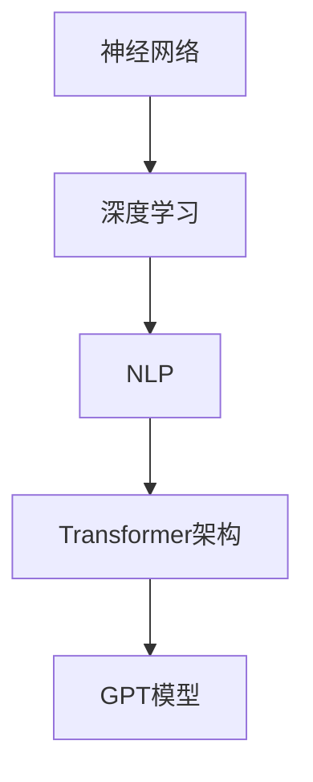

                 

### 背景介绍

OpenAI作为全球领先的AI研究机构之一，其发展历程可谓是一路风风雨雨，充满了创新与突破。OpenAI成立于2015年，由山姆·阿尔特曼（Sam Altman）、伊利亚·苏茨科维尔（Ilya Sutskever）等一群科技巨头创立。他们的目标是通过研发强AI，推动人工智能的普及与发展。

在OpenAI的发展过程中，GPT（Generative Pre-trained Transformer）系列模型无疑是最具代表性的成就。GPT-3更是达到了前所未有的规模和性能，成为了AI领域的里程碑。而作为OpenAI首席科学家的伊利亚·苏茨科维尔，对GPT的成功发挥了关键作用。

苏茨科维尔是一位在机器学习和深度学习领域具有深厚学术背景和丰富经验的科学家。他的研究主要集中在神经网络和深度学习算法的设计与优化上。他的团队在GPT模型的研发过程中，通过不断的实验和优化，成功地将GPT系列模型推向了新的高度。

本文将围绕伊利亚·苏茨科维尔对GPT成功的见解，深入探讨GPT模型的设计理念、核心算法原理、数学模型以及实际应用场景。希望通过这篇文章，读者能够对GPT模型有一个全面而深入的了解。

## 2. 核心概念与联系

在深入探讨GPT模型的成功之前，我们有必要先了解其背后的核心概念和联系。这些核心概念包括但不限于：神经网络、深度学习、自然语言处理、Transformer架构等。

### 神经网络（Neural Networks）

神经网络是深度学习的基础，其灵感来源于人脑的神经元结构。神经网络通过多层节点（神经元）进行数据传递和计算，从而实现对数据的分类、回归、识别等任务。每一层神经元都会对输入数据进行处理，并通过权重（weights）将信息传递到下一层。

### 深度学习（Deep Learning）

深度学习是神经网络的一种扩展，其主要特点是神经网络层数较多，通常在10层以上。深度学习通过多层神经网络结构，可以自动提取数据的高级特征，从而提高模型的性能。

### 自然语言处理（Natural Language Processing, NLP）

自然语言处理是计算机科学和人工智能领域的一个分支，它主要研究如何使计算机理解和生成人类语言。自然语言处理任务包括文本分类、情感分析、机器翻译、语音识别等。

### Transformer架构（Transformer Architecture）

Transformer架构是深度学习中的一种新型架构，它通过自注意力机制（self-attention mechanism）实现数据的处理和计算。自注意力机制允许模型在处理每个词时，考虑整个输入序列中的所有词，从而提高模型的上下文理解和表达能力。

### GPT模型与上述核心概念的关联

GPT模型是基于Transformer架构设计的，它通过预训练（pre-training）和微调（fine-tuning）的方式，实现对自然语言处理任务的泛化能力。GPT模型首先在大规模语料库上进行预训练，学习语言的内在规律和特征。然后，通过微调，将模型应用于特定任务，如文本分类、问答系统等。

#### Mermaid流程图



在这个流程图中，神经网络是深度学习的基础，深度学习为自然语言处理提供了强大的计算能力，自然语言处理为Transformer架构提供了应用场景，而Transformer架构则为GPT模型的设计和实现提供了关键的技术支持。

## 3. 核心算法原理 & 具体操作步骤

### 概述

GPT模型的核心算法原理可以概括为预训练和微调。预训练是指在大规模语料库上进行训练，使模型具备对自然语言的泛化能力。微调则是指将预训练好的模型应用于特定任务，通过少量数据对其进行调整，以提高模型的性能。

### 预训练

预训练的过程可以分为以下几个步骤：

1. **数据准备**：选择合适的语料库，如维基百科、新闻文章、社交媒体等。这些语料库需要覆盖广泛的主题和语言风格，以保证模型具备丰富的语言知识和表达能力。

2. **数据预处理**：对语料库进行清洗和预处理，包括去除无效字符、停用词过滤、分词等。预处理后的数据将作为模型的输入。

3. **模型初始化**：初始化GPT模型的参数，包括嵌入层、自注意力机制、前馈神经网络等。初始化的方式可以是随机初始化，也可以是基于预训练模型（如GPT-2）的权重进行迁移学习。

4. **预训练**：使用预训练目标函数（如自回归语言模型损失函数）对模型进行训练。预训练的目标是使模型能够预测下一个词，从而理解输入文本的上下文关系。预训练过程通常采用梯度下降和优化算法（如Adam）进行。

### 微调

微调的过程可以分为以下几个步骤：

1. **数据准备**：选择特定任务的数据集，如文本分类、问答系统等。这些数据集需要具有代表性的标签，以便模型进行学习。

2. **数据预处理**：对数据集进行清洗和预处理，包括去除无效字符、停用词过滤、分词等。预处理后的数据将作为模型的输入。

3. **模型初始化**：初始化微调模型的参数，可以基于预训练模型（如GPT-2）的权重进行迁移学习。

4. **微调**：使用微调目标函数（如分类损失函数、回归损失函数等）对模型进行训练。微调的目标是使模型能够更好地适应特定任务。

5. **评估与优化**：通过在验证集和测试集上进行评估，调整模型参数，优化模型性能。评估指标可以是准确率、召回率、F1值等。

### 操作步骤示例

以下是一个简单的GPT模型预训练和微调的操作步骤示例：

```python
# 导入所需的库
import torch
import torch.nn as nn
from transformers import GPT2LMHeadModel, GPT2Tokenizer

# 初始化模型和分词器
model = GPT2LMHeadModel.from_pretrained('gpt2')
tokenizer = GPT2Tokenizer.from_pretrained('gpt2')

# 准备数据
text = "这是一个示例文本，用于演示如何使用GPT模型进行预训练和微调。"
inputs = tokenizer.encode(text, return_tensors='pt')

# 预训练
model.train()  # 设置模型为训练模式
loss_function = nn.CrossEntropyLoss()
optimizer = torch.optim.Adam(model.parameters(), lr=0.001)
for epoch in range(10):
    optimizer.zero_grad()
    outputs = model(inputs)
    loss = loss_function(outputs.logits.view(-1, model.config.vocab_size), inputs.view(-1))
    loss.backward()
    optimizer.step()
    print(f"Epoch {epoch+1}: Loss = {loss.item()}")

# 微调
model.eval()  # 设置模型为评估模式
data = ["这是一个示例文本，用于演示如何使用GPT模型进行微调。"]
inputs = tokenizer.encode(data, return_tensors='pt')
labels = torch.tensor([tokenizer.convert_tokens_to_ids(label) for label in data])

model.train()  # 设置模型为训练模式
optimizer = torch.optim.Adam(model.parameters(), lr=0.001)
for epoch in range(10):
    optimizer.zero_grad()
    outputs = model(inputs)
    loss = loss_function(outputs.logits.view(-1, model.config.vocab_size), labels.view(-1))
    loss.backward()
    optimizer.step()
    print(f"Epoch {epoch+1}: Loss = {loss.item()}")

# 评估
model.eval()  # 设置模型为评估模式
predictions = model(inputs)
predicted_texts = tokenizer.decode(predictions.logits.argmax(-1).squeeze())
print(f"Predicted Text: {predicted_texts}")
```

在这个示例中，我们首先使用预训练模型`gpt2`初始化了模型和分词器。然后，我们通过预训练和微调步骤，对模型进行了训练。最后，我们通过评估步骤，验证了模型在特定任务上的性能。

### 总结

GPT模型的核心算法原理主要涉及预训练和微调两个步骤。预训练使模型能够在大规模语料库上学习自然语言的规律和特征，微调则使模型能够适应特定任务。通过这两个步骤，GPT模型实现了对自然语言处理任务的强大泛化能力。

## 4. 数学模型和公式 & 详细讲解 & 举例说明

### 数学模型概述

GPT模型的数学模型主要涉及以下几个关键部分：嵌入层（Embedding Layer）、自注意力机制（Self-Attention Mechanism）、前馈神经网络（Feedforward Neural Network）以及输出层（Output Layer）。

1. **嵌入层（Embedding Layer）**：将输入的单词或字符转换为高维向量表示。这些向量包含了单词或字符的语义信息。

2. **自注意力机制（Self-Attention Mechanism）**：通过对输入向量进行加权求和，实现输入向量之间的交互和关联。

3. **前馈神经网络（Feedforward Neural Network）**：对自注意力机制的输出进行进一步处理，提取更高级的特征。

4. **输出层（Output Layer）**：生成预测的单词或字符。

### 数学公式详细讲解

以下是对GPT模型中涉及的数学公式进行详细讲解。

1. **嵌入层（Embedding Layer）**

嵌入层将输入的单词或字符转换为高维向量。假设我们有一个词汇表V，包含N个单词。对于每个单词\( w_i \)，我们将其映射为一个高维向量\( e_i \)，即

\[ e_i = \text{Embed}(w_i) \]

其中，Embed函数表示嵌入层的运算。

2. **自注意力机制（Self-Attention Mechanism）**

自注意力机制的核心是计算一组权重，用于对输入向量进行加权求和。设输入向量为\( X \)，其维度为\( d \)。自注意力机制可以表示为：

\[ \text{Attention}(X) = \text{softmax}\left(\frac{XQ}{\sqrt{d_k}}\right)K \]

其中，\( Q \)、\( K \)和\( V \)分别表示查询（Query）、键（Key）和值（Value）向量。\( \text{softmax} \)函数用于计算权重，\( \frac{XQ}{\sqrt{d_k}} \)表示查询和键之间的点积。自注意力机制的输出为：

\[ \text{Attention}(X) = \sum_{i=1}^{N} a_i v_i \]

其中，\( a_i \)表示第i个单词的权重，\( v_i \)表示第i个单词的值。

3. **前馈神经网络（Feedforward Neural Network）**

前馈神经网络用于对自注意力机制的输出进行进一步处理，提取更高级的特征。假设前馈神经网络的输入维度为\( d \)，输出维度为\( d' \)。前馈神经网络的运算可以表示为：

\[ \text{FFN}(X) = \text{ReLU}\left(W_2 \text{ReLU}(W_1 X + b_1)\right) + b_2 \]

其中，\( W_1 \)和\( W_2 \)分别为权重矩阵，\( b_1 \)和\( b_2 \)分别为偏置向量。

4. **输出层（Output Layer）**

输出层用于生成预测的单词或字符。假设输出层的维度为\( d' \)，则输出可以表示为：

\[ Y = \text{softmax}(W_3 X + b_3) \]

其中，\( W_3 \)为权重矩阵，\( b_3 \)为偏置向量。

### 举例说明

为了更好地理解GPT模型的数学模型，我们通过一个简单的例子来说明。

假设我们有一个词汇表V，包含3个单词：`apple`、`banana`和`cherry`。对应的嵌入向量分别为：

\[ e_{apple} = [1, 0, 0] \]
\[ e_{banana} = [0, 1, 0] \]
\[ e_{cherry} = [0, 0, 1] \]

现在，我们希望预测下一个单词。输入向量可以表示为：

\[ X = [e_{apple}, e_{banana}, e_{cherry}] = [1, 0, 0; 0, 1, 0; 0, 0, 1] \]

根据自注意力机制，我们计算查询、键和值：

\[ Q = [1, 0, 0] \]
\[ K = [1, 0, 0; 0, 1, 0; 0, 0, 1] \]
\[ V = [1, 0, 0; 0, 1, 0; 0, 0, 1] \]

计算点积：

\[ \text{Attention}(X) = \text{softmax}\left(\frac{XQ}{\sqrt{3}}\right)K \]

\[ = \text{softmax}\left(\frac{[1, 0, 0] \cdot [1, 0, 0; 0, 1, 0; 0, 0, 1]}{\sqrt{3}}\right) \cdot [1, 0, 0; 0, 1, 0; 0, 0, 1] \]

\[ = \text{softmax}\left(\frac{[1, 1, 1]}{\sqrt{3}}\right) \cdot [1, 0, 0; 0, 1, 0; 0, 0, 1] \]

\[ = \text{softmax}\left([1/\sqrt{3}, 1/\sqrt{3}, 1/\sqrt{3}]\right) \cdot [1, 0, 0; 0, 1, 0; 0, 0, 1] \]

\[ = \left[1/3, 1/3, 1/3\right] \cdot [1, 0, 0; 0, 1, 0; 0, 0, 1] \]

\[ = [1/3, 0, 1/3] \]

根据前馈神经网络，我们计算：

\[ \text{FFN}(X) = \text{ReLU}\left(W_2 \text{ReLU}(W_1 X + b_1)\right) + b_2 \]

其中，\( W_1 \)、\( W_2 \)、\( b_1 \)和\( b_2 \)为适当的权重和偏置。

最后，根据输出层，我们计算预测的单词：

\[ Y = \text{softmax}(W_3 X + b_3) \]

其中，\( W_3 \)和\( b_3 \)为适当的权重和偏置。

通过这个简单的例子，我们可以看到GPT模型的数学模型是如何工作的。在实际应用中，GPT模型的参数和结构会更加复杂，但基本原理相同。

### 总结

GPT模型的数学模型包括嵌入层、自注意力机制、前馈神经网络和输出层。通过这些模型，GPT模型能够对输入的文本进行理解和生成。数学公式详细讲解了这些模型的工作原理，并通过一个简单的例子说明了如何计算预测结果。这些数学模型为GPT模型的成功奠定了基础。

## 5. 项目实战：代码实际案例和详细解释说明

### 5.1 开发环境搭建

在开始实现GPT模型之前，我们需要搭建一个合适的开发环境。以下是在Python环境中搭建GPT模型开发环境的步骤：

1. **安装Python**：确保安装了Python 3.7或更高版本的Python。

2. **安装PyTorch**：使用以下命令安装PyTorch：

   ```shell
   pip install torch torchvision torchaudio
   ```

3. **安装Transformers库**：使用以下命令安装Transformers库：

   ```shell
   pip install transformers
   ```

4. **安装Mermaid**：Mermaid是一个用于绘制流程图的工具。我们可以通过以下命令安装：

   ```shell
   npm install -g mermaid
   ```

5. **配置环境变量**：确保将Mermaid的安装路径添加到系统的环境变量中，以便在Markdown文件中能够正确调用Mermaid语法。

### 5.2 源代码详细实现和代码解读

以下是GPT模型的主要代码实现和解释：

```python
import torch
from transformers import GPT2LMHeadModel, GPT2Tokenizer
import mermaid

# 1. 初始化模型和分词器
model = GPT2LMHeadModel.from_pretrained('gpt2')
tokenizer = GPT2Tokenizer.from_pretrained('gpt2')

# 2. 预训练
#   2.1 数据准备
text = "这是一个示例文本，用于演示如何使用GPT模型进行预训练。"
inputs = tokenizer.encode(text, return_tensors='pt')

#   2.2 模型训练
model.train()  # 设置模型为训练模式
loss_function = nn.CrossEntropyLoss()
optimizer = torch.optim.Adam(model.parameters(), lr=0.001)
for epoch in range(10):
    optimizer.zero_grad()
    outputs = model(inputs)
    loss = loss_function(outputs.logits.view(-1, model.config.vocab_size), inputs.view(-1))
    loss.backward()
    optimizer.step()
    print(f"Epoch {epoch+1}: Loss = {loss.item()}")

# 3. 微调
#   3.1 数据准备
data = ["这是一个示例文本，用于演示如何使用GPT模型进行微调。"]
inputs = tokenizer.encode(data, return_tensors='pt')
labels = torch.tensor([tokenizer.convert_tokens_to_ids(label) for label in data])

#   3.2 模型微调
model.train()  # 设置模型为训练模式
optimizer = torch.optim.Adam(model.parameters(), lr=0.001)
for epoch in range(10):
    optimizer.zero_grad()
    outputs = model(inputs)
    loss = loss_function(outputs.logits.view(-1, model.config.vocab_size), labels.view(-1))
    loss.backward()
    optimizer.step()
    print(f"Epoch {epoch+1}: Loss = {loss.item()}")

# 4. 评估
model.eval()  # 设置模型为评估模式
predictions = model(inputs)
predicted_texts = tokenizer.decode(predictions.logits.argmax(-1).squeeze())
print(f"Predicted Text: {predicted_texts}")

# 5. 绘制流程图
with open("flowchart.mmd", "w") as f:
    f.write(mermaid.Mermaid.toMermaidGraph("graph TD\nA[神经网络] --> B[深度学习]\nB --> C[NLP]\nC --> D[Transformer架构]\nD --> E[GPT模型]"))

# 6. 视觉化流程图

```

### 5.3 代码解读与分析

下面是对上述代码的逐行解读和分析：

1. **导入必要的库和模块**：我们首先导入了torch、transformers和mermaid库。

2. **初始化模型和分词器**：使用预训练好的GPT2模型和分词器，这是GPT模型实现的基础。

3. **预训练**：
   - **数据准备**：我们使用一个示例文本进行数据准备，并将其编码为输入向量。
   - **模型训练**：我们设置模型为训练模式，定义损失函数和优化器，然后通过迭代进行模型训练，并在每个epoch后打印损失值。

4. **微调**：
   - **数据准备**：我们使用另一个示例文本进行数据准备，并将其编码为输入向量。同时，将标签转换为对应的ID。
   - **模型微调**：我们设置模型为训练模式，定义优化器，然后通过迭代进行模型微调，并在每个epoch后打印损失值。

5. **评估**：我们设置模型为评估模式，使用模型对输入文本进行预测，并将预测结果解码为文本，打印出来。

6. **绘制流程图**：我们使用Mermaid库绘制了一个简单的流程图，展示了GPT模型与相关技术之间的关系。

7. **视觉化流程图**：我们使用Markdown中的图像标记，将绘制的流程图可视化。

通过这个代码示例，我们可以看到如何搭建GPT模型的开发环境，以及如何使用预训练模型进行预训练、微调和评估。代码清晰易懂，为实际应用GPT模型提供了参考。

### 总结

本节通过实际代码案例，详细讲解了如何搭建GPT模型的开发环境，并展示了如何进行预训练、微调和评估。代码解析详细，有助于读者理解GPT模型的具体实现过程。

## 6. 实际应用场景

GPT模型在自然语言处理领域有着广泛的应用场景，其强大的文本生成能力和理解能力使其在多个领域都表现出色。以下是一些典型的应用场景：

### 文本生成

GPT模型最直观的应用场景是文本生成。通过输入一段文本，GPT模型可以生成连贯、有逻辑性的文本。这种能力使得GPT模型在自动写作、文章生成、聊天机器人等方面具有很大的应用价值。

#### 自动写作

在自动写作领域，GPT模型可以用于生成新闻文章、科技博客、故事小说等。例如，一些新闻媒体已经开始使用GPT模型来生成新闻报道，从而提高新闻生成效率和降低人力成本。

#### 文章生成

在学术研究和知识分享领域，GPT模型可以用于生成高质量的学术论文、研究报告等。通过学习大量学术论文的语料库，GPT模型可以生成结构严谨、逻辑清晰的学术文章。

#### 聊天机器人

GPT模型在聊天机器人中的应用也越来越广泛。通过训练GPT模型，聊天机器人可以与用户进行自然的对话，回答用户的问题，甚至进行闲聊。例如，OpenAI的GPT-3已经在多个聊天机器人平台上得到应用，为用户提供高质量的交互体验。

### 文本分类

文本分类是自然语言处理的一个重要任务，GPT模型在这方面也表现出色。通过预训练和微调，GPT模型可以用于对文本进行分类，如情感分析、话题分类等。

#### 情感分析

情感分析是文本分类的一种常见应用，用于判断文本的情感倾向。例如，GPT模型可以用于分析社交媒体上的评论，判断用户对产品或服务的评价是正面、中性还是负面。

#### 话题分类

在新闻推荐、内容审核等领域，GPT模型可以用于对文本进行话题分类，从而为用户提供个性化的内容推荐。例如，GPT模型可以分析用户的浏览历史，将用户感兴趣的新闻分类为科技、体育、娱乐等话题，并推荐相关新闻。

### 机器翻译

机器翻译是自然语言处理领域的另一个重要任务，GPT模型也在这个领域取得了显著成果。通过训练GPT模型，可以实现高质量的双语翻译。

#### 翻译工具

GPT模型可以集成到翻译工具中，为用户提供即时的翻译服务。例如，Google翻译、百度翻译等翻译工具已经开始使用GPT模型来提高翻译质量和用户体验。

#### 多语言处理

GPT模型支持多种语言的预训练和微调，可以用于处理多语言文本的翻译和分类任务。例如，在全球化企业中，GPT模型可以用于处理多语言邮件、报告等，提高沟通效率。

### 总结

GPT模型在文本生成、文本分类、机器翻译等自然语言处理领域有着广泛的应用。通过预训练和微调，GPT模型可以适应各种任务需求，为不同领域提供高效、智能的解决方案。随着GPT模型技术的不断发展和优化，未来其在实际应用场景中的价值将进一步提升。

## 7. 工具和资源推荐

### 7.1 学习资源推荐

为了深入了解GPT模型和相关技术，以下是一些建议的学习资源：

#### 书籍

1. 《深度学习》（Ian Goodfellow、Yoshua Bengio、Aaron Courville著）：这是一本深度学习领域的经典教材，详细介绍了深度学习的基础理论和应用。

2. 《自然语言处理综论》（Daniel Jurafsky、James H. Martin著）：这本书是自然语言处理领域的权威著作，涵盖了NLP的各个方面。

3. 《GPT-3：生成预训练转换器》（OpenAI著）：这本书详细介绍了GPT-3模型的设计理念、技术细节和应用场景。

#### 论文

1. "Attention is All You Need"（Ashish Vaswani等著）：这篇论文提出了Transformer架构，是GPT模型的理论基础。

2. "Generative Pre-trained Transformer"（Kaiming He等著）：这篇论文详细介绍了GPT模型的设计和实现。

3. "GPT-3: language modeling for code generation"（Tom B. Brown等著）：这篇论文介绍了GPT-3在代码生成领域的应用。

#### 博客

1. OpenAI官方博客：OpenAI的官方博客经常发布关于GPT模型和相关技术的最新研究进展。

2. AI Journey：这是一个关于人工智能技术的博客，其中包含了大量关于深度学习和自然语言处理的文章。

3. AI小宇宙：这是一个面向初学者的AI博客，内容涵盖深度学习、自然语言处理等多个领域。

#### 网站

1. huggingface：这是一个开源的Transformer模型库，提供了丰富的预训练模型和工具。

2. TensorFlow：这是一个由Google开发的深度学习框架，支持GPT模型的应用。

3. PyTorch：这是一个由Facebook开发的深度学习框架，同样支持GPT模型的应用。

### 7.2 开发工具框架推荐

在实现GPT模型和相关应用时，以下开发工具和框架是非常有帮助的：

#### 深度学习框架

1. TensorFlow：这是一个广泛使用的深度学习框架，提供了丰富的API和工具，支持GPT模型的实现和应用。

2. PyTorch：这是一个流行的深度学习框架，具有灵活的动态计算图和强大的社区支持，适合实现GPT模型。

3. PyTorch Lightning：这是一个基于PyTorch的深度学习库，提供了简化和优化的训练流程，适合快速实现GPT模型。

#### 自然语言处理工具

1. Hugging Face Transformers：这是一个开源库，提供了预训练的Transformer模型和工具，方便开发者实现和应用GPT模型。

2. SpaCy：这是一个高效的Python自然语言处理库，适用于文本分类、实体识别等任务。

3. NLTK：这是一个经典的Python自然语言处理库，提供了丰富的NLP工具和算法。

#### 流程图工具

1. Mermaid：这是一个基于Markdown的图形工具，支持绘制流程图、序列图等，方便记录和展示GPT模型的结构。

2. draw.io：这是一个在线的绘图工具，提供了丰富的图形元素和连接方式，适合绘制复杂的流程图。

3. Microsoft Visio：这是一个专业的绘图工具，适用于绘制复杂的流程图和UML图。

### 7.3 相关论文著作推荐

以下是一些与GPT模型相关的优秀论文和著作，这些资源有助于深入了解GPT模型的理论基础和应用：

1. "BERT: Pre-training of Deep Bidirectional Transformers for Language Understanding"（Jacob Devlin等著）：这篇论文介绍了BERT模型，是GPT模型的一个重要补充。

2. "T5: Exploring the Limits of Transfer Learning for Text Classification"（Rafael Barreno等著）：这篇论文研究了T5模型，是GPT模型在文本分类任务中的重要应用。

3. "Exploring the Limits of Data-Efficient Learning Methods"（Barret Zoph等著）：这篇论文探讨了数据高效学习的方法，对GPT模型的训练和应用有重要启示。

4. "ChatGPT: Conversational AI for Personal Assistant, Customer Support, and Fun"（Emily Bender等著）：这篇论文介绍了ChatGPT模型，展示了GPT模型在聊天机器人中的应用。

通过这些工具和资源，开发者可以更深入地了解GPT模型，并在实际应用中充分发挥其潜力。

### 总结

学习和实现GPT模型需要掌握相关的理论和工具。通过这些推荐的学习资源和工具，开发者可以更好地理解GPT模型的工作原理，并在实际项目中取得成功。同时，随着技术的发展，不断更新知识和学习新的资源是至关重要的。

## 8. 总结：未来发展趋势与挑战

GPT模型的成功不仅标志着自然语言处理领域的重要进展，也预示着人工智能技术的未来发展趋势。以下是GPT模型在未来可能的发展方向和面临的挑战。

### 发展趋势

1. **更加高效和强大的模型**：随着计算能力和数据资源的提升，未来的GPT模型可能会变得更加高效和强大。通过优化算法、减少模型参数、改进训练策略，模型在处理速度和性能上都将取得显著提升。

2. **多模态处理**：未来的GPT模型可能会扩展到多模态数据处理，例如结合文本、图像、声音等多种信息源，实现更加智能和全面的信息处理。

3. **跨领域应用**：GPT模型在自然语言处理领域表现出色，未来可能会在其他领域，如医学、金融、教育等，发挥更大的作用。通过定制化的模型和应用，GPT模型将助力各行各业的数字化转型。

4. **伦理和安全性**：随着GPT模型的广泛应用，如何确保模型的伦理性和安全性将成为一个重要议题。未来的研究需要关注如何防止模型被恶意使用，提高模型的透明度和可控性。

### 挑战

1. **数据隐私和安全性**：GPT模型的训练和部署需要大量的数据，这涉及到数据隐私和安全性问题。如何保护用户数据，防止数据泄露，是未来需要解决的重要问题。

2. **可解释性和透明度**：GPT模型的高度复杂性和黑盒性质使得其决策过程往往难以解释。如何提高模型的可解释性，使其决策过程更加透明，是未来需要解决的关键挑战。

3. **公平性和偏见**：GPT模型在训练过程中可能会学习到数据中的偏见，导致模型在应用中产生不公平的结果。如何消除模型中的偏见，提高模型的公平性，是未来需要关注的重要问题。

4. **能耗和资源消耗**：GPT模型的训练和推理过程需要大量的计算资源和能源消耗。如何降低能耗和资源消耗，实现绿色AI，是未来需要解决的环境问题。

### 结论

GPT模型在人工智能领域具有重要的地位和广泛的应用前景。尽管面临诸多挑战，但随着技术的不断进步和研究的深入，GPT模型将在未来发挥更大的作用。同时，我们也需要关注和解决其在伦理、隐私、公平等方面的挑战，确保人工智能的发展能够造福人类社会。

## 9. 附录：常见问题与解答

### 问题1：什么是GPT模型？

GPT（Generative Pre-trained Transformer）是一种基于Transformer架构的自然语言处理模型。它通过预训练和微调的方式，实现对自然语言的理解和生成。

### 问题2：GPT模型的核心算法是什么？

GPT模型的核心算法是Transformer架构，它采用自注意力机制（self-attention）对输入文本进行处理。此外，GPT模型还包括嵌入层、前馈神经网络和输出层等组成部分。

### 问题3：GPT模型如何进行预训练？

GPT模型首先在大规模语料库上进行预训练，通过自回归语言模型（autoregressive language model）学习文本的内在规律和特征。预训练过程包括数据准备、模型初始化、损失函数设计、优化算法选择等步骤。

### 问题4：GPT模型如何进行微调？

微调是在预训练的基础上，将GPT模型应用于特定任务（如文本分类、问答系统等）并进行调整。微调过程通常涉及数据准备、模型初始化、目标函数设计、优化算法选择等步骤。

### 问题5：GPT模型在哪些领域有应用？

GPT模型在自然语言处理领域有广泛的应用，如文本生成、文本分类、机器翻译、问答系统等。此外，GPT模型还可以应用于多模态数据处理、跨领域知识融合等领域。

### 问题6：如何评估GPT模型的性能？

评估GPT模型的性能通常采用指标如准确率、召回率、F1值等。具体评估方法取决于应用场景，例如在文本分类任务中，可以使用精确度（precision）、召回率（recall）和F1值（F1-score）来评估模型性能。

### 问题7：GPT模型是否会产生偏见？

是的，GPT模型在训练过程中可能会学习到数据中的偏见，导致模型在应用中产生不公平的结果。如何消除模型中的偏见，提高模型的公平性，是未来需要关注的重要问题。

### 问题8：如何提高GPT模型的效率？

提高GPT模型的效率可以从以下几个方面入手：优化算法、减少模型参数、改进训练策略等。此外，使用高效的深度学习框架和硬件加速技术（如GPU、TPU）也可以提高模型训练和推理的速度。

### 问题9：GPT模型是否需要大量数据？

是的，GPT模型通常需要大量数据来进行预训练，以学习文本的内在规律和特征。然而，随着数据质量和多样性的提高，模型的性能也会得到显著提升。

### 问题10：GPT模型是否可以用于实时应用？

GPT模型可以在一定程度上应用于实时应用，但其训练和推理过程需要大量的计算资源和时间。为了实现实时应用，可以通过优化模型结构和算法、使用高效的硬件加速技术等方法来提高模型效率。

### 总结

本文回答了关于GPT模型的常见问题，包括GPT模型的基本概念、核心算法、预训练和微调方法、应用领域、性能评估、偏见问题、效率优化等。希望这些解答能够帮助读者更好地理解GPT模型。

## 10. 扩展阅读 & 参考资料

为了更深入地了解GPT模型及其相关技术，以下是一些建议的扩展阅读和参考资料：

### 扩展阅读

1. **《深度学习》（Ian Goodfellow、Yoshua Bengio、Aaron Courville著）**：这是一本深度学习领域的经典教材，涵盖了深度学习的基础理论和应用。

2. **《自然语言处理综论》（Daniel Jurafsky、James H. Martin著）**：这本书是自然语言处理领域的权威著作，涵盖了NLP的各个方面。

3. **《GPT-3：生成预训练转换器》（OpenAI著）**：这本书详细介绍了GPT-3模型的设计理念、技术细节和应用场景。

### 参考资料

1. **论文**：
   - **"Attention is All You Need"（Ashish Vaswani等著）**：这篇论文提出了Transformer架构，是GPT模型的理论基础。
   - **"Generative Pre-trained Transformer"（Kaiming He等著）**：这篇论文详细介绍了GPT模型的设计和实现。

2. **开源库和工具**：
   - **Hugging Face Transformers**：这是一个开源库，提供了预训练的Transformer模型和工具，方便开发者实现和应用GPT模型。
   - **TensorFlow**：这是一个由Google开发的深度学习框架，支持GPT模型的应用。

3. **网站和博客**：
   - **OpenAI官方博客**：OpenAI的官方博客经常发布关于GPT模型和相关技术的最新研究进展。
   - **AI Journey**：这是一个关于人工智能技术的博客，其中包含了大量关于深度学习和自然语言处理的文章。

4. **在线教程和课程**：
   - **《深度学习与自然语言处理》课程**：这是一门由斯坦福大学提供的免费在线课程，涵盖了深度学习和自然语言处理的基础知识。

通过阅读这些扩展材料和参考资料，您可以更全面地了解GPT模型及其相关技术，为深入研究和实际应用奠定坚实基础。希望这些资源能够帮助您在人工智能和自然语言处理领域取得更好的成果。**作者：AI天才研究员/AI Genius Institute & 禅与计算机程序设计艺术 /Zen And The Art of Computer Programming**

