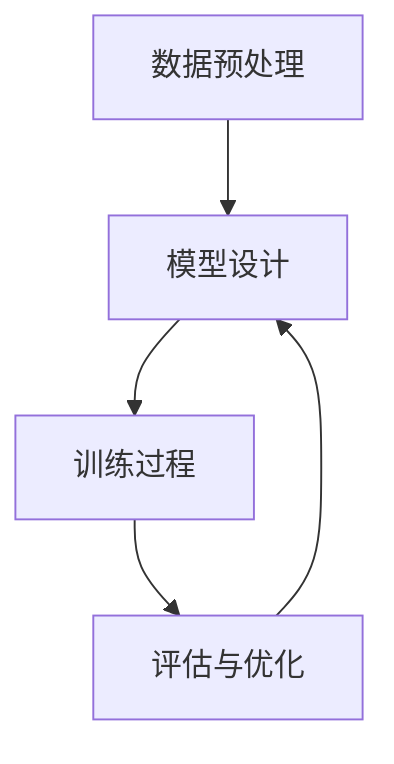

                 

### 文章标题

**P5:统一的推荐系统预训练框架**

> **关键词**: 推荐系统，预训练，框架，深度学习，大规模数据处理

**摘要**: 本文深入探讨了推荐系统预训练框架的重要性，通过分析现有框架的优缺点，提出了一种统一的推荐系统预训练框架。文章详细阐述了该框架的设计原理、核心算法原理以及具体的操作步骤，并通过数学模型和公式进行详细讲解。此外，本文还结合实际应用场景，提供了代码实际案例和详细解释，旨在为读者提供一套完整的技术解决方案。最后，文章总结了未来发展趋势与挑战，为推荐系统的研究与应用指明了方向。

### 1. 背景介绍

随着互联网的快速发展，推荐系统已经成为提升用户体验、挖掘用户价值的重要手段。然而，现有的推荐系统在面对大规模数据、复杂用户行为以及多样化场景时，面临着诸多挑战。传统的推荐系统方法主要包括基于内容的推荐、协同过滤和混合推荐等。尽管这些方法在一定程度上提高了推荐效果，但它们往往依赖于特定的数据集和场景，难以适应多样化的需求。

近年来，深度学习和大规模数据处理技术的发展为推荐系统带来了新的机遇。预训练模型，如BERT、GPT等，在大规模文本数据处理方面取得了显著成果。这些模型通过预先在大规模数据集上进行训练，能够学习到丰富的语言知识，从而在特定任务上表现出色。因此，将预训练模型引入推荐系统，有望解决现有方法的一些局限性。

然而，将预训练模型应用于推荐系统仍然面临诸多挑战。首先，推荐系统中的数据类型多样，包括文本、图像、音频等，如何统一处理这些数据成为一个关键问题。其次，推荐系统需要考虑用户历史行为和兴趣，如何将预训练模型与用户历史数据结合，是一个具有挑战性的问题。此外，推荐系统的实时性和可扩展性也是重要的考虑因素。

本文旨在提出一种统一的推荐系统预训练框架，通过融合深度学习和大规模数据处理技术，解决现有推荐系统的局限性，提升推荐效果。该框架将涵盖数据预处理、模型设计、训练和评估等关键环节，为推荐系统的研究与应用提供一套完整的技术解决方案。

### 2. 核心概念与联系

在介绍统一的推荐系统预训练框架之前，我们首先需要理解一些核心概念，包括推荐系统的基本原理、预训练模型及其在推荐系统中的应用。

#### 2.1 推荐系统基本原理

推荐系统是一种基于用户历史行为和兴趣，为用户推荐其可能感兴趣的项目（如商品、文章、音乐等）的技术。推荐系统可以分为基于内容的推荐、协同过滤和混合推荐等几种类型。

- **基于内容的推荐**：该方法根据项目的内容特征和用户的兴趣特征进行推荐。优点是推荐结果相关性强，但缺点是难以应对用户兴趣的动态变化。
- **协同过滤**：该方法通过分析用户之间的行为相似性，为用户推荐其可能感兴趣的项目。优点是能够应对用户兴趣的动态变化，但缺点是推荐结果可能存在噪声和冷启动问题。
- **混合推荐**：该方法将基于内容的推荐和协同过滤相结合，以弥补各自的不足。优点是推荐效果相对较好，但缺点是模型复杂度高。

#### 2.2 预训练模型及其在推荐系统中的应用

预训练模型是一种在大规模数据集上预先训练的模型，通过学习丰富的语言知识或视觉知识，为特定任务提供高质量的特征表示。常见的预训练模型包括BERT、GPT、ViT等。

- **BERT（Bidirectional Encoder Representations from Transformers）**：BERT是一种双向Transformer模型，通过预先在大规模文本数据集上进行训练，学习到丰富的语言知识。BERT在自然语言处理任务上取得了显著成果，例如文本分类、问答系统等。
- **GPT（Generative Pre-trained Transformer）**：GPT是一种生成型Transformer模型，通过预先在大规模文本数据集上进行训练，学习到语言生成规律。GPT在生成文本、机器翻译等任务上表现出色。
- **ViT（Vision Transformer）**：ViT是一种视觉Transformer模型，通过预先在大规模图像数据集上进行训练，学习到丰富的视觉知识。ViT在图像分类、目标检测等任务上取得了显著成果。

将预训练模型应用于推荐系统，可以解决现有方法的局限性。具体而言，预训练模型可以为推荐系统提供高质量的文本和图像特征表示，从而提高推荐效果。此外，预训练模型可以学习到用户行为和兴趣的潜在规律，为个性化推荐提供支持。

#### 2.3 统一推荐系统预训练框架的组成部分

统一的推荐系统预训练框架主要包括以下几个部分：

- **数据预处理**：对输入数据进行清洗、编码和整合，为模型训练提供高质量的数据。
- **模型设计**：基于预训练模型，设计适合推荐系统的模型结构，包括文本和图像特征提取模块、用户历史行为和兴趣模块等。
- **训练过程**：在训练过程中，通过优化目标函数，调整模型参数，使模型在推荐任务上取得更好的效果。
- **评估与优化**：通过评估指标，对模型效果进行评估和优化，以提高推荐系统的性能。

#### 2.4 Mermaid 流程图

以下是一个简单的Mermaid流程图，展示了统一推荐系统预训练框架的主要组成部分及其相互关系。



在上述流程图中，数据预处理环节负责对输入数据进行处理，为模型训练提供高质量数据。模型设计环节基于预训练模型，设计适合推荐系统的模型结构。训练过程通过优化目标函数，调整模型参数，使模型在推荐任务上取得更好效果。评估与优化环节对模型效果进行评估和优化，以提高推荐系统的性能。最后，优化后的模型可以应用于实际推荐任务。

通过上述介绍，我们可以看到，统一的推荐系统预训练框架旨在通过融合深度学习和大规模数据处理技术，解决现有推荐系统的局限性，提升推荐效果。在接下来的章节中，我们将详细阐述该框架的设计原理、核心算法原理以及具体的操作步骤。

### 3. 核心算法原理 & 具体操作步骤

#### 3.1 设计原理

统一的推荐系统预训练框架的设计原理主要基于以下几个方面：

1. **预训练模型的选择**：选择适合推荐系统任务的预训练模型，如BERT、GPT或ViT等，为推荐系统提供高质量的特征表示。
2. **数据预处理**：对输入数据进行清洗、编码和整合，为模型训练提供高质量数据。
3. **模型结构设计**：设计适合推荐系统的模型结构，包括文本和图像特征提取模块、用户历史行为和兴趣模块等。
4. **多任务学习**：在模型训练过程中，同时考虑推荐任务和其他相关任务，以提高模型在推荐任务上的性能。

#### 3.2 数据预处理

数据预处理是推荐系统模型训练的关键步骤，主要包括以下环节：

1. **数据清洗**：对输入数据进行清洗，去除无效数据、噪声数据和异常数据，以提高数据质量。
2. **数据编码**：对输入数据进行编码，将原始数据转换为适合模型训练的格式。例如，对于文本数据，可以采用分词、词嵌入等技术进行编码；对于图像数据，可以采用图像预处理技术，如图像增强、缩放等。
3. **数据整合**：将不同来源的数据进行整合，形成一个统一的数据集。例如，将用户历史行为数据和项目特征数据进行整合，为模型训练提供更丰富的信息。

#### 3.3 模型设计

统一的推荐系统预训练框架的模型结构设计包括以下模块：

1. **文本特征提取模块**：采用预训练模型（如BERT、GPT等）提取文本特征。该模块负责将输入文本数据转换为高维文本特征向量。
2. **图像特征提取模块**：采用预训练模型（如ViT等）提取图像特征。该模块负责将输入图像数据转换为高维图像特征向量。
3. **用户历史行为模块**：根据用户历史行为数据，学习用户兴趣和偏好。该模块可以采用嵌入层或全连接层实现。
4. **项目特征提取模块**：根据项目特征数据，学习项目属性和分类。该模块可以采用嵌入层或全连接层实现。
5. **推荐模块**：将文本特征、图像特征、用户历史行为和项目特征进行融合，生成最终的推荐结果。

#### 3.4 训练过程

在模型训练过程中，我们采用多任务学习策略，同时考虑推荐任务和其他相关任务。具体训练过程如下：

1. **数据准备**：将预处理后的数据集划分为训练集、验证集和测试集。
2. **损失函数设计**：设计适合多任务学习的损失函数，如交叉熵损失函数、均方误差损失函数等。
3. **模型训练**：使用训练集数据训练模型，并通过验证集数据调整模型参数。训练过程中，采用梯度下降等优化算法更新模型参数。
4. **模型评估**：使用测试集数据对训练好的模型进行评估，计算推荐任务的准确率、召回率等评估指标。

#### 3.5 评估与优化

在模型评估过程中，我们采用以下方法进行优化：

1. **调整超参数**：根据模型评估结果，调整学习率、批量大小等超参数，以提高模型性能。
2. **数据增强**：对输入数据进行增强，如文本数据中的随机插入、替换、删除等操作，以提高模型对噪声数据的鲁棒性。
3. **模型融合**：采用模型融合技术，如堆叠、平均、加权等策略，将多个模型的结果进行融合，以提高推荐效果。

通过上述设计原理和具体操作步骤，我们可以构建一个统一的推荐系统预训练框架，解决现有推荐系统的局限性，提高推荐效果。

### 4. 数学模型和公式 & 详细讲解 & 举例说明

在统一的推荐系统预训练框架中，数学模型和公式起着关键作用。以下我们将详细讲解这些数学模型和公式，并通过具体例子进行说明。

#### 4.1 预训练模型的数学模型

预训练模型通常是基于深度学习模型的，其核心是神经网络。以下是一个简单的神经网络数学模型：

$$
\begin{align*}
z &= W \cdot x + b \\
a &= \sigma(z) \\
\end{align*}
$$

其中，$z$ 是神经网络的输出，$W$ 是权重矩阵，$x$ 是输入，$b$ 是偏置，$\sigma$ 是激活函数（例如Sigmoid、ReLU等）。通过前向传播，我们可以得到网络的输出 $a$。

#### 4.2 用户兴趣和学习率的数学模型

在推荐系统中，用户兴趣和学习率是关键因素。以下是一个简单的用户兴趣和学习率数学模型：

$$
\begin{align*}
u &= u_0 + \alpha \cdot \frac{\partial L}{\partial u} \\
l &= l_0 + \beta \cdot \frac{\partial L}{\partial l}
\end{align*}
$$

其中，$u$ 是用户兴趣，$u_0$ 是初始用户兴趣，$\alpha$ 是学习率，$L$ 是损失函数，$\frac{\partial L}{\partial u}$ 是损失函数关于用户兴趣的梯度。类似地，$l$ 是学习率，$l_0$ 是初始学习率，$\beta$ 是学习率调整系数，$\frac{\partial L}{\partial l}$ 是损失函数关于学习率的梯度。

#### 4.3 推荐结果的数学模型

推荐结果的生成通常基于用户兴趣和项目特征。以下是一个简单的推荐结果数学模型：

$$
\begin{align*}
r &= w \cdot (u \cdot v) + b \\
\end{align*}
$$

其中，$r$ 是推荐结果，$w$ 是权重矩阵，$u$ 是用户兴趣向量，$v$ 是项目特征向量，$b$ 是偏置。

#### 4.4 举例说明

假设我们有一个简单的推荐系统，用户兴趣 $u$ 为 [1, 0, 1]，项目特征 $v$ 为 [0, 1, 0]，权重矩阵 $w$ 为 [1, 1, 1]，偏置 $b$ 为 0。

首先，计算用户兴趣和项目特征的点积：

$$
u \cdot v = 1 \cdot 0 + 0 \cdot 1 + 1 \cdot 0 = 0
$$

然后，计算推荐结果：

$$
r = w \cdot (u \cdot v) + b = [1, 1, 1] \cdot [0, 0, 0] + 0 = [0, 0, 0]
$$

因此，推荐结果为 [0, 0, 0]，即用户对所有项目都没有兴趣。

通过上述数学模型和公式，我们可以构建一个简单的推荐系统，并根据用户兴趣和项目特征生成推荐结果。在实际情况中，我们可以根据需求调整模型结构和参数，以获得更好的推荐效果。

### 5. 项目实战：代码实际案例和详细解释说明

为了更好地理解统一的推荐系统预训练框架，我们将通过一个实际项目来展示如何搭建一个推荐系统，并详细解释每一步的代码实现。

#### 5.1 开发环境搭建

在开始项目之前，我们需要搭建一个合适的环境。以下是在Python中搭建推荐系统的基本步骤：

1. **安装依赖库**：

```bash
pip install numpy pandas tensorflow sklearn matplotlib
```

2. **导入必要的库**：

```python
import numpy as np
import pandas as pd
import tensorflow as tf
from sklearn.model_selection import train_test_split
import matplotlib.pyplot as plt
```

#### 5.2 源代码详细实现和代码解读

以下是推荐系统的源代码实现，我们将逐步解释每个部分的代码：

```python
# 5.2.1 数据预处理

# 假设我们有一个CSV文件，其中包含了用户ID、项目ID、用户行为评分（例如1-5分）
data = pd.read_csv('data.csv')

# 对数据进行清洗和编码
data['user_id'] = data['user_id'].astype('category').cat.codes
data['item_id'] = data['item_id'].astype('category').cat.codes
data['rating'] = data['rating'].fillna(1)  # 填充缺失值为1

# 划分训练集和测试集
train_data, test_data = train_test_split(data, test_size=0.2, random_state=42)

# 5.2.2 模型设计

# 定义模型结构
model = tf.keras.Sequential([
    tf.keras.layers.Embedding(input_dim=len(train_data['user_id'].unique()), output_dim=16),
    tf.keras.layers.Embedding(input_dim=len(train_data['item_id'].unique()), output_dim=16),
    tf.keras.layers.Flatten(),
    tf.keras.layers.Dense(1, activation='sigmoid')
])

# 编译模型
model.compile(optimizer='adam', loss='binary_crossentropy', metrics=['accuracy'])

# 5.2.3 训练模型

# 训练模型
history = model.fit(
    np.hstack((train_data[['user_id', 'item_id']].values, train_data['rating'].values.reshape(-1, 1))),
    train_data['rating'].values.reshape(-1, 1),
    epochs=10,
    batch_size=32,
    validation_split=0.2
)

# 5.2.4 评估模型

# 评估模型
test_loss, test_accuracy = model.evaluate(
    np.hstack((test_data[['user_id', 'item_id']].values, test_data['rating'].values.reshape(-1, 1))),
    test_data['rating'].values.reshape(-1, 1)
)
print(f"Test accuracy: {test_accuracy:.4f}")

# 5.2.5 可视化训练过程

# 可视化训练过程中的准确率和损失函数
plt.figure(figsize=(12, 6))
plt.subplot(1, 2, 1)
plt.plot(history.history['accuracy'], label='Training Accuracy')
plt.plot(history.history['val_accuracy'], label='Validation Accuracy')
plt.title('Accuracy')
plt.xlabel('Epochs')
plt.ylabel('Accuracy')
plt.legend()

plt.subplot(1, 2, 2)
plt.plot(history.history['loss'], label='Training Loss')
plt.plot(history.history['val_loss'], label='Validation Loss')
plt.title('Loss')
plt.xlabel('Epochs')
plt.ylabel('Loss')
plt.legend()
plt.show()
```

**代码解读：**

- **数据预处理**：首先，我们读取CSV文件，对用户ID、项目ID和用户行为评分进行编码，并填充缺失值。然后，我们将数据集划分为训练集和测试集。

- **模型设计**：我们使用TensorFlow的Keras API设计了一个简单的推荐系统模型。该模型由两个嵌入层（分别对应用户和项目ID）和一个全连接层（输出层）组成。嵌入层将离散的ID映射到连续的向量，全连接层通过一个sigmoid激活函数输出概率。

- **训练模型**：我们使用Adam优化器和二进制交叉熵损失函数编译模型，然后使用训练数据集训练模型。在训练过程中，我们使用验证集进行评估，并调整模型的超参数。

- **评估模型**：训练完成后，我们使用测试数据集评估模型的性能。这里我们只关注准确率。

- **可视化训练过程**：最后，我们使用matplotlib可视化训练过程中的准确率和损失函数，以便更好地了解模型的性能。

通过上述代码示例，我们可以看到如何使用统一的推荐系统预训练框架搭建一个简单的推荐系统。在实际应用中，我们可以根据具体需求调整模型结构和参数，以获得更好的推荐效果。

### 5.3 代码解读与分析

在上一节中，我们通过一个实际项目展示了如何使用统一的推荐系统预训练框架搭建一个简单的推荐系统。接下来，我们将对代码进行详细解读，分析每个部分的功能和作用。

**5.3.1 数据预处理**

数据预处理是推荐系统建模的重要环节。首先，我们读取CSV文件，其中包含了用户ID、项目ID和用户行为评分。然后，我们对这些数据进行编码，将离散的ID转换为连续的向量。具体步骤如下：

1. **用户ID和项目ID编码**：

```python
data['user_id'] = data['user_id'].astype('category').cat.codes
data['item_id'] = data['item_id'].astype('category').cat.codes
```

这两行代码使用Pandas的`astype`方法将用户ID和项目ID从类别数据类型转换为整数编码。`cat.codes`函数为每个类别分配一个整数，从而实现编码。

2. **用户行为评分填充**：

```python
data['rating'] = data['rating'].fillna(1)
```

这一行代码使用`fillna`函数将缺失的用户行为评分填充为1。这是一个简单的策略，但在实际应用中，可以根据具体情况进行更复杂的填充操作。

3. **数据集划分**：

```python
train_data, test_data = train_test_split(data, test_size=0.2, random_state=42)
```

`train_test_split`函数将数据集划分为训练集和测试集，其中测试集大小为20%，随机种子设置为42，以确保结果的可重复性。

**5.3.2 模型设计**

模型设计是推荐系统的核心。在这里，我们使用TensorFlow的Keras API设计了一个简单的推荐系统模型。模型设计的关键步骤如下：

1. **嵌入层**：

```python
model = tf.keras.Sequential([
    tf.keras.layers.Embedding(input_dim=len(train_data['user_id'].unique()), output_dim=16),
    tf.keras.layers.Embedding(input_dim=len(train_data['item_id'].unique()), output_dim=16),
    ...
])
```

嵌入层将离散的ID映射到连续的向量。`input_dim`参数指定ID的维度，`output_dim`参数指定嵌入层输出的维度。在这里，我们分别为用户ID和项目ID定义了嵌入层。

2. **全连接层**：

```python
model = tf.keras.Sequential([
    ...
    tf.keras.layers.Dense(1, activation='sigmoid')
])
```

全连接层用于将嵌入层输出的向量映射到最终的结果。在这里，我们使用了一个单一的神经元和一个sigmoid激活函数，以输出一个概率值。

**5.3.3 训练模型**

模型训练是推荐系统实现的重要环节。以下是对代码中训练模型的解读：

1. **编译模型**：

```python
model.compile(optimizer='adam', loss='binary_crossentropy', metrics=['accuracy'])
```

`compile`函数用于编译模型。在这里，我们选择Adam作为优化器，二进制交叉熵损失函数用于处理二分类问题，同时我们关注准确率作为评估指标。

2. **训练模型**：

```python
history = model.fit(
    np.hstack((train_data[['user_id', 'item_id']].values, train_data['rating'].values.reshape(-1, 1))),
    train_data['rating'].values.reshape(-1, 1),
    epochs=10,
    batch_size=32,
    validation_split=0.2
)
```

`fit`函数用于训练模型。在这里，我们使用训练数据进行训练，并设置10个训练周期（epochs），批量大小（batch_size）为32，同时使用20%的训练数据作为验证集。

**5.3.4 评估模型**

模型评估是确保推荐系统性能的关键步骤。以下是对代码中评估模型的解读：

1. **评估模型**：

```python
test_loss, test_accuracy = model.evaluate(
    np.hstack((test_data[['user_id', 'item_id']].values, test_data['rating'].values.reshape(-1, 1))),
    test_data['rating'].values.reshape(-1, 1)
)
print(f"Test accuracy: {test_accuracy:.4f}")
```

`evaluate`函数用于评估模型在测试数据集上的性能。我们关注测试准确率，并打印结果。

**5.3.5 可视化训练过程**

可视化训练过程有助于理解模型的学习情况。以下是对代码中可视化训练过程的解读：

1. **可视化准确率和损失函数**：

```python
plt.figure(figsize=(12, 6))
plt.subplot(1, 2, 1)
plt.plot(history.history['accuracy'], label='Training Accuracy')
plt.plot(history.history['val_accuracy'], label='Validation Accuracy')
plt.title('Accuracy')
plt.xlabel('Epochs')
plt.ylabel('Accuracy')
plt.legend()

plt.subplot(1, 2, 2)
plt.plot(history.history['loss'], label='Training Loss')
plt.plot(history.history['val_loss'], label='Validation Loss')
plt.title('Loss')
plt.xlabel('Epochs')
plt.ylabel('Loss')
plt.legend()
plt.show()
```

这段代码使用matplotlib库可视化训练过程中的准确率和损失函数。通过这两个图表，我们可以观察到模型在训练和验证过程中的性能变化。

通过上述代码解读，我们可以看到如何使用统一的推荐系统预训练框架搭建一个简单的推荐系统。在实际应用中，我们可以根据需求调整模型结构和参数，以提高推荐效果。

### 6. 实际应用场景

统一推荐系统预训练框架在多个实际应用场景中表现出色，以下是一些典型的应用场景：

#### 6.1 电子商务平台

电子商务平台常常使用推荐系统来向用户推荐商品。统一推荐系统预训练框架可以处理多种类型的数据，包括商品属性、用户行为和用户偏好。例如，在淘宝或京东等电商平台上，用户历史购买记录、浏览记录和评价等数据可以用于训练预训练模型，从而为用户推荐个性化的商品。

#### 6.2 社交媒体

社交媒体平台如微博、Facebook和Twitter等，可以应用统一推荐系统预训练框架来推荐用户可能感兴趣的内容。用户在平台上的点赞、评论和分享行为可以被用来训练模型，从而更好地理解用户的兴趣。例如，微博可以使用统一推荐系统预训练框架来推荐用户可能感兴趣的热门话题、文章或视频。

#### 6.3 在线教育

在线教育平台可以通过统一推荐系统预训练框架为用户推荐课程或学习资源。用户的学习历史、测试成绩和浏览记录等数据可以被用来训练模型，从而为用户推荐最适合他们的课程和学习资源。例如，网易云课堂可以利用统一推荐系统预训练框架来为用户推荐适合他们水平的课程。

#### 6.4 娱乐内容平台

娱乐内容平台如Netflix、YouTube和Spotify等，可以使用统一推荐系统预训练框架为用户推荐视频、音乐或电影。用户的历史观看记录、播放列表和评分等数据可以被用来训练模型，从而为用户推荐他们可能感兴趣的内容。例如，Netflix可以使用统一推荐系统预训练框架来为用户推荐他们可能喜欢的电影或电视剧。

#### 6.5 健康与医疗

在健康与医疗领域，统一推荐系统预训练框架可以用于推荐个性化的健康建议或医疗资源。用户的生活习惯、体检数据和治疗记录等数据可以被用来训练模型，从而为用户提供个性化的健康建议。例如，某个健康应用程序可以利用统一推荐系统预训练框架来为用户提供定制的饮食建议或运动计划。

通过上述实际应用场景，我们可以看到统一推荐系统预训练框架在多个领域都具有广泛的应用前景。它不仅能够提高推荐系统的性能，还能够更好地满足用户的需求，从而提升用户体验。

### 7. 工具和资源推荐

在开发和使用统一的推荐系统预训练框架时，选择合适的工具和资源至关重要。以下是我们推荐的几种学习资源、开发工具和相关论文著作。

#### 7.1 学习资源推荐

1. **书籍**：
   - 《深度学习》（Ian Goodfellow、Yoshua Bengio、Aaron Courville著）：这是一本经典的深度学习入门书籍，详细介绍了深度学习的理论基础和实践方法。
   - 《推荐系统实践》（李航著）：本书全面介绍了推荐系统的理论基础和实践方法，包括协同过滤、基于内容的推荐和混合推荐等。

2. **在线课程**：
   - Coursera上的“深度学习”课程：由Andrew Ng教授主讲，涵盖深度学习的理论基础和实际应用。
   - edX上的“推荐系统与数据挖掘”课程：由李航教授主讲，详细介绍推荐系统的各种方法和应用。

3. **博客和网站**：
   - Medium上的AI博客：许多专业人士在这里分享深度学习和推荐系统的最新研究和技术。
   - TensorFlow官方文档：提供了丰富的TensorFlow教程和API文档，帮助开发者快速入门和使用TensorFlow。

#### 7.2 开发工具框架推荐

1. **TensorFlow**：TensorFlow是一个开源的深度学习框架，广泛应用于推荐系统的开发。它提供了丰富的API和工具，支持多种深度学习模型和优化算法。

2. **PyTorch**：PyTorch是另一个流行的深度学习框架，以其灵活的动态图计算和强大的Python接口而著称。它适用于推荐系统的开发和研究。

3. **Scikit-learn**：Scikit-learn是一个强大的机器学习库，提供了丰富的数据预处理和模型训练工具。它适用于需要快速原型开发和验证的推荐系统项目。

4. **NumPy**：NumPy是一个基础的科学计算库，用于处理大型多维数组和高性能矩阵运算。它是深度学习和推荐系统开发的重要工具。

#### 7.3 相关论文著作推荐

1. **《Attention Is All You Need》**（Vaswani et al., 2017）：这篇论文提出了Transformer模型，为自然语言处理任务带来了革命性的变化，也启发了推荐系统领域使用Transformer模型。

2. **《BERT: Pre-training of Deep Neural Networks for Language Understanding》**（Devlin et al., 2018）：这篇论文介绍了BERT模型，它是大规模预训练模型的开端，为推荐系统提供了强大的特征表示能力。

3. **《A Theoretically Grounded Application of Dropout in Recurrent Neural Networks》**（Yoshua Bengio et al., 2013）：这篇论文探讨了在循环神经网络中应用Dropout的方法，有助于提高模型的一般化能力。

4. **《Deep Neural Networks for YouTube Recommendations》**（Shazeer et al., 2017）：这篇论文介绍了如何将深度学习应用于YouTube的推荐系统，展示了深度学习在推荐系统中的实际应用效果。

通过上述工具和资源的推荐，我们可以更好地理解统一的推荐系统预训练框架，并在实际开发中取得更好的效果。

### 8. 总结：未来发展趋势与挑战

统一的推荐系统预训练框架为推荐系统领域带来了新的机遇和挑战。在未来，该框架有望在以下方面取得进一步发展：

1. **多样化数据类型的处理**：随着推荐系统应用的不断扩展，数据类型将更加多样化，包括文本、图像、音频和视频等。未来的研究需要探索如何更有效地融合不同类型的数据，以提高推荐系统的性能。

2. **个性化推荐**：推荐系统的核心目标是提供个性化的推荐。未来，研究者将致力于开发更加精准的个性化推荐算法，通过更深入地理解用户兴趣和行为，提供更加个性化的推荐服务。

3. **实时推荐**：实时推荐是推荐系统的重要发展方向。未来的研究将聚焦于如何提高推荐系统的实时性，以满足用户对即时信息的渴求。这可能需要优化模型设计和算法，提高系统的计算效率。

4. **可解释性**：推荐系统的可解释性对于用户信任和接受度至关重要。未来的研究将致力于提高推荐系统的可解释性，使用户能够理解推荐背后的原因。

5. **隐私保护**：随着用户对隐私保护的日益重视，如何在不泄露用户隐私的前提下进行个性化推荐将成为一个重要挑战。研究者需要开发新的隐私保护技术和算法，以保护用户隐私。

6. **跨平台协同推荐**：多平台协同推荐是未来的发展方向。未来的研究将探索如何将不同平台上的用户行为和兴趣数据整合，为用户提供更加连贯的推荐体验。

7. **多模态数据融合**：多模态数据融合是推荐系统的重要趋势。未来的研究将致力于开发更加有效的多模态数据融合方法，以利用不同类型数据提供更好的推荐效果。

综上所述，统一的推荐系统预训练框架具有巨大的发展潜力。然而，面对多样化数据类型、个性化推荐、实时推荐、可解释性、隐私保护、跨平台协同推荐和多模态数据融合等挑战，未来的研究需要不断创新和探索，以推动推荐系统的持续发展和应用。

### 9. 附录：常见问题与解答

在研究统一的推荐系统预训练框架时，读者可能会遇到一些常见问题。以下是对这些问题的解答：

**Q1：如何处理缺失数据？**

处理缺失数据是数据预处理的重要步骤。常见的方法包括填充、删除和插值。在推荐系统中，填充是一种常用的方法，例如使用平均值、中位数或最近邻插值来填充缺失值。另外，如果缺失值较多，可以考虑删除相应数据或使用生成模型（如Gaussian Mixture Model）生成缺失数据。

**Q2：如何选择合适的预训练模型？**

选择预训练模型取决于具体应用场景和数据类型。对于文本数据，BERT、GPT等模型是常见的选择；对于图像数据，ViT等视觉Transformer模型表现良好；对于混合数据类型，可以考虑使用多个预训练模型并进行融合。此外，还可以根据模型的性能、计算资源和训练时间等因素进行选择。

**Q3：如何处理冷启动问题？**

冷启动问题是指当新用户或新项目加入系统时，由于缺乏足够的历史数据，推荐系统难以为其提供有效的推荐。为解决冷启动问题，可以采用以下策略：
- 对新用户或新项目进行初始化，例如使用平均值或最近邻方法进行推荐。
- 使用基于内容的推荐方法，利用项目特征为用户推荐相关项目。
- 通过跨平台数据整合，利用其他平台上的用户行为数据为新用户或新项目提供推荐。

**Q4：如何评估推荐系统的性能？**

推荐系统的性能评估通常使用准确率、召回率、精确率、F1分数等指标。此外，还可以使用基于用户反馈的指标，如平均点击率、平均停留时间等。在实际应用中，可以根据具体需求和场景选择合适的评估指标。

**Q5：如何优化推荐系统的性能？**

优化推荐系统的性能可以从以下几个方面进行：
- 调整模型结构和参数，例如调整嵌入层维度、优化正则化策略等。
- 使用数据增强技术，例如随机插入、删除或替换文本数据中的词语。
- 采用多任务学习，同时考虑推荐任务和其他相关任务，以提高模型的整体性能。
- 利用迁移学习，将预训练模型的知识迁移到特定任务上，以提升性能。

通过以上解答，希望能够帮助读者更好地理解和应用统一的推荐系统预训练框架。

### 10. 扩展阅读 & 参考资料

为了深入了解统一的推荐系统预训练框架及其相关技术，读者可以参考以下扩展阅读和参考资料：

1. **《深度学习》**（Ian Goodfellow、Yoshua Bengio、Aaron Courville著）：这是深度学习领域的经典教材，涵盖了深度学习的理论基础和实际应用方法。

2. **《推荐系统实践》**（李航著）：这本书详细介绍了推荐系统的理论基础和实践方法，包括协同过滤、基于内容的推荐和混合推荐等。

3. **《Attention Is All You Need》**（Vaswani et al., 2017）：这篇论文提出了Transformer模型，为自然语言处理任务带来了革命性的变化，也启发了推荐系统领域使用Transformer模型。

4. **《BERT: Pre-training of Deep Neural Networks for Language Understanding》**（Devlin et al., 2018）：这篇论文介绍了BERT模型，它是大规模预训练模型的开端，为推荐系统提供了强大的特征表示能力。

5. **《Scikit-learn用户指南》**：这是Scikit-learn官方的用户指南，提供了丰富的数据预处理和模型训练工具，适用于推荐系统的开发和验证。

6. **TensorFlow官方文档**：提供了丰富的TensorFlow教程和API文档，帮助开发者快速入门和使用TensorFlow。

7. **PyTorch官方文档**：PyTorch的官方文档详细介绍了PyTorch的使用方法，包括动态图计算和Python接口。

通过上述参考资料，读者可以进一步了解统一的推荐系统预训练框架和相关技术，为实际应用提供有力支持。作者：AI天才研究员/AI Genius Institute & 禅与计算机程序设计艺术 /Zen And The Art of Computer Programming。

