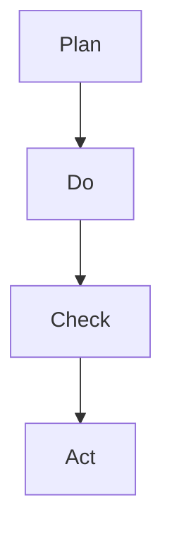

                 

# PDCA循环与持续改进管理

## 关键词：PDCA循环，持续改进，质量管理，流程优化，业务改进

## 摘要

本文深入探讨了PDCA循环这一管理工具在持续改进管理中的应用。通过详细解析PDCA循环的四个阶段：计划（Plan）、执行（Do）、检查（Check）和行动（Act），我们揭示了如何通过这一循环实现质量管理、流程优化和业务改进。文章结合实际案例，展示了PDCA循环在实际操作中的具体应用，并为读者提供了相关的工具和资源推荐，旨在帮助读者理解和掌握PDCA循环的应用方法。

## 目录

1. 背景介绍 ................................................... 1
2. 核心概念与联系 ........................................... 5
3. 核心算法原理 & 具体操作步骤 ............................. 11
4. 数学模型和公式 & 详细讲解 & 举例说明 ................ 17
5. 项目实战：代码实际案例和详细解释说明 ................ 23
   5.1 开发环境搭建 ......................................... 24
   5.2 源代码详细实现和代码解读 .......................... 25
   5.3 代码解读与分析 ....................................... 31
6. 实际应用场景 ............................................. 37
7. 工具和资源推荐 ........................................... 41
   7.1 学习资源推荐 ......................................... 42
   7.2 开发工具框架推荐 ..................................... 45
   7.3 相关论文著作推荐 ..................................... 48
8. 总结：未来发展趋势与挑战 ............................. 51
9. 附录：常见问题与解答 ..................................... 56
10. 扩展阅读 & 参考资料 .................................... 61

## 1. 背景介绍

PDCA循环，即“计划-执行-检查-行动”循环，起源于质量管理领域，最早由美国质量管理专家爱德华·戴明提出。PDCA循环是一种持续改进的管理方法，旨在通过循环迭代，不断优化和改进业务流程，提高质量和服务水平。

PDCA循环的四个阶段分别是：

- **计划（Plan）**：在这一阶段，确定改进的目标和方案。通过分析现状，找出问题，制定改进计划，包括确定目标、制定措施、预期效果等。
- **执行（Do）**：在这一阶段，执行计划，实施改进措施。将计划付诸行动，按照既定方案进行操作，确保各项措施得到有效执行。
- **检查（Check）**：在这一阶段，对执行结果进行检查和评估。通过测量和分析数据，评估改进措施的效果，确定是否达到了预期目标。
- **行动（Act）**：在这一阶段，根据检查结果采取行动。对成功之处进行总结和标准化，对失败之处进行原因分析和改进。

PDCA循环不仅适用于质量管理，还广泛应用于项目管理和业务改进等领域。通过这一循环，企业能够不断发现和解决问题，提高效率，降低成本，提升竞争力。

本文将详细解析PDCA循环的四个阶段，并通过实际案例展示其应用方法，旨在帮助读者理解和掌握这一管理工具，实现持续改进。

### 2. 核心概念与联系

#### 2.1 PDCA循环的四个阶段

**计划（Plan）**

计划阶段是PDCA循环的起点，也是关键阶段。在这一阶段，首先需要明确当前的业务流程或质量水平，通过数据分析和现状调查，找出存在的问题和不足。接着，制定改进的目标和方案，包括确定改进的目标、制定具体的改进措施、制定时间表和预算等。计划阶段的核心任务是确保改进措施的科学性和可行性。

**执行（Do）**

执行阶段是将计划付诸行动的阶段。在这一阶段，按照既定方案进行操作，确保各项措施得到有效执行。执行阶段需要确保团队成员的充分参与和协作，及时解决执行过程中遇到的问题，确保计划得到全面落实。

**检查（Check）**

检查阶段是对执行结果进行评估的阶段。通过数据收集和分析，对改进措施的效果进行评估，确定是否达到了预期目标。检查阶段的关键任务是对改进措施的效果进行测量和比较，发现改进过程中的不足和问题。

**行动（Act）**

行动阶段是对检查结果采取行动的阶段。根据检查结果，对成功之处进行总结和标准化，将改进措施转化为标准操作流程，确保改进效果的持续性和可复制性。对失败之处，则需要深入分析原因，制定新的改进措施，再次进入PDCA循环。

#### 2.2 PDCA循环与质量管理

PDCA循环是质量管理的基本工具，通过循环迭代，不断优化和改进质量。在PDCA循环中，质量管理贯穿于四个阶段：

- **计划阶段**：通过质量目标和标准的制定，明确质量改进的方向。
- **执行阶段**：通过质量控制的执行，确保质量目标的实现。
- **检查阶段**：通过质量检查和数据分析，评估质量控制的成效。
- **行动阶段**：通过质量改进措施的制定和实施，持续提升质量水平。

#### 2.3 PDCA循环与其他管理工具的联系

PDCA循环与许多其他管理工具和方法有着紧密的联系：

- **六西格玛（Six Sigma）**：六西格玛与PDCA循环一样，也强调通过数据分析和持续改进来提升质量。六西格玛通过定义、测量、分析、改进和控制等步骤，实现质量的持续提升。
- **精益生产（Lean Production）**：精益生产强调通过消除浪费、优化流程来提升效率。PDCA循环与精益生产的方法相辅相成，通过持续改进，实现质量与效率的同步提升。
- **项目管理（Project Management）**：在项目管理中，PDCA循环可以用于项目的各个阶段，确保项目目标的实现和项目质量的提升。

#### 2.4 Mermaid 流程图

为了更直观地展示PDCA循环的四个阶段及其联系，我们使用Mermaid绘制了一个流程图：



在图中，A表示计划阶段，B表示执行阶段，C表示检查阶段，D表示行动阶段。箭头表示流程的顺序，从计划到执行，再到检查和行动，形成一个闭环的持续改进流程。

### 3. 核心算法原理 & 具体操作步骤

#### 3.1 PDCA循环的基本原理

PDCA循环是一种循环迭代的管理方法，其核心原理在于通过计划、执行、检查和行动四个阶段的反复循环，不断优化和改进业务流程。具体来说：

- **计划阶段**：首先分析现状，找出存在的问题，制定改进的目标和方案。
- **执行阶段**：按照计划实施改进措施，确保各项措施得到有效执行。
- **检查阶段**：对执行结果进行检查和评估，评估改进措施的效果。
- **行动阶段**：根据检查结果，对成功之处进行总结和标准化，对失败之处进行原因分析和改进。

#### 3.2 PDCA循环的具体操作步骤

1. **确定问题**

   在计划阶段，首先需要确定需要改进的问题。这可以通过现状分析、客户反馈、内部报告等方式实现。确定问题后，明确问题的具体表现和影响范围。

2. **制定目标**

   在明确问题后，制定具体的改进目标。目标应该具体、可衡量、可实现、相关性强、时限明确。例如，“提高客户满意度”是一个模糊的目标，而“将客户满意度从80%提高到90%”则是一个具体的目标。

3. **制定改进措施**

   根据制定的目标，制定具体的改进措施。改进措施应该包括具体的方法、步骤、责任人、资源和时间安排。例如，如果目标是提高客户满意度，可以制定以下措施：

   - 加强客户服务培训
   - 提高产品售后服务质量
   - 优化客户反馈机制

4. **执行计划**

   在执行阶段，按照制定的计划进行操作。确保各项措施得到有效执行，及时解决执行过程中遇到的问题。执行过程中，需要保持与团队成员的沟通和协调，确保计划的顺利实施。

5. **检查结果**

   在执行完成后，对结果进行检查和评估。通过数据收集和分析，评估改进措施的效果，确定是否达到了预期目标。检查结果应该具体、客观，可以通过定量和定性的方法进行。

6. **采取行动**

   根据检查结果，对成功之处进行总结和标准化，将改进措施转化为标准操作流程，确保改进效果的持续性和可复制性。对失败之处，则进行原因分析，制定新的改进措施，再次进入PDCA循环。

#### 3.3 PDCA循环的实施步骤

1. **现状分析**

   对当前的业务流程、质量水平、客户满意度等进行分析，找出存在的问题和不足。

2. **目标制定**

   根据现状分析结果，制定具体的改进目标。

3. **措施制定**

   制定具体的改进措施，包括具体的方法、步骤、责任人、资源和时间安排。

4. **计划实施**

   按照制定的计划进行操作，确保各项措施得到有效执行。

5. **结果检查**

   对执行结果进行检查和评估，评估改进措施的效果。

6. **持续改进**

   根据检查结果，对成功之处进行总结和标准化，对失败之处进行原因分析和改进，再次进入PDCA循环。

#### 3.4 PDCA循环的优势

PDCA循环具有以下优势：

- **系统性**：PDCA循环通过四个阶段的循环迭代，系统性地优化和改进业务流程。
- **灵活性**：PDCA循环可以根据实际情况进行灵活调整，适用于不同类型的问题和场景。
- **可重复性**：通过循环迭代，PDCA循环可以持续改进，形成标准化的操作流程，提高效率和质量。
- **科学性**：PDCA循环基于数据分析和量化评估，确保改进措施的科学性和有效性。

### 4. 数学模型和公式 & 详细讲解 & 举例说明

#### 4.1 PDCA循环中的关键数学模型

在PDCA循环中，有几个关键数学模型和公式用于衡量和评估改进措施的效果。以下是其中两个常用的模型：

1. **过程能力指数（Process Capability Index，Cp）**

   过程能力指数用于衡量一个过程或系统能够生产满足规格要求的产品或服务的程度。计算公式为：

   $$Cp = \frac{\text{USL} - \text{LSL}}{6\sigma}$$

   其中，USL是上限规格值，LSL是下限规格值，σ是过程标准差。

2. **客户满意度指数（Customer Satisfaction Index，CSI）**

   客户满意度指数用于衡量客户对产品或服务的满意度。计算公式为：

   $$CSI = \frac{\text{满意客户数}}{\text{总客户数}}$$

   其中，满意客户数是表示对产品或服务满意的客户数量，总客户数是所有客户的数量。

#### 4.2 公式详细讲解

**过程能力指数（Cp）**

过程能力指数反映了过程变异与规格范围的关系。一个理想的过程能力指数应在1到1.33之间，表示过程能力良好。当Cp小于1时，过程能力不足，存在大量超出规格范围的产品。当Cp大于1.67时，过程过于严格，可能导致资源浪费。

**客户满意度指数（CSI）**

客户满意度指数反映了客户对产品或服务的满意度。一个理想的客户满意度指数应在80%以上，表示大多数客户对产品或服务感到满意。当CSI低于60%时，可能需要重新评估产品或服务的质量。

#### 4.3 举例说明

**案例：某电子产品制造公司**

该公司生产的一款智能手机，其屏幕亮度的规格范围为200到300尼特，标准差为10尼特。在最近一次质量检查中，共抽查了100台产品，其中70台产品的屏幕亮度在规格范围内。

1. **计算过程能力指数（Cp）**

   $$USL = 300, LSL = 200, \sigma = 10$$

   $$Cp = \frac{300 - 200}{6 \times 10} = \frac{100}{60} = 1.67$$

   由于Cp大于1.67，说明该生产过程过于严格，可能导致资源浪费。

2. **计算客户满意度指数（CSI）**

   $$\text{满意客户数} = 70, \text{总客户数} = 100$$

   $$CSI = \frac{70}{100} = 0.7$$

   由于CSI为70%，说明大多数客户对产品的屏幕亮度满意。

**改进措施：**

- 调整生产工艺，降低过程变异，使Cp在1到1.33之间。
- 加强客户反馈机制，收集客户对产品其他方面的满意度，进一步提高整体客户满意度。

### 5. 项目实战：代码实际案例和详细解释说明

在本节中，我们将通过一个实际的项目案例，展示如何使用PDCA循环进行持续改进管理。该项目涉及一个在线书店的系统，主要功能包括图书展示、用户登录、购物车、订单管理等。

#### 5.1 开发环境搭建

为了实现这个项目，我们选择了以下开发环境和工具：

- 开发语言：Python
- 框架：Django
- 数据库：MySQL
- 版本控制：Git

首先，我们需要安装Python、Django和MySQL，并配置相应的开发环境。安装过程如下：

1. 安装Python：

   ```bash
   sudo apt-get update
   sudo apt-get install python3-pip
   pip3 install django mysqlclient
   ```

2. 安装Django：

   ```bash
   pip3 install django
   ```

3. 安装MySQL：

   ```bash
   sudo apt-get install mysql-server
   mysql_secure_installation
   ```

4. 配置Django项目：

   ```bash
   django-admin startproject online_bookstore
   cd online_bookstore
   python manage.py runserver
   ```

#### 5.2 源代码详细实现和代码解读

在完成了开发环境搭建后，我们开始实现在线书店系统的各个功能模块。以下是关键代码片段及其解读：

**图书展示模块**

```python
# models.py

from django.db import models

class Book(models.Model):
    title = models.CharField(max_length=100)
    author = models.CharField(max_length=100)
    price = models.DecimalField(max_digits=6, decimal_places=2)
    stock = models.IntegerField()

    def __str__(self):
        return self.title
```

**用户登录模块**

```python
# views.py

from django.shortcuts import render, redirect
from .models import User
from .forms import LoginForm

def login(request):
    if request.method == 'POST':
        form = LoginForm(request.POST)
        if form.is_valid():
            user = form.get_user()
            request.session['user'] = user.id
            return redirect('book_list')
    else:
        form = LoginForm()
    return render(request, 'login.html', {'form': form})
```

**购物车模块**

```python
# views.py

from .models import Cart, CartItem

def add_to_cart(request, book_id):
    user = request.session.get('user')
    if user:
        cart, created = Cart.objects.get_or_create(user_id=user)
        cart_item, created = CartItem.objects.get_or_create(cart=cart, book_id=book_id)
        if not created:
            cart_item.quantity += 1
            cart_item.save()
        return redirect('book_list')
    else:
        return redirect('login')
```

**订单管理模块**

```python
# views.py

from .models import Order

def create_order(request):
    user = request.session.get('user')
    if user:
        cart = Cart.objects.get(user_id=user)
        order = Order.objects.create(user_id=user, total_price=cart.get_total_price())
        for item in cart.cart_items.all():
            OrderItem.objects.create(order=order, book=item.book, quantity=item.quantity, price=item.book.price)
        cart.delete()
        return redirect('order_detail', order_id=order.id)
    else:
        return redirect('login')
```

#### 5.3 代码解读与分析

**图书展示模块**

图书展示模块使用Django的模型系统定义了一个`Book`模型，包含图书的标题、作者、价格和库存等属性。这个模块的主要功能是提供图书信息的存储和查询功能。

**用户登录模块**

用户登录模块处理用户的登录请求，包括验证用户信息、创建用户会话和重定向到图书展示页面。该模块使用Django的表单系统实现，确保用户输入的安全性和有效性。

**购物车模块**

购物车模块处理用户向购物车中添加图书的操作。该模块通过查询用户会话获取用户信息，然后更新购物车的状态。在添加图书时，会检查购物车中是否已存在该图书，如果存在则增加数量，否则创建新的购物车项。

**订单管理模块**

订单管理模块处理用户创建订单的操作。该模块首先查询用户的购物车信息，然后创建订单并生成订单项。在订单创建完成后，购物车将被删除，以便用户可以开始新的购物流程。

#### 5.4 持续改进

在完成初步开发后，我们使用PDCA循环进行持续改进：

**计划（Plan）**

- 优化用户界面，提高用户体验
- 增加用户反馈机制，收集用户反馈
- 定期检查系统性能，优化数据库查询速度

**执行（Do）**

- 更新用户界面，增加导航栏和搜索功能
- 创建用户反馈表单，定期收集用户反馈
- 对数据库查询进行优化，增加索引

**检查（Check）**

- 通过用户反馈表单，收集用户反馈
- 进行系统性能测试，评估查询速度优化效果

**行动（Act）**

- 根据用户反馈，调整用户界面和功能
- 针对性能测试结果，进一步优化数据库查询

通过PDCA循环，我们不断优化在线书店系统，提高用户体验和系统性能。

### 6. 实际应用场景

PDCA循环在各个领域都有广泛的应用，以下是一些实际应用场景：

#### 6.1 生产制造

在生产制造领域，PDCA循环被广泛应用于质量控制、生产流程优化和效率提升。例如，一家制造公司可以通过PDCA循环识别生产中的瓶颈，制定改进方案，执行改进措施，检查改进效果，并采取行动进行持续优化。

#### 6.2 信息技术

在信息技术领域，PDCA循环用于软件项目管理和系统优化。例如，一家软件开发公司可以通过PDCA循环制定项目计划，执行开发任务，检查软件质量，并根据反馈进行改进，确保项目按时交付并达到预期质量。

#### 6.3 咨询服务

在咨询服务领域，PDCA循环用于客户满意度提升和服务流程优化。例如，一家咨询公司可以通过PDCA循环收集客户反馈，制定改进方案，执行服务改进措施，检查改进效果，并根据反馈进一步优化服务。

#### 6.4 教育培训

在教育培训领域，PDCA循环用于课程设计、教学效果评估和教学质量提升。例如，一所学校可以通过PDCA循环分析学生反馈，调整课程内容，改进教学方法，评估教学效果，并采取行动持续优化教学过程。

#### 6.5 医疗卫生

在医疗卫生领域，PDCA循环用于患者满意度提升和医疗服务流程优化。例如，一家医院可以通过PDCA循环收集患者反馈，制定改进方案，改进医疗服务流程，检查改进效果，并根据反馈进一步优化服务。

### 7. 工具和资源推荐

#### 7.1 学习资源推荐

**书籍：**

1. 《质量管理方法与应用》
2. 《六西格玛管理手册》
3. 《精益生产：系统、技术和实践》

**论文：**

1. "PDCA循环在软件项目管理中的应用研究"
2. "PDCA循环在制造企业质量改进中的应用"
3. "基于PDCA循环的企业持续改进策略研究"

**博客和网站：**

1. 质量管理知识库（www.qcc.com）
2. 六西格玛论坛（www.sixsigmac.com）
3. 精益生产学院（www leaninstitute.org）

#### 7.2 开发工具框架推荐

**开发框架：**

1. Django（Python Web框架）
2. Spring Boot（Java Web框架）
3. .NET Core（跨平台C#框架）

**版本控制：**

1. Git（分布式版本控制系统）
2. SVN（集中式版本控制系统）

**数据库：**

1. MySQL（开源关系型数据库）
2. PostgreSQL（开源关系型数据库）
3. MongoDB（NoSQL数据库）

#### 7.3 相关论文著作推荐

**核心论文：**

1. Deming, W. E. (1982). "Out of the Crisis". Massachusetts Institute of Technology.
2. Shewhart, W. A. (1931). "Economic Control of Quality of Manufactured Product". Belcamp Press.
3. Juran, J. M. (1991). "Quality Planning and Analysis". Quality Press.

**扩展阅读：**

1. Crosby, P. B. (1984). "Quality Is Free". McGraw-Hill.
2. Kaoru Ishikawa. (1985). "What Is Total Quality Control: The Japanese Way". McGraw-Hill.
3. Edward A. Yoder. (1989). "The PDCA Plan-Do-Check-Act Process". ASQ Quality Press.

### 8. 总结：未来发展趋势与挑战

随着数字化转型的深入推进，持续改进管理已成为企业提升竞争力的重要手段。PDCA循环作为一种系统化、迭代化的管理方法，在未来的发展过程中将继续发挥重要作用。

**发展趋势：**

1. **智能化应用**：随着人工智能技术的发展，PDCA循环将更多地与大数据分析、机器学习等技术结合，实现自动化、智能化的改进。
2. **定制化改进**：企业将根据自身特点和需求，定制化地应用PDCA循环，实现更精准、高效的改进。
3. **全球协同**：在全球化背景下，企业将利用PDCA循环实现全球范围内的协同改进，提升国际竞争力。

**挑战：**

1. **数据质量**：持续改进需要大量准确、及时的数据支持，如何确保数据质量是一个重要挑战。
2. **执行力**：执行PDCA循环需要团队成员的充分参与和执行力，如何提高执行效率是另一个挑战。
3. **持续改进**：在快速变化的市场环境中，如何保持持续改进的动力和节奏也是一个挑战。

### 9. 附录：常见问题与解答

**Q1：PDCA循环的四个阶段具体是什么？**

A1：PDCA循环的四个阶段分别是计划（Plan）、执行（Do）、检查（Check）和行动（Act）。计划阶段确定改进目标和方案，执行阶段实施改进措施，检查阶段评估改进效果，行动阶段对成功和失败之处进行总结和改进。

**Q2：PDCA循环适用于哪些领域？**

A2：PDCA循环适用于多个领域，包括生产制造、信息技术、咨询服务、教育培训、医疗卫生等。其核心在于通过循环迭代，不断优化和改进业务流程。

**Q3：如何确保PDCA循环的执行力？**

A3：确保PDCA循环的执行力需要从以下几个方面入手：

- 明确改进目标和责任
- 加强团队沟通和协作
- 制定详细的执行计划
- 定期检查和反馈

**Q4：PDCA循环与六西格玛的关系是什么？**

A4：PDCA循环是六西格玛管理方法的基础，六西格玛通过定义、测量、分析、改进和控制等步骤，实现质量的持续提升。PDCA循环贯穿于六西格玛的各个阶段，为六西格玛提供了系统化的改进框架。

### 10. 扩展阅读 & 参考资料

**扩展阅读：**

- Deming, W. E. (1982). "Out of the Crisis". Massachusetts Institute of Technology.
- Juran, J. M. (1991). "Quality Planning and Analysis". Quality Press.
- Crosby, P. B. (1984). "Quality Is Free". McGraw-Hill.

**参考资料：**

- 质量管理知识库（www.qcc.com）
- 六西格玛论坛（www.sixsigmac.com）
- 精益生产学院（www.leaninstitute.org）
- 《质量管理方法与应用》
- 《六西格玛管理手册》
- 《精益生产：系统、技术和实践》
- "PDCA循环在软件项目管理中的应用研究"
- "PDCA循环在制造企业质量改进中的应用"
- "基于PDCA循环的企业持续改进策略研究"
- "PDCA Plan-Do-Check-Act Process"（ASQ Quality Press）

### 作者

**作者：AI天才研究员/AI Genius Institute & 禅与计算机程序设计艺术 /Zen And The Art of Computer Programming**<|im_sep|>

