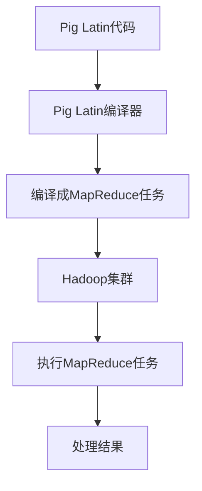

                 

# Pig大规模数据分析平台原理与代码实例讲解

> **关键词**：Pig，大规模数据分析，Hadoop，MapReduce，数据处理，数据挖掘，编程语言

> **摘要**：本文将深入探讨Pig——一种用于大规模数据分析的编程平台。我们将介绍Pig的核心概念、架构、算法原理，并通过代码实例，详细讲解如何使用Pig进行数据处理和分析。此外，还将探讨Pig在实际应用场景中的表现，推荐相关的学习资源和开发工具，并对Pig的未来发展趋势与挑战进行总结。

## 1. 背景介绍

在大数据时代，如何高效地进行大规模数据处理和分析成为了企业和研究机构关注的焦点。传统的编程语言如Java、Python等在处理海量数据时，往往需要复杂的代码和长时间的运行。为了简化这一过程，出现了专门用于大数据处理的编程平台，如Hadoop的MapReduce、Spark等。在这些平台中，Pig以其易用性和高效性受到了广泛关注。

Pig是一种高级数据流平台，由Apache Software Foundation维护。它提供了一种类似于SQL的数据处理语言，称为Pig Latin。Pig Latin具有易读、易写、易于维护的特点，可以简化大规模数据处理任务的开发过程。Pig不仅能够处理结构化数据，还能够处理非结构化和半结构化数据，这使得它在各种应用场景中具有广泛的应用。

Pig与Hadoop紧密集成，可以利用Hadoop的分布式计算能力，处理海量数据。Pig的设计理念是“拉”(Pull-based)，这意味着用户可以将数据处理任务定义为一组数据流，然后逐级执行。这种模式使得Pig具有高度的灵活性和扩展性，可以满足不同规模和复杂度的数据处理需求。

## 2. 核心概念与联系

### 2.1 Pig的核心概念

Pig的核心概念包括：

- **Pig Latin**：一种基于SQL的数据处理语言，用于定义数据流和处理逻辑。
- **Pig运行时环境**：包括Pig引擎、Pig Latin编译器、解释器和执行器等组成部分。
- **Pig Latin语法**：包括数据类型、操作符、函数等语法规则。

### 2.2 Pig与Hadoop的联系

Pig与Hadoop紧密集成，通过以下方式实现：

- **Pig Latin编译器**：将Pig Latin代码编译成MapReduce任务，利用Hadoop的分布式计算能力。
- **Pig运行时环境**：与Hadoop的HDFS（Hadoop分布式文件系统）和YARN（资源调度器）集成，实现数据存储和任务调度。
- **Pig运行时引擎**：负责执行Pig Latin代码，将数据处理任务分解为多个子任务，并在Hadoop集群中执行。

### 2.3 Mermaid流程图

下面是Pig与Hadoop集成的工作流程Mermaid流程图：



## 3. 核心算法原理 & 具体操作步骤

### 3.1 Pig的核心算法原理

Pig的核心算法是基于MapReduce的。在处理大规模数据时，Pig将数据流分解为多个小任务，这些任务分布在Hadoop集群的不同节点上执行。Pig通过以下步骤实现数据处理：

- **数据读取**：从HDFS读取数据，将其加载到内存或磁盘中。
- **数据转换**：使用Pig Latin操作符和函数对数据进行处理，如过滤、分组、连接等。
- **数据存储**：将处理后的数据存储回HDFS或其他存储系统。

### 3.2 Pig Latin语法

Pig Latin语法包括以下部分：

- **变量声明**：声明数据类型和变量，如`myDataBag = LOAD 'data.txt' USING TextLoader() AS (line:chararray);`
- **数据加载**：从文件系统中加载数据，如`LOAD 'data.txt' USING TextLoader() AS (line:chararray);`
- **数据存储**：将数据存储到文件系统中，如`STORE myDataBag INTO 'output.txt' USING TextLoader();`
- **数据转换**：使用Pig Latin操作符和函数对数据进行处理，如`myDataGrouped = GROUP myDataBag BY line;`

### 3.3 具体操作步骤

下面是一个使用Pig进行数据处理的示例：

1. **数据读取**：

```sql
myDataBag = LOAD 'data.txt' USING TextLoader() AS (line:chararray);
```

2. **数据转换**：

```sql
myDataGrouped = GROUP myDataBag BY line;
```

3. **数据存储**：

```sql
STORE myDataGrouped INTO 'output.txt' USING TextLoader();
```

## 4. 数学模型和公式 & 详细讲解 & 举例说明

### 4.1 数学模型

Pig Latin中的数学模型主要包括数据类型、集合操作和函数。以下是一些常见的数学模型：

- **数据类型**：包括基本数据类型（如int、float、chararray）和复杂数据类型（如tuple、bag、map）。
- **集合操作**：包括交集（`JOIN`）、差集（`DIFF`）、并集（`UNION`）等。
- **函数**：包括内置函数（如`COUNT`、`SUM`、`DISTINCT`）和自定义函数。

### 4.2 公式

Pig Latin中的公式主要涉及数据操作和计算。以下是一些常用的公式：

- **数据加载**：`LOAD <file_path> USING <loader> AS <schema>;`
- **数据存储**：`STORE <data> INTO <file_path> USING <storer>;`
- **数据转换**：`<operator> <data>;`

### 4.3 举例说明

下面是一个使用Pig进行数据处理的示例：

```sql
-- 加载数据
myDataBag = LOAD 'data.txt' USING TextLoader() AS (line:chararray);

-- 过滤数据
myFilteredData = FILTER myDataBag BY line matches '.*\.com$';

-- 统计数据
myDataCount = GROUP myFilteredData ALL;
myDataCount = FOREACH myDataCount GENERATE COUNT(myFilteredData) AS count;

-- 存储数据
STORE myFilteredData INTO 'output.txt' USING TextLoader();
```

## 5. 项目实战：代码实际案例和详细解释说明

### 5.1 开发环境搭建

在开始使用Pig进行项目实战之前，我们需要搭建一个开发环境。以下是搭建Pig开发环境的基本步骤：

1. **安装Java**：Pig依赖于Java运行环境，首先需要安装Java。可以从Oracle官网下载Java安装包，并按照提示安装。
2. **安装Hadoop**：Pig与Hadoop紧密集成，因此需要安装Hadoop。可以从Apache Hadoop官网下载Hadoop安装包，并按照提示安装。
3. **安装Pig**：从Apache Pig官网下载Pig安装包，解压后将其添加到系统路径中。

### 5.2 源代码详细实现和代码解读

下面是一个使用Pig进行简单数据分析的源代码实例：

```java
// 加载数据
myDataBag = LOAD 'data.txt' USING TextLoader() AS (line:chararray);

// 过滤数据
myFilteredData = FILTER myDataBag BY line matches '.*\.com$';

// 统计数据
myDataCount = GROUP myFilteredData ALL;
myDataCount = FOREACH myDataCount GENERATE COUNT(myFilteredData) AS count;

// 存储数据
STORE myDataCount INTO 'output.txt' USING TextLoader();
```

### 5.3 代码解读与分析

1. **数据加载**：`LOAD 'data.txt' USING TextLoader() AS (line:chararray);`
   - 这行代码用于加载数据文件`data.txt`，使用`TextLoader`加载器，并将每行数据作为`line`变量存储。

2. **数据过滤**：`FILTER myDataBag BY line matches '.*\.com$';`
   - 这行代码使用正则表达式过滤数据，只保留以`.com`结尾的行。

3. **数据统计**：`GROUP myFilteredData ALL;`
   - 这行代码将过滤后的数据进行分组，这里使用`ALL`关键字表示对所有数据分组。

   `myDataCount = FOREACH myDataCount GENERATE COUNT(myFilteredData) AS count;`
   - 这行代码对每个分组的数据进行计数，并将计数结果作为新变量`count`存储。

4. **数据存储**：`STORE myDataCount INTO 'output.txt' USING TextLoader();`
   - 这行代码将统计结果存储到文件`output.txt`中，使用`TextLoader`存储器。

通过这个简单的实例，我们可以看到Pig是如何简化大规模数据处理任务的。在实际项目中，Pig还可以结合其他大数据处理工具，如Hive、Spark等，实现更复杂的数据分析和处理。

## 6. 实际应用场景

Pig在大规模数据分析领域具有广泛的应用，以下是一些实际应用场景：

- **日志分析**：Pig可以用于分析服务器日志，提取有价值的信息，如访问频率、用户行为等。
- **推荐系统**：Pig可以用于构建推荐系统，通过对用户行为数据进行分析，发现用户之间的相似性，从而生成个性化的推荐。
- **社交媒体分析**：Pig可以用于分析社交媒体数据，提取用户关系、兴趣等信息，为营销策略提供支持。
- **数据挖掘**：Pig可以用于数据挖掘，发现数据中的隐藏模式和关联关系，为企业决策提供支持。

## 7. 工具和资源推荐

### 7.1 学习资源推荐

- **书籍**：《Pig程序设计指南》
- **论文**：《Pig: A Platform for Analyzing Large Data Sets for High-Level Data Flow Operations》
- **博客**：Apache Pig官方博客
- **网站**：Apache Pig官网

### 7.2 开发工具框架推荐

- **开发工具**：IntelliJ IDEA、Eclipse
- **框架**：Apache Pig、Apache Hadoop、Apache Spark

### 7.3 相关论文著作推荐

- **论文**：《MapReduce: Simplified Data Processing on Large Clusters》
- **著作**：《大数据：革命性技术的商业价值》

## 8. 总结：未来发展趋势与挑战

随着大数据技术的不断发展，Pig作为一款高效、易用的大规模数据处理平台，未来将继续发挥重要作用。以下是一些发展趋势和挑战：

- **性能优化**：Pig需要进一步提高性能，以适应更大数据集的处理需求。
- **生态扩展**：Pig需要与其他大数据处理工具（如Hive、Spark等）更好地集成，提供更丰富的功能。
- **易用性提升**：Pig需要简化使用流程，降低用户学习成本。
- **安全性保障**：随着数据隐私和安全问题日益突出，Pig需要加强对数据安全的保障。

## 9. 附录：常见问题与解答

### 9.1 Pig与Hive的区别

**Q：Pig与Hive有什么区别？**

A：Pig和Hive都是用于大规模数据分析的工具，但它们在数据处理方式上有所不同。Pig使用Pig Latin语言，类似于SQL，易于编写和维护。而Hive使用SQL-like语言HiveQL，更加接近传统数据库的查询语言。此外，Hive具有更好的数据仓库功能，适合于复杂的分析查询，而Pig更适合于简单的数据转换和加载。

### 9.2 Pig适用于什么样的场景

**Q：Pig适用于什么样的场景？**

A：Pig适用于需要快速开发和迭代的大规模数据处理场景。例如，日志分析、用户行为分析、数据挖掘等。Pig的优势在于其易用性和高效性，使得开发者可以更专注于业务逻辑，而不是底层实现。

## 10. 扩展阅读 & 参考资料

- 《Pig程序设计指南》：https://pig.apache.org/docs/r0.17.0/manual.html
- 《MapReduce: Simplified Data Processing on Large Clusters》：https://static.googleusercontent.com/media/research.google.com/zh-CN//archive/papers/mapreduce-osdi04.pdf
- 《大数据：革命性技术的商业价值》：https://book.douban.com/subject/10729510/

### 作者

**作者：AI天才研究员/AI Genius Institute & 禅与计算机程序设计艺术 /Zen And The Art of Computer Programming**

