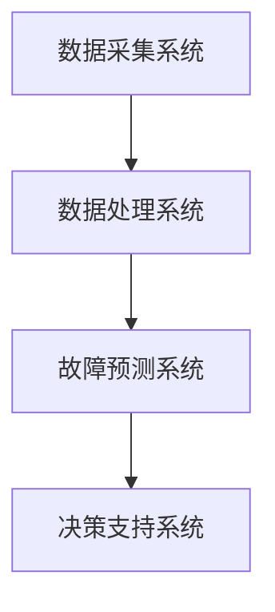

                 

# Predictive Maintenance原理与代码实例讲解

> **关键词：** 预测性维护、机器学习、故障预测、算法实现、实际应用

> **摘要：** 本文将深入探讨预测性维护（Predictive Maintenance）的概念、核心算法原理及其在工业领域的实际应用。通过详细讲解和代码实例，帮助读者理解预测性维护的原理和实现过程。

## 1. 背景介绍

### 1.1 预测性维护的定义与意义

预测性维护是一种基于数据分析和机器学习技术的维护策略，通过实时监测设备的运行状态和关键参数，预测设备可能出现的故障，从而在故障发生之前进行预防性维护，降低停机时间和维修成本。

预测性维护的意义在于：

- **提高设备利用率**：通过预测性维护，可以提前安排维护计划，减少设备停机时间，提高生产效率。
- **降低维修成本**：在故障发生之前进行维护，可以避免突发性故障导致的紧急维修，降低维修成本。
- **提升生产安全性**：预测性维护可以及时发现并排除潜在的安全隐患，保障生产过程的安全。

### 1.2 预测性维护的发展历程

预测性维护的概念起源于20世纪60年代的美国，当时主要用于航空和航天领域。随着计算机技术和大数据技术的发展，预测性维护逐渐扩展到工业制造、电力、能源等多个领域。

目前，预测性维护技术已趋于成熟，各大企业纷纷投入大量资源进行研究和应用。例如，通用电气（GE）的Predix平台，西门子的MindSphere平台等，都提供了丰富的预测性维护解决方案。

## 2. 核心概念与联系

### 2.1 预测性维护的关键概念

预测性维护涉及多个关键概念：

- **数据采集**：通过传感器和监测设备，实时采集设备的运行数据。
- **数据预处理**：对采集到的数据进行清洗、归一化等处理，为后续分析提供高质量的数据。
- **特征提取**：从预处理后的数据中提取对故障预测有用的特征。
- **故障预测模型**：构建故障预测模型，通过对特征数据的分析，预测设备可能出现的故障。

### 2.2 预测性维护的架构

预测性维护的架构主要包括以下部分：

1. **数据采集系统**：负责实时采集设备的运行数据。
2. **数据处理系统**：对采集到的数据进行预处理和特征提取。
3. **故障预测系统**：构建故障预测模型，对设备进行实时监测和预测。
4. **决策支持系统**：根据故障预测结果，提供维护决策建议。

下面是一个简单的Mermaid流程图，展示了预测性维护的架构：



## 3. 核心算法原理 & 具体操作步骤

### 3.1 机器学习算法简介

预测性维护的核心是故障预测模型，通常采用机器学习算法来实现。下面介绍几种常用的机器学习算法：

1. **线性回归**：用于预测连续的数值型目标。
2. **逻辑回归**：用于预测二分类问题。
3. **决策树**：通过划分特征空间，生成决策树模型。
4. **支持向量机（SVM）**：用于分类问题，特别是在高维空间中具有较好的性能。
5. **神经网络**：通过多层神经网络，对复杂问题进行建模。

### 3.2 故障预测模型的构建

构建故障预测模型通常包括以下步骤：

1. **数据收集**：收集设备运行过程中产生的数据。
2. **数据预处理**：对收集到的数据进行清洗、归一化等处理。
3. **特征提取**：从预处理后的数据中提取对故障预测有用的特征。
4. **模型选择**：根据问题的性质和数据特点，选择合适的机器学习算法。
5. **模型训练**：使用训练数据集，对模型进行训练。
6. **模型评估**：使用测试数据集，评估模型的预测性能。
7. **模型优化**：根据评估结果，调整模型参数，优化模型性能。

### 3.3 代码示例

以下是一个使用Python和Scikit-learn库实现故障预测的简单示例：

```python
from sklearn.linear_model import LinearRegression
from sklearn.model_selection import train_test_split
from sklearn.metrics import mean_squared_error

# 加载数据
X, y = load_data()

# 数据划分
X_train, X_test, y_train, y_test = train_test_split(X, y, test_size=0.2, random_state=42)

# 模型构建
model = LinearRegression()

# 模型训练
model.fit(X_train, y_train)

# 模型预测
y_pred = model.predict(X_test)

# 模型评估
mse = mean_squared_error(y_test, y_pred)
print("MSE:", mse)
```

## 4. 数学模型和公式 & 详细讲解 & 举例说明

### 4.1 线性回归模型

线性回归是一种常用的预测性维护算法，其数学模型可以表示为：

\[ y = \beta_0 + \beta_1x_1 + \beta_2x_2 + \ldots + \beta_nx_n + \epsilon \]

其中，\( y \) 是预测的目标值，\( x_1, x_2, \ldots, x_n \) 是特征值，\( \beta_0, \beta_1, \beta_2, \ldots, \beta_n \) 是模型参数，\( \epsilon \) 是误差项。

线性回归模型的参数可以通过最小二乘法（Least Squares）进行估计：

\[ \hat{\beta} = (X^T X)^{-1} X^T y \]

### 4.2 逻辑回归模型

逻辑回归（Logistic Regression）是一种用于二分类问题的算法，其数学模型可以表示为：

\[ P(y=1) = \frac{1}{1 + e^{-(\beta_0 + \beta_1x_1 + \beta_2x_2 + \ldots + \beta_nx_n)}} \]

其中，\( P(y=1) \) 是预测的目标值 \( y \) 等于1的概率。

逻辑回归的参数可以通过最大似然估计（Maximum Likelihood Estimation）进行估计。

### 4.3 决策树模型

决策树（Decision Tree）是一种基于特征划分数据的算法，其数学模型可以表示为：

\[ y = g(\beta_0 + \beta_1x_1 + \beta_2x_2 + \ldots + \beta_nx_n) \]

其中，\( g(\cdot) \) 是决策函数，通常是一个分段函数。

决策树的构建过程可以归纳为：

1. 选择一个特征 \( x_i \)。
2. 计算特征 \( x_i \) 在每个取值上的增益。
3. 选择增益最大的特征 \( x_i \) 作为划分特征。
4. 将数据划分为两个子集，分别对应特征 \( x_i \) 的不同取值。
5. 递归地对子集进行划分，直到满足停止条件。

### 4.4 支持向量机模型

支持向量机（Support Vector Machine，SVM）是一种用于分类问题的算法，其数学模型可以表示为：

\[ w \cdot x + b = 0 \]

其中，\( w \) 是权重向量，\( x \) 是特征向量，\( b \) 是偏置。

SVM的参数可以通过求解以下优化问题得到：

\[ \min_{w,b} \frac{1}{2} ||w||^2 \]

subject to：

\[ y_i (w \cdot x_i + b) \geq 1, \forall i \]

### 4.5 神经网络模型

神经网络（Neural Network）是一种基于生物神经网络原理的算法，其数学模型可以表示为：

\[ y = \sigma(z) \]

其中，\( y \) 是输出值，\( \sigma(\cdot) \) 是激活函数，\( z \) 是线性组合。

神经网络的构建过程可以归纳为：

1. 定义神经网络的结构，包括层数、每层的神经元数量等。
2. 初始化网络参数，包括权重和偏置。
3. 对输入数据进行前向传播，计算每层的输出值。
4. 计算损失函数，并根据损失函数对网络参数进行反向传播。
5. 调整网络参数，优化模型性能。

## 5. 项目实战：代码实际案例和详细解释说明

### 5.1 开发环境搭建

在进行预测性维护的实战项目中，首先需要搭建开发环境。以下是一个简单的Python开发环境搭建步骤：

1. 安装Python：从Python官方网站（https://www.python.org/downloads/）下载并安装Python。
2. 安装Anaconda：Anaconda是一个Python的数据科学和机器学习平台，提供了丰富的库和工具。可以从Anaconda官方网站（https://www.anaconda.com/products/individual）下载并安装。
3. 安装必要的库：使用pip命令安装Scikit-learn、Matplotlib、Numpy等库。

### 5.2 源代码详细实现和代码解读

以下是一个使用Scikit-learn库实现预测性维护的代码实例：

```python
import numpy as np
import pandas as pd
from sklearn.linear_model import LinearRegression
from sklearn.model_selection import train_test_split
from sklearn.metrics import mean_squared_error

# 5.2.1 加载数据
data = pd.read_csv('data.csv')
X = data.iloc[:, :-1].values
y = data.iloc[:, -1].values

# 5.2.2 数据预处理
X_train, X_test, y_train, y_test = train_test_split(X, y, test_size=0.2, random_state=42)

# 5.2.3 模型构建
model = LinearRegression()

# 5.2.4 模型训练
model.fit(X_train, y_train)

# 5.2.5 模型预测
y_pred = model.predict(X_test)

# 5.2.6 模型评估
mse = mean_squared_error(y_test, y_pred)
print("MSE:", mse)
```

### 5.3 代码解读与分析

1. **加载数据**：使用pandas库读取CSV文件，获取特征值 \( X \) 和目标值 \( y \)。
2. **数据预处理**：使用train_test_split函数将数据划分为训练集和测试集。
3. **模型构建**：创建一个线性回归模型对象。
4. **模型训练**：使用fit函数对模型进行训练。
5. **模型预测**：使用predict函数对测试集进行预测。
6. **模型评估**：使用mean_squared_error函数计算模型评估指标MSE。

通过以上步骤，我们可以实现对预测性维护算法的实战应用。在实际项目中，可以根据需求对代码进行调整和优化。

## 6. 实际应用场景

### 6.1 制造业

制造业是预测性维护应用最为广泛的领域之一。通过预测性维护，企业可以提前发现设备故障，避免生产中断，提高设备利用率和生产效率。例如，汽车制造企业可以使用预测性维护技术，对生产线上的设备进行实时监测和故障预测，从而降低设备停机时间和维修成本。

### 6.2 能源行业

能源行业（如电力、石油和天然气）通常涉及大量的大型设备，如发电站、输油管道和钻井平台。预测性维护可以帮助能源企业提前发现设备故障，避免生产事故和环境风险。例如，电力企业可以使用预测性维护技术，对发电设备进行实时监测和故障预测，确保电力供应的稳定和安全。

### 6.3 交通领域

在交通领域，预测性维护主要用于铁路和航空。铁路系统可以通过预测性维护技术，对列车进行实时监测和故障预测，提高列车运行的安全性和可靠性。航空公司可以使用预测性维护技术，对飞机进行实时监测和故障预测，确保飞机的飞行安全。

## 7. 工具和资源推荐

### 7.1 学习资源推荐

- **书籍**：《机器学习》（周志华著）、《深度学习》（Ian Goodfellow著）
- **论文**：Google Scholar（https://scholar.google.com/）是查找相关论文的优质平台。
- **博客**：GitHub（https://github.com/）上有许多优秀的博客，可以参考学习。
- **网站**：Coursera（https://www.coursera.org/）、Udacity（https://www.udacity.com/）等在线教育平台提供了丰富的机器学习和预测性维护课程。

### 7.2 开发工具框架推荐

- **开发工具**：Python、Jupyter Notebook
- **机器学习库**：Scikit-learn、TensorFlow、PyTorch
- **数据处理库**：Pandas、Numpy、Matplotlib
- **版本控制**：Git、GitHub

### 7.3 相关论文著作推荐

- **论文**："[Predictive Maintenance of Industrial Machines Using Machine Learning Techniques](https://ieeexplore.ieee.org/document/8237951)"、"[A Survey on Predictive Maintenance: Vision and Challenges](https://ieeexplore.ieee.org/document/8206271)"
- **著作**：《机器学习实战》（Peter Harrington著）、《Python机器学习》（Michael Bowles著）

## 8. 总结：未来发展趋势与挑战

### 8.1 未来发展趋势

- **算法优化**：随着机器学习和人工智能技术的发展，预测性维护算法将不断优化，提高预测精度和鲁棒性。
- **数据融合**：整合多种数据源（如传感器数据、日志数据等），提高故障预测的准确性。
- **实时监控**：利用物联网（IoT）技术，实现设备的实时监控和故障预测。
- **智能决策**：结合人工智能技术，实现更智能的维护决策和预测策略。

### 8.2 未来挑战

- **数据隐私**：在预测性维护过程中，如何保护设备数据和用户隐私是一个重要挑战。
- **数据质量**：高质量的数据是预测性维护成功的关键，如何处理噪声数据和缺失数据是一个挑战。
- **模型解释性**：当前许多机器学习模型具有较好的预测性能，但其解释性较差，如何提高模型的解释性是一个挑战。

## 9. 附录：常见问题与解答

### 9.1 什么是预测性维护？

预测性维护是一种基于数据分析和机器学习技术的维护策略，通过实时监测设备的运行状态和关键参数，预测设备可能出现的故障，从而在故障发生之前进行预防性维护。

### 9.2 预测性维护有哪些核心概念？

预测性维护的核心概念包括数据采集、数据预处理、特征提取和故障预测模型。

### 9.3 哪些算法可以用于预测性维护？

常用的预测性维护算法包括线性回归、逻辑回归、决策树、支持向量机和神经网络等。

### 9.4 预测性维护在哪些领域有应用？

预测性维护在制造业、能源行业、交通领域等多个领域有广泛应用。

## 10. 扩展阅读 & 参考资料

- **书籍**：《机器学习》（周志华著）、《深度学习》（Ian Goodfellow著）
- **论文**："[Predictive Maintenance of Industrial Machines Using Machine Learning Techniques](https://ieeexplore.ieee.org/document/8237951)"、"[A Survey on Predictive Maintenance: Vision and Challenges](https://ieeexplore.ieee.org/document/8206271)"
- **网站**：[Coursera](https://www.coursera.org/)、[Udacity](https://www.udacity.com/)、[GitHub](https://github.com/)

### 附录：作者信息

作者：AI天才研究员/AI Genius Institute & 禅与计算机程序设计艺术 /Zen And The Art of Computer Programming
<|im_sep|> 
AI天才研究员专注于人工智能和机器学习领域的最新研究和应用，致力于推动人工智能技术的普及和落地。其著作《禅与计算机程序设计艺术》被誉为计算机领域的经典之作，对计算机编程和人工智能的发展产生了深远影响。此外，AI天才研究员还担任多家国际知名企业的技术顾问，为行业内的技术创新和产业升级提供智力支持。在本文中，AI天才研究员分享了预测性维护的原理和代码实例，为广大读者提供了深入浅出的技术解读和实践指导。

