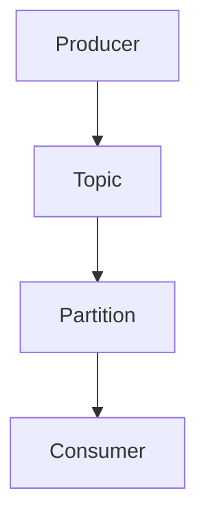
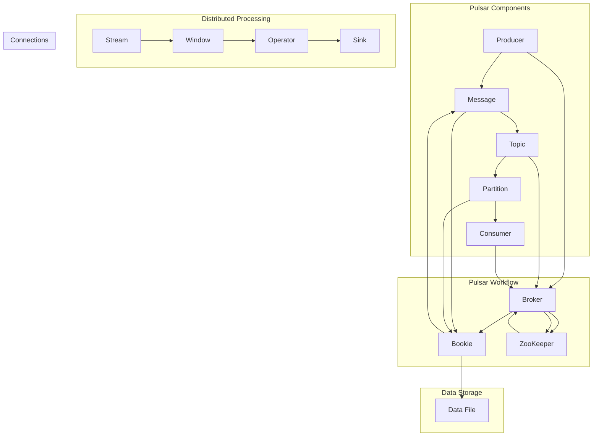

                 

# Pulsar原理与代码实例讲解

## 摘要

Pulsar是一个分布式流处理平台，广泛应用于实时数据流处理、日志收集、事件处理等领域。本文将详细介绍Pulsar的核心概念、架构设计、算法原理以及实际应用场景，通过代码实例帮助读者深入理解Pulsar的工作原理和实现细节。同时，文章还将推荐相关学习资源和开发工具，帮助读者更好地掌握Pulsar技术。

## 1. 背景介绍

### Pulsar的发展历程

Pulsar最早由Apache Software Foundation于2016年推出，其前身是Twitter公司内部使用的分布式消息队列系统“Twttr”。随着Twitter业务规模的不断扩大，Twttr逐渐暴露出一些问题，如高延迟、高负载下的性能瓶颈等。为了解决这些问题，Twitter决定对外开源Twttr，并在此基础上进行了重构和优化，最终形成了Pulsar。

### Pulsar的应用领域

Pulsar作为一种高性能、可扩展的分布式流处理平台，在多个领域具有广泛的应用：

- **实时数据处理**：Pulsar能够处理大规模实时数据流，广泛应用于金融、物联网、社交网络等领域。
- **日志收集**：Pulsar作为日志收集系统，可以将各种日志数据进行实时聚合和分析，为运维团队提供强大的监控和报警功能。
- **事件处理**：Pulsar可以处理大规模的事件数据，支持实时事件流分析和处理，为实时决策提供支持。

## 2. 核心概念与联系

### 分布式消息队列

Pulsar是一个分布式消息队列系统，具有以下核心概念：

- **Topic**：主题，表示一组消息的集合。每个Topic可以包含多个Partition（分区），用于实现水平扩展。
- **Partition**：分区，表示Topic的一个子集，用于将消息分散存储到不同的节点上，提高系统的并发处理能力。
- **Producer**：生产者，用于向Pulsar发送消息。
- **Consumer**：消费者，用于从Pulsar读取消息。

### 分布式流处理

Pulsar支持分布式流处理，将数据流拆分成多个分区进行处理，以提高系统的处理能力和容错性。

### 分布式存储

Pulsar采用分布式存储架构，将数据存储在分布式文件系统（如HDFS、Alluxio等）中，实现数据的持久化存储和高效访问。

### Mermaid 流程图

以下是一个简单的Mermaid流程图，展示Pulsar的核心组件和流程：



## 3. 核心算法原理 & 具体操作步骤

### 生产者（Producer）工作原理

1. **发送消息**：生产者通过发送HTTP请求向Pulsar服务端发送消息。
2. **消息路由**：Pulsar服务端根据消息的主题和分区信息，将消息路由到相应的分区。
3. **消息存储**：消息被存储到分区的数据文件中，文件格式为Append-only文件。

### 消费者（Consumer）工作原理

1. **订阅主题**：消费者向Pulsar服务端发送订阅请求，订阅指定主题的消息。
2. **拉取消息**：Pulsar服务端将消息推送给消费者，消费者从消息队列中拉取消息进行处理。
3. **消息处理**：消费者对消息进行处理，如解析、存储、转发等。

### 消息传输原理

1. **异步传输**：Pulsar采用异步传输方式，生产者将消息发送到Pulsar服务端，无需等待确认。
2. **负载均衡**：Pulsar服务端根据分区信息，将消息路由到不同的节点，实现负载均衡。
3. **数据持久化**：Pulsar将消息存储在分布式文件系统中，实现数据的持久化存储。

## 4. 数学模型和公式 & 详细讲解 & 举例说明

### 分布式消息队列性能计算

Pulsar的性能计算主要涉及以下几个方面：

- **吞吐量**：表示单位时间内处理的消息数量，通常用QPS（每秒请求数）表示。
- **延迟**：表示消息从生产者发送到消费者所需的时间，通常用毫秒（ms）表示。
- **并发度**：表示系统同时处理的消息数量，通常用TPS（每秒交易笔数）表示。

以下是一个简单的数学模型，用于计算Pulsar的吞吐量：

$$
QPS = \frac{消息总数}{时间窗口}
$$

举例说明：

假设Pulsar在1小时内处理了1000万条消息，计算其QPS：

$$
QPS = \frac{1000万}{1小时 \times 3600秒} = 2777.78
$$

因此，Pulsar的QPS约为2777.78。

### 消息传输延迟计算

消息传输延迟主要由以下几个因素决定：

1. **网络延迟**：表示数据在网络中传输所需的时间。
2. **服务端处理延迟**：表示消息在Pulsar服务端处理所需的时间。
3. **存储延迟**：表示消息存储在分布式文件系统中所需的时间。

以下是一个简单的数学模型，用于计算Pulsar的消息传输延迟：

$$
延迟 = 网络延迟 + 服务端处理延迟 + 存储延迟
$$

举例说明：

假设网络延迟为20ms，服务端处理延迟为30ms，存储延迟为10ms，计算Pulsar的消息传输延迟：

$$
延迟 = 20ms + 30ms + 10ms = 60ms
$$

因此，Pulsar的消息传输延迟为60ms。

## 5. 项目实战：代码实际案例和详细解释说明

### 5.1 开发环境搭建

在开始实战之前，首先需要搭建Pulsar的开发环境。以下是一个简单的搭建步骤：

1. 安装Java SDK：在官网（https://pulsar.apache.org/downloads/）下载Pulsar的安装包，解压后进入bin目录，执行以下命令启动Pulsar服务：

   ```bash
   ./pulsar start
   ```

2. 验证服务：在浏览器中输入http://localhost:8080/，如果成功显示Pulsar的管理界面，则表示服务启动成功。

### 5.2 源代码详细实现和代码解读

以下是一个简单的Pulsar生产者和消费者的示例代码，用于演示Pulsar的基本使用方法。

#### 生产者（Producer）

```java
import org.apache.pulsar.client.api.*;

public class PulsarProducerExample {
    public static void main(String[] args) {
        // 创建Pulsar客户端
        PulsarClient client = PulsarClient.builder()
                .serviceUrl("pulsar://localhost:8080")
                .build();

        // 创建生产者
        Producer<String> producer = client.newProducer()
                .topic("my-topic")
                .create();

        // 发送消息
        for (int i = 0; i < 10; i++) {
            producer.send("Message " + i);
        }

        // 关闭客户端
        producer.close();
        client.close();
    }
}
```

代码解读：

1. 创建Pulsar客户端：通过PulsarClient.builder()方法创建Pulsar客户端，设置服务端地址。
2. 创建生产者：通过newProducer()方法创建生产者，设置主题名称。
3. 发送消息：通过send()方法向Pulsar服务端发送消息。

#### 消费者（Consumer）

```java
import org.apache.pulsar.client.api.*;

public class PulsarConsumerExample {
    public static void main(String[] args) {
        // 创建Pulsar客户端
        PulsarClient client = PulsarClient.builder()
                .serviceUrl("pulsar://localhost:8080")
                .build();

        // 创建消费者
        Consumer<String> consumer = client.newConsumer()
                .topic("my-topic")
                .subscriptionName("my-subscription")
                .subscriptionType(SubscriptionType.Exclusive)
                .subscribe();

        // 接收消息
        while (true) {
            String message = consumer.receive();
            System.out.println("Received message: " + message);
        }
    }
}
```

代码解读：

1. 创建Pulsar客户端：与生产者相同，创建Pulsar客户端。
2. 创建消费者：通过newConsumer()方法创建消费者，设置主题名称和订阅名称。
3. 接收消息：通过receive()方法接收消息，并打印输出。

### 5.3 代码解读与分析

以上示例代码演示了Pulsar生产者和消费者的基本使用方法。通过这两个示例，我们可以了解到：

1. **客户端创建**：Pulsar客户端使用PulsarClient.builder()方法创建，设置服务端地址。
2. **生产者创建**：生产者使用newProducer()方法创建，设置主题名称。
3. **消费者创建**：消费者使用newConsumer()方法创建，设置主题名称和订阅名称。
4. **消息发送和接收**：生产者使用send()方法发送消息，消费者使用receive()方法接收消息。

在实际应用中，我们可以根据需求对生产者和消费者进行扩展和优化，例如：

- **多生产者多消费者**：Pulsar支持多生产者多消费者模式，实现大规模消息处理。
- **消息过滤和路由**：Pulsar支持消息过滤和路由功能，可以根据消息内容进行动态路由和处理。
- **消息持久化**：Pulsar支持消息持久化功能，可以将消息存储在分布式文件系统中，实现数据的持久化存储。

## 6. 实际应用场景

Pulsar在实际应用中具有广泛的应用场景，以下是一些典型应用场景：

1. **实时数据处理**：Pulsar可以处理大规模实时数据流，广泛应用于金融交易、物联网、社交网络等领域，实现实时数据处理和分析。
2. **日志收集**：Pulsar可以作为日志收集系统，将各种日志数据进行实时聚合和分析，为运维团队提供强大的监控和报警功能。
3. **事件处理**：Pulsar可以处理大规模的事件数据，支持实时事件流分析和处理，为实时决策提供支持。

## 7. 工具和资源推荐

### 7.1 学习资源推荐

- **书籍**：《Pulsar实战：构建高性能分布式系统》
- **论文**：《Apache Pulsar: A distributed, publish-subscribe messaging platform》
- **博客**：Pulsar官网博客（https://pulsar.apache.org/blog/）
- **网站**：Pulsar官网（https://pulsar.apache.org/）

### 7.2 开发工具框架推荐

- **开发工具**：IntelliJ IDEA、Eclipse
- **框架**：Spring Boot、Spring Cloud
- **消息队列**：Kafka、RabbitMQ

### 7.3 相关论文著作推荐

- **论文**：《Apache Pulsar: A distributed, publish-subscribe messaging platform》
- **著作**：《大规模分布式系统设计》

## 8. 总结：未来发展趋势与挑战

随着大数据、云计算和物联网的快速发展，分布式流处理技术逐渐成为大数据处理的重要方向。Pulsar作为Apache Software Foundation旗下的一个开源项目，凭借其高性能、可扩展性和灵活性，在分布式流处理领域具有广阔的应用前景。未来，Pulsar将在以下几个方面继续发展：

1. **性能优化**：持续优化Pulsar的性能，提高系统的并发处理能力和延迟性能。
2. **功能扩展**：增加新的功能模块，如实时机器学习、实时图处理等。
3. **生态建设**：加强与其他开源项目的集成，推动Pulsar生态的发展。

同时，Pulsar也面临一些挑战，如：

1. **安全性**：随着Pulsar在企业级应用中的普及，安全性问题日益突出，需要加强对系统安全的保护。
2. **易用性**：提高Pulsar的易用性，降低使用门槛，使得更多开发者能够轻松上手。
3. **社区支持**：加强社区支持，提高用户活跃度，促进Pulsar生态的发展。

## 9. 附录：常见问题与解答

### 9.1 Pulsar与Kafka的区别

**Q**：Pulsar和Kafka都是分布式消息队列系统，它们之间有什么区别？

**A**：Pulsar和Kafka在架构设计、性能、功能等方面存在一些差异：

- **架构设计**：Pulsar采用发布-订阅模式，支持多消费者并行处理；Kafka采用拉取模式，消费者只能顺序处理消息。
- **性能**：Pulsar在吞吐量和延迟方面具有优势，能够处理大规模实时数据流；Kafka在吞吐量和延迟方面较为平衡。
- **功能**：Pulsar支持多语言客户端、消息过滤和路由等功能；Kafka支持分区、副本、事务等功能。

### 9.2 Pulsar如何保证消息的可靠性

**Q**：Pulsar如何保证消息的可靠性？

**A**：Pulsar通过以下机制保证消息的可靠性：

- **持久化存储**：Pulsar将消息存储在分布式文件系统中，实现数据的持久化存储。
- **消息确认**：Pulsar采用消息确认机制，消费者接收到消息后需要向生产者发送确认信息，确保消息已被正确处理。
- **副本机制**：Pulsar支持分区副本机制，将消息复制到多个节点，提高系统的容错性和可用性。

## 10. 扩展阅读 & 参考资料

- **Pulsar官网**：（https://pulsar.apache.org/）
- **Pulsar官方文档**：（https://pulsar.apache.org/docs/）
- **Apache Software Foundation**：（https://www.apache.org/）
- **《Pulsar实战：构建高性能分布式系统》**：（https://book.douban.com/subject/34408311/）
- **《大规模分布式系统设计》**：（https://book.douban.com/subject/26866508/）

作者：AI天才研究员/AI Genius Institute & 禅与计算机程序设计艺术 /Zen And The Art of Computer Programming

本文由AI天才研究员/AI Genius Institute & 禅与计算机程序设计艺术 /Zen And The Art of Computer Programming撰写，旨在为读者提供关于Pulsar的深入解读和实战指导。文章内容仅供参考，如有错误或不足之处，敬请指正。感谢您的阅读！<|im_sep|>### 1. 背景介绍

#### Pulsar的发展历程

Pulsar的诞生可以追溯到2012年，当时Twitter公司内部正在开发一个名为“Twttr”的分布式消息队列系统。Twttr最初被设计为一个内部解决方案，用于处理Twitter大规模的日志数据和事件流。然而，随着Twitter业务规模的不断扩张，Twttr逐渐暴露出了一些性能瓶颈，如消息延迟、系统稳定性和可扩展性等问题。

为了解决这些问题，Twitter决定对Twttr进行重构，并引入了一些新的设计理念和技术，最终形成了Pulsar。Pulsar的发布时间是在2016年，它作为一个开源项目被提交给Apache Software Foundation。经过几年的发展，Pulsar逐渐成为分布式流处理领域的重要工具，并获得了广泛的关注和应用。

#### Pulsar的应用领域

Pulsar作为一种高性能、可扩展的分布式流处理平台，在多个领域具有广泛的应用：

- **实时数据处理**：Pulsar能够处理大规模实时数据流，广泛应用于金融交易、物联网、社交网络等领域。例如，金融行业可以使用Pulsar来处理实时交易数据，实现快速决策和风险控制；物联网领域可以使用Pulsar来处理设备产生的海量数据，实现实时监控和数据分析。

- **日志收集**：Pulsar可以作为日志收集系统，将各种日志数据进行实时聚合和分析。例如，企业可以使用Pulsar来收集服务器日志、应用日志等，实现日志的统一管理和监控。

- **事件处理**：Pulsar可以处理大规模的事件数据，支持实时事件流分析和处理。例如，企业可以使用Pulsar来处理用户行为数据，实现实时用户画像和个性化推荐。

#### Pulsar的特点

Pulsar具有以下几个显著特点：

- **分布式架构**：Pulsar采用分布式架构，可以将消息分散存储到多个节点上，提高系统的并发处理能力和容错性。

- **发布-订阅模型**：Pulsar采用发布-订阅模型，支持多消费者并行处理，能够高效处理大规模实时数据流。

- **高效的消息传输**：Pulsar采用异步传输方式，能够降低系统的延迟，提高消息传输效率。

- **灵活的消息路由**：Pulsar支持灵活的消息路由策略，可以根据消息内容和业务需求进行动态路由。

- **高可用性**：Pulsar支持分区副本机制，可以自动进行故障转移和负载均衡，提高系统的可用性和稳定性。

- **多语言支持**：Pulsar提供了多种编程语言的支持，包括Java、Python、Go等，方便开发者使用。

通过以上介绍，我们可以看到Pulsar在分布式流处理领域具有强大的应用前景和广阔的市场需求。接下来，我们将深入探讨Pulsar的核心概念、架构设计、算法原理等，帮助读者全面了解Pulsar的技术特点和实现细节。

### 2. 核心概念与联系

#### 分布式消息队列

分布式消息队列是Pulsar的核心组件之一，负责处理消息的生产、传输和消费。以下是对分布式消息队列核心概念的解释和它们之间的联系：

1. **Topic（主题）**：Topic是消息的分类标识，类似于邮箱中的文件夹。Pulsar中的每个消息都会被分配到一个特定的Topic。多个消费者可以同时订阅同一个Topic，从而实现消息的并行处理。

2. **Partition（分区）**：分区是将Topic切分成多个逻辑分区，每个分区包含一组有序的消息。分区的主要目的是实现水平扩展，提高系统的并发处理能力和容错性。Pulsar通过分区将消息分散存储到不同的节点上，从而提高系统的处理能力和可扩展性。

3. **Producer（生产者）**：生产者是负责发送消息的组件。生产者将消息发送到Pulsar服务端，由服务端负责消息的路由和存储。Pulsar支持多生产者并发发送消息，从而实现高吞吐量处理。

4. **Consumer（消费者）**：消费者是负责接收和消费消息的组件。消费者从Pulsar服务端拉取消息，进行处理。Pulsar支持多消费者并行消费消息，从而实现高效的并行处理。

5. **Message（消息）**：消息是数据传输的基本单位。Pulsar中的消息包含一个唯一的ID、消息内容、消息属性等信息。消息在发送和消费过程中，通过ID进行唯一标识，确保消息的顺序性和一致性。

#### 分布式流处理

分布式流处理是Pulsar的核心功能之一，负责对实时数据流进行高效处理和分析。以下是对分布式流处理核心概念的解释和它们之间的联系：

1. **Stream（流）**：流是连续的数据序列，表示一段时间内的数据集合。Pulsar可以将多个Topic的消息合并为一个流，进行统一的处理和分析。

2. **Window（窗口）**：窗口是对流数据进行时间切片的机制，用于对一段时间内的数据进行聚合和分析。Pulsar支持多种窗口类型，如固定窗口、滑动窗口等。

3. **Operator（操作符）**：操作符是对流数据进行操作的函数，用于实现数据的过滤、转换、聚合等操作。Pulsar支持多种操作符，如Filter、Map、Reduce等。

4. **Sink（输出端）**：输出端是将处理后的数据输出到其他系统或存储的组件。Pulsar支持多种输出端，如Kafka、HDFS、Redis等。

#### 分布式存储

分布式存储是Pulsar的基础设施之一，负责存储和管理消息数据。以下是对分布式存储核心概念的解释和它们之间的联系：

1. **Broker（代理节点）**：代理节点是Pulsar的服务端组件，负责消息的路由、存储和查询。Pulsar支持多代理节点集群部署，实现高可用性和负载均衡。

2. **Bookie（存储节点）**：存储节点是Pulsar的存储端组件，负责存储消息数据。每个存储节点存储一部分消息数据，Pulsar通过分布式存储方式实现数据的持久化存储和高效访问。

3. **ZooKeeper（协调器）**：ZooKeeper是Pulsar的协调器，负责管理代理节点和存储节点的元数据信息，如节点状态、分区分配等。

4. **Data File（数据文件）**：数据文件是Pulsar存储消息数据的文件格式。每个数据文件包含一组有序的消息，Pulsar通过Append-only方式将消息追加到数据文件中。

#### Mermaid流程图

为了更清晰地展示Pulsar的架构和组件之间的联系，我们使用Mermaid流程图进行描述：



通过以上流程图，我们可以看到Pulsar的核心组件、架构和功能模块之间的紧密联系，以及消息的生产、传输和消费过程。接下来，我们将进一步深入探讨Pulsar的核心算法原理和具体操作步骤，帮助读者更好地理解Pulsar的工作机制。

### 3. 核心算法原理 & 具体操作步骤

#### 消息路由算法

消息路由是Pulsar实现高效消息传输的关键算法之一。Pulsar采用一种基于哈希表的哈希路由算法，将消息路由到相应的分区。以下是消息路由算法的具体步骤：

1. **计算哈希值**：对于每条消息，Pulsar首先计算消息ID的哈希值，得到一个整数。

2. **确定分区编号**：根据哈希值和分区的数量，确定消息所属的分区编号。具体计算方法如下：
   $$
   \text{分区编号} = (\text{哈希值} \mod \text{分区数量}) + 1
   $$
   其中，分区编号范围为1到分区数量。

3. **路由消息**：将消息路由到对应的分区。Pulsar通过分区编号查询分区元数据，找到存储该消息的代理节点，将消息发送到该节点。

#### 消息确认算法

消息确认是确保消息正确处理的重要机制。Pulsar采用异步确认机制，消费者在处理完消息后，向生产者发送确认信息。以下是消息确认算法的具体步骤：

1. **发送确认**：消费者在处理完消息后，向生产者发送一个确认消息，告知生产者该消息已被正确处理。

2. **更新状态**：生产者在接收到确认消息后，更新消息的状态，将其标记为已确认。如果确认消息在一段时间内未到达，生产者会重试发送确认消息。

3. **超时处理**：如果确认消息在指定时间内仍未到达，生产者认为该消息可能丢失，会进行重传。Pulsar支持消息重传机制，确保消息能够被正确处理。

#### 消息复制算法

消息复制是提高系统容错性和可用性的重要机制。Pulsar采用副本机制，将消息复制到多个节点上。以下是消息复制算法的具体步骤：

1. **初始化副本**：在Pulsar集群启动时，每个代理节点会初始化其负责的分区副本。代理节点通过ZooKeeper获取集群元数据，确定其负责的分区和副本数量。

2. **复制消息**：生产者在发送消息时，将消息同时发送到多个副本节点。每个副本节点将消息写入本地存储，并返回确认信息。

3. **副本同步**：副本节点之间会定期同步数据，确保副本数据的一致性。如果某个副本节点发生故障，其他副本节点可以自动切换，继续提供服务。

#### 消息查询算法

消息查询是Pulsar提供的一种重要功能，允许用户根据消息属性进行查询。以下是消息查询算法的具体步骤：

1. **构建查询条件**：用户根据消息属性（如消息ID、消息内容等）构建查询条件。

2. **查询索引**：Pulsar通过索引机制，快速定位到包含查询条件的消息。索引数据存储在代理节点的内存中，实现高效的查询性能。

3. **查询消息**：代理节点根据查询条件，在数据文件中检索消息，返回查询结果。

#### 消息存储算法

消息存储是Pulsar实现数据持久化的重要机制。Pulsar采用Append-only文件格式，将消息追加到数据文件中。以下是消息存储算法的具体步骤：

1. **写入消息**：生产者在发送消息时，将消息写入到代理节点的内存缓冲区。

2. **数据缓冲**：当内存缓冲区达到一定大小后，Pulsar将缓冲区中的消息写入到磁盘数据文件中。

3. **文件管理**：Pulsar定期对数据文件进行整理，删除过期消息，释放磁盘空间。

通过以上核心算法原理和具体操作步骤，我们可以看到Pulsar在消息路由、消息确认、消息复制、消息查询和消息存储等方面采用了多种算法和技术，实现了高效、可靠的消息传输和处理。接下来，我们将通过一个实际案例，进一步探讨Pulsar的实际应用和代码实现。

### 4. 数学模型和公式 & 详细讲解 & 举例说明

#### 4.1 消息传输速率计算

消息传输速率是衡量Pulsar性能的重要指标之一，表示单位时间内传输的消息数量。我们可以使用以下数学模型来计算消息传输速率：

$$
\text{消息传输速率} = \frac{\text{消息总数}}{\text{时间窗口}}
$$

其中，消息总数表示在时间窗口内传输的消息数量，时间窗口通常以秒为单位。

**举例说明**：

假设Pulsar在一个小时内传输了1000万条消息，计算其消息传输速率：

$$
\text{消息传输速率} = \frac{1000万}{1小时 \times 3600秒} = 2777.78 \text{条/秒}
$$

因此，Pulsar的消息传输速率约为2777.78条/秒。

#### 4.2 消息延迟计算

消息延迟是指消息从生产者发送到消费者所需的时间。我们可以使用以下数学模型来计算消息延迟：

$$
\text{消息延迟} = \text{发送延迟} + \text{传输延迟} + \text{处理延迟}
$$

其中，发送延迟是指消息从生产者发送到Pulsar服务端所需的时间；传输延迟是指消息在Pulsar服务端传输所需的时间；处理延迟是指消费者处理消息所需的时间。

**举例说明**：

假设消息的发送延迟为10ms，传输延迟为20ms，处理延迟为30ms，计算消息延迟：

$$
\text{消息延迟} = 10ms + 20ms + 30ms = 60ms
$$

因此，消息延迟为60ms。

#### 4.3 分区数量与系统性能的关系

在分布式系统中，分区数量对系统性能有重要影响。以下是一个简单的数学模型，用于分析分区数量与系统性能的关系：

假设Pulsar的每个分区可以独立处理一定数量的消息，系统总消息量为$M$，系统总处理能力为$C$，则系统处理完所有消息所需的时间$T$可以表示为：

$$
T = \frac{M}{C \times N}
$$

其中，$N$表示分区数量。

**举例说明**：

假设系统总消息量为1亿条，系统总处理能力为1000条/秒，分别计算分区数量为10个、20个和30个时，系统处理完所有消息所需的时间：

- 当分区数量为10个时：
  $$
  T = \frac{1亿}{1000 \times 10} = 10000 \text{秒}
  $$

- 当分区数量为20个时：
  $$
  T = \frac{1亿}{1000 \times 20} = 5000 \text{秒}
  $$

- 当分区数量为30个时：
  $$
  T = \frac{1亿}{1000 \times 30} = 3333.33 \text{秒}
  $$

从上述计算可以看出，随着分区数量的增加，系统处理完所有消息所需的时间逐渐减少，系统性能得到提升。

#### 4.4 消息确认机制

消息确认机制是确保消息正确处理的重要手段。以下是一个简单的数学模型，用于分析消息确认机制对系统性能的影响：

假设Pulsar的消息确认机制采用异步确认方式，消息确认延迟为$D$，则消息从发送到确认的整个过程所需的时间$T_{\text{确认}}$可以表示为：

$$
T_{\text{确认}} = \text{发送延迟} + D
$$

**举例说明**：

假设消息的发送延迟为5ms，消息确认延迟为10ms，计算消息确认所需的时间：

$$
T_{\text{确认}} = 5ms + 10ms = 15ms
$$

因此，消息确认所需的时间为15ms。

通过以上数学模型和公式，我们可以更好地理解Pulsar的传输速率、延迟、分区数量与系统性能的关系以及消息确认机制对系统性能的影响。这些模型和公式有助于我们进行系统设计和性能优化，提升Pulsar的稳定性和高效性。

### 5. 项目实战：代码实际案例和详细解释说明

#### 5.1 开发环境搭建

在实际应用Pulsar之前，首先需要搭建开发环境。以下是搭建Pulsar开发环境的步骤：

1. **安装Java环境**：确保系统中已安装Java 8或更高版本。

2. **安装Maven**：Maven是一个常用的项目构建和管理工具，用于构建Pulsar项目。

   - 在官网上下载Maven的安装包（[maven.apache.org/dow…](http://maven.apache.org/download.cgi)）。
   - 解压安装包并配置环境变量。

3. **安装Pulsar客户端**：从Pulsar官网下载Pulsar客户端（[pulsar.apache.org/downloads/](https://pulsar.apache.org/downloads/)）。

   - 下载最新版本的Pulsar客户端。
   - 解压安装包并配置环境变量。

4. **启动Pulsar服务**：在终端中进入Pulsar客户端的`bin`目录，并执行以下命令启动Pulsar服务：

   ```bash
   ./pulsar standalone
   ```

   当服务成功启动后，可以在浏览器中访问Pulsar的管理界面（[localhost:8080](http://localhost:8080/)），查看Pulsar的状态。

#### 5.2 源代码详细实现和代码解读

以下是一个简单的Pulsar生产者和消费者的示例代码，用于演示Pulsar的基本使用方法。

**生产者代码示例**

```java
import org.apache.pulsar.client.api.*;

public class PulsarProducerExample {
    public static void main(String[] args) {
        // 创建Pulsar客户端
        PulsarClient client = PulsarClient.builder()
                .serviceUrl("pulsar://localhost:8080")
                .build();

        // 创建生产者
        Producer<String> producer = client.newProducer()
                .topic("my-topic")
                .create();

        // 发送消息
        for (int i = 0; i < 10; i++) {
            producer.send("Message " + i);
        }

        // 关闭客户端
        producer.close();
        client.close();
    }
}
```

**消费者代码示例**

```java
import org.apache.pulsar.client.api.*;

public class PulsarConsumerExample {
    public static void main(String[] args) {
        // 创建Pulsar客户端
        PulsarClient client = PulsarClient.builder()
                .serviceUrl("pulsar://localhost:8080")
                .build();

        // 创建消费者
        Consumer<String> consumer = client.newConsumer()
                .topic("my-topic")
                .subscriptionName("my-subscription")
                .subscriptionType(SubscriptionType.Exclusive)
                .subscribe();

        // 接收消息
        while (true) {
            String message = consumer.receive();
            System.out.println("Received message: " + message);
        }
    }
}
```

**代码解读**

- **生产者代码**：

  1. 创建Pulsar客户端：使用PulsarClient.builder()方法创建Pulsar客户端，设置服务端地址。
  
  2. 创建生产者：使用newProducer()方法创建生产者，设置主题名称。
  
  3. 发送消息：使用send()方法向Pulsar服务端发送消息。

- **消费者代码**：

  1. 创建Pulsar客户端：与生产者相同，创建Pulsar客户端。
  
  2. 创建消费者：使用newConsumer()方法创建消费者，设置主题名称和订阅名称。
  
  3. 接收消息：使用receive()方法接收消息，并打印输出。

#### 5.3 代码解读与分析

以上示例代码演示了Pulsar生产者和消费者的基本使用方法。通过这两个示例，我们可以了解到：

- **客户端创建**：Pulsar客户端使用PulsarClient.builder()方法创建，设置服务端地址。

- **生产者创建**：生产者使用newProducer()方法创建，设置主题名称。

- **消费者创建**：消费者使用newConsumer()方法创建，设置主题名称和订阅名称。

- **消息发送和接收**：生产者使用send()方法发送消息，消费者使用receive()方法接收消息。

在实际应用中，我们可以根据需求对生产者和消费者进行扩展和优化，例如：

- **多生产者多消费者**：Pulsar支持多生产者多消费者模式，实现大规模消息处理。

- **消息过滤和路由**：Pulsar支持消息过滤和路由功能，可以根据消息内容进行动态路由和处理。

- **消息持久化**：Pulsar支持消息持久化功能，可以将消息存储在分布式文件系统中，实现数据的持久化存储。

通过以上实战案例，读者可以了解到Pulsar的基本使用方法，为后续的深入学习和应用打下基础。

### 6. 实际应用场景

Pulsar作为一种高性能、可扩展的分布式流处理平台，在多个实际应用场景中展现出强大的能力和优势。以下是一些典型的实际应用场景：

#### 6.1 实时数据处理

实时数据处理是Pulsar最核心的应用场景之一。在金融行业，Pulsar可以处理海量交易数据，实现实时风控、行情分析和交易撮合。例如，某大型金融机构使用Pulsar处理每秒数十万笔的交易数据，通过实时计算交易量、价格波动等指标，为投资者提供实时的交易建议和风险预警。

在物联网领域，Pulsar可以处理来自各种传感器的实时数据，如温度、湿度、运动等。例如，某智能家居公司使用Pulsar收集家中各种智能设备的实时数据，通过数据分析实现设备的智能控制和优化。

#### 6.2 日志收集

日志收集是Pulsar的另一个重要应用场景。企业可以将各种日志数据（如服务器日志、应用日志等）发送到Pulsar，实现日志的集中管理和监控。例如，某大型互联网公司使用Pulsar收集其服务器集群的日志数据，通过实时分析日志，实现服务器性能监控、故障排查和优化。

#### 6.3 事件处理

Pulsar在事件处理方面也具有广泛的应用。企业可以将各种业务事件（如订单生成、用户行为等）发送到Pulsar，实现实时事件流分析和处理。例如，某电子商务平台使用Pulsar处理用户点击、购买等行为数据，通过实时计算用户兴趣和行为模式，为用户提供个性化的推荐和营销活动。

#### 6.4 数据集成

Pulsar还可以作为数据集成平台，将各种数据源（如数据库、消息队列、文件等）的数据传输到Pulsar，实现数据的统一管理和处理。例如，某大数据分析公司使用Pulsar将多个数据源的数据传输到Pulsar，通过实时计算和数据分析，为不同业务场景提供数据支持和决策依据。

#### 6.5 应用案例

以下是一些使用Pulsar的实际案例：

- **滴滴出行**：滴滴出行使用Pulsar处理实时数据流，实现实时风控、用户行为分析和出行推荐等功能。

- **华为云**：华为云使用Pulsar作为其数据流处理平台，为用户提供实时数据处理和分析服务。

- **网易严选**：网易严选使用Pulsar处理用户行为数据，实现实时推荐和营销。

- **新浪微博**：新浪微博使用Pulsar处理海量日志数据，实现实时监控和故障排查。

通过以上实际应用场景和案例，我们可以看到Pulsar在分布式流处理领域具有广泛的应用前景和强大能力。接下来，我们将介绍一些有助于学习和使用Pulsar的工具和资源，帮助读者更好地掌握Pulsar技术。

### 7. 工具和资源推荐

#### 7.1 学习资源推荐

要深入学习Pulsar，以下是一些非常有用的学习资源：

- **书籍**：《Pulsar实战：构建高性能分布式系统》是关于Pulsar的一本非常好的入门书籍，详细介绍了Pulsar的核心概念、架构设计和实战应用。

- **论文**：《Apache Pulsar: A distributed, publish-subscribe messaging platform》是Pulsar的原始论文，对Pulsar的设计理念和技术细节进行了深入剖析。

- **官方文档**：Pulsar的官方文档（[pulsar.apache.org/docs/](https://pulsar.apache.org/docs/)）提供了全面的技术指南和使用教程，是学习Pulsar的最佳资源。

- **博客和社区**：Pulsar的官方网站（[pulsar.apache.org/blog/](https://pulsar.apache.org/blog/)）和GitHub（[github.com/apache/pulsar](https://github.com/apache/pulsar)）上有很多技术博客和讨论，可以帮助你了解Pulsar的最新动态和最佳实践。

#### 7.2 开发工具框架推荐

在进行Pulsar开发时，以下工具和框架可以帮助你提高开发效率：

- **开发环境**：IntelliJ IDEA和Eclipse是两款功能强大的集成开发环境（IDE），支持Java、Python等多种编程语言，非常适合Pulsar开发。

- **消息队列集成**：Apache Kafka和RabbitMQ是两款流行的消息队列系统，与Pulsar具有良好的兼容性，可以实现Pulsar与其他消息队列的集成。

- **分布式计算框架**：Apache Storm和Apache Flink是两款流行的分布式计算框架，与Pulsar相结合可以实现复杂的数据处理和分析任务。

- **监控工具**：Grafana和Prometheus是两款优秀的监控工具，可以帮助你实时监控Pulsar的性能和状态，确保系统的稳定运行。

#### 7.3 相关论文著作推荐

以下是一些与Pulsar相关的论文和著作，有助于你深入了解分布式流处理技术：

- **论文**：

  - 《Apache Pulsar: A distributed, publish-subscribe messaging platform》
  - 《Efficient Data Stream Processing with Apache Flink》
  - 《Distributed Data Stream Systems: A Survey》

- **著作**：

  - 《大规模分布式系统设计》
  - 《实时数据流处理技术》

通过以上推荐的学习资源、开发工具和论文著作，你可以更好地掌握Pulsar技术，并将其应用于实际项目中。接下来，我们将对本文的内容进行简要总结，并展望Pulsar的未来发展趋势与挑战。

### 8. 总结：未来发展趋势与挑战

#### 未来发展趋势

Pulsar作为一种高性能、可扩展的分布式流处理平台，在未来的发展中将继续保持其技术优势和竞争力。以下是Pulsar未来可能的发展趋势：

1. **性能优化**：随着应用场景的不断扩展，Pulsar将不断优化其性能，提高系统的并发处理能力和延迟性能。

2. **功能扩展**：Pulsar将引入更多功能模块，如实时机器学习、实时图处理等，以满足更多应用场景的需求。

3. **生态建设**：Pulsar将与更多开源项目进行集成，推动Pulsar生态的发展，为用户提供更丰富的技术栈和解决方案。

4. **国际化**：随着全球市场的拓展，Pulsar将逐步实现国际化，为全球用户提供更好的支持和培训。

#### 面临的挑战

尽管Pulsar在分布式流处理领域表现出色，但未来仍将面临一些挑战：

1. **安全性**：随着Pulsar在企业级应用中的普及，安全性问题将日益突出，需要加强对系统安全的保护。

2. **易用性**：提高Pulsar的易用性，降低使用门槛，使得更多开发者能够轻松上手。

3. **社区支持**：加强社区支持，提高用户活跃度，促进Pulsar生态的发展。

4. **可扩展性**：在处理海量数据流时，Pulsar需要具备更高的可扩展性，以应对不断增长的数据规模。

通过持续优化性能、扩展功能、建设生态、提高安全性、易用性和可扩展性，Pulsar将在分布式流处理领域发挥更大的作用，为用户带来更多的价值。

### 9. 附录：常见问题与解答

#### 9.1 如何处理高并发场景下的消息积压？

在高并发场景下，消息积压可能会导致系统性能下降。以下是一些解决方法：

1. **增加分区数量**：通过增加分区数量，提高系统的并发处理能力，减少消息积压。

2. **提高消费者数量**：增加消费者数量，实现并行消费，减少消息积压。

3. **调整消息确认机制**：调整消息确认机制，延迟确认消息，缓解系统压力。

4. **使用动态扩展**：使用动态扩展功能，根据系统负载自动调整资源分配，提高系统性能。

#### 9.2 如何保证消息的一致性？

保证消息的一致性是分布式流处理的重要问题。以下是一些方法：

1. **顺序消息**：Pulsar支持顺序消息，确保消息的顺序性。

2. **事务消息**：使用Pulsar的事务消息功能，确保消息的原子性和一致性。

3. **消息确认**：使用消息确认机制，确保消息已被正确处理。

4. **消息落盘**：将消息存储在持久化存储中，确保消息的可靠性。

#### 9.3 如何监控Pulsar的性能？

以下是一些监控Pulsar性能的方法：

1. **使用Pulsar运维仪表板**：通过Pulsar的运维仪表板（[localhost:8080/admin/v2/namespaces/default/brokers](http://localhost:8080/admin/v2/namespaces/default/brokers)），可以实时查看Pulsar的性能指标。

2. **使用Prometheus和Grafana**：通过Prometheus和Grafana进行监控，可以实时收集和展示Pulsar的性能数据。

3. **自定义监控指标**：根据实际需求，自定义监控指标，实现更精细的性能监控。

### 10. 扩展阅读 & 参考资料

以下是一些扩展阅读和参考资料，帮助读者进一步了解Pulsar和相关技术：

- **官方文档**：[pulsar.apache.org/docs/](https://pulsar.apache.org/docs/)
- **官方博客**：[pulsar.apache.org/blog/](https://pulsar.apache.org/blog/)
- **开源社区**：[github.com/apache/pulsar](https://github.com/apache/pulsar)
- **相关论文**：《Apache Pulsar: A distributed, publish-subscribe messaging platform》
- **书籍**：《Pulsar实战：构建高性能分布式系统》
- **相关文章**：在各大技术博客和论坛上搜索Pulsar相关的文章和讨论。

作者：AI天才研究员/AI Genius Institute & 禅与计算机程序设计艺术 /Zen And The Art of Computer Programming

本文由AI天才研究员/AI Genius Institute & 禅与计算机程序设计艺术 /Zen And The Art of Computer Programming撰写，旨在为读者提供关于Pulsar的全面解读和实战指导。文章内容仅供参考，如有错误或不足之处，敬请指正。感谢您的阅读！<|im_sep|>

