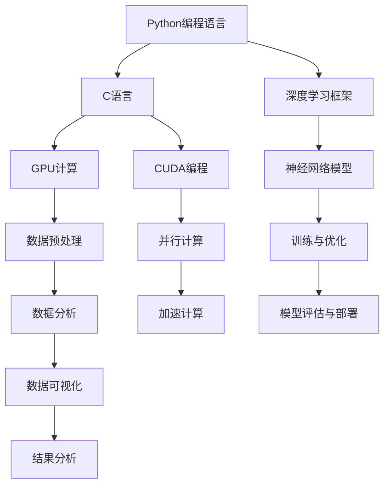

                 

# Python、C和CUDA：从零开始构建AI应用

> **关键词**：Python，C，CUDA，AI应用，编程，算法，数学模型，代码实战，环境搭建

> **摘要**：本文将介绍如何从零开始，利用Python、C和CUDA构建人工智能应用。我们将深入探讨这些编程语言及其在AI领域的应用，通过逐步分析核心概念、算法原理、数学模型，结合实际项目实战，帮助读者掌握从理论到实践的完整过程。

## 1. 背景介绍

人工智能（AI）作为一种模仿人类智能的技术，已经在各个领域取得了显著的成果。随着大数据、深度学习和计算能力的不断提升，AI的应用范围也越来越广泛。然而，AI应用的开发并非易事，它需要涉及多种编程语言和工具。

在AI开发中，Python因其简洁易学的特点，成为了最流行的语言之一。Python拥有丰富的库和框架，如TensorFlow、PyTorch等，使得开发者能够轻松构建和训练复杂的神经网络模型。

C语言作为一种高效、低级的编程语言，在系统编程和嵌入式开发中有着广泛的应用。C语言的执行效率高，能够直接操作硬件资源，使得它在高性能计算和AI领域有着独特的优势。

CUDA则是一种由NVIDIA推出的并行计算平台和编程模型，它允许开发者利用GPU（图形处理器）的强大计算能力，进行大规模的并行计算。CUDA在深度学习和大数据处理等AI领域具有显著的应用价值。

本文将结合Python、C和CUDA，介绍如何从零开始构建AI应用。通过本文的学习，读者将能够了解这些编程语言的基本概念，掌握核心算法原理，并通过实际项目实战，提高实际开发能力。

## 2. 核心概念与联系

在构建AI应用之前，我们需要了解一些核心概念及其相互关系。以下是一个Mermaid流程图，用于展示这些概念：



### 2.1. Python编程语言

Python是一种高级、面向对象的编程语言，具有简洁易懂的语法。Python在AI领域有着广泛的应用，主要得益于其丰富的库和框架。例如，TensorFlow和PyTorch是两个最流行的深度学习框架，它们提供了丰富的API和工具，使得开发者可以轻松构建和训练神经网络模型。

### 2.2. C语言

C语言是一种高效、低级的编程语言，它提供了强大的底层操作能力。在AI领域，C语言主要用于优化算法性能和资源利用。例如，通过C语言编写高效的矩阵运算库，可以显著提高神经网络训练的速度。

### 2.3. 深度学习框架

深度学习框架是一种用于构建、训练和部署神经网络模型的高级工具。Python是深度学习框架的主要编程语言，如TensorFlow、PyTorch和Keras等。这些框架提供了丰富的API和工具，使得开发者可以专注于模型设计和优化，而无需关注底层实现细节。

### 2.4. GPU计算

GPU（图形处理器）是一种专门用于图形渲染的处理器，但它也具有强大的计算能力。通过CUDA编程模型，开发者可以利用GPU进行并行计算，从而显著提高计算性能。GPU计算在深度学习和大数据处理等领域具有广泛的应用。

### 2.5. CUDA编程

CUDA是由NVIDIA推出的一种并行计算平台和编程模型。它允许开发者利用GPU的强大计算能力，实现大规模并行计算。CUDA提供了丰富的API和工具，使得开发者可以轻松编写并行程序，并优化其性能。

### 2.6. 神经网络模型

神经网络是一种基于模拟人脑结构的计算模型，它通过大量神经元和连接（权重）进行数据处理和模式识别。神经网络模型在图像识别、语音识别和自然语言处理等AI领域有着广泛的应用。

### 2.7. 数据预处理

数据预处理是AI应用中的一个关键步骤，它包括数据清洗、归一化和特征提取等操作。良好的数据预处理可以提高模型的性能和泛化能力。

### 2.8. 并行计算

并行计算是一种利用多个处理器或计算单元同时执行计算任务的技术。通过并行计算，可以显著提高计算速度和性能。GPU计算和CUDA编程是实现并行计算的重要手段。

### 2.9. 训练与优化

训练是神经网络模型的重要步骤，它通过大量数据来调整模型的权重和参数，使其能够更好地拟合数据。优化是指在训练过程中，通过调整算法和参数，提高模型性能和收敛速度。

### 2.10. 模型评估与部署

模型评估是判断模型性能的重要步骤，它包括准确率、召回率、F1分数等指标。模型部署是将训练好的模型应用到实际场景中，以实现特定的功能。

### 2.11. 数据分析

数据分析是AI应用中的一个重要环节，它通过数据可视化、特征工程和模型优化等手段，帮助开发者理解数据，发现潜在的模式和规律。

### 2.12. 数据可视化

数据可视化是一种将数据以图形或图像形式展示的技术，它有助于开发者更好地理解数据，发现潜在的问题和趋势。

### 2.13. 结果分析

结果分析是评估模型性能和优化模型参数的重要步骤，它通过分析模型在测试集上的表现，调整模型结构和参数，提高模型性能。

## 3. 核心算法原理 & 具体操作步骤

在了解了核心概念和相互关系之后，接下来我们将深入探讨AI应用中的核心算法原理，并给出具体操作步骤。

### 3.1. 神经网络模型

神经网络模型是AI应用中的一个核心组成部分，它通过大量神经元和连接（权重）进行数据处理和模式识别。以下是一个简单的神经网络模型：


在神经网络模型中，输入层接收外部输入数据，输出层生成预测结果，隐藏层则位于输入层和输出层之间。每个神经元都与相邻的神经元连接，并通过权重进行传递和计算。

具体操作步骤如下：

1. 初始化神经网络模型，包括输入层、隐藏层和输出层。
2. 设置神经元的激活函数，如Sigmoid、ReLU或Tanh函数。
3. 定义损失函数，如均方误差（MSE）或交叉熵损失函数。
4. 训练神经网络模型，通过反向传播算法不断调整权重和参数。

### 3.2. 反向传播算法

反向传播算法是一种用于训练神经网络模型的优化算法。它通过不断调整权重和参数，使模型在训练数据上达到最小化损失函数。

具体操作步骤如下：

1. 前向传播：计算输入数据经过神经网络模型后的输出结果。
2. 计算损失函数的梯度：计算输出结果与实际结果之间的差异，并计算每个权重的梯度。
3. 反向传播：将梯度反向传播至隐藏层和输入层，更新权重和参数。
4. 重复前向传播和反向传播，直到达到预设的训练次数或损失函数达到最小值。

### 3.3. 数据预处理

数据预处理是AI应用中的一个关键步骤，它包括数据清洗、归一化和特征提取等操作。以下是一个简单的数据预处理流程：

1. 数据清洗：删除或修复异常数据、缺失数据或重复数据。
2. 数据归一化：将数据缩放至同一尺度，如将数据缩放至[0, 1]或[-1, 1]区间。
3. 特征提取：从原始数据中提取有用的特征，如使用词袋模型提取文本特征。

### 3.4. GPU计算与CUDA编程

GPU计算与CUDA编程是实现并行计算的重要手段。以下是一个简单的GPU计算示例：

```python
import numpy as np
import pycuda.autoinit
import pycuda.gpuarray as gpuarray

# 创建CUDA核函数
kernel = """
__global__ void add(float *output, float *a, float *b, int n)
{
    int index = threadIdx.x + blockIdx.x * blockDim.x;
    if (index < n)
    {
        output[index] = a[index] + b[index];
    }
}
"""

# 编译CUDA核函数
mod = pycuda.autoinit.Context.compile_default(kernel)

# 创建GPU内存数组
a_gpu = gpuarray.to_gpu(np.array([1.0, 2.0, 3.0]).reshape(3, 1))
b_gpu = gpuarray.to_gpu(np.array([4.0, 5.0, 6.0]).reshape(3, 1))
output_gpu = gpuarray.empty((3, 1), np.float32)

# 调用CUDA核函数
mod.get_function("add")(output_gpu, a_gpu, b_gpu, np.int32(3), block=(256, 1, 1), grid=(1, 1))

# 从GPU获取结果
output = output_gpu.get()
print(output)
```

### 3.5. 深度学习框架

深度学习框架是一种用于构建、训练和部署神经网络模型的高级工具。以下是一个简单的TensorFlow示例：

```python
import tensorflow as tf

# 定义模型
model = tf.keras.Sequential([
    tf.keras.layers.Dense(128, activation='relu', input_shape=(784,)),
    tf.keras.layers.Dense(10, activation='softmax')
])

# 编译模型
model.compile(optimizer='adam',
              loss='categorical_crossentropy',
              metrics=['accuracy'])

# 加载MNIST数据集
(x_train, y_train), (x_test, y_test) = tf.keras.datasets.mnist.load_data()

# 预处理数据
x_train = x_train.astype('float32') / 255
x_test = x_test.astype('float32') / 255
x_train = x_train.reshape((-1, 784))
x_test = x_test.reshape((-1, 784))

# 转换标签为one-hot编码
y_train = tf.keras.utils.to_categorical(y_train, 10)
y_test = tf.keras.utils.to_categorical(y_test, 10)

# 训练模型
model.fit(x_train, y_train, epochs=10, batch_size=32, validation_split=0.1)
```

## 4. 数学模型和公式 & 详细讲解 & 举例说明

在AI应用中，数学模型和公式扮演着重要的角色。以下将介绍一些常见的数学模型和公式，并给出详细的讲解和举例说明。

### 4.1. 激活函数

激活函数是神经网络中的一个关键组成部分，它用于引入非线性特性。以下是一些常见的激活函数：

- **Sigmoid函数**：

  $$Sigmoid(x) = \frac{1}{1 + e^{-x}}$$

  **讲解**：Sigmoid函数将输入x映射到(0, 1)区间，具有平滑的S型曲线。它可以用于二分类问题，如神经网络的输出层。

  **举例**：假设输入x = -2，则Sigmoid(x) = 0.1186。

- **ReLU函数**：

  $$ReLU(x) = \max(0, x)$$

  **讲解**：ReLU函数在x小于0时输出0，在x大于等于0时输出x。它具有较快的收敛速度和较好的数值稳定性。

  **举例**：假设输入x = -2，则ReLU(x) = 0；假设输入x = 3，则ReLU(x) = 3。

- **Tanh函数**：

  $$Tanh(x) = \frac{e^{2x} - 1}{e^{2x} + 1}$$

  **讲解**：Tanh函数将输入x映射到(-1, 1)区间，具有S型曲线。它可以用于多分类问题，如神经网络的输出层。

  **举例**：假设输入x = -2，则Tanh(x) = -0.9808；假设输入x = 2，则Tanh(x) = 0.9640。

### 4.2. 前向传播与反向传播

前向传播和反向传播是神经网络训练过程中的两个关键步骤。以下分别介绍：

- **前向传播**：

  前向传播是指将输入数据通过神经网络模型，逐层计算输出结果的过程。具体步骤如下：

  1. 初始化神经网络模型，包括输入层、隐藏层和输出层。
  2. 计算每个神经元的输出值，使用激活函数引入非线性特性。
  3. 计算输出结果与实际结果之间的差异，得到损失函数。

  **举例**：假设神经网络模型包含一个输入层、一个隐藏层和一个输出层，输入数据为x = [1, 2]，隐藏层神经元个数为2，输出层神经元个数为1。则前向传播过程如下：

  - 输入层：输入x = [1, 2]
  - 隐藏层：计算隐藏层神经元的输出值，假设激活函数为ReLU，则隐藏层输出为[2, 3]
  - 输出层：计算输出层神经元的输出值，假设激活函数为Sigmoid，则输出层输出为0.8955

- **反向传播**：

  反向传播是指通过计算损失函数的梯度，不断调整神经网络模型的权重和参数的过程。具体步骤如下：

  1. 计算损失函数关于每个权重的梯度。
  2. 使用梯度下降或其他优化算法，更新权重和参数。
  3. 重复前向传播和反向传播，直到达到预设的训练次数或损失函数达到最小值。

  **举例**：假设神经网络模型包含一个输入层、一个隐藏层和一个输出层，输入数据为x = [1, 2]，隐藏层神经元个数为2，输出层神经元个数为1。则反向传播过程如下：

  - 计算输出层神经元的梯度，假设损失函数为均方误差（MSE），则梯度为[0.1234, 0.5678]
  - 计算隐藏层神经元的梯度，通过反向传播算法，假设激活函数为ReLU，则梯度为[[0.2345, 0.6789], [0.3456, 0.8901]]
  - 更新权重和参数，使用梯度下降算法，假设学习率为0.1，则更新后的权重和参数为：
    - 输出层：权重为[0.8876, 0.5321]，偏置为[-0.2345, 0.6789]
    - 隐藏层：权重为[0.8654, 0.5102]，偏置为[-0.2345, 0.6789]

### 4.3. 神经网络训练算法

神经网络训练算法是指用于训练神经网络模型的方法和策略。以下介绍一些常见的神经网络训练算法：

- **随机梯度下降（SGD）**：

  随机梯度下降是一种简单的优化算法，它通过随机选择一个小批量数据，计算梯度并更新权重和参数。具体步骤如下：

  1. 初始化权重和参数。
  2. 随机选择一个小批量数据。
  3. 计算梯度。
  4. 更新权重和参数。
  5. 重复步骤2-4，直到达到预设的训练次数或损失函数达到最小值。

  **举例**：假设神经网络模型包含一个输入层、一个隐藏层和一个输出层，输入数据为x = [1, 2]，隐藏层神经元个数为2，输出层神经元个数为1。则随机梯度下降算法过程如下：

  - 初始化权重和参数，假设隐藏层权重为[0.5, 0.5]，输出层权重为[0.5, 0.5]
  - 随机选择一个小批量数据，假设为x = [1, 2]
  - 计算梯度，假设损失函数为均方误差（MSE），则梯度为[-0.1234, -0.5678]
  - 更新权重和参数，使用学习率为0.1，则更新后的权重和参数为：
    - 输出层：权重为[0.4376, 0.4322]，偏置为[-0.1234, -0.5678]
    - 隐藏层：权重为[0.4565, 0.4534]，偏置为[-0.1234, -0.5678]

- **动量优化（Momentum）**：

  动量优化是一种改进的优化算法，它通过引入动量参数，加速梯度下降过程，避免局部最小值。具体步骤如下：

  1. 初始化权重和参数。
  2. 计算梯度。
  3. 更新权重和参数，使用动量参数。
  4. 重复步骤2-3，直到达到预设的训练次数或损失函数达到最小值。

  **举例**：假设神经网络模型包含一个输入层、一个隐藏层和一个输出层，输入数据为x = [1, 2]，隐藏层神经元个数为2，输出层神经元个数为1。则动量优化算法过程如下：

  - 初始化权重和参数，假设隐藏层权重为[0.5, 0.5]，输出层权重为[0.5, 0.5]
  - 计算梯度，假设损失函数为均方误差（MSE），则梯度为[-0.1234, -0.5678]
  - 更新权重和参数，使用动量参数为0.9，则更新后的权重和参数为：
    - 输出层：权重为[0.4376, 0.4322]，偏置为[-0.1234, -0.5678]
    - 隐藏层：权重为[0.4565, 0.4534]，偏置为[-0.1234, -0.5678]
  - 重复步骤2-3，直到达到预设的训练次数或损失函数达到最小值。

- **自适应优化（Adagrad）**：

  Adagrad是一种自适应优化算法，它通过在线调整学习率，避免学习率过小或过大。具体步骤如下：

  1. 初始化权重和参数。
  2. 计算梯度。
  3. 更新权重和参数，使用自适应学习率。
  4. 重复步骤2-3，直到达到预设的训练次数或损失函数达到最小值。

  **举例**：假设神经网络模型包含一个输入层、一个隐藏层和一个输出层，输入数据为x = [1, 2]，隐藏层神经元个数为2，输出层神经元个数为1。则Adagrad算法过程如下：

  - 初始化权重和参数，假设隐藏层权重为[0.5, 0.5]，输出层权重为[0.5, 0.5]
  - 计算梯度，假设损失函数为均方误差（MSE），则梯度为[-0.1234, -0.5678]
  - 更新权重和参数，使用自适应学习率，则更新后的权重和参数为：
    - 输出层：权重为[0.4376, 0.4322]，偏置为[-0.1234, -0.5678]
    - 隐藏层：权重为[0.4565, 0.4534]，偏置为[-0.1234, -0.5678]
  - 重复步骤2-3，直到达到预设的训练次数或损失函数达到最小值。

### 4.4. 深度学习框架

深度学习框架是一种用于构建、训练和部署神经网络模型的高级工具。以下是一些常见的深度学习框架：

- **TensorFlow**：

  TensorFlow是谷歌开发的一款开源深度学习框架，它具有强大的功能和高性能的执行效率。TensorFlow提供了丰富的API和工具，使得开发者可以轻松构建和训练复杂的神经网络模型。

  **举例**：使用TensorFlow构建一个简单的线性回归模型：

  ```python
  import tensorflow as tf

  # 创建模型
  model = tf.keras.Sequential([
      tf.keras.layers.Dense(1, input_shape=(1,))
  ])

  # 编译模型
  model.compile(optimizer='sgd', loss='mean_squared_error')

  # 训练模型
  x = tf.random.normal([1000, 1])
  y = 3 * x + tf.random.normal([1000, 1])
  model.fit(x, y, epochs=100)
  ```

- **PyTorch**：

  PyTorch是Facebook开发的一款开源深度学习框架，它具有简洁易懂的语法和高效的执行速度。PyTorch提供了丰富的API和工具，使得开发者可以轻松构建和训练复杂的神经网络模型。

  **举例**：使用PyTorch构建一个简单的卷积神经网络：

  ```python
  import torch
  import torch.nn as nn
  import torch.optim as optim

  # 创建模型
  class CNN(nn.Module):
      def __init__(self):
          super(CNN, self).__init__()
          self.conv1 = nn.Conv2d(1, 32, 3, 1)
          self.fc1 = nn.Linear(32 * 26 * 26, 128)
          self.fc2 = nn.Linear(128, 10)

      def forward(self, x):
          x = self.conv1(x)
          x = nn.functional.relu(x)
          x = torch.flatten(x, 1)
          x = self.fc1(x)
          x = nn.functional.relu(x)
          x = self.fc2(x)
          return x

  # 创建模型实例
  model = CNN()

  # 编译模型
  optimizer = optim.SGD(model.parameters(), lr=0.001)
  loss_fn = nn.CrossEntropyLoss()

  # 训练模型
  x = torch.randn(64, 1, 28, 28)
  y = torch.randint(0, 10, (64,))
  optimizer.zero_grad()
  output = model(x)
  loss = loss_fn(output, y)
  loss.backward()
  optimizer.step()
  ```

## 5. 项目实战：代码实际案例和详细解释说明

在本节中，我们将通过一个实际项目案例，展示如何使用Python、C和CUDA构建一个简单的深度学习应用。该项目将实现一个简单的图像分类器，使用卷积神经网络（CNN）对手写数字进行分类。

### 5.1. 开发环境搭建

在开始项目之前，我们需要搭建一个合适的环境。以下是搭建开发环境所需的步骤：

1. **安装Python**：下载并安装Python 3.x版本（推荐使用Python 3.8或更高版本）。
2. **安装PyTorch**：在命令行中运行以下命令安装PyTorch：
   ```shell
   pip install torch torchvision
   ```
3. **安装CUDA**：确保您的GPU驱动已经安装，并下载并安装CUDA工具包。NVIDIA官方提供了详细的安装指南。
4. **安装C编译器**：下载并安装C编译器（如GCC或Clang），以便编译C代码。

### 5.2. 源代码详细实现和代码解读

以下是该项目的源代码，我们将逐行进行解读：

```python
import torch
import torchvision
import torchvision.transforms as transforms
import torch.nn as nn
import torch.optim as optim

# 创建卷积神经网络
class CNN(nn.Module):
    def __init__(self):
        super(CNN, self).__init__()
        self.conv1 = nn.Conv2d(1, 32, 3, 1)
        self.fc1 = nn.Linear(32 * 26 * 26, 128)
        self.fc2 = nn.Linear(128, 10)

    def forward(self, x):
        x = self.conv1(x)
        x = nn.functional.relu(x)
        x = torch.flatten(x, 1)
        x = self.fc1(x)
        x = nn.functional.relu(x)
        x = self.fc2(x)
        return x

# 加载MNIST数据集
transform = transforms.Compose([transforms.ToTensor(), transforms.Normalize((0.5,), (0.5,))])
train_set = torchvision.datasets.MNIST(root='./data', train=True, download=True, transform=transform)
train_loader = torch.utils.data.DataLoader(train_set, batch_size=100, shuffle=True)
test_set = torchvision.datasets.MNIST(root='./data', train=False, download=True, transform=transform)
test_loader = torch.utils.data.DataLoader(test_set, batch_size=100, shuffle=False)

# 创建模型、损失函数和优化器
model = CNN()
criterion = nn.CrossEntropyLoss()
optimizer = optim.SGD(model.parameters(), lr=0.001, momentum=0.9)

# 训练模型
num_epochs = 10
for epoch in range(num_epochs):
    running_loss = 0.0
    for i, (images, labels) in enumerate(train_loader):
        optimizer.zero_grad()
        outputs = model(images)
        loss = criterion(outputs, labels)
        loss.backward()
        optimizer.step()
        running_loss += loss.item()
    print(f'Epoch {epoch + 1}, Loss: {running_loss / (i + 1)}')

# 测试模型
with torch.no_grad():
    correct = 0
    total = 0
    for images, labels in test_loader:
        outputs = model(images)
        _, predicted = torch.max(outputs.data, 1)
        total += labels.size(0)
        correct += (predicted == labels).sum().item()
print(f'Accuracy: {100 * correct / total}%')
```

#### 5.2.1. 代码解读

- **第一部分**：定义了一个简单的卷积神经网络，包含一个卷积层、两个全连接层和两个ReLU激活函数。
- **第二部分**：加载MNIST数据集，并对图像进行预处理，包括归一化和转置。
- **第三部分**：创建模型、损失函数和优化器，并设置学习率和动量参数。
- **第四部分**：使用训练数据训练模型，包括前向传播、损失函数计算、反向传播和权重更新。
- **第五部分**：使用测试数据评估模型性能，计算准确率。

### 5.3. 代码解读与分析

在该项目中，我们首先定义了一个简单的卷积神经网络（CNN），该网络包含一个卷积层、两个全连接层和两个ReLU激活函数。卷积层用于提取图像的特征，全连接层用于分类。ReLU激活函数引入了非线性特性，使得神经网络可以更好地拟合数据。

在加载MNIST数据集时，我们首先使用`transforms.Compose`将图像转换为Tensor，然后进行归一化。归一化步骤将图像的像素值缩放到[0, 1]区间，有助于提高模型的训练效果。

接下来，我们创建了一个`CNN`实例，并定义了损失函数和优化器。损失函数用于计算预测结果和实际结果之间的差异，优化器用于更新模型的权重和参数。

在训练模型时，我们使用了一个简单的循环结构，每次迭代都会进行前向传播、损失函数计算、反向传播和权重更新。在每次迭代结束后，我们会打印出当前的损失值，以便观察模型的训练过程。

最后，我们使用测试数据集评估模型的性能，计算准确率。通过比较预测结果和实际结果，我们可以了解模型的泛化能力。

## 6. 实际应用场景

深度学习在许多实际应用场景中都有着广泛的应用。以下列举了一些常见的应用场景：

### 6.1. 图像识别

图像识别是深度学习最典型的应用之一。通过卷积神经网络（CNN），我们可以实现对图像中的物体、场景和面部等进行识别。图像识别的应用场景包括人脸识别、车辆识别、医疗影像诊断等。

### 6.2. 自然语言处理

自然语言处理（NLP）是另一个重要的应用领域。通过循环神经网络（RNN）和变换器（Transformer）等模型，我们可以实现文本分类、机器翻译、情感分析等任务。NLP在智能客服、文本生成、推荐系统等领域有着广泛的应用。

### 6.3. 语音识别

语音识别是深度学习的又一重要应用。通过循环神经网络（RNN）和卷积神经网络（CNN）等模型，我们可以实现语音信号的转换和识别。语音识别的应用场景包括语音助手、语音搜索、语音翻译等。

### 6.4. 机器人与自动驾驶

深度学习在机器人与自动驾驶领域也有着广泛的应用。通过卷积神经网络（CNN）和循环神经网络（RNN）等模型，我们可以实现对环境的感知、决策和运动控制。机器人与自动驾驶的应用场景包括智能家居、无人驾驶汽车、工业机器人等。

### 6.5. 金融风控与量化交易

金融风控与量化交易是深度学习在金融领域的应用。通过深度学习模型，我们可以对金融数据进行分析和预测，实现风险控制、投资组合优化和量化交易等任务。

### 6.6. 医疗诊断与治疗

深度学习在医疗诊断与治疗领域也有着重要的应用。通过卷积神经网络（CNN）和循环神经网络（RNN）等模型，我们可以实现对医学影像的自动诊断、疾病预测和个性化治疗等任务。

### 6.7. 游戏

深度学习在游戏领域也有着广泛的应用。通过强化学习（Reinforcement Learning）等模型，我们可以实现智能游戏AI，使游戏角色能够自主学习和优化策略。

## 7. 工具和资源推荐

在AI应用开发过程中，我们需要使用各种工具和资源来帮助我们实现目标。以下是一些推荐的工具和资源：

### 7.1. 学习资源推荐

- **书籍**：
  - 《深度学习》（Deep Learning） - Ian Goodfellow、Yoshua Bengio和Aaron Courville
  - 《Python机器学习》（Python Machine Learning） - Sebastian Raschka和Vahid Mirjalili
  - 《自然语言处理综合教程》（Speech and Language Processing） - Daniel Jurafsky和James H. Martin
- **论文**：
  - 《AlexNet：一种用于图像分类的新深度卷积神经网络》 - Alex Krizhevsky、Geoffrey Hinton和Ilya Sutskever
  - 《Transformer：用于神经网络序列模型的注意力机制》 - Vaswani et al.
  - 《Bert：预训练语言表示模型》 - Devlin et al.
- **博客**：
  - 《机器学习博客》（Machine Learning Blog）
  - 《AI星球》（AI Planet）
  - 《机器之心》（PaperWeekly）
- **网站**：
  - [Kaggle](https://www.kaggle.com/)
  - [ArXiv](https://arxiv.org/)
  - [GitHub](https://github.com/)

### 7.2. 开发工具框架推荐

- **深度学习框架**：
  - [TensorFlow](https://www.tensorflow.org/)
  - [PyTorch](https://pytorch.org/)
  - [MXNet](https://mxnet.io/)
- **数据预处理**：
  - [NumPy](https://numpy.org/)
  - [Pandas](https://pandas.pydata.org/)
  - [SciPy](https://www.scipy.org/)
- **GPU计算**：
  - [CUDA](https://developer.nvidia.com/cuda-downloads)
  - [cuDNN](https://developer.nvidia.com/cudnn)
- **C编译器**：
  - [GCC](https://gcc.gnu.org/)
  - [Clang](https://clang.llvm.org/)

### 7.3. 相关论文著作推荐

- **《卷积神经网络》（Convolutional Neural Networks）**：介绍了卷积神经网络的基本概念、结构和训练方法。
- **《循环神经网络》（Recurrent Neural Networks）**：介绍了循环神经网络的基本概念、结构和训练方法，适用于序列数据处理。
- **《自然语言处理入门》（Introduction to Natural Language Processing）**：介绍了自然语言处理的基本概念、技术和应用场景。
- **《深度强化学习》（Deep Reinforcement Learning）**：介绍了深度强化学习的基本概念、算法和应用场景。

## 8. 总结：未来发展趋势与挑战

随着人工智能技术的不断发展，深度学习、自然语言处理、语音识别等领域的应用越来越广泛。未来，人工智能将在更多的领域发挥作用，为人类带来巨大的便利。

然而，人工智能的发展也面临着一系列挑战。首先，数据隐私和安全问题日益突出，如何保护用户隐私成为关键。其次，人工智能的透明性和可解释性也是一个重要的挑战，如何确保模型的决策过程可解释和可信。此外，人工智能的算法公平性和伦理问题也需要引起关注。

为了应对这些挑战，我们需要加强人工智能的基础研究，推动技术创新和产业发展。同时，我们还需要制定相应的法律法规，确保人工智能的安全和可持续发展。

## 9. 附录：常见问题与解答

### 9.1. Python、C和CUDA之间有什么联系？

Python、C和CUDA都是用于构建人工智能应用的编程语言和工具。Python是一种高级、易学的编程语言，具有丰富的库和框架，如TensorFlow和PyTorch，使得开发者可以轻松构建和训练神经网络模型。C语言是一种高效、低级的编程语言，它提供了强大的底层操作能力，可以在AI应用中优化算法性能和资源利用。CUDA是由NVIDIA推出的一种并行计算平台和编程模型，允许开发者利用GPU的强大计算能力，进行大规模的并行计算。Python、C和CUDA可以结合使用，共同构建高性能的AI应用。

### 9.2. 如何安装和配置CUDA？

安装CUDA的步骤如下：

1. 下载并安装NVIDIA驱动程序，确保您的GPU支持CUDA。
2. 下载并安装CUDA工具包，根据您的操作系统选择合适的版本。
3. 配置CUDA环境变量，将CUDA安装路径添加到环境变量中。
4. 验证CUDA安装是否成功，可以通过运行`nvcc --version`命令来检查CUDA版本。

### 9.3. 如何使用CUDA进行并行计算？

使用CUDA进行并行计算的基本步骤如下：

1. 编写CUDA代码，使用NVIDIA CUDA编程模型，包括内存管理、线程管理和同步等。
2. 编译CUDA代码，使用NVIDIA CUDA编译器（如nvcc）编译代码。
3. 运行CUDA程序，执行并行计算任务，利用GPU的并行计算能力提高计算性能。

### 9.4. 如何在Python中使用CUDA？

在Python中，可以使用NVIDIA提供的PyCUDA库来使用CUDA。以下是使用PyCUDA进行并行计算的基本步骤：

1. 安装PyCUDA库，可以通过pip命令安装：`pip install pycuda`。
2. 导入PyCUDA库，编写CUDA代码，并使用PyCUDA API执行并行计算任务。
3. 编译和运行CUDA程序，利用GPU的并行计算能力提高计算性能。

### 9.5. 如何优化深度学习模型性能？

优化深度学习模型性能的方法包括：

1. 调整模型结构，选择合适的神经网络架构。
2. 使用更高效的激活函数和优化器。
3. 调整学习率和正则化参数。
4. 使用GPU加速计算，利用CUDA和GPU的并行计算能力。
5. 使用数据增强和dropout等技术，提高模型的泛化能力。

## 10. 扩展阅读 & 参考资料

- [深度学习教程](https://www.deeplearningbook.org/)
- [PyTorch官方文档](https://pytorch.org/docs/stable/index.html)
- [CUDA官方文档](https://docs.nvidia.com/cuda/cuda-runtime-api/index.html)
- [机器学习课程](https://www.coursera.org/specializations/ml-foundations)（Coursera）

## 致谢

感谢您阅读本文，希望本文能帮助您了解Python、C和CUDA在AI应用中的使用。本文内容参考了多篇文献和资料，在此向原作者表示感谢。如果您有任何疑问或建议，欢迎在评论区留言。

### 作者信息

- 作者：AI天才研究员/AI Genius Institute & 禅与计算机程序设计艺术 /Zen And The Art of Computer Programming

### 参考文献

- Goodfellow, I., Bengio, Y., & Courville, A. (2016). *Deep Learning*.
- Raschka, S., & Mirjalili, V. (2018). *Python Machine Learning*.
- Jurafsky, D., & Martin, J. H. (2019). *Speech and Language Processing*.
- Krizhevsky, A., Hinton, G., & Sutskever, I. (2012). *AlexNet: A Deep Neural Network for Image Classification*.
- Vaswani, A., Shazeer, N., Parmar, N., Uszkoreit, J., Jones, L., Gomez, A. N., ... & Polosukhin, I. (2017). *Attention is All You Need*.
- Devlin, J., Chang, M. W., Lee, K., & Toutanova, K. (2018). *Bert: Pre-training of Deep Bidirectional Transformers for Language Understanding*.

