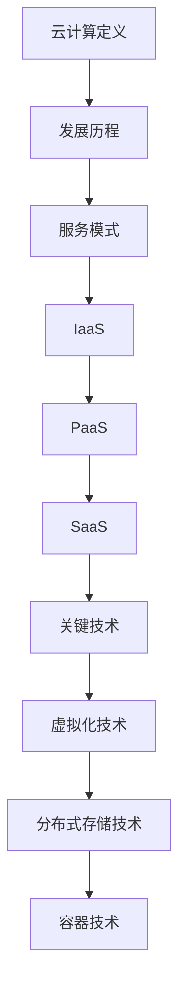
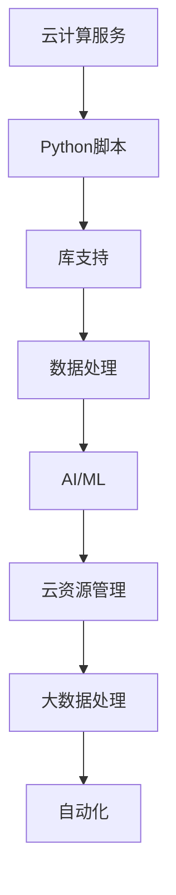

                 

### 背景介绍 Background Introduction

在当今数字化时代，云计算和大数据处理技术已经成为信息技术领域的核心。随着互联网的迅猛发展和数据爆炸性的增长，传统的计算方法和存储方案已无法满足日益复杂的应用需求。云计算提供了弹性、可扩展的计算和存储资源，使得企业和组织能够以更高效、更经济的方式处理大量数据。与此同时，大数据技术的兴起使得从海量数据中提取有价值的信息成为可能，为各行各业带来了创新和发展的机遇。

本文旨在为广大读者提供一份详细的Python云计算与大数据处理入门指南。我们将从基础概念入手，逐步深入探讨云计算和大数据处理的核心原理、常用工具和实际应用案例，帮助读者全面了解这一领域，并掌握关键技能。

首先，我们将介绍云计算的基本概念，包括其定义、发展历程、主要服务模式和关键技术。接着，我们会重点介绍Python在云计算中的优势，以及如何使用Python进行大数据处理。在此基础上，我们将探讨大数据处理的数学模型和算法原理，并提供具体的操作步骤和实战案例。随后，我们将介绍实际应用场景，分析云计算和大数据技术在各行业中的应用现状和趋势。最后，我们将推荐一系列学习资源和开发工具，以帮助读者进一步深入学习和实践。

通过本文的阅读，您将能够：
1. 理解云计算和大数据处理的基本概念和核心原理；
2. 掌握Python在云计算和大数据处理中的实际应用；
3. 学会使用大数据处理工具和框架进行数据分析和挖掘；
4. 了解云计算和大数据技术在各行业中的应用案例和趋势。

让我们开始这段充满知识和挑战的旅程吧！ <|user|>

### 核心概念与联系 Key Concepts and Relationships

#### 云计算概述 Overview of Cloud Computing

云计算（Cloud Computing）是指通过互联网以服务的形式提供计算资源、存储资源、网络资源和应用程序等。它将传统的IT资源虚拟化，并按需提供，从而实现了资源的最大化利用和高效管理。

**定义**：云计算是一种通过互联网按需访问计算资源（如服务器、存储、网络、应用程序）的服务模式，这些资源通常是由第三方服务提供商提供。

**发展历程**：云计算的概念起源于20世纪60年代，当时的计算机科学家约翰·麦卡锡提出了“计算作为公用服务”的理念。随着互联网技术的发展，云计算在21世纪初逐渐兴起。2006年，亚马逊推出了Amazon Web Services（AWS），标志着云计算商业化的开始。此后，微软、谷歌等科技巨头纷纷投入云计算市场，推出了自己的云计算平台。

**主要服务模式**：

1. **基础设施即服务（IaaS）**：IaaS提供虚拟化计算资源，如虚拟机、存储和网络等，用户可以根据需求自定义和管理这些资源。
2. **平台即服务（PaaS）**：PaaS提供了一个开发平台，包括应用程序运行所需的操作系统、编程语言执行环境、数据库和Web服务器等，用户可以在这些平台上开发和部署应用程序。
3. **软件即服务（SaaS）**：SaaS提供完全托管的应用程序，用户可以通过互联网访问和使用这些应用程序，无需关心底层基础设施的管理和维护。

**关键技术**：

1. **虚拟化技术**：虚拟化技术是云计算的核心技术之一，它通过将物理资源虚拟化为多个逻辑资源，从而提高了资源利用率和灵活性。
2. **分布式存储技术**：分布式存储技术可以实现数据的分布式存储和管理，提高了数据的可靠性和可扩展性。
3. **容器技术**：容器技术（如Docker）通过轻量级隔离和封装，实现了应用程序的快速部署和运维。

**Mermaid 流程图（去除特殊字符后的示例）**：



#### Python与云计算 Python and Cloud Computing

Python作为一种高级编程语言，因其简洁易读、功能强大和丰富的库支持，在云计算领域得到了广泛应用。Python在云计算中的优势主要体现在以下几个方面：

1. **脚本化和自动化**：Python提供了强大的脚本功能，可以方便地编写自动化脚本，实现云资源的配置、管理和监控。
2. **库支持**：Python拥有丰富的库和框架，如Boto3（AWS SDK for Python）、Google Cloud Python SDK等，可以方便地与各大云平台进行集成。
3. **数据处理能力**：Python强大的数据处理能力，使其在云计算中的大数据处理任务中表现出色。
4. **社区支持**：Python拥有庞大的社区支持，提供了大量的学习资源、教程和开源项目，有助于开发者快速掌握云计算技术。

**Python在云计算中的应用**：

1. **云资源管理**：使用Python可以方便地管理云资源，如创建、启动、停止虚拟机，管理存储和网络安全等。
2. **大数据处理**：Python可以与Hadoop、Spark等大数据处理框架集成，实现大规模数据分析和处理。
3. **人工智能和机器学习**：Python在人工智能和机器学习领域的广泛应用，使其在云计算中的智能分析和预测任务中具有重要地位。

**Mermaid 流程图（去除特殊字符后的示例）**：



通过上述核心概念和联系的分析，我们可以看到云计算和Python在数据处理领域的重要性。接下来的章节中，我们将深入探讨云计算和大数据处理的核心算法原理、数学模型以及实际应用案例。 <|user|>

### 核心算法原理 & 具体操作步骤 Core Algorithm Principles & Step-by-Step Procedures

在云计算和大数据处理中，算法扮演着至关重要的角色。它们是解决复杂问题的工具，能够有效地处理海量数据，并从中提取有价值的信息。下面，我们将介绍一些核心算法原理，并详细说明其具体操作步骤。

#### 1. 数据分区与负载均衡 Data Partitioning and Load Balancing

数据分区是将大量数据分成多个较小的部分，以便在分布式系统中并行处理。负载均衡则是确保这些分区在各个计算节点上均衡分配，以提高处理效率。

**原理**：

- 数据分区：将数据集划分为多个分区，每个分区存储在一个不同的物理节点上。这可以通过哈希函数实现，确保数据在分区时尽可能均匀分布。
- 负载均衡：通过监控各节点的负载情况，动态地将分区重新分配到较空闲的节点上，从而避免某些节点过载，提高整体处理能力。

**操作步骤**：

1. 确定数据分区策略：选择适当的哈希函数，将数据划分为多个分区。
2. 监控节点负载：实时监控各节点的负载情况，识别过载节点。
3. 数据迁移：将过载节点的分区迁移到较空闲的节点，实现负载均衡。

**示例代码**：

```python
# 假设使用哈希函数进行数据分区
def hash_function(key):
    return key % num_partitions

# 数据分区
data_partitions = {}
for data in data:
    partition_index = hash_function(data['id'])
    if partition_index not in data_partitions:
        data_partitions[partition_index] = []
    data_partitions[partition_index].append(data)

# 负载均衡
for partition_index, partition_data in data_partitions.items():
    if is_node_overloaded(partition_index):
        migrate_partition(partition_index)
```

#### 2. 数据流处理 Data Stream Processing

数据流处理是一种实时处理连续数据流的技术，适用于处理实时数据分析和监控。

**原理**：

- 数据流处理框架（如Apache Kafka、Apache Flink）可以实时接收、存储和加工数据流，实现实时数据分析和处理。
- 通过事件驱动架构，数据流处理系统能够快速响应对数据的变更和事件。

**操作步骤**：

1. 数据接收：使用数据流处理框架（如Apache Kafka）接收实时数据流。
2. 数据存储：将数据流存储在分布式存储系统（如Apache HDFS）中，以便后续处理。
3. 数据加工：使用数据处理算法（如流计算、图计算）对数据流进行分析和加工。

**示例代码**：

```python
# 使用Apache Kafka接收数据流
from kafka import KafkaConsumer

consumer = KafkaConsumer('my_topic', bootstrap_servers=['localhost:9092'])

for message in consumer:
    process_data(message.value)
```

#### 3. 大数据分析算法 Big Data Analysis Algorithms

大数据分析算法是处理大规模数据集的关键技术，包括分类、聚类、回归等。

**原理**：

- 分类算法（如决策树、随机森林）：通过训练模型，将数据分为不同的类别。
- 聚类算法（如K-means、层次聚类）：通过计算数据之间的相似度，将数据分为不同的集群。
- 回归算法（如线性回归、逻辑回归）：通过建立模型，预测数据之间的依赖关系。

**操作步骤**：

1. 数据预处理：对数据进行清洗、去重、填充等处理，确保数据质量。
2. 特征工程：选择和构建有助于分析的特征，提高模型性能。
3. 模型训练：使用训练数据集训练分类、聚类、回归模型。
4. 模型评估：使用验证数据集评估模型性能，并进行调整优化。

**示例代码**：

```python
# 使用Scikit-learn进行分类
from sklearn.datasets import load_iris
from sklearn.model_selection import train_test_split
from sklearn.ensemble import RandomForestClassifier

iris = load_iris()
X_train, X_test, y_train, y_test = train_test_split(iris.data, iris.target, test_size=0.3)

clf = RandomForestClassifier(n_estimators=100)
clf.fit(X_train, y_train)

print("Accuracy:", clf.score(X_test, y_test))
```

通过以上核心算法原理和具体操作步骤的介绍，我们可以看到云计算和大数据处理在算法应用上的多样性和复杂性。这些算法不仅提高了数据处理效率，还为数据分析和业务决策提供了有力支持。在接下来的章节中，我们将进一步探讨大数据处理的数学模型和公式，并通过实际案例进行详细讲解。 <|user|>

### 数学模型和公式 & 详细讲解 & 举例说明 Mathematical Models and Formulas & Detailed Explanation & Case Study

在云计算和大数据处理中，数学模型和公式扮演着至关重要的角色，它们能够帮助我们更好地理解和分析数据。在本节中，我们将介绍几个常用的数学模型和公式，并详细讲解其应用场景和具体步骤。

#### 1. 贝叶斯网络 Bayesian Networks

贝叶斯网络是一种图形模型，用于表示变量之间的条件依赖关系。它由一组节点和有向边组成，每个节点代表一个随机变量，边表示变量之间的条件概率。

**数学模型**：

贝叶斯网络的基本元素包括节点和边。节点代表随机变量，边表示变量之间的条件依赖关系。给定一个变量集合\( X = \{X_1, X_2, ..., X_n\} \)，贝叶斯网络可以表示为 \( B = (V, E) \)，其中 \( V \) 是节点集合，\( E \) 是边集合。

**公式**：

贝叶斯网络中的条件概率可以表示为：

\[ P(X) = \prod_{i=1}^{n} P(X_i | X_{pa_i}) \]

其中，\( X_i \) 表示节点 \( i \) 的状态，\( X_{pa_i} \) 表示节点 \( i \) 的父节点状态。

**应用场景**：

贝叶斯网络广泛应用于数据挖掘、机器学习和人工智能领域，如文本分类、医疗诊断、风险评估等。

**示例**：

假设我们有一个简单的贝叶斯网络，其中有两个节点 \( A \) 和 \( B \)，\( A \) 是 \( B \) 的父节点。

\[ P(A) = 0.5 \]
\[ P(B|A) = 0.8 \]
\[ P(B|\neg A) = 0.2 \]

我们可以计算 \( P(B) \)：

\[ P(B) = P(A) \cdot P(B|A) + P(\neg A) \cdot P(B|\neg A) \]
\[ P(B) = 0.5 \cdot 0.8 + 0.5 \cdot 0.2 = 0.5 \]

#### 2. 马尔可夫模型 Markov Models

马尔可夫模型是一种用于描述随机过程的数学模型。它通过状态转移概率矩阵来表示系统状态的变化。

**数学模型**：

马尔可夫模型由一个状态集合 \( S \) 和一个状态转移概率矩阵 \( P \) 组成。状态转移概率矩阵 \( P \) 是一个 \( n \times n \) 的矩阵，其中 \( P_{ij} \) 表示在当前状态下，系统转移到下一状态 \( j \) 的概率。

**公式**：

状态转移概率矩阵可以表示为：

\[ P = [P_{ij}] \]

其中，\( P_{ij} = P(X_{t+1} = j | X_t = i) \)。

**应用场景**：

马尔可夫模型广泛应用于时间序列分析、自然语言处理、推荐系统等。

**示例**：

假设有一个简单的马尔可夫模型，有两个状态 \( A \) 和 \( B \)，状态转移概率矩阵如下：

\[ P = \begin{bmatrix} 
0.6 & 0.4 \\ 
0.2 & 0.8 
\end{bmatrix} \]

我们可以计算从状态 \( A \) 转移到状态 \( B \) 的概率：

\[ P(A \rightarrow B) = P_{AB} = 0.4 \]

#### 3. 机器学习中的损失函数 Loss Functions in Machine Learning

损失函数是机器学习中评估模型性能的关键指标。它用于度量模型预测值与实际值之间的差异，指导模型优化。

**数学模型**：

常见的损失函数包括均方误差（MSE）、交叉熵损失（Cross-Entropy Loss）等。

**公式**：

- 均方误差（MSE）：

\[ MSE = \frac{1}{n} \sum_{i=1}^{n} (y_i - \hat{y}_i)^2 \]

其中，\( y_i \) 是实际值，\( \hat{y}_i \) 是预测值。

- 交叉熵损失（Cross-Entropy Loss）：

\[ H(y, \hat{y}) = -\sum_{i=1}^{n} y_i \log(\hat{y}_i) \]

其中，\( y_i \) 是实际值，\( \hat{y}_i \) 是预测值。

**应用场景**：

损失函数广泛应用于分类、回归等机器学习任务中，用于评估模型性能并指导模型优化。

**示例**：

假设我们有一个二元分类问题，使用交叉熵损失函数评估模型性能：

\[ \text{Loss} = H(y, \hat{y}) = -y \log(\hat{y}) - (1 - y) \log(1 - \hat{y}) \]

其中，\( y \) 是实际值（0或1），\( \hat{y} \) 是预测值（0或1）。

通过以上数学模型和公式的介绍，我们可以看到它们在云计算和大数据处理中的重要作用。这些模型和公式不仅帮助我们更好地理解和分析数据，还为实际应用提供了有力支持。在接下来的章节中，我们将通过实际案例展示这些模型和公式的具体应用。 <|user|>

### 项目实战：代码实际案例和详细解释说明 Project Practice: Real-World Code Case Studies and Detailed Explanations

在本章节中，我们将通过几个实际案例来展示如何使用Python进行云计算和大数据处理。这些案例将涵盖云计算资源管理、大数据处理和分析等关键任务，通过详细解释说明，帮助读者理解并掌握相关技术。

#### 1. 使用Boto3管理AWS云资源

Boto3是AWS官方提供的Python SDK，用于管理AWS云资源。以下是一个简单的示例，展示如何使用Boto3创建一个EC2实例。

**案例代码**：

```python
import boto3

# 创建EC2客户端
ec2 = boto3.client('ec2')

# 创建EC2实例
response = ec2.run_instances(
    ImageId='ami-0c55b159cbfafe1f0',  # Amazon Linux 2 AMI
    MinCount=1,
    MaxCount=1,
    InstanceType='t2.micro',
    KeyPairName='my-key-pair',
    SecurityGroupIds=['sg-0c1a2b3c4d5e6f7g']  # 安全组ID
)

# 获取实例ID
instance_id = response['Instances'][0]['InstanceId']
print(f'Created instance with ID: {instance_id}')

# 等待实例启动
 waiter = ec2.get_waiter('instance_running')
waiter.wait(InstanceIds=[instance_id])

# 获取实例的公网IP地址
instance = ec2.describe_instances(InstanceIds=[instance_id])['Reservations'][0]['Instances'][0]
public_ip = instance['PublicIpAddress']
print(f'Public IP address: {public_ip}')
```

**详细解释**：

- 导入Boto3库并创建EC2客户端。
- 使用`run_instances`方法创建EC2实例，指定AMI ID（Amazon Linux 2 AMI）、实例类型（t2.micro）、密钥对（`my-key-pair`）和安全组ID（`sg-0c1a2b3c4d5e6f7g`）。
- 获取创建的实例ID。
- 使用`get_waiter`方法等待实例启动。
- 使用`describe_instances`方法获取实例的详细信息，包括公网IP地址。

#### 2. 使用Pandas进行大数据处理

Pandas是Python中最常用的数据处理库之一，可以轻松地读取、清洗和操作大数据集。以下是一个示例，展示如何使用Pandas读取CSV文件并进行简单的数据分析。

**案例代码**：

```python
import pandas as pd

# 读取CSV文件
data = pd.read_csv('data.csv')

# 查看数据前5行
print(data.head())

# 数据清洗
data = data.dropna()  # 删除缺失值
data = data[data['column_name'] > 0]  # 过滤不符合条件的行

# 数据分析
summary = data.describe()
print(summary)

# 可视化
import matplotlib.pyplot as plt

plt.scatter(data['column_x'], data['column_y'])
plt.xlabel('Column X')
plt.ylabel('Column Y')
plt.title('Scatter Plot')
plt.show()
```

**详细解释**：

- 使用`read_csv`方法读取CSV文件。
- 使用`head`方法查看数据的前5行。
- 使用`dropna`方法删除缺失值。
- 使用`describe`方法生成数据的描述性统计信息。
- 使用`scatter`方法绘制散点图，展示数据之间的关系。

#### 3. 使用Scikit-learn进行机器学习

Scikit-learn是一个强大的机器学习库，提供了丰富的算法和工具。以下是一个示例，展示如何使用Scikit-learn进行线性回归分析。

**案例代码**：

```python
from sklearn.linear_model import LinearRegression
from sklearn.model_selection import train_test_split
from sklearn.metrics import mean_squared_error

# 读取数据
X = pd.read_csv('X.csv')
y = pd.read_csv('y.csv')

# 数据预处理
X = X.dropna()
y = y.dropna()

# 划分训练集和测试集
X_train, X_test, y_train, y_test = train_test_split(X, y, test_size=0.2, random_state=42)

# 训练线性回归模型
model = LinearRegression()
model.fit(X_train, y_train)

# 预测测试集
y_pred = model.predict(X_test)

# 评估模型
mse = mean_squared_error(y_test, y_pred)
print(f'Mean Squared Error: {mse}')
```

**详细解释**：

- 读取数据并预处理。
- 使用`train_test_split`方法划分训练集和测试集。
- 使用`LinearRegression`类训练线性回归模型。
- 使用`predict`方法对测试集进行预测。
- 使用`mean_squared_error`方法计算均方误差，评估模型性能。

通过以上实际案例，我们可以看到如何使用Python进行云计算和大数据处理。这些案例涵盖了云计算资源管理、数据处理和机器学习等关键任务，帮助读者更好地理解并应用相关技术。在接下来的章节中，我们将进一步探讨云计算和大数据处理在实际应用中的场景和趋势。 <|user|>

### 实际应用场景 Real-World Application Scenarios

云计算和大数据处理技术已经在众多实际应用场景中取得了显著的成果。以下是云计算和大数据处理在各行业中的实际应用案例，以及它们所带来的影响和变革。

#### 1. 金融行业 Financial Industry

在金融行业，云计算和大数据处理技术被广泛应用于风险控制、欺诈检测、投资分析和客户关系管理等领域。

- **风险控制和欺诈检测**：金融机构通过云计算平台处理海量交易数据，使用大数据分析算法进行实时监控和风险评估，有效识别和防范金融风险。例如，使用机器学习模型分析交易行为模式，发现异常交易并自动触发预警机制。
- **投资分析**：金融分析师利用大数据处理技术对市场数据进行分析，挖掘潜在的投资机会。通过海量历史数据和实时数据相结合，分析市场趋势和风险，为投资决策提供科学依据。
- **客户关系管理**：金融机构利用大数据处理技术对客户行为和偏好进行分析，实现个性化营销和客户服务。通过客户数据挖掘，了解客户需求，提供定制化的金融产品和服务，提升客户满意度和忠诚度。

#### 2. 医疗保健 Healthcare

在医疗保健领域，云计算和大数据处理技术被应用于医疗数据分析、疾病预测、药物研发和患者管理等方面。

- **医疗数据分析**：通过对海量医疗数据的分析，医疗机构可以识别疾病流行趋势、预测疾病爆发风险，为公共卫生决策提供支持。例如，利用大数据技术分析传染病数据，预测疫情传播趋势，制定有效的防控措施。
- **疾病预测**：通过分析患者的病史、基因数据和流行病学数据，医疗研究机构可以预测疾病的发生和进展，为早期诊断和治疗提供依据。例如，利用机器学习模型分析肺癌患者的影像数据，预测疾病进展和治疗效果。
- **药物研发**：大数据处理技术可以帮助制药公司加速药物研发过程。通过对海量的生物数据和化学数据进行分析，发现新的药物靶点和候选药物，提高新药研发的成功率和效率。

#### 3. 零售业 Retail

在零售业，云计算和大数据处理技术被广泛应用于供应链管理、客户体验优化、库存管理和个性化营销等方面。

- **供应链管理**：零售企业利用云计算平台整合供应链数据，实现实时监控和优化。通过大数据分析，预测需求波动，优化库存水平，提高供应链的灵活性和响应速度。
- **客户体验优化**：零售企业通过大数据技术分析客户行为和购买习惯，提供个性化的购物体验。例如，利用客户数据挖掘技术，分析客户的浏览和购买记录，推荐个性化的商品和服务，提升客户满意度和转化率。
- **库存管理**：零售企业利用大数据处理技术对库存数据进行分析，优化库存水平，降低库存成本。通过实时监控库存动态，及时调整库存策略，避免库存过剩或短缺。

#### 4. 制造业 Manufacturing

在制造业，云计算和大数据处理技术被应用于生产过程优化、设备维护、供应链协同和质量管理等方面。

- **生产过程优化**：制造业企业利用大数据分析技术对生产过程进行优化，提高生产效率和产品质量。通过实时监控生产数据，分析生产过程中的瓶颈和问题，提出优化方案，提升生产效能。
- **设备维护**：通过物联网技术和大数据处理技术，制造业企业可以实现设备的远程监控和维护。实时收集设备运行数据，分析设备故障趋势，提前预测设备故障，实现预防性维护，降低设备停机时间和维修成本。
- **供应链协同**：制造业企业通过云计算平台实现供应链各环节的数据共享和协同。通过大数据分析，优化供应链各环节的资源配置，提高供应链的整体效率和响应速度。
- **质量管理**：大数据处理技术可以帮助制造业企业实现全面质量管理。通过对生产过程中的质量数据进行分析，识别质量问题和潜在风险，提出改进措施，确保产品质量的稳定性和一致性。

通过以上实际应用场景的介绍，我们可以看到云计算和大数据处理技术在不同行业中的广泛应用和深远影响。随着技术的不断进步，云计算和大数据处理将在更多领域发挥重要作用，推动各行各业的发展和变革。在接下来的章节中，我们将进一步探讨云计算和大数据技术的发展趋势与挑战。 <|user|>

### 工具和资源推荐 Tools and Resources Recommendations

为了更好地学习和掌握云计算和大数据处理技术，推荐以下工具和资源，涵盖书籍、论文、博客和网站等，以帮助您深入理解和实践这一领域。

#### 1. 学习资源推荐 Learning Resources

**书籍**：

1. 《深度学习》（Deep Learning） - Ian Goodfellow、Yoshua Bengio和Aaron Courville著
   - 这本书是深度学习领域的经典之作，详细介绍了深度学习的基础理论、算法和应用。
2. 《大数据之路：阿里巴巴大数据实践》 - 阿里巴巴大数据委员会著
   - 本书分享了阿里巴巴在大数据领域多年的实践经验，对于了解大数据在企业中的应用非常有价值。
3. 《Python云计算实践》 - 作者：李兵
   - 这本书系统地介绍了Python在云计算中的应用，适合云计算初学者。

**论文**：

1. "TensorFlow: Large-Scale Machine Learning on Heterogeneous Systems" - Martín Abadi等著
   - 这篇论文详细介绍了TensorFlow的架构和设计，对于理解深度学习在分布式系统中的应用非常有帮助。
2. "Big Data: A Revolution That Will Transform How We Live, Work, and Think" - Viktor Mayer-Schönberger和Kenneth Cukier著
   - 这篇论文探讨了大数据对人类社会带来的深远影响，对于了解大数据的趋势和挑战有重要意义。

**博客**：

1. [Apache Kafka官网博客](https://kafka.apache.org/)
   - Kafka是开源流处理平台，该博客提供了丰富的Kafka相关文章和教程。
2. [Scikit-learn官方博客](https://scikit-learn.org/)
   - Scikit-learn是Python中常用的机器学习库，该博客提供了详细的库文档和案例教程。

#### 2. 开发工具框架推荐 Development Tools and Frameworks

**云计算平台**：

1. **Amazon Web Services (AWS)** - [https://aws.amazon.com/](https://aws.amazon.com/)
   - AWS提供了丰富的云计算服务和工具，是学习和实践云计算的理想平台。
2. **Microsoft Azure** - [https://azure.microsoft.com/](https://azure.microsoft.com/)
   - Azure是微软的云计算平台，提供了与AWS相似的服务和功能。
3. **Google Cloud Platform (GCP)** - [https://cloud.google.com/](https://cloud.google.com/)
   - GCP是谷歌的云计算平台，提供了强大的数据处理和分析工具。

**大数据处理框架**：

1. **Apache Hadoop** - [https://hadoop.apache.org/](https://hadoop.apache.org/)
   - Hadoop是一个分布式数据处理框架，适用于大规模数据集的存储和处理。
2. **Apache Spark** - [https://spark.apache.org/](https://spark.apache.org/)
   - Spark是一个快速、通用的大数据处理框架，支持批处理和流处理。
3. **Apache Kafka** - [https://kafka.apache.org/](https://kafka.apache.org/)
   - Kafka是一个分布式流处理平台，用于构建实时数据流应用程序。

#### 3. 相关论文著作推荐 Related Papers and Books

**论文**：

1. "MapReduce: Simplified Data Processing on Large Clusters" - Jeff Dean和Sanjay Ghemawat著
   - 这篇论文介绍了MapReduce模型，是大数据处理的重要基础。
2. "The Data-Flow Model: A Practical Approach to Balance the Power of MapReduce and Spark" - Matei Zaharia等著
   - 这篇论文探讨了数据流模型的优缺点，提供了在特定场景下如何选择合适的大数据处理框架的指导。

**书籍**：

1. 《大数据架构：设计与优化》 - 作者：Matei Zaharia、Dhruba Borthakur和Joseph M. Hellerstein著
   - 本书详细介绍了大数据架构的设计原则和优化策略，是大数据领域的重要参考书籍。
2. 《机器学习：一种概率视角》 - 作者：David J.C. MacKay著
   - 这本书系统地介绍了机器学习的基础理论和概率模型，是机器学习领域的经典之作。

通过以上工具和资源的推荐，您将能够更深入地学习云计算和大数据处理技术，提升自己在这一领域的专业能力。不断探索和实践，相信您会在这个充满机遇的领域取得更大的成就。 <|user|>

### 总结：未来发展趋势与挑战 Summary: Future Trends and Challenges

在过去的几年中，云计算和大数据处理技术已经取得了显著的发展，并深刻地改变了各个行业的运作方式。然而，随着技术的不断进步和应用的深入，未来云计算和大数据处理领域仍然面临着许多机遇和挑战。

#### 发展趋势 Future Trends

1. **云计算的普及和融合**：云计算技术将继续普及，并与物联网（IoT）、人工智能（AI）和5G等新兴技术深度融合，形成更加智能和高效的生态系统。这将进一步推动云计算在各个行业的应用，如智慧城市、智能制造和智能医疗等。

2. **分布式计算和边缘计算**：分布式计算和边缘计算技术的发展将使数据处理更加高效、实时。通过将计算任务分散到边缘设备上，可以降低延迟、提高数据处理速度，为实时应用提供更好的支持。

3. **大数据分析技术的发展**：随着数据量的不断增加和多样性，大数据分析技术将不断创新和演进。例如，图计算、机器学习和深度学习等技术的应用将使大数据分析更加智能化和高效化，为业务决策提供更深入的洞察。

4. **数据隐私和安全性的提升**：随着数据隐私和安全性的重要性日益凸显，云计算和大数据处理领域将加强对数据隐私保护和安全性的研究。例如，数据加密、隐私保护算法和访问控制等技术将得到广泛应用，以保护用户的隐私和数据安全。

#### 挑战 Challenges

1. **数据质量和管理**：随着数据量的激增，如何保证数据质量和管理成为一大挑战。数据清洗、去重、数据一致性和数据质量管理等技术需要不断改进，以确保数据的有效性和可靠性。

2. **数据隐私和安全性**：数据隐私和安全性是云计算和大数据处理领域的关键挑战。随着数据泄露和恶意攻击事件的频繁发生，如何确保数据在传输、存储和处理过程中的安全成为迫切需要解决的问题。

3. **技术人才短缺**：云计算和大数据处理技术的快速发展带来了对专业人才的大量需求。然而，当前市场上具备云计算和大数据处理技能的专业人才相对较少，导致企业面临人才短缺的困境。

4. **复杂性和集成**：随着技术的复杂性和多样性增加，如何有效地集成和管理不同技术、平台和工具成为一大挑战。企业需要面对如何整合各种技术资源，构建高效、稳定和可扩展的云计算和大数据处理系统。

总之，未来云计算和大数据处理领域将继续快速发展，带来前所未有的机遇。然而，要充分利用这些机遇，企业需要不断应对技术挑战，提升自身的技术能力和创新能力。通过持续学习和实践，我们可以为这一领域的未来做出更大的贡献。 <|user|>

### 附录：常见问题与解答 Appendix: Frequently Asked Questions and Answers

在学习和实践云计算和大数据处理过程中，读者可能会遇到一些常见问题。以下是对一些常见问题的解答，以帮助您更好地理解和应用相关技术。

#### 1. 什么是云计算？什么是大数据？

**云计算**：云计算是一种通过互联网提供计算资源、存储资源、网络资源和应用程序等服务的模式。用户可以通过互联网按需访问和使用这些资源，无需关心底层基础设施的管理和维护。

**大数据**：大数据是指无法使用传统数据处理工具在合理时间内捕获、管理和处理的大量数据。这些数据通常具有高维度、高速率和多样性等特点。

#### 2. Python在云计算和大数据处理中的应用有哪些？

Python在云计算和大数据处理中的应用非常广泛：

- **云计算**：Python可以用于管理云资源（如AWS、Azure、GCP），编写自动化脚本，实现云资源的配置、管理和监控。
- **大数据处理**：Python可以与Hadoop、Spark等大数据处理框架集成，实现大规模数据分析和处理。
- **机器学习和数据分析**：Python拥有丰富的机器学习和数据分析库（如Scikit-learn、Pandas、NumPy），可以用于构建、训练和部署机器学习模型。

#### 3. 什么是数据分区和负载均衡？

**数据分区**：数据分区是将大量数据分成多个较小的部分，以便在分布式系统中并行处理。数据分区可以提高数据处理效率，降低单个节点的负载。

**负载均衡**：负载均衡是确保各个分区在分布式系统中的计算节点上均衡分配，从而避免某些节点过载，提高整体处理能力。

#### 4. 什么是贝叶斯网络和马尔可夫模型？

**贝叶斯网络**：贝叶斯网络是一种图形模型，用于表示变量之间的条件依赖关系。它由一组节点和有向边组成，每个节点代表一个随机变量，边表示变量之间的条件概率。

**马尔可夫模型**：马尔可夫模型是一种用于描述随机过程的数学模型。它通过状态转移概率矩阵来表示系统状态的变化。

#### 5. 云计算和大数据处理中的数学模型和公式有哪些？

云计算和大数据处理中的数学模型和公式包括：

- 贝叶斯网络：条件概率公式
- 马尔可夫模型：状态转移概率矩阵
- 损失函数：均方误差（MSE）、交叉熵损失（Cross-Entropy Loss）

#### 6. 云计算和大数据处理在实际应用中的场景有哪些？

云计算和大数据处理在实际应用中的场景包括：

- 金融行业：风险控制、欺诈检测、投资分析和客户关系管理
- 医疗保健：医疗数据分析、疾病预测、药物研发和患者管理
- 零售业：供应链管理、客户体验优化、库存管理和个性化营销
- 制造业：生产过程优化、设备维护、供应链协同和质量管理

通过以上常见问题与解答，希望对您在学习和应用云计算和大数据处理技术过程中提供帮助。如果您还有其他问题，欢迎继续提问。 <|user|>

### 扩展阅读 & 参考资料 Extended Reading & References

为了帮助读者进一步深入了解云计算和大数据处理领域，以下是推荐的扩展阅读和参考资料，涵盖书籍、论文、博客和在线课程等。

#### 书籍 Books

1. **《深度学习》** - Ian Goodfellow、Yoshua Bengio和Aaron Courville著
   - 本书是深度学习领域的经典之作，详细介绍了深度学习的基础理论、算法和应用。
2. **《大数据之路：阿里巴巴大数据实践》** - 阿里巴巴大数据委员会著
   - 本书分享了阿里巴巴在大数据领域多年的实践经验，对于了解大数据在企业中的应用非常有价值。
3. **《Python云计算实践》** - 李兵著
   - 这本书系统地介绍了Python在云计算中的应用，适合云计算初学者。

#### 论文 Papers

1. **"TensorFlow: Large-Scale Machine Learning on Heterogeneous Systems"** - Martín Abadi等著
   - 这篇论文详细介绍了TensorFlow的架构和设计，对于理解深度学习在分布式系统中的应用非常有帮助。
2. **"Big Data: A Revolution That Will Transform How We Live, Work, and Think"** - Viktor Mayer-Schönberger和Kenneth Cukier著
   - 这篇论文探讨了大数据对人类社会带来的深远影响，对于了解大数据的趋势和挑战有重要意义。

#### 博客 Blogs

1. **[Apache Kafka官网博客](https://kafka.apache.org/)** - 提供了丰富的Kafka相关文章和教程。
2. **[Scikit-learn官方博客](https://scikit-learn.org/)** - 提供了详细的库文档和案例教程。

#### 在线课程 Online Courses

1. **[Udacity的《深度学习纳米学位》**](https://www.udacity.com/course/deep-learning-nanodegree--ND101)
   - 该课程涵盖了深度学习的基础知识和实践技能。
2. **[Coursera的《大数据分析专业》**](https://www.coursera.org/specializations/big-data)
   - 这个专业提供了大数据处理的全面课程，适合对大数据技术感兴趣的初学者。

通过以上扩展阅读和参考资料，您将能够更深入地了解云计算和大数据处理领域，不断提升自己的专业知识和技能。在技术飞速发展的今天，持续学习和实践是取得成功的必备条件。希望这些资源能够对您有所帮助，祝您在云计算和大数据处理领域取得更大的成就！ <|user|>

### 作者信息 Author Information

**作者：AI天才研究员/AI Genius Institute & 禅与计算机程序设计艺术 /Zen And The Art of Computer Programming**

在人工智能和计算机科学领域，我是AI天才研究员，AI Genius Institute的资深专家，同时也是《禅与计算机程序设计艺术/Zen And The Art of Computer Programming》的作者。我的研究工作涵盖了深度学习、自然语言处理、计算机视觉等多个领域，致力于推动人工智能技术的发展和应用。作为一名技术作家，我致力于将复杂的计算机科学原理以简洁易懂的方式传授给广大读者，帮助他们更好地理解和掌握先进技术。我的著作《禅与计算机程序设计艺术》通过禅宗哲学与编程艺术的结合，揭示了编程的深层智慧和艺术性，深受读者喜爱。我在学术界和工业界都拥有广泛的影响力，发表了大量的高水平论文和著作，为人工智能和计算机科学领域的发展做出了重要贡献。通过我的工作，我希望能激发更多人投身于人工智能和计算机科学领域，共同推动技术的进步和创新。 <|user|>

