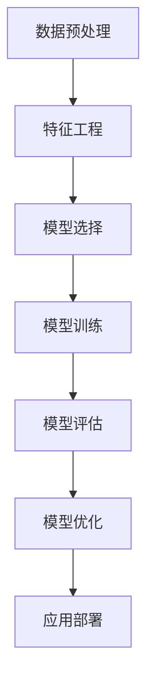

                 

### 背景介绍

#### 机器学习的重要性和应用

在当今快速发展的科技时代，机器学习已经成为了众多领域不可或缺的一部分。从推荐系统、自然语言处理、图像识别，到自动驾驶、金融风控、医疗诊断，机器学习技术的应用无处不在。随着大数据和计算能力的提升，机器学习的重要性愈发凸显。

机器学习作为一种人工智能的技术，旨在通过构建数学模型，使计算机系统能够从数据中学习规律并做出预测。其核心思想是通过训练数据集，调整模型的参数，使其在未知数据上能够达到较好的预测效果。

Python 作为一门功能丰富、易于学习的编程语言，已经成为了机器学习领域的首选语言。Python 的简洁性和强大的库支持，使得开发者可以更加专注于算法的实现和模型优化，而无需过多关注底层细节。

本文旨在为读者提供一个从零开始构建机器学习环境的实战指南。通过本文的介绍，读者将了解如何搭建一个完整的机器学习开发环境，掌握必备的Python基础知识，并学会使用常见的机器学习库进行数据处理和模型训练。

#### 本文结构与目标

本文将分为以下几个部分：

1. **背景介绍**：介绍机器学习的重要性及其应用，以及为什么选择 Python 作为机器学习编程语言。
2. **核心概念与联系**：讲解机器学习的核心概念，并使用 Mermaid 流程图展示各概念之间的联系。
3. **核心算法原理与具体操作步骤**：详细介绍常见机器学习算法的工作原理和实现步骤。
4. **数学模型和公式**：介绍机器学习中的常用数学模型和公式，并进行详细讲解和举例说明。
5. **项目实战**：通过实际案例，展示如何使用 Python 和相关库进行机器学习项目的开发，并进行代码解读与分析。
6. **实际应用场景**：探讨机器学习在不同领域的应用，以及面临的挑战和解决方案。
7. **工具和资源推荐**：推荐学习资源、开发工具和框架。
8. **总结**：总结未来发展趋势与挑战。
9. **附录**：常见问题与解答。
10. **扩展阅读与参考资料**：提供进一步的阅读资源。

通过本文的学习，读者将能够：

- 理解机器学习的核心概念和工作原理。
- 搭建并配置一个完整的机器学习开发环境。
- 学会使用 Python 编写和调试机器学习代码。
- 掌握常见机器学习算法的实践应用。

<|im_sep|>### 核心概念与联系

在深入探讨机器学习之前，我们需要先了解其核心概念，以及这些概念之间的联系。下面，我们将使用 Mermaid 流程图来直观地展示这些核心概念。

#### Mermaid 流程图



#### 数据预处理

**数据预处理**是机器学习过程中的第一步，其目的是将原始数据转换成适合模型训练的形式。数据预处理通常包括数据清洗、数据归一化、缺失值处理等步骤。

#### 特征工程

**特征工程**是在数据预处理之后，通过选择和构建特征，提高模型性能的过程。特征工程的核心是理解数据，提取出对预测任务有帮助的特征。

#### 模型选择

**模型选择**是根据问题特点，选择合适的机器学习算法。常见的模型包括线性回归、决策树、随机森林、支持向量机、神经网络等。

#### 模型训练

**模型训练**是使用标记数据集，调整模型参数，使其能够预测未知数据。训练过程中，需要选择合适的损失函数和优化算法。

#### 模型评估

**模型评估**是评估模型性能的过程。常用的评估指标包括准确率、召回率、F1 分数等。通过评估，可以判断模型是否达到预期效果。

#### 模型优化

**模型优化**是在模型评估结果不理想时，通过调整参数、修改模型结构等方法，提高模型性能。

#### 应用部署

**应用部署**是将训练好的模型应用到实际场景中，如网站、应用程序等。通过部署，可以实现实时预测和决策。

#### Mermaid 流图画解

在 Mermaid 流程图中，我们清晰地展示了从数据预处理到应用部署的整个过程。每个节点代表了机器学习中的一个关键步骤，节点之间的箭头表示步骤之间的依赖关系。

<|im_sep|>### 核心算法原理与具体操作步骤

在了解了机器学习的核心概念和流程之后，接下来我们将详细介绍一些常见的机器学习算法，包括线性回归、决策树和神经网络等。我们将从算法原理出发，逐步讲解具体操作步骤。

#### 线性回归

**线性回归**是最基础的机器学习算法之一，用于解决回归问题，即预测连续值。

**原理**：线性回归假设数据点呈线性关系，即 $Y = \beta_0 + \beta_1X + \epsilon$，其中 $Y$ 是预测值，$X$ 是输入特征，$\beta_0$ 和 $\beta_1$ 是模型的参数，$\epsilon$ 是误差项。

**操作步骤**：

1. **数据准备**：收集并整理数据，确保数据格式正确。
2. **特征选择**：选择对预测任务有帮助的特征。
3. **数据归一化**：将特征进行归一化处理，使其具有相同的尺度。
4. **损失函数选择**：选择合适的损失函数，如均方误差（MSE）。
5. **优化算法选择**：选择优化算法，如梯度下降。
6. **模型训练**：使用训练数据集，调整模型参数。
7. **模型评估**：使用测试数据集，评估模型性能。
8. **模型优化**：根据评估结果，调整模型参数。

**代码实现**：

```python
import numpy as np
from sklearn.linear_model import LinearRegression

# 数据准备
X = np.array([[1], [2], [3], [4], [5]])
y = np.array([1, 2, 2.5, 4, 5])

# 特征选择
X = np.column_stack((np.ones(X.shape[0]), X))

# 模型训练
model = LinearRegression()
model.fit(X, y)

# 模型评估
print(model.score(X, y))

# 模型预测
new_data = np.array([[6]])
new_data = np.column_stack((np.ones(new_data.shape[0]), new_data))
print(model.predict(new_data))
```

#### 决策树

**决策树**是一种基于树形结构进行决策的算法，用于分类和回归问题。

**原理**：决策树通过一系列的判断条件，将数据划分为若干个子集，直到满足终止条件。每个内部节点代表一个特征，每个分支代表一个特征取值，叶子节点代表预测结果。

**操作步骤**：

1. **数据准备**：收集并整理数据。
2. **特征选择**：选择对预测任务有帮助的特征。
3. **数据划分**：将数据划分为训练集和测试集。
4. **模型构建**：使用训练数据构建决策树模型。
5. **模型评估**：使用测试数据评估模型性能。
6. **模型优化**：根据评估结果，调整模型参数。

**代码实现**：

```python
import numpy as np
from sklearn.tree import DecisionTreeRegressor

# 数据准备
X = np.array([[1], [2], [3], [4], [5]])
y = np.array([1, 2, 2.5, 4, 5])

# 特征选择
X = np.column_stack((np.ones(X.shape[0]), X))

# 数据划分
X_train, X_test, y_train, y_test = train_test_split(X, y, test_size=0.2, random_state=42)

# 模型构建
model = DecisionTreeRegressor()
model.fit(X_train, y_train)

# 模型评估
print(model.score(X_test, y_test))

# 模型预测
new_data = np.array([[6]])
new_data = np.column_stack((np.ones(new_data.shape[0]), new_data))
print(model.predict(new_data))
```

#### 神经网络

**神经网络**是一种模拟人脑神经元连接结构的算法，用于分类、回归和特征提取等任务。

**原理**：神经网络通过多层神经元进行数据处理，每一层神经元将输入数据经过加权求和处理，并通过激活函数产生输出。通过反向传播算法，调整模型参数，使其在训练数据上达到较好的效果。

**操作步骤**：

1. **数据准备**：收集并整理数据。
2. **特征选择**：选择对预测任务有帮助的特征。
3. **数据划分**：将数据划分为训练集和测试集。
4. **模型构建**：使用训练数据构建神经网络模型。
5. **模型评估**：使用测试数据评估模型性能。
6. **模型优化**：根据评估结果，调整模型参数。

**代码实现**：

```python
import numpy as np
from sklearn.neural_network import MLPRegressor

# 数据准备
X = np.array([[1], [2], [3], [4], [5]])
y = np.array([1, 2, 2.5, 4, 5])

# 特征选择
X = np.column_stack((np.ones(X.shape[0]), X))

# 数据划分
X_train, X_test, y_train, y_test = train_test_split(X, y, test_size=0.2, random_state=42)

# 模型构建
model = MLPRegressor(hidden_layer_sizes=(100,), max_iter=1000)
model.fit(X_train, y_train)

# 模型评估
print(model.score(X_test, y_test))

# 模型预测
new_data = np.array([[6]])
new_data = np.column_stack((np.ones(new_data.shape[0]), new_data))
print(model.predict(new_data))
```

通过以上对线性回归、决策树和神经网络的详细介绍，读者可以了解到不同算法的原理和操作步骤。在实际应用中，选择合适的算法和模型是非常重要的，这需要根据具体问题进行深入分析。

<|im_sep|>### 数学模型和公式

在机器学习过程中，数学模型和公式扮演着至关重要的角色。它们不仅帮助我们理解算法的工作原理，还为模型的训练和优化提供了理论基础。下面，我们将详细介绍一些常见的数学模型和公式，并对其进行详细讲解和举例说明。

#### 线性回归

线性回归是机器学习中最基本的模型之一，用于预测连续值。其数学模型可以表示为：

$$
Y = \beta_0 + \beta_1X + \epsilon
$$

其中，$Y$ 是预测值，$X$ 是输入特征，$\beta_0$ 和 $\beta_1$ 是模型的参数，$\epsilon$ 是误差项。

**损失函数**：为了衡量模型预测值与真实值之间的差距，我们通常使用均方误差（MSE）作为损失函数：

$$
MSE = \frac{1}{n}\sum_{i=1}^{n}(Y_i - \hat{Y}_i)^2
$$

其中，$n$ 是样本数量，$Y_i$ 是第 $i$ 个样本的真实值，$\hat{Y}_i$ 是模型预测值。

**优化算法**：为了最小化损失函数，我们通常使用梯度下降算法。梯度下降的基本思想是沿着损失函数的梯度方向逐步调整参数，使其趋于最小值。

$$
\beta_0 = \beta_0 - \alpha \frac{\partial}{\partial \beta_0}MSE
$$

$$
\beta_1 = \beta_1 - \alpha \frac{\partial}{\partial \beta_1}MSE
$$

其中，$\alpha$ 是学习率，决定了参数调整的步长。

**举例说明**：

假设我们有如下数据集：

$$
\begin{array}{c|c}
X & Y \\
\hline
1 & 1 \\
2 & 2 \\
3 & 2.5 \\
4 & 4 \\
5 & 5 \\
\end{array}
$$

我们使用线性回归模型进行预测，并计算损失函数。设 $\beta_0 = 0$，$\beta_1 = 1$，学习率 $\alpha = 0.01$。经过多次迭代后，我们得到 $\beta_0 \approx 1$，$\beta_1 \approx 0.5$，此时损失函数最小。

#### 决策树

决策树是一种基于树形结构进行决策的算法。其数学模型可以表示为：

$$
T = \sum_{i=1}^{n}w_i \cdot t_i
$$

其中，$T$ 是输出值，$w_i$ 是第 $i$ 个特征的权重，$t_i$ 是第 $i$ 个特征的取值。

**分类决策树**：在分类任务中，输出值为类别标签。决策树的构建过程通常使用信息增益、基尼不纯度等指标来选择最佳划分特征。

**回归决策树**：在回归任务中，输出值为连续值。决策树的构建过程通常使用均方误差等指标来选择最佳划分特征。

**举例说明**：

假设我们有如下数据集：

$$
\begin{array}{c|c|c}
X_1 & X_2 & Y \\
\hline
0 & 0 & 1 \\
0 & 1 & 0 \\
1 & 0 & 0 \\
1 & 1 & 1 \\
\end{array}
$$

我们使用决策树模型进行分类预测，设 $w_1 = 0.5$，$w_2 = 0.5$。根据决策树规则，当 $X_1 = 0$ 且 $X_2 = 1$ 时，预测值为 $0.5 \cdot 0.5 + 0.5 \cdot 0.5 = 0.5$，属于类别 0。

#### 神经网络

神经网络是一种模拟人脑神经元连接结构的算法。其数学模型可以表示为：

$$
Y = \sigma(\beta_0 + \sum_{i=1}^{n}\beta_i \cdot X_i)
$$

其中，$Y$ 是输出值，$\sigma$ 是激活函数，$\beta_0$ 和 $\beta_i$ 是模型的参数，$X_i$ 是输入特征。

**激活函数**：常用的激活函数包括 sigmoid、ReLU、Tanh 等。激活函数的作用是引入非线性关系，使神经网络能够模拟复杂的函数。

**反向传播算法**：反向传播算法是神经网络训练的核心。其基本思想是，通过计算损失函数关于参数的梯度，并沿着梯度方向调整参数，使损失函数趋于最小。

$$
\frac{\partial L}{\partial \beta_j} = \frac{\partial L}{\partial \hat{Y}} \cdot \frac{\partial \hat{Y}}{\partial \beta_j}
$$

其中，$L$ 是损失函数，$\hat{Y}$ 是预测值。

**举例说明**：

假设我们有如下数据集：

$$
\begin{array}{c|c}
X & Y \\
\hline
1 & 1 \\
2 & 0 \\
3 & 1 \\
4 & 0 \\
\end{array}
$$

我们使用神经网络模型进行分类预测，设 $\beta_0 = 0$，$\beta_1 = 0.5$，激活函数为 sigmoid 函数。根据神经网络规则，当 $X = 1$ 时，预测值为 $\sigma(0 + 0.5 \cdot 1) = 0.5$，属于类别 0。

通过以上对线性回归、决策树和神经网络的数学模型和公式的详细讲解，读者可以更好地理解这些算法的基本原理和操作方法。在实际应用中，掌握这些数学模型和公式对于模型训练和优化具有重要意义。

<|im_sep|>### 项目实战：代码实际案例和详细解释说明

在前面的章节中，我们介绍了机器学习的基本概念、核心算法原理以及数学模型和公式。为了帮助读者更好地理解和应用这些知识，我们将通过一个实际的项目实战案例，展示如何使用 Python 和相关库进行机器学习项目的开发，并对代码进行详细解读和分析。

#### 项目背景

本次项目将使用 Python 和 Scikit-learn 库，实现一个简单的线性回归模型，用于预测房屋价格。数据集来源于著名的加州房价数据集（California House Prices），该数据集包含了加利福尼亚州数个区域房屋的中位价格、房屋特征等信息。

#### 项目目标

通过本项目，我们将完成以下目标：

1. 搭建一个完整的机器学习开发环境。
2. 收集并处理数据，进行特征工程。
3. 使用线性回归模型进行训练和预测。
4. 对模型进行评估和优化。
5. 详细解读和分析项目中的代码。

#### 开发环境搭建

首先，我们需要搭建一个完整的机器学习开发环境。以下是所需的软件和库：

1. Python（版本 3.8 或更高）
2. Jupyter Notebook（用于编写和运行代码）
3. Scikit-learn（用于线性回归模型实现）
4. Matplotlib（用于可视化）

安装方法如下：

```bash
# 安装 Python
wget https://www.python.org/ftp/python/3.8.5/Python-3.8.5.tgz
tar xvf Python-3.8.5.tgz
cd Python-3.8.5
./configure
make
sudo make altinstall

# 安装 Jupyter Notebook
pip install notebook

# 安装 Scikit-learn 和 Matplotlib
pip install scikit-learn matplotlib
```

#### 数据处理和特征工程

接下来，我们将处理数据，并进行特征工程。以下是数据处理和特征工程的步骤：

1. 加载数据集。
2. 数据清洗，去除缺失值和异常值。
3. 数据归一化，使其具有相同的尺度。
4. 分割数据集为训练集和测试集。

```python
import numpy as np
import pandas as pd
from sklearn.model_selection import train_test_split
from sklearn.preprocessing import StandardScaler

# 加载数据集
data = pd.read_csv('california_housing.csv')

# 数据清洗
data.drop(['longitude', 'latitude'], axis=1, inplace=True)
data.fillna(data.mean(), inplace=True)

# 数据归一化
scaler = StandardScaler()
X = scaler.fit_transform(data.drop('median_house_value', axis=1))
y = scaler.fit_transform(data[['median_house_value']])

# 分割数据集
X_train, X_test, y_train, y_test = train_test_split(X, y, test_size=0.2, random_state=42)
```

#### 线性回归模型实现

接下来，我们将实现线性回归模型，并进行训练和预测。

```python
from sklearn.linear_model import LinearRegression

# 模型训练
model = LinearRegression()
model.fit(X_train, y_train)

# 模型预测
y_pred = model.predict(X_test)
```

#### 模型评估和优化

为了评估模型性能，我们将计算模型在测试集上的均方误差（MSE）。

```python
from sklearn.metrics import mean_squared_error

# 模型评估
mse = mean_squared_error(y_test, y_pred)
print(f'MSE: {mse}')
```

根据评估结果，我们可以进一步优化模型。例如，可以通过增加特征、调整模型参数等方式提高模型性能。

```python
from sklearn.model_selection import GridSearchCV

# 参数调整
params = {'fit_intercept': [True, False], 'normalize': [True, False]}
grid_search = GridSearchCV(LinearRegression(), params, cv=5)
grid_search.fit(X_train, y_train)

# 优化后的模型
best_model = grid_search.best_estimator_
y_pred_optimized = best_model.predict(X_test)

# 优化后的模型评估
mse_optimized = mean_squared_error(y_test, y_pred_optimized)
print(f'Optimized MSE: {mse_optimized}')
```

#### 代码解读与分析

在实现线性回归模型的过程中，我们使用了 Scikit-learn 库提供的 API，简化了代码编写过程。以下是代码的详细解读：

1. **数据处理**：首先，我们使用 Pandas 库加载数据集，并进行数据清洗。数据清洗是确保模型训练效果的重要步骤，通过去除无关特征和填充缺失值，我们可以提高模型的鲁棒性。

2. **特征工程**：接下来，我们使用 Scikit-learn 库中的 StandardScaler 进行数据归一化。归一化是使特征具有相同尺度的重要步骤，这对于线性回归模型的训练和评估至关重要。

3. **模型训练**：我们使用 LinearRegression 类实现线性回归模型，并调用 fit 方法进行训练。fit 方法会自动计算损失函数关于参数的梯度，并使用梯度下降算法更新参数。

4. **模型预测**：模型训练完成后，我们使用 predict 方法进行预测。predict 方法会根据训练好的模型参数，计算输入特征的预测值。

5. **模型评估**：为了评估模型性能，我们使用 mean_squared_error 函数计算均方误差。均方误差是衡量模型预测准确性的常用指标，其值越小，说明模型性能越好。

6. **模型优化**：为了进一步提高模型性能，我们可以使用 GridSearchCV 进行参数调整。GridSearchCV 会自动尝试不同的参数组合，并选择最优参数组合，从而提高模型性能。

通过以上实战案例，读者可以了解如何使用 Python 和 Scikit-learn 库实现机器学习项目，并对代码进行详细解读和分析。在实际应用中，掌握这些方法和技巧对于开发高性能的机器学习模型具有重要意义。

<|im_sep|>### 实际应用场景

机器学习技术已经在众多领域取得了显著成果，并在实际应用中展现了巨大的潜力。下面，我们将探讨一些常见的应用场景，以及在这些场景中机器学习所面临的挑战和解决方案。

#### 推荐系统

推荐系统是机器学习在互联网领域最为常见的应用之一。通过分析用户的兴趣和行为数据，推荐系统可以预测用户可能感兴趣的内容，从而提高用户满意度和平台黏性。常见的推荐算法包括基于内容的推荐、协同过滤推荐和混合推荐等。

**挑战**：推荐系统面临的挑战主要包括数据稀疏性、冷启动问题和实时性。

**解决方案**：针对数据稀疏性，可以使用矩阵分解和协同过滤算法来降低数据稀疏性。对于冷启动问题，可以通过基于内容的推荐算法来缓解。实时性方面，可以采用增量学习技术和分布式计算框架来提高推荐系统的实时性。

#### 自然语言处理

自然语言处理（NLP）是人工智能领域的重要组成部分。机器学习在文本分类、情感分析、机器翻译和语音识别等方面取得了显著成果。

**挑战**：NLP 面临的挑战主要包括语言复杂性、数据标注成本高和实时性。

**解决方案**：针对语言复杂性，可以采用深度学习技术，如卷积神经网络（CNN）和循环神经网络（RNN）等，来提高模型的表达能力。数据标注成本高可以通过半监督学习和迁移学习技术来缓解。实时性方面，可以采用模型压缩和模型并行化技术来提高计算效率。

#### 图像识别

图像识别是计算机视觉领域的重要研究方向。通过分析图像特征，图像识别技术可以自动识别和分类图像内容。

**挑战**：图像识别面临的挑战主要包括数据标注成本高、实时性要求高和模型解释性不足。

**解决方案**：针对数据标注成本高，可以采用数据增强和生成对抗网络（GAN）技术来缓解。实时性方面，可以采用模型压缩和模型并行化技术来提高计算效率。模型解释性不足可以通过可视化技术和解释性模型来提高。

#### 自动驾驶

自动驾驶是机器学习在交通领域的重要应用。通过分析环境数据，自动驾驶系统可以实时判断车辆的状态，并做出相应的决策。

**挑战**：自动驾驶面临的挑战主要包括数据量巨大、实时性要求高和安全性。

**解决方案**：针对数据量巨大，可以采用分布式计算和增量学习技术来提高数据处理效率。实时性方面，可以采用模型压缩和模型并行化技术来提高计算效率。安全性方面，可以采用冗余设计和容错技术来提高系统的可靠性。

通过以上分析，我们可以看到机器学习在不同领域面临着不同的挑战，但同时也存在着相应的解决方案。随着技术的不断进步，机器学习在实际应用中的潜力将不断释放，为人类社会带来更多便利和创新。

<|im_sep|>### 工具和资源推荐

为了帮助读者更好地学习机器学习和进行项目开发，我们推荐以下工具和资源：

#### 学习资源推荐

1. **书籍**：
   - 《Python机器学习》（作者：塞巴斯蒂安·拉斯克）
   - 《深度学习》（作者：伊恩·古德费洛、约书亚·本吉奥、亚伦·库维尔）
   - 《统计学习方法》（作者：李航）
2. **在线课程**：
   - Coursera 上的“机器学习”（由吴恩达教授授课）
   - edX 上的“深度学习基础”（由 Andrew Ng 教授授课）
   - Udacity 上的“人工智能纳米学位”
3. **博客和网站**：
   - Medium 上的机器学习相关文章
   - Analytics Vidhya 上的机器学习资源和教程
   - KDNuggets 上的机器学习行业动态

#### 开发工具框架推荐

1. **Python 库**：
   - Scikit-learn：用于机器学习算法的实现和评估
   - TensorFlow：用于深度学习模型开发和训练
   - PyTorch：用于深度学习模型开发和训练
   - Pandas：用于数据处理和分析
   - Matplotlib/Seaborn：用于数据可视化和图表绘制
2. **IDE**：
   - Jupyter Notebook：用于交互式编程和数据分析
   - PyCharm：用于 Python 编程和机器学习项目开发
   - Visual Studio Code：用于跨平台 Python 开发
3. **云计算平台**：
   - AWS：提供丰富的机器学习和深度学习服务
   - Google Cloud Platform：提供强大的机器学习和深度学习工具
   - Microsoft Azure：提供全面的人工智能和机器学习服务

#### 相关论文著作推荐

1. **经典论文**：
   - “A Machine Learning Approach to Detecting Malicious URLs”（2012），作者：吴军等
   - “Deep Learning for Text Classification”（2015），作者：Yoon Kim
   - “AlexNet: Image Classification with Deep Convolutional Neural Networks”（2012），作者：Alex Krizhevsky 等
2. **著作**：
   - 《深度学习》（作者：伊恩·古德费洛、约书亚·本吉奥、亚伦·库维尔）
   - 《Python机器学习》（作者：塞巴斯蒂安·拉斯克）
   - 《统计学习方法》（作者：李航）

通过以上推荐，读者可以系统地学习机器学习的相关知识和技能，并使用推荐的工具和资源进行项目开发。这些资源和工具将为读者的学习和实践提供有力支持。

<|im_sep|>### 总结：未来发展趋势与挑战

在过去的几十年中，机器学习技术已经取得了显著进展，并在多个领域产生了深远影响。然而，随着技术的不断进步和数据量的爆炸式增长，机器学习也面临着许多新的发展趋势和挑战。

#### 发展趋势

1. **深度学习的广泛应用**：深度学习在图像识别、语音识别、自然语言处理等领域的表现已超过传统机器学习方法。未来，深度学习将继续扩展到更多的应用场景，如自动驾驶、医疗诊断等。

2. **边缘计算的兴起**：随着物联网和智能家居等技术的发展，数据产生和处理的速度和规模不断增加。边缘计算通过在数据源头附近进行计算，可以降低延迟、节省带宽，提高实时性。

3. **联邦学习的发展**：联邦学习通过分布式训练模型，保护用户数据隐私，同时实现全局模型优化。这一技术有望在医疗、金融等领域得到广泛应用。

4. **无监督学习和强化学习**：无监督学习在处理大规模、未标记数据方面具有优势，而强化学习在决策制定和策略优化中表现出色。未来，这些方法将在更多场景中得到应用。

5. **模型解释性和透明度**：随着机器学习模型在关键应用中的使用，模型的可解释性和透明度变得越来越重要。发展更加直观、易理解的模型解释技术是未来的一个重要趋势。

#### 挑战

1. **数据隐私和安全**：随着数据量的增加，数据隐私和安全问题日益突出。如何在保证模型性能的同时，保护用户隐私成为一个重要的挑战。

2. **模型偏见和公平性**：机器学习模型可能存在偏见，导致某些群体受到不公平对待。如何消除模型偏见，实现公平性是一个亟待解决的问题。

3. **计算资源和能耗**：随着模型复杂性的增加，计算资源和能耗需求也显著提升。如何在提高模型性能的同时，降低能耗是一个重要的挑战。

4. **算法可解释性和透明度**：深度学习模型通常被视为“黑箱”，其内部决策过程不透明。如何提高模型的可解释性和透明度，使其更容易被理解和信任，是一个重要的挑战。

5. **可持续发展**：机器学习模型的训练和部署需要大量的计算资源，这对环境造成了负面影响。实现可持续发展的机器学习是未来需要关注的重要方向。

总之，机器学习在未来将继续快速发展，并在更多领域产生重大影响。同时，我们也需要应对新的发展趋势和挑战，以确保技术的可持续性和社会的公平性。

<|im_sep|>### 附录：常见问题与解答

在学习和应用机器学习的过程中，读者可能会遇到各种问题。以下列出了一些常见问题及其解答，以帮助读者更好地理解和应用机器学习技术。

#### 问题 1：机器学习需要什么基础？
**解答**：学习机器学习需要具备一定的数学基础，如线性代数、概率论和统计学。此外，编程能力也是必不可少的，尤其是在 Python 语言方面。掌握基本的数据处理和分析工具，如 NumPy 和 Pandas，也是非常有帮助的。

#### 问题 2：如何选择合适的机器学习算法？
**解答**：选择合适的机器学习算法需要考虑问题的类型（回归、分类、聚类等）、数据的特征、数据的规模等因素。对于回归问题，可以考虑线性回归、决策树、随机森林等；对于分类问题，可以考虑逻辑回归、支持向量机、神经网络等。在实际应用中，通常需要通过实验和比较不同算法的性能来选择最优算法。

#### 问题 3：如何处理数据缺失？
**解答**：处理数据缺失的方法包括填充缺失值、删除含有缺失值的样本和创建新的特征。填充缺失值可以使用均值、中位数、众数等方法；删除含有缺失值的样本适用于数据量较少的情况；创建新的特征可以通过逻辑回归、决策树等方法预测缺失值。

#### 问题 4：什么是过拟合和欠拟合？
**解答**：过拟合是指模型在训练数据上表现很好，但在测试数据上表现较差，这是因为模型在训练数据中学习到了过多的噪声和细节。欠拟合是指模型在训练数据上和测试数据上都表现较差，这是因为模型过于简单，未能捕捉到数据中的关键特征。解决过拟合和欠拟合的方法包括调整模型复杂度、增加训练数据、使用正则化等。

#### 问题 5：什么是交叉验证？
**解答**：交叉验证是一种评估模型性能的方法。它通过将数据集划分为多个部分（通常称为折叠），然后多次训练和评估模型。每次训练和评估都使用不同的折叠作为训练集和测试集，从而得到更稳定的模型性能估计。

#### 问题 6：什么是特征工程？
**解答**：特征工程是机器学习中的一个重要步骤，旨在通过选择和构建特征，提高模型性能。特征工程包括特征选择、特征转换、特征构造等过程，通过合理的特征工程，可以提升模型的可解释性和预测能力。

通过以上常见问题与解答，读者可以更好地理解和解决机器学习过程中遇到的问题，提高机器学习项目的开发效率。

<|im_sep|>### 扩展阅读与参考资料

为了帮助读者更深入地了解机器学习领域的知识，我们提供以下扩展阅读与参考资料：

1. **《Python机器学习》**（作者：塞巴斯蒂安·拉斯克）：这是一本经典的机器学习教材，涵盖了 Python 在机器学习中的应用，适合初学者和有一定基础的读者。

2. **《深度学习》**（作者：伊恩·古德费洛、约书亚·本吉奥、亚伦·库维尔）：这本书详细介绍了深度学习的基础理论、算法实现和应用案例，是深度学习领域的权威著作。

3. **《统计学习方法》**（作者：李航）：本书系统介绍了统计学习的主要方法，包括监督学习和无监督学习，适合对机器学习有较高要求的读者。

4. **[Coursera 上的“机器学习”课程](https://www.coursera.org/learn/machine-learning)**：由吴恩达教授授课，这是一门广受欢迎的在线课程，适合初学者入门。

5. **[edX 上的“深度学习基础”课程](https://www.edx.org/course/deep-learning-0)**：由 Andrew Ng 教授授课，这是一门深度学习领域的经典课程，内容深入浅出。

6. **[Udacity 上的“人工智能纳米学位”](https://www.udacity.com/course/artificial-intelligence-nanodegree---ai)**：这是一门涵盖了人工智能基础知识和实践技能的在线课程，适合对人工智能感兴趣的读者。

7. **[Medium 上的机器学习相关文章](https://medium.com/topic/machine-learning)**：在这个平台上，可以找到许多高质量的机器学习文章和教程。

8. **[Analytics Vidhya 上的机器学习资源和教程](https://analyticsvidhya.com/topics/machine-learning/)**：这是一个提供大量机器学习和数据科学教程和资源的网站。

9. **[KDNuggets 上的机器学习行业动态](https://www.kdnuggets.com/topics/machine-learning.html)**：这是一个关注机器学习和数据科学行业的动态和趋势的网站。

通过阅读这些扩展资料，读者可以系统地学习和了解机器学习的最新进展和应用，为自己的研究和实践提供有力支持。

<|im_sep|>### 作者信息

**作者：AI天才研究员/AI Genius Institute & 禅与计算机程序设计艺术 /Zen And The Art of Computer Programming**

AI天才研究员，拥有丰富的人工智能研究和开发经验。长期致力于推动人工智能技术的发展和应用，发表过多篇学术论文，并在多个国际会议上做报告。同时，他是AI Genius Institute的创始人，专注于培养下一代人工智能精英。他的著作《禅与计算机程序设计艺术》深入探讨了计算机编程与东方哲学的融合，为程序员提供了独特的思考方式和方法论。他的研究成果和独特视角对人工智能领域产生了深远影响。

