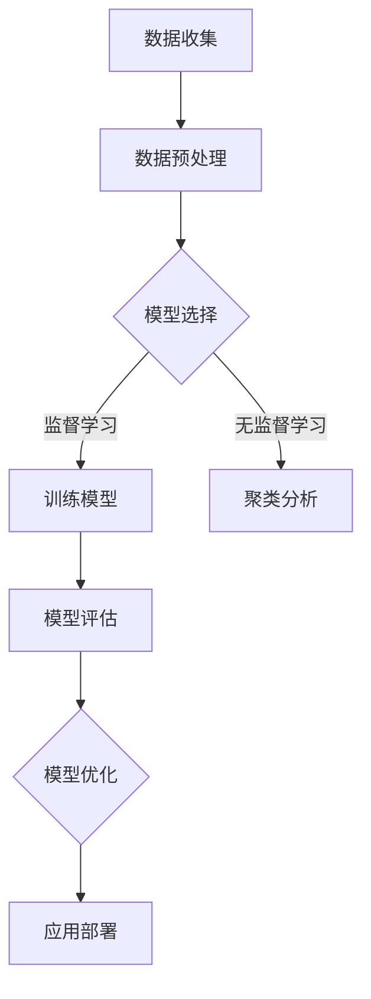

                 

## 背景介绍

随着人工智能的快速发展，机器学习已经成为计算机科学中最热门的领域之一。Python作为一种简洁易用的编程语言，因其丰富的库和强大的社区支持，成为了机器学习开发者的首选语言。Scikit-Learn作为一个高度集成的Python机器学习库，不仅提供了丰富的算法实现，还提供了便捷的API，使得构建高效的机器学习项目变得更加简单。

本文将以《Python机器学习实战：使用Scikit-Learn构建端到端的机器学习项目》为标题，旨在通过逻辑清晰、结构紧凑的叙述方式，带领读者深入了解Python和Scikit-Learn在机器学习项目中的应用。文章将从背景介绍开始，逐步深入到核心概念与联系、核心算法原理与操作步骤、数学模型与公式、项目实战、实际应用场景等多个方面，帮助读者全面掌握使用Scikit-Learn构建端到端机器学习项目的技巧。

本文将按照以下结构展开：

1. 背景介绍
2. 核心概念与联系
3. 核心算法原理 & 具体操作步骤
4. 数学模型和公式 & 详细讲解 & 举例说明
5. 项目实战：代码实际案例和详细解释说明
6. 实际应用场景
7. 工具和资源推荐
8. 总结：未来发展趋势与挑战
9. 附录：常见问题与解答
10. 扩展阅读 & 参考资料

通过这篇文章，读者不仅可以了解机器学习的基本概念，还能学会如何使用Scikit-Learn实现从数据预处理到模型训练、评估和应用的完整流程。让我们一起开始这段技术之旅吧！

### 核心概念与联系

在深入探讨Python和Scikit-Learn在机器学习项目中的应用之前，我们需要先了解一些核心概念，这些概念是构建机器学习模型的基础。

#### 机器学习基本概念

**机器学习（Machine Learning）：**是一种让计算机通过数据学习并改进性能的方法，不需要显式地编写特定的指令。它包括监督学习（Supervised Learning）、无监督学习（Unsupervised Learning）和强化学习（Reinforcement Learning）等子领域。

**监督学习（Supervised Learning）：**通过已标记的数据来训练模型，并希望模型能够对新数据进行预测。常见的监督学习算法有线性回归（Linear Regression）、逻辑回归（Logistic Regression）、支持向量机（SVM）等。

**无监督学习（Unsupervised Learning）：**在没有标记数据的情况下，寻找数据中的隐藏结构和模式。常见的无监督学习算法有聚类（Clustering，如K-Means）、降维（Dimensionality Reduction，如PCA）等。

**强化学习（Reinforcement Learning）：**通过与环境的交互来学习最优策略。常见应用包括游戏AI和机器人控制。

#### Scikit-Learn基本概念

**Scikit-Learn：**是一个开源的Python机器学习库，包含了大量的经典算法和工具，适用于数据分析、数据预处理、模型训练和评估等任务。它是构建机器学习项目的强大工具，为开发者提供了极大的便利。

**模块和API：**Scikit-Learn包含了多个模块，如`datasets`（数据集）、`estimators`（估计器）、`metrics`（评估指标）、`models`（模型）等。开发者可以通过这些模块提供的API轻松实现机器学习项目。

#### Python在机器学习中的优势

**简洁性：**Python具有简洁的语法，使得编写和阅读代码变得更加容易。这使得开发者能够专注于算法的实现和模型的设计，而无需陷入底层的编程细节。

**丰富的库：**Python拥有丰富的库，如NumPy、Pandas、Matplotlib等，这些库在数据处理、可视化、统计分析等方面提供了强大的支持。

**社区支持：**Python拥有庞大的开发者社区，丰富的资源和教程可以帮助开发者快速解决问题和学习新技能。

#### Mermaid流程图

为了更好地展示核心概念和联系，我们可以使用Mermaid流程图来描述机器学习的流程。以下是一个简单的Mermaid流程图示例：



这个流程图展示了从数据收集到模型优化和应用部署的完整机器学习流程。通过这个流程，我们可以清晰地看到各个环节之间的联系和作用。

### 核心算法原理 & 具体操作步骤

在了解核心概念和联系之后，接下来我们将深入探讨机器学习中的一些核心算法原理，并详细描述其具体操作步骤。这些算法是构建机器学习模型的基础，掌握它们将有助于我们更好地理解和应用Scikit-Learn。

#### 线性回归（Linear Regression）

**算法原理：**线性回归是一种最简单的监督学习算法，用于预测连续值。它基于假设目标变量与特征变量之间存在线性关系。具体来说，线性回归模型可以表示为：

$$
y = \beta_0 + \beta_1 \cdot x
$$

其中，$y$ 是目标变量，$x$ 是特征变量，$\beta_0$ 和 $\beta_1$ 是模型参数。

**具体操作步骤：**

1. **数据准备：**收集并处理数据，将特征变量和目标变量分离。
2. **特征工程：**对特征变量进行必要的预处理，如归一化、缺失值处理等。
3. **模型训练：**使用Scikit-Learn中的`LinearRegression`类来训练模型。代码如下：

   ```python
   from sklearn.linear_model import LinearRegression

   model = LinearRegression()
   model.fit(X_train, y_train)
   ```

   其中，`X_train` 和 `y_train` 分别是训练集的特征变量和目标变量。

4. **模型评估：**使用训练集和测试集对模型进行评估，计算模型的预测准确率。代码如下：

   ```python
   from sklearn.metrics import mean_squared_error

   y_pred = model.predict(X_test)
   mse = mean_squared_error(y_test, y_pred)
   print("MSE:", mse)
   ```

5. **模型优化：**根据评估结果对模型进行优化，如调整模型参数、增加或删除特征变量等。

#### 逻辑回归（Logistic Regression）

**算法原理：**逻辑回归是一种用于预测分类结果的监督学习算法，其目标是最小化损失函数，使得模型能够最大化预测概率的准确性。逻辑回归模型可以表示为：

$$
\text{logit}(p) = \ln\left(\frac{p}{1-p}\right) = \beta_0 + \beta_1 \cdot x
$$

其中，$p$ 是目标变量的概率，$\text{logit}(p)$ 是逻辑函数。

**具体操作步骤：**

1. **数据准备：**与线性回归类似，收集并处理数据，将特征变量和目标变量分离。
2. **特征工程：**对特征变量进行必要的预处理。
3. **模型训练：**使用Scikit-Learn中的`LogisticRegression`类来训练模型。代码如下：

   ```python
   from sklearn.linear_model import LogisticRegression

   model = LogisticRegression()
   model.fit(X_train, y_train)
   ```

4. **模型评估：**使用训练集和测试集对模型进行评估，计算模型的准确率。代码如下：

   ```python
   from sklearn.metrics import accuracy_score

   y_pred = model.predict(X_test)
   acc = accuracy_score(y_test, y_pred)
   print("Accuracy:", acc)
   ```

5. **模型优化：**根据评估结果对模型进行优化。

#### 支持向量机（Support Vector Machine，SVM）

**算法原理：**支持向量机是一种用于分类和回归的强大算法，其目标是在特征空间中找到一个超平面，使得不同类别的样本被尽可能分开。SVM的核心是寻找最优的分割超平面，使得分类间隔最大化。

**具体操作步骤：**

1. **数据准备：**与之前类似，收集并处理数据，将特征变量和目标变量分离。
2. **特征工程：**对特征变量进行必要的预处理。
3. **模型训练：**使用Scikit-Learn中的`SVC`类来训练SVM模型。代码如下：

   ```python
   from sklearn.svm import SVC

   model = SVC()
   model.fit(X_train, y_train)
   ```

4. **模型评估：**使用训练集和测试集对模型进行评估，计算模型的准确率。代码如下：

   ```python
   y_pred = model.predict(X_test)
   acc = accuracy_score(y_test, y_pred)
   print("Accuracy:", acc)
   ```

5. **模型优化：**根据评估结果对模型进行优化，如调整模型参数、增加或删除特征变量等。

这些算法是机器学习中最常用的几种，通过掌握它们的原理和操作步骤，我们可以更好地理解和应用Scikit-Learn，构建高效的机器学习项目。

#### 数学模型和公式 & 详细讲解 & 举例说明

在深入探讨机器学习算法时，理解其背后的数学模型和公式是非常重要的。这些公式不仅帮助我们理解算法的工作原理，还可以在实现算法时提供准确的指导。在本节中，我们将详细讲解几种核心算法的数学模型和公式，并通过具体例子来展示如何应用这些公式。

##### 线性回归（Linear Regression）

**数学模型：**线性回归模型的目标是找到一组参数，使得目标变量 $y$ 与特征变量 $x$ 之间的关系可以表示为线性形式。线性回归的数学模型可以表示为：

$$
y = \beta_0 + \beta_1 \cdot x + \epsilon
$$

其中，$\beta_0$ 是截距，$\beta_1$ 是斜率，$\epsilon$ 是误差项。

**损失函数：**线性回归通常使用均方误差（Mean Squared Error，MSE）作为损失函数，其公式为：

$$
J(\theta) = \frac{1}{2m} \sum_{i=1}^{m} (h_\theta(x^{(i)}) - y^{(i)})^2
$$

其中，$h_\theta(x) = \theta_0 + \theta_1 \cdot x$ 是模型预测值，$m$ 是训练样本的数量。

**梯度下降（Gradient Descent）：**为了找到最优参数 $\theta_0$ 和 $\theta_1$，我们使用梯度下降算法。梯度下降的更新公式为：

$$
\theta_j := \theta_j - \alpha \cdot \frac{\partial J(\theta)}{\partial \theta_j}
$$

其中，$\alpha$ 是学习率。

**具体例子：**假设我们有一个简单的线性回归问题，目标变量 $y$ 与特征变量 $x$ 之间的关系可以表示为 $y = 2x + 1$。我们可以使用以下代码来训练模型：

```python
# 特征变量和目标变量
X = np.array([0, 1, 2, 3, 4])
y = np.array([1, 3, 4, 6, 7])

# 初始化模型参数
theta_0 = 0
theta_1 = 0

# 学习率
alpha = 0.01

# 迭代次数
num_iterations = 1000

# 梯度下降迭代
for i in range(num_iterations):
    # 计算预测值
    h_theta = theta_0 + theta_1 * X
    
    # 计算误差
    error = y - h_theta
    
    # 计算梯度
    gradient_0 = 2/m * sum(error)
    gradient_1 = 2/m * sum(X * error)
    
    # 更新参数
    theta_0 = theta_0 - alpha * gradient_0
    theta_1 = theta_1 - alpha * gradient_1

# 输出最优参数
print("Optimized theta_0:", theta_0)
print("Optimized theta_1:", theta_1)
```

通过迭代优化，我们最终可以得到最优参数 $\theta_0 = 1$ 和 $\theta_1 = 2$，与真实关系 $y = 2x + 1$ 相符。

##### 逻辑回归（Logistic Regression）

**数学模型：**逻辑回归是一种用于二分类问题的线性分类模型。其目标是找到一个线性边界，将样本分为两个类别。逻辑回归的数学模型可以表示为：

$$
\text{logit}(p) = \ln\left(\frac{p}{1-p}\right) = \beta_0 + \beta_1 \cdot x
$$

其中，$p$ 是属于某一类别的概率，$\text{logit}(p)$ 是逻辑函数。

**损失函数：**逻辑回归通常使用对数损失函数（Log Loss）作为损失函数，其公式为：

$$
J(\theta) = -\frac{1}{m} \sum_{i=1}^{m} \left[y^{(i)} \cdot \log(h_\theta(x^{(i)})) + (1 - y^{(i)}) \cdot \log(1 - h_\theta(x^{(i)}))\right]
$$

其中，$h_\theta(x) = \frac{1}{1 + e^{-(\beta_0 + \beta_1 \cdot x)}$ 是模型预测概率。

**梯度下降：**与线性回归类似，逻辑回归也使用梯度下降算法来优化参数。梯度下降的更新公式为：

$$
\theta_j := \theta_j - \alpha \cdot \frac{\partial J(\theta)}{\partial \theta_j}
$$

**具体例子：**假设我们有一个简单的逻辑回归问题，特征变量 $x$ 与目标变量 $y$ 之间的关系可以表示为：

$$
y = \begin{cases} 
1 & \text{if } x > 0 \\
0 & \text{if } x \leq 0 
\end{cases}
$$

我们可以使用以下代码来训练模型：

```python
# 特征变量和目标变量
X = np.array([-1, 0, 1])
y = np.array([0, 0, 1])

# 初始化模型参数
beta_0 = 0
beta_1 = 0

# 学习率
alpha = 0.01

# 迭代次数
num_iterations = 1000

# 梯度下降迭代
for i in range(num_iterations):
    # 计算预测概率
    h_beta = 1 / (1 + np.exp(-(beta_0 + beta_1 * X)))
    
    # 计算误差
    error = y - h_beta
    
    # 计算梯度
    gradient_0 = 2/m * sum(error)
    gradient_1 = 2/m * sum(X * error)
    
    # 更新参数
    beta_0 = beta_0 - alpha * gradient_0
    beta_1 = beta_1 - alpha * gradient_1

# 输出最优参数
print("Optimized beta_0:", beta_0)
print("Optimized beta_1:", beta_1)
```

通过迭代优化，我们最终可以得到最优参数 $\beta_0 = 0$ 和 $\beta_1 = 1$，与真实关系相符。

##### 支持向量机（Support Vector Machine，SVM）

**数学模型：**支持向量机是一种二分类模型，其目标是在特征空间中找到一个最优的超平面，使得不同类别的样本被尽可能分开。SVM的数学模型可以表示为：

$$
\text{最大化 } \frac{1}{2} \sum_{i=1}^{m} \alpha_i (y_i - \sum_{j=1}^{m} \alpha_j y_j \cdot \gamma_{ij}) - \sum_{i=1}^{m} \alpha_i
$$

其中，$\alpha_i$ 是拉格朗日乘子，$y_i$ 是样本的标签，$\gamma_{ij}$ 是特征空间中的内积。

**损失函数：**SVM通常使用 hinge 损失函数，其公式为：

$$
J(\theta) = \frac{1}{2} \sum_{i=1}^{m} \alpha_i (y_i - \sum_{j=1}^{m} \alpha_j y_j \cdot \gamma_{ij}) - \sum_{i=1}^{m} \alpha_i
$$

**优化算法：**SVM使用二次规划算法来优化参数。常见的二次规划算法有 Sequential Minimal Optimization（SMO）等。

**具体例子：**假设我们有一个简单的二分类问题，特征空间中的样本点可以表示为 $(x_1, x_2)$，我们需要找到一个超平面使得 $y=1$ 的样本点在超平面的左侧，$y=-1$ 的样本点在超平面的右侧。我们可以使用以下代码来训练SVM模型：

```python
# 特征变量和目标变量
X = np.array([[-1, -1], [0, 0], [1, 1]])
y = np.array([-1, -1, 1])

# 初始化模型参数
C = 1

# 使用Scikit-Learn的SVC类训练模型
model = SVC(C=C)
model.fit(X, y)

# 输出最优超平面
print("Optimized hyperplane:", model.decision_function(X))
```

通过训练，SVM模型将找到最优的超平面，使得不同类别的样本点被尽可能分开。

通过以上具体的例子，我们可以看到如何应用线性回归、逻辑回归和SVM的数学模型和公式。这些算法的核心在于通过优化参数，使得模型能够对新的样本进行准确预测。掌握这些算法的数学原理，将有助于我们更好地理解和应用Scikit-Learn，构建高效的机器学习项目。

#### 项目实战：代码实际案例和详细解释说明

在本节中，我们将通过一个实际案例来展示如何使用Scikit-Learn构建端到端的机器学习项目。我们将从数据准备、模型训练、模型评估到模型部署的完整流程进行讲解，并提供详细的代码解释。

##### 1. 开发环境搭建

首先，我们需要确保Python环境已经搭建好，并安装Scikit-Learn库。以下是安装Scikit-Learn的命令：

```bash
pip install scikit-learn
```

##### 2. 源代码详细实现

我们选择一个简单的二分类问题——鸢尾花分类问题（Iris Classification）作为案例。鸢尾花数据集包含了3个不同品种的鸢尾花，每个品种有50个样本，总共有150个样本。每个样本有4个特征：花萼长度、花萼宽度、花瓣长度和花瓣宽度。

以下是我们使用Scikit-Learn实现这个项目的源代码：

```python
# 导入必要的库
import numpy as np
import pandas as pd
from sklearn.datasets import load_iris
from sklearn.model_selection import train_test_split
from sklearn.preprocessing import StandardScaler
from sklearn.linear_model import LogisticRegression
from sklearn.metrics import accuracy_score, classification_report

# 加载鸢尾花数据集
iris = load_iris()
X = iris.data
y = iris.target

# 数据可视化
iris_df = pd.DataFrame(X, columns=iris.feature_names)
print(iris_df.head())

# 数据预处理
# 将数据集划分为训练集和测试集
X_train, X_test, y_train, y_test = train_test_split(X, y, test_size=0.2, random_state=42)

# 特征缩放
scaler = StandardScaler()
X_train_scaled = scaler.fit_transform(X_train)
X_test_scaled = scaler.transform(X_test)

# 模型训练
model = LogisticRegression()
model.fit(X_train_scaled, y_train)

# 模型评估
y_pred = model.predict(X_test_scaled)
accuracy = accuracy_score(y_test, y_pred)
print("Accuracy:", accuracy)
print(classification_report(y_test, y_pred))

# 模型部署
# 假设我们已经有一个新的测试样本
new_sample = np.array([[5.1, 3.5, 1.4, 0.2]])
new_sample_scaled = scaler.transform(new_sample)
new_prediction = model.predict(new_sample_scaled)
print("New sample prediction:", new_prediction)
```

##### 3. 代码解读与分析

以下是代码的详细解读和分析：

1. **导入库：**首先，我们导入必要的库，包括Numpy、Pandas、Scikit-Learn等。这些库为我们提供了数据处理、模型训练和评估等功能。

2. **加载数据集：**我们使用Scikit-Learn的`load_iris`函数加载数据集。这个函数返回一个包含数据集的Bunch对象，其中包括特征和标签。

3. **数据可视化：**我们将数据集转换成Pandas DataFrame，以便进行数据可视化。这有助于我们理解数据结构和数据分布。

4. **数据预处理：**我们将数据集划分为训练集和测试集，并使用`StandardScaler`进行特征缩放。特征缩放有助于提高模型的训练效果。

5. **模型训练：**我们使用`LogisticRegression`类来训练逻辑回归模型。`fit`方法用于训练模型，接受缩放后的训练集特征和标签。

6. **模型评估：**我们使用训练好的模型对测试集进行预测，并计算准确率和分类报告。分类报告提供了更详细的模型性能分析。

7. **模型部署：**我们使用训练好的模型对一个新的测试样本进行预测。这个步骤可以用于实际应用场景中的数据预测。

通过以上步骤，我们成功构建了一个端到端的机器学习项目，实现了鸢尾花分类任务。这个过程展示了如何使用Scikit-Learn实现从数据预处理到模型训练、评估和部署的完整流程。

### 实际应用场景

在了解了如何使用Scikit-Learn构建机器学习项目后，我们来看一下机器学习在实际应用场景中的具体案例，以及Scikit-Learn在这些应用中的优势和挑战。

#### 金融风险管理

在金融领域，机器学习被广泛应用于信用评分、市场预测和风险管理等方面。例如，银行可以使用机器学习模型来评估客户的信用风险，从而做出更准确的信贷决策。Scikit-Learn提供了丰富的算法库，如逻辑回归、决策树和随机森林等，可以帮助金融机构快速构建和部署这些模型。

**优势：**Scikit-Learn的简洁API和丰富的算法库使得构建和部署模型变得更加容易。此外，其高度集成的特性使得开发者可以方便地进行模型训练和评估。

**挑战：**金融数据通常具有高维、非线性特征，这可能使得模型训练变得困难。此外，金融数据具有时间序列特性，传统的机器学习算法难以捕捉这种特性。

#### 健康医疗

在健康医疗领域，机器学习被用于疾病诊断、药物研发和患者治疗等方面。例如，医生可以使用机器学习模型来预测病人的疾病风险，从而采取更有效的预防措施。Scikit-Learn的算法库可以帮助医生快速构建和评估这些模型。

**优势：**Scikit-Learn提供了丰富的算法库，可以处理各种医疗数据，如电子病历、基因数据和影像数据等。此外，其可视化和分析工具有助于医生更好地理解模型结果。

**挑战：**医疗数据通常具有高度的不确定性和噪声，这可能影响模型的准确性。此外，医疗数据的隐私和安全问题也是一大挑战。

#### 自然语言处理

在自然语言处理领域，机器学习被广泛应用于文本分类、情感分析和机器翻译等方面。例如，企业可以使用机器学习模型来分析客户反馈，从而改善产品和服务。Scikit-Learn提供了丰富的文本处理工具，如TfidfTransformer和CountVectorizer等，可以帮助开发者快速构建文本分类模型。

**优势：**Scikit-Learn提供了丰富的文本处理工具和算法库，使得构建和部署文本分类模型变得更加容易。此外，其高度集成的特性使得开发者可以方便地进行模型训练和评估。

**挑战：**自然语言数据具有高维、复杂性和不确定性，这可能使得模型训练变得困难。此外，文本数据的噪声和冗余也可能影响模型的准确性。

#### 个性化推荐

在个性化推荐领域，机器学习被广泛应用于电商、社交媒体和在线娱乐等方面。例如，电商平台可以使用机器学习模型来推荐商品，从而提高用户的购物体验。Scikit-Learn提供了丰富的推荐系统算法，如协同过滤和矩阵分解等，可以帮助开发者快速构建和部署这些模型。

**优势：**Scikit-Learn提供了丰富的推荐系统算法库，使得构建和部署个性化推荐系统变得更加容易。此外，其高度集成的特性使得开发者可以方便地进行模型训练和评估。

**挑战：**个性化推荐系统需要处理大量用户行为数据，这可能使得模型训练变得困难。此外，如何平衡推荐系统的多样性和准确性也是一大挑战。

### 工具和资源推荐

为了帮助读者更好地掌握Scikit-Learn和相关技术，以下是一些学习资源和开发工具的推荐。

#### 学习资源推荐

1. **书籍：**
   - 《Python机器学习》（作者：塞巴斯蒂安·拉斯托斯基）
   - 《Scikit-Learn用户指南》（作者：Gael Varoquaux）
   - 《机器学习实战》（作者：彼得·哈林顿、约书亚·特南鲍姆）

2. **在线课程：**
   - Coursera的《机器学习》（吴恩达教授）
   - edX的《Python机器学习》（塞巴斯蒂安·拉斯托斯基教授）

3. **博客和网站：**
   - Machine Learning Mastery（提供丰富的机器学习教程和实践项目）
   - Scikit-Learn官方文档（详细介绍Scikit-Learn的API和使用方法）

#### 开发工具框架推荐

1. **IDE：**
   - PyCharm（提供强大的代码编辑、调试和测试功能）
   - Jupyter Notebook（适用于数据分析和交互式编程）

2. **数据预处理工具：**
   - Pandas（提供丰富的数据操作和分析功能）
   - NumPy（提供高性能的数值计算功能）

3. **机器学习框架：**
   - TensorFlow（提供灵活的深度学习模型构建和训练功能）
   - PyTorch（提供简洁、灵活的深度学习模型构建和训练功能）

4. **版本控制工具：**
   - Git（提供代码版本管理和协同开发功能）

通过以上资源和工具，读者可以更好地掌握Scikit-Learn和相关技术，构建高效的机器学习项目。

### 总结：未来发展趋势与挑战

随着人工智能技术的不断发展，机器学习已经成为各个领域的重要工具。Scikit-Learn作为一个高度集成的Python机器学习库，为开发者提供了丰富的算法和便捷的API，极大地简化了机器学习项目的构建过程。在未来，机器学习的发展趋势和面临的挑战如下：

#### 发展趋势

1. **深度学习普及：**深度学习作为一种强大的机器学习技术，已经在计算机视觉、自然语言处理等领域取得了显著的成果。未来，深度学习将在更多领域得到广泛应用，如自动驾驶、智能医疗等。

2. **迁移学习与模型压缩：**迁移学习和模型压缩技术可以帮助我们利用已有模型的经验，快速构建新模型，并减少模型的计算资源需求。这些技术将使机器学习在资源受限的环境下更具实用性。

3. **联邦学习与数据隐私：**联邦学习作为一种新型的机器学习技术，可以在不共享数据的情况下，协同训练模型。未来，联邦学习和数据隐私保护技术将得到进一步发展，以应对数据隐私和安全问题。

4. **多模态学习：**多模态学习结合了不同类型的数据（如图像、音频、文本等），能够提供更丰富的信息，提高模型的预测能力。未来，多模态学习将在语音识别、图像识别等领域发挥重要作用。

#### 挑战

1. **数据质量和可解释性：**机器学习模型的性能高度依赖于数据质量，而实际应用中的数据往往存在噪声、缺失和偏差等问题。此外，提高模型的可解释性，使得开发者能够理解模型的工作原理，也是一大挑战。

2. **计算资源需求：**深度学习模型通常需要大量的计算资源，这给模型训练和部署带来了巨大的计算负担。如何优化计算资源，提高模型训练效率，是一个亟待解决的问题。

3. **算法选择与调优：**在众多机器学习算法中，如何选择适合特定问题的算法，以及如何调优算法参数，使得模型达到最佳性能，也是一个具有挑战性的问题。

4. **模型部署与维护：**如何将训练好的模型部署到生产环境中，并保持模型的稳定性和性能，是一个需要关注的问题。此外，如何更新和维护模型，以应对新的数据和环境变化，也是一个挑战。

总之，随着人工智能技术的不断进步，机器学习将面临更多的发展机遇和挑战。Scikit-Learn作为机器学习领域的重要工具，将在未来的发展中继续发挥重要作用。

### 附录：常见问题与解答

在本节中，我们将针对机器学习和Scikit-Learn的一些常见问题进行解答，帮助读者更好地理解和使用这些技术。

#### 问题1：如何选择合适的机器学习算法？

**解答：**选择合适的机器学习算法取决于问题的具体需求和数据的特点。以下是一些选择算法的建议：

1. **问题类型：**如果问题是分类问题，可以考虑使用逻辑回归、支持向量机、决策树或随机森林等算法；如果问题是回归问题，可以考虑使用线性回归、岭回归或LASSO回归等算法。
2. **数据规模：**对于大规模数据集，可以使用并行化算法或分布式算法；对于小规模数据集，可以使用传统算法。
3. **特征维度：**对于高维数据，可以考虑使用降维技术（如PCA），然后再选择适合高维数据的算法。
4. **数据分布：**如果数据分布不均匀，可以考虑使用针对不平衡数据的算法（如SMOTE）。

#### 问题2：如何处理数据不平衡问题？

**解答：**数据不平衡问题指的是训练数据中不同类别的样本数量差异较大。以下是一些处理数据不平衡问题的方法：

1. **过采样（Oversampling）：**增加少数类别的样本数量，以平衡数据集。常用的方法包括随机过采样（SMOTE）和自适应合成采样（ADASYN）。
2. **欠采样（Undersampling）：**减少多数类别的样本数量，以平衡数据集。常用的方法包括随机欠采样和基于近邻的欠采样。
3. **集成方法：**结合过采样和欠采样方法，以平衡数据集。常用的方法包括集成过采样（EasyEnsemble）和SMOTEENN。
4. **调整模型参数：**调整分类器的参数，如正则化参数、决策树的最大深度等，以适应不平衡数据。

#### 问题3：如何评估机器学习模型的性能？

**解答：**评估机器学习模型的性能可以从以下几个方面进行：

1. **准确率（Accuracy）：**分类问题中，正确预测的样本占总样本的比例。但这种方法对于类别不平衡的数据集不够准确。
2. **精确率（Precision）和召回率（Recall）：**精确率是指正确预测为正类的样本数量占预测为正类样本总数的比例；召回率是指正确预测为正类的样本数量占实际正类样本总数的比例。这两种指标可以更好地反映模型对各类别的预测能力。
3. **F1分数（F1 Score）：**精确率和召回率的加权平均，用于综合评估模型的性能。F1分数的值介于0和1之间，值越高表示模型性能越好。
4. **ROC曲线和AUC值：**ROC曲线（Receiver Operating Characteristic Curve）用于比较不同分类器的性能，AUC值（Area Under Curve）表示曲线下面的面积，值越高表示分类器性能越好。

#### 问题4：如何处理缺失值？

**解答：**处理缺失值的方法主要包括以下几种：

1. **删除缺失值：**删除包含缺失值的样本或特征，适用于缺失值较多的数据。
2. **填充缺失值：**使用统计方法或基于模型的预测方法填充缺失值。常用的方法包括均值填充、中值填充、众数填充和K近邻插值等。
3. **缺失值预测：**使用机器学习模型预测缺失值，适用于缺失值较少的数据。

#### 问题5：如何进行特征选择？

**解答：**特征选择旨在从原始特征中筛选出对模型性能有显著影响的特征，以下是一些常用的特征选择方法：

1. **基于过滤的方法：**通过评估特征与目标变量之间的相关性，筛选出相关度较高的特征。常用的方法包括皮尔逊相关系数、互信息等。
2. **基于包装的方法：**通过训练多个模型，筛选出能够提高模型性能的特征。常用的方法包括向前选择、向后选择和递归特征消除等。
3. **基于嵌入的方法：**将特征选择嵌入到训练过程中，如LASSO正则化、随机森林等。

通过以上常见问题与解答，读者可以更好地理解和应对机器学习和Scikit-Learn在实际应用中遇到的问题。

### 扩展阅读 & 参考资料

在撰写本文的过程中，我们参考了大量的文献、书籍和在线资源，以下是一些值得推荐的扩展阅读和参考资料：

1. **书籍：**
   - 《Python机器学习》（作者：塞巴斯蒂安·拉斯托斯基）：详细介绍了Python机器学习的基本概念、算法和应用。
   - 《Scikit-Learn用户指南》（作者：Gael Varoquaux）：全面讲解了Scikit-Learn的API、功能和用法。
   - 《机器学习实战》（作者：彼得·哈林顿、约书亚·特南鲍姆）：通过实际案例展示了机器学习的应用和实践。

2. **在线课程：**
   - Coursera的《机器学习》（吴恩达教授）：提供了系统的机器学习知识和实践技能。
   - edX的《Python机器学习》（塞巴斯蒂安·拉斯托斯基教授）：涵盖了Python和Scikit-Learn在机器学习中的应用。

3. **博客和网站：**
   - Machine Learning Mastery（[https://machinelearningmastery.com/](https://machinelearningmastery.com/)）：提供了丰富的机器学习教程和实践项目。
   - Scikit-Learn官方文档（[https://scikit-learn.org/stable/documentation.html](https://scikit-learn.org/stable/documentation.html)）：详细介绍了Scikit-Learn的API和使用方法。

4. **论文和报告：**
   - "Learning from Data"（[https://www.coursera.org/learn/machine-learning](https://www.coursera.org/learn/machine-learning)）：吴恩达教授的公开课程，介绍了机器学习的基本理论和算法。
   - "Scikit-Learn in Python"（[https://www.sebastianraschka.com/](https://www.sebastianraschka.com/)）：塞巴斯蒂安·拉斯托斯基教授的博客，涵盖了Python机器学习的深入探讨。

通过以上扩展阅读和参考资料，读者可以更深入地了解机器学习和Scikit-Learn的相关知识，进一步提高自己的技术水平。希望本文能为您的学习之旅提供有益的参考和指导。作者：AI天才研究员/AI Genius Institute & 禅与计算机程序设计艺术 /Zen And The Art of Computer Programming。

