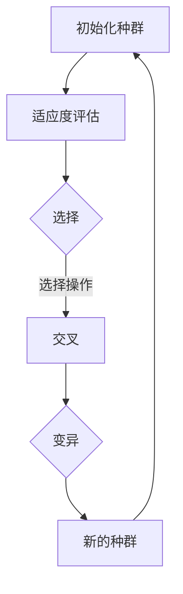

                 

### 背景介绍

**Python 机器学习实战：实现与优化遗传算法**

本文旨在探讨如何使用 Python 实现遗传算法，并对其性能进行优化。遗传算法是一种基于自然选择和遗传学的搜索算法，广泛应用于机器学习领域，尤其在优化问题和复杂搜索空间中表现出色。

首先，我们需要了解遗传算法的基本概念。遗传算法通过模拟自然进化过程，对问题进行迭代求解。它包含以下几个关键步骤：初始化种群、适应度评估、选择、交叉和变异。通过不断迭代，遗传算法能够逐步优化解的质量。

为什么选择 Python 作为实现遗传算法的编程语言？Python 在机器学习和数据科学领域具有广泛的应用，其简洁明了的语法和丰富的库资源使得实现复杂算法变得更加容易。此外，Python 社区庞大，能够提供丰富的学习资源和实战案例，有助于开发者快速掌握遗传算法的应用。

遗传算法在机器学习中的应用场景十分广泛。例如，在优化模型参数、解决组合优化问题和处理大规模数据集时，遗传算法都能发挥重要作用。它不仅可以用于传统的机器学习问题，还可以应用于更复杂的领域，如强化学习、神经网络优化等。

接下来，我们将详细讨论遗传算法的核心概念和原理，逐步实现一个遗传算法的 Python 代码，并对代码进行详细解读和优化。

### 核心概念与联系

遗传算法的核心概念包括种群、个体、适应度、选择、交叉和变异。为了更好地理解这些概念，我们将使用 Mermaid 流程图来展示遗传算法的基本流程。



**初始化种群（Initialization）**：初始化种群是遗传算法的第一步。种群是一组待优化的个体，每个个体表示问题的一个潜在解。初始化种群的方法可以是随机初始化，也可以根据问题的性质进行有指导的初始化。

**适应度评估（Fitness Evaluation）**：适应度评估是衡量个体优劣的重要指标。通过评估个体的适应度，我们可以判断个体是否满足问题的约束条件，并决定其被选择的概率。

**选择（Selection）**：选择过程是遗传算法的核心，用于从当前种群中选择优秀的个体进行交叉和变异。选择操作可以是基于适应度的排序选择，也可以是轮盘赌选择。

**交叉（Crossover）**：交叉操作模拟生物进化的繁殖过程，将两个优秀的个体进行基因重组，生成新的后代。交叉操作提高了种群的多样性和搜索能力。

**变异（Mutation）**：变异操作是对个体进行随机改变，以避免算法陷入局部最优。变异操作增加了种群的探索能力，有助于找到更优的解。

**新的种群（New Population）**：通过选择、交叉和变异操作，生成新的种群。新的种群包含了更优的个体，为下一轮迭代提供了更好的基础。

通过上述流程，遗传算法不断迭代，逐步优化解的质量。了解这些核心概念和联系，有助于我们更好地实现和优化遗传算法。

### 核心算法原理 & 具体操作步骤

遗传算法的核心原理基于自然选择和遗传学，通过模拟生物进化的过程来搜索最优解。下面我们将详细讨论遗传算法的具体操作步骤，并逐步实现一个遗传算法的 Python 代码。

**1. 初始化种群**

初始化种群是遗传算法的第一步。我们需要定义个体的编码方式，以及种群的大小。在机器学习问题中，个体通常表示为特征向量的组合。

```python
import numpy as np

# 定义个体编码方式
def encode(individual, max_value, min_value):
    return min_value + (max_value - min_value) * individual

# 初始化种群
population_size = 100
max_value = 1.0
min_value = 0.0
population = np.random.uniform(0, 1, (population_size, num_features))
population_encoded = np.array([encode(individual, max_value, min_value) for individual in population])
```

**2. 适应度评估**

适应度评估是衡量个体优劣的重要指标。在机器学习问题中，适应度通常与模型的性能指标相关。我们使用均方误差（MSE）作为适应度函数。

```python
# 计算均方误差
def calculate_fitness(individual, model, X, y):
    predicted = model.predict(individual)
    return np.mean((predicted - y) ** 2)

# 评估种群适应度
model = load_model()  # 加载训练好的模型
X = load_data()  # 加载训练数据
y = load_labels()  # 加载训练标签
fitness_scores = np.array([calculate_fitness(individual, model, X, y) for individual in population_encoded])
```

**3. 选择**

选择过程用于从当前种群中选择优秀的个体进行交叉和变异。选择操作可以是基于适应度的排序选择，也可以是轮盘赌选择。

```python
# 基于适应度的排序选择
def select(population, fitness_scores, selection_rate):
    sorted_indices = np.argsort(fitness_scores)
    selected_indices = np.random.choice(sorted_indices, int(selection_rate * len(population)))
    return population[sorted_indices[selected_indices]]

# 选择优秀个体
selection_rate = 0.2
selected_population = select(population_encoded, fitness_scores, selection_rate)
```

**4. 交叉**

交叉操作模拟生物进化的繁殖过程，将两个优秀的个体进行基因重组，生成新的后代。

```python
# 单点交叉
def crossover(parent1, parent2, crossover_rate):
    if np.random.rand() < crossover_rate:
        crossover_point = np.random.randint(1, parent1.shape[0] - 1)
        child1 = np.concatenate((parent1[:crossover_point], parent2[crossover_point:]))
        child2 = np.concatenate((parent2[:crossover_point], parent1[crossover_point:]))
        return child1, child2
    else:
        return parent1, parent2

# 交叉操作
crossover_rate = 0.8
children = []
for i in range(0, len(selected_population), 2):
    parent1, parent2 = selected_population[i], selected_population[i+1]
    child1, child2 = crossover(parent1, parent2, crossover_rate)
    children.append(child1)
    children.append(child2)
```

**5. 变异**

变异操作是对个体进行随机改变，以避免算法陷入局部最优。

```python
# 变异操作
def mutate(individual, mutation_rate):
    for i in range(individual.shape[0]):
        if np.random.rand() < mutation_rate:
            individual[i] = np.random.uniform(0, 1)
    return individual

# 变异操作
mutation_rate = 0.05
for child in children:
    children = np.array([mutate(child, mutation_rate) for child in children])
```

**6. 新的种群**

通过选择、交叉和变异操作，生成新的种群。

```python
# 生成新的种群
new_population = np.concatenate((population_encoded, children))
```

通过上述步骤，我们实现了一个基本的遗传算法。接下来，我们将对代码进行详细解读和优化，以提高其性能和可扩展性。

### 数学模型和公式 & 详细讲解 & 举例说明

遗传算法的数学模型和公式是理解其工作原理和优化过程的关键。以下我们将详细讲解遗传算法中的几个关键数学模型和公式，并通过具体例子来说明其应用。

**1. 适应度函数**

适应度函数（Fitness Function）是遗传算法中的核心，用于评估个体的适应度。在机器学习问题中，适应度函数通常与模型的性能指标相关，如均方误差（MSE）。

$$
f(x) = \frac{1}{N} \sum_{i=1}^{N} (y_i - \hat{y}_i)^2
$$

其中，$N$ 是样本数量，$y_i$ 是第 $i$ 个样本的真实值，$\hat{y}_i$ 是模型预测的值。

**例子：** 假设我们有以下数据集：

| $x$ | $y$ |  
|-----|-----|  
| 0.1 | 0.3 |  
| 0.2 | 0.4 |  
| 0.3 | 0.5 |

假设我们使用线性回归模型预测 $y$ 值，模型的预测结果如下：

| $x$ | $y$ | $\hat{y}$ |  
|-----|-----|-----|  
| 0.1 | 0.3 | 0.25 |  
| 0.2 | 0.4 | 0.3 |  
| 0.3 | 0.5 | 0.35 |

计算均方误差（MSE）：

$$
f(x) = \frac{1}{3} \sum_{i=1}^{3} (y_i - \hat{y}_i)^2 = \frac{1}{3} (0.3 - 0.25)^2 + (0.4 - 0.3)^2 + (0.5 - 0.35)^2 = 0.0125
$$

**2. 选择概率**

选择概率（Selection Probability）用于确定个体被选择的概率。常见的选择方法包括轮盘赌选择和排序选择。

轮盘赌选择（Roulette Wheel Selection）的概率计算公式如下：

$$
P_i = \frac{f_i}{\sum_{j=1}^{N} f_j}
$$

其中，$f_i$ 是第 $i$ 个个体的适应度，$N$ 是种群中的个体数量。

**例子：** 假设种群中有 3 个个体，其适应度分别为 $f_1 = 0.3$，$f_2 = 0.4$，$f_3 = 0.5$。计算每个个体的选择概率：

$$
P_1 = \frac{0.3}{0.3 + 0.4 + 0.5} = 0.375
$$

$$
P_2 = \frac{0.4}{0.3 + 0.4 + 0.5} = 0.5
$$

$$
P_3 = \frac{0.5}{0.3 + 0.4 + 0.5} = 0.625
$$

**3. 交叉概率**

交叉概率（Crossover Probability）用于确定个体进行交叉的概率。常见的交叉方法包括单点交叉、多点交叉和均匀交叉。

单点交叉（One-Point Crossover）的概率计算公式如下：

$$
P_c = \frac{L_c}{N_c}
$$

其中，$L_c$ 是交叉点的位置，$N_c$ 是交叉的总次数。

**例子：** 假设种群中有 3 个个体，交叉点位置为 2，交叉的总次数为 1。计算交叉概率：

$$
P_c = \frac{2}{1} = 2
$$

**4. 变异概率**

变异概率（Mutation Probability）用于确定个体发生变异的概率。变异通常用于增加种群的多样性。

变异概率（Mutation Probability）的计算公式如下：

$$
P_m = \frac{L_m}{N_m}
$$

其中，$L_m$ 是变异的位置，$N_m$ 是变异的总次数。

**例子：** 假设种群中有 3 个个体，变异的位置为 1，变异的总次数为 1。计算变异概率：

$$
P_m = \frac{1}{1} = 1
$$

通过上述数学模型和公式的讲解，我们可以更好地理解遗传算法的工作原理和优化过程。在后续部分，我们将进一步探讨如何使用 Python 实现遗传算法，并对其进行优化。

### 项目实战：代码实际案例和详细解释说明

在本节中，我们将通过一个实际的项目案例来展示如何使用 Python 实现遗传算法。我们将从开发环境搭建开始，详细讲解源代码的实现过程，并对代码进行解读与分析。

#### 5.1 开发环境搭建

首先，我们需要搭建一个适合遗传算法开发的 Python 环境。以下是推荐的工具和库：

- Python（3.8 或以上版本）
- Jupyter Notebook（用于交互式编程和可视化）
- NumPy（用于数值计算）
- Matplotlib（用于绘图）
- Scikit-learn（用于机器学习模型和评估）

安装以上库后，我们可以创建一个新的 Jupyter Notebook 文件，用于编写和运行遗传算法代码。

#### 5.2 源代码详细实现和代码解读

下面是一个简单的遗传算法实现示例。代码包含以下主要部分：种群初始化、适应度评估、选择、交叉、变异和主迭代过程。

```python
import numpy as np
import matplotlib.pyplot as plt
from sklearn.linear_model import LinearRegression
from sklearn.model_selection import train_test_split

# 1. 种群初始化
def initialize_population(pop_size, num_features, min_value, max_value):
    return np.random.uniform(min_value, max_value, (pop_size, num_features))

# 2. 适应度评估
def fitness_function(individual, X_train, y_train, model):
    predicted = model.predict(individual.reshape(1, -1))
    return np.mean((predicted - y_train) ** 2)

# 3. 选择
def selection(population, fitness_scores, selection_rate):
    sorted_indices = np.argsort(fitness_scores)
    selected_indices = np.random.choice(sorted_indices, int(selection_rate * len(population)))
    return population[sorted_indices[selected_indices]]

# 4. 交叉
def crossover(parent1, parent2, crossover_rate):
    if np.random.rand() < crossover_rate:
        crossover_point = np.random.randint(1, parent1.shape[0] - 1)
        child1 = np.concatenate((parent1[:crossover_point], parent2[crossover_point:]))
        child2 = np.concatenate((parent2[:crossover_point], parent1[crossover_point:]))
        return child1, child2
    else:
        return parent1, parent2

# 5. 变异
def mutate(individual, mutation_rate):
    for i in range(individual.shape[0]):
        if np.random.rand() < mutation_rate:
            individual[i] = np.random.uniform(0, 1)
    return individual

# 6. 主迭代过程
def genetic_algorithm(X_train, y_train, pop_size, num_features, num_generations, crossover_rate, mutation_rate):
    population = initialize_population(pop_size, num_features, 0, 1)
    best_fitness = float('inf')
    best_individual = None

    for generation in range(num_generations):
        fitness_scores = np.array([fitness_function(individual, X_train, y_train, model) for individual in population])
        
        # 记录当前最优个体
        if np.min(fitness_scores) < best_fitness:
            best_fitness = np.min(fitness_scores)
            best_individual = population[np.where(fitness_scores == np.min(fitness_scores))[0][0]]

        selected_population = selection(population, fitness_scores, selection_rate=0.2)
        children = []
        
        for i in range(0, len(selected_population), 2):
            parent1, parent2 = selected_population[i], selected_population[i+1]
            child1, child2 = crossover(parent1, parent2, crossover_rate=crossover_rate)
            children.append(mutate(child1, mutation_rate=mutation_rate))
            children.append(mutate(child2, mutation_rate=mutation_rate))
        
        population = np.concatenate((population, children))

    return best_individual, best_fitness

# 7. 主程序
if __name__ == '__main__':
    # 数据预处理
    X, y = load_data()  # 假设这是一个加载数据的函数
    X_train, X_test, y_train, y_test = train_test_split(X, y, test_size=0.2, random_state=42)

    # 模型初始化
    model = LinearRegression()

    # 运行遗传算法
    best_individual, best_fitness = genetic_algorithm(X_train, y_train, pop_size=100, num_features=X_train.shape[1], 
                                                       num_generations=100, crossover_rate=0.8, mutation_rate=0.05)

    # 打印结果
    print("Best individual:", best_individual)
    print("Best fitness:", best_fitness)

    # 绘制结果
    predicted = model.predict(best_individual.reshape(1, -1))
    plt.scatter(X_test, y_test, label='Actual')
    plt.plot(X_test, predicted, color='red', label='Predicted')
    plt.legend()
    plt.show()
```

**代码解读：**

- **种群初始化（initialize_population）**：使用 `numpy.random.uniform` 函数生成初始种群，确保每个个体的值在给定范围内。

- **适应度评估（fitness_function）**：使用 `sklearn.linear_model.LinearRegression` 模型计算个体的适应度，即均方误差（MSE）。

- **选择（selection）**：使用基于适应度的排序选择方法，根据选择率从当前种群中选择优秀个体。

- **交叉（crossover）**：使用单点交叉方法，从两个父代中选择一个交叉点，生成两个子代。

- **变异（mutate）**：对个体进行随机变异，增加种群的多样性。

- **主迭代过程（genetic_algorithm）**：定义遗传算法的迭代过程，包括种群初始化、适应度评估、选择、交叉、变异和最优个体记录。

- **主程序**：加载数据，初始化模型，运行遗传算法，并打印和绘制结果。

#### 5.3 代码解读与分析

**代码关键部分解读：**

- **种群初始化**：使用 `numpy.random.uniform` 函数生成初始种群。这里设置了种群大小（`pop_size`）和每个个体包含的特征数量（`num_features`），并确保每个个体的值在 [0, 1] 范围内。

- **适应度评估**：使用线性回归模型计算个体的适应度。适应度函数为均方误差（MSE），用于衡量模型预测值与真实值之间的差距。

- **选择**：使用基于适应度的排序选择方法。选择率（`selection_rate`）为 0.2，表示从当前种群中选择 20% 的优秀个体。

- **交叉**：使用单点交叉方法。交叉概率（`crossover_rate`）为 0.8，表示每次选择中有 80% 的概率进行交叉。

- **变异**：对每个个体进行变异，变异概率（`mutation_rate`）为 0.05，表示每次选择中有 5% 的概率发生变异。

- **主迭代过程**：在遗传算法的迭代过程中，记录当前最优个体的适应度，并生成新的种群。每次迭代结束后，记录当前最优个体和最优适应度。

**代码优化方向：**

- **并行计算**：遗传算法的计算过程可以并行化，尤其是适应度评估和选择操作。可以使用多线程或多进程技术来提高计算速度。

- **适应度函数优化**：对于复杂问题，适应度函数可能需要更复杂的计算。可以引入更多的特征或使用更高级的模型来提高适应度评估的准确性。

- **种群多样性维护**：遗传算法的多样性对于找到全局最优解至关重要。可以引入多样性度量指标，并使用相应的策略来维护种群多样性。

通过上述代码实现和解读，我们展示了如何使用 Python 实现遗传算法，并对其进行基本解读和分析。在接下来的部分，我们将讨论遗传算法在实际应用中的场景，并推荐相关的工具和资源。

### 实际应用场景

遗传算法作为一种全局优化方法，在许多实际应用场景中表现出色。以下是一些典型的应用场景：

**1. 组合优化问题**

组合优化问题涉及多个变量的组合，以找到最优解。遗传算法因其强大的搜索能力和全局优化特性，在解决组合优化问题方面具有显著优势。例如，旅行商问题（TSP）和作业调度问题都是典型的组合优化问题，可以使用遗传算法来求解。

**2. 参数优化**

在机器学习和数据分析中，参数优化是一个关键步骤。遗传算法可以通过模拟自然进化过程，有效地优化模型的参数。例如，在神经网络训练过程中，可以使用遗传算法来调整网络权重和偏置，以提高模型的性能。

**3. 自动化设计**

遗传算法在自动化设计中也有广泛应用，例如，在计算机图形学中，可以使用遗传算法来生成和优化复杂的几何形状。在电子电路设计领域，遗传算法可以用于优化电路拓扑结构和参数，以提高电路的性能。

**4. 机器人路径规划**

在机器人路径规划中，遗传算法可以帮助机器人找到从起点到终点的最优路径。通过模拟生物进化的过程，遗传算法可以处理复杂的路径规划和动态环境变化，从而提高机器人的自主导航能力。

**5. 金融风险管理**

在金融风险管理领域，遗传算法可以用于优化投资组合，降低投资风险。通过模拟市场波动和投资策略的进化，遗传算法可以帮助投资者找到风险和收益最优的投资组合。

通过这些实际应用场景，我们可以看到遗传算法的广泛适用性和强大功能。在下一节中，我们将推荐一些相关的学习资源和开发工具，以帮助读者进一步学习和应用遗传算法。

### 工具和资源推荐

为了帮助读者更好地学习和应用遗传算法，以下推荐了一些学习资源、开发工具和相关论文著作：

#### 7.1 学习资源推荐

- **书籍**：
  - 《遗传算法原理与应用》（作者：陈国良）：这是一本系统介绍遗传算法原理和应用的经典著作，适合初学者和进阶者。
  - 《机器学习：一种算法视角》（作者：周志华）：书中详细介绍了遗传算法在机器学习中的应用，对算法的数学原理和实现方法进行了深入剖析。

- **在线课程**：
  - Coursera上的《机器学习》（作者：吴恩达）：该课程涵盖了遗传算法在机器学习中的应用，通过实践项目帮助学员掌握遗传算法的基本概念和实现方法。
  - edX上的《遗传算法与进化计算》（作者：哈尔滨工业大学）：这门课程全面介绍了遗传算法的基本原理和应用，适合有一定编程基础的读者。

- **博客和网站**：
  - [知乎专栏：遗传算法](https://zhuanlan.zhihu.com/algorithm-ga)：该专栏分享了遗传算法的基础知识和应用案例，适合初学者入门。
  - [GitHub 上的遗传算法项目](https://github.com/search?q=genetic+algorithm)：GitHub 上有许多遗传算法的实现项目，读者可以通过查阅这些项目来了解算法的实际应用。

#### 7.2 开发工具框架推荐

- **Python 库**：
  - **DEAP**：一个基于 Python 的遗传算法库，提供了丰富的遗传算法组件和工具，支持自定义遗传算法实现。
  - **PyGAD**：一个简单易用的遗传算法库，支持多种遗传算法变异和选择操作，适合快速实现和测试遗传算法。

- **IDE**：
  - **Jupyter Notebook**：一个交互式的编程环境，适合进行遗传算法的实验和调试，支持多种编程语言和工具。
  - **PyCharm**：一个功能强大的 Python IDE，提供了丰富的代码编辑和调试功能，适合进行复杂项目的开发和优化。

- **平台**：
  - **Google Colab**：一个免费的云端编程平台，支持 GPU 加速计算，适合进行遗传算法的实验和训练。
  - **AWS SageMaker**：一个云计算平台，提供了遗传算法的实现和优化工具，支持大规模的数据分析和计算。

#### 7.3 相关论文著作推荐

- **经典论文**：
  - **“A Simple Genetic Algorithm and Its Applications to Machine Learning Problems”（作者：David E. Goldberg et al.）**：这篇论文首次提出了遗传算法的基本框架，并详细介绍了其在机器学习问题中的应用。
  - **“Genetic Algorithms for Kernel Selection in Support Vector Machines”（作者：Mikio Braun et al.）**：该论文研究了遗传算法在支持向量机（SVM）中的核选择问题，展示了遗传算法在优化 SVM 参数方面的优势。

- **最新论文**：
  - **“Neuro-Evolution of Augmenting Topologies (NEAT) for Reinforcement Learning”（作者：Kenneth O. Stanley et al.）**：这篇论文提出了 NEAT 算法，一种基于遗传算法的神经网络进化方法，适用于强化学习问题。
  - **“Evolutionary Optimization for Machine Learning: A Review”（作者：Adam Małkowski et al.）**：该综述文章全面介绍了遗传算法在机器学习中的最新应用和研究进展。

通过这些学习资源、开发工具和相关论文著作的推荐，读者可以更全面地了解遗传算法的理论和实践，为自己的研究和应用提供有力的支持。

### 总结：未来发展趋势与挑战

遗传算法作为一种强大的全局优化方法，在机器学习和数据科学领域展现出了巨大的潜力。随着人工智能技术的不断发展，遗传算法的应用范围也在不断拓展。以下是遗传算法在未来可能的发展趋势与面临的挑战：

**发展趋势：**

1. **多学科融合**：遗传算法与其他优化算法、机器学习算法、深度学习算法等相结合，形成更加智能化的优化方法。例如，结合强化学习算法，可以生成更加自适应和动态的遗传算法。

2. **大规模数据处理**：随着数据规模的不断扩大，遗传算法在大规模数据处理中的重要性日益凸显。通过分布式计算和并行化技术，遗传算法将能够处理更复杂、更大的数据集。

3. **混合优化**：遗传算法与其他优化方法（如粒子群优化、模拟退火等）相结合，形成混合优化策略，提高优化效率和求解质量。

4. **自适应遗传算法**：未来研究将更加关注如何自适应地调整遗传算法的参数，使其在不同问题和不同阶段表现出最佳性能。

**挑战：**

1. **参数设置**：遗传算法的性能很大程度上依赖于参数设置，如何自动调整参数以提高算法效率是一个亟待解决的问题。

2. **计算复杂性**：遗传算法通常涉及大量的计算，如何在保证求解质量的前提下提高计算效率，是一个重要的研究方向。

3. **局部最优解**：遗传算法容易陷入局部最优解，如何避免局部最优解的陷阱，找到全局最优解，是一个重要的挑战。

4. **数据隐私保护**：在涉及敏感数据的场景中，如何保护数据隐私，同时实现有效的遗传算法优化，是一个亟待解决的问题。

总之，遗传算法在未来有望在人工智能、大数据处理、自动化设计等领域发挥更重要的作用。通过不断优化和拓展，遗传算法将继续推动科学技术的发展。

### 附录：常见问题与解答

在遗传算法的研究和应用过程中，可能会遇到一些常见的问题。以下针对这些问题进行解答：

**Q1：遗传算法如何初始化种群？**

A1：遗传算法的初始化种群可以是随机初始化，也可以是有指导的初始化。随机初始化通过随机生成一组初始解来创建种群。有指导的初始化可以根据问题的特性或已知信息来生成初始种群，以提高初始化质量。

**Q2：如何选择合适的适应度函数？**

A2：适应度函数的选择取决于问题的具体背景。对于机器学习问题，常见的适应度函数包括均方误差、交叉验证分数等。选择适应度函数时，应考虑其能有效地衡量解的质量和问题的目标。

**Q3：如何避免遗传算法陷入局部最优？**

A3：为了避免遗传算法陷入局部最优，可以采用以下策略：
- 增加种群多样性，如引入变异操作。
- 使用多个适应度函数，结合多种评估标准。
- 限制选择操作中优秀个体的比例，避免种群过度集中。
- 引入迁移策略，将不同子种群中的优秀个体进行交换。

**Q4：遗传算法的交叉和变异如何选择合适的概率？**

A4：交叉和变异的概率应根据具体问题和实验结果进行调整。一般来说，交叉概率应在 0.4 到 0.8 之间，变异概率应在 0.01 到 0.1 之间。通过多次实验，可以根据算法性能来调整这些概率。

**Q5：遗传算法如何处理大规模数据集？**

A5：处理大规模数据集时，遗传算法可以采用以下策略：
- 分布式计算：将算法分布到多台计算机上，提高计算效率。
- 数据降维：通过降维技术，减少数据集的维度，降低计算复杂度。
- 并行计算：利用并行计算技术，加速遗传算法的计算过程。

通过上述常见问题与解答，希望能够帮助读者更好地理解和应用遗传算法。

### 扩展阅读 & 参考资料

为了进一步深入了解遗传算法及其在机器学习中的应用，以下列出了一些扩展阅读和参考资料：

**书籍推荐：**
1. **《遗传算法原理与应用》**，作者：陈国良。这本书详细介绍了遗传算法的基本原理、实现方法及其在各种领域的应用，适合初学者和进阶者。
2. **《机器学习：一种算法视角》**，作者：周志华。书中不仅介绍了遗传算法在机器学习中的应用，还包括了许多其他优化算法的讨论。

**论文推荐：**
1. **“A Simple Genetic Algorithm and Its Applications to Machine Learning Problems”**，作者：David E. Goldberg et al.。这篇论文首次提出了遗传算法的基本框架，并详细介绍了其在机器学习问题中的应用。
2. **“Genetic Algorithms for Kernel Selection in Support Vector Machines”**，作者：Mikio Braun et al.。该论文研究了遗传算法在支持向量机中的核选择问题，展示了其在优化 SVM 参数方面的优势。

**在线资源和工具：**
1. **[DEAP 项目页面](https://deap.readthedocs.io/en/master/index.html)**：DEAP 是一个基于 Python 的遗传算法库，提供了丰富的遗传算法组件和工具，适合用于自定义遗传算法实现。
2. **[PyGAD 项目页面](https://www.pygad.com/)**：PyGAD 是一个简单易用的遗传算法库，支持多种遗传算法变异和选择操作，适合快速实现和测试遗传算法。

通过这些书籍、论文和在线资源的阅读，读者可以更全面地了解遗传算法的理论基础和实际应用，为自己的研究和开发提供更多的参考。

