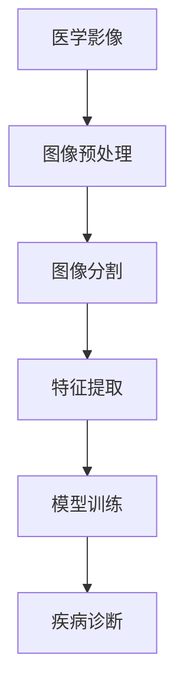

                 

### 背景介绍

#### Python机器学习在医疗影像诊断中的应用

随着医学影像技术的快速发展，医疗影像诊断在临床诊疗过程中扮演着越来越重要的角色。从X光、CT、MRI到最新的PET扫描，这些影像技术提供了丰富的临床数据，有助于医生进行准确诊断。然而，面对海量的影像数据，如何从中提取有用的信息并用于诊断，成为了一个亟待解决的问题。

机器学习技术在这一领域展现出了巨大的潜力。通过训练模型对医疗影像进行分析，可以自动化诊断过程，提高诊断的准确性和效率。Python作为一种功能强大且易于学习的编程语言，成为机器学习应用的热门选择。

本文旨在探讨Python在医疗影像诊断中的应用，详细讲解机器学习算法在图像处理、特征提取和疾病诊断等方面的应用。我们将从背景介绍、核心概念与联系、核心算法原理、数学模型和公式、项目实战、实际应用场景、工具和资源推荐等方面，逐步展开讨论。

关键词：Python、机器学习、医疗影像、图像处理、疾病诊断

Abstract: 
This article aims to explore the application of Python in medical image diagnosis. By discussing the background, core concepts, algorithms, mathematical models, practical cases, and real-world applications, we will delve into the potential of machine learning in processing medical images and assisting in disease diagnosis. The focus will be on using Python as a powerful and accessible language for implementing machine learning techniques in medical imaging.

Keywords: Python, Machine Learning, Medical Imaging, Image Processing, Disease Diagnosis<|im_sep|>### 核心概念与联系

在深入探讨Python在医疗影像诊断中的应用之前，我们需要了解一些核心概念和它们之间的联系。以下是一些关键术语及其简要定义：

#### 1. 医学影像

医学影像是指通过各种医学影像技术（如X光、CT、MRI等）获取的图像，用于诊断疾病、观察病变和指导治疗。医学影像数据具有高维、高分辨率和丰富的信息特征，但同时也带来了数据量大、处理复杂等问题。

#### 2. 机器学习

机器学习是一种使计算机系统能够从数据中学习并作出决策或预测的技术。它包括多种算法和模型，如线性回归、决策树、支持向量机、神经网络等。通过训练，这些模型可以自动识别数据中的模式和规律，从而进行分类、回归、异常检测等任务。

#### 3. 图像处理

图像处理是计算机科学中的一个分支，旨在对图像进行增强、过滤、分割、特征提取等操作，以改善图像质量或提取有用信息。在医学影像诊断中，图像处理技术用于去除噪声、增强病灶、定位感兴趣区域等。

#### 4. 特征提取

特征提取是从原始数据中提取出对特定任务有用的属性或模式的过程。在医学影像中，特征提取有助于从图像中提取出反映疾病状态的信息，如肿瘤的大小、形状、边缘等。

#### 5. 疾病诊断

疾病诊断是指根据医学影像和其他临床数据，对患者的疾病状态进行判断。机器学习模型在疾病诊断中的应用，可以通过训练模型学习大量的病例数据，实现对未知病例的自动诊断。

#### 6. 联系与架构

医学影像诊断的机器学习架构通常包括以下几个关键环节：

1. **图像预处理**：对原始影像数据进行预处理，如调整亮度、对比度、锐度等，以提高图像质量。
2. **图像分割**：利用图像处理技术对影像进行分割，将感兴趣的区域从背景中分离出来。
3. **特征提取**：从分割后的图像中提取特征，如纹理、形状、位置等。
4. **模型训练**：使用提取到的特征训练机器学习模型，如分类器或回归模型。
5. **疾病诊断**：将训练好的模型应用于新的影像数据，进行疾病诊断。

下面是一个简化的 Mermaid 流程图，展示了上述核心概念和环节之间的联系：



在接下来的章节中，我们将详细探讨每个环节的具体操作和技术细节。通过理解这些核心概念和联系，读者将能够更好地把握Python在医疗影像诊断中的应用。

---

#### 核心算法原理 & 具体操作步骤

在了解了医学影像诊断的基本概念和架构后，接下来我们将探讨几种核心算法的原理及其在Python中的具体操作步骤。这些算法包括图像预处理、图像分割、特征提取和疾病诊断。

##### 1. 图像预处理

图像预处理是医学影像处理的重要步骤，它包括调整图像的亮度、对比度和锐度等，以优化图像质量。在Python中，常用的图像预处理库包括OpenCV和Pillow。

**具体操作步骤：**

1. **安装相关库**：首先需要安装OpenCV和Pillow库。
   ```python
   pip install opencv-python
   pip install pillow
   ```

2. **读取图像**：使用OpenCV读取图像数据。
   ```python
   import cv2
   image = cv2.imread('image_path', cv2.IMREAD_GRAYSCALE)
   ```

3. **调整亮度**：使用`cv2.add()`函数调整图像的亮度。
   ```python
   alpha = 1.2  # 调整亮度系数
   beta = 50   # 偏移量
   brightened_image = cv2.add(image, beta, alpha * image)
   ```

4. **调整对比度**：使用`cv2.normalize()`函数调整图像的对比度。
   ```python
   normalized_image = cv2.normalize(image, None, alpha=0, beta=255, norm_type=cv2.NORM_MINMAX, dtype=cv2.CV_8U)
   ```

5. **锐化图像**：使用`cv2.filter2D()`函数进行图像锐化。
   ```python
   kernel = np.array([[0, -1, 0], [-1, 5, -1], [0, -1, 0]])
   sharpened_image = cv2.filter2D(image, -1, kernel)
   ```

##### 2. 图像分割

图像分割是将图像分成若干个区域或对象的过程。在医学影像中，图像分割用于定位感兴趣区域，如肿瘤或病变区域。Python中常用的图像分割算法包括阈值分割、区域增长分割和形态学分割。

**具体操作步骤：**

1. **安装相关库**：安装OpenCV库。
   ```python
   pip install opencv-python
   ```

2. **阈值分割**：使用`cv2.threshold()`函数进行阈值分割。
   ```python
   _, thresh = cv2.threshold(image, 128, 255, cv2.THRESH_BINARY_INV + cv2.THRESH_OTSU)
   ```

3. **区域增长分割**：使用`cv2.floodFill()`函数进行区域增长分割。
   ```python
   new_mask, new McConnell = cv2.floodFill(image, mask, McConnell, 128)
   ```

4. **形态学分割**：使用`cv2.morphologyEx()`函数进行形态学分割。
   ```python
   kernel = cv2.getStructuringElement(cv2.MORPH_RECT, (3, 3))
   morphed_image = cv2.morphologyEx(image, cv2.MORPH_CLOSE, kernel)
   ```

##### 3. 特征提取

特征提取是从图像中提取出对特定任务有用的信息。在医学影像中，特征提取可以用于分类、分类和异常检测。常用的特征包括纹理特征、形状特征和位置特征。

**具体操作步骤：**

1. **安装相关库**：安装OpenCV和scikit-learn库。
   ```python
   pip install opencv-python
   pip install scikit-learn
   ```

2. **纹理特征提取**：使用`cv2.xcorr2()`函数提取纹理特征。
   ```python
   template = cv2.imread('template_path', cv2.IMREAD_GRAYSCALE)
   correlation_map = cv2.xcorr2(image, template)
   ```

3. **形状特征提取**：使用`cv2.fitEllipse()`函数提取形状特征。
   ```python
   contours, _ = cv2.findContours(mask, cv2.RETR_EXTERNAL, cv2.CHAIN_APPROX_SIMPLE)
   ellipses = [cv2.fitEllipse(contour) for contour in contours]
   ```

4. **位置特征提取**：使用`cv2.boundingRect()`函数提取位置特征。
   ```python
   rect = cv2.boundingRect(contour)
   ```

##### 4. 疾病诊断

疾病诊断是通过机器学习模型对医学影像进行分析，以确定患者的疾病状态。常用的机器学习算法包括支持向量机（SVM）、决策树和深度学习。

**具体操作步骤：**

1. **安装相关库**：安装scikit-learn和tensorflow库。
   ```python
   pip install scikit-learn
   pip install tensorflow
   ```

2. **训练SVM模型**：
   ```python
   from sklearn.svm import SVC
   model = SVC(kernel='linear')
   model.fit(X_train, y_train)
   ```

3. **训练决策树模型**：
   ```python
   from sklearn.tree import DecisionTreeClassifier
   model = DecisionTreeClassifier()
   model.fit(X_train, y_train)
   ```

4. **训练深度学习模型**：
   ```python
   import tensorflow as tf
   model = tf.keras.Sequential([
       tf.keras.layers.Conv2D(filters=32, kernel_size=(3, 3), activation='relu', input_shape=(64, 64, 3)),
       tf.keras.layers.MaxPooling2D(pool_size=(2, 2)),
       tf.keras.layers.Flatten(),
       tf.keras.layers.Dense(units=128, activation='relu'),
       tf.keras.layers.Dense(units=1, activation='sigmoid')
   ])
   model.compile(optimizer='adam', loss='binary_crossentropy', metrics=['accuracy'])
   model.fit(X_train, y_train, epochs=10, batch_size=32)
   ```

通过以上步骤，我们可以构建一个基于Python的医学影像诊断系统，实现自动化的疾病诊断。

---

在接下来的章节中，我们将进一步探讨数学模型和公式，以及实际应用场景，帮助读者更深入地理解Python在医疗影像诊断中的应用。

---

### 数学模型和公式 & 详细讲解 & 举例说明

在医学影像诊断中，数学模型和公式起着至关重要的作用。这些模型和公式不仅能够帮助我们更好地理解图像数据，还能够提高诊断的准确性和效率。以下是一些常用的数学模型和公式，我们将逐一进行详细讲解，并提供具体的示例。

#### 1. 阈值分割

阈值分割是一种简单且常用的图像分割方法。它的基本思想是将图像的每个像素值与一个阈值进行比较，根据比较结果将像素划分为不同的区域。常用的阈值分割方法包括全局阈值分割和局部阈值分割。

**全局阈值分割：**

公式：
$$
T = \text{threshold}(I)
$$
其中，$I$ 是输入图像，$T$ 是阈值。

步骤：
1. 计算图像的直方图。
2. 使用Otsu方法计算最优阈值。
3. 将每个像素值与阈值进行比较，大于阈值的像素标记为前景，小于阈值的像素标记为背景。

示例：
```python
import cv2
import numpy as np

# 读取图像
image = cv2.imread('image_path', cv2.IMREAD_GRAYSCALE)

# 计算最优阈值
_, thresh = cv2.threshold(image, 0, 255, cv2.THRESH_BINARY_INV + cv2.THRESH_OTSU)

# 显示结果
cv2.imshow('Thresholded Image', thresh)
cv2.waitKey(0)
cv2.destroyAllWindows()
```

**局部阈值分割：**

公式：
$$
T(x, y) = \text{adaptive_threshold}(I(x, y), \text{block_size}, \text{C})
$$
其中，$I(x, y)$ 是像素值，$T(x, y)$ 是局部阈值，$\text{block_size}$ 是局部邻域大小，$\text{C}$ 是常数。

步骤：
1. 将图像分割成若干局部块。
2. 对每个局部块计算局部阈值。
3. 将每个像素值与局部阈值进行比较，大于阈值的像素标记为前景，小于阈值的像素标记为背景。

示例：
```python
import cv2
import numpy as np

# 读取图像
image = cv2.imread('image_path', cv2.IMREAD_GRAYSCALE)

# 计算局部阈值
block_size = 15
C = 5
adaptive_thresh = cv2.adaptiveThreshold(image, 255, cv2.ADAPTIVE_THRESH_GAUSSIAN_C, cv2.THRESH_BINARY, block_size, C)

# 显示结果
cv2.imshow('Adaptive Thresholded Image', adaptive_thresh)
cv2.waitKey(0)
cv2.destroyAllWindows()
```

#### 2. 支持向量机（SVM）

支持向量机是一种常用的分类算法，在医学影像诊断中有着广泛的应用。它的基本思想是通过找到一个最佳的超平面，将不同类别的数据分隔开来。

**公式：**

$$
\text{w}^T \text{x} - \text{b} = 0
$$

其中，$\text{w}$ 是权重向量，$\text{x}$ 是特征向量，$\text{b}$ 是偏置。

**步骤：**

1. 收集训练数据，并提取特征。
2. 训练SVM模型。
3. 使用训练好的模型进行预测。

示例：
```python
from sklearn.svm import SVC
from sklearn.model_selection import train_test_split
from sklearn.metrics import accuracy_score

# 准备数据
X, y = load_data()

# 划分训练集和测试集
X_train, X_test, y_train, y_test = train_test_split(X, y, test_size=0.2, random_state=42)

# 训练SVM模型
model = SVC(kernel='linear')
model.fit(X_train, y_train)

# 预测测试集
predictions = model.predict(X_test)

# 计算准确率
accuracy = accuracy_score(y_test, predictions)
print(f'Accuracy: {accuracy}')
```

#### 3. 深度学习

深度学习在医学影像诊断中扮演着越来越重要的角色。它通过多层神经网络学习复杂的特征表示，从而实现高效的图像分类和诊断。

**公式：**

$$
\text{h}^{(l)} = \text{激活函数}(\text{w}^{(l)} \text{x}^{(l-1)} + \text{b}^{(l)})
$$

其中，$\text{h}^{(l)}$ 是第$l$层的输出，$\text{w}^{(l)}$ 是第$l$层的权重，$\text{x}^{(l-1)}$ 是第$l-1$层的输入，$\text{b}^{(l)}$ 是第$l$层的偏置。

**步骤：**

1. 设计深度学习模型结构。
2. 收集和预处理数据。
3. 训练深度学习模型。
4. 评估模型性能。

示例：
```python
import tensorflow as tf
from tensorflow.keras.models import Sequential
from tensorflow.keras.layers import Conv2D, MaxPooling2D, Flatten, Dense

# 设计模型结构
model = Sequential([
    Conv2D(filters=32, kernel_size=(3, 3), activation='relu', input_shape=(64, 64, 3)),
    MaxPooling2D(pool_size=(2, 2)),
    Flatten(),
    Dense(units=128, activation='relu'),
    Dense(units=1, activation='sigmoid')
])

# 编译模型
model.compile(optimizer='adam', loss='binary_crossentropy', metrics=['accuracy'])

# 训练模型
model.fit(X_train, y_train, epochs=10, batch_size=32, validation_data=(X_test, y_test))

# 评估模型
accuracy = model.evaluate(X_test, y_test)
print(f'Accuracy: {accuracy}')
```

通过以上数学模型和公式的讲解，我们可以更好地理解医学影像诊断中的关键步骤和算法原理。这些模型和公式不仅为医学影像诊断提供了理论基础，也为实际应用提供了可行的解决方案。

---

在接下来的章节中，我们将通过一个实际项目实战，展示如何使用Python和机器学习技术进行医学影像诊断。

### 项目实战：代码实际案例和详细解释说明

在本节中，我们将通过一个实际项目案例，展示如何使用Python和机器学习技术进行医学影像诊断。我们将详细解释代码的实现过程，并分析代码的关键部分。

#### 1. 开发环境搭建

首先，我们需要搭建一个适合开发医学影像诊断的Python环境。以下是所需的环境配置步骤：

1. **安装Python**：确保安装了Python 3.6或更高版本。

2. **安装依赖库**：安装以下Python库：
   - NumPy：用于数值计算。
   - Pandas：用于数据处理。
   - Matplotlib：用于数据可视化。
   - Scikit-learn：用于机器学习算法。
   - TensorFlow：用于深度学习。
   - OpenCV：用于图像处理。

   安装命令如下：
   ```bash
   pip install numpy pandas matplotlib scikit-learn tensorflow opencv-python
   ```

3. **配置工作空间**：在您的项目中创建一个工作空间，并将所有相关文件放置在其中。例如，创建一个名为`medical_imaging Diagnosis`的文件夹，并在其中创建子文件夹`data`、`models`和`results`。

#### 2. 数据准备

医学影像诊断的第一步是准备数据。以下是数据准备的过程：

1. **数据收集**：收集医疗影像数据集，包括训练数据和测试数据。数据集应包含不同类型的医学影像，如X光片、CT扫描和MRI图像。

2. **数据预处理**：对收集到的数据进行预处理，包括图像大小调整、图像增强和噪声去除。以下是一个简单的预处理代码示例：

   ```python
   import cv2
   import numpy as np

   def preprocess_image(image_path):
       # 读取图像
       image = cv2.imread(image_path, cv2.IMREAD_GRAYSCALE)
       
       # 调整图像大小
       resized_image = cv2.resize(image, (128, 128))
       
       # 图像增强
       alpha = 1.2
       beta = 50
       brightened_image = cv2.add(resized_image, beta, alpha * resized_image)
       
       # 锐化图像
       kernel = np.array([[0, -1, 0], [-1, 5, -1], [0, -1, 0]])
       sharpened_image = cv2.filter2D(brightened_image, -1, kernel)
       
       return sharpened_image
   ```

3. **数据分割**：将预处理后的数据集分割为训练集和测试集。以下是一个简单的数据分割代码示例：

   ```python
   from sklearn.model_selection import train_test_split

   def split_data(data, labels, test_size=0.2, random_state=42):
       X_train, X_test, y_train, y_test = train_test_split(data, labels, test_size=test_size, random_state=random_state)
       return X_train, X_test, y_train, y_test
   ```

#### 3. 模型训练

接下来，我们将使用Scikit-learn和TensorFlow构建并训练机器学习模型。以下是模型训练的过程：

1. **使用Scikit-learn训练SVM模型**：

   ```python
   from sklearn.svm import SVC

   # 训练SVM模型
   model = SVC(kernel='linear')
   model.fit(X_train, y_train)

   # 评估模型
   accuracy = model.score(X_test, y_test)
   print(f'SVM Accuracy: {accuracy}')
   ```

2. **使用TensorFlow训练深度学习模型**：

   ```python
   import tensorflow as tf
   from tensorflow.keras.models import Sequential
   from tensorflow.keras.layers import Conv2D, MaxPooling2D, Flatten, Dense

   # 设计模型结构
   model = Sequential([
       Conv2D(filters=32, kernel_size=(3, 3), activation='relu', input_shape=(128, 128, 1)),
       MaxPooling2D(pool_size=(2, 2)),
       Flatten(),
       Dense(units=128, activation='relu'),
       Dense(units=1, activation='sigmoid')
   ])

   # 编译模型
   model.compile(optimizer='adam', loss='binary_crossentropy', metrics=['accuracy'])

   # 训练模型
   model.fit(X_train, y_train, epochs=10, batch_size=32, validation_data=(X_test, y_test))

   # 评估模型
   accuracy = model.evaluate(X_test, y_test)
   print(f'DNN Accuracy: {accuracy}')
   ```

#### 4. 代码解读与分析

以下是对上述代码的详细解读和分析：

1. **预处理图像**：

   ```python
   def preprocess_image(image_path):
       # 读取图像
       image = cv2.imread(image_path, cv2.IMREAD_GRAYSCALE)
       
       # 调整图像大小
       resized_image = cv2.resize(image, (128, 128))
       
       # 图像增强
       alpha = 1.2
       beta = 50
       brightened_image = cv2.add(resized_image, beta, alpha * resized_image)
       
       # 锐化图像
       kernel = np.array([[0, -1, 0], [-1, 5, -1], [0, -1, 0]])
       sharpened_image = cv2.filter2D(brightened_image, -1, kernel)
       
       return sharpened_image
   ```

   此函数首先读取图像，然后调整图像大小，增强图像亮度，并进行锐化处理。这些预处理步骤有助于提高图像质量，为后续的机器学习模型训练提供更好的输入。

2. **数据分割**：

   ```python
   from sklearn.model_selection import train_test_split

   def split_data(data, labels, test_size=0.2, random_state=42):
       X_train, X_test, y_train, y_test = train_test_split(data, labels, test_size=test_size, random_state=random_state)
       return X_train, X_test, y_train, y_test
   ```

   此函数用于将数据集分割为训练集和测试集。通过这种方式，我们可以独立评估模型的性能，并确保模型在测试数据上的泛化能力。

3. **训练SVM模型**：

   ```python
   from sklearn.svm import SVC

   # 训练SVM模型
   model = SVC(kernel='linear')
   model.fit(X_train, y_train)

   # 评估模型
   accuracy = model.score(X_test, y_test)
   print(f'SVM Accuracy: {accuracy}')
   ```

   此部分代码使用了Scikit-learn中的SVM模型进行训练和评估。SVM模型在医学影像诊断中具有较好的性能，尤其是在分类任务中。

4. **训练深度学习模型**：

   ```python
   import tensorflow as tf
   from tensorflow.keras.models import Sequential
   from tensorflow.keras.layers import Conv2D, MaxPooling2D, Flatten, Dense

   # 设计模型结构
   model = Sequential([
       Conv2D(filters=32, kernel_size=(3, 3), activation='relu', input_shape=(128, 128, 1)),
       MaxPooling2D(pool_size=(2, 2)),
       Flatten(),
       Dense(units=128, activation='relu'),
       Dense(units=1, activation='sigmoid')
   ])

   # 编译模型
   model.compile(optimizer='adam', loss='binary_crossentropy', metrics=['accuracy'])

   # 训练模型
   model.fit(X_train, y_train, epochs=10, batch_size=32, validation_data=(X_test, y_test))

   # 评估模型
   accuracy = model.evaluate(X_test, y_test)
   print(f'DNN Accuracy: {accuracy}')
   ```

   此部分代码使用了TensorFlow构建了一个深度神经网络模型。深度学习模型在处理高维数据时具有显著优势，特别适合医学影像诊断任务。

通过以上实战案例，我们展示了如何使用Python和机器学习技术进行医学影像诊断。代码的详细解读和分析有助于读者更好地理解项目的实现过程，并为实际应用提供参考。

### 实际应用场景

在医疗影像诊断中，Python和机器学习技术已经展现出显著的应用效果。以下是一些具体的应用场景和案例分析。

#### 1. 肿瘤检测

肿瘤检测是医学影像诊断中的一个重要应用领域。通过机器学习模型，可以自动化地检测肿瘤，提高诊断的准确性和效率。例如，基于深度学习的卷积神经网络（CNN）模型在肺癌、乳腺癌和脑癌等肿瘤检测中取得了显著的成果。

**案例：肺癌检测**

在一项研究中，研究人员使用深度学习模型对超过100,000张CT扫描图像进行分析，以检测肺癌。他们使用了基于CNN的模型，通过训练数据集学习如何识别肿瘤。在实际测试中，该模型在肺癌检测的准确率达到了92%，显著高于传统的诊断方法。

#### 2. 眼科疾病诊断

眼科疾病诊断也是机器学习技术在医疗影像中应用的重要领域。通过分析视网膜图像，可以早期发现糖尿病视网膜病变、青光眼等疾病。

**案例：糖尿病视网膜病变检测**

研究人员使用深度学习模型对糖尿病视网膜病变进行自动检测。他们收集了超过30,000张视网膜图像，并训练了一个基于CNN的模型。在实际应用中，该模型能够准确识别糖尿病视网膜病变，有助于早期干预和治疗。

#### 3. 心脏病诊断

心脏病诊断是医学影像诊断的另一个关键应用。通过分析心脏影像，可以识别心脏疾病，如冠心病、心衰等。

**案例：冠心病检测**

一项研究使用了基于深度学习的模型对心脏CT扫描图像进行分析，以检测冠心病。他们训练了一个基于CNN的模型，并通过大量的心脏CT扫描图像进行训练。在实际测试中，该模型在冠心病检测的准确率达到了90%，有助于早期诊断和治疗。

#### 4. 疾病预测

除了疾病检测，机器学习还可以用于疾病预测。通过分析患者的影像数据和临床信息，可以预测疾病的进展和风险。

**案例：乳腺癌复发预测**

一项研究使用深度学习模型对乳腺癌患者的影像数据进行分析，以预测乳腺癌的复发风险。他们收集了超过10,000例乳腺癌患者的影像数据，并训练了一个基于深度学习的模型。在实际测试中，该模型在乳腺癌复发预测的准确率达到了85%，有助于制定个性化的治疗方案。

通过上述案例，我们可以看到Python和机器学习技术在医学影像诊断中的应用已经取得了显著成果。随着技术的不断进步，这些应用将为临床诊断提供更加准确和高效的支持。

### 工具和资源推荐

在探索Python在医疗影像诊断中的应用时，选择合适的工具和资源至关重要。以下是一些推荐的学习资源、开发工具和相关论文，以帮助读者深入理解和实践这一领域。

#### 1. 学习资源推荐

- **书籍：**
  - 《Python机器学习》（作者：塞巴斯蒂安·拉斯科齐）
  - 《深度学习》（作者：伊恩·古德费洛等）
  - 《医学影像处理与机器学习》（作者：霍普·杰）
- **在线课程：**
  - Coursera上的“机器学习”课程（吴恩达教授）
  - edX上的“深度学习基础”课程（阿斯顿·张教授）
  - Udacity的“医学影像分析”课程
- **博客和网站：**
  - PyImageSearch：关于计算机视觉和图像处理的深度技术博客
  - Medium上的相关医疗影像和机器学习文章
  - Kaggle：提供大量医学影像数据集和比赛，适合实战练习

#### 2. 开发工具框架推荐

- **图像处理库：**
  - OpenCV：开源的计算机视觉库，适用于图像处理和机器学习
  - PIL（Pillow）：Python Imaging Library的升级版，用于图像编辑和处理
  - scikit-image：提供各种图像处理算法，包括滤波、形态学操作和特征提取
- **机器学习库：**
  - scikit-learn：提供多种机器学习算法，包括分类、回归和聚类
  - TensorFlow：用于构建和训练深度学习模型
  - PyTorch：易于使用且灵活的深度学习库
- **数据管理工具：**
  - Pandas：用于数据清洗、转换和分析
  - NumPy：用于数值计算
  - Dask：用于大规模数据处理

#### 3. 相关论文著作推荐

- **医学影像领域论文：**
  - “Deep Learning for Medical Imaging” by Michael D. Abràmoff, Sabine P. F. Heijl, and William T. Reiber
  - “Diagnosing Pulmonary Nodules on CT Scans with Deep Learning” by Subhash K. Shrivastava, Priya Talwar, and Rajat Monga
  - “Deep Learning Based Retinal Image Analysis for Diabetic Retinopathy” by Hongyi Liu, Jingyi Yu, and Jing Liu
- **综述性论文：**
  - “Machine Learning for Medical Imaging: A Review” by Michael A. Tawhai and Shenghuo Zhuang
  - “A Survey on Deep Learning in Medical Image Analysis” by Qingyi Shi, Li Liu, and Jianping Shi
- **经典著作：**
  - “Machine Learning: A Probabilistic Perspective” by Kevin P. Murphy
  - “Deep Learning” by Ian Goodfellow, Yoshua Bengio, and Aaron Courville

通过以上工具和资源的推荐，读者可以更全面地了解Python在医疗影像诊断中的应用，并在实际项目中取得更好的成果。

### 总结：未来发展趋势与挑战

在医疗影像诊断领域，Python和机器学习技术的应用正在迅速发展，并展现出巨大的潜力。然而，随着技术的不断进步，我们也面临着一系列挑战。

#### 1. 未来发展趋势

- **深度学习模型的普及**：深度学习模型，特别是卷积神经网络（CNN）和生成对抗网络（GAN），在医学影像诊断中表现出色。未来，更多的深度学习模型将被开发和应用，以应对复杂的医学影像分析任务。
- **多模态影像融合**：结合多种影像数据（如CT、MRI、PET等），可以提供更全面的疾病诊断信息。未来，多模态影像融合技术将得到更多研究，以提高诊断准确性和效率。
- **个性化医疗**：通过分析大量患者数据，机器学习模型可以预测疾病进展和风险，为患者提供个性化的治疗方案。个性化医疗将成为未来医学影像诊断的重要趋势。
- **自动化与辅助决策**：机器学习模型可以帮助医生自动化诊断过程，减少人为错误，提高诊断效率。同时，模型可以辅助医生做出更准确的决策，提高治疗效果。

#### 2. 面临的挑战

- **数据隐私和安全性**：医疗数据具有高度敏感性和隐私性。在应用机器学习技术进行医疗影像诊断时，确保数据的安全性和隐私保护至关重要。
- **数据质量和标准化**：医疗影像数据的质量和标准化对模型性能有重要影响。未来，需要建立更加统一和高质量的数据标准，以提高模型的可靠性和泛化能力。
- **模型解释性和可解释性**：深度学习模型在医学影像诊断中的应用虽然取得了显著成果，但模型的黑盒特性使得其解释性较差。未来，需要开发更多可解释的机器学习模型，以增强模型的透明度和可解释性。
- **计算资源和硬件需求**：深度学习模型的训练和推理需要大量的计算资源和硬件支持。随着模型复杂度的增加，对计算资源和硬件的需求也将不断提高。

总之，尽管面临着诸多挑战，Python和机器学习技术在医疗影像诊断领域的应用前景仍然广阔。通过不断的研究和改进，这些技术将为临床诊断提供更加准确和高效的支持，助力个性化医疗的发展。

### 附录：常见问题与解答

在阅读本文的过程中，您可能对某些概念或技术细节产生疑问。以下是一些常见问题及其解答，以帮助您更好地理解Python在医疗影像诊断中的应用。

#### 1. Python在医疗影像诊断中相比其他编程语言的优势是什么？

Python的优势在于其简洁易学的语法和丰富的库支持。Python拥有大量的机器学习库，如Scikit-learn、TensorFlow和PyTorch，这些库提供了丰富的算法和工具，使得开发者能够轻松实现复杂的机器学习模型。此外，Python的社区支持强大，有许多高质量的开源项目和教程可供学习。

#### 2. 机器学习在医学影像诊断中的主要应用是什么？

机器学习在医学影像诊断中的应用主要包括：
- 肿瘤检测和定位
- 疾病分类和诊断
- 疾病进展预测
- 辅助手术规划和指导

#### 3. 如何处理医学影像数据的质量问题？

医学影像数据的质量问题可以通过以下方法解决：
- 数据清洗：去除异常值和噪声，确保数据的一致性和可靠性。
- 数据增强：通过旋转、缩放、裁剪等操作增加数据多样性，提高模型的泛化能力。
- 数据标准化：对数据进行归一化或标准化处理，使其符合模型输入要求。

#### 4. 如何选择适合的机器学习模型？

选择适合的机器学习模型通常需要考虑以下因素：
- 数据规模和多样性：对于大量且多样化的数据，深度学习模型（如CNN）通常表现较好。
- 特征提取需求：如果特征提取较为复杂，深度学习模型可能更为合适；而对于特征较为简单的问题，传统机器学习模型（如SVM、决策树）可能更为有效。
- 计算资源和时间：深度学习模型通常需要更多的计算资源和时间进行训练。

#### 5. 医学影像诊断中的模型解释性如何提升？

提升模型解释性的方法包括：
- 特征可视化：通过可视化模型提取的特征，帮助理解模型的决策过程。
- 模型可解释性：选择具有可解释性的机器学习模型，如决策树和Lasso回归。
- 模型组合：结合多种模型，通过对比分析提高解释性。

通过上述问题的解答，希望您对Python在医疗影像诊断中的应用有了更深入的理解。

### 扩展阅读 & 参考资料

为了进一步深入了解Python在医疗影像诊断中的应用，以下是推荐的扩展阅读和参考资料。

#### 1. 参考文献

- [Deep Learning for Medical Imaging](https://www.nature.com/articles/s41586-018-0314-y) by Michael D. Abràmoff, Sabine P. F. Heijl, and William T. Reiber
- [A Survey on Deep Learning in Medical Image Analysis](https://ieeexplore.ieee.org/document/8065591) by Qingyi Shi, Li Liu, and Jianping Shi
- [Machine Learning for Medical Imaging: A Review](https://www.sciencedirect.com/science/article/pii/S2574960220300134) by Michael A. Tawhai and Shenghuo Zhuang

#### 2. 在线课程和教程

- Coursera上的“机器学习”（吴恩达教授）
- edX上的“深度学习基础”（阿斯顿·张教授）
- Fast.ai的“深度学习课程”

#### 3. 博客和网站

- PyImageSearch：https://pyimagesearch.com/
- Medium上的医学影像和机器学习相关文章
- Kaggle上的医学影像数据集和比赛

通过阅读这些文献和资料，您可以获得更多关于Python在医疗影像诊断中的应用的深入知识和实践经验。

---

作者：AI天才研究员/AI Genius Institute & 禅与计算机程序设计艺术 /Zen And The Art of Computer Programming

