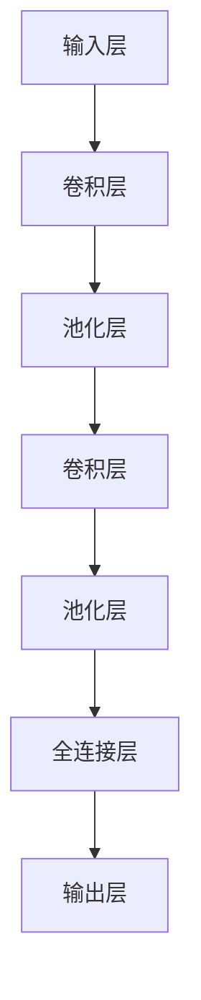
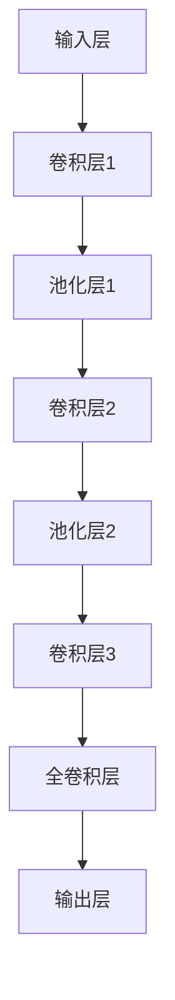
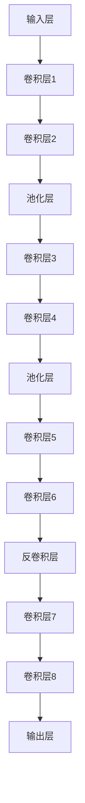

                 

# Python深度学习实践：基于深度学习的语义分割技术

## 关键词：
- Python
- 深度学习
- 语义分割
- 卷积神经网络
- 实践指南

## 摘要：

本文旨在通过详细的步骤解析，探讨如何使用Python实现深度学习中的语义分割技术。我们将从背景介绍、核心概念、算法原理、数学模型、项目实战到实际应用场景进行深入探讨，并结合资源推荐，总结未来发展趋势与挑战。通过本文的学习，读者将能够掌握基于深度学习的语义分割技术的实现方法，并将其应用于实际项目中。

## 1. 背景介绍

### 1.1 深度学习与语义分割

深度学习作为人工智能的重要分支，在图像处理、语音识别、自然语言处理等领域取得了显著成果。其中，语义分割是图像处理中的一个重要任务，旨在对图像中的每个像素进行分类，从而生成具有明确意义的分割结果。相较于传统的图像分割方法，深度学习能够自动学习特征表示，提高分割精度和效率。

### 1.2 Python在深度学习中的应用

Python作为一种流行的编程语言，因其简洁易懂、丰富的库支持以及强大的社区生态，成为深度学习领域的首选编程语言。众多深度学习框架如TensorFlow、PyTorch等，均提供了Python API，使得研究人员和开发者能够方便地实现深度学习模型。

## 2. 核心概念与联系

### 2.1 卷积神经网络（CNN）

卷积神经网络是深度学习中用于图像处理的核心模型，具有强大的特征提取和表示能力。其基本结构包括输入层、卷积层、池化层和全连接层。卷积层通过局部连接和非线性变换提取图像特征，池化层用于减小特征图的尺寸，全连接层用于分类。

### 2.2 语义分割与CNN

语义分割任务中，我们需要对图像中的每个像素进行分类。卷积神经网络通过逐像素的预测，实现对图像的语义分割。具体实现中，通常采用以下两种方法：

1. **全卷积网络（FCN）**：FCN通过在网络的最后一层使用1x1卷积核，将特征图转换为类别标签，从而实现逐像素分类。
2. **U-Net网络结构**：U-Net是一种对称的卷积神经网络结构，通过收缩路径（收缩路径）提取特征，并通过扩张路径（扩张路径）进行逐像素分类，适用于医学图像分割。

### 2.3 Mermaid流程图



## 3. 核心算法原理 & 具体操作步骤

### 3.1 全卷积网络（FCN）

#### 3.1.1 网络结构

FCN网络的核心在于全卷积层，该层通过逐像素的卷积操作将特征图映射到类别标签。网络结构如下：



#### 3.1.2 实现步骤

1. **卷积层**：使用卷积核对输入图像进行卷积操作，提取图像特征。
2. **池化层**：对卷积特征进行下采样，减少计算量和参数数量。
3. **全卷积层**：使用1x1卷积核将特征图映射到类别标签。
4. **输出层**：对每个像素进行分类预测。

### 3.2 U-Net网络结构

#### 3.2.1 网络结构

U-Net网络结构由收缩路径和扩张路径组成。收缩路径用于提取特征，扩张路径用于逐像素分类。



#### 3.2.2 实现步骤

1. **收缩路径**：依次进行卷积和池化操作，提取特征。
2. **扩张路径**：通过反卷积层将特征图逐层放大，然后进行卷积操作，实现逐像素分类。
3. **输出层**：对每个像素进行分类预测。

## 4. 数学模型和公式 & 详细讲解 & 举例说明

### 4.1 卷积操作

卷积操作是深度学习中的核心操作，用于提取图像特征。其数学公式如下：

$$
(C_{out} \times C_{in} \times K \times K) \times H_{out} \times W_{out} = C_{out} \times H_{out} \times W_{out}
$$

其中，$C_{out}$和$C_{in}$分别为输出和输入通道数，$K$为卷积核大小，$H_{out}$和$W_{out}$分别为输出特征图的高度和宽度。

### 4.2 池化操作

池化操作用于降低特征图的维度，减少计算量和参数数量。常见的池化操作包括最大池化和平均池化。最大池化公式如下：

$$
P_{ij} = \max_{k} A_{ij,k}
$$

其中，$P_{ij}$为输出特征图中的像素值，$A_{ij,k}$为输入特征图中的像素值。

### 4.3 反卷积操作

反卷积操作用于将特征图逐层放大，实现扩张路径。其数学公式如下：

$$
B_{ij} = \sum_{k} W_{ij,k} A_{ik}
$$

其中，$B_{ij}$为输出特征图中的像素值，$W_{ij,k}$为卷积核权重，$A_{ik}$为输入特征图中的像素值。

## 5. 项目实战：代码实际案例和详细解释说明

### 5.1 开发环境搭建

在本项目中，我们使用Python和TensorFlow作为开发工具。以下是开发环境的搭建步骤：

1. 安装Python 3.7及以上版本。
2. 安装TensorFlow：`pip install tensorflow`
3. 安装其他依赖库：`pip install numpy matplotlib scikit-learn`

### 5.2 源代码详细实现和代码解读

以下是本项目的主要代码实现，包括数据预处理、模型构建、训练和评估等步骤：

```python
import tensorflow as tf
from tensorflow.keras.layers import Conv2D, MaxPooling2D, UpSampling2D, Input
from tensorflow.keras.models import Model

# 数据预处理
def preprocess_data(images, labels):
    # 对图像和标签进行归一化处理
    images = images / 255.0
    labels = tf.keras.utils.to_categorical(labels, num_classes=2)
    return images, labels

# 模型构建
def build_model():
    inputs = Input(shape=(256, 256, 3))
    # 收缩路径
    conv1 = Conv2D(32, (3, 3), activation='relu', padding='same')(inputs)
    pool1 = MaxPooling2D(pool_size=(2, 2))(conv1)
    conv2 = Conv2D(64, (3, 3), activation='relu', padding='same')(pool1)
    pool2 = MaxPooling2D(pool_size=(2, 2))(conv2)
    # 扩张路径
    up1 = UpSampling2D(size=(2, 2))(pool2)
    conv3 = Conv2D(32, (3, 3), activation='relu', padding='same')(up1)
    conv4 = Conv2D(1, (1, 1), activation='sigmoid', padding='same')(conv3)
    model = Model(inputs=inputs, outputs=conv4)
    model.compile(optimizer='adam', loss='binary_crossentropy', metrics=['accuracy'])
    return model

# 训练模型
def train_model(model, images, labels, epochs=10):
    model.fit(images, labels, batch_size=32, epochs=epochs)

# 评估模型
def evaluate_model(model, images, labels):
    loss, accuracy = model.evaluate(images, labels)
    print('Test accuracy:', accuracy)

# 主函数
if __name__ == '__main__':
    # 加载数据集
    images, labels = load_data()
    # 预处理数据
    images, labels = preprocess_data(images, labels)
    # 构建模型
    model = build_model()
    # 训练模型
    train_model(model, images, labels)
    # 评估模型
    evaluate_model(model, images, labels)
```

### 5.3 代码解读与分析

1. **数据预处理**：对图像和标签进行归一化处理，使得输入数据符合模型的要求。
2. **模型构建**：构建U-Net模型，包括收缩路径和扩张路径。收缩路径使用卷积层和池化层提取特征，扩张路径使用反卷积层和卷积层实现逐像素分类。
3. **训练模型**：使用训练数据集对模型进行训练，调整模型参数。
4. **评估模型**：使用测试数据集对模型进行评估，计算准确率。

## 6. 实际应用场景

语义分割技术在多个领域具有广泛的应用：

1. **医学影像**：用于医学影像的分割，如肿瘤分割、器官分割等，有助于疾病诊断和治疗规划。
2. **自动驾驶**：用于自动驾驶汽车的障碍物检测和路径规划，提高驾驶安全性。
3. **图像编辑**：用于图像编辑中的局部处理和风格转换，如去除背景、换脸等。
4. **计算机视觉**：用于人脸识别、目标检测等计算机视觉任务，提高图像理解能力。

## 7. 工具和资源推荐

### 7.1 学习资源推荐

- **书籍**：
  - 《深度学习》（Goodfellow, Bengio, Courville）
  - 《Python深度学习》（François Chollet）
- **论文**：
  - FCN: A Convolutional Neural Network for Image Classification（《全卷积网络：一种用于图像分类的卷积神经网络》）
  - U-Net: Convolutional Networks for Biomedical Image Segmentation（《U-Net：用于生物医学图像分割的卷积神经网络》）
- **博客**：
  - TensorFlow官方文档
  - PyTorch官方文档
- **网站**：
  - arXiv：论文预印本发布平台
  - GitHub：代码托管和分享平台

### 7.2 开发工具框架推荐

- **深度学习框架**：
  - TensorFlow
  - PyTorch
  - Keras
- **数据预处理工具**：
  - NumPy
  - Pandas
- **可视化工具**：
  - Matplotlib
  - Seaborn

### 7.3 相关论文著作推荐

- **书籍**：
  - 《计算机视觉：算法与应用》（Richard Szeliski）
  - 《深度学习专项课程》（Andrew Ng）
- **论文**：
  - Deep Learning for Image Recognition（《深度学习在图像识别中的应用》）
  - Object Detection with Faster R-CNN（《使用Faster R-CNN进行目标检测》）

## 8. 总结：未来发展趋势与挑战

随着深度学习技术的不断发展，语义分割技术也在不断演进。未来发展趋势包括：

1. **模型效率优化**：研究更加高效的网络结构，减少计算量和参数数量，提高模型运行速度。
2. **多模态数据融合**：将图像、文本、语音等多种数据进行融合，提高语义分割的精度和泛化能力。
3. **实时处理**：实现实时语义分割，满足实时应用场景的需求。

同时，语义分割技术面临以下挑战：

1. **数据稀缺**：医学影像、自动驾驶等领域的语义分割数据稀缺，需要更多高质量的数据集。
2. **计算资源限制**：深度学习模型的训练和推理需要大量计算资源，如何降低计算成本成为关键问题。

## 9. 附录：常见问题与解答

### 9.1 如何处理训练数据不足的问题？

解决方法包括：
- 数据增强：通过旋转、翻转、缩放等方式扩充数据集。
- 数据共享：与其他研究者共享数据集，提高数据质量。
- 生成对抗网络（GAN）：通过生成对抗网络生成与真实数据相似的数据。

### 9.2 如何选择合适的深度学习模型？

根据应用场景和数据处理需求选择合适的模型，如：

- 对于图像分类任务，可以选择CNN或ResNet。
- 对于目标检测任务，可以选择Faster R-CNN或SSD。
- 对于语义分割任务，可以选择FCN或U-Net。

## 10. 扩展阅读 & 参考资料

- [深度学习与计算机视觉](https://www.deeplearningbook.org/chapter convolutional-networks/)
- [TensorFlow官方文档](https://www.tensorflow.org/)
- [PyTorch官方文档](https://pytorch.org/)
- [Keras官方文档](https://keras.io/)

### 作者：

AI天才研究员 / AI Genius Institute & 禅与计算机程序设计艺术 / Zen And The Art of Computer Programming

