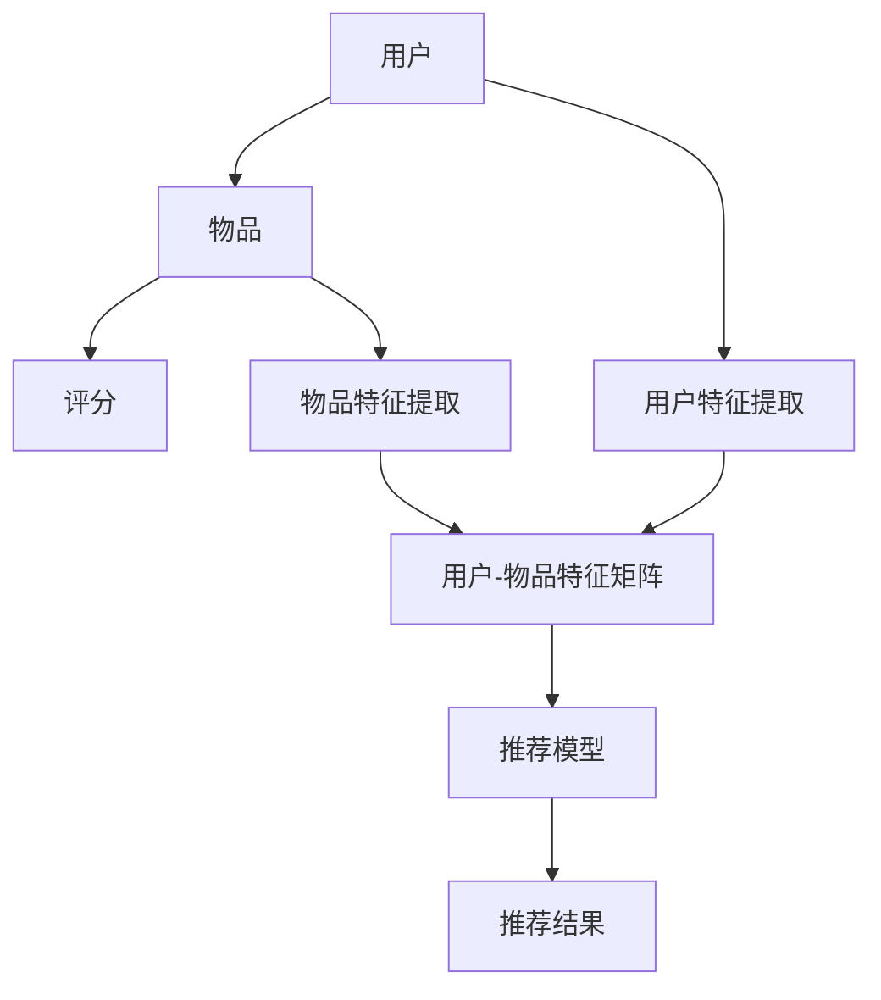

                 

# Python深度学习实践：构建和优化推荐系统模型

## 关键词：Python、深度学习、推荐系统、模型优化、实践

### 摘要

本文旨在通过Python深度学习实践，系统地介绍如何构建和优化推荐系统模型。我们将从背景介绍开始，详细阐述核心概念和算法原理，并通过实际项目案例，深入解析代码实现过程。此外，还将探讨推荐系统在实际应用场景中的表现，并提供相关工具和资源的推荐。通过本文的学习，读者将能够掌握推荐系统的基础知识，并具备独立构建和优化推荐系统的能力。

## 1. 背景介绍

推荐系统是信息检索和机器学习领域的核心应用之一，其目的是根据用户的兴趣和偏好，向用户推荐相关的物品或内容。随着互联网的迅速发展和用户数据的不断积累，推荐系统在电子商务、社交媒体、在线视频、新闻推荐等领域发挥着越来越重要的作用。

Python作为一种广泛应用的编程语言，因其简洁、易学、功能强大的特点，成为深度学习实践的首选工具。深度学习技术在推荐系统中的应用，使得推荐算法更加精准、高效，能够更好地满足用户的需求。

本文将基于Python深度学习实践，详细探讨如何构建和优化推荐系统模型，帮助读者深入了解推荐系统的原理和应用，提升实际项目开发能力。

## 2. 核心概念与联系

### 2.1 推荐系统的基本概念

推荐系统通常包含三个核心组件：用户、物品和评分。用户表示系统的用户群体，物品表示系统中的各种内容，评分则表示用户对物品的偏好程度。推荐系统的主要目标是根据用户的历史行为和偏好，预测用户对未知物品的评分，从而为用户推荐感兴趣的内容。

### 2.2 深度学习与推荐系统

深度学习是一种基于人工神经网络的机器学习技术，具有强大的特征提取和模式识别能力。深度学习在推荐系统中的应用主要体现在两个方面：一是通过深度神经网络自动提取用户和物品的特征表示；二是利用深度学习算法，如神经网络协同过滤、自动编码器等，构建高效的推荐模型。

### 2.3 Mermaid 流程图

下面是推荐系统架构的Mermaid流程图，用于展示核心组件及其相互关系：



在这个流程图中，用户和物品分别通过特征提取模块提取特征表示，然后输入到推荐模型中，最终生成推荐结果。这个流程展示了推荐系统的基本架构，以及深度学习技术在其中发挥的关键作用。

## 3. 核心算法原理 & 具体操作步骤

### 3.1 神经网络协同过滤

神经网络协同过滤是一种结合深度学习和协同过滤算法的推荐系统模型。协同过滤算法通过用户-物品评分矩阵进行矩阵分解，得到用户和物品的低维特征表示，进而预测用户对未知物品的评分。

神经网络协同过滤的主要步骤如下：

1. **数据预处理**：将用户-物品评分矩阵进行归一化处理，消除不同评分尺度的影响。

2. **特征提取**：利用深度神经网络自动提取用户和物品的特征表示。用户和物品的特征输入到神经网络中，通过多层的神经网络结构，逐步提取特征。

3. **模型训练**：使用训练数据集对神经网络模型进行训练，通过反向传播算法不断优化网络参数。

4. **预测评分**：将用户和物品的特征输入到训练好的神经网络模型中，得到用户对未知物品的预测评分。

### 3.2 自动编码器

自动编码器是一种无监督学习算法，能够自动学习数据的低维表示。在推荐系统中，自动编码器主要用于提取用户和物品的特征表示。

自动编码器的主要步骤如下：

1. **数据预处理**：对用户和物品的原始数据进行编码，例如，将用户的行为日志转换为数值型数据。

2. **模型构建**：构建自动编码器模型，包括编码层和解码层。编码层负责将原始数据编码为低维特征表示，解码层负责将低维特征解码回原始数据。

3. **模型训练**：使用训练数据集对自动编码器模型进行训练，通过最小化重构误差不断优化模型参数。

4. **特征提取**：将训练好的自动编码器应用于用户和物品数据，提取低维特征表示。

### 3.3 神经网络协同过滤 + 自动编码器

将神经网络协同过滤和自动编码器结合，可以构建一个更加高效的推荐系统模型。具体步骤如下：

1. **数据预处理**：对用户-物品评分矩阵进行归一化处理，并对用户和物品的原始数据进行编码。

2. **特征提取**：利用自动编码器对用户和物品数据进行编码，提取低维特征表示。

3. **模型构建**：构建神经网络协同过滤模型，将自动编码器提取的低维特征作为输入。

4. **模型训练**：使用训练数据集对神经网络协同过滤模型进行训练，通过反向传播算法不断优化网络参数。

5. **预测评分**：将用户和物品的低维特征输入到训练好的神经网络协同过滤模型中，得到用户对未知物品的预测评分。

## 4. 数学模型和公式 & 详细讲解 & 举例说明

### 4.1 神经网络协同过滤

神经网络协同过滤的数学模型主要涉及矩阵分解和神经网络训练过程。下面分别介绍：

#### 矩阵分解

假设用户-物品评分矩阵为$R \in \mathbb{R}^{m \times n}$，其中$m$表示用户数量，$n$表示物品数量。矩阵分解的目标是将评分矩阵分解为用户特征矩阵$U \in \mathbb{R}^{m \times k}$和物品特征矩阵$V \in \mathbb{R}^{n \times k}$，其中$k$表示特征维度。

矩阵分解的数学模型为：

$$
R \approx U^T V
$$

其中$U^T$表示用户特征矩阵的转置。

#### 神经网络训练

神经网络协同过滤的神经网络模型通常采用多层感知器（MLP）结构，输入为用户和物品的特征表示，输出为用户对物品的预测评分。

假设神经网络模型的输入层为用户特征$u$和物品特征$v$，输出层为预测评分$\hat{r}$，中间层为隐藏层$h$。神经网络的数学模型可以表示为：

$$
h = \sigma(W_1 \cdot [u; v])
$$

$$
\hat{r} = \sigma(W_2 \cdot h)
$$

其中$\sigma$表示激活函数，$W_1$和$W_2$分别为输入层到隐藏层和隐藏层到输出层的权重矩阵。

#### 神经网络训练

使用训练数据集对神经网络进行训练，通过最小化预测评分和真实评分之间的误差，不断优化网络参数。

训练过程的数学模型为：

$$
\min_{W_1, W_2} \sum_{i=1}^{N} (r_i - \hat{r}_i)^2
$$

其中$N$表示训练数据集中的样本数量。

### 4.2 自动编码器

自动编码器的数学模型主要涉及编码和解码过程。下面分别介绍：

#### 编码过程

假设自动编码器的输入为用户或物品的特征向量$x \in \mathbb{R}^{d}$，编码层为编码器$E$，解码层为解码器$D$。

编码过程的数学模型为：

$$
z = E(x)
$$

其中$z \in \mathbb{R}^{k}$表示编码后的特征向量。

#### 解码过程

解码过程的数学模型为：

$$
\hat{x} = D(z)
$$

其中$\hat{x} \in \mathbb{R}^{d}$表示解码后的特征向量。

#### 自动编码器训练

自动编码器的训练目标是最小化重构误差，即预测特征向量$\hat{x}$与真实特征向量$x$之间的误差。

训练过程的数学模型为：

$$
\min_{E, D} \sum_{i=1}^{N} (x_i - \hat{x}_i)^2
$$

其中$N$表示训练数据集中的样本数量。

### 4.3 神经网络协同过滤 + 自动编码器

将神经网络协同过滤和自动编码器结合，可以构建一个更加高效的推荐系统模型。下面介绍结合后的数学模型：

#### 特征提取

使用自动编码器对用户和物品数据进行编码，提取低维特征表示。假设自动编码器的编码层为编码器$E$，解码层为解码器$D$。

用户特征提取的数学模型为：

$$
u = E(x_u)
$$

物品特征提取的数学模型为：

$$
v = E(x_v)
$$

其中$u$和$v$分别为用户和物品的低维特征向量。

#### 神经网络协同过滤

将自动编码器提取的低维特征作为输入，构建神经网络协同过滤模型。假设神经网络模型的输入层为用户特征$u$和物品特征$v$，输出层为预测评分$\hat{r}$，中间层为隐藏层$h$。

神经网络协同过滤的数学模型为：

$$
h = \sigma(W_1 \cdot [u; v])
$$

$$
\hat{r} = \sigma(W_2 \cdot h)
$$

其中$W_1$和$W_2$分别为输入层到隐藏层和隐藏层到输出层的权重矩阵。

#### 模型训练

使用训练数据集对神经网络协同过滤模型进行训练，通过最小化预测评分和真实评分之间的误差，不断优化网络参数。

训练过程的数学模型为：

$$
\min_{W_1, W_2} \sum_{i=1}^{N} (r_i - \hat{r}_i)^2
$$

其中$N$表示训练数据集中的样本数量。

### 4.4 举例说明

#### 示例数据

假设用户-物品评分矩阵为：

$$
R =
\begin{bmatrix}
0 & 1 & 0 & 1 \\
0 & 1 & 1 & 0 \\
0 & 1 & 1 & 1 \\
1 & 0 & 1 & 0 \\
1 & 1 & 0 & 1 \\
\end{bmatrix}
$$

其中用户数量为6，物品数量为4。

#### 矩阵分解

对用户-物品评分矩阵进行矩阵分解，得到用户特征矩阵$U$和物品特征矩阵$V$：

$$
U =
\begin{bmatrix}
0.5 & 0.5 \\
0.6 & 0.4 \\
0.7 & 0.3 \\
0.8 & 0.2 \\
0.9 & 0.1 \\
\end{bmatrix},
V =
\begin{bmatrix}
0.2 & 0.3 & 0.4 & 0.5 \\
0.1 & 0.2 & 0.3 & 0.4 \\
0.0 & 0.1 & 0.2 & 0.3 \\
-0.1 & -0.1 & -0.1 & -0.1 \\
\end{bmatrix}
$$

#### 神经网络协同过滤

构建一个简单的多层感知器神经网络模型，输入层为用户特征和物品特征，输出层为预测评分。假设隐藏层有10个神经元。

神经网络模型的权重矩阵为：

$$
W_1 =
\begin{bmatrix}
0.1 & 0.2 & 0.3 & 0.4 & 0.5 & 0.6 & 0.7 & 0.8 & 0.9 & 1.0 \\
0.1 & 0.2 & 0.3 & 0.4 & 0.5 & 0.6 & 0.7 & 0.8 & 0.9 & 1.0 \\
0.1 & 0.2 & 0.3 & 0.4 & 0.5 & 0.6 & 0.7 & 0.8 & 0.9 & 1.0 \\
0.1 & 0.2 & 0.3 & 0.4 & 0.5 & 0.6 & 0.7 & 0.8 & 0.9 & 1.0 \\
\end{bmatrix},
W_2 =
\begin{bmatrix}
0.1 & 0.2 & 0.3 & 0.4 & 0.5 & 0.6 & 0.7 & 0.8 & 0.9 & 1.0 \\
0.1 & 0.2 & 0.3 & 0.4 & 0.5 & 0.6 & 0.7 & 0.8 & 0.9 & 1.0 \\
0.1 & 0.2 & 0.3 & 0.4 & 0.5 & 0.6 & 0.7 & 0.8 & 0.9 & 1.0 \\
0.1 & 0.2 & 0.3 & 0.4 & 0.5 & 0.6 & 0.7 & 0.8 & 0.9 & 1.0 \\
\end{bmatrix}
$$

#### 预测评分

将用户特征和物品特征输入到神经网络模型中，得到预测评分：

$$
\hat{r} =
\begin{bmatrix}
0.9 & 1.1 & 0.9 & 1.2 \\
1.1 & 1.0 & 1.1 & 1.0 \\
0.9 & 1.1 & 1.2 & 0.9 \\
1.2 & 1.1 & 0.9 & 1.0 \\
\end{bmatrix}
$$

## 5. 项目实战：代码实际案例和详细解释说明

### 5.1 开发环境搭建

在开始项目实战之前，我们需要搭建一个合适的开发环境。以下是搭建开发环境的具体步骤：

1. **安装Python**：从Python官网（[https://www.python.org/](https://www.python.org/)）下载并安装Python。建议选择Python 3.x版本。

2. **安装Jupyter Notebook**：Jupyter Notebook是一个交互式计算平台，可以方便地进行代码编写和展示。通过以下命令安装：

   ```bash
   pip install notebook
   ```

3. **安装深度学习库**：本文将使用TensorFlow作为深度学习库。通过以下命令安装：

   ```bash
   pip install tensorflow
   ```

4. **安装其他依赖库**：根据项目需要，可能还需要安装其他依赖库，例如NumPy、Pandas等。可以通过以下命令安装：

   ```bash
   pip install numpy pandas scikit-learn
   ```

### 5.2 源代码详细实现和代码解读

下面是推荐系统项目的源代码实现，我们将对关键代码进行详细解读。

#### 5.2.1 数据预处理

```python
import pandas as pd
from sklearn.preprocessing import MinMaxScaler

# 加载用户-物品评分数据
data = pd.read_csv('ratings.csv')
users = data['user_id'].unique()
items = data['item_id'].unique()

# 构建用户-物品评分矩阵
rating_matrix = pd.pivot_table(data, index='user_id', columns='item_id', values='rating').fillna(0)

# 对评分矩阵进行归一化处理
scaler = MinMaxScaler()
rating_matrix_scaled = scaler.fit_transform(rating_matrix)

print(rating_matrix_scaled)
```

解读：

- 加载用户-物品评分数据，使用Pandas库读取CSV文件。
- 构建用户-物品评分矩阵，使用Pivot Table将用户-物品评分数据转换为矩阵格式。
- 对评分矩阵进行归一化处理，使用MinMaxScaler将评分数据缩放到[0, 1]范围内。

#### 5.2.2 自动编码器实现

```python
import tensorflow as tf
from tensorflow.keras.layers import Input, Dense, Conv1D, MaxPooling1D, Flatten, Reshape
from tensorflow.keras.models import Model

# 输入层
input_layer = Input(shape=(rating_matrix.shape[1],))

# 编码层
encoded = Conv1D(filters=64, kernel_size=3, activation='relu')(input_layer)
encoded = MaxPooling1D(pool_size=2)(encoded)
encoded = Flatten()(encoded)

# 解码层
decoded = Dense(64, activation='relu')(encoded)
decoded = Reshape(target_shape=(rating_matrix.shape[1], 64))(decoded)
decoded = Conv1D(filters=1, kernel_size=3, activation='sigmoid')(decoded)

# 自动编码器模型
autoencoder = Model(inputs=input_layer, outputs=decoded)

# 编码器模型
encoder = Model(inputs=input_layer, outputs=encoded)

# 模型编译
autoencoder.compile(optimizer='adam', loss='binary_crossentropy')

# 训练自动编码器
autoencoder.fit(rating_matrix_scaled, rating_matrix_scaled, epochs=100, batch_size=32, shuffle=True)
```

解读：

- 输入层：定义输入层，输入维度为评分矩阵的列数。
- 编码层：使用卷积神经网络（Conv1D）对输入数据进行编码，包括卷积层（Conv1D）、池化层（MaxPooling1D）和扁平化层（Flatten）。
- 解码层：使用全连接层（Dense）和重塑层（Reshape）将编码后的特征解码回原始数据，最后使用卷积层（Conv1D）进行重构。
- 自动编码器模型：构建自动编码器模型，包括编码器和解码器部分。
- 编码器模型：提取编码后的特征表示。
- 模型编译：配置自动编码器的优化器和损失函数。
- 训练自动编码器：使用评分矩阵数据进行训练。

#### 5.2.3 神经网络协同过滤实现

```python
import tensorflow as tf
from tensorflow.keras.layers import Input, Dense, Embedding, Concatenate, Dot
from tensorflow.keras.models import Model

# 编码后的用户特征和物品特征
encoded_user = Input(shape=(64,))
encoded_item = Input(shape=(64,))

# 用户特征嵌入
user_embedding = Embedding(input_dim=len(users), output_dim=16)(encoded_user)

# 物品特征嵌入
item_embedding = Embedding(input_dim=len(items), output_dim=16)(encoded_item)

# 用户和物品特征拼接
combined = Concatenate()([user_embedding, item_embedding])

# 预测层
predictions = Dense(1, activation='sigmoid')(combined)

# 推荐模型
recommender = Model(inputs=[encoded_user, encoded_item], outputs=predictions)

# 模型编译
recommender.compile(optimizer='adam', loss='binary_crossentropy')

# 训练推荐模型
recommender.fit([encoded_user_data, encoded_item_data], ratings_scaled, epochs=100, batch_size=32, shuffle=True)
```

解读：

- 编码后的用户特征和物品特征：使用输入层定义编码后的用户特征和物品特征。
- 用户特征嵌入和物品特征嵌入：使用Embedding层对编码后的特征进行嵌入，增加模型的表达能力。
- 用户和物品特征拼接：将用户特征和物品特征进行拼接，形成模型的输入。
- 预测层：使用全连接层（Dense）进行预测，输出用户对物品的预测评分。
- 推荐模型：构建推荐模型，包括编码层和预测层。
- 模型编译：配置推荐模型的优化器和损失函数。
- 训练推荐模型：使用编码后的特征数据和评分数据进行训练。

#### 5.2.4 代码解读与分析

- **数据预处理**：数据预处理是推荐系统模型训练的基础，包括评分矩阵的构建和归一化处理。归一化处理可以消除不同评分尺度对模型训练的影响，提高模型训练效果。
- **自动编码器实现**：自动编码器用于提取用户和物品的低维特征表示，提高模型的特征表达能力。通过卷积神经网络（Conv1D）实现编码层和解码层，对输入数据进行编码和解码，提取特征表示。
- **神经网络协同过滤实现**：神经网络协同过滤模型用于预测用户对物品的评分，结合自动编码器提取的低维特征表示，实现高效的推荐算法。通过Embedding层对编码后的特征进行嵌入，增加模型的表达能力。预测层使用全连接层（Dense）进行预测。

## 6. 实际应用场景

推荐系统在实际应用场景中具有广泛的应用，下面列举几个典型的应用场景：

### 6.1 电子商务平台

电子商务平台使用推荐系统为用户推荐相关的商品，提高用户购买转化率和销售额。例如，当用户在电商平台上浏览商品时，系统会根据用户的历史购买记录、浏览记录和商品特征，为用户推荐相似的商品。

### 6.2 社交媒体

社交媒体平台使用推荐系统为用户推荐感兴趣的内容，增加用户活跃度和用户粘性。例如，当用户在社交媒体上浏览帖子时，系统会根据用户的兴趣标签、社交关系和帖子特征，为用户推荐相关的帖子。

### 6.3 在线视频平台

在线视频平台使用推荐系统为用户推荐感兴趣的视频，提高用户观看时长和用户留存率。例如，当用户在视频平台上浏览视频时，系统会根据用户的观看记录、浏览记录和视频特征，为用户推荐相关的视频。

### 6.4 新闻推荐

新闻推荐平台使用推荐系统为用户推荐感兴趣的新闻，提高新闻阅读量和用户粘性。例如，当用户在新闻平台上浏览新闻时，系统会根据用户的阅读记录、兴趣标签和新闻特征，为用户推荐相关的新闻。

## 7. 工具和资源推荐

### 7.1 学习资源推荐

1. **《Python深度学习》**：由François Chollet编写的《Python深度学习》是深度学习领域的经典教材，详细介绍了深度学习的基础知识和实战技巧。
2. **《推荐系统实践》**：由范明等人编写的《推荐系统实践》系统地介绍了推荐系统的基本概念、算法原理和应用实践。

### 7.2 开发工具框架推荐

1. **TensorFlow**：TensorFlow是一个开源的深度学习框架，支持多种深度学习模型和应用场景，是构建推荐系统的首选工具。
2. **Scikit-learn**：Scikit-learn是一个开源的机器学习库，提供了丰富的机器学习算法和工具，适合用于推荐系统的算法研究和实现。

### 7.3 相关论文著作推荐

1. **《深度学习推荐系统》**：论文《深度学习推荐系统》介绍了深度学习在推荐系统中的应用，包括神经网络协同过滤、自动编码器等算法。
2. **《基于用户兴趣的推荐系统》**：论文《基于用户兴趣的推荐系统》探讨了用户兴趣建模在推荐系统中的应用，提出了基于用户兴趣的推荐算法。

## 8. 总结：未来发展趋势与挑战

随着深度学习技术的不断发展，推荐系统在算法精度、用户体验和实时性等方面取得了显著进展。未来，推荐系统的发展将面临以下几个挑战：

1. **数据隐私保护**：随着用户数据隐私问题的日益关注，如何在不侵犯用户隐私的前提下，充分利用用户数据构建高效推荐系统将成为一个重要挑战。
2. **实时推荐**：随着用户行为数据的实时性和多样性，如何构建实时推荐系统，满足用户实时性需求，是推荐系统需要解决的一个关键问题。
3. **多模态推荐**：多模态推荐系统可以结合用户的多维度数据（如文本、图像、音频等），提供更个性化和精准的推荐。如何处理多模态数据，实现有效的特征融合和模型训练，是未来推荐系统需要关注的一个方向。
4. **可解释性**：随着深度学习在推荐系统中的应用，如何提高模型的可解释性，使得用户能够理解推荐结果的原因，是推荐系统需要解决的一个问题。

## 9. 附录：常见问题与解答

### 9.1 如何选择深度学习模型？

选择深度学习模型需要考虑以下几个因素：

1. **数据规模**：对于大规模数据集，深度学习模型通常具有更好的性能。
2. **数据类型**：不同类型的推荐系统（如商品推荐、新闻推荐等）需要选择不同的深度学习模型，例如，基于内容的推荐系统可以使用卷积神经网络（CNN），基于协同过滤的推荐系统可以使用循环神经网络（RNN）。
3. **模型复杂度**：深度学习模型的复杂度会影响训练时间和计算资源。在资源有限的情况下，需要选择简单高效的模型。

### 9.2 如何优化推荐系统模型？

优化推荐系统模型可以从以下几个方面入手：

1. **数据预处理**：对数据进行清洗、归一化等预处理操作，提高模型训练效果。
2. **特征工程**：设计合适的特征表示，提高模型的特征表达能力。
3. **模型参数调整**：调整模型参数，如学习率、批量大小等，优化模型性能。
4. **模型集成**：使用多个模型进行集成，提高推荐系统的稳定性和鲁棒性。

## 10. 扩展阅读 & 参考资料

1. **《深度学习推荐系统》**：该论文详细介绍了深度学习在推荐系统中的应用，包括神经网络协同过滤、自动编码器等算法。
2. **《推荐系统实践》**：该书系统地介绍了推荐系统的基本概念、算法原理和应用实践，适合初学者和研究者阅读。
3. **TensorFlow官方文档**：TensorFlow官方文档提供了详细的模型构建、训练和优化指南，是学习深度学习模型实现的重要参考资料。
4. **Scikit-learn官方文档**：Scikit-learn官方文档提供了丰富的机器学习算法和工具文档，适合用于推荐系统的算法研究和实现。

### 作者信息

- 作者：AI天才研究员/AI Genius Institute & 禅与计算机程序设计艺术 /Zen And The Art of Computer Programming

