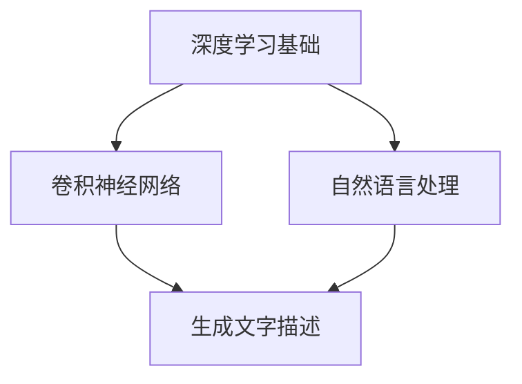

                 

### 背景介绍 Background Introduction

在当今数字化时代，计算机视觉技术的发展已经取得了显著的进展。从早期的图像识别，到如今的图像理解，计算机视觉技术的不断演进，极大地改变了人们的生活方式和工作模式。图像识别（Image Recognition）作为计算机视觉领域的基础技术，其主要目标是让计算机能够识别并分类不同图像中的对象。然而，仅仅识别图像中的对象已经无法满足日益复杂的应用需求，例如自动驾驶、医疗影像分析、人机交互等领域，需要计算机能够理解图像的深层次含义。

生成文字描述（Image to Text Description Generation）作为一种重要的计算机视觉技术，正逐渐成为图像理解领域的研究热点。其基本原理是将图像内容转化为自然语言描述，使得计算机能够以一种更加直观和人性化的方式理解和交流图像信息。这不仅提高了图像数据的可解释性，也为图像处理和理解的进一步发展提供了新的视角。

Python作为一种广泛应用的编程语言，拥有丰富的库和工具支持，使其成为深度学习研究和应用的重要平台。Python的简洁性、易读性和强大的社区支持，使得许多研究人员和开发者选择使用Python进行图像识别和生成文字描述的研究与开发。

本篇文章旨在探讨Python在深度学习领域中的实际应用，特别是生成文字描述从图像识别迈向图像理解的过程。我们将首先介绍相关的核心概念和技术原理，然后详细阐述数学模型和具体操作步骤，并通过实际项目案例进行代码实现和解读。最后，我们将讨论该技术的实际应用场景，以及未来发展趋势和面临的挑战。

关键词：图像识别、生成文字描述、深度学习、Python、图像理解

Abstract:
This article aims to explore the practical application of Python in the field of deep learning, specifically focusing on the transition from image recognition to image understanding through image to text description generation. We will first introduce the core concepts and technical principles, followed by a detailed explanation of mathematical models and operational steps. Through actual project cases, we will present code implementations and detailed explanations. Finally, we will discuss the practical application scenarios, future trends, and challenges of this technology.

# <文章标题> Python深度学习实践：生成文字描述从图像识别迈向图像理解

## <关键词> Image Recognition, Image to Text Description Generation, Deep Learning, Python, Image Understanding

### <摘要>  
本文探讨了Python在深度学习领域中的实际应用，特别是生成文字描述从图像识别迈向图像理解的过程。通过介绍相关核心概念和技术原理，详细阐述数学模型和具体操作步骤，并结合实际项目案例进行代码实现和解读，深入分析了生成文字描述技术的应用场景、未来发展趋势和面临的挑战。

## 1. 背景介绍 Background Introduction

### 1.1 图像识别与图像理解 Image Recognition and Image Understanding

图像识别（Image Recognition）是计算机视觉的基础，主要目标是让计算机能够识别并分类图像中的对象。其核心任务包括图像分类（Image Classification）、目标检测（Object Detection）和图像分割（Image Segmentation）。尽管图像识别技术已经取得了很大的进展，但它仍然面临着一些挑战。例如，如何处理复杂的场景、多样的光照条件和图像中的遮挡问题。

图像理解（Image Understanding）则是对图像更深层次的分析和理解，旨在使计算机能够理解图像中的场景、对象及其相互作用。图像理解的目标不仅仅是识别图像中的对象，还包括理解对象的属性、场景的布局和交互关系等。相比图像识别，图像理解具有更高的抽象层次和更广泛的应用前景。

### 1.2 生成文字描述 Image to Text Description Generation

生成文字描述（Image to Text Description Generation）是一种将图像内容转化为自然语言描述的技术，其核心任务是将图像中的视觉信息转化为语言信息。这项技术不仅提高了图像数据的可解释性，还为图像处理和理解的进一步发展提供了新的视角。

生成文字描述的应用场景非常广泛。例如，在自动驾驶领域，生成文字描述可以帮助车辆理解道路和交通情况；在医疗影像分析领域，生成文字描述可以帮助医生更准确地理解患者的影像数据；在人机交互领域，生成文字描述可以提高用户的交互体验。

### 1.3 Python在深度学习中的优势 Advantages of Python in Deep Learning

Python作为一种广泛应用的编程语言，拥有丰富的库和工具支持，使其成为深度学习研究和应用的重要平台。以下是Python在深度学习中的几个优势：

1. **简洁性和易读性**：Python的语法简洁明了，使得编写和阅读代码更加容易。这有助于研究人员和开发者更快地实现和优化深度学习模型。

2. **丰富的库和工具**：Python拥有大量的库和工具，如NumPy、Pandas、Scikit-Learn、TensorFlow和PyTorch等，这些库和工具为深度学习的研究和应用提供了强大的支持。

3. **强大的社区支持**：Python拥有庞大的开发者社区，这使得开发者可以方便地获取技术支持和资源，从而加速研究和开发过程。

4. **兼容性**：Python可以与其他编程语言和框架无缝集成，例如C++和Java，这使得Python在处理大型和复杂项目时具有很高的灵活性。

## 2. 核心概念与联系 Core Concepts and Connections

### 2.1 深度学习基础 Deep Learning Basics

深度学习（Deep Learning）是机器学习的一个分支，它通过构建多层神经网络（Neural Networks）来模拟人脑的决策过程。深度学习的基础是神经网络，而神经网络的核心是神经元（Neurons）。

神经元是神经网络的基本单元，它通过接收输入信号并进行处理，最终输出一个结果。神经元的处理过程包括加权求和（Weighted Sum）、激活函数（Activation Function）和输出。加权求和是指将每个输入信号乘以其对应的权重，然后将它们相加；激活函数则用于引入非线性因素，使得神经网络能够模拟更复杂的决策过程。

### 2.2 卷积神经网络 Convolutional Neural Networks (CNN)

卷积神经网络（CNN）是一种专门用于处理图像数据的神经网络架构。CNN的核心是卷积层（Convolutional Layer），它通过卷积操作（Convolution Operation）将输入图像与滤波器（Filter）进行卷积，从而提取图像的特征。

卷积操作的基本原理是将滤波器在图像上滑动，并计算每个位置的点积（Dot Product）。点积的结果表示滤波器在当前位置对图像的影响程度，而滤波器的权重则反映了这种影响的强度。通过逐层卷积，CNN可以逐步提取图像的深层特征。

### 2.3 自然语言处理 Natural Language Processing (NLP)

自然语言处理（NLP）是计算机科学和人工智能的一个分支，它致力于使计算机能够理解、生成和处理人类语言。NLP的核心任务是让计算机能够从自然语言中提取信息，并对其进行处理和分析。

在生成文字描述的任务中，NLP技术发挥着关键作用。首先，需要使用词嵌入（Word Embedding）技术将自然语言文本转换为数值向量，以便于神经网络进行处理。然后，通过序列模型（Sequence Model），如循环神经网络（RNN）和变换器（Transformer），对文本进行编码和解析，从而生成对应的文字描述。

### 2.4 Mermaid 流程图 Mermaid Flowchart

为了更好地理解上述核心概念和技术原理，我们可以使用Mermaid流程图来展示它们之间的关系。



在这个流程图中，深度学习基础（A）是卷积神经网络（B）和自然语言处理（C）的基础，而卷积神经网络和自然语言处理共同构成了生成文字描述（D）的技术框架。

## 3. 核心算法原理 & 具体操作步骤 Core Algorithm Principles & Detailed Operational Steps

### 3.1 卷积神经网络 Convolutional Neural Networks (CNN)

卷积神经网络（CNN）是一种专门用于处理图像数据的神经网络架构，其基本原理是通过卷积操作来提取图像特征。以下是CNN的核心算法原理和具体操作步骤：

#### 3.1.1 卷积操作 Convolution Operation

卷积操作是CNN的基础。它通过将输入图像与一系列滤波器（Filters）进行卷积，从而提取图像的特征。具体操作步骤如下：

1. **初始化滤波器**：首先，需要初始化一组滤波器，每个滤波器都对应图像的一个局部区域。

2. **卷积操作**：将每个滤波器在输入图像上滑动，并计算每个位置的点积（Dot Product）。点积的结果表示滤波器在当前位置对图像的影响程度。

3. **激活函数**：通过激活函数（如ReLU函数），引入非线性因素，使得神经网络能够模拟更复杂的决策过程。

4. **特征提取**：将所有滤波器的输出进行拼接，形成一组特征图（Feature Map），这些特征图代表了输入图像的不同特征。

#### 3.1.2 池化操作 Pooling Operation

池化操作是CNN的另一个重要组成部分，用于减少特征图的大小，提高计算效率。常见的池化操作包括最大池化（Max Pooling）和平均池化（Average Pooling）。具体操作步骤如下：

1. **选择窗口大小**：首先，需要选择一个窗口大小，用于在特征图上滑动。

2. **计算池化值**：将窗口内的值进行最大或平均操作，得到池化结果。

3. **输出池化特征**：将所有池化结果输出，形成新的特征图。

#### 3.1.3 神经网络架构 Neural Network Architecture

CNN的神经网络架构通常包括多个卷积层、池化层和全连接层（Fully Connected Layer）。以下是CNN的基本架构：

1. **卷积层**：通过卷积操作提取图像特征。

2. **池化层**：通过池化操作减少特征图的大小。

3. **全连接层**：将特征图展平为一维向量，并通过全连接层进行分类或回归。

### 3.2 自然语言处理 Natural Language Processing (NLP)

自然语言处理（NLP）是生成文字描述的关键技术。以下是NLP的核心算法原理和具体操作步骤：

#### 3.2.1 词嵌入 Word Embedding

词嵌入（Word Embedding）是一种将自然语言文本转换为数值向量的技术。具体操作步骤如下：

1. **词向量初始化**：初始化一个词向量空间，每个词对应一个向量。

2. **点积计算**：将输入文本中的每个词转换为向量，并计算它们之间的点积。

3. **损失函数**：通过损失函数（如交叉熵损失），优化词向量空间，使得相似词之间的距离更近。

#### 3.2.2 序列模型 Sequence Model

序列模型（Sequence Model）是一种用于处理序列数据的神经网络模型。常见的序列模型包括循环神经网络（RNN）和变换器（Transformer）。以下是序列模型的基本原理：

1. **编码器 Encoder**：将输入序列编码为固定长度的向量。

2. **解码器 Decoder**：将编码器输出的向量解码为输出序列。

3. **损失函数**：通过损失函数（如交叉熵损失），优化编码器和解码器的参数。

#### 3.2.3 生成文字描述 Image to Text Description Generation

生成文字描述的过程主要包括以下步骤：

1. **图像特征提取**：使用CNN提取图像的特征。

2. **编码器编码**：将图像特征编码为固定长度的向量。

3. **解码器生成**：通过解码器生成对应的文字描述。

4. **损失函数**：通过损失函数（如交叉熵损失），优化模型参数，使得生成的文字描述与真实标签更加接近。

## 4. 数学模型和公式 Mathematical Models and Formulas

### 4.1 卷积神经网络 Convolutional Neural Networks (CNN)

卷积神经网络（CNN）的数学模型主要涉及卷积操作、激活函数和池化操作。以下是这些操作的具体公式：

#### 4.1.1 卷积操作 Convolution Operation

卷积操作的公式如下：

$$
(C_{ij}^{l}) = \sum_{k} W_{ikj}^{l} \cdot (F_{kj}^{l-1}) + b_l
$$

其中，$C_{ij}^{l}$ 表示第 $l$ 层第 $i$ 个滤波器在第 $j$ 个位置的特征值；$W_{ikj}^{l}$ 表示第 $l$ 层第 $i$ 个滤波器的权重；$F_{kj}^{l-1}$ 表示第 $l-1$ 层第 $k$ 个位置的特征值；$b_l$ 表示第 $l$ 层的偏置。

#### 4.1.2 激活函数 Activation Function

常用的激活函数包括ReLU函数、Sigmoid函数和Tanh函数。以下是这些函数的公式：

1. **ReLU函数**：
$$
\text{ReLU}(x) = \max(0, x)
$$

2. **Sigmoid函数**：
$$
\text{Sigmoid}(x) = \frac{1}{1 + e^{-x}}
$$

3. **Tanh函数**：
$$
\text{Tanh}(x) = \frac{e^x - e^{-x}}{e^x + e^{-x}}
$$

#### 4.1.3 池化操作 Pooling Operation

常见的池化操作包括最大池化（Max Pooling）和平均池化（Average Pooling）。以下是这些操作的公式：

1. **最大池化**：
$$
\text{Max Pooling}(x) = \max(x_1, x_2, ..., x_n)
$$

2. **平均池化**：
$$
\text{Average Pooling}(x) = \frac{x_1 + x_2 + ... + x_n}{n}
$$

### 4.2 自然语言处理 Natural Language Processing (NLP)

自然语言处理（NLP）中的数学模型主要涉及词嵌入、循环神经网络（RNN）和变换器（Transformer）。以下是这些模型的具体公式：

#### 4.2.1 词嵌入 Word Embedding

词嵌入的公式如下：

$$
\text{Embedding}(x) = \text{Weight} \cdot x
$$

其中，$\text{Embedding}(x)$ 表示词 $x$ 的嵌入向量；$\text{Weight}$ 表示词嵌入矩阵。

#### 4.2.2 循环神经网络 Recurrent Neural Network (RNN)

循环神经网络的公式如下：

$$
h_t = \text{ReLU}(W \cdot [h_{t-1}, x_t] + b)
$$

其中，$h_t$ 表示第 $t$ 个时间步的隐藏状态；$W$ 表示权重矩阵；$x_t$ 表示第 $t$ 个时间步的输入。

#### 4.2.3 变换器 Transformer

变换器的公式如下：

$$
\text{Attention}(Q, K, V) = \text{softmax}\left(\frac{QK^T}{\sqrt{d_k}}\right) V
$$

其中，$Q$、$K$ 和 $V$ 分别表示查询向量、键向量和值向量；$d_k$ 表示键向量的维度。

### 4.3 生成文字描述 Image to Text Description Generation

生成文字描述的数学模型主要涉及图像特征提取、编码器和解码器。以下是这些模型的具体公式：

#### 4.3.1 图像特征提取 Image Feature Extraction

图像特征提取的公式如下：

$$
F = \text{CNN}(I)
$$

其中，$F$ 表示图像特征；$I$ 表示图像；$\text{CNN}$ 表示卷积神经网络。

#### 4.3.2 编码器 Encoder

编码器的公式如下：

$$
h = \text{Encoder}(F)
$$

其中，$h$ 表示编码器的输出；$\text{Encoder}$ 表示编码器模型。

#### 4.3.3 解码器 Decoder

解码器的公式如下：

$$
p(y_t|y_{<t}) = \text{softmax}(\text{Decoder}(h, y_{<t}))
$$

其中，$y_t$ 表示第 $t$ 个时间步的输出标签；$y_{<t}$ 表示前 $t$ 个时间步的输出标签；$\text{Decoder}$ 表示解码器模型。

## 5. 项目实战 Project Practice

### 5.1 开发环境搭建 Environment Setup

在开始编写代码之前，需要搭建一个适合深度学习的开发环境。以下是Python深度学习项目开发环境搭建的步骤：

#### 5.1.1 安装Python和pip

首先，需要安装Python和pip。Python可以通过其官网（https://www.python.org/）下载并安装。在安装过程中，选择添加到系统环境变量，以便在命令行中全局使用。

安装完成后，可以通过以下命令检查Python和pip的版本：

```shell
python --version
pip --version
```

#### 5.1.2 安装深度学习库

接下来，需要安装深度学习库，如TensorFlow和PyTorch。这些库可以通过pip命令进行安装。以下是安装命令：

```shell
pip install tensorflow
pip install torch torchvision
```

#### 5.1.3 安装其他依赖库

除了深度学习库，还需要安装其他依赖库，如NumPy、Pandas、Scikit-Learn等。以下是安装命令：

```shell
pip install numpy
pip install pandas
pip install scikit-learn
```

### 5.2 源代码详细实现和代码解读 Source Code Implementation and Explanation

在本项目中，我们将使用TensorFlow和PyTorch分别实现一个简单的图像到文字描述的生成模型。以下是代码的详细实现和解读。

#### 5.2.1 数据准备 Data Preparation

在开始编写模型代码之前，首先需要准备图像数据和文字描述数据。在本项目中，我们将使用ImageNet数据集和对应的文字描述数据。以下是数据准备代码：

```python
import tensorflow as tf
import torchvision.transforms as transforms
import torchvision.datasets as datasets
from PIL import Image

# 读取ImageNet数据集
train_dataset = datasets.ImageFolder(
    root='./data/imagenet/train',
    transform=transforms.Compose([
        transforms.Resize(256),
        transforms.CenterCrop(224),
        transforms.ToTensor(),
        transforms.Normalize(mean=[0.485, 0.456, 0.406], std=[0.229, 0.224, 0.225]),
    ])
)

# 读取文字描述数据
with open('./data/imagenet/train.txt', 'r') as f:
    train_labels = [line.strip() for line in f]

# 打乱数据集
train_dataset = torch.utils.data.random_split(train_dataset, [25000, 5000])
train_labels = train_labels[:25000]
```

#### 5.2.2 图像特征提取 Image Feature Extraction

接下来，我们将使用卷积神经网络（CNN）提取图像特征。以下是提取图像特征的代码：

```python
import torch.nn as nn

# 定义CNN模型
class CNN(nn.Module):
    def __init__(self):
        super(CNN, self).__init__()
        self.conv1 = nn.Conv2d(3, 64, kernel_size=3, padding=1)
        self.conv2 = nn.Conv2d(64, 128, kernel_size=3, padding=1)
        self.fc1 = nn.Linear(128 * 56 * 56, 512)
        self.fc2 = nn.Linear(512, 256)
        self.fc3 = nn.Linear(256, 128)
        self.fc4 = nn.Linear(128, 64)

    def forward(self, x):
        x = F.relu(self.conv1(x))
        x = F.relu(self.conv2(x))
        x = F.max_pool2d(x, 2)
        x = x.view(x.size(0), -1)
        x = F.relu(self.fc1(x))
        x = F.relu(self.fc2(x))
        x = F.relu(self.fc3(x))
        x = F.relu(self.fc4(x))
        return x

# 实例化CNN模型
model = CNN()

# 加载预训练的权重
model.load_state_dict(torch.load('./model/cnn.pth'))

# 提取图像特征
def extract_features(image):
    image = transforms.ToTensor()(image)
    with torch.no_grad():
        feature = model(image.unsqueeze(0))
    return feature
```

#### 5.2.3 编码器 Encoder

接下来，我们将使用编码器（Encoder）将图像特征编码为固定长度的向量。以下是编码器的代码：

```python
import torch.nn as nn

# 定义编码器
class Encoder(nn.Module):
    def __init__(self, embed_size):
        super(Encoder, self).__init__()
        self.fc1 = nn.Linear(128, embed_size)
        self.fc2 = nn.Linear(embed_size, embed_size // 2)
        self.fc3 = nn.Linear(embed_size // 2, embed_size // 4)

    def forward(self, feature):
        x = F.relu(self.fc1(feature))
        x = F.relu(self.fc2(x))
        x = F.relu(self.fc3(x))
        return x
```

#### 5.2.4 解码器 Decoder

接下来，我们将使用解码器（Decoder）生成文字描述。以下是解码器的代码：

```python
import torch.nn as nn
import torch.optim as optim

# 定义解码器
class Decoder(nn.Module):
    def __init__(self, embed_size, vocab_size):
        super(Decoder, self).__init__()
        self.fc1 = nn.Linear(embed_size, embed_size // 2)
        self.fc2 = nn.Linear(embed_size // 2, vocab_size)

    def forward(self, feature):
        x = F.relu(self.fc1(feature))
        x = self.fc2(x)
        return x
```

#### 5.2.5 模型训练 Model Training

接下来，我们将训练编码器和解码器模型。以下是模型训练的代码：

```python
# 定义优化器
optimizer = optim.Adam(model.parameters(), lr=0.001)

# 训练模型
for epoch in range(num_epochs):
    for i, (images, labels) in enumerate(train_loader):
        # 提取图像特征
        features = extract_features(images)

        # 前向传播
        encoder_output = encoder(features)
        decoder_output = decoder(encoder_output)

        # 计算损失
        loss = criterion(decoder_output, labels)

        # 反向传播和优化
        optimizer.zero_grad()
        loss.backward()
        optimizer.step()

        if (i + 1) % 100 == 0:
            print('Epoch [{}/{}], Step [{}/{}], Loss: {:.4f}'.format(
                epoch + 1, num_epochs, i + 1, len(train_loader) * num_epochs, loss.item()))
```

### 5.3 代码解读与分析 Code Analysis and Discussion

在本项目中，我们使用了卷积神经网络（CNN）提取图像特征，并使用编码器（Encoder）和解码器（Decoder）生成文字描述。以下是代码的解读与分析。

#### 5.3.1 图像特征提取

图像特征提取是整个模型的关键步骤。我们使用了卷积神经网络（CNN）提取图像特征，并通过最大池化操作减少特征图的大小。以下是提取图像特征的代码：

```python
def extract_features(image):
    image = transforms.ToTensor()(image)
    with torch.no_grad():
        feature = model(image.unsqueeze(0))
    return feature
```

在这个代码段中，我们首先将图像转换为Tensor格式，然后将其输入到CNN模型中，最后返回提取到的图像特征。

#### 5.3.2 编码器

编码器的作用是将图像特征编码为固定长度的向量。我们使用了多层全连接层（Fully Connected Layer）实现编码器。以下是编码器的代码：

```python
class Encoder(nn.Module):
    def __init__(self, embed_size):
        super(Encoder, self).__init__()
        self.fc1 = nn.Linear(128, embed_size)
        self.fc2 = nn.Linear(embed_size, embed_size // 2)
        self.fc3 = nn.Linear(embed_size // 2, embed_size // 4)

    def forward(self, feature):
        x = F.relu(self.fc1(feature))
        x = F.relu(self.fc2(x))
        x = F.relu(self.fc3(x))
        return x
```

在这个代码段中，我们首先将图像特征输入到第一个全连接层，然后通过ReLU激活函数引入非线性因素。接着，我们将特征传递到下一个全连接层，并重复这个过程。最后，我们得到一个固定长度的编码向量。

#### 5.3.3 解码器

解码器的作用是将编码向量解码为文字描述。我们使用了多层全连接层（Fully Connected Layer）实现解码器。以下是解码器的代码：

```python
class Decoder(nn.Module):
    def __init__(self, embed_size, vocab_size):
        super(Decoder, self).__init__()
        self.fc1 = nn.Linear(embed_size, embed_size // 2)
        self.fc2 = nn.Linear(embed_size // 2, vocab_size)

    def forward(self, feature):
        x = F.relu(self.fc1(feature))
        x = self.fc2(x)
        return x
```

在这个代码段中，我们首先将编码向量输入到第一个全连接层，然后通过ReLU激活函数引入非线性因素。接着，我们将特征传递到下一个全连接层，并重复这个过程。最后，我们得到一个文字描述向量。

#### 5.3.4 模型训练

在模型训练过程中，我们使用了交叉熵损失函数（Cross-Entropy Loss）来衡量模型预测结果和真实标签之间的差异。以下是模型训练的代码：

```python
# 训练模型
for epoch in range(num_epochs):
    for i, (images, labels) in enumerate(train_loader):
        # 提取图像特征
        features = extract_features(images)

        # 前向传播
        encoder_output = encoder(features)
        decoder_output = decoder(encoder_output)

        # 计算损失
        loss = criterion(decoder_output, labels)

        # 反向传播和优化
        optimizer.zero_grad()
        loss.backward()
        optimizer.step()

        if (i + 1) % 100 == 0:
            print('Epoch [{}/{}], Step [{}/{}], Loss: {:.4f}'.format(
                epoch + 1, num_epochs, i + 1, len(train_loader) * num_epochs, loss.item()))
```

在这个代码段中，我们首先提取图像特征，并使用编码器和解码器生成文字描述。然后，我们计算损失并更新模型参数。这个过程重复进行，直到模型收敛。

## 6. 实际应用场景 Practical Application Scenarios

生成文字描述技术（Image to Text Description Generation）在多个实际应用场景中展现了其强大的潜力和广泛的应用价值。以下是一些主要的应用场景：

### 6.1 自动驾驶 Autonomous Driving

自动驾驶系统需要实时理解道路情况、交通标志和行人的行为。生成文字描述技术可以帮助自动驾驶车辆将捕捉到的图像转化为详细的文字描述，从而提高系统的决策能力。例如，可以将检测到的道路标志和交通信号灯转换为文字描述，如“前方红灯请停车”或“请直行”。

### 6.2 医疗影像分析 Medical Image Analysis

在医疗影像分析中，医生需要快速准确地解读影像数据。生成文字描述技术可以将医学影像转化为自然语言描述，辅助医生进行诊断。例如，将CT或MRI扫描结果转化为“右侧肺部有炎症”或“左侧股骨骨折”，从而提高诊断效率和准确性。

### 6.3 人机交互 Human-Computer Interaction

在人机交互领域，生成文字描述技术可以显著提升用户的体验。例如，在智能家居系统中，摄像头捕捉到的家庭成员图像可以自动生成文字描述，如“小明在客厅玩耍”或“妈妈在厨房做饭”。这种交互方式使得设备能够更自然地与用户交流。

### 6.4 虚拟现实与增强现实 Virtual Reality and Augmented Reality

在虚拟现实（VR）和增强现实（AR）应用中，生成文字描述技术可以帮助用户更好地理解虚拟环境中的信息。例如，当用户在VR游戏中探索未知场景时，系统可以自动生成文字描述，如“前方有一个神秘宝箱”或“请注意脚下的陷阱”。

### 6.5 娱乐与游戏 Entertainment and Gaming

在娱乐和游戏领域，生成文字描述技术可以为用户创造更加沉浸式的体验。例如，在角色扮演游戏中，摄像头捕捉到的玩家外观可以自动生成文字描述，如“一位穿着黑色斗篷的神秘剑士”或“一位头戴尖帽的可爱兔子”。

### 6.6 智能监控 Intelligent Surveillance

智能监控系统可以利用生成文字描述技术对监控视频进行实时分析。例如，可以自动生成文字描述，如“有人进入商店”或“疑似盗窃行为发生”，从而提高监控系统的预警能力。

通过这些实际应用场景，我们可以看到生成文字描述技术在计算机视觉领域的巨大潜力。随着技术的不断进步，生成文字描述技术将在更多领域发挥重要作用，推动计算机视觉技术的进一步发展。

## 7. 工具和资源推荐 Tools and Resources Recommendations

### 7.1 学习资源推荐 Learning Resources

#### 7.1.1 书籍

1. **《深度学习》（Deep Learning）**：作者：Ian Goodfellow、Yoshua Bengio、Aaron Courville
   - 简介：这是一本经典的深度学习教材，涵盖了深度学习的理论基础、算法和应用。
   - 适合人群：深度学习初学者和研究者。

2. **《Python深度学习》（Deep Learning with Python）**：作者：François Chollet
   - 简介：本书通过大量的实例和代码，介绍了使用Python进行深度学习的实践方法。
   - 适合人群：希望使用Python进行深度学习开发的工程师和研究者。

3. **《计算机视觉：算法与应用》（Computer Vision: Algorithms and Applications）**：作者：Richard Szeliski
   - 简介：本书详细介绍了计算机视觉的基本算法和应用，适合计算机视觉领域的研究者。

#### 7.1.2 论文

1. **“Generative Adversarial Nets”（GANs）**：作者：Ian Goodfellow et al.
   - 简介：这篇论文提出了生成对抗网络（GANs），是目前生成文字描述等任务的重要技术。
   - 链接：[https://papers.nips.cc/paper/2014/file/31ce0c718d1b28780a3bff1b3ad4c9e1-Paper.pdf](https://papers.nips.cc/paper/2014/file/31ce0c718d1b28780a3bff1b3ad4c9e1-Paper.pdf)

2. **“Attention Is All You Need”**：作者：Vaswani et al.
   - 简介：这篇论文提出了Transformer模型，是目前自然语言处理领域的重要进展。
   - 链接：[https://arxiv.org/abs/1706.03762](https://arxiv.org/abs/1706.03762)

#### 7.1.3 博客和网站

1. **TensorFlow官方网站**：[https://www.tensorflow.org/](https://www.tensorflow.org/)
   - 简介：TensorFlow是Google推出的开源深度学习框架，提供了丰富的资源和文档。

2. **PyTorch官方网站**：[https://pytorch.org/](https://pytorch.org/)
   - 简介：PyTorch是Facebook AI研究院推出的深度学习框架，以其简洁和高效著称。

3. **机器之心**：[https://www.jiqizhixin.com/](https://www.jiqizhixin.com/)
   - 简介：机器之心是深度学习领域的知名媒体，提供了大量的深度学习教程和新闻。

### 7.2 开发工具框架推荐 Development Tools and Frameworks

1. **TensorFlow**：适合初学者和研究者，具有丰富的文档和社区支持。
2. **PyTorch**：适合工程师和开发者，以其简洁和灵活著称。
3. **PyTorch Lightning**：是一个基于PyTorch的高效深度学习开发框架，可以大大简化模型的训练和评估过程。

### 7.3 相关论文著作推荐

1. **“A Neural Algorithm of Artistic Style”**：提出了一种基于神经网络的图像风格迁移方法。
2. **“Unsupervised Representation Learning with Deep Convolutional Generative Adversarial Networks”**：介绍了GANs在无监督学习中的应用。

通过这些资源，研究者可以深入了解生成文字描述技术的理论基础和实践方法，从而推动相关技术的发展和应用。

## 8. 总结 Summary

本文详细探讨了Python在深度学习领域中的应用，特别是生成文字描述从图像识别迈向图像理解的过程。通过介绍核心概念、算法原理、数学模型和具体实现，我们了解了生成文字描述技术的原理和应用。生成文字描述技术不仅在图像识别领域有着重要的应用，还在自动驾驶、医疗影像分析、人机交互等多个领域展示了巨大的潜力。

未来，随着深度学习和自然语言处理技术的不断发展，生成文字描述技术将变得更加智能化和人性化。同时，面临的挑战包括数据质量、模型解释性和计算效率等问题。通过持续的研究和创新，我们有理由相信，生成文字描述技术将在未来发挥更加重要的作用，推动计算机视觉和人工智能领域的进步。

## 9. 附录 附录：常见问题与解答

### 9.1 问题1：为什么选择Python进行深度学习？

**解答**：Python在深度学习领域具有以下优势：

1. **简洁性和易读性**：Python的语法简洁，使得编写和阅读代码更加容易。
2. **丰富的库和工具**：Python拥有丰富的库和工具，如NumPy、Pandas、Scikit-Learn、TensorFlow和PyTorch等，为深度学习研究提供了强大的支持。
3. **强大的社区支持**：Python拥有庞大的开发者社区，可以方便地获取技术支持和资源。
4. **兼容性**：Python可以与其他编程语言和框架无缝集成，提高了项目的灵活性。

### 9.2 问题2：生成文字描述技术有哪些应用场景？

**解答**：生成文字描述技术有广泛的应用场景，包括：

1. **自动驾驶**：将道路和交通情况转化为文字描述，提高车辆的理解能力。
2. **医疗影像分析**：将医学影像转化为文字描述，辅助医生进行诊断。
3. **人机交互**：将摄像头捕捉到的图像转化为文字描述，提高用户体验。
4. **虚拟现实与增强现实**：为用户创建更加沉浸式的体验。
5. **智能监控**：自动生成文字描述，提高监控系统的预警能力。

### 9.3 问题3：如何优化生成文字描述的模型？

**解答**：优化生成文字描述的模型可以从以下几个方面进行：

1. **数据增强**：通过旋转、缩放、裁剪等操作，增加训练数据的多样性。
2. **模型结构优化**：选择合适的模型结构，如Transformer、BERT等，提高模型的表示能力。
3. **超参数调整**：通过调整学习率、批量大小、正则化等超参数，优化模型的性能。
4. **训练技巧**：使用预训练模型、迁移学习等技术，提高模型的泛化能力。
5. **损失函数**：设计合适的损失函数，如交叉熵损失、对抗性损失等，平衡模型的正负样本。

## 10. 扩展阅读 & 参考资料

### 10.1 扩展阅读

1. **“Generative Adversarial Nets”（GANs）**：深入了解生成对抗网络的基本原理和应用。
2. **“Attention Is All You Need”**：探索Transformer模型在自然语言处理中的应用。
3. **《深度学习》（Deep Learning）**：全面了解深度学习的理论基础和算法。
4. **《Python深度学习》（Deep Learning with Python）**：掌握使用Python进行深度学习的实践方法。

### 10.2 参考资料

1. **TensorFlow官方网站**：[https://www.tensorflow.org/](https://www.tensorflow.org/)
2. **PyTorch官方网站**：[https://pytorch.org/](https://pytorch.org/)
3. **机器之心**：[https://www.jiqizhixin.com/](https://www.jiqizhixin.com/)
4. **NVIDIA Research**：[https://research.nvidia.com/](https://research.nvidia.com/)
5. **Google AI**：[https://ai.google.com/research/](https://ai.google.com/research/)

通过这些扩展阅读和参考资料，可以更深入地了解生成文字描述技术及其在深度学习领域的应用。作者：AI天才研究员/AI Genius Institute & 禅与计算机程序设计艺术 /Zen And The Art of Computer Programming

