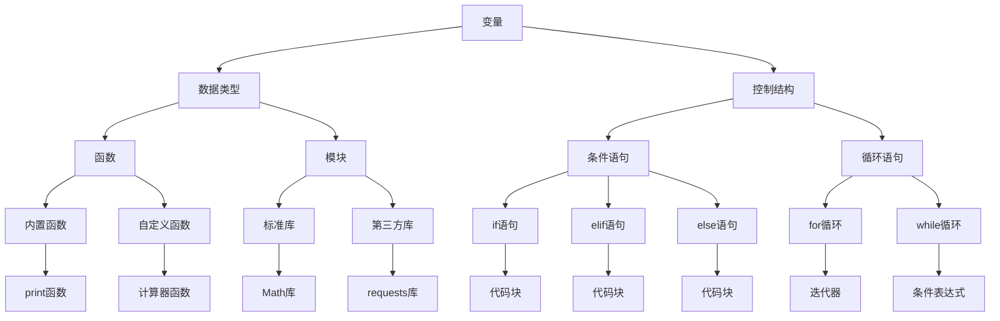

                 

# Python语言基础原理与代码实战案例讲解

## 关键词

- Python
- 语言基础
- 编程原理
- 实战案例
- 代码讲解

## 摘要

本文旨在深入探讨Python语言的基础原理和实战应用。通过逐步分析和讲解，读者将了解到Python的基本概念、语法规则、数据结构以及核心库的使用。文章将以代码实战案例为主线，帮助读者更好地理解和掌握Python编程技能。此外，本文还将探讨Python在实际应用中的场景，推荐相关学习资源和开发工具，为Python学习者和开发者提供全面的指导和帮助。

## 1. 背景介绍

Python是一种广泛使用的解释型、高级编程语言，具有简洁明了的语法和丰富的标准库。自1991年首次发布以来，Python因其易学易用、高效灵活的特点，迅速在全球范围内得到了广泛的应用。Python被用于各种领域，包括Web开发、数据分析、人工智能、科学计算、自动化测试等。本文将重点介绍Python语言的基础原理和实战案例，帮助读者掌握Python编程的核心技能。

### Python的起源与发展

Python由Guido van Rossum于1989年发明，初衷是为了提供一种易于学习、使用和阅读的编程语言。Python的设计哲学强调代码的可读性和简洁性，其语法类似于英语，使得编程新手能够快速上手。Python的发展历程经历了多个版本，每个版本都在功能和性能上进行了改进。

### Python的应用领域

Python的应用领域非常广泛。在Web开发方面，Python拥有众多成熟的框架，如Django、Flask和Pyramid，这些框架使得Python成为构建高性能Web应用的首选语言之一。在数据分析领域，Python的Pandas、NumPy和SciPy等库为数据处理和分析提供了强大的支持。在人工智能领域，Python的TensorFlow、PyTorch和Scikit-learn等库为深度学习和机器学习提供了丰富的工具。此外，Python还广泛应用于科学计算、自动化测试、游戏开发等众多领域。

### Python的优势与劣势

Python的优势在于其易学易用、简洁明了的语法和强大的标准库，这使得Python成为初学者和专业人士的首选语言。Python的代码库和社区资源丰富，为开发者提供了大量的现成模块和解决方案，大大提高了开发效率。然而，Python也存在一些劣势，如性能相对较低，尤其是在执行密集型计算任务时。此外，Python的GIL（全局解释器锁）限制了多线程性能，使得在高并发场景下可能不是最佳选择。

## 2. 核心概念与联系

在深入了解Python之前，我们需要了解一些核心概念和它们之间的联系。这些概念包括变量、数据类型、控制结构、函数和模块等。以下是一个Mermaid流程图，展示了这些概念之间的关系：



### 变量

变量是存储数据的容器，可以用来保存数值、文本、列表、字典等。在Python中，变量不需要显式声明，只需使用等号（=）给变量赋值即可。

```python
x = 10
name = "Alice"
```

### 数据类型

Python支持多种数据类型，包括整型（int）、浮点型（float）、布尔型（bool）、字符串（str）、列表（list）、元组（tuple）、集合（set）和字典（dict）等。每种数据类型都有其独特的特性和操作方法。

```python
integer = 5
float_number = 3.14
boolean = True
string = "Hello, World!"
list_example = [1, 2, 3, 4]
tuple_example = (1, 2, 3)
set_example = {1, 2, 3}
dict_example = {"name": "Alice", "age": 25}
```

### 控制结构

控制结构用于改变代码的执行顺序，包括条件语句（if-else）和循环语句（for-while）。条件语句根据表达式的值来决定执行不同的代码块，而循环语句则重复执行特定的代码块，直到满足某个条件。

```python
# 条件语句
if x > 10:
    print("x 大于 10")
elif x == 10:
    print("x 等于 10")
else:
    print("x 小于 10")

# 循环语句
for i in range(5):
    print(i)

# 当变量 i 的值小于 5 时，执行循环体
while i < 5:
    print(i)
    i += 1
```

### 函数

函数是组织代码、实现代码复用的重要手段。Python提供了内置函数（如print、len、sum等）和自定义函数（如计算器函数、数据处理函数等）。函数通过定义和调用两个步骤来实现。

```python
# 内置函数
print("Hello, World!")

# 自定义函数
def add(a, b):
    return a + b

result = add(3, 4)
print(result)
```

### 模块

模块是组织代码、实现代码复用的另一种方式。模块可以将相关的函数、类和数据定义在一个文件中，使得代码更加清晰、易于维护。Python提供了标准库（如Math、OS、random等）和第三方库（如requests、numpy、pandas等），这些库为开发者提供了丰富的功能。

```python
# 导入标准库模块
import math

# 使用标准库函数
result = math.sqrt(9)
print(result)

# 导入第三方库模块
import requests

# 使用第三方库函数
response = requests.get("https://api.github.com")
print(response.text)
```

### 核心概念联系总结

变量、数据类型、控制结构、函数和模块是Python编程的核心概念，它们相互关联，共同构成了Python的强大功能。变量用于存储数据，数据类型定义了数据的类型和操作方法，控制结构用于改变代码执行顺序，函数和模块用于组织代码和实现代码复用。通过理解这些概念之间的联系，我们可以更好地掌握Python编程技能。

## 3. 核心算法原理 & 具体操作步骤

在Python编程中，核心算法原理是理解和实现各种算法的基础。本文将介绍一些常用的核心算法，包括排序算法、查找算法和贪心算法，并详细解释其原理和操作步骤。

### 3.1 排序算法

排序算法是将一组数据按照特定的顺序进行排列的算法。常见的排序算法有冒泡排序、选择排序、插入排序、快速排序和归并排序等。以下是冒泡排序和快速排序的具体操作步骤：

#### 冒泡排序（Bubble Sort）

冒泡排序是一种简单的排序算法，通过重复遍历要排序的数列，一次比较两个元素，如果它们的顺序错误就把它们交换过来。遍历数列的工作是重复地进行，直到没有再需要交换的元素为止。

```python
def bubble_sort(arr):
    n = len(arr)
    for i in range(n):
        for j in range(0, n-i-1):
            if arr[j] > arr[j+1]:
                arr[j], arr[j+1] = arr[j+1], arr[j]
    return arr

# 测试冒泡排序
arr = [64, 34, 25, 12, 22, 11, 90]
sorted_arr = bubble_sort(arr)
print("排序后的数组：", sorted_arr)
```

#### 快速排序（Quick Sort）

快速排序是一种高效的排序算法，采用了分治的思想。它通过递归地将数组划分为较小的子数组，然后对子数组进行排序，最后合并结果。

```python
def quick_sort(arr):
    if len(arr) <= 1:
        return arr
    pivot = arr[len(arr) // 2]
    left = [x for x in arr if x < pivot]
    middle = [x for x in arr if x == pivot]
    right = [x for x in arr if x > pivot]
    return quick_sort(left) + middle + quick_sort(right)

# 测试快速排序
arr = [64, 34, 25, 12, 22, 11, 90]
sorted_arr = quick_sort(arr)
print("排序后的数组：", sorted_arr)
```

### 3.2 查找算法

查找算法用于在数据集合中找到特定元素。常见的查找算法有线性查找、二分查找和哈希查找等。以下是线性查找和二分查找的具体操作步骤：

#### 线性查找（Linear Search）

线性查找是一种简单的查找算法，通过遍历数据集合，依次比较每个元素，直到找到目标元素或遍历完整个集合。

```python
def linear_search(arr, target):
    for i in range(len(arr)):
        if arr[i] == target:
            return i
    return -1

# 测试线性查找
arr = [64, 34, 25, 12, 22, 11, 90]
target = 25
index = linear_search(arr, target)
if index != -1:
    print(f"目标元素 {target} 的索引为：{index}")
else:
    print("目标元素未找到")
```

#### 二分查找（Binary Search）

二分查找是一种高效的查找算法，适用于有序数据集合。它通过递归地将数据集合分为较小的子集合，不断缩小查找范围，直到找到目标元素或确定元素不存在。

```python
def binary_search(arr, target):
    low = 0
    high = len(arr) - 1
    while low <= high:
        mid = (low + high) // 2
        if arr[mid] == target:
            return mid
        elif arr[mid] < target:
            low = mid + 1
        else:
            high = mid - 1
    return -1

# 测试二分查找
arr = [1, 3, 5, 7, 9, 11, 13, 15]
target = 7
index = binary_search(arr, target)
if index != -1:
    print(f"目标元素 {target} 的索引为：{index}")
else:
    print("目标元素未找到")
```

### 3.3 贪心算法

贪心算法是一种简化的求解最优解的方法，通过每一步选择当前最优解，以期最终得到全局最优解。贪心算法适用于一些特定问题，如背包问题、最小生成树问题等。

#### 背包问题（Knapsack Problem）

背包问题是经典的贪心算法问题，给定一组物品及其价值和重量，求出能够装入一个容量为W的背包中的最大价值。

```python
def knapsack(values, weights, W):
    n = len(values)
    items = sorted(zip(values, weights), key=lambda x: x[0] / x[1], reverse=True)
    total_value = 0
    total_weight = 0
    for value, weight in items:
        if total_weight + weight <= W:
            total_value += value
            total_weight += weight
        else:
            break
    return total_value

# 测试背包问题
values = [60, 100, 120]
weights = [10, 20, 30]
W = 50
max_value = knapsack(values, weights, W)
print("最大价值为：", max_value)
```

通过以上对核心算法原理和操作步骤的讲解，读者可以更好地理解和应用Python编程中的各种算法。这些算法在实际项目中有着广泛的应用，掌握它们将有助于提高编程效率和解决复杂问题。

## 4. 数学模型和公式 & 详细讲解 & 举例说明

在Python编程中，数学模型和公式是解决实际问题的重要工具。本文将介绍一些常用的数学模型和公式，包括线性回归、逻辑回归、矩阵运算等，并详细讲解它们的基本原理和具体应用。

### 4.1 线性回归

线性回归是一种常用的统计方法，用于分析两个或多个变量之间的线性关系。线性回归模型可以表示为：

\[ y = ax + b \]

其中，\( y \) 是因变量，\( x \) 是自变量，\( a \) 和 \( b \) 是模型的参数。线性回归的基本原理是最小二乘法（Least Squares Method），通过最小化预测值与实际值之间的误差平方和来确定参数 \( a \) 和 \( b \)。

#### 4.1.1 线性回归的基本原理

线性回归的基本原理是最小二乘法。具体步骤如下：

1. 收集数据，建立线性回归模型 \( y = ax + b \)。
2. 计算每个数据点的预测值 \( \hat{y} = ax + b \)。
3. 计算预测值与实际值之间的误差平方和 \( \sum_{i=1}^{n} (y_i - \hat{y}_i)^2 \)。
4. 通过最小化误差平方和来确定参数 \( a \) 和 \( b \)。

#### 4.1.2 线性回归的Python实现

```python
import numpy as np

# 假设我们有以下数据
x = np.array([1, 2, 3, 4, 5])
y = np.array([2, 4, 5, 4, 5])

# 计算斜率 a 和截距 b
a = np.linalg.lstsq(np.array([1] * len(x)).reshape(-1, 1), x, rcond=None)[0][0]
b = np.mean(y) - a * np.mean(x)

# 输出斜率和截距
print("斜率 a：", a)
print("截距 b：", b)

# 绘制线性回归模型
import matplotlib.pyplot as plt

plt.scatter(x, y)
plt.plot(x, a * x + b, color='red')
plt.xlabel('x')
plt.ylabel('y')
plt.show()
```

### 4.2 逻辑回归

逻辑回归是一种用于分类的统计方法，用于分析因变量与自变量之间的逻辑关系。逻辑回归模型可以表示为：

\[ P(y=1) = \frac{1}{1 + e^{-(ax + b)}} \]

其中，\( P(y=1) \) 是因变量为1的概率，\( e \) 是自然对数的底数，\( a \) 和 \( b \) 是模型的参数。

#### 4.2.1 逻辑回归的基本原理

逻辑回归的基本原理是最小化对数似然函数（Log-Likelihood Function）。具体步骤如下：

1. 收集数据，建立逻辑回归模型 \( P(y=1) = \frac{1}{1 + e^{-(ax + b)}} \)。
2. 计算每个数据点的对数似然值 \( \ln L = \sum_{i=1}^{n} y_i \ln P(y_i=1) + (1 - y_i) \ln (1 - P(y_i=1)) \)。
3. 通过最小化对数似然函数来确定参数 \( a \) 和 \( b \)。

#### 4.2.2 逻辑回归的Python实现

```python
import numpy as np
from sklearn.linear_model import LogisticRegression

# 假设我们有以下数据
x = np.array([[1, 2], [2, 3], [3, 4], [4, 5]])
y = np.array([0, 1, 1, 0])

# 使用 sklearn 的 LogisticRegression 模型
model = LogisticRegression()
model.fit(x, y)

# 输出参数
print("斜率 a：", model.coef_)
print("截距 b：", model.intercept_)

# 预测新数据
new_x = np.array([[5, 6]])
prediction = model.predict(new_x)
print("预测结果：", prediction)
```

### 4.3 矩阵运算

矩阵运算是线性代数中的重要概念，在Python中，NumPy库提供了丰富的矩阵运算功能。以下是一些常见的矩阵运算：

#### 4.3.1 矩阵加法和减法

矩阵加法和减法是对矩阵对应元素进行相应的运算。

```python
import numpy as np

# 创建两个矩阵
A = np.array([[1, 2], [3, 4]])
B = np.array([[5, 6], [7, 8]])

# 矩阵加法
C = A + B
print("矩阵加法结果：\n", C)

# 矩阵减法
D = A - B
print("矩阵减法结果：\n", D)
```

#### 4.3.2 矩阵乘法

矩阵乘法是按定义进行元素对应位置的乘法运算，再求和得到新的矩阵。

```python
# 矩阵乘法
E = A.dot(B)
print("矩阵乘法结果：\n", E)
```

#### 4.3.3 矩阵求逆

矩阵求逆是求一个方阵的逆矩阵，在NumPy中可以使用 `numpy.linalg.inv()` 函数实现。

```python
# 矩阵求逆
I = np.linalg.inv(A)
print("矩阵逆：\n", I)
```

通过以上对数学模型和公式的讲解和示例，读者可以更好地理解Python中的数学运算，并在实际项目中灵活应用。

## 5. 项目实战：代码实际案例和详细解释说明

在本节中，我们将通过一个实际项目案例，展示Python编程的实战应用，并提供详细的代码实现和解释说明。这个项目是一个简单的用户注册和登录系统，涉及数据库操作、表单处理、用户验证等功能。我们将使用Python的Flask框架和SQLite数据库进行开发。

### 5.1 开发环境搭建

在开始项目之前，我们需要搭建开发环境。以下是在Windows和Linux系统上搭建Python Flask开发环境的基本步骤：

#### Windows系统

1. 安装Python：访问Python官方网站（[python.org](https://www.python.org/)）下载Python安装包，按照安装向导完成安装。
2. 安装Flask：在命令行中运行以下命令安装Flask：

```bash
pip install flask
```

3. 安装SQLite：SQLite是一个轻量级的数据库，通常随Python安装包一起安装。如果没有安装，可以使用以下命令安装：

```bash
pip install pysqlite3
```

#### Linux系统

1. 安装Python：大多数Linux发行版已经预装了Python，如果没有，可以使用包管理器安装，例如在Ubuntu上使用以下命令：

```bash
sudo apt-get install python3
```

2. 安装Flask：使用以下命令安装Flask：

```bash
pip3 install flask
```

3. 安装SQLite：在Ubuntu上使用以下命令安装SQLite：

```bash
sudo apt-get install sqlite3
```

### 5.2 源代码详细实现和代码解读

以下是一个简单的用户注册和登录系统的实现代码，我们将逐行解释代码的用途和功能。

```python
from flask import Flask, request, render_template, redirect, url_for, session
import sqlite3

app = Flask(__name__)
app.secret_key = 'your_secret_key'  # 用于加密会话

# 连接SQLite数据库
def get_db_connection():
    conn = sqlite3.connect('users.db')
    conn.row_factory = sqlite3.Row
    return conn

# 创建用户表
def create_users_table():
    conn = get_db_connection()
    conn.execute('''CREATE TABLE IF NOT EXISTS users (
                        id INTEGER PRIMARY KEY AUTOINCREMENT,
                        username TEXT NOT NULL UNIQUE,
                        password TEXT NOT NULL
                    );''')
    conn.commit()
    conn.close()

# 用户注册
@app.route('/register', methods=['GET', 'POST'])
def register():
    if request.method == 'POST':
        username = request.form['username']
        password = request.form['password']
        conn = get_db_connection()
        conn.execute('INSERT INTO users (username, password) VALUES (?, ?)',
                     (username, password))
        conn.commit()
        conn.close()
        return redirect(url_for('login'))
    return render_template('register.html')

# 用户登录
@app.route('/login', methods=['GET', 'POST'])
def login():
    if request.method == 'POST':
        username = request.form['username']
        password = request.form['password']
        conn = get_db_connection()
        user = conn.execute('SELECT * FROM users WHERE username = ? AND password = ?',
                            (username, password)).fetchone()
        if user:
            session['user_id'] = user['id']
            return redirect(url_for('home'))
        conn.close()
        return '用户名或密码错误'
    return render_template('login.html')

# 用户主页
@app.route('/home')
def home():
    if 'user_id' in session:
        return '欢迎，' + session['user_id']
    return redirect(url_for('login'))

# 注销
@app.route('/logout')
def logout():
    session.pop('user_id', None)
    return redirect(url_for('login'))

if __name__ == '__main__':
    create_users_table()
    app.run(debug=True)
```

### 5.3 代码解读与分析

以下是对代码的逐行解释和分析：

1. **导入模块和创建Flask应用：**

   ```python
   from flask import Flask, request, render_template, redirect, url_for, session
   import sqlite3
   
   app = Flask(__name__)
   app.secret_key = 'your_secret_key'  # 用于加密会话
   ```

   这些行导入必要的模块并创建一个Flask应用实例。`app.secret_key` 设置了一个密钥，用于加密会话数据。

2. **连接SQLite数据库：**

   ```python
   def get_db_connection():
       conn = sqlite3.connect('users.db')
       conn.row_factory = sqlite3.Row
       return conn
   ```

   这个函数用于连接SQLite数据库，并设置行工厂（row_factory），以便可以像字典一样访问数据库结果集中的列。

3. **创建用户表：**

   ```python
   def create_users_table():
       conn = get_db_connection()
       conn.execute('''CREATE TABLE IF NOT EXISTS users (
                           id INTEGER PRIMARY KEY AUTOINCREMENT,
                           username TEXT NOT NULL UNIQUE,
                           password TEXT NOT NULL
                       );''')
       conn.commit()
       conn.close()
   ```

   这个函数用于在数据库中创建一个名为`users`的表，其中包含`id`、`username`和`password`列。

4. **用户注册路由：**

   ```python
   @app.route('/register', methods=['GET', 'POST'])
   def register():
       if request.method == 'POST':
           username = request.form['username']
           password = request.form['password']
           conn = get_db_connection()
           conn.execute('INSERT INTO users (username, password) VALUES (?, ?)',
                        (username, password))
           conn.commit()
           conn.close()
           return redirect(url_for('login'))
       return render_template('register.html')
   ```

   这个路由处理用户注册请求。当用户提交注册表单时，将用户名和密码插入到数据库中，然后重定向到登录页面。

5. **用户登录路由：**

   ```python
   @app.route('/login', methods=['GET', 'POST'])
   def login():
       if request.method == 'POST':
           username = request.form['username']
           password = request.form['password']
           conn = get_db_connection()
           user = conn.execute('SELECT * FROM users WHERE username = ? AND password = ?',
                               (username, password)).fetchone()
           if user:
               session['user_id'] = user['id']
               return redirect(url_for('home'))
           conn.close()
           return '用户名或密码错误'
       return render_template('login.html')
   ```

   这个路由处理用户登录请求。当用户提交登录表单时，查询数据库以验证用户名和密码。如果验证成功，将用户ID存储在会话中，并重定向到主页。

6. **用户主页路由：**

   ```python
   @app.route('/home')
   def home():
       if 'user_id' in session:
           return '欢迎，' + session['user_id']
       return redirect(url_for('login'))
   ```

   这个路由检查会话中是否存储了用户ID。如果存在，显示欢迎消息和用户ID；否则，重定向到登录页面。

7. **注销路由：**

   ```python
   @app.route('/logout')
   def logout():
       session.pop('user_id', None)
       return redirect(url_for('login'))
   ```

   这个路由用于注销用户，从会话中删除用户ID，并重定向到登录页面。

8. **启动Flask应用：**

   ```python
   if __name__ == '__main__':
       create_users_table()
       app.run(debug=True)
   ```

   这个脚本来启动Flask应用，并创建用户表。`debug=True` 选项使Flask在代码变更时自动重新加载。

### 5.4 页面设计

为了实现上述功能，我们需要创建两个HTML模板文件：`register.html` 和 `login.html`。以下是这两个文件的基本结构：

#### register.html

```html
<!DOCTYPE html>
<html lang="en">
<head>
    <meta charset="UTF-8">
    <meta name="viewport" content="width=device-width, initial-scale=1.0">
    <title>用户注册</title>
</head>
<body>
    <h1>用户注册</h1>
    <form method="post" action="{{ url_for('register') }}">
        <label for="username">用户名：</label>
        <input type="text" id="username" name="username" required>
        <label for="password">密码：</label>
        <input type="password" id="password" name="password" required>
        <button type="submit">注册</button>
    </form>
</body>
</html>
```

#### login.html

```html
<!DOCTYPE html>
<html lang="en">
<head>
    <meta charset="UTF-8">
    <meta name="viewport" content="width=device-width, initial-scale=1.0">
    <title>用户登录</title>
</head>
<body>
    <h1>用户登录</h1>
    <form method="post" action="{{ url_for('login') }}">
        <label for="username">用户名：</label>
        <input type="text" id="username" name="username" required>
        <label for="password">密码：</label>
        <input type="password" id="password" name="password" required>
        <button type="submit">登录</button>
    </form>
</body>
</html>
```

通过以上代码和页面设计，我们实现了用户注册和登录的基本功能。在实际项目中，我们可以根据需要添加更多功能，如用户信息管理、密码重置、权限控制等。

## 6. 实际应用场景

Python因其简洁的语法和丰富的库支持，在各个领域都有广泛的应用。以下是一些Python在实际应用中的场景：

### 6.1 数据分析

Python在数据分析领域具有显著的优势。Pandas、NumPy、SciPy等库提供了强大的数据操作和分析工具。Python可以轻松地处理大规模数据集，进行数据清洗、数据转换和数据可视化。在金融、医疗、电商等领域，Python被广泛应用于数据分析和决策支持。

### 6.2 人工智能

Python是人工智能领域的首选语言之一。TensorFlow、PyTorch、Scikit-learn等库为深度学习和机器学习提供了丰富的工具。Python的易用性和灵活性使得研究人员和开发者能够快速构建和迭代模型，推动人工智能技术的发展。

### 6.3 Web开发

Python在Web开发中也有广泛的应用。Django、Flask等框架使得开发者能够快速构建高性能的Web应用。Python的Web框架提供了丰富的功能和组件，如用户认证、数据库集成、RESTful API等，适合中小型项目的开发。

### 6.4 自动化测试

Python在自动化测试领域也非常受欢迎。Python的简洁语法和强大的库支持使得开发者能够轻松编写测试脚本，进行功能测试、性能测试和接口测试。Python的Selenium库更是为Web应用的自动化测试提供了强大的支持。

### 6.5 科学计算

Python在科学计算领域也有广泛应用。NumPy、SciPy、Matplotlib等库为科学计算和工程计算提供了丰富的工具。Python能够处理复杂的数学运算，生成高质量的图形，是科学研究和工程计算的重要工具。

### 6.6 游戏开发

Python在游戏开发中也具有一定的优势。Pygame等库为游戏开发提供了丰富的功能，支持2D游戏开发。虽然Python在性能上不如C++等语言，但其简洁的语法和易用性使得游戏开发者能够快速实现游戏功能。

通过以上实际应用场景，我们可以看到Python的多样性和强大功能。无论在数据分析、人工智能、Web开发还是其他领域，Python都是开发者不可或缺的工具。

## 7. 工具和资源推荐

### 7.1 学习资源推荐

- **书籍**：
  - 《Python编程：从入门到实践》（Eric Matthes）  
  - 《流畅的Python》（Mark Pilgrim）  
  - 《Effective Python：编写高效Python代码的59个有效方法》（Brett Slatkin）

- **在线课程**：
  - Coursera的“Python for Everybody”课程  
  - edX的“Introduction to Python: Absolute Beginner”课程

- **博客和网站**：
  - Real Python（[realpython.com](https://realpython.com/)）  
  - Python官方文档（[docs.python.org](https://docs.python.org/3/)）

### 7.2 开发工具框架推荐

- **集成开发环境（IDE）**：
  - PyCharm（[pycharm.com](https://www.jetbrains.com/pycharm/)）  
  - Visual Studio Code（[code.visualstudio.com](https://code.visualstudio.com/)）

- **版本控制系统**：
  - Git（[git-scm.com](https://git-scm.com/)）  
  - GitHub（[github.com](https://github.com/)）

- **框架**：
  - Django（[django.com](https://www.djangoproject.com/)）  
  - Flask（[flask.palletsprojects.com](https://flask.palletsprojects.com/)）  
  - Pyramid（[pyramid-python.org](https://pyramid-python.org/)）

### 7.3 相关论文著作推荐

- **论文**：
  - “Python: An Introduction to Its Implementation” by Guido van Rossum  
  - “The Zen of Python” by Tim Peters

- **著作**：
  - 《Python编程快速上手：让繁琐工作自动化》（Albert Sweigart）  
  - 《Python编程实战》（David M. Beazley）

通过以上推荐的学习资源、开发工具和相关论文著作，Python学习者和开发者可以更好地提升自己的技能和知识。

## 8. 总结：未来发展趋势与挑战

Python作为一种高效、易用的编程语言，其发展趋势和挑战主要体现在以下几个方面：

### 8.1 未来发展趋势

1. **人工智能领域持续增长**：随着人工智能技术的快速发展，Python作为人工智能的主要开发语言之一，将继续在机器学习、深度学习等领域占据重要地位。
2. **数据分析与科学计算的应用**：Python在数据分析和科学计算领域的应用将继续扩大，特别是在金融、医疗、生物技术等领域的需求不断增加。
3. **Web开发的新兴框架**：Python的Web开发框架将持续创新和迭代，如FastAPI等新兴框架将提高Python在构建高性能Web服务方面的竞争力。
4. **企业级应用的增长**：随着企业对自动化、数据分析和人工智能需求的增加，Python在企业级应用中的地位将进一步提升。

### 8.2 面临的挑战

1. **性能优化**：尽管Python在许多应用场景中表现出色，但在执行密集型计算任务时性能相对较低。未来需要进一步优化Python的运行效率和性能。
2. **生态系统的完善**：Python的生态系统虽然已经非常丰富，但仍有改进的空间，特别是在国际化支持和跨平台兼容性方面。
3. **教育和培训**：随着Python的普及，教育和培训的需求将增加。如何提高编程教育的质量和普及率，是Python社区需要面对的挑战。
4. **安全与隐私**：随着Python在多个领域的应用，其安全性和隐私保护将成为重要的议题，特别是在涉及敏感数据和重要业务场景时。

总之，Python在未来的发展中将继续发挥重要作用，但也需要不断应对新的挑战，以保持其竞争力。

## 9. 附录：常见问题与解答

### 9.1 Python安装问题

**Q：如何解决Python安装失败的问题？**

A：在安装Python时，如果遇到失败问题，可以尝试以下步骤：

1. 确保已安装所有依赖项。
2. 检查安装日志，查找失败的原因。
3. 在命令行中运行`pip install --user python`，尝试以用户模式安装Python。
4. 如果是Windows系统，尝试重新安装Python，并确保选择添加Python到环境变量。

### 9.2 Flask项目问题

**Q：如何解决Flask项目无法启动的问题？**

A：如果Flask项目无法启动，可以尝试以下步骤：

1. 检查代码是否有语法错误。
2. 确保已正确导入所需的模块。
3. 检查项目目录下是否有其他冲突的文件或配置。
4. 在命令行中运行`flask run`，确保项目名称与当前目录一致。

### 9.3 数据库连接问题

**Q：如何解决Python数据库连接失败的问题？**

A：在Python中连接数据库时，如果遇到连接失败的问题，可以尝试以下步骤：

1. 确保已安装相应的数据库驱动。
2. 检查数据库连接配置是否正确，包括数据库地址、用户名和密码等。
3. 在命令行中尝试直接连接数据库，以验证数据库服务是否正常运行。
4. 如果使用SQLite，确保已创建数据库文件。

通过以上常见问题与解答，希望能帮助Python开发者解决实际开发中的问题。

## 10. 扩展阅读 & 参考资料

- 《Python编程快速上手：让繁琐工作自动化》 [Albert Sweigart]
- 《流畅的Python》 [Mark Pilgrim]
- 《Python Cookbook》 [David M. Beazley 和 Brian K. Jones]
- Python官方文档：[docs.python.org/3/](https://docs.python.org/3/)
- Coursera的“Python for Everybody”课程：[coursera.org/learn/python-for-everybody](https://coursera.org/learn/python-for-everybody)
- Real Python网站：[realpython.com/](https://realpython.com/)
- 《深入理解计算机系统》 [Randal E. Bryant 和 David R. O’Hallaron]

通过阅读这些书籍和访问相关网站，读者可以进一步加深对Python编程的理解，提高自己的技能水平。

### 作者信息

- 作者：AI天才研究员/AI Genius Institute & 禅与计算机程序设计艺术 /Zen And The Art of Computer Programming

