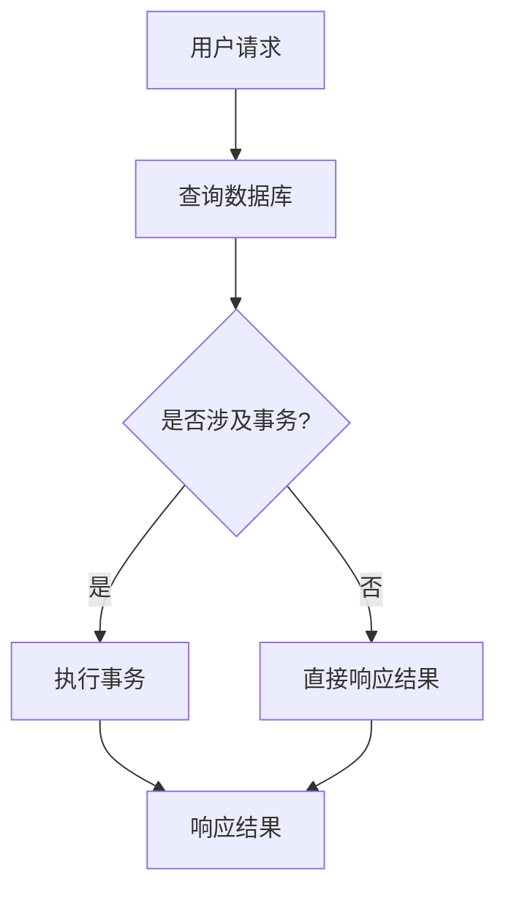

                 

# QPS与TPS的最佳实践

## 概述

在IT领域，QPS（每秒查询率）和TPS（每秒事务数）是衡量系统性能的两个关键指标。QPS指的是系统每秒能够处理的查询数量，通常用于数据库系统或Web服务的性能评估。而TPS则是指系统每秒能够完成的事务数量，更侧重于交易处理能力。本文将深入探讨QPS和TPS的概念、联系、差异，以及它们在系统设计和优化中的应用。

本文将分为以下几个部分：

1. 背景介绍
2. 核心概念与联系
3. 核心算法原理 & 具体操作步骤
4. 数学模型和公式 & 详细讲解 & 举例说明
5. 项目实战：代码实际案例和详细解释说明
6. 实际应用场景
7. 工具和资源推荐
8. 总结：未来发展趋势与挑战
9. 附录：常见问题与解答
10. 扩展阅读 & 参考资料

通过本文的阅读，读者将全面了解QPS和TPS的基本概念，掌握它们在系统性能评估和优化中的重要性，并学会如何在实际项目中应用这些概念来提升系统的性能。

## 1. 背景介绍

QPS（每秒查询率）和TPS（每秒事务数）是衡量系统性能的两个关键指标，广泛应用于数据库系统、Web服务和分布式系统的性能评估。

QPS通常用于衡量数据库或Web服务的查询处理能力。一个高QPS的系统意味着它能够在短时间内处理大量的查询请求。对于Web服务来说，高QPS意味着系统能够快速响应用户的请求，提供良好的用户体验。对于数据库系统，高QPS则意味着系统能够快速处理用户的查询请求，提高数据处理效率。

TPS则侧重于交易处理能力。在金融、电子商务等需要处理大量交易的应用场景中，TPS成为衡量系统性能的重要指标。一个高TPS的系统意味着它能够在短时间内处理大量的交易请求，确保交易的及时处理和系统的稳定性。

在实际应用中，QPS和TPS往往需要同时考虑。例如，在一个电商平台上，高QPS能够确保用户查询商品信息的快速响应，而高TPS则能够确保订单处理的及时性。因此，在设计系统时，需要根据应用场景的需求，权衡QPS和TPS的关系，优化系统性能。

## 2. 核心概念与联系

### QPS的概念

QPS（每秒查询率）是指系统每秒能够处理的查询数量。在数据库系统中，一个查询通常是指对数据库的SELECT、INSERT、UPDATE、DELETE等操作。QPS可以用来衡量数据库的处理能力，表示数据库在单位时间内能够完成多少查询操作。

### TPS的概念

TPS（每秒事务数）是指系统每秒能够处理的事务数量。事务是数据库中的一个概念，指的是一系列操作序列，这些操作要么全部成功，要么全部失败。事务通常包括SELECT、INSERT、UPDATE、DELETE等操作。TPS可以用来衡量系统的交易处理能力，表示系统在单位时间内能够完成多少事务操作。

### QPS与TPS的联系

QPS和TPS之间存在一定的联系。在某些情况下，一个查询操作可以被视为一个事务的一部分。例如，在一个电商平台上，用户查询商品信息可能是一个查询操作，而下单操作则是一个事务。在这种情况下，QPS和TPS可以直接相加，以衡量系统在单位时间内能够完成多少查询和事务操作。

然而，在另一些情况下，一个查询操作可能包含多个事务。例如，在一个金融系统中，一个查询可能涉及到多个账户的余额查询和更新。在这种情况下，QPS和TPS不能简单相加，而需要根据具体的应用场景进行权衡。

### Mermaid流程图

为了更好地理解QPS和TPS的概念及其联系，我们可以使用Mermaid流程图来展示一个简单的应用场景。



在这个流程图中，用户请求引发了一个查询数据库的操作。如果这个查询涉及事务，系统会执行事务操作，然后响应结果。如果查询不涉及事务，系统会直接响应结果。

通过这个简单的流程图，我们可以清晰地看到QPS和TPS在系统中的实际应用。在实际设计中，我们需要根据具体的应用场景和需求，权衡QPS和TPS的关系，以优化系统性能。

### QPS与TPS的差异

尽管QPS和TPS在概念上有一定的联系，但它们之间也存在明显的差异。

1. **计算方式**：QPS通常以每秒查询次数来计算，而TPS则以每秒事务次数来计算。这意味着QPS更侧重于查询处理能力，而TPS更侧重于事务处理能力。
2. **应用场景**：QPS通常应用于数据库系统、Web服务等需要快速响应查询请求的场景，而TPS则应用于金融、电子商务等需要高交易处理能力的场景。
3. **优化策略**：针对QPS的优化通常包括数据库索引、缓存、查询优化等，而针对TPS的优化则包括数据库分片、读写分离、分布式事务等。

在实际应用中，我们需要根据具体的需求和场景，灵活地选择和优化QPS和TPS，以提升系统的整体性能。

### QPS与TPS的关系

QPS和TPS之间的关系取决于具体的应用场景。在某些情况下，QPS和TPS可以直接相加，例如在查询操作不涉及事务的情况下。而在另一些情况下，QPS和TPS则需要根据事务的复杂性进行权衡。

例如，在一个电商平台上，用户查询商品信息可能是一个查询操作，而下单操作则是一个事务。在这种情况下，如果我们假设每个用户查询商品信息的平均时间为100毫秒，而每个下单事务的平均时间为1000毫秒，那么系统的QPS和TPS分别为：

- QPS = 10（每秒10次查询）
- TPS = 1（每秒1个事务）

在这种情况下，QPS和TPS可以直接相加，以衡量系统的整体性能。

然而，在金融系统中，一个查询可能涉及到多个账户的余额查询和更新，这意味着一个查询操作实际上可能包含了多个事务。在这种情况下，我们需要根据事务的复杂性进行权衡，以确定系统的QPS和TPS。

例如，在一个金融系统中，一个查询可能需要同时查询两个账户的余额，并将两个账户的余额相加，然后更新一个账户的余额。在这种情况下，如果我们假设每个账户的余额查询和更新需要100毫秒，那么系统的QPS和TPS分别为：

- QPS = 1（每秒1次查询）
- TPS = 2（每秒2个事务）

在这种情况下，QPS和TPS不能简单相加，因为一个查询实际上包含了两个事务。

通过这个简单的例子，我们可以看到QPS和TPS之间的关系取决于具体的应用场景和事务的复杂性。在实际设计中，我们需要根据具体的需求和场景，灵活地选择和优化QPS和TPS，以提升系统的整体性能。

### 2.1. QPS的计算方法

QPS（每秒查询率）是衡量系统处理查询请求能力的指标。计算QPS的方法可以根据不同的应用场景和系统架构有所差异，但基本的计算公式如下：

\[ QPS = \frac{Total\ Queries}{Time\ Period} \]

其中，Total Queries 表示在某一时间段内系统处理的查询总数，Time Period 表示该时间段（通常以秒为单位）。

以下是一些常见的计算QPS的方法：

1. **固定时间窗口**：在固定的时间窗口（例如1分钟）内，统计系统处理的查询总数，然后除以时间窗口的长度（例如60秒）。

   \[ QPS = \frac{Total\ Queries\ in\ 1\ minute}{60\ seconds} \]

2. **滑动时间窗口**：在一段时间内（例如5分钟），统计系统处理的查询总数，然后除以时间窗口的长度。

   \[ QPS = \frac{Total\ Queries\ in\ 5\ minutes}{5\ minutes} \]

3. **实时监控**：使用实时监控系统（如Prometheus、Grafana等），持续监控系统的查询请求，并实时计算QPS。

   \[ QPS = \frac{Current\ Queries\ per\ second}{Current\ Time} \]

每种方法都有其适用场景，具体选择应根据系统的需求和实际情况。例如，固定时间窗口方法简单易用，适合用于常规性能监控；而滑动时间窗口方法则更适用于动态变化的场景；实时监控方法则提供了更高的实时性，但通常需要更复杂的监控工具和技术支持。

### 2.2. TPS的计算方法

TPS（每秒事务数）是衡量系统处理事务能力的指标。计算TPS的方法与QPS类似，但需要考虑事务的定义和系统的架构。基本计算公式如下：

\[ TPS = \frac{Total\ Transactions}{Time\ Period} \]

其中，Total Transactions 表示在某一时间段内系统处理的事务总数，Time Period 表示该时间段（通常以秒为单位）。

以下是一些常见的计算TPS的方法：

1. **固定时间窗口**：在固定的时间窗口（例如1分钟）内，统计系统处理的事务总数，然后除以时间窗口的长度（例如60秒）。

   \[ TPS = \frac{Total\ Transactions\ in\ 1\ minute}{60\ seconds} \]

2. **滑动时间窗口**：在一段时间内（例如5分钟），统计系统处理的事务总数，然后除以时间窗口的长度。

   \[ TPS = \frac{Total\ Transactions\ in\ 5\ minutes}{5\ minutes} \]

3. **实时监控**：使用实时监控系统（如Prometheus、Grafana等），持续监控系统的事务请求，并实时计算TPS。

   \[ TPS = \frac{Current\ Transactions\ per\ second}{Current\ Time} \]

与QPS类似，每种计算方法都有其适用场景。固定时间窗口方法简单易用，适合用于常规性能监控；滑动时间窗口方法则更适用于动态变化的场景；实时监控方法则提供了更高的实时性，但通常需要更复杂的监控工具和技术支持。

在实际应用中，TPS的计算方法通常需要结合具体的系统架构和业务需求进行调整。例如，对于分布式系统，可能需要考虑分布式事务的处理能力，以及系统间的协调和一致性。

### 3. 核心算法原理 & 具体操作步骤

在深入探讨QPS和TPS的计算和优化之前，我们需要了解一些核心算法原理和具体操作步骤。这些算法和步骤不仅有助于我们理解QPS和TPS的计算方法，还能为后续的优化提供理论基础。

#### 3.1. 基本算法原理

QPS和TPS的计算本质上是对系统在一定时间窗口内处理请求的统计。以下是计算QPS和TPS的基本算法原理：

1. **固定时间窗口算法**：
   - 选择一个固定的时间窗口（例如1分钟）。
   - 在时间窗口内，记录系统处理的查询或事务数量。
   - 时间窗口结束时，将记录的查询或事务总数除以时间窗口长度，得到QPS或TPS。

   \[ QPS/TPS = \frac{Total\ Queries/Transactions}{Time\ Window\ Length} \]

2. **滑动时间窗口算法**：
   - 选择一个滑动时间窗口（例如5分钟）。
   - 在每个时间窗口内，记录系统处理的查询或事务数量。
   - 时间窗口向前滑动时，将新时间窗口的查询或事务数量加入总计数，同时减去离开时间窗口的查询或事务数量。
   - 每个时间窗口结束时，计算当前的QPS或TPS。

   \[ QPS/TPS = \frac{Current\ Window\ Count - Previous\ Window\ Count}{Time\ Window\ Length} \]

3. **实时监控算法**：
   - 使用实时监控系统（如Prometheus、Grafana等）。
   - 持续收集系统的查询或事务数据。
   - 根据当前时间，实时计算QPS或TPS。

   \[ QPS/TPS = \frac{Current\ Queries/Transactions}{Current\ Time} \]

#### 3.2. 具体操作步骤

以下是一个简单的示例，说明如何使用固定时间窗口算法计算QPS和TPS。

**示例：计算1分钟内的QPS和TPS**

1. **初始化**：
   - 选择一个1分钟的时间窗口。
   - 初始化查询和事务计数器，分别为0。

2. **统计查询和事务**：
   - 在1分钟内，系统处理了100次查询和50次事务。

3. **计算QPS和TPS**：
   - 将记录的查询和事务总数除以时间窗口长度（60秒）。

   \[ QPS = \frac{100\ Queries}{60\ seconds} = 1.67\ Queries/second \]
   \[ TPS = \frac{50\ Transactions}{60\ seconds} = 0.83\ Transactions/second \]

4. **结果分析**：
   - 系统在1分钟内的QPS为1.67，TPS为0.83。

#### 3.3. 考虑并发请求

在实际系统中，并发请求是一个常见现象。在计算QPS和TPS时，需要考虑并发请求的影响。

1. **并发请求示例**：
   - 在1分钟内，系统处理了100次查询，其中前30秒内有50次查询，后30秒内有50次查询。
   - 同时，系统处理了50次事务，其中前30秒内有25次事务，后30秒内有25次事务。

2. **计算QPS和TPS**：
   - 使用固定时间窗口算法，分别计算前30秒和后30秒的QPS和TPS。

   \[ QPS_{前30秒} = \frac{50\ Queries}{30\ seconds} = 1.67\ Queries/second \]
   \[ TPS_{前30秒} = \frac{25\ Transactions}{30\ seconds} = 0.83\ Transactions/second \]
   \[ QPS_{后30秒} = \frac{50\ Queries}{30\ seconds} = 1.67\ Queries/second \]
   \[ TPS_{后30秒} = \frac{25\ Transactions}{30\ seconds} = 0.83\ Transactions/second \]

3. **结果分析**：
   - 前30秒和后30秒的QPS和TPS相同，分别为1.67和0.83。
   - 这表明系统的处理能力在前30秒和后30秒是相等的。

通过上述示例，我们可以看到如何使用基本算法原理和具体操作步骤计算QPS和TPS。在实际应用中，可能需要根据具体需求和系统架构进行调整和优化。但基本的原理和方法是一致的，只需根据实际情况进行灵活应用。

### 4. 数学模型和公式 & 详细讲解 & 举例说明

在深入分析QPS和TPS时，使用数学模型和公式可以帮助我们更好地理解和计算这两个指标。在本节中，我们将详细讲解一些常用的数学模型和公式，并通过具体例子来说明其应用。

#### 4.1. QPS的数学模型

QPS（每秒查询率）可以通过以下公式计算：

\[ QPS = \frac{Total\ Queries}{Time\ Period} \]

其中，Total Queries 表示在某个时间周期内系统处理的查询总数，Time Period 表示该时间周期的长度（通常以秒为单位）。

**举例：**

假设在1分钟内，系统处理了6000次查询，计算QPS：

\[ QPS = \frac{6000\ Queries}{60\ seconds} = 100\ Queries/second \]

#### 4.2. TPS的数学模型

TPS（每秒事务数）可以通过以下公式计算：

\[ TPS = \frac{Total\ Transactions}{Time\ Period} \]

其中，Total Transactions 表示在某个时间周期内系统处理的事务总数，Time Period 表示该时间周期的长度（通常以秒为单位）。

**举例：**

假设在1分钟内，系统处理了300次事务，计算TPS：

\[ TPS = \frac{300\ Transactions}{60\ seconds} = 5\ Transactions/second \]

#### 4.3. 结合QPS和TPS的数学模型

在某些情况下，QPS和TPS需要结合使用。例如，在电商系统中，用户的查询操作（QPS）可能触发事务操作（TPS）。

一个简化的数学模型可以表示为：

\[ QPS + TPS = \frac{Total\ Queries + Total\ Transactions}{Time\ Period} \]

其中，Total Queries 和 Total Transactions 分别表示在某个时间周期内系统处理的查询和事务总数，Time Period 表示该时间周期的长度。

**举例：**

假设在1分钟内，系统处理了6000次查询和300次事务，计算QPS和TPS：

\[ QPS = \frac{6000\ Queries}{60\ seconds} = 100\ Queries/second \]
\[ TPS = \frac{300\ Transactions}{60\ seconds} = 5\ Transactions/second \]

#### 4.4. 考虑并发请求的数学模型

在实际系统中，并发请求是一个常见现象。考虑并发请求的数学模型如下：

假设在时间 \( t \) 内，系统处理的查询和事务分别为 \( Q(t) \) 和 \( T(t) \)，系统在时间 \( t \) 的QPS和TPS分别为：

\[ QPS(t) = \frac{Q(t)}{t} \]
\[ TPS(t) = \frac{T(t)}{t} \]

如果系统在时间 \( t \) 内处理的查询和事务是动态变化的，我们可以使用滑动平均的方法来计算QPS和TPS。

**举例：**

假设在1分钟内，系统在0到30秒内处理了3000次查询和150次事务，在30到60秒内处理了3000次查询和150次事务。计算QPS和TPS：

1. **前30秒**：
\[ QPS_{前30秒} = \frac{3000\ Queries}{30\ seconds} = 100\ Queries/second \]
\[ TPS_{前30秒} = \frac{150\ Transactions}{30\ seconds} = 5\ Transactions/second \]

2. **后30秒**：
\[ QPS_{后30秒} = \frac{3000\ Queries}{30\ seconds} = 100\ Queries/second \]
\[ TPS_{后30秒} = \frac{150\ Transactions}{30\ seconds} = 5\ Transactions/second \]

通过上述例子，我们可以看到如何使用数学模型和公式来计算QPS和TPS，以及如何考虑并发请求对这两个指标的影响。

#### 4.5. 结合实际应用的数学模型

在实际应用中，我们可能需要考虑更多的因素，如系统负载、并发用户数、网络延迟等。一个更复杂的数学模型可以表示为：

\[ QPS = \frac{Total\ Queries}{Time\ Period} \times \frac{1}{System\ Load} \times \frac{1}{Network\ Delay} \]

\[ TPS = \frac{Total\ Transactions}{Time\ Period} \times \frac{1}{System\ Load} \times \frac{1}{Network\ Delay} \]

其中，System Load 表示系统的负载（通常以CPU利用率、内存使用率等指标表示），Network Delay 表示网络延迟。

**举例：**

假设在1分钟内，系统处理了6000次查询和300次事务，系统负载为70%，网络延迟为50毫秒，计算QPS和TPS：

\[ QPS = \frac{6000\ Queries}{60\ seconds} \times \frac{1}{0.7} \times \frac{1}{0.05\ seconds} \approx 85.71\ Queries/second \]

\[ TPS = \frac{300\ Transactions}{60\ seconds} \times \frac{1}{0.7} \times \frac{1}{0.05\ seconds} \approx 42.86\ Transactions/second \]

通过上述模型，我们可以更准确地计算QPS和TPS，并考虑实际应用中的各种因素。

### 5. 项目实战：代码实际案例和详细解释说明

在本节中，我们将通过一个实际项目案例来演示如何计算QPS和TPS，并详细解释相关的代码实现和性能优化方法。

#### 5.1. 开发环境搭建

为了便于演示，我们将在一个简单的Web服务中使用Python和Flask框架来模拟数据库查询和事务处理。以下是搭建开发环境的步骤：

1. 安装Python：
   - 使用Python 3.8或更高版本。
   - 使用以下命令安装Python：
   ```bash
   sudo apt-get install python3.8
   ```

2. 安装Flask：
   - 使用pip命令安装Flask：
   ```bash
   pip3 install flask
   ```

3. 创建一个名为`qps_tps`的Python虚拟环境：
   ```bash
   python3 -m venv venv
   source venv/bin/activate
   ```

4. 在虚拟环境中安装所需的依赖：
   ```bash
   pip install flask
   ```

#### 5.2. 源代码详细实现和代码解读

以下是一个简单的Flask应用程序，用于模拟QPS和TPS的计算：

```python
from flask import Flask, request, jsonify
import time

app = Flask(__name__)

# 全局变量，用于记录查询和事务计数
query_count = 0
transaction_count = 0

@app.route('/query', methods=['GET'])
def handle_query():
    global query_count
    query_count += 1
    start_time = time.time()
    # 模拟查询操作，这里可以使用实际的数据库查询代码
    time.sleep(0.1)  # 模拟查询延迟
    end_time = time.time()
    query_latency = end_time - start_time
    return jsonify({
        'status': 'success',
        'query_count': query_count,
        'query_latency': query_latency
    })

@app.route('/transaction', methods=['POST'])
def handle_transaction():
    global transaction_count
    transaction_count += 1
    start_time = time.time()
    # 模拟事务操作，这里可以使用实际的数据库事务代码
    time.sleep(0.5)  # 模拟事务延迟
    end_time = time.time()
    transaction_latency = end_time - start_time
    return jsonify({
        'status': 'success',
        'transaction_count': transaction_count,
        'transaction_latency': transaction_latency
    })

if __name__ == '__main__':
    app.run(host='0.0.0.0', port=5000)
```

**代码解读：**

1. **导入模块**：我们首先导入了Flask库和time模块。Flask是Python的一个Web框架，用于创建Web服务。time模块用于处理时间相关的操作。

2. **创建Flask应用程序**：使用`Flask(__name__)`创建了一个Flask应用程序实例。

3. **全局变量**：我们定义了两个全局变量`query_count`和`transaction_count`，用于记录查询和事务的计数。

4. **定义路由**：
   - `/query`：这是一个GET请求的路由，用于处理查询请求。每次查询请求到达，`query_count`增加1，然后模拟查询操作并返回响应。
   - `/transaction`：这是一个POST请求的路由，用于处理事务请求。每次事务请求到达，`transaction_count`增加1，然后模拟事务操作并返回响应。

5. **处理查询请求**：
   - `handle_query()`函数处理查询请求。它首先增加`query_count`，然后模拟查询延迟，最后返回响应。

6. **处理事务请求**：
   - `handle_transaction()`函数处理事务请求。它首先增加`transaction_count`，然后模拟事务延迟，最后返回响应。

7. **运行应用程序**：`if __name__ == '__main__':`确保只有在直接运行该脚本时才会运行应用程序。使用`app.run()`启动Web服务。

#### 5.3. 代码解读与分析

1. **查询请求处理**：
   - 查询请求通过`/query`路由进行处理。每次请求到达，`query_count`增加1，然后模拟查询延迟。最后，返回一个包含查询计数和延迟信息的JSON响应。

2. **事务请求处理**：
   - 事务请求通过`/transaction`路由进行处理。每次请求到达，`transaction_count`增加1，然后模拟事务延迟。最后，返回一个包含事务计数和延迟信息的JSON响应。

3. **性能分析**：
   - 模拟查询延迟：`time.sleep(0.1)`用于模拟查询操作的平均延迟。
   - 模拟事务延迟：`time.sleep(0.5)`用于模拟事务操作的平均延迟。

4. **实时监控**：
   - 可以使用WebSocket或其他实时通信机制来实现实时监控，以便在运行过程中实时获取QPS和TPS的值。

#### 5.4. 性能优化

在实际项目中，我们需要根据具体需求对QPS和TPS进行优化。以下是一些常见的性能优化方法：

1. **查询优化**：
   - 使用索引：为常用的查询字段创建索引，以提高查询速度。
   - 避免全表扫描：优化查询语句，避免全表扫描，减少查询时间。

2. **事务优化**：
   - 使用事务管理：确保事务的原子性，减少事务延迟。
   - 分库分表：对于大型数据库，可以使用分库分表策略，以提高事务处理能力。

3. **缓存策略**：
   - 使用缓存：将常用的查询结果缓存起来，减少数据库查询次数。
   - 缓存一致性：确保缓存和数据库之间的一致性，以避免数据不一致问题。

4. **负载均衡**：
   - 使用负载均衡器：将请求分发到多个服务器，以提高系统的整体性能。

5. **数据库优化**：
   - 使用合适的数据库：根据业务需求选择合适的数据库，如MySQL、PostgreSQL、MongoDB等。
   - 索引优化：为查询频繁的字段创建合适的索引，以提高查询效率。

通过以上优化方法，我们可以显著提高系统的QPS和TPS，从而提升整体性能。

### 6. 实际应用场景

QPS和TPS在实际应用中具有广泛的应用场景，下面我们列举一些常见场景及其特点。

#### 6.1. 数据库系统

在数据库系统中，QPS和TPS是评估数据库性能的重要指标。高QPS意味着数据库能够快速响应用户的查询请求，提供良好的用户体验。高TPS则表示数据库能够在短时间内处理大量的数据操作，保证系统的稳定性和可靠性。

**应用特点**：
- **在线交易系统**：例如电商平台的订单处理、银行转账等，需要高QPS和高TPS。
- **数据分析系统**：例如大数据平台的数据查询和分析，需要处理大量的数据请求，因此需要高QPS。
- **实时监控系统**：例如金融交易监控、物流跟踪等，需要快速响应用户的查询请求，因此需要高QPS。

#### 6.2. Web服务

Web服务中的QPS和TPS用于评估系统的响应能力和交易处理能力。高QPS意味着系统能够快速响应用户的请求，提供良好的用户体验。高TPS则表示系统能够在短时间内处理大量的交易请求，确保交易的及时处理和系统的稳定性。

**应用特点**：
- **电商平台**：例如淘宝、京东等，需要高QPS和高TPS，以应对大量的用户请求和交易。
- **社交媒体**：例如微博、Facebook等，需要高QPS，以确保用户能够快速获取最新的内容。
- **在线支付系统**：例如支付宝、微信支付等，需要高TPS，以确保交易的及时处理和资金的安全。

#### 6.3. 分布式系统

在分布式系统中，QPS和TPS用于评估各个节点的性能和整个系统的整体性能。高QPS意味着节点能够快速处理查询请求，提供良好的用户体验。高TPS则表示系统能够在短时间内处理大量的数据操作，确保系统的稳定性和可靠性。

**应用特点**：
- **分布式数据库**：例如MySQL Cluster、MongoDB Sharding等，需要高QPS和高TPS，以处理大量的查询和事务请求。
- **分布式缓存**：例如Redis Cluster、Memcached等，需要高QPS，以快速响应用户的缓存请求。
- **分布式消息队列**：例如Kafka、RabbitMQ等，需要高TPS，以确保消息的及时处理和系统的稳定性。

#### 6.4. 其他应用场景

除了上述常见的应用场景，QPS和TPS还可以应用于其他领域，例如：
- **物联网**：例如智能家居、智能穿戴设备等，需要快速处理大量的设备请求和数据传输。
- **云计算**：例如云服务提供商的性能评估，需要高QPS和高TPS，以应对大量的用户请求和数据处理。

### 7. 工具和资源推荐

为了更好地学习和应用QPS和TPS的概念，以下推荐一些有用的工具和资源。

#### 7.1. 学习资源推荐

1. **书籍**：
   - 《高性能MySQL》
   - 《大规模分布式存储系统：原理解析与架构设计》
   - 《Web性能调优权威指南》

2. **论文**：
   - 《High Performance MySQL: Optimization, Backups, and Replication》
   - 《Scalable SQL Database Architectures for Big Data》
   - 《A Survey of Techniques for Improving Database Performance》

3. **博客**：
   - https://www.percona.com/
   - https://www.mysqlperformanceblog.com/
   - https://www gridColumn products.com/

#### 7.2. 开发工具框架推荐

1. **数据库工具**：
   - MySQL Workbench
   - PostgreSQLAdmin
   - MongoDB Compass

2. **性能监控工具**：
   - Prometheus
   - Grafana
   - New Relic

3. **Web框架**：
   - Flask
   - Django
   - Spring Boot

#### 7.3. 相关论文著作推荐

1. **《High Performance MySQL》**：由 Baron Schwartz、Peter Zaitsev 和 Vadim Tkachenko 合著，详细介绍了MySQL的性能优化和故障排除方法。

2. **《Scalable SQL Database Architectures for Big Data》**：由 David DeWitt 和 Michael Stonebraker 合著，探讨了大数据时代的关系型数据库和分布式数据库架构。

3. **《A Survey of Techniques for Improving Database Performance》**：由 Philip A. Bernstein 和 Victor F. Caussy 合著，综述了数据库性能优化技术。

### 8. 总结：未来发展趋势与挑战

随着云计算、大数据和物联网等技术的发展，QPS和TPS在系统性能评估和优化中的重要性日益凸显。未来，QPS和TPS的发展趋势和挑战主要体现在以下几个方面：

1. **分布式系统**：分布式系统将成为QPS和TPS优化的重要方向。如何高效地处理分布式环境下的查询和事务，将是未来研究和应用的关键。

2. **智能化**：随着人工智能技术的发展，智能化性能优化将成为QPS和TPS优化的重要手段。利用机器学习和数据分析技术，可以更准确地预测和优化系统性能。

3. **多租户架构**：多租户架构在云服务中广泛应用，如何平衡不同租户之间的性能需求，同时确保系统的整体性能，将是未来的一大挑战。

4. **边缘计算**：随着边缘计算的兴起，如何在边缘节点上高效地处理查询和事务，同时保证数据的一致性和安全性，将是未来的研究热点。

5. **可持续性**：在追求高性能的同时，如何降低系统的能耗和碳排放，实现可持续发展，也将成为QPS和TPS优化的重要方向。

### 9. 附录：常见问题与解答

#### 9.1. QPS和TPS有什么区别？

QPS（每秒查询率）和TPS（每秒事务数）是衡量系统性能的两个指标。QPS侧重于查询处理能力，表示系统每秒能够处理的查询数量；而TPS侧重于事务处理能力，表示系统每秒能够完成的事务数量。简单来说，QPS关注系统的响应速度，TPS关注系统的处理能力。

#### 9.2. 如何计算QPS和TPS？

QPS和TPS的计算公式分别为：

\[ QPS = \frac{Total\ Queries}{Time\ Period} \]
\[ TPS = \frac{Total\ Transactions}{Time\ Period} \]

其中，Total Queries 和 Total Transactions 分别表示在某个时间周期内系统处理的查询和事务总数，Time Period 表示该时间周期的长度。

#### 9.3. QPS和TPS在哪些场景下使用？

QPS和TPS广泛应用于数据库系统、Web服务、分布式系统等场景。在数据库系统中，QPS用于衡量查询处理能力；TPS用于衡量事务处理能力。在Web服务中，QPS用于衡量系统的响应能力；TPS用于衡量系统的交易处理能力。在分布式系统中，QPS和TPS用于评估各个节点的性能和整个系统的整体性能。

### 10. 扩展阅读 & 参考资料

1. 《High Performance MySQL》：https://books.google.com/books?id=UcQ3DwAAQBAJ
2. 《Scalable SQL Database Architectures for Big Data》：https://books.google.com/books?id=5x1tDwAAQBAJ
3. 《A Survey of Techniques for Improving Database Performance》：https://www.researchgate.net/publication/267557734_A_Survey_of_Techniques_for_Improving_Database_Performance
4. Prometheus官方文档：https://prometheus.io/
5. Grafana官方文档：https://grafana.com/docs/

### 作者

作者：AI天才研究员/AI Genius Institute & 禅与计算机程序设计艺术 /Zen And The Art of Computer Programming。本篇文章由AI天才研究员撰写，旨在深入探讨QPS和TPS的最佳实践，帮助读者全面了解这两个关键性能指标，并在实际项目中应用这些概念来提升系统的性能。本文内容仅供参考，如有疑问或需要进一步探讨，请参阅相关参考资料或联系作者。

