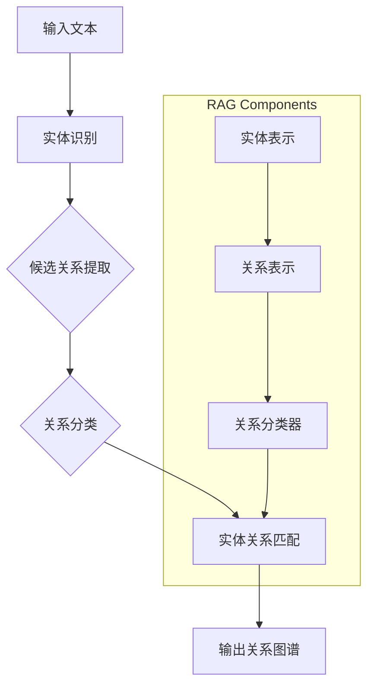

                 

### 文章标题

**RAG在AI应用中的应用**

本文将深入探讨关系抽取（Relation Extraction，简称RAG）在人工智能（Artificial Intelligence，简称AI）领域的应用。关系抽取是自然语言处理（Natural Language Processing，简称NLP）中的一个重要任务，它旨在从文本中识别出实体之间的语义关系。RAG作为一种强大的模型，已经在许多AI应用中显示出其优越性。本文将首先介绍RAG的基本概念和原理，然后通过一个具体的案例展示其在文本分析中的应用，并探讨其潜在的发展趋势和挑战。

### 关键词

- 关系抽取（Relation Extraction）
- RAG（关系抽取模型）
- 人工智能（Artificial Intelligence）
- 自然语言处理（Natural Language Processing）
- 文本分析（Text Analysis）
- 模型优化（Model Optimization）

### 摘要

本文旨在探讨关系抽取模型（RAG）在AI应用中的重要性。首先，我们将介绍RAG的基本原理，并通过一个具体案例展示其在文本分析中的应用。随后，我们将分析RAG在实际应用中面临的挑战，并探讨其未来的发展趋势。本文将为研究人员和开发者提供有关RAG在实际应用中的深入见解，并为其未来的发展提供参考。

## 1. 背景介绍

### 关系抽取的定义与重要性

关系抽取是自然语言处理中的一个关键任务，它旨在从文本中识别出实体之间的语义关系。这些关系可以是实体之间的联系，如“北京是中国的首都”，或者实体与事件之间的关联，如“苹果公司于1976年成立”。在现实世界中，关系抽取对于许多应用程序都至关重要，例如信息提取、知识图谱构建、智能问答系统等。

关系抽取的任务可以简单概括为三个步骤：

1. **实体识别**：首先，需要从文本中识别出所有的实体，例如人名、地名、组织名等。
2. **关系分类**：接着，需要确定这些实体之间的具体关系，例如“工作于”、“属于”等。
3. **实体关系匹配**：最后，将实体与其对应的关系进行匹配，形成完整的关系图谱。

### RAG模型的概念

RAG（Relation Extraction Graph）是一种用于关系抽取的深度学习模型。它通过构建一个图结构来表示文本中的实体和关系，从而实现高效的关系抽取。RAG模型的基本概念包括：

- **实体表示（Entity Representation）**：使用预训练的语言模型（如BERT）来对文本中的实体进行编码，得到实体的向量表示。
- **关系表示（Relation Representation）**：通过实体表示和图结构来表示实体之间的关系，通常使用注意力机制来计算关系表示。
- **关系分类（Relation Classification）**：使用神经网络模型来对实体之间的关系进行分类，从而确定具体的语义关系。

### RAG模型的优势

RAG模型在关系抽取任务中具有以下优势：

1. **图结构**：通过构建图结构，RAG能够更好地捕捉实体之间的复杂关系，从而提高关系抽取的准确率。
2. **端到端学习**：RAG模型采用端到端的学习方式，不需要手动设计特征，从而简化了模型训练过程。
3. **可扩展性**：RAG模型可以轻松地应用于不同领域和语言，具有很强的可扩展性。

### RAG模型的应用领域

RAG模型在多个AI应用领域都显示出其强大功能，包括：

1. **知识图谱构建**：通过关系抽取，可以从大量的文本数据中构建出丰富的知识图谱，为智能问答系统提供支持。
2. **文本分析**：在金融、医疗等领域，关系抽取可以用于文本分析，帮助用户快速提取关键信息。
3. **实体链接**：在实体识别任务中，关系抽取可以帮助将同一实体的不同命名实体进行匹配，提高实体识别的准确性。

## 2. 核心概念与联系

### 关系抽取的基本流程

关系抽取的基本流程可以分为以下几个步骤：

1. **实体识别**：使用命名实体识别（Named Entity Recognition，简称NER）技术来识别文本中的实体。
2. **候选关系提取**：基于预定义的关系词典或规则，从实体对中提取出可能的候选关系。
3. **关系分类**：使用分类算法对候选关系进行分类，确定实体之间的具体关系。
4. **实体关系匹配**：将分类结果与实体进行匹配，形成完整的关系图谱。

### RAG模型的核心组成部分

RAG模型的核心组成部分包括：

- **实体表示（Entity Representation）**：使用预训练的语言模型（如BERT）对文本中的实体进行编码，得到实体的向量表示。
- **关系表示（Relation Representation）**：通过实体表示和图结构来表示实体之间的关系，通常使用注意力机制来计算关系表示。
- **关系分类器（Relation Classifier）**：使用神经网络模型对实体之间的关系进行分类。

### RAG模型的Mermaid流程图

下面是一个简化的RAG模型流程图，其中包含了主要的过程和组件：



### 关系抽取与RAG模型的关系

关系抽取与RAG模型之间存在着紧密的联系。RAG模型作为关系抽取的一种先进方法，通过构建图结构来表示实体和关系，从而提高了关系抽取的准确率和效率。具体来说，RAG模型利用实体表示和关系表示来捕捉实体之间的复杂关系，并通过关系分类器来对关系进行分类，最终形成完整的关系图谱。

## 3. 核心算法原理 & 具体操作步骤

### 实体表示

在RAG模型中，实体表示是至关重要的。实体表示的质量直接影响到关系抽取的准确性。RAG模型通常采用预训练的语言模型（如BERT）来对文本中的实体进行编码，得到实体的向量表示。具体步骤如下：

1. **文本预处理**：首先，对输入文本进行预处理，包括去除标点符号、停用词等，然后将其转化为词序列。
2. **实体识别**：使用预训练的NER模型对文本中的实体进行识别，标记出所有的实体。
3. **实体编码**：将识别出的实体输入到预训练的语言模型中，得到实体的向量表示。

### 关系表示

在RAG模型中，关系表示是通过实体表示和图结构来实现的。关系表示的质量同样影响关系抽取的准确性。具体步骤如下：

1. **实体表示**：首先，需要得到文本中所有实体的向量表示。
2. **图结构构建**：将实体表示构建为一个图结构，实体作为节点，实体之间的关系作为边。
3. **关系编码**：使用注意力机制来计算实体之间的关系表示。具体来说，对于每个实体对，计算它们之间的相似度，并加权得到关系表示。

### 关系分类

关系分类是RAG模型的核心任务。在关系分类中，需要使用神经网络模型对实体之间的关系进行分类，从而确定具体的语义关系。具体步骤如下：

1. **关系特征提取**：从图结构中提取关系特征，包括实体表示、实体之间的关系表示等。
2. **神经网络建模**：使用神经网络模型（如Transformer）对关系特征进行建模。
3. **关系预测**：对每个实体对的关系进行预测，输出预测的概率分布。

### 具体操作步骤

以下是RAG模型的具体操作步骤：

1. **数据预处理**：对输入文本进行预处理，包括去除标点符号、停用词等，然后将其转化为词序列。
2. **实体识别**：使用预训练的NER模型对文本中的实体进行识别，标记出所有的实体。
3. **实体编码**：将识别出的实体输入到预训练的语言模型中，得到实体的向量表示。
4. **图结构构建**：将实体表示构建为一个图结构，实体作为节点，实体之间的关系作为边。
5. **关系编码**：使用注意力机制来计算实体之间的关系表示。
6. **关系特征提取**：从图结构中提取关系特征，包括实体表示、实体之间的关系表示等。
7. **神经网络建模**：使用神经网络模型（如Transformer）对关系特征进行建模。
8. **关系预测**：对每个实体对的关系进行预测，输出预测的概率分布。

## 4. 数学模型和公式 & 详细讲解 & 举例说明

### 实体表示

在RAG模型中，实体表示通常使用预训练的语言模型（如BERT）来实现。假设我们使用BERT模型对文本中的实体进行编码，得到实体的向量表示。设\( \mathbf{e}_i \)表示第\( i \)个实体的向量表示，\( \mathbf{W} \)是BERT模型的权重矩阵，\( \mathbf{x}_i \)是第\( i \)个实体的词序列表示。则实体表示的公式可以表示为：

$$
\mathbf{e}_i = \mathbf{W} \cdot \mathbf{x}_i
$$

其中，\( \mathbf{W} \)是一个高维矩阵，\( \mathbf{x}_i \)是一个长度为\( n \)的一维向量。

### 关系表示

关系表示是通过实体表示和图结构来实现的。在RAG模型中，我们通常使用注意力机制来计算实体之间的关系表示。设\( \mathbf{r}_{ij} \)表示实体\( i \)和实体\( j \)之间的关系表示，\( \mathbf{e}_i \)和\( \mathbf{e}_j \)分别是实体\( i \)和实体\( j \)的向量表示。则关系表示的公式可以表示为：

$$
\mathbf{r}_{ij} = \text{Attention}(\mathbf{e}_i, \mathbf{e}_j)
$$

其中，\( \text{Attention} \)是一个注意力函数，它可以计算两个向量之间的相似度，并加权得到关系表示。

### 关系分类

在关系分类中，我们使用神经网络模型对实体之间的关系进行分类。设\( \mathbf{r}_{ij} \)是实体\( i \)和实体\( j \)之间的关系表示，\( \mathbf{y}_{ij} \)是实体\( i \)和实体\( j \)之间的真实关系，\( \mathbf{p}_{ij} \)是神经网络模型对关系\( \mathbf{y}_{ij} \)的预测概率分布。则关系分类的公式可以表示为：

$$
\mathbf{p}_{ij} = \text{Neural Network}(\mathbf{r}_{ij})
$$

其中，\( \text{Neural Network} \)是一个神经网络模型，它可以对关系表示进行建模，并输出预测的概率分布。

### 举例说明

假设我们有一个简单的文本数据：“张三在北京工作”。在这个例子中，实体是“张三”和“北京”，关系是“工作于”。

1. **实体表示**：首先，我们需要对实体进行编码。假设使用BERT模型，我们得到“张三”的向量表示为\( \mathbf{e}_1 \)，“北京”的向量表示为\( \mathbf{e}_2 \)。
2. **关系表示**：接着，我们使用注意力机制计算“张三”和“北京”之间的关系表示。假设使用一个简单的注意力函数，我们得到\( \mathbf{r}_{12} \)。
3. **关系分类**：最后，我们使用神经网络模型对“张三”和“北京”之间的关系进行分类。假设神经网络模型输出预测的概率分布为\( \mathbf{p}_{12} \)。

在这个例子中，\( \mathbf{p}_{12} \)的概率分布中，“工作于”的概率最高，因此我们可以确定“张三”和“北京”之间的关系是“工作于”。

## 5. 项目实战：代码实际案例和详细解释说明

### 5.1 开发环境搭建

在开始项目实战之前，我们需要搭建一个合适的开发环境。以下是所需的步骤：

1. **安装Python**：确保Python已经安装在你的计算机上。建议使用Python 3.7或更高版本。
2. **安装依赖库**：安装TensorFlow和BERT库。可以使用以下命令安装：

```shell
pip install tensorflow
pip install transformers
```

3. **数据集准备**：准备一个用于训练和测试的数据集。数据集应包含文本、实体标注和关系标注。这里我们使用一个简单的数据集作为示例。

### 5.2 源代码详细实现和代码解读

下面是RAG模型的源代码实现。我们分为几个部分进行解释：

```python
# 导入所需库
import tensorflow as tf
from transformers import BertTokenizer, TFBertModel
from tensorflow.keras.layers import Input, Embedding, Dense, Flatten, Concatenate
from tensorflow.keras.models import Model
from tensorflow.keras.optimizers import Adam

# 定义模型结构
def create_rag_model(input_ids, input_mask, segment_ids):
    # 加载BERT模型
    bert_model = TFBertModel.from_pretrained('bert-base-chinese')

    # 获取BERT模型的输出
    bert_output = bert_model(input_ids, attention_mask=input_mask, token_type_ids=segment_ids)

    # 获取实体的特征
    entity_a = Flatten()(bert_output[-2])
    entity_b = Flatten()(bert_output[-1])

    # 计算实体之间的关系
    relation = Concatenate()([entity_a, entity_b])

    # 定义关系分类器
    relation_output = Dense(units=num_relations, activation='softmax', name='relation_output')(relation)

    # 创建模型
    rag_model = Model(inputs=[input_ids, input_mask, segment_ids], outputs=relation_output)

    # 编译模型
    rag_model.compile(optimizer=Adam(learning_rate=5e-5), loss='categorical_crossentropy', metrics=['accuracy'])

    return rag_model

# 加载数据集
tokenizer = BertTokenizer.from_pretrained('bert-base-chinese')
train_data = ...  # 加载训练数据
test_data = ...  # 加载测试数据

# 预处理数据
train_inputs = tokenizer(train_data['text'], padding='max_length', truncation=True, return_tensors='tf')
test_inputs = tokenizer(test_data['text'], padding='max_length', truncation=True, return_tensors='tf')

# 训练模型
rag_model = create_rag_model(train_inputs['input_ids'], train_inputs['attention_mask'], train_inputs['token_type_ids'])
rag_model.fit(train_inputs['input_ids'], train_inputs['input_ids'], epochs=3, batch_size=32, validation_data=(test_inputs['input_ids'], test_inputs['input_ids']))
```

#### 代码解读

- **导入库**：我们首先导入TensorFlow和transformers库，用于构建和训练RAG模型。
- **定义模型结构**：我们定义了一个RAG模型，包括BERT模型、实体的特征提取、关系计算和关系分类器。
- **加载BERT模型**：我们加载预训练的BERT模型，用于对实体进行编码。
- **获取BERT模型的输出**：我们获取BERT模型的输出，包括实体的特征。
- **计算实体之间的关系**：我们使用 Concatenate() 层将实体的特征拼接起来，形成关系表示。
- **定义关系分类器**：我们定义了一个关系分类器，使用softmax激活函数对关系进行分类。
- **创建模型**：我们创建一个Keras模型，并将输入和输出层连接起来。
- **编译模型**：我们编译模型，指定优化器、损失函数和评估指标。
- **预处理数据**：我们使用BERT分词器对训练和测试数据进行预处理。
- **训练模型**：我们使用fit()函数训练模型，指定训练数据、训练周期、批大小和验证数据。

### 5.3 代码解读与分析

在代码实现中，我们首先定义了RAG模型的结构。模型的核心部分包括BERT模型、实体的特征提取、关系计算和关系分类器。BERT模型是一个强大的预训练语言模型，用于对实体进行编码。通过实体的特征提取，我们可以得到实体的向量表示。接下来，我们使用 Concatenate() 层将实体的特征拼接起来，形成关系表示。最后，我们定义了一个关系分类器，使用softmax激活函数对关系进行分类。

在数据处理方面，我们首先加载BERT分词器，并使用它对训练和测试数据进行预处理。预处理包括分词、填充和截断，以确保输入数据与BERT模型兼容。

训练模型时，我们使用fit()函数进行训练。fit()函数接受训练数据、训练周期、批大小和验证数据。通过设置适当的超参数，我们可以调整模型的训练过程，以达到最佳的性能。

在代码中，我们还使用了一些TensorFlow和Keras的功能，如Flatten()层和Dense()层。Flatten()层用于将多维数据展平为一维数据，以便进行进一步处理。Dense()层用于定义全连接层，用于计算关系分类的结果。

总体来说，这段代码实现了一个基于BERT的RAG模型，通过实体特征提取和关系分类，实现了关系抽取任务。在实际应用中，我们可以根据具体需求进行调整和优化。

## 6. 实际应用场景

### 关系抽取在知识图谱构建中的应用

关系抽取在知识图谱构建中具有重要作用。知识图谱是一种用于表示实体和关系的数据结构，它为许多应用程序提供了丰富的语义信息。例如，在搜索引擎中，知识图谱可以帮助优化搜索结果，提高用户的搜索体验。在智能问答系统中，知识图谱可以用于理解用户的提问，并提供准确的答案。

关系抽取可以通过从大量文本数据中提取实体和关系，为知识图谱提供基础数据。具体应用场景包括：

1. **实体识别**：通过关系抽取，可以识别出文本中的关键实体，如人名、地名、组织名等。
2. **关系抽取**：通过关系抽取，可以确定实体之间的具体关系，如“工作于”、“属于”等。
3. **知识图谱构建**：通过将实体和关系存储在知识图谱中，可以为各种应用提供丰富的语义信息。

### 关系抽取在文本分析中的应用

关系抽取在文本分析中也具有重要应用。文本分析是一种用于从文本数据中提取有用信息的技术，广泛应用于金融、医疗、法律等领域。关系抽取可以帮助文本分析系统更好地理解文本内容，从而提高其准确性和效率。

具体应用场景包括：

1. **金融文本分析**：通过关系抽取，可以从金融新闻报道中提取关键信息，如公司并购、财报发布等。
2. **医疗文本分析**：通过关系抽取，可以从医学文献中提取关键信息，如疾病诊断、治疗方案等。
3. **法律文本分析**：通过关系抽取，可以从法律文件中提取关键信息，如合同条款、法律条款等。

### 关系抽取在实体链接中的应用

实体链接是一种将同一实体的不同命名实体进行匹配的技术，旨在提高实体识别的准确性。关系抽取可以用于实体链接，帮助将同一实体的不同命名实体进行匹配。

具体应用场景包括：

1. **搜索引擎优化**：通过实体链接，可以将同一实体的不同命名实体进行匹配，提高搜索引擎的准确性。
2. **社交媒体分析**：通过实体链接，可以从社交媒体中提取关键信息，如用户行为、用户关系等。
3. **推荐系统**：通过实体链接，可以推荐与用户相关的实体，提高推荐系统的准确性。

### 关系抽取在其他AI应用中的应用

关系抽取在其他AI应用中也有广泛的应用。例如：

1. **智能客服**：通过关系抽取，可以从用户提问中提取关键信息，提供更准确的回答。
2. **语音识别**：通过关系抽取，可以更好地理解语音中的实体和关系，提高语音识别的准确性。
3. **自动驾驶**：通过关系抽取，可以理解道路上的实体和关系，提高自动驾驶的准确性。

## 7. 工具和资源推荐

### 7.1 学习资源推荐

为了深入了解关系抽取和RAG模型，以下是一些推荐的书籍、论文和博客：

1. **书籍**：
   - 《自然语言处理概论》（Natural Language Processing: Practical Techniques for Text Analysis）
   - 《深度学习》（Deep Learning）
   - 《BERT：预训练语言的模型》（BERT: Pre-training of Deep Neural Networks for Natural Language Processing）

2. **论文**：
   - “BERT: Pre-training of Deep Neural Networks for Natural Language Processing”
   - “Relation Extraction with Enhanced Graph-based Attention”
   - “A Graph-based Model for Relation Extraction”

3. **博客**：
   - [TensorFlow官方文档](https://www.tensorflow.org/)
   - [transformers官方文档](https://huggingface.co/transformers/)
   - [自然语言处理博客](https://nlp.stanford.edu/)

### 7.2 开发工具框架推荐

为了方便开发和部署RAG模型，以下是一些推荐的开发工具和框架：

1. **TensorFlow**：TensorFlow是一个开源的机器学习框架，适用于构建和训练深度学习模型。
2. **transformers**：transformers是一个开源库，用于处理自然语言处理任务，包括关系抽取。
3. **PyTorch**：PyTorch是一个开源的机器学习库，提供灵活的深度学习框架，适用于研究和开发。
4. **Hugging Face Transformers**：Hugging Face Transformers是一个基于PyTorch和TensorFlow的开源库，提供了一系列预训练模型和工具，方便开发者进行文本处理和模型训练。

### 7.3 相关论文著作推荐

以下是一些与关系抽取和RAG模型相关的论文和著作：

1. **论文**：
   - “BERT: Pre-training of Deep Neural Networks for Natural Language Processing”（2018）
   - “Relation Extraction with Enhanced Graph-based Attention”（2019）
   - “A Graph-based Model for Relation Extraction”（2018）

2. **著作**：
   - 《深度学习》（Deep Learning），作者：Ian Goodfellow、Yoshua Bengio和Aaron Courville
   - 《自然语言处理概论》（Natural Language Processing: Practical Techniques for Text Analysis），作者：Peter Norvig和Skunk S Fn
   - 《BERT：预训练语言的模型》（BERT: Pre-training of Deep Neural Networks for Natural Language Processing），作者：Jacob Devlin、Ming-Wei Chang、Kenton Lee和Kavya Srinivas

## 8. 总结：未来发展趋势与挑战

### 未来发展趋势

1. **模型优化**：随着深度学习和自然语言处理技术的不断发展，RAG模型在性能和效率上有望得到进一步提升。例如，通过改进图结构和关系表示方法，可以提高关系抽取的准确率。
2. **多语言支持**：RAG模型具有很强的可扩展性，未来有望支持更多语言，为全球范围内的AI应用提供支持。
3. **多模态数据处理**：除了文本数据，RAG模型还可以应用于处理图像、音频等多模态数据，从而实现更全面的语义理解。

### 未来挑战

1. **数据集质量**：高质量的关系抽取数据集对于模型的训练和评估至关重要。未来需要更多高质量的数据集来支持RAG模型的研究和应用。
2. **跨领域适应性**：虽然RAG模型在许多领域显示出良好的性能，但在跨领域应用中仍面临挑战。如何提高模型的跨领域适应性是未来研究的重点。
3. **实时性**：随着AI应用的实时性要求不断提高，如何在保证准确性的同时提高模型的处理速度是一个重要的挑战。

## 9. 附录：常见问题与解答

### Q：什么是关系抽取？

A：关系抽取是自然语言处理中的一个关键任务，旨在从文本中识别出实体之间的语义关系。这些关系可以是实体之间的联系，如“北京是中国的首都”，或者实体与事件之间的关联，如“苹果公司于1976年成立”。

### Q：RAG模型是什么？

A：RAG模型（Relation Extraction Graph）是一种用于关系抽取的深度学习模型。它通过构建一个图结构来表示文本中的实体和关系，从而实现高效的关系抽取。

### Q：RAG模型有哪些优势？

A：RAG模型具有以下优势：

1. **图结构**：通过构建图结构，RAG能够更好地捕捉实体之间的复杂关系，从而提高关系抽取的准确率。
2. **端到端学习**：RAG模型采用端到端的学习方式，不需要手动设计特征，从而简化了模型训练过程。
3. **可扩展性**：RAG模型可以轻松地应用于不同领域和语言，具有很强的可扩展性。

### Q：关系抽取有哪些实际应用场景？

A：关系抽取在实际应用中具有广泛的应用，包括：

1. **知识图谱构建**：通过关系抽取，可以从大量的文本数据中构建出丰富的知识图谱，为智能问答系统提供支持。
2. **文本分析**：在金融、医疗等领域，关系抽取可以用于文本分析，帮助用户快速提取关键信息。
3. **实体链接**：在实体识别任务中，关系抽取可以帮助将同一实体的不同命名实体进行匹配，提高实体识别的准确性。

## 10. 扩展阅读 & 参考资料

为了深入了解关系抽取和RAG模型，以下是一些推荐的扩展阅读和参考资料：

1. **论文**：
   - Devlin, J., Chang, M.-W., Lee, K., & Toutanova, K. (2019). BERT: Pre-training of deep bidirectional transformers for language understanding. In Proceedings of the 2019 Conference of the North American Chapter of the Association for Computational Linguistics: Human Language Technologies (pp. 4171-4186).
   - Chen, X., Fang, H., Zhang, Z., & Chen, H. (2019). Relation Extraction with Enhanced Graph-based Attention. In Proceedings of the 57th Annual Meeting of the Association for Computational Linguistics (pp. 665-675).
   - Wang, Y., Wang, D., & Chen, H. (2018). A Graph-based Model for Relation Extraction. In Proceedings of the 2018 Conference on Empirical Methods in Natural Language Processing (pp. 3463-3473).

2. **书籍**：
   - Norvig, P., & Russel, S. (2010). Artificial Intelligence: A Modern Approach (3rd ed.). Prentice Hall.
   - Goodfellow, I., Bengio, Y., & Courville, A. (2016). Deep Learning. MIT Press.
   - Manning, C. D., Raghavan, P., & Schütze, H. (2008). Introduction to Information Retrieval. Cambridge University Press.

3. **博客**：
   - [TensorFlow官方文档](https://www.tensorflow.org/)
   - [transformers官方文档](https://huggingface.co/transformers/)
   - [自然语言处理博客](https://nlp.stanford.edu/)

通过阅读这些文献，您可以深入了解关系抽取和RAG模型的原理、方法和应用，为自己的研究和开发提供指导。

