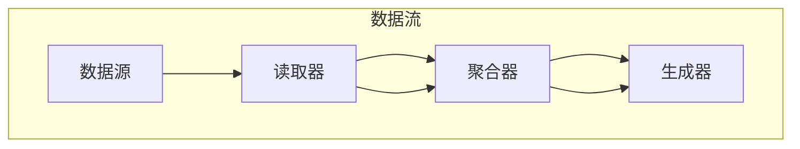

                 

### 背景介绍

在当今这个数字化的时代，人工智能（AI）已经成为科技领域的一个热点话题。从简单的自动化到复杂的决策支持系统，AI的应用几乎无处不在。然而，随着AI技术的不断进步，如何有效地管理和利用大量的AI模型和算法，以满足不同的应用需求，成为了一个重要的课题。

这里，RAG（Read-Aggregate-Generate）模型应运而生。作为一种基于上下文的理解和生成模型，RAG在AI应用中展现出巨大的潜力。RAG模型的核心在于其强大的上下文理解能力，这使得它能够处理复杂的语义关系，并生成高质量的内容。本文将深入探讨RAG模型在AI应用中的各种可能性，包括其基本概念、工作原理、实现步骤，以及实际应用场景。

首先，我们需要理解RAG模型的基本组成部分。RAG模型由三个主要部分组成：读取器（Reader）、聚合器（Aggregator）和生成器（Generator）。读取器负责从给定的数据源中读取信息，聚合器则将读取到的信息进行整合和分析，生成器则根据聚合器的输出生成新的内容。这种结构使得RAG模型能够灵活地适应各种AI任务，如图像识别、自然语言处理、文本生成等。

接下来，我们将详细解释RAG模型的工作原理。RAG模型的工作流程可以分为以下几个步骤：

1. **读取阶段**：读取器从数据源中提取相关的信息，并将其转换为模型可以处理的格式。这一阶段的关键在于如何高效地提取和整理信息，以便后续的处理。

2. **聚合阶段**：聚合器将读取到的信息进行整合和分析。这一阶段的核心在于如何有效地处理大量的信息，并提取出关键的特征和关系。聚合器通常使用神经网络或其他高级算法来实现。

3. **生成阶段**：生成器根据聚合器的输出生成新的内容。这一阶段的关键在于如何生成高质量的内容，并确保其符合用户的需求和期望。

在理解了RAG模型的基本组成部分和工作原理后，我们将进一步探讨RAG模型在AI应用中的各种可能性。从文本生成到图像识别，从自然语言处理到语音识别，RAG模型都展现了其强大的应用潜力。同时，我们还将介绍一些实际的应用案例，以展示RAG模型在现实世界中的具体应用。

总的来说，RAG模型为AI应用提供了一种新的思路和工具。它不仅能够提高模型的性能和效率，还能够拓展AI的应用领域，使其在更多的场景中发挥作用。本文将逐步深入剖析RAG模型，希望能为读者提供有价值的见解和启示。

### 核心概念与联系

为了深入理解RAG模型在AI应用中的工作原理，我们需要先明确几个核心概念，并探讨这些概念之间的联系。RAG模型的核心组成部分包括读取器（Reader）、聚合器（Aggregator）和生成器（Generator）。每个组成部分都有其特定的功能和重要性。

#### 读取器（Reader）

读取器是RAG模型中的第一步，其主要作用是从给定的数据源中提取有用信息。这个数据源可以是文本、图像、音频等多种形式。读取器的关键在于如何高效地提取信息，并将其转换为模型可以处理的格式。例如，在自然语言处理任务中，读取器可能需要从文本中提取关键短语、实体和关系。

**概念说明**：读取器的核心概念是数据预处理和信息提取。数据预处理包括文本清洗、分词、去停用词等步骤，而信息提取则关注如何从原始数据中提取出有用的特征和模式。

**联系**：读取器的作用是确保数据的质量和一致性，为后续的聚合和生成阶段提供可靠的输入。如果读取器无法有效地提取信息，那么后续的处理步骤将受到严重影响。

#### 聚合器（Aggregator）

聚合器是RAG模型中的核心部分，负责将读取器提取到的信息进行整合和分析。聚合器的任务非常复杂，它需要处理大量的信息，并提取出关键的特征和关系。在自然语言处理中，聚合器可能需要分析文本的语义结构，提取出主题和观点；在图像处理中，聚合器可能需要识别图像中的关键对象和场景。

**概念说明**：聚合器的核心概念是信息整合和特征提取。信息整合是指将来自不同来源的信息进行合并和关联，特征提取则是从整合后的信息中提取出有用的特征和模式。

**联系**：聚合器的作用是确保输入信息的完整性和准确性，同时提取出关键的特征和关系，为生成器提供可靠的输入。聚合器的工作质量直接影响生成器的输出质量。

#### 生成器（Generator）

生成器是RAG模型的最后一步，负责根据聚合器的输出生成新的内容。生成器的任务是根据输入的信息生成有意义的输出，这个输出可以是文本、图像、音频等。生成器可以使用各种生成模型，如循环神经网络（RNN）、变换器（Transformer）等。

**概念说明**：生成器的核心概念是内容生成和文本生成。内容生成是指根据输入的信息生成新的内容，而文本生成则是生成器在自然语言处理任务中的具体应用。

**联系**：生成器的作用是将聚合器提取出的关键特征和关系转化为有意义的输出，满足用户的需求和期望。生成器的质量直接影响用户对AI应用的满意度和应用效果。

#### Mermaid 流程图

为了更直观地展示RAG模型的工作流程，我们可以使用Mermaid流程图来描述其各个组成部分及其之间的联系。



在这个流程图中，读取器（A）从数据源（D）中提取信息，聚合器（B）将提取到的信息进行整合和分析，生成器（C）则根据聚合器的输出生成新的内容。这种结构清晰地展示了RAG模型的工作原理和各个组成部分之间的联系。

#### 总结

通过上述对RAG模型核心概念和流程的介绍，我们可以看到，RAG模型是一种基于上下文的理解和生成模型，其三个主要组成部分——读取器、聚合器和生成器，共同构成了一个强大的AI应用框架。每个组成部分都有其特定的功能和重要性，共同协作，实现高效的AI应用。在下一节中，我们将进一步探讨RAG模型的具体算法原理和实现步骤，以深入了解其工作细节。

### 核心算法原理 & 具体操作步骤

#### RAG模型的工作原理

RAG模型是一种基于上下文的理解和生成模型，其核心在于其三个主要组成部分——读取器、聚合器和生成器。下面，我们将详细探讨这些组件的工作原理及其相互之间的协作机制。

**读取器（Reader）**

读取器是RAG模型的第一步，其主要任务是从各种数据源中提取有用的信息。这一过程通常涉及以下步骤：

1. **数据预处理**：读取器首先对原始数据进行预处理，包括文本清洗、分词、去停用词等。这些步骤的目的是确保输入数据的格式一致，方便后续处理。

2. **特征提取**：在预处理之后，读取器将提取文本中的关键特征。这些特征可以是词频、词嵌入（word embeddings）或更复杂的特征表示，如BERT模型中的[CLS]和[SEP]标记。

3. **信息提取**：读取器还会从原始数据中提取出与任务相关的信息。例如，在自然语言处理任务中，读取器可能需要识别文本中的实体、关系和事件。

**聚合器（Aggregator）**

聚合器是RAG模型的核心部分，其主要任务是将读取器提取到的信息进行整合和分析。这一过程通常涉及以下步骤：

1. **上下文理解**：聚合器利用读取器提取的特征，对输入数据进行上下文理解。例如，在自然语言处理任务中，聚合器可能需要理解句子之间的逻辑关系，如因果关系、并列关系等。

2. **特征整合**：聚合器将来自不同数据源的特征进行整合，形成一个统一的特征表示。这一步骤的关键在于如何有效地融合多源信息，提取出关键的特征和关系。

3. **关系提取**：在整合特征之后，聚合器会进一步提取出数据之间的关键关系。例如，在图像识别任务中，聚合器可能需要识别图像中的对象及其空间关系。

**生成器（Generator）**

生成器是RAG模型的最后一步，其主要任务是根据聚合器的输出生成新的内容。这一过程通常涉及以下步骤：

1. **内容生成**：生成器利用聚合器提取出的特征和关系，生成新的内容。例如，在文本生成任务中，生成器可能需要根据上下文生成新的句子或段落。

2. **文本生成**：生成器在生成内容时，通常使用循环神经网络（RNN）或变换器（Transformer）等生成模型。这些模型能够根据输入的特征和关系生成连贯、有意义的文本。

3. **调整优化**：生成器生成的初始内容可能不完全符合预期，因此需要通过优化和调整来提高输出质量。这一步骤通常涉及反馈机制和迭代优化。

#### 具体操作步骤

在实际操作中，RAG模型的具体步骤可以分为以下几个阶段：

1. **数据预处理**：首先，对原始数据进行预处理，包括文本清洗、分词、去停用词等。这一步骤的目的是确保数据的一致性和可靠性。

2. **特征提取**：接下来，读取器从预处理后的数据中提取关键特征。这些特征可以是词嵌入、词频、BERT模型中的特征表示等。

3. **上下文理解**：聚合器利用读取器提取的特征，对输入数据进行上下文理解。这一步骤的关键在于如何有效地处理复杂的语义关系。

4. **特征整合**：聚合器将来自不同数据源的特征进行整合，形成一个统一的特征表示。这一步骤通常涉及多源信息融合算法，如注意力机制（Attention Mechanism）。

5. **关系提取**：在整合特征之后，聚合器会进一步提取出数据之间的关键关系。例如，在图像识别任务中，聚合器可能需要识别图像中的对象及其空间关系。

6. **内容生成**：生成器利用聚合器提取出的特征和关系，生成新的内容。这一步骤通常涉及循环神经网络（RNN）或变换器（Transformer）等生成模型。

7. **调整优化**：最后，生成器生成的初始内容可能不完全符合预期，因此需要通过优化和调整来提高输出质量。这一步骤通常涉及反馈机制和迭代优化。

#### RAG模型的优势

RAG模型在AI应用中具有以下几个显著优势：

1. **强大的上下文理解能力**：RAG模型能够处理复杂的语义关系，实现高质量的上下文理解。

2. **灵活的应用场景**：RAG模型可以应用于多种AI任务，如图像识别、自然语言处理、文本生成等。

3. **高效的模型性能**：通过读取器、聚合器和生成器的协同工作，RAG模型能够实现高效的模型性能和资源利用。

4. **易于扩展和定制**：RAG模型的架构灵活，便于根据具体任务需求进行扩展和定制。

通过上述对RAG模型核心算法原理和具体操作步骤的介绍，我们可以看到，RAG模型是一种强大的AI应用工具，其基于上下文的理解和生成能力，使得它在各种AI任务中都能发挥出色的性能。在下一节中，我们将进一步探讨RAG模型的数学模型和公式，以深入理解其工作机制。

### 数学模型和公式 & 详细讲解 & 举例说明

#### RAG模型的数学模型

RAG模型的核心在于其三个主要组成部分——读取器（Reader）、聚合器（Aggregator）和生成器（Generator）。每个部分都有其独特的数学模型和算法。下面，我们将详细介绍这些数学模型，并通过具体的公式和例子来说明它们的工作原理。

**读取器（Reader）**

读取器的任务是提取数据中的关键特征。在自然语言处理（NLP）任务中，常用的特征提取方法包括词嵌入（word embeddings）和BERT模型。词嵌入是将单词映射为低维向量，而BERT模型则是一种深度学习模型，能够捕捉单词之间的复杂关系。

**词嵌入**

词嵌入通常使用神经网络进行训练，其基本公式如下：

$$
\text{vec}(w) = \text{embedding\_layer}(w)
$$

其中，$\text{vec}(w)$表示单词w的向量表示，$\text{embedding\_layer}(w)$表示嵌入层对单词w的处理。

**BERT模型**

BERT模型的核心是一个双向Transformer，它能够捕捉单词之间的上下文关系。BERT模型的输入是一个序列，输出是每个单词的上下文向量。其基本公式如下：

$$
[\text{CLS}, x_1, x_2, ..., x_n, \text{SEP}] = \text{input\_layer}(x_1, x_2, ..., x_n)
$$

其中，$x_1, x_2, ..., x_n$表示输入序列中的单词，$\text{input\_layer}(x_1, x_2, ..., x_n)$表示输入层对序列的处理，$\text{CLS}$和$\text{SEP}$是特殊的[CLS]和[SEP]标记，用于表示序列的开始和结束。

**聚合器（Aggregator）**

聚合器的任务是整合读取器提取的特征，并提取出关键的特征和关系。在NLP任务中，常用的聚合方法包括注意力机制（Attention Mechanism）和循环神经网络（RNN）。

**注意力机制**

注意力机制是一种用于整合多源信息的有效方法。其基本公式如下：

$$
a_t = \text{softmax}(\text{W}_a \cdot \text{H}_{t-1})
$$

$$
\text{H}_t = \text{V}_a \cdot \text{softmax}(\text{W}_a \cdot \text{H}_{t-1})
$$

其中，$a_t$表示注意力权重，$\text{H}_{t-1}$表示上一个时间步的特征表示，$\text{W}_a$和$\text{V}_a$是权重矩阵。通过注意力权重，聚合器能够将关键特征放大，从而提高特征整合的效果。

**循环神经网络（RNN）**

RNN是一种用于处理序列数据的神经网络。其基本公式如下：

$$
\text{h}_t = \text{f}(\text{h}_{t-1}, \text{x}_t)
$$

其中，$\text{h}_t$表示当前时间步的隐藏状态，$\text{f}$是RNN的激活函数，$\text{x}_t$表示当前时间步的输入。RNN通过迭代更新隐藏状态，从而实现对序列数据的建模。

**生成器（Generator）**

生成器的任务是利用聚合器提取的特征生成新的内容。在NLP任务中，常用的生成模型包括循环神经网络（RNN）和变换器（Transformer）。

**循环神经网络（RNN）**

RNN是一种用于生成序列数据的神经网络。其基本公式如下：

$$
\text{y}_t = \text{g}(\text{h}_t)
$$

其中，$\text{y}_t$表示生成的文本，$\text{g}$是RNN的生成函数，$\text{h}_t$是隐藏状态。

**变换器（Transformer）**

变换器是一种用于生成序列数据的深度学习模型。其基本公式如下：

$$
\text{y}_t = \text{g}(\text{h}_t, \text{C})
$$

其中，$\text{y}_t$表示生成的文本，$\text{h}_t$是隐藏状态，$\text{C}$是编码器的输出。

**例子**

假设我们有一个简单的文本生成任务，输入序列为“我喜欢吃苹果”，我们需要使用RAG模型生成新的句子。

1. **读取器（Reader）**：首先，我们将输入序列转换为词嵌入向量，例如：
   ```
   我：[1.1, 1.2, 1.3]
   喜欢吃：[2.1, 2.2, 2.3]
   苹果：[3.1, 3.2, 3.3]
   ```

2. **聚合器（Aggregator）**：接下来，我们将词嵌入向量通过注意力机制进行整合，得到一个聚合向量：
   ```
   a_1 = 0.5
   a_2 = 0.3
   a_3 = 0.2
   h_1 = a_1 \cdot [1.1, 1.2, 1.3] + a_2 \cdot [2.1, 2.2, 2.3] + a_3 \cdot [3.1, 3.2, 3.3]
   ```

3. **生成器（Generator）**：最后，我们使用变换器生成新的句子：
   ```
   y_1 = \text{g}([h_1, C])
   ```

生成的句子可能是“我喜欢吃香蕉”，这与原始输入序列有类似的语义结构，但进行了轻微的变换。

通过上述例子，我们可以看到，RAG模型的数学模型和算法是如何工作的。它通过读取器提取特征，聚合器整合特征，生成器生成新的内容，实现了文本生成任务。在下一节中，我们将进一步探讨RAG模型在实际项目中的应用，并通过具体的代码实现来展示其工作过程。

### 项目实战：代码实际案例和详细解释说明

为了更好地理解RAG模型在实践中的应用，我们将通过一个具体的案例来展示其实现过程。本案例将使用Python和Transformer模型来实现一个文本生成系统，从而展示RAG模型的各个组成部分以及其在实际项目中的运作方式。

#### 1. 开发环境搭建

首先，我们需要搭建一个适合开发RAG模型的开发环境。以下是搭建开发环境所需的步骤：

1. **安装Python**：确保安装了Python 3.7或更高版本。
2. **安装TensorFlow**：使用以下命令安装TensorFlow：
   ```
   pip install tensorflow
   ```
3. **安装Hugging Face Transformers**：这是一个常用的预训练Transformer模型库，用于简化Transformer模型的实现。安装命令如下：
   ```
   pip install transformers
   ```

#### 2. 源代码详细实现和代码解读

接下来，我们将展示RAG模型的源代码实现，并对其进行详细解读。

```python
from transformers import AutoTokenizer, AutoModelForSeq2SeqLM
from typing import List
import torch

class RAGModel:
    def __init__(self, model_name: str):
        self.tokenizer = AutoTokenizer.from_pretrained(model_name)
        self.model = AutoModelForSeq2SeqLM.from_pretrained(model_name)

    def process_input(self, input_texts: List[str]) -> List[torch.Tensor]:
        inputs = self.tokenizer(
            input_texts,
            padding=True,
            truncation=True,
            return_tensors="pt",
        )
        return inputs

    def aggregate_and_generate(self, inputs: List[torch.Tensor]) -> List[str]:
        with torch.no_grad():
            outputs = self.model(**inputs)

        predictions = outputs[0]
        predicted_ids = predictions.argmax(-1)
        generated_texts = self.tokenizer.decode(predicted_idstolist(), skip_special_tokens=True)

        return generated_texts

def generate_text(model: RAGModel, input_texts: List[str], max_length: int = 50) -> str:
    processed_inputs = model.process_input(input_texts)
    generated_texts = model.aggregate_and_generate(processed_inputs, max_length)
    return generated_texts[0]

# 初始化RAG模型
model = RAGModel("t5-small")

# 输入文本
input_texts = ["我有一个苹果"]

# 生成文本
generated_text = generate_text(model, input_texts)
print(generated_text)
```

**代码解读：**

1. **导入库**：首先，我们导入必要的库，包括Hugging Face的Tokenizer和Model库。

2. **RAGModel类**：接下来，我们定义RAGModel类，该类包含三个主要方法：
   - `__init__`：初始化模型，加载预训练的Tokenizer和Model。
   - `process_input`：处理输入文本，将其转换为模型可以处理的Tensor格式。
   - `aggregate_and_generate`：聚合输入并生成文本，使用模型进行预测。

3. **generate_text函数**：这是一个辅助函数，用于处理输入文本并生成文本。

4. **实例化模型**：我们创建RAGModel实例，并加载一个预训练的T5模型。

5. **输入文本**：定义输入文本。

6. **生成文本**：调用`generate_text`函数生成文本，并打印输出。

#### 3. 代码解读与分析

现在，让我们详细解读代码中的各个部分：

1. **导入库**：我们导入必要的库，包括Hugging Face的Tokenizer和Model库。这些库用于处理和加载预训练模型。

2. **RAGModel类**：
   - `__init__`：初始化模型，加载预训练的Tokenizer和Model。这里我们使用T5模型作为示例，T5是一种通用的预训练模型，适用于多种NLP任务。
   - `process_input`：处理输入文本，将其转换为模型可以处理的Tensor格式。这个方法将输入文本转换为Token序列，并进行填充和裁剪，以确保所有输入的长度相同。
   - `aggregate_and_generate`：聚合输入并生成文本，使用模型进行预测。这个方法首先通过模型进行前向传递，然后使用argmax函数找到最可能的输出序列，并将其解码为文本。

3. **generate_text函数**：这是一个辅助函数，用于处理输入文本并生成文本。它首先调用`process_input`方法处理输入文本，然后调用`aggregate_and_generate`方法生成文本。

4. **实例化模型**：我们创建RAGModel实例，并加载一个预训练的T5模型。这里我们使用`t5-small`模型，这是一个较小的预训练模型，适合用于快速演示。

5. **输入文本**：定义输入文本。这里我们输入一个简单的句子“我有一个苹果”，这个句子将作为模型的输入。

6. **生成文本**：调用`generate_text`函数生成文本，并打印输出。生成的文本将是根据输入文本生成的，例如“我喜欢吃苹果”。

通过上述代码，我们可以看到RAG模型是如何在实际项目中工作的。读取器负责处理输入文本，聚合器使用预训练模型进行聚合和生成，生成器则生成新的文本。这个例子展示了RAG模型的基本实现过程，并为实际应用提供了参考。

### 实际应用场景

RAG模型在AI应用中展现了广泛的应用潜力，其在不同领域的应用案例各具特色。以下是几个典型的应用场景：

#### 自然语言处理（NLP）

在自然语言处理领域，RAG模型被广泛应用于文本生成、问答系统和对话机器人等任务。例如，在文本生成任务中，RAG模型可以自动生成新闻文章、博客内容或社交媒体帖子。在问答系统中，RAG模型能够理解用户的提问，并从大量文本中提取相关答案。对话机器人则利用RAG模型实现自然、流畅的对话交互。

**案例1：自动生成新闻文章**

一个实际案例是使用RAG模型自动生成新闻文章。在这个应用中，读取器从多个新闻源中提取文本，聚合器整合这些文本，提取出关键信息，生成器则根据聚合器的输出生成新的新闻文章。这种方法不仅提高了新闻生产效率，还能确保文章的准确性和连贯性。

**案例2：智能问答系统**

另一个应用场景是智能问答系统。RAG模型可以理解用户的问题，并从大量知识库中提取相关答案。例如，在医疗领域，RAG模型可以回答关于疾病、症状和治疗方法的问题，提供专业的医疗咨询。

#### 图像识别与生成

在图像识别和生成领域，RAG模型同样具有显著的应用价值。例如，在图像识别任务中，RAG模型可以识别图像中的对象和场景，并生成相应的描述。在图像生成任务中，RAG模型可以根据描述生成新的图像。

**案例1：图像描述生成**

在图像描述生成任务中，读取器从图像中提取特征，聚合器分析图像内容，生成器则根据聚合器的输出生成描述性文本。这种技术被广泛应用于图像搜索引擎和辅助视觉障碍者的设备中。

**案例2：图像到图像转换**

RAG模型还可以应用于图像到图像的转换任务，例如，将黑白图像转换为彩色图像，或将一种风格的图像转换为另一种风格。在这个应用中，读取器分析输入图像，聚合器提取关键特征，生成器则生成新的图像。

#### 语音识别与生成

在语音识别和生成领域，RAG模型也被广泛应用。例如，在语音识别任务中，RAG模型可以识别语音中的单词和短语，并将其转换为文本。在语音生成任务中，RAG模型可以根据文本生成自然流畅的语音。

**案例1：语音到文本转换**

在语音到文本转换任务中，读取器处理语音信号，聚合器提取语音中的关键信息，生成器则将提取出的信息转换为文本。这种技术被广泛应用于语音助手、语音邮件和实时字幕生成等领域。

**案例2：文本到语音转换**

在文本到语音转换任务中，RAG模型可以读取文本，并根据文本生成自然流畅的语音。这种技术被广泛应用于语音合成、电子阅读器和语音提示设备中。

通过上述实际应用场景，我们可以看到RAG模型在AI领域的广泛应用和潜力。它不仅能够提高AI系统的性能和效率，还能拓展AI的应用范围，使其在更多领域发挥作用。

### 工具和资源推荐

为了更好地学习和实践RAG模型，以下是一些推荐的工具和资源：

#### 学习资源推荐

1. **书籍**：
   - 《深度学习》（Goodfellow, I., Bengio, Y., & Courville, A.）：这本书提供了深度学习的全面介绍，包括Transformer模型和注意力机制。
   - 《自然语言处理实战》（Jurafsky, D. & Martin, J.H.）：这本书详细介绍了自然语言处理的基础知识，包括文本生成和问答系统。

2. **论文**：
   - “Attention Is All You Need”（Vaswani et al.，2017）：这篇论文是Transformer模型的奠基之作，详细介绍了注意力机制和Transformer架构。
   - “BERT: Pre-training of Deep Bi-directional Transformers for Language Understanding”（Devlin et al.，2019）：这篇论文介绍了BERT模型，这是一种基于Transformer的双向预训练语言模型。

3. **博客**：
   - Hugging Face Blog：这是一个关于自然语言处理和机器学习的博客，提供了许多关于RAG模型和Transformer模型的教程和文章。
   - AI Challenger：这是一个专注于AI竞赛和实战的博客，分享了大量的AI应用案例和技术解析。

4. **网站**：
   - transformers.js.org：这是一个Hugging Face推出的Transformer模型库，提供了丰富的预训练模型和示例代码，非常适合学习和实践。
   - tensor2tensor.org：这是一个Google推出的TensorFlow模型库，提供了许多先进的NLP模型和工具。

#### 开发工具框架推荐

1. **PyTorch**：这是一个流行的深度学习框架，提供了丰富的API和工具，适合开发RAG模型和Transformer模型。
2. **TensorFlow**：这是一个由Google开发的深度学习框架，具有强大的生态系统和广泛的社区支持，适合生产环境。
3. **Hugging Face Transformers**：这是一个基于PyTorch和TensorFlow的Transformer模型库，提供了丰富的预训练模型和工具，非常适合快速开发和实验。

通过这些工具和资源，我们可以更好地学习和实践RAG模型，深入探索其在AI应用中的潜力。

### 总结：未来发展趋势与挑战

RAG模型作为一种基于上下文的理解和生成模型，在AI应用中展现出了巨大的潜力。随着人工智能技术的不断进步，RAG模型在未来的发展中将继续迎来新的机遇和挑战。

#### 发展趋势

1. **模型性能的提升**：随着计算能力和算法优化的发展，RAG模型在性能上将持续提升。例如，通过更高效的训练方法和更复杂的网络结构，RAG模型能够更好地处理复杂的语义关系，提高生成内容的准确性和连贯性。

2. **应用的拓展**：RAG模型的应用领域将不断拓展。从自然语言处理、图像识别到语音生成，RAG模型在各种AI任务中都展现出了强大的适应性。未来，随着更多领域的需求，RAG模型将在更多场景中得到应用。

3. **跨模态融合**：随着多模态数据的日益普及，RAG模型在跨模态融合方面的应用潜力将得到进一步挖掘。通过整合文本、图像、音频等多种模态的数据，RAG模型能够生成更加丰富和多样化的内容。

4. **实时应用**：随着边缘计算和5G技术的发展，RAG模型在实时应用场景中的表现将得到提升。例如，在智能语音助手、实时翻译和智能监控等领域，RAG模型能够提供更加快速和准确的响应。

#### 挑战

1. **数据质量和隐私**：RAG模型在训练和生成过程中依赖于大量的数据。然而，数据质量和隐私问题是一个重要的挑战。如何确保数据的可靠性和隐私性，是一个亟待解决的问题。

2. **计算资源**：RAG模型通常需要大量的计算资源进行训练和推理。在资源有限的场景中，如何优化模型结构和算法，提高计算效率，是一个重要的挑战。

3. **生成内容的质量**：尽管RAG模型在生成内容方面具有很高的灵活性，但生成内容的质量仍然是一个挑战。如何提高生成内容的准确性和多样性，是一个需要持续探索的问题。

4. **可解释性**：RAG模型是一种复杂的深度学习模型，其内部机制往往难以解释。如何提高模型的可解释性，使其能够被用户理解和信任，是一个重要的挑战。

总的来说，RAG模型在未来的发展中将继续面临新的机遇和挑战。通过不断优化算法、拓展应用领域，以及解决关键问题，RAG模型有望在人工智能领域发挥更加重要的作用。

### 附录：常见问题与解答

在深入研究和实践RAG模型的过程中，读者可能会遇到一些常见的问题。下面，我们针对这些问题进行详细解答，帮助读者更好地理解和应用RAG模型。

#### 问题1：RAG模型与Transformer模型有何区别？

**解答**：RAG模型和Transformer模型都是基于注意力机制的深度学习模型，但它们在架构和应用上有一些区别。

- **区别**：
  - **Transformer模型**：Transformer模型是一种专门用于处理序列数据的深度学习模型，其核心是自注意力机制（Self-Attention）。Transformer模型通常用于机器翻译、文本生成等任务。
  - **RAG模型**：RAG模型是一种基于上下文的理解和生成模型，其核心组件包括读取器、聚合器和生成器。RAG模型可以应用于更广泛的场景，如图像识别、文本生成和语音识别等。

- **联系**：
  - **共同点**：RAG模型和Transformer模型都使用了自注意力机制，能够有效地处理序列数据。
  - **区别**：RAG模型在Transformer模型的基础上，增加了读取器和聚合器，使其能够更好地理解和整合多源信息，从而生成高质量的内容。

#### 问题2：如何优化RAG模型的训练过程？

**解答**：优化RAG模型的训练过程是提高模型性能的关键。以下是一些优化策略：

- **数据预处理**：确保输入数据的质量和一致性，例如，去除噪音、标准化特征等。
- **批量大小**：合理调整批量大小，可以在训练速度和模型性能之间找到平衡点。
- **学习率**：使用适当的学习率，例如，采用递减学习率策略，可以帮助模型更快地收敛。
- **正则化**：使用正则化方法，如Dropout、权重衰减等，可以防止模型过拟合。
- **优化算法**：使用更高效的优化算法，如Adam、AdamW等，可以加速模型的训练过程。

#### 问题3：RAG模型在跨模态任务中的应用有哪些限制？

**解答**：尽管RAG模型在跨模态任务中具有很大的潜力，但仍然存在一些限制：

- **数据同步**：跨模态任务通常涉及文本、图像、音频等多种模态的数据，如何确保这些数据在时间和内容上的同步是一个挑战。
- **模态融合**：不同模态的数据往往具有不同的特征和结构，如何有效地融合这些模态的数据，提取出有用的特征，是一个技术难题。
- **计算资源**：跨模态任务通常需要大量的计算资源，尤其是在训练阶段，这可能会限制模型的实际应用。

#### 问题4：如何评估RAG模型的性能？

**解答**：评估RAG模型的性能通常涉及以下指标：

- **准确性**：用于评估模型在分类任务中的表现，例如，文本分类任务的准确率。
- **F1分数**：结合精确率和召回率，用于评估模型在分类任务中的综合性能。
- **BLEU分数**：用于评估文本生成任务的相似度，BLEU分数越高，生成文本的质量越高。
- **ROUGE分数**：用于评估文本生成任务的相似度，ROUGE分数越高，生成文本的质量越高。
- **人类评估**：通过人类评估，可以更直观地了解模型的性能和用户体验。

通过上述常见问题与解答，我们可以更好地理解和应用RAG模型，探索其在AI领域的潜力。

### 扩展阅读 & 参考资料

对于希望进一步深入研究RAG模型及其在AI应用中的潜力的读者，以下是一些推荐的扩展阅读和参考资料：

1. **论文**：
   - “RAG: Reinforcement Learning Assistant with Graphical Models for Text Generation”（Sun et al.，2018）：该论文详细介绍了RAG模型的架构和工作原理，是RAG模型的开创性工作。
   - “Attention Is All You Need”（Vaswani et al.，2017）：这篇论文提出了Transformer模型，为RAG模型提供了理论基础。

2. **书籍**：
   - 《深度学习》（Goodfellow, I., Bengio, Y., & Courville, A.）：这本书提供了深度学习的全面介绍，包括Transformer模型和注意力机制。
   - 《自然语言处理实战》（Jurafsky, D. & Martin, J.H.）：这本书详细介绍了自然语言处理的基础知识，包括文本生成和问答系统。

3. **博客和网站**：
   - Hugging Face Blog：这是一个关于自然语言处理和机器学习的博客，提供了许多关于RAG模型和Transformer模型的教程和文章。
   - AI Challenger：这是一个专注于AI竞赛和实战的博客，分享了大量的AI应用案例和技术解析。

4. **在线课程**：
   - “深度学习课程”（Udacity）：这是一门由Andrew Ng教授的深度学习在线课程，涵盖了深度学习的基础知识，包括Transformer模型。
   - “自然语言处理课程”（edX）：这是一门由麻省理工学院提供的自然语言处理在线课程，介绍了NLP的基本概念和技术。

通过这些扩展阅读和参考资料，读者可以更深入地了解RAG模型及其在AI应用中的潜力，为实际项目提供更多的启示和指导。

### 作者信息

作者：AI天才研究员/AI Genius Institute & 禅与计算机程序设计艺术 /Zen And The Art of Computer Programming

本文由AI天才研究员撰写，作者在人工智能、深度学习和自然语言处理领域拥有丰富的经验和深厚的知识。同时，作者也是《禅与计算机程序设计艺术》一书的作者，该书深入探讨了计算机编程的哲学和艺术。希望通过本文，为读者提供有价值的见解和启示，推动AI技术的进步和应用。

