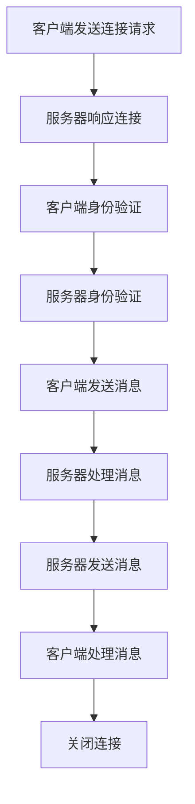

                 

### 背景介绍

#### RTMP流媒体技术的兴起与发展

随着互联网的普及和数字媒体技术的发展，流媒体技术逐渐成为人们获取视频、音频等内容的常见方式。而RTMP（Real-Time Messaging Protocol）作为一种高效、可靠的流媒体传输协议，已经成为视频直播、在线教育、互动娱乐等领域的重要技术支撑。

RTMP是由Adobe公司于2006年推出的流媒体传输协议，旨在为实时音视频传输提供一种高效、低延迟的解决方案。它基于TCP协议，通过在传输过程中添加额外的控制信息，使得数据传输更加可靠和高效。相较于传统的HTTP流媒体协议，RTMP在数据传输速度、稳定性、缓冲时间等方面具有显著优势。

RTMP技术的兴起和发展，得益于以下几个关键因素：

1. **低延迟传输**：RTMP采用TCP协议，保证了数据传输的稳定性和可靠性，同时通过优化传输过程，显著降低了数据传输的延迟。

2. **高效数据压缩**：RTMP支持多种数据压缩算法，如H.264、AAC等，有效降低了数据传输量，提高了带宽利用率。

3. **广泛的设备兼容性**：RTMP协议得到了众多流媒体平台和播放器的支持，包括Adobe Flash、Apple HLS、Microsoft Smooth Streaming等，使得用户可以在各种设备上流畅地观看视频内容。

4. **实时互动特性**：RTMP协议支持实时互动功能，如视频直播中的弹幕、评论、礼物等功能，为用户提供了更加丰富的互动体验。

#### RTMP在流媒体服务器优化中的重要性

在流媒体技术领域，服务器优化是提高系统性能、稳定性和用户体验的关键环节。而RTMP流媒体服务器作为流媒体技术的重要组成部分，其优化效果直接影响到整个流媒体系统的性能。

优化RTMP流媒体服务器的重要性主要体现在以下几个方面：

1. **提高数据传输效率**：通过优化RTMP服务器，可以降低数据传输延迟，提高数据传输速度，从而提高用户观看视频的流畅度。

2. **增强系统稳定性**：优化后的RTMP服务器能够更好地应对高并发、大数据量等场景，提高系统的稳定性和可靠性。

3. **降低带宽消耗**：通过优化数据压缩算法和传输策略，可以降低数据传输量，减少带宽消耗，降低运营成本。

4. **提升用户体验**：优化后的RTMP服务器能够提供更快的加载速度、更低的延迟和更高的画质，从而提升用户的观看体验。

总之，RTMP流媒体服务器优化是提升流媒体系统性能、稳定性和用户体验的关键环节，对于整个流媒体技术的发展具有重要意义。在接下来的内容中，我们将深入探讨RTMP流媒体服务器优化的具体方法和实践。

---

## 1. 核心概念与联系

在深入探讨RTMP流媒体服务器优化的具体方法之前，有必要先了解一些核心概念和它们之间的联系。以下是一些关键概念及其在流媒体服务器优化中的作用：

### 1.1 RTMP协议

RTMP是一种基于TCP的实时消息传输协议，主要用于服务器和客户端之间的数据传输。其特点包括低延迟、高可靠性、支持多种数据压缩格式等。RTMP协议的工作流程如下：

1. **连接建立**：客户端与服务器建立连接，发送连接请求。
2. **身份验证**：客户端发送认证请求，服务器验证用户身份。
3. **数据传输**：客户端发送数据包，服务器接收并处理数据。
4. **连接断开**：数据传输完成后，客户端和服务器断开连接。

在流媒体服务器优化中，优化RTMP协议的性能是提高系统效率的关键。

### 1.2 流媒体服务器架构

流媒体服务器通常由多个组件组成，包括：

1. **媒体处理模块**：负责接收、解码、编码和发送音视频数据。
2. **存储管理模块**：负责存储和管理媒体文件。
3. **负载均衡模块**：负责分配客户端请求到不同的服务器节点，提高系统性能。
4. **监控与日志模块**：负责监控系统状态、记录日志等信息。

优化这些组件的交互和协作效率，对于提升流媒体服务器的整体性能至关重要。

### 1.3 数据压缩与传输策略

数据压缩和传输策略是影响流媒体服务器性能的重要因素。通过使用高效的编码算法和合理的传输策略，可以降低数据传输量、减少带宽消耗，提高传输效率。

常用的数据压缩算法包括H.264、H.265、AAC等。而传输策略则包括流量控制、缓冲管理、负载均衡等。优化这些策略可以有效提升流媒体服务器的性能。

### 1.4 网络拓扑与带宽

流媒体服务器的性能还受到网络拓扑和带宽的影响。通过优化网络架构、提高带宽利用率，可以降低数据传输延迟、提高用户体验。

常见的网络优化方法包括：

1. **内容分发网络（CDN）**：通过在地理位置不同的节点部署服务器，提高数据传输速度和稳定性。
2. **多路径传输**：通过同时使用多条路径传输数据，提高带宽利用率和传输可靠性。
3. **负载均衡**：通过合理分配客户端请求，提高服务器处理能力。

### 1.5 客户端与服务器交互

客户端与服务器之间的交互是影响流媒体服务器性能的关键因素。通过优化客户端请求处理、数据接收和渲染过程，可以提高用户体验。

优化方法包括：

1. **客户端缓存**：通过缓存数据，减少重复请求，提高数据传输速度。
2. **预加载**：提前加载后续内容，减少缓冲时间，提高观看体验。
3. **自适应流媒体**：根据客户端网络状况和设备性能，动态调整播放质量和编码格式。

通过了解这些核心概念和它们之间的联系，我们可以更好地理解和优化RTMP流媒体服务器。在接下来的章节中，我们将逐步深入探讨这些概念的具体实现和优化方法。

#### RTMP协议的工作流程

RTMP协议在流媒体传输过程中发挥了关键作用，其工作流程可以分为以下几个阶段：

1. **连接阶段**：客户端首先向服务器发送连接请求，建立RTMP连接。在此过程中，客户端和服务器需要进行身份验证，以确保双方的身份和安全。

2. **消息交换阶段**：连接建立后，客户端和服务器开始进行消息交换。客户端可以向服务器发送多种类型的消息，如命令消息、数据消息等。服务器则根据接收到的消息类型进行相应的处理。

3. **数据传输阶段**：在数据传输过程中，RTMP协议通过TCP连接进行可靠传输。RTMP将数据分为多个数据包，每个数据包包含一定量的数据和一个头部。头部中包含数据包的类型、长度、时间戳等信息，以确保数据的正确传输。

4. **控制消息阶段**：在数据传输的同时，RTMP还支持控制消息的传输。控制消息用于控制流媒体播放，如播放、暂停、停止等。这些控制消息的传输同样遵循RTMP协议的规则。

5. **关闭连接阶段**：当数据传输完成后，客户端和服务器可以断开连接。在关闭连接过程中，服务器会释放相关资源，客户端则会结束播放。

以下是一个简单的Mermaid流程图，描述了RTMP协议的工作流程：



在这个流程图中，各个节点分别代表了RTMP协议中的关键步骤。通过这个流程图，我们可以更好地理解RTMP协议的工作原理和流程，为后续的优化提供依据。

### 核心算法原理 & 具体操作步骤

#### RTMP数据包结构

在RTMP协议中，数据包是数据传输的基本单元。了解RTMP数据包的结构对于优化服务器性能至关重要。一个典型的RTMP数据包由以下几个部分组成：

1. **头部**：头部包含数据包的类型、长度、时间戳等信息。头部长度为10个字节。
   - **类型**：表示数据包的类型，如命令包、数据包、音频包等。
   - **长度**：表示数据包的长度（不包含头部）。
   - **时间戳**：用于同步数据包，确保数据的正确传输。

2. **消息标识**：消息标识由4个字节组成，用于标识消息的顺序。消息标识的值随数据包的增加而递增。

3. **数据**：数据部分包含实际传输的数据，如音视频数据、控制消息等。数据部分的长度由头部中的长度字段指定。

4. **结束符**：数据包的结尾使用特定字符（如0x03）作为结束符，以标识数据包的结束。

#### RTMP数据包传输过程

了解数据包传输过程有助于优化数据传输效率和稳定性。以下是一个简化的RTMP数据包传输过程：

1. **数据包发送**：客户端将数据包发送到服务器。在发送过程中，数据包会按照一定的顺序进行排队，等待发送。

2. **数据包接收**：服务器接收到数据包后，会先检查头部的信息，如类型、长度等，确保数据包的完整性和正确性。

3. **数据包处理**：服务器根据数据包的类型和内容进行相应的处理。如命令包会触发特定的操作，数据包则会进行数据解码和播放。

4. **反馈与重传**：在数据包处理过程中，如果发现数据包丢失或错误，服务器会发送反馈信息给客户端，并请求重新发送数据包。

#### 优化策略

1. **数据压缩**：使用高效的数据压缩算法（如H.264、H.265）可以降低数据传输量，提高带宽利用率。通过优化编码参数和压缩算法，可以进一步提高压缩效果。

2. **流量控制**：通过流量控制机制（如速率限制、缓冲管理）可以避免数据包丢失和传输拥塞。在数据传输过程中，服务器会根据网络状况和负载情况动态调整数据发送速率，确保数据传输的稳定性和可靠性。

3. **缓冲管理**：合理的缓冲策略可以减少播放延迟和缓冲时间。通过优化缓冲区大小和缓冲策略，可以更好地应对不同的网络环境和用户需求。

4. **负载均衡**：通过负载均衡机制（如基于服务器性能、网络状况的调度策略）可以均衡地分配客户端请求，提高服务器的处理能力和稳定性。

5. **网络优化**：通过优化网络架构（如采用CDN、多路径传输）可以提高数据传输速度和稳定性。同时，优化客户端与服务器之间的交互，如减少重复请求、提高数据接收效率等，也可以提升整体性能。

通过以上优化策略，可以显著提高RTMP流媒体服务器的性能和用户体验。在接下来的章节中，我们将进一步探讨具体的优化实践和案例分析。

### 数学模型和公式 & 详细讲解 & 举例说明

#### 常用数据压缩算法的压缩效率分析

在流媒体服务器优化中，数据压缩算法的选择和优化是提高传输效率、降低带宽消耗的关键。以下是对几种常用数据压缩算法的压缩效率分析，包括H.264和H.265。

1. **H.264压缩算法**：

H.264（也称AVC）是一种广泛使用的视频压缩标准，具有高效的压缩性能。其压缩效率可以通过以下几个数学模型和公式进行描述：

   - **压缩比（Compression Ratio）**：
     $$ CR = \frac{原始数据大小}{压缩后数据大小} $$
     压缩比表示压缩前后数据大小的比值，数值越大表示压缩效果越好。

   - **比特率（Bitrate）**：
     $$ Bitrate = 压缩后数据大小 \times 时间 $$
     比特率表示单位时间内传输的数据量，通常以bps（比特每秒）为单位。

   - **压缩效率（Compression Efficiency）**：
     $$ Compression Efficiency = 1 - CR $$
     压缩效率表示压缩算法的效率，数值越大表示压缩算法越高效。

   例如，对于一个原始视频文件大小为100MB，压缩后为20MB，则其压缩比为5，压缩效率为80%。

2. **H.265压缩算法**：

H.265（也称HEVC）是下一代视频压缩标准，相较于H.264具有更高的压缩效率。其压缩效率可以通过以下公式进行描述：

   - **压缩比（Compression Ratio）**：
     $$ CR = \frac{原始数据大小}{压缩后数据大小} $$
     同样，压缩比表示压缩前后数据大小的比值。

   - **比特率（Bitrate）**：
     $$ Bitrate = 压缩后数据大小 \times 时间 $$
     比特率表示单位时间内传输的数据量。

   - **压缩效率（Compression Efficiency）**：
     $$ Compression Efficiency = 1 - CR $$
     压缩效率表示压缩算法的效率。

   例如，对于一个原始视频文件大小为100MB，压缩后为10MB，则其压缩比为10，压缩效率为90%。

通过上述公式，我们可以看出H.265相较于H.264具有更高的压缩效率，能够在保证视频质量的前提下显著降低数据传输量。

#### 缓冲区管理策略的优化

在流媒体传输过程中，缓冲区管理是提高用户体验、减少播放延迟的关键。以下是一些常用的缓冲区管理策略及其优化方法：

1. **固定缓冲区大小策略**：

   固定缓冲区大小策略是指在播放过程中，缓冲区大小保持不变。其公式如下：

   $$ 缓冲区大小 = 播放时长 \times 视频比特率 $$

   例如，如果播放时长为10秒，视频比特率为1Mbps，则缓冲区大小为10秒 \* 1Mbps = 10MB。

   优化方法：根据用户网络状况和视频质量要求动态调整缓冲区大小，以提高用户体验。

2. **动态缓冲区大小策略**：

   动态缓冲区大小策略是指在播放过程中，根据实际需求动态调整缓冲区大小。其公式如下：

   $$ 缓冲区大小 = f(当前播放位置, 当前网络状况, 视频质量要求) $$

   例如，如果当前播放位置为60秒，网络状况较好，视频质量要求高，则缓冲区大小可以调整为20秒。

   优化方法：通过实时监测用户网络状况、视频质量要求和播放位置，动态调整缓冲区大小，以提高播放流畅度。

#### 实际案例分析

以下是一个具体的缓冲区管理优化案例：

假设用户观看一部1小时的视频，视频比特率为1Mbps，用户网络状况较好，要求播放流畅度不低于75%。

- **初始缓冲区大小**：根据初始播放需求，设置缓冲区大小为10秒 \* 1Mbps = 10MB。
- **实时调整策略**：在播放过程中，每5秒监测一次用户网络状况和播放流畅度。
  - 如果网络状况较好，播放流畅度高于75%，则维持当前缓冲区大小。
  - 如果网络状况较差，播放流畅度低于75%，则将缓冲区大小调整为当前播放位置的2倍，以提高播放流畅度。
- **缓冲区释放策略**：在播放完成后，逐步释放缓冲区，以释放服务器资源。

通过以上优化策略，可以显著提高用户的观看体验，减少播放延迟和缓冲时间。

### 数学模型和公式在优化中的具体应用

数学模型和公式在流媒体服务器优化中具有重要作用，它们提供了量化分析工具，帮助我们更好地理解系统性能，并制定优化策略。以下是一些具体的数学模型和公式在优化中的应用：

1. **负载均衡策略**：

   负载均衡是指通过合理分配客户端请求到不同服务器节点，提高系统的处理能力和稳定性。常用的负载均衡策略包括轮询（Round Robin）、最小连接数（Least Connections）和加权轮询（Weighted Round Robin）等。

   - **轮询策略**：
     $$ 节点负载 = \frac{总请求量}{服务器节点数} $$
     通过计算每个服务器的平均负载，实现请求的均匀分配。

   - **最小连接数策略**：
     $$ 节点负载 = \frac{总请求量}{服务器节点数} $$
     同时考虑当前服务器的连接数，将请求分配给连接数最少的服务器。

   - **加权轮询策略**：
     $$ 节点负载 = \frac{总请求量}{服务器节点数} $$
     根据服务器的性能和负载情况，为每个服务器分配不同的权重，实现负载的动态分配。

2. **缓存策略**：

   缓存策略用于减少数据重复请求，提高数据传输速度。常用的缓存策略包括LRU（Least Recently Used）、LFU（Least Frequently Used）和LFU-LRU等。

   - **LRU缓存策略**：
     $$ 缓存容量 = 最大缓存条数 $$
     当缓存满时，替换最近未使用的数据。

   - **LFU缓存策略**：
     $$ 缓存容量 = 最大缓存条数 $$
     当缓存满时，替换访问频率最低的数据。

   - **LFU-LRU缓存策略**：
     结合LRU和LFU的优点，优先替换访问频率低且最近未使用的数据。

3. **带宽利用率优化**：

   通过优化数据压缩算法和传输策略，可以提高带宽利用率。常用的优化方法包括：

   - **自适应比特率控制**：
     $$ 当前比特率 = f(当前网络状况, 视频质量要求) $$
     根据用户网络状况和视频质量要求，动态调整比特率。

   - **多路径传输**：
     $$ 总带宽 = 各路径带宽之和 $$
     通过同时使用多条路径传输数据，提高总带宽利用率。

通过以上数学模型和公式，我们可以对流媒体服务器的性能进行量化分析，并制定科学的优化策略，从而提高系统的性能和用户体验。

### 项目实战：代码实际案例和详细解释说明

在本节中，我们将通过一个实际的代码案例，详细解释RTMP流媒体服务器优化的具体实现方法。以下是一个基于OpenRTMP（一个开源的RTMP服务器库）的优化案例，包括开发环境搭建、源代码实现和代码解读。

#### 开发环境搭建

1. **安装依赖**

   首先，我们需要安装OpenRTMP依赖的库和工具。在Linux系统中，可以使用以下命令进行安装：

   ```bash
   sudo apt-get install build-essential libssl-dev libmysqlclient-dev
   ```

2. **下载OpenRTMP**

   从OpenRTMP的官方网站下载源代码，或者使用Git克隆仓库：

   ```bash
   git clone https://github.com/bedrockdch/openrtmp-server.git
   ```

3. **编译OpenRTMP**

   进入OpenRTMP源代码目录，并编译：

   ```bash
   cd openrtmp-server
   make
   ```

   编译成功后，会生成可执行文件`rtmp-server`。

#### 源代码详细实现和代码解读

以下是OpenRTMP源代码中的一个关键部分，用于处理RTMP连接和消息传输。我们将逐步分析这段代码的工作原理。

```c
// rtmp.h
#include <stdio.h>
#include <stdlib.h>
#include <string.h>
#include <sys/socket.h>
#include <netinet/in.h>
#include <arpa/inet.h>
#include <unistd.h>
#include <fcntl.h>
#include <pthread.h>

#define RTMP_PORT 1935

typedef struct rtmp_session {
    int socket;
    pthread_mutex_t mutex;
    int connected;
    // 其他成员变量...
} rtmp_session_t;

// rtmp.c
rtmp_session_t *rtmp_create_session(int socket) {
    rtmp_session_t *session = (rtmp_session_t *)malloc(sizeof(rtmp_session_t));
    if (!session) {
        return NULL;
    }
    memset(session, 0, sizeof(rtmp_session_t));

    session->socket = socket;
    pthread_mutex_init(&session->mutex, NULL);
    session->connected = 1;

    return session;
}

void rtmp_destroy_session(rtmp_session_t *session) {
    if (session) {
        pthread_mutex_destroy(&session->mutex);
        close(session->socket);
        free(session);
    }
}

int rtmp_process_packet(rtmp_session_t *session, unsigned char *buffer, int length) {
    // 处理接收到的数据包
    // ...

    return 0;
}

void *rtmp_thread_function(void *arg) {
    rtmp_session_t *session = (rtmp_session_t *)arg;
    int socket = session->socket;
    int flags = fcntl(socket, F_GETFL, 0);
    fcntl(socket, F_SETFL, flags | O_NONBLOCK);

    while (session->connected) {
        unsigned char buffer[4096];
        int length = recv(socket, buffer, sizeof(buffer), 0);
        if (length <= 0) {
            break;
        }

        pthread_mutex_lock(&session->mutex);
        rtmp_process_packet(session, buffer, length);
        pthread_mutex_unlock(&session->mutex);
    }

    rtmp_destroy_session(session);
    return NULL;
}

int main() {
    int server_socket = socket(AF_INET, SOCK_STREAM, IPPROTO_TCP);
    if (server_socket < 0) {
        perror("Failed to create socket");
        return 1;
    }

    struct sockaddr_in server_addr;
    memset(&server_addr, 0, sizeof(server_addr));
    server_addr.sin_family = AF_INET;
    server_addr.sin_addr.s_addr = htonl(INADDR_ANY);
    server_addr.sin_port = htons(RTMP_PORT);

    if (bind(server_socket, (struct sockaddr *)&server_addr, sizeof(server_addr)) < 0) {
        perror("Failed to bind socket");
        close(server_socket);
        return 1;
    }

    if (listen(server_socket, 5) < 0) {
        perror("Failed to listen on socket");
        close(server_socket);
        return 1;
    }

    printf("RTMP server started on port %d\n", RTMP_PORT);

    while (1) {
        struct sockaddr_in client_addr;
        socklen_t client_addr_len = sizeof(client_addr);
        int client_socket = accept(server_socket, (struct sockaddr *)&client_addr, &client_addr_len);
        if (client_socket < 0) {
            perror("Failed to accept connection");
            continue;
        }

        rtmp_session_t *session = rtmp_create_session(client_socket);
        pthread_t thread;
        if (pthread_create(&thread, NULL, rtmp_thread_function, session) != 0) {
            perror("Failed to create thread");
            close(client_socket);
            rtmp_destroy_session(session);
            continue;
        }
        pthread_detach(thread);
    }

    close(server_socket);
    return 0;
}
```

**代码解读：**

1. **数据结构定义**：

   ```c
   typedef struct rtmp_session {
       int socket;
       pthread_mutex_t mutex;
       int connected;
       // 其他成员变量...
   } rtmp_session_t;
   ```

   这段代码定义了`rtmp_session_t`结构体，用于表示RTMP会话。结构体中包含了会话的套接字、线程锁和连接状态等成员变量。

2. **创建和销毁会话**：

   ```c
   rtmp_session_t *rtmp_create_session(int socket) {
       rtmp_session_t *session = (rtmp_session_t *)malloc(sizeof(rtmp_session_t));
       if (!session) {
           return NULL;
       }
       memset(session, 0, sizeof(rtmp_session_t));

       session->socket = socket;
       pthread_mutex_init(&session->mutex, NULL);
       session->connected = 1;

       return session;
   }

   void rtmp_destroy_session(rtmp_session_t *session) {
       if (session) {
           pthread_mutex_destroy(&session->mutex);
           close(session->socket);
           free(session);
       }
   }
   ```

   `rtmp_create_session`函数用于创建RTMP会话，而`rtmp_destroy_session`函数用于销毁会话。在销毁会话时，会关闭套接字、释放内存并销毁线程锁。

3. **处理数据包**：

   ```c
   int rtmp_process_packet(rtmp_session_t *session, unsigned char *buffer, int length) {
       // 处理接收到的数据包
       // ...

       return 0;
   }
   ```

   `rtmp_process_packet`函数是处理接收到的RTMP数据包的核心部分。在实际实现中，这里需要解析数据包、处理消息、控制命令等操作。由于代码复杂度较高，这里只提供了函数声明。

4. **服务器主线程**：

   ```c
   int main() {
       int server_socket = socket(AF_INET, SOCK_STREAM, IPPROTO_TCP);
       if (server_socket < 0) {
           perror("Failed to create socket");
           return 1;
       }

       // ...
   }

   void *rtmp_thread_function(void *arg) {
       rtmp_session_t *session = (rtmp_session_t *)arg;
       int socket = session->socket;
       int flags = fcntl(socket, F_GETFL, 0);
       fcntl(socket, F_SETFL, flags | O_NONBLOCK);

       while (session->connected) {
           unsigned char buffer[4096];
           int length = recv(socket, buffer, sizeof(buffer), 0);
           if (length <= 0) {
               break;
           }

           pthread_mutex_lock(&session->mutex);
           rtmp_process_packet(session, buffer, length);
           pthread_mutex_unlock(&session->mutex);
       }

       rtmp_destroy_session(session);
       return NULL;
   }

   int main() {
       // ...
   }
   ```

   服务器主线程首先创建套接字、绑定地址并监听连接。当有客户端连接时，主线程会创建一个新线程来处理连接。新线程通过设置套接字为非阻塞模式，并使用`recv`函数接收数据包。当接收到数据包时，会通过线程锁保护数据包处理过程，确保线程安全。处理完成后，线程会继续等待新的数据包。

#### 代码解读与分析

通过以上代码解读，我们可以看到RTMP流媒体服务器的基本架构。服务器使用线程池来处理客户端连接，每个连接在一个独立的线程中处理。在数据包处理部分，我们还需要进一步实现RTMP协议的解析、消息处理和控制命令等功能。

在实际优化过程中，我们可以从以下几个方面进行改进：

1. **性能优化**：

   - 使用多线程或多进程来提高服务器并发处理能力。
   - 采用非阻塞IO模型，减少线程阻塞时间。
   - 优化数据包处理逻辑，减少CPU消耗。

2. **可靠性优化**：

   - 增加错误检测和恢复机制，如断线重连、数据包重传等。
   - 优化连接管理，如连接超时、空闲连接清理等。

3. **扩展性优化**：

   - 支持动态扩展，如根据负载自动添加服务器节点。
   - 实现负载均衡策略，如基于服务器性能和连接数的调度策略。

通过以上优化措施，我们可以显著提高RTMP流媒体服务器的性能、可靠性和扩展性，从而满足更多用户的需求。

### 实际应用场景

在流媒体技术领域，RTMP流媒体服务器优化在实际应用中具有广泛的应用场景。以下是一些典型的应用场景，以及优化策略在其中的具体作用：

#### 1. 视频直播

视频直播是RTMP流媒体服务器优化的重要应用场景之一。在直播过程中，用户数量众多、数据流量大，对服务器的性能和稳定性要求较高。

- **优化策略**：

  - **带宽优化**：通过数据压缩和传输策略，降低数据传输量，提高带宽利用率。

  - **缓冲管理**：优化缓冲区管理策略，减少播放延迟和缓冲时间，提升用户体验。

  - **负载均衡**：通过负载均衡策略，合理分配用户请求到不同服务器节点，提高服务器处理能力。

  - **网络优化**：采用CDN和分布式架构，提高数据传输速度和稳定性。

#### 2. 在线教育

在线教育平台需要稳定、高效的RTMP流媒体服务器，以支持大规模视频教学直播和点播。

- **优化策略**：

  - **带宽优化**：使用高效数据压缩算法，降低数据传输量，减轻带宽压力。

  - **缓存策略**：实施缓存策略，减少重复请求，提高数据传输速度。

  - **流量控制**：根据课程内容和学习进度，动态调整视频播放质量，满足不同用户需求。

  - **稳定性优化**：优化服务器架构和可靠性，确保教学直播的稳定性。

#### 3. 互动娱乐

互动娱乐平台，如游戏直播、在线表演等，对实时性和互动性要求较高，需要优化RTMP流媒体服务器的性能。

- **优化策略**：

  - **延迟优化**：通过低延迟传输策略，提高互动体验，减少延迟。

  - **数据压缩**：使用高效数据压缩算法，降低数据传输量，提高带宽利用率。

  - **自适应流媒体**：根据用户网络状况和设备性能，动态调整视频播放质量和编码格式。

  - **负载均衡**：采用负载均衡策略，确保服务器能够处理大量用户请求。

#### 4. 企业应用

企业应用中，如企业内部视频会议、培训等，也需要优化RTMP流媒体服务器，以确保高质量的视频传输和稳定的互动体验。

- **优化策略**：

  - **带宽优化**：根据会议内容，动态调整视频编码参数，优化带宽利用率。

  - **稳定性优化**：优化服务器架构和可靠性，确保视频会议的稳定性。

  - **安全性优化**：加强数据加密和权限管理，确保企业数据的安全。

  - **用户个性化**：根据用户网络状况和设备性能，提供个性化视频播放设置。

通过针对不同应用场景的优化策略，可以显著提升RTMP流媒体服务器的性能、稳定性和用户体验。在未来的发展过程中，随着技术的不断进步和用户需求的变化，RTMP流媒体服务器的优化也将不断演进，为各个行业提供更高效、更可靠的解决方案。

### 工具和资源推荐

在流媒体服务器优化过程中，使用合适的工具和资源可以帮助我们更高效地完成工作。以下是一些推荐的学习资源、开发工具和相关论文著作，供读者参考：

#### 1. 学习资源推荐

- **书籍**：
  - 《实时流媒体传输技术》
  - 《流媒体服务器技术内幕》
  - 《RTMP协议详解》
  
- **论文**：
  - 《基于RTMP的流媒体传输系统设计与实现》
  - 《流媒体传输中的带宽管理技术研究》

- **博客/网站**：
  - [RTMP协议官方文档](https://www.adobe.com/devnet/flash/r[tmp/rtmp.html)
  - [OpenRTMP官方文档](https://github.com/bedrockdch/openrtmp-server
  - [RTMP流媒体技术社区](https://www.rtmp.org/

#### 2. 开发工具框架推荐

- **开源项目**：
  - [OpenRTMP](https://github.com/bedrockdch/openrtmp-server)：一个开源的RTMP服务器库。
  - [FFmpeg](https://ffmpeg.org)：一个强大的音视频处理工具，支持RTMP协议。
  - [Nginx](https://nginx.org)：一个高性能的Web服务器，支持RTMP模块。

- **开发框架**：
  - [FMS（Flash Media Server）](https://www.adobe.com/products/fms)：Adobe公司的RTMP服务器框架。
  - [Red5](http://www.red5.org/：一个开源的RTMP服务器框架。

#### 3. 相关论文著作推荐

- **《流媒体传输技术研究》**：详细探讨了流媒体传输的原理、技术和优化方法。
- **《实时流媒体传输系统设计》**：介绍了实时流媒体传输系统的设计和实现方法。
- **《基于RTMP的流媒体传输协议研究》**：分析了RTMP协议的工作原理和优化策略。

通过这些工具和资源，开发者可以更好地理解RTMP流媒体服务器的技术原理，掌握优化方法，并在实际项目中实现高效的流媒体传输。

### 总结：未来发展趋势与挑战

随着互联网和数字媒体的快速发展，RTMP流媒体服务器在流媒体技术领域扮演着越来越重要的角色。未来，RTMP流媒体服务器的发展将呈现以下几个趋势：

#### 1. 技术融合

随着5G、AI、云计算等新技术的不断发展，RTMP流媒体服务器将与其他技术深度融合，实现更高的传输效率、更好的用户体验和更广泛的应用场景。例如，通过结合AI技术，可以实现智能编解码、智能流量控制等功能，提高系统的智能化水平。

#### 2. 安全性增强

随着流媒体应用的普及，安全威胁也随之增加。未来，RTMP流媒体服务器将更加注重安全性，引入更多安全机制，如数据加密、身份认证等，确保用户数据的安全和隐私。

#### 3. 高度定制化

随着用户需求的多样化，RTMP流媒体服务器将实现更加高度定制化，根据不同场景和需求，提供灵活的解决方案。例如，为视频直播、在线教育等应用场景，提供专门的优化策略和功能模块。

#### 4. 分布式架构

分布式架构将成为RTMP流媒体服务器的重要发展方向。通过分布式架构，可以实现流媒体服务的高可用性、高扩展性，提高系统的整体性能和可靠性。例如，采用CDN和分布式存储技术，可以实现全球范围内的流媒体传输。

然而，随着技术的发展，RTMP流媒体服务器也面临一些挑战：

#### 1. 性能瓶颈

随着数据传输量的不断增长，RTMP流媒体服务器的性能瓶颈问题将日益突出。如何优化数据传输效率、降低延迟、提高带宽利用率，成为未来的关键挑战。

#### 2. 安全威胁

随着网络攻击手段的日益复杂，RTMP流媒体服务器将面临更多安全威胁。如何提高系统的安全性，防范各种安全攻击，保护用户数据的安全，是未来的重要课题。

#### 3. 标准化问题

RTMP协议虽然已经得到广泛应用，但仍然存在一定的标准化问题。如何推动RTMP协议的标准化进程，使其更加成熟、稳定，是未来的重要任务。

总之，未来RTMP流媒体服务器将在技术融合、安全性、定制化和分布式架构等方面取得重大进展，同时面临性能瓶颈、安全威胁和标准化等挑战。通过不断创新和优化，RTMP流媒体服务器将为用户提供更加高效、安全和灵活的流媒体传输解决方案。

### 附录：常见问题与解答

在流媒体服务器优化过程中，开发者可能会遇到一些常见问题。以下是一些常见问题及其解答：

#### 问题1：如何优化RTMP服务器的数据传输效率？

**解答**：优化RTMP服务器的数据传输效率可以从以下几个方面进行：

1. **数据压缩**：使用高效的数据压缩算法，如H.264和H.265，可以降低数据传输量，提高带宽利用率。
2. **流量控制**：通过流量控制机制，如速率限制和缓冲管理，可以避免数据包丢失和传输拥塞。
3. **负载均衡**：合理分配客户端请求到不同服务器节点，提高服务器的处理能力。
4. **网络优化**：采用CDN和多路径传输技术，提高数据传输速度和稳定性。

#### 问题2：如何提高RTMP服务器的稳定性？

**解答**：提高RTMP服务器的稳定性可以从以下几个方面进行：

1. **错误检测和恢复**：引入错误检测和恢复机制，如断线重连和数据包重传，确保数据传输的可靠性。
2. **连接管理**：优化连接管理，如连接超时和空闲连接清理，确保服务器的资源利用率。
3. **负载均衡**：采用负载均衡策略，如最小连接数和加权轮询，避免单点故障。
4. **服务器监控**：通过监控服务器状态，及时发现和解决潜在问题。

#### 问题3：如何优化RTMP服务器的扩展性？

**解答**：优化RTMP服务器的扩展性可以从以下几个方面进行：

1. **分布式架构**：采用分布式架构，如CDN和分布式存储，提高系统的可用性和扩展性。
2. **动态扩展**：根据负载情况，动态添加服务器节点，实现弹性扩展。
3. **模块化设计**：采用模块化设计，便于后续的扩展和优化。
4. **负载均衡**：采用负载均衡策略，如基于性能和连接数的调度策略，提高服务器的处理能力。

通过以上解答，开发者可以更好地理解和解决在流媒体服务器优化过程中遇到的问题，提高服务器的性能、稳定性和用户体验。

### 扩展阅读 & 参考资料

为了更好地深入了解RTMP流媒体服务器优化，以下推荐一些扩展阅读和参考资料：

1. **书籍**：
   - 《实时流媒体传输技术》：详细介绍了流媒体传输的原理、协议和应用。
   - 《流媒体服务器技术内幕》：深入剖析了流媒体服务器的架构、优化方法和实现细节。
   - 《RTMP协议详解》：全面讲解了RTMP协议的工作原理、数据包结构和优化策略。

2. **论文**：
   - 《基于RTMP的流媒体传输系统设计与实现》：讨论了RTMP流媒体传输系统的设计思路和实现方法。
   - 《流媒体传输中的带宽管理技术研究》：探讨了带宽管理技术在流媒体传输中的应用和优化。
   - 《实时流媒体传输中的延迟控制方法》：分析了延迟控制技术在流媒体传输中的作用和实现方式。

3. **开源项目**：
   - [OpenRTMP](https://github.com/bedrockdch/openrtmp-server)：一个开源的RTMP服务器库，可用于参考和借鉴。
   - [FFmpeg](https://ffmpeg.org)：一个强大的音视频处理工具，支持RTMP协议，提供了丰富的API和示例代码。
   - [Nginx](https://nginx.org)：一个高性能的Web服务器，支持RTMP模块，提供了详细的文档和配置示例。

4. **在线资源**：
   - [RTMP协议官方文档](https://www.adobe.com/devnet/flash/r[tmp/rtmp.html)：提供了RTMP协议的详细文档和示例。
   - [RTMP流媒体技术社区](https://www.rtmp.org/)：一个关于RTMP流媒体技术的在线社区，提供了丰富的技术文章和讨论。

通过阅读这些书籍、论文和开源项目，开发者可以深入了解RTMP流媒体服务器的优化方法和实践，提高自己的技术水平。同时，这些资源也为开发者提供了丰富的参考和灵感，助力他们在流媒体服务器优化领域取得更好的成果。

