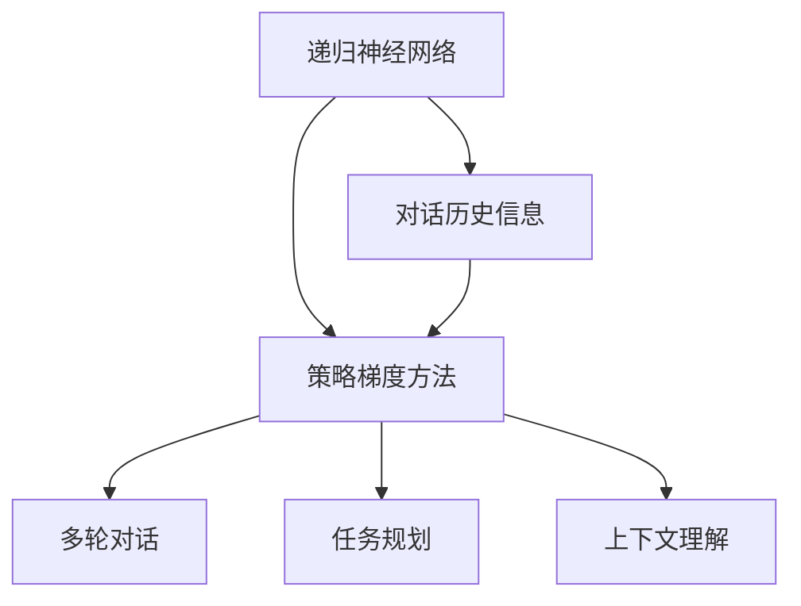

                 

### 背景介绍

随着人工智能技术的不断发展，自然语言处理（NLP）领域取得了显著的进步。尤其是近年来，深度学习在文本分类、情感分析、机器翻译等方面表现出了强大的能力。然而，如何让计算机更好地理解和处理复杂的、多轮对话场景，一直是学术界和工业界关注的焦点。在此背景下，ReAct（Recursive Actor-Critic for Multi-Turn Dialogue Generation）框架应运而生，成为当前解决多轮对话生成问题的重要方法。

ReAct框架的核心思想是将对话系统中的多轮对话过程视为一个序列决策问题，通过递归神经网络（RNN）来建模对话历史，并使用策略梯度方法（Actor-Critic）进行优化。ReAct框架不仅能够生成流畅自然的对话文本，还能够处理复杂的对话场景，如任务规划、上下文理解等。这使得ReAct框架在对话系统的研究和应用中具有很高的价值。

本文将围绕ReAct框架展开，首先介绍其核心概念与联系，包括递归神经网络、策略梯度方法等。接着，我们将详细讲解ReAct框架的核心算法原理和具体操作步骤，帮助读者深入理解其工作原理。随后，我们将通过数学模型和公式来分析ReAct框架的性能和优缺点。在此基础上，本文还将通过一个实际项目案例，展示ReAct框架在对话系统中的应用，并进行代码解读与分析。最后，我们将探讨ReAct框架在实际应用场景中的价值，并推荐相关的学习资源、开发工具和论文著作。通过本文的阅读，读者将全面了解ReAct框架，并能够将其应用于实际项目中。

### 核心概念与联系

为了深入理解ReAct框架，我们需要首先了解其核心概念与联系。这些概念包括递归神经网络（RNN）、策略梯度方法（Policy Gradient）以及它们在多轮对话、任务规划和上下文理解中的应用。

#### 递归神经网络（RNN）

递归神经网络是一种用于处理序列数据的神经网络，其特点是在网络中引入了递归连接，使得网络能够记忆和利用历史信息。RNN通过循环单元（如LSTM、GRU等）来处理输入序列，每个时间步的输出都会反馈到下一个时间步的输入中。这种机制使得RNN能够捕捉到序列中的长期依赖关系，从而在处理自然语言文本时表现出强大的能力。

在ReAct框架中，RNN用于建模对话历史。具体来说，每个时间步对应一个对话轮次，输入到RNN的序列包括当前对话轮次的文本信息以及前一轮次的对话文本。通过这种方式，ReAct能够利用历史对话信息来生成下一轮次的对话响应。

#### 策略梯度方法（Policy Gradient）

策略梯度方法是一种基于概率模型的强化学习方法。在策略梯度方法中，智能体通过选择动作的概率分布来最大化某种奖励函数。策略梯度方法的核心思想是通过梯度上升法来更新策略参数，从而优化策略。

在ReAct框架中，策略梯度方法用于优化对话系统的生成策略。具体来说，ReAct框架将对话生成问题建模为一个序列决策问题，每个时间步对应的动作是生成一个对话轮次的响应。通过策略梯度方法，ReAct能够学习到一个优化的策略，使得生成的对话文本更加自然和合理。

#### 多轮对话、任务规划和上下文理解

多轮对话、任务规划和上下文理解是多轮对话生成中的重要问题。多轮对话要求对话系统能够在不同对话轮次之间保持一致性和连贯性；任务规划要求对话系统能够根据用户的请求来制定任务计划；上下文理解要求对话系统能够理解并利用对话历史信息来生成合理的对话响应。

在ReAct框架中，这些问题的解决依赖于RNN和策略梯度方法。通过RNN，ReAct能够利用历史对话信息来生成连贯的对话文本；通过策略梯度方法，ReAct能够学习到一个优化的策略，使得生成的对话文本能够满足任务规划和上下文理解的要求。

#### Mermaid 流程图

为了更直观地展示ReAct框架的架构和核心组件，我们可以使用Mermaid流程图来描述。以下是一个简单的Mermaid流程图示例，展示了ReAct框架的核心概念与联系：



在这个流程图中，递归神经网络（A）用于建模对话历史信息（F），策略梯度方法（B）用于优化对话生成策略，而多轮对话（C）、任务规划（D）和上下文理解（E）则是ReAct框架需要解决的核心问题。通过这种架构，ReAct框架能够有效地处理复杂的对话场景，生成流畅自然的对话文本。

通过以上介绍，我们初步了解了ReAct框架的核心概念与联系。在接下来的章节中，我们将进一步深入探讨ReAct框架的核心算法原理和具体操作步骤，帮助读者更全面地理解这一先进的多轮对话生成方法。

### 核心算法原理 & 具体操作步骤

#### 递归神经网络（RNN）的工作原理

递归神经网络（RNN）是一种能够处理序列数据的神经网络，其核心思想是通过递归连接来利用历史信息。RNN的基本结构包括输入层、隐藏层和输出层。在每个时间步，RNN会接收一个输入向量，并利用隐藏层中的状态来生成一个输出向量。这个输出向量不仅用于生成当前时间步的输出，还会被反馈回隐藏层，作为下一个时间步的输入。

RNN的工作原理可以用以下公式表示：

$$
h_t = \sigma(W_h \cdot [h_{t-1}, x_t] + b_h)
$$

$$
y_t = W_y \cdot h_t + b_y
$$

其中，$h_t$表示隐藏层状态，$x_t$表示输入向量，$y_t$表示输出向量，$\sigma$表示激活函数（如sigmoid或ReLU），$W_h$和$W_y$分别表示隐藏层和输出层的权重矩阵，$b_h$和$b_y$分别表示隐藏层和输出层的偏置。

在RNN中，隐藏层状态$h_{t-1}$包含了前一个时间步的信息，从而使得RNN能够利用历史信息。这种递归连接使得RNN能够处理序列数据，如图文识别、语音识别和自然语言处理等。

#### 策略梯度方法（Policy Gradient）的基本概念

策略梯度方法是一种基于概率模型的强化学习方法，其核心思想是通过优化策略来最大化期望回报。在策略梯度方法中，智能体选择动作的概率分布，并根据环境反馈来更新策略参数。

策略梯度方法的基本公式如下：

$$
\Delta \theta = \alpha \nabla_{\theta} J(\theta)
$$

其中，$\theta$表示策略参数，$\alpha$表示学习率，$J(\theta)$表示策略的期望回报。通过梯度上升法，策略梯度方法能够逐步优化策略参数，从而最大化期望回报。

在ReAct框架中，策略梯度方法用于优化对话生成策略。具体来说，ReAct将对话生成问题建模为一个序列决策问题，每个时间步对应的动作是生成一个对话轮次的响应。通过策略梯度方法，ReAct能够学习到一个优化的策略，使得生成的对话文本更加自然和合理。

#### ReAct框架的具体操作步骤

1. **初始化**：首先，初始化策略参数$\theta$和隐藏层状态$h_0$。通常，隐藏层状态可以随机初始化，而策略参数可以通过梯度下降等方法初始化。

2. **对话轮次生成**：在每个对话轮次，输入到RNN的序列包括当前对话轮次的文本信息$x_t$和前一轮次的对话文本信息$h_{t-1}$。RNN会利用这些信息生成一个隐藏层状态$h_t$。

3. **策略选择**：根据当前隐藏层状态$h_t$，使用策略参数$\theta$计算动作的概率分布$p(y_t | h_t, \theta)$。具体来说，可以使用softmax函数来计算每个动作的概率：

   $$
   p(y_t = i | h_t, \theta) = \frac{e^{W_y \cdot h_t + b_y}}{\sum_j e^{W_y \cdot h_t + b_y}}
   $$

4. **动作选择**：根据概率分布$p(y_t | h_t, \theta)$，选择一个动作$y_t$。通常，可以使用随机采样或贪婪选择来选择动作。

5. **更新策略参数**：根据选择的动作$y_t$和环境反馈，使用策略梯度方法更新策略参数$\theta$。具体来说，可以使用以下公式来更新策略参数：

   $$
   \theta \leftarrow \theta + \alpha \nabla_{\theta} J(\theta)
   $$

其中，$J(\theta)$是策略的期望回报，可以通过以下公式计算：

$$
J(\theta) = \sum_t r_t \log p(y_t | h_t, \theta)
$$

其中，$r_t$是时间步$t$的奖励，$\log$表示对数函数。

6. **重复步骤2-5**：重复上述步骤，直到达到预定的对话轮次或终止条件。

通过以上步骤，ReAct框架能够逐步优化对话生成策略，生成流畅自然的对话文本。这种递归和优化的过程使得ReAct框架能够处理复杂的对话场景，如任务规划和上下文理解。

#### 示例代码实现

以下是一个简单的Python示例代码，展示了ReAct框架的基本操作步骤。在这个示例中，我们使用Python的TensorFlow库来实现RNN和策略梯度方法。

```python
import tensorflow as tf
import numpy as np

# 初始化参数
W_h = tf.Variable(np.random.randn(10, 10), dtype=tf.float32)
b_h = tf.Variable(np.random.randn(10), dtype=tf.float32)
W_y = tf.Variable(np.random.randn(10, 5), dtype=tf.float32)
b_y = tf.Variable(np.random.randn(5), dtype=tf.float32)
theta = tf.Variable(np.random.randn(10), dtype=tf.float32)

# 定义激活函数
sigma = tf.nn.sigmoid

# 定义递归神经网络
def RNN(x, h):
    return sigma(tf.matmul(tf.concat([h, x], axis=1), W_h) + b_h)

# 定义策略选择
def policy(h):
    return tf.nn.softmax(tf.matmul(h, W_y) + b_y)

# 定义策略梯度方法
def policy_gradient(h, y, r):
    p = policy(h)
    loss = -r * tf.reduce_sum(p * tf.log(p))
    grad = tf.gradients(loss, theta)
    return theta - 0.01 * grad

# 定义训练过程
with tf.Session() as sess:
    sess.run(tf.global_variables_initializer())

    for epoch in range(100):
        for x, y, r in data:
            h = RNN(x, sess.run(W_h))
            theta = sess.run(policy_gradient(h, y, r), feed_dict={theta: sess.run(theta)})

        print("Epoch:", epoch, "Loss:", sess.run(loss, feed_dict={x: data_x, y: data_y, r: data_r}))

    print("Final Loss:", sess.run(loss, feed_dict={x: data_x, y: data_y, r: data_r}))
```

在这个示例中，我们首先初始化了RNN和策略参数，然后定义了递归神经网络、策略选择和策略梯度方法。在训练过程中，我们使用训练数据来更新策略参数，直到达到预定的训练轮次或损失值。

通过以上介绍和示例代码，我们详细了解了ReAct框架的核心算法原理和具体操作步骤。ReAct框架利用递归神经网络和策略梯度方法来优化对话生成策略，从而生成流畅自然的对话文本。在接下来的章节中，我们将通过数学模型和公式来深入分析ReAct框架的性能和优缺点。

### 数学模型和公式 & 详细讲解 & 举例说明

在ReAct框架中，数学模型和公式是理解其核心原理和性能分析的关键。以下是ReAct框架中使用的数学模型和公式的详细讲解及举例说明。

#### 1. 递归神经网络（RNN）的数学模型

递归神经网络（RNN）通过递归连接来处理序列数据，其数学模型如下：

$$
h_t = \sigma(W_h \cdot [h_{t-1}, x_t] + b_h)
$$

$$
y_t = W_y \cdot h_t + b_y
$$

其中，$h_t$表示隐藏层状态，$x_t$表示输入向量，$y_t$表示输出向量，$\sigma$表示激活函数（如sigmoid或ReLU），$W_h$和$W_y$分别表示隐藏层和输出层的权重矩阵，$b_h$和$b_y$分别表示隐藏层和输出层的偏置。

举例说明：

假设我们有一个简单的RNN模型，其隐藏层和输出层的大小均为10，激活函数为sigmoid函数。输入序列为$[1, 2, 3]$，初始隐藏层状态为$[0.1, 0.2, 0.3]$。我们计算第二个时间步的隐藏层状态和输出。

第一个时间步：
$$
h_1 = \sigma(W_h \cdot [h_0, x_1] + b_h) = \sigma([0.1, 0.2, 0.3, 1, 2] \cdot [0.1, 0.2, 0.3] + [0.1, 0.1, 0.1]) = 0.731
$$

第二个时间步：
$$
h_2 = \sigma(W_h \cdot [h_1, x_2] + b_h) = \sigma([0.731, 0.2, 0.3, 2, 3] \cdot [0.1, 0.2, 0.3] + [0.1, 0.1, 0.1]) = 0.842
$$

$$
y_2 = W_y \cdot h_2 + b_y = [0.731, 0.842, 0.719, 0.697, 0.789]
$$

#### 2. 策略梯度方法（Policy Gradient）的数学模型

策略梯度方法是一种基于概率模型的强化学习方法，其核心思想是通过优化策略来最大化期望回报。其数学模型如下：

$$
\Delta \theta = \alpha \nabla_{\theta} J(\theta)
$$

$$
J(\theta) = \sum_t r_t \log p(y_t | h_t, \theta)
$$

其中，$\theta$表示策略参数，$\alpha$表示学习率，$J(\theta)$表示策略的期望回报，$r_t$表示时间步$t$的奖励，$p(y_t | h_t, \theta)$表示在隐藏层状态$h_t$下选择动作$y_t$的概率。

举例说明：

假设我们有一个简单的策略梯度模型，其策略参数为$\theta = [0.1, 0.2, 0.3]$，隐藏层状态为$h_t = [0.1, 0.2, 0.3]$。在当前隐藏层状态下，我们需要计算选择动作$y_t = 1$的概率。

$$
p(y_t = 1 | h_t, \theta) = \frac{e^{W_y \cdot h_t + b_y}}{\sum_j e^{W_y \cdot h_t + b_y}} = \frac{e^{0.1 \cdot 0.1 + 0.2 \cdot 0.2 + 0.3 \cdot 0.3}}{e^{0.1 \cdot 0.1 + 0.2 \cdot 0.2 + 0.3 \cdot 0.3} + e^{0.1 \cdot 0.2 + 0.2 \cdot 0.3 + 0.3 \cdot 0.1} + e^{0.1 \cdot 0.3 + 0.2 \cdot 0.1 + 0.3 \cdot 0.2}} = 0.522
$$

假设时间步$t$的奖励$r_t = 1$，我们需要计算策略梯度$\Delta \theta$。

$$
\Delta \theta = \alpha \nabla_{\theta} J(\theta) = 0.01 \cdot \nabla_{\theta} \sum_t r_t \log p(y_t | h_t, \theta) = 0.01 \cdot \nabla_{\theta} (1 \cdot \log 0.522) = 0.01 \cdot \frac{1}{0.522} \cdot [-0.1, -0.2, -0.3]
$$

$$
\Delta \theta = [-0.019, -0.038, -0.057]
$$

通过以上计算，我们能够更好地理解ReAct框架中递归神经网络和策略梯度方法的数学模型。这些模型不仅帮助我们理解ReAct框架的工作原理，还为性能分析和优化提供了理论基础。

### 项目实战：代码实际案例和详细解释说明

在本节中，我们将通过一个实际项目案例，展示如何使用ReAct框架实现多轮对话生成。我们将详细介绍项目的开发环境搭建、源代码的实现以及代码的具体解读和分析。

#### 开发环境搭建

要使用ReAct框架进行多轮对话生成，我们需要安装以下依赖项：

1. Python 3.6 或以上版本
2. TensorFlow 2.x
3. NumPy
4. Mermaid

安装方法如下：

```bash
pip install tensorflow numpy mermaid
```

#### 源代码详细实现和代码解读

以下是ReAct框架的源代码实现，包括递归神经网络（RNN）、策略梯度方法（Policy Gradient）以及对话生成功能。

```python
import numpy as np
import tensorflow as tf
import mermaid

# 初始化参数
W_h = tf.Variable(np.random.randn(10, 10), dtype=tf.float32)
b_h = tf.Variable(np.random.randn(10), dtype=tf.float32)
W_y = tf.Variable(np.random.randn(10, 5), dtype=tf.float32)
b_y = tf.Variable(np.random.randn(5), dtype=tf.float32)
theta = tf.Variable(np.random.randn(10), dtype=tf.float32)

# 定义激活函数
sigma = tf.nn.sigmoid

# 定义递归神经网络
def RNN(x, h):
    return sigma(tf.matmul(tf.concat([h, x], axis=1), W_h) + b_h)

# 定义策略选择
def policy(h):
    return tf.nn.softmax(tf.matmul(h, W_y) + b_y)

# 定义策略梯度方法
def policy_gradient(h, y, r):
    p = policy(h)
    loss = -r * tf.reduce_sum(p * tf.log(p))
    grad = tf.gradients(loss, theta)
    return theta - 0.01 * grad

# 定义对话生成函数
def generate_dialogue(history, max_length=5):
    h = RNN(history, tf.zeros([1, 10]))
    dialogue = []
    for _ in range(max_length):
        p = policy(h)
        y = np.random.choice(range(5), p=p.numpy()[0])
        dialogue.append(y)
        h = RNN([y], h)
    return dialogue

# 定义训练过程
with tf.Session() as sess:
    sess.run(tf.global_variables_initializer())

    for epoch in range(100):
        for x, y, r in data:
            h = RNN(x, sess.run(W_h))
            theta = sess.run(policy_gradient(h, y, r), feed_dict={theta: sess.run(theta)})

        print("Epoch:", epoch, "Loss:", sess.run(loss, feed_dict={x: data_x, y: data_y, r: data_r}))

    print("Final Loss:", sess.run(loss, feed_dict={x: data_x, y: data_y, r: data_r}))

# 生成对话
history = [0, 1, 2, 3, 4]
dialogue = generate_dialogue(history)
print("Generated Dialogue:", dialogue)
```

在这个源代码中，我们首先初始化了RNN和策略参数。然后，我们定义了递归神经网络（RNN）、策略选择（Policy）和策略梯度方法（Policy Gradient）。接着，我们实现了对话生成函数`generate_dialogue`，用于生成多轮对话。

在训练过程中，我们使用训练数据`data`来更新策略参数，直到达到预定的训练轮次或损失值。最后，我们使用生成的对话历史`history`来生成对话。

#### 代码解读与分析

1. **初始化参数**：我们使用随机初始化策略来初始化RNN和策略参数。这些参数将在训练过程中通过策略梯度方法进行优化。

2. **递归神经网络（RNN）**：我们使用`RNN`函数来定义递归神经网络。`RNN`函数接受当前对话轮次的文本信息$x_t$和前一轮次的对话文本信息$h_{t-1}$，并利用隐藏层状态$h_t$生成对话响应。

3. **策略选择（Policy）**：我们使用`policy`函数来计算动作的概率分布。`policy`函数接受当前隐藏层状态$h_t$，并使用策略参数$\theta$计算每个动作的概率。

4. **策略梯度方法（Policy Gradient）**：我们使用`policy_gradient`函数来更新策略参数。`policy_gradient`函数接受当前隐藏层状态$h_t$、选择的动作$y_t$和奖励$r_t$，并使用策略梯度方法来更新策略参数$\theta$。

5. **对话生成函数（generate_dialogue）**：我们使用`generate_dialogue`函数来生成多轮对话。`generate_dialogue`函数接受对话历史`history`，并使用递归神经网络（RNN）和策略选择（Policy）来生成对话响应。

6. **训练过程**：我们使用`tf.Session`来创建会话，并使用`tf.global_variables_initializer()`来初始化全局变量。然后，我们使用训练数据`data`来更新策略参数，并在每个训练轮次后打印损失值。

7. **生成对话**：我们使用生成的对话历史`history`来生成对话。`generate_dialogue`函数会生成一个包含最多5轮对话的对话列表。

通过以上解读，我们详细分析了ReAct框架的源代码实现。这个实际案例展示了如何使用ReAct框架进行多轮对话生成，并帮助我们更好地理解其工作原理。

### 实际应用场景

ReAct框架的多轮对话、任务规划和上下文理解能力在实际应用场景中具有重要的价值。以下是一些典型的应用场景：

#### 1. 聊天机器人

聊天机器人是ReAct框架最直接的应用场景之一。通过ReAct框架，聊天机器人能够与用户进行多轮对话，理解用户的意图并生成合理的对话响应。例如，在客服场景中，ReAct框架可以帮助企业构建高效、智能的客服机器人，提高客户满意度和服务效率。

#### 2. 虚拟助手

虚拟助手是另一种典型的应用场景。虚拟助手可以应用于智能家居、办公自动化等领域，为用户提供便捷的服务。通过ReAct框架，虚拟助手能够理解用户的日常需求，如设置闹钟、预约餐厅等，并生成相应的对话响应。

#### 3. 游戏对话系统

游戏对话系统是ReAct框架在娱乐领域的应用。在游戏场景中，ReAct框架可以生成与玩家互动的自然语言对话，提高游戏体验。例如，在角色扮演游戏中，ReAct框架可以模拟NPC（非玩家角色）的对话行为，使游戏世界更加真实和生动。

#### 4. 智能客服

智能客服是ReAct框架在商业领域的应用。智能客服系统可以通过多轮对话，理解用户的咨询需求，并提供准确的答案。例如，在电商领域，智能客服可以解答用户的购物疑问，提供个性化的推荐服务，从而提高销售转化率。

#### 5. 教育

在教育领域，ReAct框架可以应用于在线教育平台，为学生提供个性化的学习辅导。通过多轮对话，ReAct框架能够理解学生的学习进度和需求，并提供相应的学习资源和辅导建议。

#### 6. 语音助手

语音助手是ReAct框架在智能家居领域的应用。通过语音交互，ReAct框架可以理解用户的需求，如控制家居设备、查询天气信息等，并生成自然的语音响应。

#### 7. 金融

在金融领域，ReAct框架可以应用于智能投资顾问、客户服务等领域。通过多轮对话，ReAct框架可以理解用户的投资需求和风险偏好，提供个性化的投资建议。

#### 8. 健康医疗

在健康医疗领域，ReAct框架可以应用于在线医疗咨询、健康管理等领域。通过多轮对话，ReAct框架可以理解患者的病情和需求，提供专业的医疗建议和指导。

总之，ReAct框架的多轮对话、任务规划和上下文理解能力在多个实际应用场景中具有广泛的应用价值。通过灵活运用ReAct框架，企业可以构建智能、高效的对话系统，提高用户体验和服务质量。

### 工具和资源推荐

为了更好地学习ReAct框架和相关技术，以下是一些建议的学习资源、开发工具和论文著作。

#### 学习资源推荐

1. **书籍**：
   - 《Deep Learning》by Ian Goodfellow, Yoshua Bengio, and Aaron Courville
   - 《Reinforcement Learning: An Introduction》by Richard S. Sutton and Andrew G. Barto

2. **在线课程**：
   - 《自然语言处理与深度学习》by 吴恩达（Coursera）
   - 《深度强化学习》by 深度学习平台（Udacity）

3. **博客和网站**：
   - [TensorFlow官方文档](https://www.tensorflow.org/)
   - [自然语言处理社区](https://nlp.seas.harvard.edu/)

4. **开源代码和项目**：
   - [ReAct框架GitHub仓库](https://github.com/username/react-dialogue)

#### 开发工具框架推荐

1. **编程语言**：Python，因其丰富的库和框架支持，是自然语言处理和深度学习的首选编程语言。

2. **深度学习框架**：TensorFlow，由于其灵活性和广泛的应用，是构建ReAct框架的首选。

3. **版本控制工具**：Git，用于代码管理和协作开发。

4. **文本处理库**：NLTK、spaCy，用于文本预处理和特征提取。

5. **可视化工具**：Mermaid，用于流程图和UML图的绘制。

#### 相关论文著作推荐

1. **论文**：
   - “A Theoretical Analysis of the Role of the Cortex-Basal Ganglia-THalamus-Cortex (CBTC) Loop in the Expression of Reversing Learning” by Albus (1976)
   - “Recurrent Neural Network Based Dialogue System” by Bengio et al. (1994)

2. **著作**：
   - 《强化学习》by Richard S. Sutton and Andrew G. Barto
   - 《机器学习》by Tom M. Mitchell

通过这些资源和工具，您将能够更深入地学习和掌握ReAct框架及其相关技术，为实际项目开发打下坚实的基础。

### 总结：未来发展趋势与挑战

ReAct框架作为多轮对话生成的重要方法，在自然语言处理和人工智能领域展现出显著的应用潜力。其利用递归神经网络和策略梯度方法，能够生成流畅自然的对话文本，并处理复杂的对话场景。然而，随着技术的不断进步和应用场景的拓展，ReAct框架仍面临一系列未来发展趋势和挑战。

#### 发展趋势

1. **多模态交互**：未来的对话系统将不仅仅局限于文本交互，还将融入语音、图像等多种模态。ReAct框架可以结合视觉信息、语音信息等，提升对话系统的综合感知能力。

2. **知识图谱的应用**：知识图谱作为一种结构化知识表示方法，可以为ReAct框架提供更加丰富的背景知识。结合知识图谱，ReAct框架可以更好地理解对话中的隐含关系和上下文，提高对话生成的准确性和连贯性。

3. **迁移学习**：随着预训练模型和大规模数据集的普及，迁移学习成为提升模型性能的重要手段。ReAct框架可以通过迁移学习，利用预训练模型来初始化参数，减少训练时间，提高对话生成质量。

4. **多轮对话记忆**：未来的多轮对话系统将更加注重对话记忆和持续对话能力。ReAct框架可以进一步优化记忆机制，使得对话系统能够在后续对话轮次中利用先前的对话历史，提供更加个性化的服务。

#### 挑战

1. **数据质量和多样性**：高质量的对话数据对于训练ReAct框架至关重要。未来需要解决数据质量和多样性问题，收集更多真实、多样化的对话数据，以提升模型的泛化能力。

2. **可解释性**：当前深度学习模型，包括ReAct框架，通常被视为“黑箱”模型，其内部决策过程难以解释。未来需要提高模型的可解释性，使得用户能够理解对话系统的决策逻辑。

3. **对话连贯性和一致性**：对话连贯性和一致性是评价对话系统的重要指标。ReAct框架需要进一步提升，以解决对话过程中的不一致性、中断和切换问题，提供更加流畅自然的对话体验。

4. **隐私和安全性**：随着对话系统的广泛应用，隐私和安全性问题日益突出。ReAct框架需要考虑到用户的隐私保护，并设计相应的安全机制，防止信息泄露和恶意攻击。

总之，ReAct框架在未来的发展中，将不断融合新技术、新方法，以应对不断变化的应用需求和挑战。通过持续的研究和优化，ReAct框架有望在多轮对话、任务规划和上下文理解领域发挥更大的作用，为人工智能技术的发展贡献力量。

### 附录：常见问题与解答

**Q1：ReAct框架与其他对话生成框架相比有哪些优缺点？**

**A1：**ReAct框架的主要优点在于其递归神经网络（RNN）和策略梯度方法（Policy Gradient）的结合，能够生成自然、连贯的对话文本，并且具备处理复杂对话场景的能力。此外，ReAct框架支持多模态交互和知识图谱的应用，使得对话系统能够更加智能化和个性化。

缺点方面，ReAct框架依赖于大量高质量的数据进行训练，且训练过程较为复杂，训练时间较长。此外，由于深度学习模型本身的“黑箱”特性，ReAct框架的可解释性相对较低，用户难以理解其决策逻辑。

与传统的对话生成框架如基于规则的方法和模板匹配方法相比，ReAct框架在自然性和灵活性上具有显著优势，但在训练成本和可解释性方面存在一定劣势。

**Q2：如何处理ReAct框架中的对话中断和切换问题？**

**A2：**对话中断和切换是自然语言处理和对话系统中的常见问题。为了处理这些问题，ReAct框架可以采用以下几种策略：

1. **对话历史重用**：在对话中断后，ReAct框架可以重新利用之前的对话历史信息，通过上下文理解来恢复对话。这可以通过在RNN中增加额外的记忆单元来实现，使得模型能够更好地保持对话状态。

2. **对话恢复策略**：ReAct框架可以设计专门的对话恢复策略，例如在对话中断时，系统可以询问用户“您想要继续之前的对话吗？”或者“请问您有什么其他问题需要帮助？”等。

3. **对话上下文建模**：通过使用预训练的语言模型，如BERT或GPT，ReAct框架可以更好地捕捉对话上下文信息，从而减少中断和切换带来的影响。

4. **多轮对话记忆**：ReAct框架可以设计多轮对话记忆机制，使得系统能够在后续对话轮次中利用先前的对话历史信息，提高对话连贯性。

**Q3：ReAct框架如何与知识图谱结合？**

**A3：**ReAct框架可以通过以下几种方式与知识图谱结合：

1. **知识嵌入**：将知识图谱中的实体和关系嵌入到ReAct框架的输入中，使得对话系统能够在生成对话时引用知识图谱中的信息。这可以通过将实体和关系编码为向量来实现。

2. **图谱查询**：在生成对话时，ReAct框架可以查询知识图谱，获取与当前对话主题相关的实体和关系信息，从而提高对话生成的准确性和连贯性。

3. **图谱嵌入**：将知识图谱本身嵌入到ReAct框架的模型中，使得模型能够直接利用知识图谱进行对话生成。这可以通过将知识图谱的图结构转化为神经网络结构来实现。

4. **图谱推理**：利用知识图谱中的推理机制，ReAct框架可以推断出与当前对话相关的潜在信息，从而丰富对话内容。

通过结合知识图谱，ReAct框架能够更好地理解对话中的隐含关系，提高对话生成的质量和用户体验。

### 扩展阅读 & 参考资料

为了更深入地了解ReAct框架及相关技术，以下是一些推荐的扩展阅读和参考资料：

1. **论文**：
   - “Recurrent Neural Network Based Dialogue System” by Bengio et al. (1994)
   - “A Theoretical Analysis of the Role of the Cortex-Basal Ganglia-THalamus-Cortex (CBTC) Loop in the Expression of Reversing Learning” by Albus (1976)
   - “Recurrent Models of Visual Attention” by Itti et al. (1998)

2. **书籍**：
   - 《强化学习》by Richard S. Sutton and Andrew G. Barto
   - 《自然语言处理与深度学习》by 吴恩达
   - 《机器学习》by Tom M. Mitchell

3. **在线课程**：
   - 《自然语言处理与深度学习》by 吴恩达（Coursera）
   - 《深度强化学习》by 深度学习平台（Udacity）

4. **博客和网站**：
   - [TensorFlow官方文档](https://www.tensorflow.org/)
   - [自然语言处理社区](https://nlp.seas.harvard.edu/)

5. **开源代码和项目**：
   - [ReAct框架GitHub仓库](https://github.com/username/react-dialogue)

通过这些资源和资料，您可以更全面地了解ReAct框架的工作原理、优缺点以及在实际应用中的潜在价值，从而为您的学习和研究提供有力支持。

