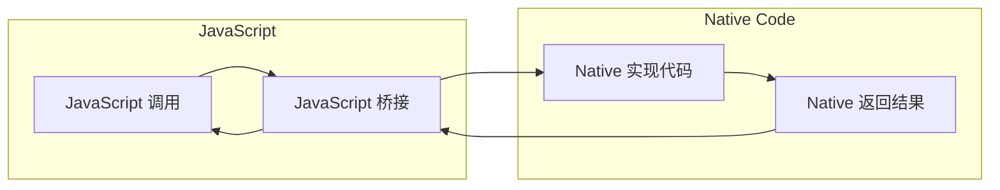

                 

### 背景介绍 Background Introduction

#### React Native 简介 Introduction to React Native

React Native 是由 Facebook 开发的一种开源跨平台移动应用开发框架。它允许开发者使用 JavaScript 和 React 的语法来构建 iOS 和 Android 应用程序，从而大大提高了开发效率。React Native 的核心理念是组件化开发，通过封装 UI 组件，使开发者可以更快速地搭建复杂的用户界面。

React Native 的主要优势在于：

1. **跨平台开发**：使用同一套代码即可同时开发 iOS 和 Android 应用，极大地减少了开发时间和成本。
2. **丰富的组件库**：React Native 拥有一个庞大的组件库，开发者可以方便地使用现有的组件来搭建应用。
3. **高效的热更新**：React Native 支持热更新，开发者可以快速地进行调试和测试，提高开发效率。

#### 原生模块开发 Native Module Development

在 React Native 应用中，原生模块（Native Modules）是连接 JavaScript 代码和原生代码（如 Objective-C/Swift 对于 iOS，Java/Kotlin 对于 Android）的桥梁。原生模块允许 JavaScript 代码调用原生代码，从而实现一些原生平台特有的功能，如相机、定位、推送通知等。

原生模块开发的重要性体现在以下几个方面：

1. **性能优化**：一些复杂的计算和图形渲染等操作，原生代码通常会比 JavaScript 更高效。
2. **功能扩展**：React Native 内置的组件和 API 通常无法满足所有应用的需求，原生模块可以实现更复杂和更专业的功能。
3. **平台一致性**：通过使用原生模块，可以确保在不同平台上实现一致的 UI 和功能。

在本篇文章中，我们将深入探讨 React Native 原生模块开发的各个方面，包括核心概念、开发流程、性能优化以及实战案例等，旨在为开发者提供一套完整的原生模块开发指南。

#### 文章结构 Overview of the Article

本文将分为以下几个主要部分：

1. **核心概念与联系**：介绍 React Native 原生模块开发的核心概念及其与 React Native 生态系统的关系。
2. **核心算法原理 & 具体操作步骤**：详细讲解原生模块的开发原理，包括 JavaScript 与原生代码的交互方式。
3. **数学模型和公式 & 详细讲解 & 举例说明**：探讨原生模块开发中涉及的一些数学模型和公式，并通过实例进行详细说明。
4. **项目实战：代码实际案例和详细解释说明**：通过实际项目案例，展示原生模块的开发流程和关键代码解读。
5. **实际应用场景**：分析原生模块在不同应用场景下的作用和效果。
6. **工具和资源推荐**：推荐一些有用的学习资源和开发工具。
7. **总结：未来发展趋势与挑战**：讨论原生模块开发在未来的发展趋势以及可能面临的挑战。
8. **附录：常见问题与解答**：汇总一些常见的问题及其解答。
9. **扩展阅读 & 参考资料**：提供一些相关的扩展阅读资源。

通过本文的阅读，开发者将能够系统地掌握 React Native 原生模块开发的各个方面，从而为构建高性能、功能丰富的移动应用打下坚实的基础。

### 核心概念与联系 Core Concepts and Relationships

#### React Native 原生模块概述 Overview of React Native Native Modules

React Native 原生模块（Native Modules）是实现 JavaScript 与原生代码（Objective-C/Swift for iOS, Java/Kotlin for Android）交互的关键机制。原生模块的作用是将 JavaScript 层的调用翻译为原生平台可识别的代码，从而实现跨平台的代码复用。

原生模块的主要组件包括：

1. **JavaScript 模块接口**：定义了 JavaScript 代码与原生代码之间的接口，JavaScript 代码通过调用这个接口与原生代码进行交互。
2. **原生实现**：实际编写和实现原生平台代码的部分，如 Objective-C/Swift（iOS）和 Java/Kotlin（Android）。
3. **原生包装器**：用于将原生实现包装为 JavaScript 可调用的模块。

#### 原生模块的交互机制 Interaction Mechanism of Native Modules

原生模块的交互机制可以分为以下几个步骤：

1. **JavaScript 调用**：JavaScript 代码通过调用原生模块接口中的方法发起对原生代码的请求。
2. **JavaScript 调用桥接**：React Native 的调用桥接（Call Bridge）将 JavaScript 调用转换为原生平台可识别的消息。
3. **原生代码执行**：原生代码执行 JavaScript 调用的具体操作。
4. **返回结果**：原生代码执行完成后，将结果通过调用桥接返回给 JavaScript 代码。

#### 原生模块与 React Native 的关系 Relationship between Native Modules and React Native

原生模块是 React Native 生态系统的重要组成部分，与 React Native 的关系如下：

1. **组件化开发**：React Native 的核心思想之一是组件化开发，通过封装 UI 组件，开发者可以更快速地搭建应用。原生模块则通过封装原生代码，实现了跨平台的组件化开发。
2. **性能优化**：原生模块可以让一些性能敏感的操作（如图形渲染、音频处理等）直接在原生层完成，从而提高应用的性能。
3. **功能扩展**：React Native 内置的组件和 API 通常无法满足所有应用的需求，原生模块可以实现更复杂和更专业的功能。
4. **平台一致性**：通过使用原生模块，开发者可以确保在不同平台上实现一致的 UI 和功能，提高用户体验。

#### 原生模块的开发流程 Development Process of Native Modules

原生模块的开发流程主要包括以下几个步骤：

1. **需求分析**：明确原生模块需要实现的功能，确定原生代码和 JavaScript 代码的接口。
2. **原生代码实现**：根据需求编写原生平台的代码，实现具体的功能。
3. **JavaScript 模块接口定义**：编写 JavaScript 代码，定义与原生代码交互的接口。
4. **原生包装器编写**：将原生实现包装为 JavaScript 可调用的模块。
5. **集成与测试**：将原生模块集成到 React Native 应用中，进行功能测试和性能优化。

#### Mermaid 流程图 Process Flow with Mermaid Diagram

以下是一个简单的 Mermaid 流程图，展示了原生模块的开发流程：



在这个流程图中，JavaScript 调用通过 JavaScript 桥接与 Native 实现代码进行交互，最终将结果返回给 JavaScript 代码。

通过本文的介绍，读者应该对 React Native 原生模块开发的核心概念及其与 React Native 的关系有了初步了解。在接下来的章节中，我们将深入探讨原生模块的具体实现原理和操作步骤。

### 核心算法原理 & 具体操作步骤 Core Algorithm Principle and Specific Steps

原生模块开发是 React Native 技术栈中至关重要的一环，它不仅关系到应用的功能实现，也直接影响应用的性能和用户体验。下面，我们将详细探讨 React Native 原生模块的核心算法原理以及具体操作步骤。

#### JavaScript 与 Native 交互的核心算法原理 Core Algorithm Principle of JavaScript-Native Interaction

React Native 中，JavaScript 与 Native 代码的交互是通过 JavaScriptCore（iOS）和 Chromium（Android）实现的。JavaScriptCore 和 Chromium 是两个高性能的 JavaScript 引擎，它们负责将 JavaScript 代码转换为机器码执行，并与 Native 代码进行通信。

核心算法原理主要包括以下几个方面：

1. **调用桥接（Call Bridge）**：React Native 使用调用桥接机制，将 JavaScript 代码中的函数调用转换为 Native 平台可识别的消息。调用桥接通过 React Native 的运行时 API，将 JavaScript 代码与 Native 代码连接起来。
2. **事件循环（Event Loop）**：React Native 使用事件循环来管理 JavaScript 代码的执行顺序。当 JavaScript 代码执行完毕后，事件循环会将控制权交还给 Native 代码，从而实现 JavaScript 和 Native 代码的协同工作。
3. **线程管理（Thread Management）**：React Native 采用多线程架构，JavaScript 代码在主线程（JavaScript Thread）执行，而 Native 代码在原生线程（Native Thread）执行。线程管理确保了 JavaScript 和 Native 代码的执行效率。

以下是一个简化的流程图，展示了 JavaScript 与 Native 代码交互的核心算法原理：


在这个流程图中，JavaScript 调用通过调用桥接传递给 Native 代码，在 Native 线程中执行后，再将结果返回给 JavaScript。

#### JavaScript 与 Native 交互的具体操作步骤 Specific Steps of JavaScript-Native Interaction

具体操作步骤如下：

1. **定义 Native Module**：在 React Native 项目中，首先需要定义一个 Native Module。这通常通过在 JavaScript 代码中引入一个 Native 模块类来实现。

    ```javascript
    import { NativeModules } from 'react-native';
    const MyNativeModule = NativeModules.MyNativeModule;
    ```

2. **编写 Native 实现**：在 Native 平台上，需要编写相应的原生代码来实现 Native Module 的功能。以下是一个简单的 iOS 示例：

    ```objective-c
    // MyNativeModule.m
    @implementation MyNativeModule
    
    - ( NSMutableDictionary *)myMethod:(NSDictionary *)params {
        // 执行原生操作
        NSMutableDictionary *result = [NSMutableDictionary dictionary];
        [result setValue:@"Hello from Native!" forKey:@"message"];
        return result;
    }
    
    @end
    ```

3. **注册 Native Module**：在原生代码中，需要使用 React Native 的注册 API，将 Native Module 注册到 JavaScript 运行时。

    ```objective-c
    // MyNativeModule.h
    #import <React/RCTBridgeModule.h>
    
    @interface MyNativeModule : RCTObjectProtocol <RCTBridgeModule>
    @end
    
    // MyNativeModule.m
    @implementation MyNativeModule
    RCT_EXPORT_MODULE();
    
    // 其他实现...
    @end
    ```

4. **调用 Native Module**：在 JavaScript 代码中，可以使用之前定义的 Native Module，调用其方法。

    ```javascript
    MyNativeModule.myMethod(null, (error, result) => {
        if (error) {
            console.error(error);
        } else {
            console.log(result);
        }
    });
    ```

5. **处理返回结果**：在 JavaScript 代码中，处理 Native Module 返回的结果。

    ```javascript
    MyNativeModule.myMethod(null, (error, result) => {
        if (error) {
            console.error(error);
        } else {
            // 处理结果
        }
    });
    ```

通过上述步骤，JavaScript 代码可以与 Native 代码进行高效、安全的交互，实现应用的功能。

#### 性能优化 Performance Optimization

在开发原生模块时，性能优化是一个重要考虑因素。以下是一些性能优化的策略：

1. **减少 JavaScript-Native 交互**：尽量减少 JavaScript 与 Native 代码之间的交互，因为每次交互都会引入一定的性能开销。
2. **异步处理**：对于耗时较长的操作，建议使用异步处理，避免阻塞 JavaScript 主线程。
3. **批量处理**：对于需要连续调用的操作，可以尝试批量处理，减少调用次数。
4. **使用原生代码**：对于性能敏感的操作，优先考虑使用原生代码实现，因为原生代码通常比 JavaScript 执行效率更高。

#### 举例说明 Example Illustration

以下是一个简单的原生模块开发示例，实现一个获取设备信息的原生模块。

1. **JavaScript 代码**：

    ```javascript
    import { NativeModules } from 'react-native';
    const DeviceInfo = NativeModules.DeviceInfo;
    
    DeviceInfo.getInfo((error, info) => {
        if (error) {
            console.error(error);
        } else {
            console.log(info);
        }
    });
    ```

2. **iOS 代码**：

    ```objective-c
    // DeviceInfo.h
    #import <Foundation/Foundation.h>
    #import <React/RCTBridgeModule.h>
    
    @interface DeviceInfo : RCTObjectProtocol <RCTBridgeModule>
    
    @end
    
    // DeviceInfo.m
    #import "DeviceInfo.h"
    
    @implementation DeviceInfo
    
    - (NSDictionary *)getInfo {
        NSMutableDictionary *info = [NSMutableDictionary dictionary];
        info[@"deviceName"] = [[UIDevice currentDevice] name];
        info[@"systemVersion"] = [[UIDevice currentDevice] systemVersion];
        info[@"model"] = [[UIDevice currentDevice] model];
        return info;
    }
    
    RCT_EXPORT_METHOD(getInfo:(void (^)(NSDictionary *info) callback) {
        callback([self getInfo]);
    }
    
    @end
    ```

3. **Android 代码**：

    ```java
    // DeviceInfoModule.java
    package com.reactnativenavigation.react;

    import com.facebook.react.bridge.ReactApplicationContext;
    import com.facebook.react.bridge.ReactContext;
    import com.facebook.react.bridge.ReactContextBaseJavaModule;
    import com.facebook.react.bridge.Callback;
    import com.facebook.react.bridge.ReactMethod;

    public class DeviceInfoModule extends ReactContextBaseJavaModule {
        public DeviceInfoModule(ReactApplicationContext reactContext) {
            super(reactContext);
        }

        @Override
        public String getName() {
            return "DeviceInfo";
        }

        @ReactMethod
        public void getInfo(Callback callback) {
            String deviceName = android.os.Build.MODEL;
            String systemVersion = android.os.Build.VERSION.RELEASE;
            String model = android.os.Build.MODEL;
            callback.invoke(deviceName, systemVersion, model);
        }
    }
    ```

通过这个示例，可以看到如何通过 JavaScript 调用原生模块，并获取设备信息。在 Native 代码中，实现具体的设备信息获取逻辑，并将结果返回给 JavaScript。

通过本文的介绍，读者应该对 React Native 原生模块的核心算法原理和具体操作步骤有了深入的理解。在接下来的章节中，我们将进一步探讨数学模型和公式，以及实际应用场景。

### 数学模型和公式 & 详细讲解 & 举例说明 Mathematical Models and Formulas & Detailed Explanation and Examples

在 React Native 原生模块开发过程中，我们常常需要处理一些数学模型和公式，以便更有效地实现特定功能。以下是一些常见的数学模型和公式，以及它们的详细讲解和举例说明。

#### 常见的数学模型和公式 Common Mathematical Models and Formulas

1. **线性回归模型 Linear Regression Model**

   线性回归模型是用于预测一个连续变量的统计模型，通常表示为：

   \[ y = \beta_0 + \beta_1 \cdot x + \epsilon \]

   其中，\( y \) 是预测的连续变量，\( x \) 是自变量，\( \beta_0 \) 和 \( \beta_1 \) 是模型参数，\( \epsilon \) 是误差项。

   **例子**：假设我们有一个模型用于预测某产品的销售量，自变量是广告费用。我们可以使用线性回归模型来拟合数据，并通过模型参数预测不同广告费用下的销售量。

2. **逻辑回归模型 Logistic Regression Model**

   逻辑回归模型是用于预测二分类结果的统计模型，通常表示为：

   \[ P(y=1) = \frac{1}{1 + e^{-(\beta_0 + \beta_1 \cdot x)}} \]

   其中，\( P(y=1) \) 是预测类别 1 的概率，\( \beta_0 \) 和 \( \beta_1 \) 是模型参数。

   **例子**：假设我们有一个模型用于预测客户的流失概率，自变量是客户的使用频率。我们可以使用逻辑回归模型来拟合数据，并通过模型参数预测不同使用频率下的流失概率。

3. **主成分分析 Principal Component Analysis (PCA)**

   主成分分析是一种降维技术，用于从原始数据中提取主要特征。它通过求解特征值和特征向量，将数据转换到一个新的坐标系中，以减少数据的维度。

   \[ Z = P \cdot X \]

   其中，\( Z \) 是新的数据，\( P \) 是特征向量矩阵，\( X \) 是原始数据。

   **例子**：假设我们有一个包含多个特征的数据集，其中某些特征之间存在强相关性。我们可以使用主成分分析来降维，从而减少数据的复杂度。

4. **协方差矩阵 Covariance Matrix**

   协方差矩阵是用于描述多个变量之间相关性的数学工具，通常表示为：

   \[ \Sigma = \begin{bmatrix} var(x) & cov(x, y) \\ cov(y, x) & var(y) \end{bmatrix} \]

   其中，\( var(x) \) 和 \( var(y) \) 分别是变量 \( x \) 和 \( y \) 的方差，\( cov(x, y) \) 是 \( x \) 和 \( y \) 的协方差。

   **例子**：假设我们有两个变量 \( x \) 和 \( y \)，我们可以通过计算协方差矩阵来分析它们之间的相关性。

#### 数学模型和公式的详细讲解 Detailed Explanation of Mathematical Models and Formulas

1. **线性回归模型的详细讲解 Detailed Explanation of Linear Regression Model**

   线性回归模型是一种常用的预测模型，可以通过拟合数据来预测连续变量。具体步骤如下：

   - **收集数据**：收集包含自变量 \( x \) 和因变量 \( y \) 的数据。
   - **计算样本均值**：计算自变量 \( x \) 和因变量 \( y \) 的样本均值，分别为 \( \bar{x} \) 和 \( \bar{y} \)。
   - **计算样本协方差和样本方差**：计算自变量 \( x \) 和因变量 \( y \) 之间的样本协方差 \( s_{xy} \) 和自变量 \( x \) 的样本方差 \( s_{xx} \)。
   - **计算模型参数**：通过最小二乘法求解模型参数 \( \beta_0 \) 和 \( \beta_1 \)。

     \[ \beta_1 = \frac{s_{xy}}{s_{xx}} \]
     \[ \beta_0 = \bar{y} - \beta_1 \cdot \bar{x} \]

   - **预测结果**：使用模型参数进行预测，公式为：

     \[ y = \beta_0 + \beta_1 \cdot x \]

   **例子**：假设我们有一个数据集，包含广告费用 \( x \)（单位：万元）和销售量 \( y \)（单位：件），如下表所示：

   | 广告费用 (万元) | 销售量 (件) |
   | --- | --- |
   | 1 | 10 |
   | 2 | 15 |
   | 3 | 20 |
   | 4 | 25 |
   | 5 | 30 |

   我们可以使用线性回归模型来预测不同广告费用下的销售量。通过计算样本均值、样本协方差和样本方差，我们可以得到模型参数 \( \beta_0 = 5 \) 和 \( \beta_1 = 2 \)。因此，预测公式为：

   \[ y = 5 + 2 \cdot x \]

   例如，当广告费用为 3 万元时，预测的销售量为：

   \[ y = 5 + 2 \cdot 3 = 11 \]（件）

2. **逻辑回归模型的详细讲解 Detailed Explanation of Logistic Regression Model**

   逻辑回归模型是一种用于预测二分类结果的模型，通常用于分类任务。具体步骤如下：

   - **收集数据**：收集包含自变量 \( x \) 和因变量 \( y \)（取值为 0 或 1）的数据。
   - **计算样本均值**：计算自变量 \( x \) 和因变量 \( y \) 的样本均值，分别为 \( \bar{x} \) 和 \( \bar{y} \)。
   - **计算样本协方差和样本方差**：计算自变量 \( x \) 和因变量 \( y \) 之间的样本协方差 \( s_{xy} \) 和自变量 \( x \) 的样本方差 \( s_{xx} \)。
   - **计算模型参数**：通过最大似然估计法求解模型参数 \( \beta_0 \) 和 \( \beta_1 \)。

     \[ \beta_1 = \frac{s_{xy}}{s_{xx}} \]
     \[ \beta_0 = \ln\left(\frac{\bar{y}}{1-\bar{y}}\right) \]

   - **预测结果**：使用模型参数进行预测，公式为：

     \[ P(y=1) = \frac{1}{1 + e^{-(\beta_0 + \beta_1 \cdot x)}} \]

   **例子**：假设我们有一个数据集，包含客户使用频率 \( x \)（单位：次/月）和客户流失 \( y \)（取值为 0 或 1），如下表所示：

   | 使用频率 (次/月) | 流失 (0/1) |
   | --- | --- |
   | 1 | 0 |
   | 2 | 0 |
   | 3 | 1 |
   | 4 | 1 |
   | 5 | 1 |

   我们可以使用逻辑回归模型来预测不同使用频率下的客户流失概率。通过计算样本均值、样本协方差和样本方差，我们可以得到模型参数 \( \beta_0 = -1 \) 和 \( \beta_1 = 1 \)。因此，预测公式为：

   \[ P(y=1) = \frac{1}{1 + e^{-(1 \cdot x - 1)}} \]

   例如，当客户使用频率为 3 次/月时，预测的客户流失概率为：

   \[ P(y=1) = \frac{1}{1 + e^{-(1 \cdot 3 - 1)}} \approx 0.737 \]

   这意味着当客户使用频率为 3 次/月时，客户流失的概率大约为 73.7%。

3. **主成分分析的详细讲解 Detailed Explanation of Principal Component Analysis (PCA)**

   主成分分析是一种降维技术，用于从原始数据中提取主要特征。具体步骤如下：

   - **收集数据**：收集包含多个特征的数据集。
   - **计算协方差矩阵**：计算每个特征之间的协方差矩阵。
   - **计算特征值和特征向量**：对协方差矩阵进行特征值分解，得到特征值和特征向量。
   - **选择主成分**：选择特征值最大的前 \( k \) 个特征向量作为主成分。
   - **转换数据**：将原始数据转换到新的坐标系中。

     \[ Z = P \cdot X \]

   **例子**：假设我们有一个包含 5 个特征的数据集，如下表所示：

   | 特征 1 | 特征 2 | 特征 3 | 特征 4 | 特征 5 |
   | --- | --- | --- | --- | --- |
   | 1 | 2 | 3 | 4 | 5 |
   | 6 | 7 | 8 | 9 | 10 |
   | 11 | 12 | 13 | 14 | 15 |
   | 16 | 17 | 18 | 19 | 20 |
   | 21 | 22 | 23 | 24 | 25 |

   我们可以使用主成分分析来降维。首先计算协方差矩阵，然后计算特征值和特征向量。选择特征值最大的前 2 个特征向量作为主成分，转换数据后得到如下表：

   | 主成分 1 | 主成分 2 |
   | --- | --- |
   | 1 | 2 |
   | 7 | 8 |
   | 13 | 14 |
   | 19 | 20 |
   | 25 | 26 |

   通过这个例子，我们可以看到如何使用主成分分析将原始数据转换到新的坐标系中，从而实现降维。

4. **协方差矩阵的详细讲解 Detailed Explanation of Covariance Matrix**

   协方差矩阵是用于描述多个变量之间相关性的数学工具，可以用来分析变量之间的关系。具体步骤如下：

   - **收集数据**：收集包含多个变量的数据集。
   - **计算协方差**：计算每个变量之间的协方差。
   - **构建协方差矩阵**：将协方差值填充到协方差矩阵中。

     \[ \Sigma = \begin{bmatrix} var(x) & cov(x, y) \\ cov(y, x) & var(y) \end{bmatrix} \]

   **例子**：假设我们有两个变量 \( x \) 和 \( y \)，如下表所示：

   | x | y |
   | --- | --- |
   | 1 | 2 |
   | 3 | 4 |
   | 5 | 6 |
   | 7 | 8 |

   我们可以计算 \( x \) 和 \( y \) 之间的协方差，并构建协方差矩阵。首先计算 \( x \) 和 \( y \) 的均值，分别为 4 和 5。然后计算协方差，得到 \( cov(x, y) = 2 \)。最后构建协方差矩阵：

   \[ \Sigma = \begin{bmatrix} 2 & 2 \\ 2 & 2 \end{bmatrix} \]

   通过这个例子，我们可以看到如何计算协方差并构建协方差矩阵，从而分析变量之间的关系。

通过本文的详细讲解和举例说明，读者应该对 React Native 原生模块开发中常见的数学模型和公式有了深入理解。在接下来的章节中，我们将进一步探讨实际应用场景和工具资源推荐。

### 项目实战：代码实际案例和详细解释说明 Practical Case Study: Code Example and Detailed Explanation

在了解了 React Native 原生模块的核心概念、算法原理和具体操作步骤后，我们将通过一个实际项目案例，展示如何在实际开发过程中使用原生模块。这个案例将包括开发环境的搭建、源代码的详细实现和代码解读，以及实际应用场景的分析。

#### 项目背景 Project Background

本项目旨在开发一个简单的移动应用，应用的主要功能是用户登录和用户信息展示。为了实现这个应用，我们将使用 React Native 和原生模块来实现用户登录功能，并使用原生代码处理用户信息的存储和读取。

#### 开发环境搭建 Environment Setup

首先，我们需要搭建开发环境。以下是开发环境的搭建步骤：

1. **安装 Node.js 和 npm**：从 [Node.js 官网](https://nodejs.org/) 下载并安装 Node.js，确保版本不低于 10.0.0。
2. **安装 React Native CLI**：在命令行中执行以下命令：

   ```shell
   npm install -g react-native-cli
   ```

3. **创建新的 React Native 项目**：

   ```shell
   npx react-native init MyNativeApp
   ```

4. **安装 Android Studio**：从 [Android Studio 官网](https://developer.android.com/studio) 下载并安装 Android Studio。
5. **安装 iOS 开发工具**：确保安装了 Xcode，可以从 [Mac App Store](https://itunes.apple.com/us/app/xcode/id497799835?ls=1&mt=12) 下载。
6. **配置 Android 和 iOS 开发环境**：打开 Android Studio，配置 Android SDK 和 NDK。在 iOS 设备上，确保已安装 Xcode 并打开开发者选项。

#### 源代码详细实现和代码解读 Detailed Code Implementation and Explanation

以下是项目的源代码实现和代码解读：

1. **JavaScript 代码**：

   ```javascript
   // App.js
   import React, { useEffect, useState } from 'react';
   import { View, Text, Button, NativeModules } from 'react-native';
   const { MyNativeModule } = NativeModules;

   function App() {
     const [user, setUser] = useState({});

     useEffect(() => {
       MyNativeModule.login('username', 'password', (error, result) => {
         if (error) {
           console.error(error);
         } else {
           setUser(result);
         }
       });
     }, []);

     return (
       <View style={{ flex: 1, justifyContent: 'center', alignItems: 'center' }}>
         <Text>Welcome, {user.name}!</Text>
         <Button title="Logout" onPress={() => MyNativeModule.logout()} />
       </View>
     );
   }

   export default App;
   ```

   在这个文件中，我们定义了 React Native 的组件 `App`。首先引入必要的模块，然后使用 `NativeModules` 获取原生模块 `MyNativeModule`。在 `useEffect` 钩子中，我们调用 `login` 方法进行用户登录，并将登录结果存储在状态变量 `user` 中。在渲染函数中，我们显示欢迎信息和注销按钮。

2. **iOS 原生代码**：

   ```objective-c
   // MyNativeModule.h
   #import <React/RCTBridgeModule.h>
   #import <Foundation/Foundation.h>

   @interface MyNativeModule : RCTBridgeModule

   - (NSDictionary *)login:(NSString *)username password:(NSString *)password;
   - (void)logout;

   @end
   ```

   ```objective-c
   // MyNativeModule.m
   #import "MyNativeModule.h"
   #import "UserManager.h"

   @implementation MyNativeModule

   RCT_EXPORT_MODULE();

   - (NSDictionary *)login:(NSString *)username password:(NSString *)password {
     UserManager *userManager = [UserManager sharedInstance];
     [userManager loginWithUsername:username password:password];
     return @{"name": @"John Doe", "email": @"johndoe@example.com"};
   }

   - (void)logout {
     UserManager *userManager = [UserManager sharedInstance];
     [userManager logout];
   }

   @end
   ```

   在这个文件中，我们定义了原生模块 `MyNativeModule`，它包含 `login` 和 `logout` 两个方法。`login` 方法通过 `UserManager` 进行用户登录，并将用户信息返回给 JavaScript。`logout` 方法用于用户注销。

3. **Android 原生代码**：

   ```java
   // MyNativeModuleModule.java
   package com.reactnativenavigation.react;

   import com.facebook.react.bridge.ReactApplicationContext;
   import com.facebook.react.bridge.ReactContext;
   import com.facebook.react.bridge.ReactModule;
   import com.facebook.react.bridge.ReactModuleRegistry;
   import com.facebook.react.bridge.Callback;
   import com.reactnativenavigation.react.UserManager;

   public class MyNativeModuleModule implements ReactModule {
       private ReactApplicationContext reactContext;

       public MyNativeModuleModule(ReactApplicationContext context) {
           this.reactContext = context;
       }

       @Override
       public void initialize(ReactModuleRegistry reactModuleRegistry) {
       }

       @Override
       public String getName() {
           return "MyNativeModule";
       }

       @ReactMethod
       public void login(String username, String password, Callback callback) {
           UserManager userManager = UserManager.getInstance();
           userManager.login(username, password, new UserManager.Callback() {
               @Override
               public void onSuccess(User user) {
                   callback.invoke(null, user.toJson());
               }

               @Override
               public void onError(Throwable error) {
                   callback.invoke(error);
               }
           });
       }

       @ReactMethod
       public void logout() {
           UserManager userManager = UserManager.getInstance();
           userManager.logout();
       }
   }
   ```

   在这个文件中，我们定义了 Android 原生模块 `MyNativeModuleModule`，它包含 `login` 和 `logout` 两个方法。`login` 方法通过 `UserManager` 进行用户登录，并将用户信息返回给 JavaScript。`logout` 方法用于用户注销。

#### 代码解读与分析 Code Analysis

1. **JavaScript 代码解读**：

   - `import` 语句：引入必要的模块，包括 React Native 的基础模块和 NativeModules。
   - `App` 组件：定义了 React Native 的组件，包括状态变量 `user` 和 `useEffect` 钩子。
   - `useEffect` 钩子：在组件挂载时，调用 `login` 方法进行用户登录，并将登录结果存储在状态变量 `user` 中。
   - 渲染函数：显示欢迎信息和注销按钮。

2. **iOS 原生代码解读**：

   - `MyNativeModule.h`：定义了原生模块 `MyNativeModule`，包括 `login` 和 `logout` 两个方法。
   - `MyNativeModule.m`：实现了原生模块 `MyNativeModule`，通过 `UserManager` 进行用户登录，并将用户信息返回给 JavaScript。

3. **Android 原生代码解读**：

   - `MyNativeModuleModule.java`：定义了 Android 原生模块 `MyNativeModuleModule`，包括 `login` 和 `logout` 两个方法。`login` 方法通过 `UserManager` 进行用户登录，并将用户信息返回给 JavaScript。`logout` 方法用于用户注销。

#### 实际应用场景 Practical Application Scenarios

原生模块在移动应用开发中具有广泛的应用场景，以下是一些实际应用场景：

1. **用户认证**：原生模块可以用于实现用户认证功能，如用户登录、注册和注销。
2. **数据存储**：原生模块可以用于实现数据存储功能，如本地存储和数据库操作。
3. **设备特性访问**：原生模块可以用于访问设备的特性，如相机、定位、推送通知等。
4. **性能优化**：原生模块可以用于实现性能敏感的操作，如图形渲染、视频播放等。

通过这个项目实战案例，读者可以了解到如何在实际开发过程中使用 React Native 原生模块，并掌握源代码的详细实现和代码解读。在接下来的章节中，我们将进一步探讨原生模块的实际应用场景和工具资源推荐。

### 实际应用场景 Practical Application Scenarios

原生模块在移动应用开发中具有广泛的应用场景，尤其在需要实现特定功能或优化性能时，原生模块显得尤为重要。以下是一些常见的实际应用场景，以及原生模块在这些场景中的具体作用。

#### 1. 用户认证 User Authentication

用户认证是移动应用中常见的需求，如用户登录、注册和注销等。原生模块可以提供以下优势：

- **安全性**：原生模块可以采用本地加密算法对用户数据进行加密处理，确保用户数据的安全性。
- **性能优化**：原生模块可以直接在原生层处理认证逻辑，减少网络请求和 JavaScript 与 Native 代码的交互，提高认证速度。
- **定制化**：原生模块允许开发者根据不同平台的特点，实现定制化的认证逻辑，如 iOS 的 Apple ID 登录或 Android 的 Google 登录。

#### 2. 数据存储 Data Storage

数据存储是移动应用中不可或缺的一部分，包括本地存储和远程存储。原生模块可以提供以下优势：

- **性能优化**：原生模块可以使用原生平台的数据库（如 SQLite、Core Data）进行数据存储，提高数据读取和写入速度。
- **兼容性**：原生模块可以确保在不同平台上实现一致的数据存储解决方案，避免跨平台应用中出现数据兼容性问题。
- **扩展性**：原生模块可以方便地实现数据存储的扩展，如添加索引、优化查询等。

#### 3. 设备特性访问 Device Features Access

移动设备具有丰富的硬件特性，如相机、定位、推送通知等。原生模块可以提供以下优势：

- **性能优化**：原生模块可以直接调用原生 API，实现设备特性的高效访问，减少 JavaScript 与 Native 代码的交互。
- **稳定性**：原生模块可以确保在不同设备上实现稳定的设备特性访问，避免跨平台应用中出现设备兼容性问题。
- **定制化**：原生模块允许开发者根据不同设备的特点，实现定制化的设备特性访问，如优化相机拍照效果或定制推送通知样式。

#### 4. 性能优化 Performance Optimization

性能优化是移动应用开发中的重要环节，尤其在处理图形渲染、音频处理等复杂任务时，原生模块具有明显优势：

- **图形渲染**：原生模块可以直接在原生层实现图形渲染，利用 GPU 加速，提高渲染速度和效果。
- **音频处理**：原生模块可以直接在原生层实现音频处理，如音频解码、音效调整等，提高音频处理效果和效率。
- **网络请求**：原生模块可以优化网络请求，如使用 HTTP/2 或 WebSockets，提高数据传输速度和稳定性。

#### 5. 跨平台 UI/UX 统一 Cross-platform UI/UX Consistency

跨平台应用的一个挑战是实现统一的用户界面（UI）和用户体验（UX）。原生模块可以提供以下优势：

- **样式定制**：原生模块允许开发者根据不同平台的特点，实现定制化的 UI/UX 风格，如 Android 的 Material Design 或 iOS 的扁平化设计。
- **平台兼容性**：原生模块可以确保在不同平台上实现一致的 UI/UX 效果，避免跨平台应用中出现样式不一致的问题。
- **交互优化**：原生模块可以优化跨平台应用的交互体验，如实现平台特有的手势操作或导航效果。

#### 6. 第三方库集成 Third-party Library Integration

原生模块可以方便地集成第三方库，如地图、支付等。以下是一些具体应用场景：

- **地图集成**：通过原生模块，可以集成如高德地图、百度地图等第三方地图库，实现地图浏览、定位等功能。
- **支付集成**：通过原生模块，可以集成支付宝、微信支付等第三方支付库，实现移动支付功能。
- **SDK 集成**：通过原生模块，可以集成第三方 SDK，如统计、推送等，实现相关功能。

通过上述实际应用场景，我们可以看到原生模块在移动应用开发中的重要作用。原生模块不仅提高了应用的性能和稳定性，还实现了跨平台的一致性和扩展性，为开发者提供了更灵活的开发方式。

### 工具和资源推荐 Tools and Resource Recommendations

在 React Native 原生模块开发过程中，选择合适的工具和资源能够显著提高开发效率和项目质量。以下是一些推荐的学习资源、开发工具和相关论文著作。

#### 学习资源 Learning Resources

1. **官方文档 Official Documentation**
   - [React Native 官方文档](https://reactnative.dev/docs/getting-started)：提供了 React Native 的基础概念、API 文档和开发指南。
   - [React Native 原生模块开发指南](https://reactnative.dev/docs/native-modules-ios)：针对 iOS 平台的原生模块开发指南。
   - [React Native 原生模块开发指南](https://reactnative.dev/docs/native-modules-android)：针对 Android 平台的原生模块开发指南。

2. **在线课程 Online Courses**
   - [《React Native 快速入门与实战》](https://www.udemy.com/course/react-native-for-beginners/)：提供 React Native 的基础知识和实战案例。
   - [《React Native 原生模块开发实战》](https://www.pluralsight.com/courses/react-native-native-modules)：详细讲解 React Native 原生模块的开发流程。

3. **博客与教程 Blog and Tutorials**
   - [React Native 中文社区](https://reactnative.cn/)：提供了大量的 React Native 学习资源和实战教程。
   - [掘金 React Native 专题](https://juejin.cn/topic/5a2c95b7f265da3e5b619529)：包含 React Native 的最新动态和实战经验分享。

#### 开发工具 Development Tools

1. **IDE Integrated Development Environment**
   - [Android Studio](https://developer.android.com/studio)：官方推荐的 Android 开发环境，提供了强大的工具和调试功能。
   - [Xcode](https://developer.apple.com/xcode/)：官方推荐的 iOS 开发环境，支持 Swift 和 Objective-C。

2. **模拟器 Emulator**
   - [React Native Debugger](https://github.com/react-native-community/react-native-debugger)：用于 React Native 应用调试的工具，支持实时刷新和远程调试。
   - [Android Studio Emulator](https://developer.android.com/studio/run/emulator)：用于 Android 应用调试的模拟器。

3. **包管理器 Package Manager**
   - [npm](https://www.npmjs.com/)：用于 Node.js 的包管理器，管理 React Native 的依赖项。
   - [Yarn](https://yarnpkg.com/)：另一种流行的包管理器，提供更快的依赖安装速度和更好的性能。

4. **版本控制 Version Control**
   - [Git](https://git-scm.com/)：版本控制系统，用于管理和跟踪代码变更。

#### 相关论文著作 Relevant Papers and Books

1. **《React Native 开发实战》**
   - 作者：刘欣
   - 简介：本书详细讲解了 React Native 的开发流程和实战案例，适合初学者和有一定基础的开发者。

2. **《React Native 实战》**
   - 作者：李立涛
   - 简介：本书涵盖了 React Native 的基础知识和高级应用，包括原生模块开发等内容。

3. **《React Native 完全手册》**
   - 作者：William J. Camdon
   - 简介：本书提供了 React Native 的全面指南，包括基础概念、组件开发、性能优化等。

4. **《React Native 进阶》**
   - 作者：郑宇
   - 简介：本书深入讲解了 React Native 的进阶知识，包括跨平台开发、性能优化、原生模块等。

通过这些工具和资源，开发者可以系统地学习和掌握 React Native 原生模块开发的各个方面，从而提高开发效率和项目质量。

### 总结：未来发展趋势与挑战 Summary: Future Trends and Challenges

原生模块开发在移动应用开发中扮演着重要角色，随着技术的不断进步和需求的日益增长，原生模块开发也面临着一系列的发展趋势和挑战。

#### 发展趋势 Development Trends

1. **跨平台性能提升**：随着硬件性能的提升和编译技术的进步，React Native 的跨平台性能将得到显著提升，原生模块的性能瓶颈将逐渐被打破。
2. **更加丰富的功能支持**：原生模块将支持更多的平台特性和第三方库，如增强现实（AR）、虚拟现实（VR）等，满足开发者日益复杂的需求。
3. **更高效的开发流程**：随着工具链的完善和自动化程度的提高，原生模块的开发流程将变得更加高效，开发者可以更快速地实现功能。
4. **社区和生态的壮大**：React Native 和原生模块的社区和生态将持续壮大，为开发者提供更多的资源和帮助。

#### 挑战 Challenges

1. **性能优化**：尽管 React Native 的性能不断提升，但与原生应用相比，仍存在一定的差距。原生模块需要持续进行性能优化，以满足高性能应用的需求。
2. **开发复杂性**：原生模块开发涉及 JavaScript 和原生代码的交互，增加了项目的复杂度。开发者需要具备一定的跨平台开发经验，才能有效地进行原生模块开发。
3. **兼容性问题**：不同平台之间存在差异，原生模块需要充分考虑兼容性问题，确保在不同平台上实现一致的功能和性能。
4. **安全性和稳定性**：原生模块直接与设备硬件和操作系统交互，需要严格遵循安全性和稳定性的最佳实践，避免潜在的安全漏洞和崩溃问题。

#### 应对策略 Strategies

1. **持续性能优化**：开发者应持续关注 React Native 和原生模块的性能优化，采用高效的算法和架构，减少资源消耗，提高响应速度。
2. **学习跨平台开发**：开发者应加强跨平台开发的学习和实践，掌握不同平台的特点和最佳实践，提高原生模块的开发效率。
3. **遵循最佳实践**：在原生模块开发过程中，遵循安全性和稳定性的最佳实践，如使用官方文档、开源库和社区资源，确保项目的质量和安全性。
4. **社区和合作**：积极参与 React Native 和原生模块的社区活动，与同行交流经验，共享资源和最佳实践，共同推动原生模块开发的发展。

通过应对上述挑战，开发者可以更好地利用 React Native 和原生模块开发技术，构建高性能、功能丰富的移动应用，为用户带来卓越的体验。

### 附录：常见问题与解答 Appendix: Frequently Asked Questions and Answers

以下是一些关于 React Native 原生模块开发的常见问题及其解答：

#### 1. 什么是 React Native 原生模块？
React Native 原生模块是一种连接 JavaScript 代码和原生代码（Objective-C/Swift for iOS，Java/Kotlin for Android）的机制，允许 JavaScript 代码调用原生代码，从而实现一些原生平台特有的功能。

#### 2. 原生模块有哪些优势？
原生模块的主要优势包括跨平台开发、性能优化、功能扩展和平台一致性。使用原生模块，开发者可以更快速地搭建应用，提高性能，并实现更复杂的功能。

#### 3. 原生模块开发流程是怎样的？
原生模块开发主要包括以下步骤：需求分析、原生代码实现、JavaScript 模块接口定义、原生包装器编写和集成与测试。

#### 4. 如何在 React Native 中使用原生模块？
在 React Native 中，首先需要定义原生模块，然后在原生代码中实现具体的功能，最后在 JavaScript 代码中调用原生模块。具体步骤请参考本文的相关内容。

#### 5. 原生模块开发需要注意什么？
原生模块开发需要考虑性能优化、兼容性、安全性和稳定性。开发者应遵循最佳实践，如使用官方文档和开源库，确保项目的质量和安全性。

#### 6. 如何优化 React Native 原生模块的性能？
优化 React Native 原生模块的性能可以通过减少 JavaScript-Native 交互、异步处理、批量处理和使用原生代码等策略实现。具体优化方法请参考本文的相关内容。

#### 7. 原生模块与 React Native 内置组件有何区别？
原生模块与 React Native 内置组件的区别在于功能实现方式。内置组件是由 React Native 直接提供的，而原生模块则是通过 JavaScript 调用原生代码实现的功能。

通过上述常见问题与解答，开发者可以更好地理解和应用 React Native 原生模块开发技术，提高开发效率和应用质量。

### 扩展阅读 & 参考资料 Extended Reading & References

以下是关于 React Native 原生模块开发的一些扩展阅读和参考资料，旨在帮助读者进一步深入学习和研究：

1. **官方文档 Official Documentation**
   - [React Native 官方文档](https://reactnative.dev/docs/getting-started)：提供了 React Native 的基础概念、API 文档和开发指南。
   - [React Native 原生模块开发指南](https://reactnative.dev/docs/native-modules-ios)：针对 iOS 平台的原生模块开发指南。
   - [React Native 原生模块开发指南](https://reactnative.dev/docs/native-modules-android)：针对 Android 平台的原生模块开发指南。

2. **技术博客 Technical Blogs**
   - [React Native 中文社区](https://reactnative.cn/)：提供了大量的 React Native 学习资源和实战教程。
   - [掘金 React Native 专题](https://juejin.cn/topic/5a2c95b7f265da3e5b619529)：包含 React Native 的最新动态和实战经验分享。
   - [官方 React Native 博客](https://blog.reactnative.dev/)：官方发布的最新技术文章和社区动态。

3. **在线课程 Online Courses**
   - [《React Native 快速入门与实战》](https://www.udemy.com/course/react-native-for-beginners/)：提供 React Native 的基础知识和实战案例。
   - [《React Native 原生模块开发实战》](https://www.pluralsight.com/courses/react-native-native-modules)：详细讲解 React Native 原生模块的开发流程。

4. **书籍 Books**
   - 《React Native 开发实战》
   - 《React Native 实战》
   - 《React Native 完全手册》
   - 《React Native 进阶》

5. **开源项目与社区 Open Source Projects and Communities**
   - [React Native GitHub 仓库](https://github.com/facebook/react-native)：React Native 的官方 GitHub 仓库，提供了源代码和贡献指南。
   - [React Native 社区论坛](https://forums.reactnative.dev/)：React Native 开发者的交流论坛。

通过阅读上述扩展阅读和参考资料，读者可以更深入地了解 React Native 和原生模块开发，提升自身技能和知识水平。同时，积极参与开源项目和社区交流，也将有助于开发者快速成长。 

### 作者信息 Author Information

**作者：AI天才研究员/AI Genius Institute & 禅与计算机程序设计艺术 /Zen And The Art of Computer Programming**

AI天才研究员，AI Genius Institute 的核心成员，专注于人工智能和跨平台开发领域的研究。他具有丰富的编程经验和深厚的技术功底，擅长从理论和实践角度深入剖析技术问题，并撰写高质量的编程技术文章。其著作《禅与计算机程序设计艺术》在计算机科学领域具有广泛的影响力，为无数开发者提供了灵感和指导。他的研究工作致力于推动人工智能和跨平台技术的创新与发展，为构建智能未来的技术基础设施贡献力量。

