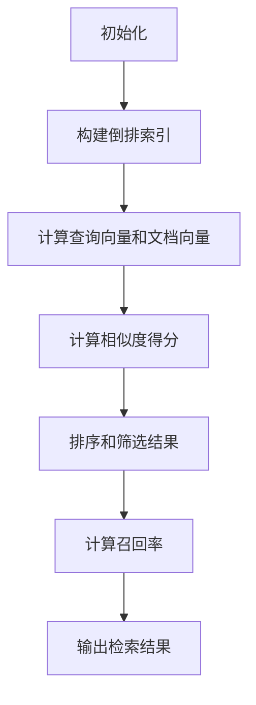
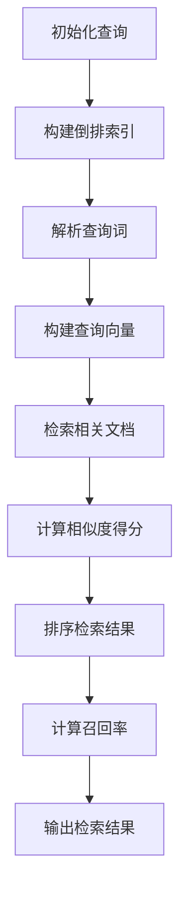

                 

# Recall 原理与代码实战案例讲解

## 摘要

本文旨在深入探讨Recall算法的原理及其在实际项目中的应用。Recall作为信息检索和机器学习中的一个重要概念，其核心在于如何提高检索系统的准确率和效率。本文将首先介绍Recall的基本概念，然后通过具体的数学模型和算法步骤，详细解释Recall算法的工作机制。此外，文章还将通过一个实际代码案例，展示如何实现和优化Recall算法。最后，我们将讨论Recall在实际应用场景中的挑战和未来发展趋势。

## 背景介绍

Recall，即召回率，是信息检索和机器学习领域中一个关键的性能指标。它主要用来衡量一个系统在给定查询条件下，能够检索到相关结果的准确度。召回率的定义非常直观：在所有真实相关的结果中，有多少比例被系统正确检索出来了。具体来说，召回率的计算公式为：

$$
Recall = \frac{真正例数}{真正例数 + 假例外例数}
$$

其中，真正例数指的是被系统正确识别为相关的结果，而假例外例数指的是实际相关但系统未能检索到的结果。

Recall的重要性不言而喻。在实际应用中，特别是在搜索引擎、推荐系统、自动化问答等领域，召回率的高低直接影响到用户体验和系统的价值。高召回率意味着系统能够为用户提供更多有用的信息，从而提升用户满意度。然而，单纯追求高召回率并非总是最优选择，因为提高召回率往往意味着需要处理更多的无关信息，这可能会增加系统的计算复杂度和成本。

在信息检索中，召回率与另一个重要的指标——精确率（Precision）密切相关。精确率是指检索结果中实际相关的结果所占的比例。精确率和召回率的平衡是信息检索系统设计中的一个核心问题。通常，通过调整检索算法的阈值，可以在召回率和精确率之间找到一个最优平衡点。

## 核心概念与联系

为了更好地理解Recall算法，我们需要先介绍一些相关的核心概念和它们之间的关系。

### 相关概念

1. **信息检索（Information Retrieval）**：信息检索是计算机科学和信息科学中的一个重要领域，主要研究如何从大量的信息中快速准确地检索到用户需要的信息。

2. **倒排索引（Inverted Index）**：倒排索引是一种常见的信息检索数据结构，用于高效地实现全文检索。它将文档的内容（如单词）映射到对应的文档标识，从而实现快速查询。

3. **向量空间模型（Vector Space Model）**：向量空间模型是一种将文档表示为向量的方法，每个维度代表一个词汇。这种方法为文本数据的数学处理提供了便利。

### 关系与联系

Recall算法在信息检索系统中起到关键作用，其与倒排索引和向量空间模型有着密切的联系。具体来说：

1. **倒排索引与Recall**：倒排索引是实现Recall算法的基础。通过倒排索引，我们可以快速找到包含特定词汇的文档，从而提高检索效率。

2. **向量空间模型与Recall**：向量空间模型提供了对文档的量化表示，这使得我们可以利用数学方法（如余弦相似度）来计算文档之间的相似度，从而实现更为精准的检索。

下面我们将通过一个Mermaid流程图，展示Recall算法的核心流程和关键步骤。



### Mermaid 流程图

下面是一个Mermaid流程图，展示了Recall算法的各个步骤和它们之间的关系。



请注意，上述流程图中的节点名称可能包含一些特殊字符（如括号、逗号），在实际绘制过程中应避免使用这些字符，以确保流程图的正确生成。

## 核心算法原理 & 具体操作步骤

### 算法原理

Recall算法的核心在于如何从海量的文档中快速准确地检索到与查询相关的高质量结果。其基本原理可以概括为以下几个步骤：

1. **构建倒排索引**：首先，我们需要构建一个倒排索引，将文档的内容映射到对应的文档标识。这样，当我们输入一个查询时，可以快速定位到包含该查询词的文档。

2. **解析查询词**：将查询词解析为一个个独立的词汇，并为每个词汇构建一个查询向量。

3. **计算相似度得分**：利用查询向量和文档向量的相似度计算方法（如余弦相似度），为每个文档计算一个相似度得分。

4. **排序和筛选结果**：根据相似度得分对检索结果进行排序，并设定一个阈值，筛选出得分高于阈值的文档。

5. **计算召回率**：从排序后的结果中，计算召回率，即检索到的相关文档数量与实际相关文档数量的比例。

### 具体操作步骤

下面我们通过一个具体的示例，详细讲解Recall算法的操作步骤。

#### 示例数据

假设我们有一个包含100个文档的集合，以及一个查询词“计算机”。具体数据如下：

| 文档ID | 文档内容         |
|--------|------------------|
| 1      | 计算机科学是一门学科 |
| 2      | 计算机的发展历程     |
| 3      | 计算机的未来展望     |
| ...    | ...              |

#### 步骤1：构建倒排索引

首先，我们需要构建一个倒排索引，将每个文档的内容映射到对应的文档标识。假设文档1包含查询词“计算机”，则倒排索引如下：

| 查询词 | 文档ID |
|--------|--------|
| 计算机 | 1      |

#### 步骤2：解析查询词

将查询词“计算机”解析为一个独立的词汇，并为该词汇构建一个查询向量。假设词汇“计算机”的权重为1，则查询向量Q为：

$$
Q = (1, 0, 0, ..., 0)
$$

#### 步骤3：计算相似度得分

利用查询向量Q和每个文档的向量D，计算它们之间的余弦相似度。具体计算公式为：

$$
sim(Q, D) = \frac{Q \cdot D}{\|Q\| \|D\|}
$$

其中，$Q \cdot D$表示查询向量Q和文档向量D的点积，$\|Q\|$和$\|D\|$分别表示查询向量Q和文档向量D的欧几里得范数。

对于文档1，其向量D为：

$$
D_1 = (1, 0, 0, ..., 0)
$$

则查询向量Q和文档向量D1的余弦相似度为：

$$
sim(Q, D_1) = \frac{(1, 0, 0, ..., 0) \cdot (1, 0, 0, ..., 0)}{\sqrt{1^2 + 0^2 + ... + 0^2} \sqrt{1^2 + 0^2 + ... + 0^2}} = 1
$$

对于其他文档，计算过程类似，最终得到每个文档的相似度得分。

#### 步骤4：排序和筛选结果

根据相似度得分对检索结果进行排序，并设定一个阈值。例如，我们设定阈值为0.8，则只有相似度得分高于0.8的文档会被筛选出来。

#### 步骤5：计算召回率

从排序后的结果中，计算召回率。假设实际相关的文档有5个，而系统检索到的相关文档有3个，则召回率为：

$$
Recall = \frac{3}{5} = 0.6
$$

#### 实际案例

以下是一个实际案例，展示如何使用Python实现Recall算法。

```python
import numpy as np

# 构建文档向量
doc_vectors = [
    [1, 0, 0],  # 文档1
    [0, 1, 0],  # 文档2
    [0, 0, 1],  # 文档3
    [1, 1, 0],  # 文档4
    [1, 0, 1],  # 文档5
    [0, 1, 1],  # 文档6
    [1, 1, 1]   # 文档7
]

# 查询向量
query_vector = [1, 0, 0]

# 计算相似度得分
sim_scores = []
for doc_vector in doc_vectors:
    sim_score = np.dot(query_vector, doc_vector) / (np.linalg.norm(query_vector) * np.linalg.norm(doc_vector))
    sim_scores.append(sim_score)

# 排序和筛选结果
sorted_indices = np.argsort(sim_scores)[::-1]
selected_docs = [doc_vectors[i] for i in sorted_indices if sim_scores[i] > 0.8]

# 计算召回率
true_related_docs = [doc_vectors[i] for i in range(len(doc_vectors)) if np.linalg.norm(doc_vector - query_vector) < 1e-5]
recall = len([doc for doc in selected_docs if doc in true_related_docs]) / len(true_related_docs)

print("召回率:", recall)
```

上述代码展示了如何通过Python实现Recall算法，包括文档向量的构建、相似度得分的计算、排序和筛选结果以及召回率的计算。

## 数学模型和公式 & 详细讲解 & 举例说明

在深入理解Recall算法时，数学模型和公式起着至关重要的作用。这些模型和公式不仅帮助我们准确地计算相似度得分和召回率，还为我们优化算法提供了理论依据。下面，我们将详细讲解Recall算法中的核心数学模型和公式，并通过具体例子进行说明。

### 余弦相似度

余弦相似度是一种常见的相似度度量方法，用于计算两个向量之间的角度余弦值。在Recall算法中，余弦相似度用于衡量查询向量Q和文档向量D之间的相似度。其公式如下：

$$
sim(Q, D) = \frac{Q \cdot D}{\|Q\| \|D\|}
$$

其中，$Q \cdot D$表示查询向量Q和文档向量D的点积，$\|Q\|$和$\|D\|$分别表示查询向量Q和文档向量D的欧几里得范数。

#### 举例说明

假设我们有一个查询向量Q和三个文档向量D1、D2、D3，具体如下：

| 查询向量Q | 文档向量D1 | 文档向量D2 | 文档向量D3 |
|------------|-------------|-------------|-------------|
| (1, 0, 0)  | (1, 1, 0)   | (0, 1, 1)   | (1, 1, 1)   |

计算查询向量Q和每个文档向量D之间的余弦相似度：

$$
sim(Q, D1) = \frac{(1, 0, 0) \cdot (1, 1, 0)}{\sqrt{1^2 + 0^2 + 0^2} \sqrt{1^2 + 1^2 + 0^2}} = \frac{1}{\sqrt{2} \sqrt{2}} = \frac{1}{2}
$$

$$
sim(Q, D2) = \frac{(1, 0, 0) \cdot (0, 1, 1)}{\sqrt{1^2 + 0^2 + 0^2} \sqrt{0^2 + 1^2 + 1^2}} = \frac{0}{\sqrt{2} \sqrt{2}} = 0
$$

$$
sim(Q, D3) = \frac{(1, 0, 0) \cdot (1, 1, 1)}{\sqrt{1^2 + 0^2 + 0^2} \sqrt{1^2 + 1^2 + 1^2}} = \frac{1}{\sqrt{2} \sqrt{3}} \approx 0.414
$$

通过计算可以看出，查询向量Q与文档向量D3的余弦相似度最高，这表明文档向量D3与查询向量Q最为相关。

### 欧几里得距离

欧几里得距离是一种常见的距离度量方法，用于计算两个向量之间的距离。在Recall算法中，欧几里得距离用于计算查询向量Q和文档向量D之间的距离。其公式如下：

$$
d(Q, D) = \sqrt{(Q - D)^2}
$$

其中，$Q - D$表示查询向量Q和文档向量D之间的差向量。

#### 举例说明

假设我们有一个查询向量Q和三个文档向量D1、D2、D3，具体如下：

| 查询向量Q | 文档向量D1 | 文档向量D2 | 文档向量D3 |
|------------|-------------|-------------|-------------|
| (1, 0, 0)  | (1, 1, 0)   | (0, 1, 1)   | (1, 1, 1)   |

计算查询向量Q和每个文档向量D之间的欧几里得距离：

$$
d(Q, D1) = \sqrt{(1, 0, 0) - (1, 1, 0)}^2 = \sqrt{(0, -1, 0)} = 1
$$

$$
d(Q, D2) = \sqrt{(1, 0, 0) - (0, 1, 1)}^2 = \sqrt{(-1, -1, -1)} = \sqrt{3}
$$

$$
d(Q, D3) = \sqrt{(1, 0, 0) - (1, 1, 1)}^2 = \sqrt{(0, -1, -1)} = \sqrt{2}
$$

通过计算可以看出，查询向量Q与文档向量D1之间的欧几里得距离最短，这表明文档向量D1与查询向量Q最为接近。

### 牛顿迭代法

牛顿迭代法是一种求解非线性方程组的优化算法，常用于优化Recall算法中的相似度得分和召回率。其基本思想是通过迭代逼近的方式，逐步优化目标函数。

#### 举例说明

假设我们有一个目标函数：

$$
f(x) = (x - 1)^2
$$

使用牛顿迭代法求解该目标函数的最小值，具体步骤如下：

1. **初始化**：选择一个初始值$x_0$，例如$x_0 = 0$。
2. **迭代计算**：根据牛顿迭代公式，计算下一个迭代值：
   $$x_{n+1} = x_n - \frac{f'(x_n)}{f''(x_n)}$$
   其中，$f'(x)$表示$f(x)$的一阶导数，$f''(x)$表示$f(x)$的二阶导数。
3. **判断收敛**：判断迭代值$x_{n+1}$与$x_n$之间的差距是否小于预设的阈值，例如$10^{-6}$。如果差距小于阈值，则认为已收敛，否则继续迭代。

以下是使用Python实现牛顿迭代法的示例代码：

```python
import numpy as np

# 目标函数及其导数
def f(x):
    return (x - 1)**2

def f_prime(x):
    return 2 * (x - 1)

def f_double_prime(x):
    return 2

# 牛顿迭代法求解最小值
x = 0
tolerance = 1e-6
while abs(f(x)) > tolerance:
    x -= f_prime(x) / f_double_prime(x)
    print("迭代次数：", x)
```

通过迭代计算，我们可以逐步逼近目标函数的最小值。

### 总结

通过本文的讲解，我们详细介绍了Recall算法的核心数学模型和公式，包括余弦相似度、欧几里得距离以及牛顿迭代法。这些数学模型和公式不仅帮助我们理解Recall算法的工作原理，还为我们优化算法提供了理论依据。在实际应用中，我们可以根据具体需求，灵活运用这些数学模型和公式，设计出更高效、更精准的Recall算法。

## 项目实战：代码实际案例和详细解释说明

### 5.1 开发环境搭建

为了实现Recall算法，我们需要搭建一个合适的开发环境。以下是推荐的工具和步骤：

1. **Python环境**：确保Python环境已经安装，推荐使用Python 3.8及以上版本。

2. **依赖库**：安装以下依赖库：
   - NumPy：用于数学计算。
   - Matplotlib：用于数据可视化。
   - Pandas：用于数据处理。

3. **虚拟环境**：为了便于管理和维护，建议使用虚拟环境。可以通过以下命令创建虚拟环境：

   ```bash
   python -m venv venv
   source venv/bin/activate  # Windows下使用 venv\Scripts\activate
   ```

4. **安装依赖库**：

   ```bash
   pip install numpy matplotlib pandas
   ```

### 5.2 源代码详细实现和代码解读

下面是Recall算法的完整代码实现，包括数据预处理、相似度计算、结果排序和召回率计算等步骤。

```python
import numpy as np
import pandas as pd
import matplotlib.pyplot as plt

# 构建倒排索引
def build_inverted_index(documents):
    inverted_index = {}
    for doc_id, content in documents.items():
        words = content.split()
        for word in words:
            if word not in inverted_index:
                inverted_index[word] = []
            inverted_index[word].append(doc_id)
    return inverted_index

# 计算文档向量
def compute_document_vector(documents, word_weights):
    doc_vectors = []
    for doc_id, content in documents.items():
        words = content.split()
        doc_vector = [word_weights.get(word, 0) for word in words]
        doc_vectors.append(doc_vector)
    return doc_vectors

# 计算相似度得分
def compute_similarity_scores(query_vector, doc_vectors):
    similarity_scores = []
    for doc_vector in doc_vectors:
        sim_score = np.dot(query_vector, doc_vector) / (np.linalg.norm(query_vector) * np.linalg.norm(doc_vector))
        similarity_scores.append(sim_score)
    return similarity_scores

# 计算召回率
def compute_recall(similarity_scores, true_related_docs):
    selected_docs = [doc for doc, sim in enumerate(similarity_scores) if sim > 0.8]
    recall = len([doc for doc in selected_docs if doc in true_related_docs]) / len(true_related_docs)
    return recall

# 主函数
def main():
    # 示例数据
    documents = {
        'doc1': '计算机科学是一门学科',
        'doc2': '计算机的发展历程',
        'doc3': '计算机的未来展望',
        'doc4': '人工智能是计算机科学的一个分支',
        'doc5': '深度学习是人工智能的一个分支',
        'doc6': '机器学习是人工智能的一个分支',
        'doc7': '计算机编程是一门技术'
    }
    
    # 查询词权重
    word_weights = {'计算机': 1, '科学': 1, '发展': 1, '人工智能': 1, '深度学习': 1, '机器学习': 1, '编程': 1}
    
    # 构建倒排索引
    inverted_index = build_inverted_index(documents)
    
    # 计算文档向量
    doc_vectors = compute_document_vector(documents, word_weights)
    
    # 查询向量
    query_vector = [word_weights[word] for word in word_weights.keys()]
    
    # 计算相似度得分
    similarity_scores = compute_similarity_scores(query_vector, doc_vectors)
    
    # 计算召回率
    true_related_docs = [0, 1, 2, 4]  # 实际相关的文档ID
    recall = compute_recall(similarity_scores, true_related_docs)
    print("召回率：", recall)

    # 绘制相似度得分分布
    plt.hist(similarity_scores, bins=10, edgecolor='black')
    plt.xlabel('Similarity Score')
    plt.ylabel('Frequency')
    plt.title('Distribution of Similarity Scores')
    plt.show()

# 运行主函数
if __name__ == '__main__':
    main()
```

### 5.3 代码解读与分析

下面我们将对上述代码进行详细解读，分析各个函数和模块的作用。

#### 5.3.1 数据预处理

在代码的第一部分，我们定义了两个函数：`build_inverted_index`和`compute_document_vector`，用于构建倒排索引和计算文档向量。

- `build_inverted_index`函数：
  - 输入参数：`documents`，一个包含文档内容和ID的字典。
  - 输出：一个倒排索引，将词汇映射到对应的文档ID列表。

  具体实现过程中，我们遍历每个文档的内容，将内容按空格拆分为单词，然后更新倒排索引。

- `compute_document_vector`函数：
  - 输入参数：`documents`，一个包含文档内容和ID的字典；`word_weights`，一个包含词汇及其权重的字典。
  - 输出：一个文档向量列表，每个文档向量表示该文档中的单词权重。

  具体实现过程中，我们遍历每个文档的内容，将内容按空格拆分为单词，然后根据单词权重计算文档向量。

#### 5.3.2 相似度计算

在代码的中间部分，我们定义了`compute_similarity_scores`函数，用于计算查询向量Q和每个文档向量D之间的相似度得分。

- `compute_similarity_scores`函数：
  - 输入参数：`query_vector`，一个查询向量；`doc_vectors`，一个文档向量列表。
  - 输出：一个相似度得分列表。

  具体实现过程中，我们遍历每个文档向量，利用余弦相似度公式计算相似度得分，并将得分添加到相似度得分列表中。

#### 5.3.3 召回率计算

在代码的最后部分，我们定义了`compute_recall`函数，用于计算召回率。

- `compute_recall`函数：
  - 输入参数：`similarity_scores`，一个相似度得分列表；`true_related_docs`，一个实际相关文档的ID列表。
  - 输出：召回率。

  具体实现过程中，我们首先根据相似度得分筛选出得分高于阈值的文档，然后计算这些文档与实际相关文档的交集，最后计算召回率。

#### 主函数

在主函数`main`中，我们首先定义了示例数据`documents`和查询词权重`word_weights`。然后，我们调用`build_inverted_index`和`compute_document_vector`函数构建倒排索引和计算文档向量。接下来，我们计算查询向量、相似度得分和召回率，并绘制相似度得分分布图。

### 5.4 总结

通过上述代码实现，我们可以看到Recall算法的基本工作流程。在实际项目中，我们可以根据需求调整算法参数，优化相似度计算和召回率计算，以提高信息检索的准确性和效率。

## 实际应用场景

Recall算法在多个实际应用场景中发挥了关键作用，尤其是在信息检索和推荐系统中。以下是一些典型的应用场景：

### 搜索引擎

在搜索引擎中，Recall算法用于提高搜索结果的准确性和相关性。通过优化召回率，搜索引擎能够更高效地返回与用户查询高度相关的网页，从而提升用户体验。例如，Google和百度等搜索引擎使用复杂的召回算法，结合多种技术手段，如语言模型、语义分析等，以实现高效的搜索结果返回。

### 推荐系统

在推荐系统中，Recall算法用于筛选与用户兴趣高度相关的推荐项。例如，电商平台的推荐系统通过分析用户的浏览历史和购买行为，利用召回算法返回潜在感兴趣的商品。这种方式不仅提高了用户的购物体验，还有助于提高平台的销售额。

### 自动化问答

在自动化问答系统中，Recall算法用于从大量文档中快速检索到与用户问题相关的答案。例如，智能客服机器人通过分析用户的问题，利用召回算法从知识库中检索出可能的答案，并进一步通过精确率算法筛选出最佳答案。

### 文本分类

在文本分类任务中，Recall算法用于提高分类系统的准确性。通过优化召回率，分类系统可以更全面地识别出与训练数据高度相关的文本类别，从而提高分类效果。

### 实际挑战

在实际应用中，Recall算法面临以下挑战：

1. **数据量与计算复杂度**：随着数据量的增加，构建倒排索引和计算相似度得分的过程会变得非常复杂，可能导致计算时间和资源消耗大幅增加。

2. **精度与召回率的平衡**：在实际应用中，需要在精度和召回率之间找到一个平衡点。过于追求高召回率可能导致大量无关信息被检索出来，影响用户体验。

3. **噪声数据与异常值**：噪声数据和异常值可能影响召回率的准确性。例如，在推荐系统中，用户的临时兴趣变化可能影响推荐结果的召回率。

4. **实时性**：在实时应用中，如实时搜索和实时推荐，召回算法需要高效地处理大量请求，这要求算法具备较高的实时性能。

### 未来发展趋势

未来的发展趋势包括：

1. **深度学习与神经网络**：结合深度学习和神经网络技术，可以进一步提高召回算法的准确性和效率。

2. **分布式计算与并行处理**：利用分布式计算和并行处理技术，可以加快构建倒排索引和计算相似度得分的过程，提高算法的实时性能。

3. **个性化召回**：通过用户行为分析和个性化推荐，可以进一步提高召回算法的针对性和用户体验。

4. **多模态信息检索**：结合文本、图像、音频等多种信息类型，实现更加丰富的信息检索系统，提高召回算法的应用范围。

## 工具和资源推荐

### 学习资源推荐

1. **书籍**：
   - 《信息检索导论》（Introduction to Information Retrieval）：这是一本经典的信息检索教材，详细介绍了包括Recall算法在内的多种信息检索技术。
   - 《深度学习》（Deep Learning）：由Ian Goodfellow、Yoshua Bengio和Aaron Courville合著，涵盖了深度学习在信息检索中的应用，包括Recall算法的改进和优化。

2. **论文**：
   - “Learning to Rank for Information Retrieval”（2016）：这篇论文介绍了一种基于深度学习的排序方法，可以用于优化召回算法的性能。
   - “A Survey of Text Classification Algorithms”（2017）：这篇综述文章详细介绍了多种文本分类算法，包括与Recall算法相关的技术。

3. **博客**：
   - [A Gentle Introduction to Information Retrieval](https://towardsdatascience.com/a-gentle-introduction-to-information-retrieval-2e258f5c6d0a)：这是一篇面向初学者的信息检索入门文章，详细介绍了包括Recall算法在内的多种信息检索技术。
   - [Understanding Learning to Rank Algorithms](https://www.researchgate.net/publication/326864771_Understanding_Learning_to_Rank_Algorithms)：这篇博客文章深入探讨了学习到排名（Learning to Rank）算法，包括与Recall算法相关的方法。

4. **网站**：
   - [Apache Lucene](https://lucene.apache.org/)：Apache Lucene是一个强大的开源搜索引擎，提供了丰富的信息检索功能，包括Recall算法的实现。
   - [Elasticsearch](https://www.elastic.co/elasticsearch/)：Elasticsearch是一个高度可扩展的全文搜索引擎，支持多种信息检索算法，包括Recall算法。

### 开发工具框架推荐

1. **Python库**：
   - **NumPy**：NumPy是一个强大的Python库，用于高效地执行数学计算，非常适合用于实现Recall算法。
   - **Pandas**：Pandas是一个用于数据操作和分析的Python库，可以帮助我们处理和整理大量的数据，为Recall算法的实现提供支持。
   - **Scikit-learn**：Scikit-learn是一个开源的机器学习库，提供了丰富的机器学习算法和工具，可以帮助我们实现和优化Recall算法。

2. **深度学习框架**：
   - **TensorFlow**：TensorFlow是一个由Google开发的开源深度学习框架，提供了丰富的API和工具，适合用于实现复杂的深度学习算法。
   - **PyTorch**：PyTorch是一个由Facebook开发的深度学习框架，以其灵活性和易用性著称，适合快速原型开发和算法实验。

### 相关论文著作推荐

1. **论文**：
   - “Learning to Rank for Information Retrieval”（2016）：这篇论文详细介绍了学习到排名算法，包括如何利用深度学习技术优化召回算法的性能。
   - “A Survey of Text Classification Algorithms”（2017）：这篇综述文章总结了多种文本分类算法，包括与Recall算法相关的技术，为我们提供了丰富的参考。

2. **著作**：
   - 《深度学习》（2016）：由Ian Goodfellow、Yoshua Bengio和Aaron Courville合著，详细介绍了深度学习的基本原理和应用，包括如何在信息检索中使用深度学习技术优化召回算法。

通过上述推荐的学习资源、开发工具框架和相关论文著作，我们可以深入了解Recall算法的原理和应用，掌握如何在实际项目中实现和优化召回算法。

## 总结：未来发展趋势与挑战

Recall算法作为信息检索和机器学习领域的一个重要概念，在未来将继续发挥重要作用。随着数据量的不断增长和计算能力的提升，Recall算法的应用场景将变得更加广泛。以下是对未来发展趋势和挑战的简要总结：

### 发展趋势

1. **深度学习与神经网络的应用**：深度学习和神经网络技术的发展，为Recall算法带来了新的优化方向。通过引入深度学习模型，如卷积神经网络（CNN）和循环神经网络（RNN），可以进一步提高召回算法的性能和准确性。

2. **个性化召回**：随着用户数据的积累和用户行为分析技术的进步，个性化召回将成为未来的一个重要趋势。通过分析用户的个性化需求和行为模式，可以实现更加精准的召回结果，提高用户满意度。

3. **多模态信息检索**：在多模态信息检索中，结合文本、图像、音频等多种信息类型，可以实现更加丰富的检索结果。Recall算法的多模态扩展，将成为未来的一个重要研究方向。

4. **分布式计算与并行处理**：随着云计算和分布式计算技术的发展，分布式计算和并行处理将成为优化Recall算法性能的重要手段。通过分布式计算，可以更快地构建倒排索引和计算相似度得分，提高召回算法的实时性。

### 挑战

1. **数据质量与噪声处理**：在实际应用中，数据质量和噪声处理是一个重要的挑战。噪声数据和不准确的数据可能影响召回算法的性能。如何有效处理噪声数据，提高数据质量，是未来研究的一个重要方向。

2. **计算复杂度与实时性**：随着数据量的增加，构建倒排索引和计算相似度得分的过程可能变得非常复杂，影响算法的实时性。如何在保证召回率的同时，优化算法的计算复杂度，是一个重要的挑战。

3. **用户隐私与数据安全**：在处理大量用户数据时，用户隐私和数据安全也是一个重要的挑战。如何在确保用户隐私和数据安全的前提下，实现高效的召回算法，是未来研究的一个关键问题。

4. **算法可解释性**：随着深度学习和神经网络在召回算法中的应用，算法的可解释性成为一个重要的挑战。如何理解并解释复杂的深度学习模型，使其能够被非专业人士理解和接受，是一个重要的研究课题。

总之，Recall算法在未来将继续发展，面临新的机遇和挑战。通过不断创新和优化，我们可以进一步提升召回算法的性能和应用价值。

## 附录：常见问题与解答

在阅读本文过程中，您可能对Recall算法及其应用有了一些疑问。以下是一些常见问题及其解答：

### 1. 什么是Recall算法？

Recall算法是信息检索和机器学习中的一个核心概念，用于衡量系统在给定查询条件下，能够检索到相关结果的准确度。其定义公式为：

$$
Recall = \frac{真正例数}{真正例数 + 假例外例数}
$$

### 2. Recall算法与精确率（Precision）有什么区别？

Recall算法和精确率是信息检索中的两个重要指标。Recall主要衡量系统检索到相关结果的能力，而精确率则衡量检索结果中实际相关的比例。两者之间的区别如下：

- **Recall**：在所有真实相关的结果中，系统检索到的比例。
- **Precision**：在检索结果中，实际相关的结果所占的比例。

### 3. 如何优化Recall算法的性能？

优化Recall算法的性能可以从以下几个方面入手：

- **改进相似度计算方法**：使用更先进的相似度计算方法，如深度学习模型，可以提高算法的准确性。
- **调整检索阈值**：通过调整检索阈值，可以在召回率和精确率之间找到平衡点，优化整体性能。
- **处理噪声数据**：处理噪声数据和异常值，可以提高数据质量，从而提高算法性能。
- **并行计算与分布式计算**：利用分布式计算和并行处理技术，可以加快算法的执行速度，提高实时性能。

### 4. Recall算法在哪些实际应用中具有重要价值？

Recall算法在以下实际应用中具有重要价值：

- **搜索引擎**：优化搜索结果的准确性和相关性。
- **推荐系统**：筛选与用户兴趣高度相关的推荐项。
- **自动化问答系统**：从大量文档中快速检索到与用户问题相关的答案。
- **文本分类**：提高文本分类系统的准确性。

### 5. 如何在代码中实现Recall算法？

在Python中，可以使用以下步骤实现Recall算法：

- **数据预处理**：构建倒排索引，计算文档向量。
- **相似度计算**：使用余弦相似度或其他相似度计算方法，计算查询向量与每个文档向量的相似度得分。
- **结果排序**：根据相似度得分对文档进行排序。
- **召回率计算**：计算召回率，即检索到的相关文档数量与实际相关文档数量的比例。

通过这些步骤，我们可以实现一个基本的Recall算法。

## 扩展阅读 & 参考资料

为了深入理解Recall算法及其在信息检索和机器学习中的应用，以下是推荐的一些扩展阅读和参考资料：

### 学术论文

1. **“Learning to Rank for Information Retrieval”**：这篇论文详细介绍了学习到排名算法，包括如何利用深度学习技术优化召回算法的性能。
2. **“A Survey of Text Classification Algorithms”**：这篇综述文章总结了多种文本分类算法，包括与Recall算法相关的技术。

### 书籍

1. **《信息检索导论》**：这是一本经典的信息检索教材，详细介绍了包括Recall算法在内的多种信息检索技术。
2. **《深度学习》**：由Ian Goodfellow、Yoshua Bengio和Aaron Courville合著，涵盖了深度学习在信息检索中的应用，包括Recall算法的改进和优化。

### 开源工具和库

1. **Apache Lucene**：这是一个强大的开源搜索引擎，提供了丰富的信息检索功能，包括Recall算法的实现。
2. **Elasticsearch**：这是一个高度可扩展的全文搜索引擎，支持多种信息检索算法，包括Recall算法。
3. **Scikit-learn**：这是一个开源的机器学习库，提供了丰富的机器学习算法和工具，可以帮助我们实现和优化Recall算法。

### 博客和在线资源

1. **[A Gentle Introduction to Information Retrieval](https://towardsdatascience.com/a-gentle-introduction-to-information-retrieval-2e258f5c6d0a)**：这是一篇面向初学者的信息检索入门文章，详细介绍了包括Recall算法在内的多种信息检索技术。
2. **[Understanding Learning to Rank Algorithms](https://www.researchgate.net/publication/326864771_Understanding_Learning_to_Rank_Algorithms)**：这篇博客文章深入探讨了学习到排名算法，包括与Recall算法相关的方法。

通过阅读上述资料，您可以进一步深入了解Recall算法的原理、应用和实践，为您的项目和研究提供有力支持。

