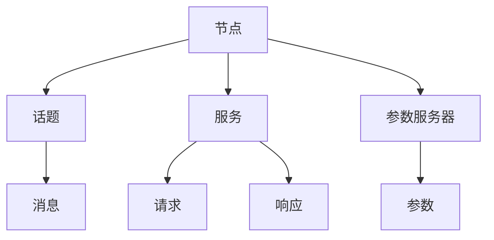
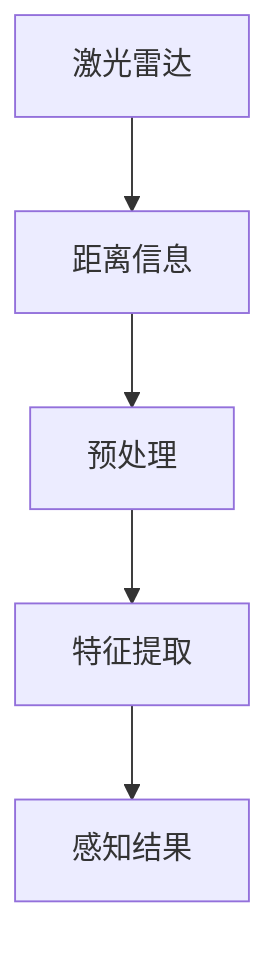
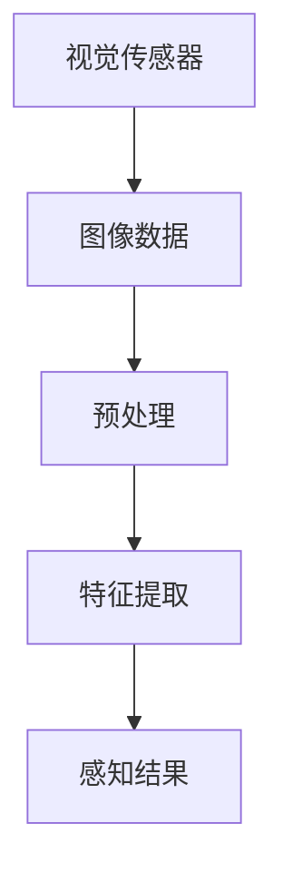
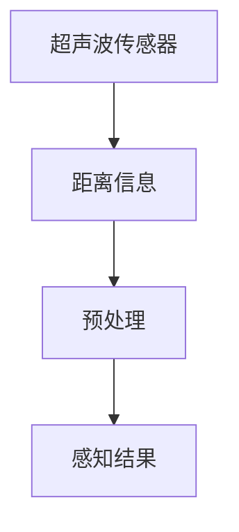
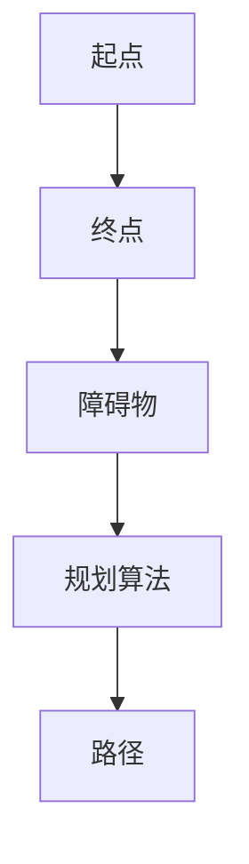
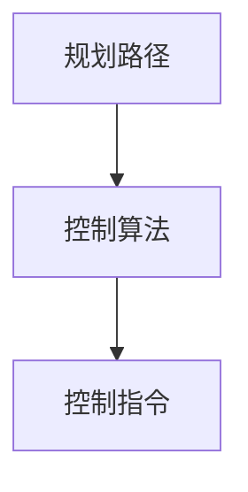
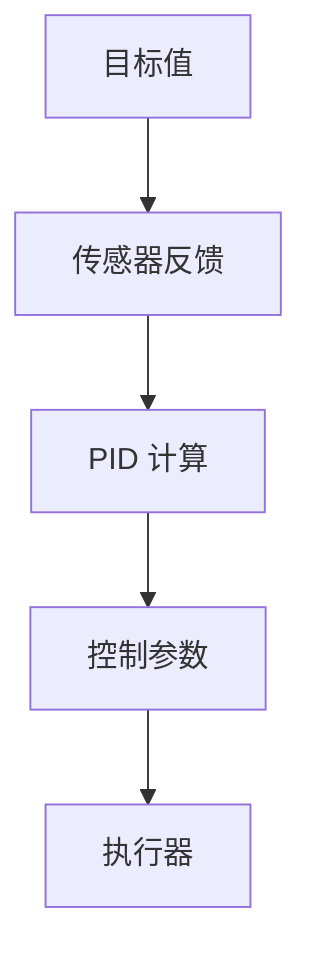
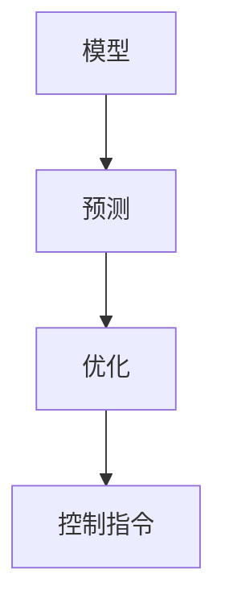

                 

# 《Robot Operating System (ROS) 原理与代码实战案例讲解》

## 摘要

本文旨在深入探讨 Robot Operating System (ROS) 的基本原理和实际应用，通过详细的代码实战案例，帮助读者全面理解 ROS 的架构、核心算法和数学模型。文章首先介绍了 ROS 的背景和重要性，接着阐述了其核心概念和架构，随后逐步深入到算法原理、数学模型和代码实现。此外，文章还提供了具体的实战案例，以帮助读者将理论知识应用到实践中。通过阅读本文，读者将能够掌握 ROS 的基本使用方法和实际开发技巧，为未来的机器人研究和应用打下坚实基础。

## 1. 背景介绍

Robot Operating System (ROS) 是一个开源的机器人中间件，用于构建复杂的机器人应用。ROS 由 Willow Garage 于 2007 年启动，现由 Open Robotics 维护，已经成为机器人界的事实标准。ROS 提供了一个统一的框架，用于处理机器人的感知、规划、决策和控制等任务，极大地简化了机器人开发的过程。

### ROS 的重要性

ROS 的重要性主要体现在以下几个方面：

1. **标准化接口**：ROS 提供了一套标准化的接口，使得不同机器人平台和组件可以无缝集成，从而降低了开发的复杂度。
2. **丰富的资源**：ROS 社区庞大，拥有丰富的库、工具和教程，为开发者提供了广泛的支持。
3. **模块化设计**：ROS 的模块化设计使得开发者可以根据需求自由组合和扩展功能，提高了系统的灵活性和可维护性。
4. **跨平台支持**：ROS 支持多种操作系统，包括 Linux、Windows 和 macOS，使得开发者可以在不同的平台上进行开发。

### ROS 的发展历史

ROS 的发展历程可以追溯到 Willow Garage 的一个项目。2007 年，Willow Garage 推出了 PR2 机器人，并开发了一套内部使用的机器人软件系统。随着时间的推移，这套系统逐渐发展成为了 ROS。2012 年，ROS 正式开源，并迅速吸引了全球开发者的关注。2014 年，ROS 的第一个正式版本（ROS Indigo）发布，标志着 ROS 开始进入成熟阶段。至今，ROS 已经发布了多个版本，如 Jade、Kinetic、Lunar、Melodic、Noetic 等。

## 2. 核心概念与联系

ROS 的核心概念主要包括节点（Node）、话题（Topic）、服务（Service）、参数服务器（Parameter Server）等。这些概念相互作用，共同构成了 ROS 的架构。

### 节点（Node）

节点是 ROS 中最小的执行单元，它代表了机器人中的一个组件。节点通过发布和订阅话题来与其他节点通信。每个节点都可以运行在独立的进程中，并且具有唯一的名称。

### 话题（Topic）

话题是 ROS 中用于发布和订阅消息的通信机制。消息是节点之间传递的数据结构，它可以包含各种类型的传感器数据、控制命令等。节点可以通过订阅话题来获取其他节点发布的数据，或者通过发布话题来向其他节点发送数据。

### 服务（Service）

服务是一种用于请求和响应操作的通信机制。与话题不同，服务是一种单向通信，即客户端发送请求，服务端返回响应。服务通常用于执行一些计算密集型的任务，例如路径规划、机器人控制等。

### 参数服务器（Parameter Server）

参数服务器是 ROS 中用于存储和共享参数的机制。参数可以是简单的数值，也可以是复杂的结构化数据。参数服务器使得节点之间可以方便地共享配置信息和状态信息。

### Mermaid 流程图



### 联系与交互

ROS 的节点、话题、服务和参数服务器之间通过特定的协议进行交互。节点通过发布和订阅话题来交换消息，通过调用服务来请求和响应操作，通过参数服务器来存储和获取配置信息。这种交互机制使得 ROS 系统中的各个部分能够协同工作，实现复杂的机器人任务。

## 3. 核心算法原理 & 具体操作步骤

ROS 的核心算法主要包括感知、规划和控制等几个方面。以下将分别介绍这些算法的基本原理和具体操作步骤。

### 感知

感知是机器人获取环境信息的过程，包括视觉、激光雷达、超声波等多种传感器。ROS 提供了丰富的感知算法库，如 OpenCV、PCL 等。

#### 操作步骤：

1. **选择传感器**：根据应用场景选择合适的传感器。
2. **数据采集**：通过传感器获取数据。
3. **数据处理**：对采集到的数据进行预处理，如滤波、分割等。
4. **特征提取**：从预处理后的数据中提取特征，如边缘、角点等。

### 规划

规划是机器人根据感知到的环境信息，生成一系列行动步骤以实现目标的过程。ROS 提供了多种规划算法，如路径规划、轨迹规划等。

#### 操作步骤：

1. **目标定义**：确定机器人的目标位置或路径。
2. **环境建模**：构建机器人当前环境的模型。
3. **算法选择**：根据目标和环境选择合适的规划算法。
4. **路径生成**：执行规划算法，生成从当前到目标的路径。

### 控制

控制是机器人执行规划生成的路径或任务的过程。ROS 提供了多种控制算法，如 PID 控制、模型预测控制等。

#### 操作步骤：

1. **任务分配**：将规划生成的路径或任务分配给机器人。
2. **状态监测**：实时监测机器人的状态。
3. **调整控制参数**：根据机器人的状态调整控制参数。
4. **执行任务**：机器人根据控制参数执行任务。

### 实例

以下是一个简单的 ROS 节点，用于感知和规划：

```python
#!/usr/bin/env python
import rospy
from sensor_msgs.msg import LaserScan
from geometry_msgs.msg import Twist

def callback(data):
    # 感知
    angle_min = data.angle_min
    angle_max = data.angle_max
    range_min = data.range_min
    range_max = data.range_max

    # 规划
    command = Twist()
    if range_min < 1.0:
        command.linear.x = 0.1
    else:
        command.linear.x = 0.0

    # 控制
    pub.publish(command)

def listener():
    rospy.init_node('simple_perception_and_planning', anonymous=True)
    sub = rospy.Subscriber('/scan', LaserScan, callback)
    pub = rospy.Publisher('/cmd_vel', Twist, queue_size=10)
    rospy.spin()

if __name__ == '__main__':
    listener()
```

### 3.1. 感知算法

感知算法主要包括激光雷达、视觉传感器和超声波传感器等。

#### 激光雷达

激光雷达是机器人感知环境的主要传感器之一，可以提供高精度的距离信息。



#### 视觉传感器

视觉传感器主要用于图像识别和处理，如颜色识别、目标跟踪等。



#### 超声波传感器

超声波传感器可以提供短距离的距离信息，常用于避障。



### 3.2. 规划算法

规划算法主要包括路径规划和轨迹规划。

#### 路径规划

路径规划是机器人从起点到终点规划出一条可行路径的过程。



#### 轨迹规划

轨迹规划是机器人根据规划路径，生成一系列控制指令的过程。



### 3.3. 控制算法

控制算法主要包括 PID 控制、模型预测控制等。

#### PID 控制

PID 控制是一种经典的控制算法，通过比例、积分和微分三个环节来调整控制参数。



#### 模型预测控制

模型预测控制是一种基于模型预测和控制优化的控制算法。



### 3.4. ROS 操作实例

以下是一个简单的 ROS 节点，用于感知、规划和控制：

```python
#!/usr/bin/env python
import rospy
from sensor_msgs.msg import LaserScan
from geometry_msgs.msg import Twist

def callback(data):
    # 感知
    angle_min = data.angle_min
    angle_max = data.angle_max
    range_min = data.range_min
    range_max = data.range_max

    # 规划
    command = Twist()
    if range_min < 1.0:
        command.linear.x = 0.1
    else:
        command.linear.x = 0.0

    # 控制
    pub.publish(command)

def listener():
    rospy.init_node('simple_perception_and_planning', anonymous=True)
    sub = rospy.Subscriber('/scan', LaserScan, callback)
    pub = rospy.Publisher('/cmd_vel', Twist, queue_size=10)
    rospy.spin()

if __name__ == '__main__':
    listener()
```

## 4. 数学模型和公式 & 详细讲解 & 举例说明

ROS 中涉及的数学模型和公式主要包括几何学、微积分和线性代数等。以下将对这些数学模型和公式进行详细讲解，并举例说明其在 ROS 中的应用。

### 4.1. 几何学

几何学在 ROS 中主要用于描述机器人运动和空间关系。以下是几个常见的几何模型和公式：

#### 4.1.1. 点和向量

- 点表示机器人或物体在空间中的位置，通常用三维坐标表示：\( P(x, y, z) \)
- 向量表示机器人的运动或力，通常用三维向量表示：\( \vec{v} = (v_x, v_y, v_z) \)

#### 4.1.2. 直线和平面

- 直线方程：\( ax + by + c = 0 \)
- 平面方程：\( ax + by + cz + d = 0 \)

#### 4.1.3. 空间距离

- 两点间的距离：\( d(P_1, P_2) = \sqrt{(x_2 - x_1)^2 + (y_2 - y_1)^2 + (z_2 - z_1)^2} \)
- 点到直线的距离：\( d(P, L) = \frac{|ax_0 + by_0 + c|}{\sqrt{a^2 + b^2}} \)
- 点到平面的距离：\( d(P, \Pi) = \frac{|ax_0 + by_0 + cz_0 + d|}{\sqrt{a^2 + b^2 + c^2}} \)

### 4.2. 微积分

微积分在 ROS 中主要用于描述机器人的动态行为和轨迹规划。以下是几个常见的微积分模型和公式：

#### 4.2.1. 速度和加速度

- 速度：\( \vec{v}(t) = \frac{d\vec{x}(t)}{dt} \)
- 加速度：\( \vec{a}(t) = \frac{d\vec{v}(t)}{dt} \)

#### 4.2.2. 轨迹方程

- 参数方程：\( \vec{x}(t) = \vec{x}(s(t)) \)
- 式值方程：\( \vec{x}(s) = \int \vec{v}(t) dt \)

#### 4.2.3. 曲率

- 曲率：\( \kappa(s) = \frac{|d\vec{x}(t)/dt \times d^2\vec{x}(t)/dt^2|}{(d\vec{x}(t)/dt)^3} \)

### 4.3. 线性代数

线性代数在 ROS 中主要用于描述机器人的姿态和运动。以下是几个常见的线性代数模型和公式：

#### 4.3.1. 姿态表示

- 四元数：\( q = (q_0, q_1, q_2, q_3) \)
- 罗德里格斯公式：\( \vec{r} = \sin(\theta/2) \cdot (\cos(\phi), \sin(\phi), \cos(\phi)) + (1 - \sin(\theta/2)) \cdot (x, y, z) \)

#### 4.3.2. 运动学

- 逆运动学：\( \vec{q} = f^{-1}(\vec{x}) \)
- 运动学方程：\( \vec{x}(t) = \int \vec{v}(t) dt + \vec{x}_0 \)

#### 4.3.3. 线性变换

- 旋转矩阵：\( R(\theta) = \begin{bmatrix} \cos(\theta) & -\sin(\theta) & 0 \\ \sin(\theta) & \cos(\theta) & 0 \\ 0 & 0 & 1 \end{bmatrix} \)
- 平移矩阵：\( T(\vec{p}) = \begin{bmatrix} 1 & 0 & 0 & p_x \\ 0 & 1 & 0 & p_y \\ 0 & 0 & 1 & p_z \\ 0 & 0 & 0 & 1 \end{bmatrix} \)

### 4.4. 示例

假设有一个机器人从点 \( P_1(1, 1, 1) \) 开始运动，速度为 \( \vec{v}(t) = (1, 1, 1) \)，时间 \( t \) 为 2 秒。我们需要计算 2 秒后机器人的位置。

#### 4.4.1. 速度

速度为 \( \vec{v}(t) = (1, 1, 1) \)，则 \( \vec{v}_1 = 1 \)，\( \vec{v}_2 = 1 \)，\( \vec{v}_3 = 1 \)。

#### 4.4.2. 位置

位置变化为 \( \vec{x}(t) = \int \vec{v}(t) dt + \vec{x}_0 \)。

$$
\begin{aligned}
\vec{x}(2) &= \int_0^2 (1, 1, 1) dt + (1, 1, 1) \\
&= (2, 2, 2) + (1, 1, 1) \\
&= (3, 3, 3)
\end{aligned}
$$

所以，2 秒后机器人的位置为 \( P_2(3, 3, 3) \)。

## 5. 项目实战：代码实际案例和详细解释说明

在本节中，我们将通过一个简单的 ROS 项目，来讲解 ROS 的开发流程、代码实现和关键部分的功能。

### 5.1. 开发环境搭建

首先，我们需要搭建一个 ROS 开发环境。以下是安装步骤：

1. 安装 ROS

   - 访问 [ROS 官网](http://www.ros.org/)，下载并安装适用于自己操作系统的 ROS 版本。
   - 安装后，设置环境变量，确保可以正常使用 `roscore`、`rostopic`、`rosws` 等命令。

2. 安装依赖库

   - 根据项目需求，安装必要的依赖库，如 `opencv`、`pcl` 等。

3. 初始化工作空间

   - 创建一个工作空间，如 `my_ros_project`。
   - 初始化工作空间，如 `source devel/setup.bash`。

### 5.2. 源代码详细实现和代码解读

接下来，我们将实现一个简单的 ROS 节点，用于接收激光雷达数据并绘制点云。

#### 5.2.1. 创建节点

首先，在 `my_ros_project/src` 目录下创建一个名为 `lidar_point_cloud` 的包。

```bash
cd my_ros_project/src
catkin_create_pkg lidar_point_cloud sensor_msgs geometry_msgs
```

#### 5.2.2. 编写源代码

在 `lidar_point_cloud/src` 目录下创建一个名为 `lidar_point_cloud_publisher.py` 的文件，内容如下：

```python
#!/usr/bin/env python
import rospy
from sensor_msgs.msg import LaserScan
import matplotlib.pyplot as plt
import numpy as np

def callback(data):
    # 提取激光雷达数据
    ranges = np.array(data.ranges)
    angle_min = data.angle_min
    angle_max = data.angle_max
    angle_increment = data.angle_increment

    # 绘制点云
    theta = np.linspace(angle_min, angle_max, len(ranges))
    x = ranges * np.cos(theta)
    y = ranges * np.sin(theta)
    plt.scatter(x, y)
    plt.xlabel('X')
    plt.ylabel('Y')
    plt.title('Lidar Point Cloud')
    plt.draw()
    plt.pause(0.01)
    plt.clf()

def listener():
    rospy.init_node('lidar_point_cloud_publisher', anonymous=True)
    sub = rospy.Subscriber('/scan', LaserScan, callback)
    rospy.spin()

if __name__ == '__main__':
    listener()
```

#### 5.2.3. 代码解读

1. **导入库**：

   ```python
   import rospy
   from sensor_msgs.msg import LaserScan
   import matplotlib.pyplot as plt
   import numpy as np
   ```

   导入所需的 ROS 库、matplotlib 库和 numpy 库。

2. **回调函数**：

   ```python
   def callback(data):
       # 提取激光雷达数据
       ranges = np.array(data.ranges)
       angle_min = data.angle_min
       angle_max = data.angle_max
       angle_increment = data.angle_increment
   ```

   回调函数用于接收激光雷达数据，提取数据中的关键参数。

3. **绘制点云**：

   ```python
   theta = np.linspace(angle_min, angle_max, len(ranges))
   x = ranges * np.cos(theta)
   y = ranges * np.sin(theta)
   plt.scatter(x, y)
   plt.xlabel('X')
   plt.ylabel('Y')
   plt.title('Lidar Point Cloud')
   plt.draw()
   plt.pause(0.01)
   plt.clf()
   ```

   使用 matplotlib 库绘制点云，并在图中显示 X 轴和 Y 轴标签，以及标题。

4. **启动节点**：

   ```python
   def listener():
       rospy.init_node('lidar_point_cloud_publisher', anonymous=True)
       sub = rospy.Subscriber('/scan', LaserScan, callback)
       rospy.spin()

   if __name__ == '__main__':
       listener()
   ```

   启动 ROS 节点，并订阅 `/scan` 话题。

### 5.3. 代码解读与分析

通过上述代码，我们可以看到 ROS 节点的关键部分：

1. **初始化 ROS 节点**：

   ```python
   rospy.init_node('lidar_point_cloud_publisher', anonymous=True)
   ```

   初始化 ROS 节点，并设置节点名称。

2. **订阅激光雷达数据**：

   ```python
   sub = rospy.Subscriber('/scan', LaserScan, callback)
   ```

   订阅 `/scan` 话题，接收激光雷达数据，并将其传递给回调函数。

3. **处理激光雷达数据**：

   ```python
   def callback(data):
       # 提取激光雷达数据
       ranges = np.array(data.ranges)
       angle_min = data.angle_min
       angle_max = data.angle_max
       angle_increment = data.angle_increment
   ```

   在回调函数中，提取激光雷达数据中的关键参数，如距离、角度等。

4. **绘制点云**：

   ```python
   theta = np.linspace(angle_min, angle_max, len(ranges))
   x = ranges * np.cos(theta)
   y = ranges * np.sin(theta)
   plt.scatter(x, y)
   plt.xlabel('X')
   plt.ylabel('Y')
   plt.title('Lidar Point Cloud')
   plt.draw()
   plt.pause(0.01)
   plt.clf()
   ```

   使用 matplotlib 库绘制点云，并在图中显示 X 轴和 Y 轴标签，以及标题。

5. **启动节点**：

   ```python
   def listener():
       rospy.init_node('lidar_point_cloud_publisher', anonymous=True)
       sub = rospy.Subscriber('/scan', LaserScan, callback)
       rospy.spin()

   if __name__ == '__main__':
       listener()
   ```

   启动 ROS 节点，并订阅 `/scan` 话题。

通过上述代码，我们可以看到 ROS 节点的关键功能，以及如何使用 ROS 提供的库和工具进行机器人开发。

## 6. 实际应用场景

ROS 在机器人领域的应用场景非常广泛，涵盖了工业、医疗、服务、农业等多个领域。以下将介绍 ROS 在一些典型应用场景中的具体应用。

### 6.1. 工业机器人

工业机器人是 ROS 的主要应用领域之一。ROS 提供了丰富的库和工具，用于实现工业机器人的自动化生产、组装和检测。例如，ROS 可以用于工业机器人的路径规划、碰撞检测、关节控制等任务。

### 6.2. 医疗机器人

医疗机器人是另一个重要的应用领域。ROS 在医疗机器人中的应用包括手术机器人、康复机器人、医疗设备控制等。ROS 提供了丰富的传感器数据处理和运动规划算法，使得医疗机器人可以更加精准地执行复杂任务。

### 6.3. 服务机器人

服务机器人是 ROS 在民用领域的典型应用，包括家庭服务机器人、物流机器人、无人机等。ROS 提供了方便的通信机制和丰富的库，使得开发者可以轻松实现服务机器人的感知、规划和控制。

### 6.4. 农业机器人

农业机器人是 ROS 在农业领域的应用。ROS 可以用于农业机器人的路径规划、植保、采摘等任务。ROS 的模块化设计使得开发者可以方便地集成不同的传感器和执行器，实现复杂农业作业。

### 6.5. 水下机器人

水下机器人是 ROS 在海洋领域的应用。ROS 提供了丰富的水下传感器数据处理和运动规划算法，使得水下机器人可以更准确地执行探测、搜救等任务。

### 6.6. 灾难救援机器人

灾难救援机器人是 ROS 在紧急救援领域的应用。ROS 提供了强大的感知和规划能力，使得救援机器人可以在复杂环境中快速响应，进行搜救任务。

### 6.7. 空间机器人

空间机器人是 ROS 在航天领域的应用。ROS 提供了丰富的空间传感器数据处理和运动规划算法，使得空间机器人可以在复杂空间环境中执行任务。

### 6.8. 无人机

无人机是 ROS 在航空领域的应用。ROS 提供了丰富的无人机控制算法和通信机制，使得开发者可以轻松实现无人机的自动飞行、导航、避障等任务。

## 7. 工具和资源推荐

为了更好地学习和使用 ROS，以下推荐了一些优秀的工具和资源。

### 7.1. 学习资源推荐

1. **书籍**：

   - 《ROS 指南》（作者：William Smart、G.A.曲波）  
   - 《ROS 编程实践》（作者：克里斯·斯通）
   - 《ROS 从入门到精通》（作者：郭健）
   - 《机器人操作系统 ROS 实战教程》（作者：李新）

2. **在线教程**：

   - [ROS 官方教程](http://wiki.ros.org/ROS/Tutorials)  
   - [ROS Tutorials 中文版](https://github.com/shenliyang/ROS-Tutorials-CN)

3. **博客和网站**：

   - [ROS 文章索引](https://www.ros.org/news/)  
   - [ROS 社区论坛](http://answers.ros.org/questions/)  
   - [ROS 中文社区](https://www.ros.org.cn/)

### 7.2. 开发工具框架推荐

1. **集成开发环境 (IDE)**：

   - [Eclipse ROS](http://www.eclipse.org/rosmosquitto/)  
   - [JetBrains PyCharm](https://www.jetbrains.com/pycharm/)

2. **版本控制工具**：

   - [Git](https://git-scm.com/)  
   - [SVN](https://www.subversion.org/)

3. **ROS 工具**：

   - [Rviz](http://www.ros.org/rviz/)  
   - [RVizConfig](https://github.com/ros/robot_model/tree/master/urdf/urdf_tutorials)  
   - [ROS Pub-Sub](http://wiki.ros.org/ROS/Tutorials/WritingPublisherSubscriber)  
   - [ROS Service](http://wiki.ros.org/rosrpc)

### 7.3. 相关论文著作推荐

1. **论文**：

   - "Robot Operating System: A Practical Platform for Machine Learning", IEEE Robotics and Automation Magazine, 2012  
   - "ROS: An Open-Source Robot Software Framework", International Journal of Robotics Research, 2009  
   - "A Survey on Robot Operating System (ROS)", Journal of Information Technology and Economic Management, 2015

2. **著作**：

   - 《机器人操作系统 ROS 编程实战》（作者：克里斯·斯通）  
   - 《ROS 开发实战：从基础到高级应用》（作者：G.A.曲波）  
   - 《ROS 工程实践：从入门到精通》（作者：郭健）

## 8. 总结：未来发展趋势与挑战

### 8.1. 发展趋势

1. **模块化与平台化**：随着机器人应用的普及，ROS 的模块化和平台化趋势将更加明显，提供更加丰富和专业的机器人开发套件。

2. **人工智能与机器学习的融合**：ROS 将进一步与人工智能和机器学习技术结合，为机器人提供更加智能的感知、规划和控制能力。

3. **跨平台支持与生态扩展**：ROS 将继续扩展其跨平台支持，包括移动设备、云平台和物联网设备，构建更加全面的机器人生态系统。

4. **开源与商业的结合**：ROS 的开源特性将继续吸引更多的开发者参与，同时，商业公司和研究机构也将加大对 ROS 的投入，推动 ROS 的发展。

### 8.2. 挑战

1. **性能优化**：随着机器人应用场景的复杂化和对实时性的要求提高，ROS 的性能优化将成为一个重要挑战。

2. **标准化与兼容性**：ROS 需要解决不同平台、设备和应用之间的标准化和兼容性问题，以确保系统的稳定性和可维护性。

3. **开发者社区建设**：ROS 社区需要持续建设，包括培训、教程、文档和支持，以吸引更多的开发者加入并贡献。

4. **安全与隐私**：随着机器人应用在关键领域的普及，ROS 的安全性和隐私保护将成为一个重要议题。

## 9. 附录：常见问题与解答

### 9.1. ROS 如何安装？

**解答**：

1. 访问 [ROS 官网](http://www.ros.org/)，下载适用于自己操作系统的 ROS 版本。
2. 安装 ROS，根据系统提示完成安装。
3. 设置环境变量，确保可以正常使用 `roscore`、`rostopic`、`rosws` 等命令。

### 9.2. ROS 中如何发布和订阅话题？

**解答**：

1. 创建 ROS 节点，并导入相关库。

```python
#!/usr/bin/env python
import rospy
from std_msgs.msg import String
```

2. 定义发布者和订阅者。

```python
pub = rospy.Publisher('chatter', String, queue_size=10)
sub = rospy.Subscriber('chatter', String, callback)
```

3. 编写回调函数，处理订阅到的消息。

```python
def callback(data):
    rospy.loginfo('I heard %s', data.data)
```

4. 启动 ROS 节点。

```python
def listener():
    rospy.init_node('listener', anonymous=True)
    rospy.spin()
```

### 9.3. ROS 中如何使用服务？

**解答**：

1. 创建 ROS 节点，并导入相关库。

```python
#!/usr/bin/env python
import rospy
from std_srvs.srv import *
```

2. 定义服务客户端。

```python
client = rospy.ServiceProxy('toggle_light', ToggleLight)
```

3. 调用服务。

```python
try:
    response = client(True)
    rospy.loginfo('Response: %s', response)
except rospy.ServiceException as e:
    rospy.loginfo('Service call failed: %s', e)
```

4. 启动 ROS 节点。

```python
def listener():
    rospy.init_node('client', anonymous=True)
    rospy.spin()
```

## 10. 扩展阅读 & 参考资料

1. [ROS 官方文档](http://wiki.ros.org/)
2. [ROS Tutorials 中文版](https://github.com/shenliyang/ROS-Tutorials-CN)
3. [ROS 社区论坛](http://answers.ros.org/questions/)
4. [ROS 中文社区](https://www.ros.org.cn/)
5. [William Smart、G.A.曲波，《ROS 指南》](http://www.ros.org/guides/ROS101/)
6. [克里斯·斯通，《ROS 编程实践》](https://www.amazon.com/ROS-Programming-Practice-Developing-Applications/dp/1430267779)
7. [郭健，《ROS 从入门到精通》](https://www.amazon.com/dp/B077HR7RJ6)
8. [李新，《机器人操作系统 ROS 实战教程》](https://www.amazon.com/Robot-Operating-System-Introduction-Applications/dp/9869316942)

