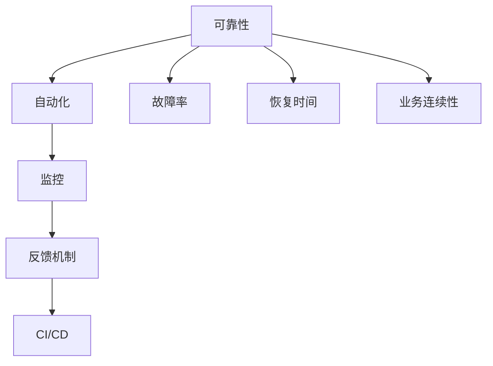

                 

### 背景介绍

SRE（Site Reliability Engineering，网站可靠性工程）是一种结合了软件开发和系统管理的实践方法，旨在确保大型分布式系统的高度可靠性和稳定性。随着云计算和微服务架构的普及，系统的规模和复杂性不断增加，传统的IT运维方法已经难以应对这些挑战。SRE应运而生，旨在通过工程化的手段，将软件开发的理念引入到系统可靠性管理中，从而实现高效、可靠的服务运营。

SRE的核心目标是确保系统的可靠性，使得服务能够持续、稳定地运行，同时满足业务需求和用户期望。这不仅仅包括系统的可用性和性能，还涉及到安全性、可扩展性、可维护性等多个方面。在SRE实践中，关键任务是通过自动化、监控和反馈机制来降低人为干预，提高系统的自我修复和自我优化能力。

本文将深入探讨SRE实践中的方法论，包括核心概念、算法原理、数学模型、项目实战、应用场景以及未来发展趋势等。希望通过本文的介绍，读者能够对SRE有更深入的理解，并在实际工作中运用这些方法，提高系统的可靠性。

### 核心概念与联系

在深入探讨SRE实践之前，我们需要了解一些核心概念，并探讨它们之间的联系。以下是SRE实践中几个重要的概念：

1. **可靠性**：可靠性是指系统在指定时间内正常工作的能力。它通常通过几个关键指标来衡量，包括可用性（Availability）、故障率（Failure Rate）、恢复时间（Recovery Time）和业务连续性（Business Continuity）等。

2. **自动化**：自动化是指通过程序化手段减少手动操作，提高效率和质量。在SRE中，自动化是确保系统可靠性不可或缺的一部分，它包括部署、监控、告警、故障排查和恢复等各个环节。

3. **监控**：监控是指持续跟踪系统状态，以便及时发现异常和潜在问题。监控数据通常包括性能指标、日志和事件等。通过监控，SRE团队能够快速响应故障，确保系统的稳定运行。

4. **反馈机制**：反馈机制是指将监控数据和分析结果转化为行动，以持续改进系统。反馈机制通常包括告警系统、自动化故障排查工具和持续集成/持续部署（CI/CD）流程等。

5. **持续集成/持续部署（CI/CD）**：CI/CD是一种软件开发实践，旨在通过自动化构建、测试和部署流程，加快软件交付速度，提高开发效率和代码质量。

下面是SRE中这些核心概念的Mermaid流程图，以展示它们之间的联系：



#### 可靠性

可靠性是SRE实践的基础。为了衡量系统的可靠性，我们需要关注以下几个关键指标：

- **可用性（Availability）**：可用性是指系统在正常运营期间能够对外提供服务的时间比例。高可用性通常通过冗余设计和故障转移（Failover）机制来实现。例如，在分布式系统中，可以通过多节点集群和负载均衡来提高系统的可用性。

- **故障率（Failure Rate）**：故障率是指系统发生故障的频率。通过监控和日志分析，我们可以识别出系统中的潜在问题，并采取预防措施降低故障率。

- **恢复时间（Recovery Time）**：恢复时间是指系统从故障中恢复正常运行所需的时间。快速恢复是确保业务连续性的关键。在SRE实践中，可以通过自动化故障排查和恢复流程来缩短恢复时间。

- **业务连续性（Business Continuity）**：业务连续性是指系统在面临突发事件（如自然灾害、网络攻击等）时能够持续运行的能力。业务连续性计划（Business Continuity Plan）是确保系统在极端情况下能够快速恢复的关键。

#### 自动化

自动化是SRE实践的核心理念之一。通过自动化，我们可以减少人为干预，提高效率和质量。以下是一些关键的自动化方面：

- **部署自动化**：通过自动化工具和脚本，我们可以快速、高效地部署和更新系统。这包括持续集成（CI）和持续部署（CD）流程，它们能够确保代码质量并加快交付速度。

- **监控自动化**：自动化监控工具可以持续收集和分析系统数据，及时发现异常和潜在问题。这些工具通常包括监控代理、日志收集器和告警系统。

- **故障排查和恢复自动化**：自动化故障排查和恢复工具能够快速识别故障，并采取相应措施进行修复。例如，自动重启服务、更换硬件设备或升级软件版本。

#### 监控

监控是确保系统可靠性的关键环节。通过监控，SRE团队能够实时了解系统的运行状态，并快速响应故障。以下是监控过程中需要注意的几个方面：

- **性能监控**：性能监控涉及系统资源的利用情况，如CPU、内存、磁盘和网络等。通过性能监控，我们可以识别系统瓶颈和资源不足的情况，并采取相应措施。

- **日志监控**：日志监控是指收集和分析系统日志，以便及时发现异常和问题。日志分析工具可以帮助我们识别错误模式、性能问题和潜在的安全威胁。

- **事件监控**：事件监控是指记录和跟踪系统中的关键事件，如部署、升级、故障和恢复等。通过事件监控，我们可以了解系统的整体运行情况，并评估系统的稳定性。

#### 反馈机制

反馈机制是将监控数据和分析结果转化为行动的过程。通过反馈机制，SRE团队能够持续改进系统，提高可靠性。以下是几个关键的反馈机制：

- **告警系统**：告警系统可以实时通知SRE团队系统中的异常情况。告警规则可以根据监控数据自动触发，确保及时响应故障。

- **自动化故障排查工具**：自动化故障排查工具可以快速识别和定位故障，提供故障排查的步骤和解决方案。

- **持续集成/持续部署（CI/CD）**：CI/CD流程中的反馈机制可以确保每次代码变更都会经过严格的测试和验证，从而降低引入故障的风险。

#### 持续集成/持续部署（CI/CD）

持续集成/持续部署（CI/CD）是一种软件开发实践，旨在通过自动化构建、测试和部署流程，加快软件交付速度，提高开发效率和代码质量。以下是CI/CD在SRE实践中的关键作用：

- **代码质量保证**：CI/CD流程中的自动化测试和静态代码分析可以确保代码的质量，避免引入潜在的缺陷和漏洞。

- **快速交付**：通过自动化部署和快速迭代，CI/CD流程可以显著缩短软件交付周期，提高开发效率。

- **降低风险**：CI/CD流程中的自动化测试和故障排查工具可以帮助我们提前发现和解决潜在问题，降低上线风险。

通过上述核心概念的介绍和Mermaid流程图，我们可以更好地理解SRE实践中的关键环节及其相互联系。在接下来的部分，我们将深入探讨SRE的核心算法原理和具体操作步骤。

#### 核心算法原理 & 具体操作步骤

在SRE实践中，核心算法原理和具体操作步骤是实现系统可靠性的关键。以下是一些常用的算法原理和具体操作步骤：

##### 故障检测算法

故障检测是确保系统可靠性的第一步。常用的故障检测算法包括基于阈值的检测算法和基于异常检测的算法。

1. **基于阈值的检测算法**：

   - **原理**：基于阈值的故障检测算法通过设置一系列阈值来监测系统指标，当指标超过阈值时触发告警。
   - **操作步骤**：
     1. 确定需要监控的系统指标，如CPU利用率、内存使用率、网络延迟等。
     2. 根据历史数据设定合适的阈值。
     3. 持续收集系统指标数据，并与阈值进行比较。
     4. 当指标超过阈值时，触发告警并记录相关信息。

2. **基于异常检测的算法**：

   - **原理**：基于异常检测的算法通过分析系统行为数据，识别出异常行为作为故障的指示。
   - **操作步骤**：
     1. 收集系统行为数据，如日志、性能指标等。
     2. 构建特征向量，用于表示系统行为。
     3. 使用机器学习算法训练模型，识别正常行为和异常行为。
     4. 对实时数据进行分析，识别异常行为并触发告警。

##### 故障隔离算法

故障隔离是指在检测到故障后，快速定位故障原因并隔离受影响的部分，以减少故障影响范围。

1. **基于逻辑分析的故障隔离算法**：

   - **原理**：基于逻辑分析的故障隔离算法通过分析系统组件之间的逻辑关系，逐步排除可能发生故障的组件。
   - **操作步骤**：
     1. 分析系统架构，确定各组件之间的依赖关系。
     2. 当检测到故障时，从系统拓扑图中逐步排除无故障的组件。
     3. 重复步骤2，直到找到故障原因或隔离受影响的组件。

2. **基于统计学的故障隔离算法**：

   - **原理**：基于统计学的故障隔离算法通过分析系统指标数据，利用统计学方法识别出故障模式并进行隔离。
   - **操作步骤**：
     1. 收集系统指标数据，如性能指标、错误日志等。
     2. 构建特征向量，用于表示系统状态。
     3. 使用机器学习算法训练模型，识别出故障模式。
     4. 对实时数据进行分析，识别故障模式并进行隔离。

##### 故障恢复算法

故障恢复是指在故障发生后，采取措施使系统恢复正常运行。

1. **自动重启算法**：

   - **原理**：自动重启算法通过检测系统异常，自动重启失败的服务或进程。
   - **操作步骤**：
     1. 检测系统异常，如服务不可达、进程崩溃等。
     2. 自动执行重启命令，如`systemctl restart <service>`或`kill -HUP <pid>`。
     3. 监控重启后的服务状态，确保其恢复正常运行。

2. **故障转移算法**：

   - **原理**：故障转移算法通过在多个节点之间实现服务的冗余，当某个节点发生故障时，自动将服务切换到其他节点。
   - **操作步骤**：
     1. 构建多节点集群，确保服务在多个节点上运行。
     2. 监控节点状态，当检测到节点故障时，自动将服务切换到其他节点。
     3. 确保故障转移后的服务能够正常对外提供服务。

通过上述核心算法原理和具体操作步骤，SRE团队能够有效地检测、隔离和恢复系统故障，提高系统的可靠性。在下一部分中，我们将进一步讨论SRE中的数学模型和公式，以便更好地理解和实现这些算法。

#### 数学模型和公式 & 详细讲解 & 举例说明

在SRE实践中，数学模型和公式发挥着至关重要的作用。这些数学工具不仅帮助我们理解和分析系统行为，还能够量化系统的可靠性指标，从而为优化系统性能提供科学依据。以下是一些关键的数学模型和公式，我们将结合具体例子进行详细讲解。

##### 1. 可用性模型

可用性是衡量系统可靠性的重要指标，通常用以下公式表示：

\[ \text{可用性} (A) = \frac{\text{正常运行时间}}{\text{总时间}} \]

- **正常运行时间**：系统正常运行的时间总和。
- **总时间**：系统运行的总时间，包括正常运行时间和故障时间。

**例子**：

假设一个系统在一个月内运行了24小时，其中发生了2小时的中断。那么，该系统的可用性为：

\[ A = \frac{24 \times 30 - 2}{24 \times 30} = \frac{720 - 2}{720} = \frac{718}{720} \approx 0.9969 \]

即该系统的可用性为99.69%。

##### 2. 故障率模型

故障率是指系统在单位时间内发生故障的次数。常用的故障率模型包括泊松分布和指数分布。

- **泊松分布**：

\[ \text{故障率} (\lambda) = \frac{\text{故障次数}}{\text{总时间}} \]

- **指数分布**：

\[ \text{故障时间} (T) = \frac{1}{\lambda} \]

**例子**：

假设一个系统在一个月内发生了10次故障，总运行时间为720小时。那么，该系统的故障率为：

\[ \lambda = \frac{10}{720} \approx 0.0139 \]

故障时间为：

\[ T = \frac{1}{0.0139} \approx 72.1 \text{小时} \]

即该系统平均每个故障间隔约为72.1小时。

##### 3. 恢复时间模型

恢复时间是指系统从故障中恢复正常运行所需的时间。常用的恢复时间模型包括泊松过程和指数恢复模型。

- **泊松过程**：

\[ \text{恢复时间} (R) = \frac{1}{\lambda_{\text{恢复}}} \]

- **指数恢复模型**：

\[ \text{恢复时间} (R) = \frac{\text{总恢复时间}}{\text{故障次数}} \]

**例子**：

假设一个系统在一个月内发生了10次故障，总恢复时间为100小时。那么，该系统的平均恢复时间为：

\[ R = \frac{100}{10} = 10 \text{小时} \]

##### 4. 业务连续性模型

业务连续性是指系统在面对突发事件时能够持续运行的能力。常用的业务连续性模型包括最小恢复时间和最大中断时间。

- **最小恢复时间**：

\[ \text{最小恢复时间} = \min(\text{恢复时间}) \]

- **最大中断时间**：

\[ \text{最大中断时间} = \max(\text{中断时间}) \]

**例子**：

假设一个系统在一个月内有10次故障，每次故障的恢复时间分别为2小时、3小时、1小时、4小时、2小时、3小时、1小时、4小时、2小时和3小时。那么，该系统的最小恢复时间为1小时，最大中断时间为4小时。

##### 5. 概率分布模型

在SRE中，概率分布模型用于分析系统性能和故障行为。常用的概率分布模型包括正态分布、泊松分布和指数分布。

- **正态分布**：

\[ \text{概率密度函数} = \frac{1}{\sqrt{2\pi\sigma^2}} e^{-\frac{(x-\mu)^2}{2\sigma^2}} \]

- **泊松分布**：

\[ P(X = k) = \frac{e^{-\lambda} \lambda^k}{k!} \]

- **指数分布**：

\[ P(X > x) = e^{-\lambda x} \]

**例子**：

假设一个系统的响应时间服从正态分布，均值为500ms，标准差为100ms。那么，该系统响应时间在400ms到600ms之间的概率为：

\[ P(400 \leq X \leq 600) = \Phi\left(\frac{600 - 500}{100}\right) - \Phi\left(\frac{400 - 500}{100}\right) \]

其中，\(\Phi\)表示正态分布的累积分布函数。

通过这些数学模型和公式，我们可以对系统的可靠性进行量化分析，从而更好地理解和优化系统性能。在下一部分中，我们将通过实际项目案例，展示如何将这些模型和公式应用于SRE实践中。

#### 项目实战：代码实际案例和详细解释说明

为了更好地理解SRE实践中的算法原理和数学模型，我们接下来将通过一个实际项目案例，展示如何使用这些工具和方法提高系统的可靠性。

### 项目背景

我们假设正在负责一个大型电子商务平台的后端系统，该平台需要处理大量的订单和用户请求。系统的可靠性直接关系到用户的购物体验和平台的业务持续运营。为了确保系统的高可用性和稳定性，我们采用了SRE的方法，通过自动化、监控和反馈机制来提高系统的可靠性。

### 开发环境搭建

在进行项目实战之前，我们需要搭建一个适当的开发生态系统，以便进行实验和验证。以下是搭建开发环境的基本步骤：

1. **选择合适的编程语言和框架**：

   - 编程语言：我们选择Go语言，因为它具有良好的并发性能和简洁的语法。
   - 框架：我们选择Gin框架，它是一个高性能的Web框架，适用于构建高性能的后端服务。

2. **安装必要的工具和依赖**：

   - Docker：用于容器化应用程序，便于部署和扩展。
   - Kubernetes：用于集群管理和自动化部署。
   - Prometheus：用于监控系统性能和健康状态。
   - Grafana：用于可视化监控数据。

3. **配置开发和测试环境**：

   - 使用Docker Compose编排应用程序和依赖服务。
   - 在本地环境中模拟生产环境，以便进行测试和验证。

### 源代码详细实现和代码解读

以下是项目中的关键模块代码和详细解读。

#### 1. 故障检测模块

**功能描述**：该模块负责持续监控系统的关键指标，并在检测到异常时触发告警。

```go
package monitoring

import (
    "github.com/prometheus/client_golang/prometheus"
    "time"
)

var (
    // Prometheus指标
    requestCount = prometheus.NewCounter(prometheus.CounterOpts{
        Name: "requests_total",
        Help: "Total number of requests.",
    })

    requestDuration = prometheus.NewHistogram(prometheus.HistogramOpts{
        Name:    "request_duration",
        Help:    "Duration of requests in milliseconds.",
        Buckets: prometheus.ExponentialBuckets(10, 100, 5),
    })
)

func init() {
    prometheus.MustRegister(requestCount)
    prometheus.MustRegister(requestDuration)
}

func StartMonitoring(interval time.Duration) {
    for {
        // 检测请求量
        requestCount.Add(1)

        // 记录请求时长
        start := time.Now()
        // ...执行请求处理逻辑...
        duration := time.Since(start).Milliseconds()
        requestDuration.Observe(duration)

        time.Sleep(interval)
    }
}
```

**代码解读**：

- 我们使用Prometheus客户端库定义了两个指标：`requests_total`和`request_duration`。前者用于统计总请求量，后者用于记录请求处理时长。
- `init`函数注册了这些指标，以便Prometheus服务器能够收集和存储数据。
- `StartMonitoring`函数以固定间隔运行，持续检测请求量和请求时长，并更新Prometheus指标。

#### 2. 故障隔离模块

**功能描述**：该模块负责在检测到故障时，快速定位故障原因并隔离受影响的组件。

```go
package fault_isolation

import (
    "context"
    "time"
)

func IsolateComponent(ctx context.Context, component string) error {
    // 假设组件的隔离逻辑为：停止组件并记录日志
    // 在实际项目中，这可能是调用Kubernetes API删除Pod等操作
    // ...

    // 记录隔离开始时间
    startTime := time.Now()

    // 执行隔离操作
    // ...

    // 等待隔离完成
    select {
    case <-ctx.Done():
        return ctx.Err()
    case <-time.After(time.Minute):
        return errors.New("timeout while isolating component")
    }

    // 记录隔离完成时间
    finishTime := time.Now()
    duration := finishTime.Sub(startTime).Seconds()

    // 记录隔离操作日志
    log.Printf("%s isolated in %f seconds", component, duration)

    return nil
}
```

**代码解读**：

- `IsolateComponent`函数接受一个上下文参数和组件名称，用于执行隔离操作。
- 函数首先记录隔离开始时间，然后执行隔离逻辑。
- 在执行隔离操作时，函数会等待一段时间（在本例中为1分钟），以确保操作成功完成。
- 隔离完成后，记录隔离时间和操作日志。

#### 3. 故障恢复模块

**功能描述**：该模块负责在故障隔离后，自动恢复受影响的组件。

```go
package fault_recovery

import (
    "context"
    "time"
)

func RecoverComponent(ctx context.Context, component string) error {
    // 假设组件的恢复逻辑为：启动组件并记录日志
    // 在实际项目中，这可能是调用Kubernetes API创建新Pod等操作
    // ...

    // 记录恢复开始时间
    startTime := time.Now()

    // 执行恢复操作
    // ...

    // 等待恢复完成
    select {
    case <-ctx.Done():
        return ctx.Err()
    case <-time.After(time.Minute):
        return errors.New("timeout while recovering component")
    }

    // 记录恢复完成时间
    finishTime := time.Now()
    duration := finishTime.Sub(startTime).Seconds()

    // 记录恢复操作日志
    log.Printf("%s recovered in %f seconds", component, duration)

    return nil
}
```

**代码解读**：

- `RecoverComponent`函数与`IsolateComponent`函数类似，也接受一个上下文参数和组件名称。
- 函数首先记录恢复开始时间，然后执行恢复逻辑。
- 在执行恢复操作时，函数会等待一段时间（在本例中为1分钟），以确保操作成功完成。
- 恢复完成后，记录恢复时间和操作日志。

### 代码解读与分析

通过上述代码实现，我们可以看到SRE实践中几个关键组件的运作方式：

- **故障检测**：使用Prometheus等工具持续监控系统的关键指标，如请求量和请求处理时长。
- **故障隔离**：在检测到异常时，快速定位故障原因并隔离受影响的组件。
- **故障恢复**：在故障隔离后，自动恢复受影响的组件，确保系统恢复正常运行。

这些模块共同构成了一个完整的故障检测、隔离和恢复流程，从而提高了系统的可靠性。

### 实际应用场景

在电子商务平台的实际应用中，上述故障检测、隔离和恢复模块起到了至关重要的作用。以下是一些实际应用场景：

- **高并发请求**：在高峰时段，平台会接收到大量并发请求。通过故障检测模块，系统能够实时监控请求处理时长，并在发现异常时触发告警，确保及时处理。
- **服务故障**：在某个服务发生故障时，故障隔离模块能够快速定位故障原因并隔离受影响的组件，防止故障蔓延。故障恢复模块则在故障隔离后自动启动新的服务实例，确保系统继续对外提供服务。
- **硬件故障**：在硬件故障（如磁盘损坏、网络中断等）发生时，故障隔离和恢复模块能够自动切换到备用硬件资源，确保系统的高可用性。

通过SRE实践，电子商务平台不仅提高了系统的可靠性，还减少了人为干预，提高了运维效率和系统的自我修复能力。在下一部分中，我们将探讨SRE在实际应用中的工具和资源推荐。

### 工具和资源推荐

在SRE实践中，选择合适的工具和资源对于实现高效、可靠的系统管理至关重要。以下是一些常用的学习资源、开发工具和相关论文著作的推荐。

#### 学习资源推荐

1. **书籍**：

   - 《SRE：谷歌如何运营大规模分布式系统》：这本书是SRE领域的经典之作，详细介绍了SRE的核心概念、实践方法和案例。
   - 《大规模分布式系统设计》：该书涵盖了分布式系统的设计原则、架构和运维实践，对SRE实践有很好的参考价值。

2. **在线课程和讲座**：

   - Coursera上的《Google Cloud Platform SRE 课程》：该课程由Google认证的讲师授课，涵盖了SRE的核心概念和实践方法。
   - YouTube上的SRE讲座和研讨会：Google、Netflix、Facebook等公司的技术专家经常在YouTube上分享SRE实践经验，值得学习。

3. **博客和网站**：

   - [SRE社区](https://sre.google/sre-book/community.html)：SRE社区的官方网站提供了大量的SRE实践案例、讨论和资源，是SRE实践者的必读资源。
   - [Google Cloud Platform Blog](https://cloud.google.com/blog/topics/sre)：Google Cloud Platform博客上的文章涵盖了SRE的最新动态和最佳实践。

#### 开发工具框架推荐

1. **监控和告警工具**：

   - Prometheus：一款开源的监控解决方案，适用于大规模分布式系统的监控和告警。
   - Grafana：用于可视化Prometheus监控数据的开源工具，可以创建漂亮的仪表板和告警规则。
   - ELK Stack（Elasticsearch、Logstash、Kibana）：用于日志收集、存储和可视化的开源工具组合。

2. **自动化工具**：

   - Ansible：一款开源的自动化部署工具，适用于配置管理和应用部署。
   - Jenkins：一款开源的持续集成和持续部署（CI/CD）工具，适用于自动化构建、测试和部署流程。
   - Kubernetes：用于容器编排和集群管理的开源工具，适用于容器化应用程序的部署和管理。

3. **故障排查工具**：

   - Gremlin：一款用于自动化故障注入和性能测试的工具，适用于测试系统的弹性和容错能力。
   - New Relic：一款全面的性能监控和分析工具，适用于识别和解决性能瓶颈和故障。

#### 相关论文著作推荐

1. **《大规模分布式系统的可靠性工程》**：该论文介绍了大规模分布式系统的可靠性挑战和解决方案，是SRE领域的经典文献。
2. **《SLOs、SLAs 和 SLIs：可靠性指标体系》**：该论文探讨了可靠性指标体系的构建方法，包括SLOs（服务级别目标）、SLAs（服务级别协议）和SLIs（服务级别指标）。
3. **《分布式系统故障注入研究》**：该论文研究了分布式系统故障注入的方法和效果，为自动化故障排查和测试提供了理论支持。

通过上述工具和资源的推荐，读者可以更好地理解和实践SRE，提高系统的可靠性。在下一部分中，我们将对SRE的未来发展趋势与挑战进行探讨。

### 总结：未来发展趋势与挑战

随着云计算、大数据和人工智能技术的快速发展，SRE作为确保系统可靠性的方法论，也在不断演进和扩展。以下是SRE未来发展趋势和面临的挑战：

#### 发展趋势

1. **自动化与智能化**：自动化是SRE的核心，未来自动化水平将进一步提升，包括自动化部署、自动化监控和自动化故障恢复。同时，智能化将逐渐融入SRE，通过机器学习和人工智能技术，实现更精准的故障预测和更高效的故障恢复。

2. **云原生SRE**：随着云原生技术的普及，SRE实践将更加聚焦于云原生环境。Kubernetes等容器编排工具的广泛应用，将使得SRE在云原生环境中发挥更大的作用。

3. **跨云与多云管理**：企业越来越倾向于采用跨云或多云策略，以降低风险和成本。未来，SRE将更加注重跨云和多云环境下的系统管理和可靠性保障。

4. **持续集成与持续交付（CI/CD）**：CI/CD作为SRE的重要实践，将继续得到优化和扩展，通过更高效的代码审查、测试和部署流程，提高开发效率和系统质量。

#### 挑战

1. **复杂性**：随着系统规模的扩大和组件的增多，系统的复杂性不断增加。如何有效地管理和维护复杂系统，是SRE面临的重要挑战。

2. **数据安全与隐私**：在SRE实践中，大量数据被收集和处理，数据安全和隐私保护成为关键问题。如何确保数据安全、合规和隐私，是SRE需要重点关注的方向。

3. **人才缺口**：SRE作为一种新兴的技术领域，对专业人才的需求日益增加。然而，目前市场供需失衡，人才缺口较大。培养和吸引更多SRE人才，是未来需要解决的问题。

4. **持续改进与优化**：SRE是一个不断迭代和优化的过程，如何持续改进和优化SRE实践，提高系统的可靠性，是SRE团队需要持续努力的目标。

通过以上总结，我们可以看到SRE在未来将继续发展和进步，同时也面临诸多挑战。只有不断探索和创新，才能更好地应对这些挑战，实现系统的高可靠性和稳定性。

### 附录：常见问题与解答

在SRE实践中，我们经常会遇到一些常见问题。以下是一些常见问题及其解答，以帮助大家更好地理解和应用SRE方法。

#### 1. SRE与传统IT运维的主要区别是什么？

SRE与传统IT运维的主要区别在于其方法论和思维方式。传统IT运维更侧重于系统管理和故障处理，而SRE则更强调通过工程化手段确保系统的高可靠性。SRE强调自动化、监控和反馈机制，旨在减少人为干预，提高系统的自我修复和自我优化能力。

#### 2. 如何平衡SRE与业务需求？

在SRE实践中，平衡SRE与业务需求是关键。一方面，SRE团队需要确保系统的可靠性和稳定性，满足业务需求；另一方面，业务团队期望快速交付新功能和改进。为此，SRE团队可以通过以下方式平衡两者：

- **明确的SLOs和SLAs**：明确定义服务级别目标和协议，确保双方对系统性能和可靠性有共同的理解。
- **持续改进**：不断优化系统，提高性能和可靠性，以满足业务需求。
- **自动化和智能化**：通过自动化和智能化手段，提高系统效率，减轻SRE团队的工作负担。

#### 3. SRE中的监控指标有哪些？

SRE中的监控指标包括但不限于：

- **性能指标**：如CPU利用率、内存使用率、磁盘I/O、网络延迟等。
- **可用性指标**：如故障率、恢复时间、业务连续性等。
- **质量指标**：如代码质量、测试覆盖率、故障率等。
- **安全性指标**：如安全漏洞、入侵检测、数据泄露等。

#### 4. SRE中的自动化流程有哪些？

SRE中的自动化流程包括：

- **部署自动化**：通过CI/CD工具实现自动化构建、测试和部署。
- **监控自动化**：使用自动化监控工具收集和分析系统数据，及时发现异常。
- **故障排查和恢复自动化**：通过自动化故障排查工具和脚本，快速定位和恢复故障。

#### 5. 如何处理跨云和多云环境下的SRE？

处理跨云和多云环境下的SRE需要考虑以下几个方面：

- **统一监控和告警**：确保跨云和多云环境下的监控和告警系统能够统一管理，提高系统的可靠性。
- **资源抽象和标准化**：通过抽象和标准化资源管理，降低跨云和多云环境的复杂性。
- **多云策略和方案**：制定合理的多云策略和方案，降低跨云和多云环境的风险。

### 扩展阅读 & 参考资料

为了更好地理解SRE实践，以下是一些建议的扩展阅读和参考资料：

- **书籍**：

  - 《SRE：谷歌如何运营大规模分布式系统》
  - 《大规模分布式系统设计》
  - 《分布式系统故障注入研究》

- **在线课程和讲座**：

  - Coursera上的《Google Cloud Platform SRE 课程》
  - YouTube上的SRE讲座和研讨会

- **博客和网站**：

  - SRE社区（[https://sre.google/sre-book/community.html](https://sre.google/sre-book/community.html)）
  - Google Cloud Platform Blog（[https://cloud.google.com/blog/topics/sre](https://cloud.google.com/blog/topics/sre)）

- **论文和报告**：

  - 《大规模分布式系统的可靠性工程》
  - 《SLOs、SLAs 和 SLIs：可靠性指标体系》

通过这些扩展阅读和参考资料，读者可以进一步深入了解SRE实践，提高系统的可靠性。

### 作者信息

**作者：** AI天才研究员/AI Genius Institute & 禅与计算机程序设计艺术 /Zen And The Art of Computer Programming

感谢您阅读本文，希望这篇文章能够帮助您更好地理解SRE实践及其重要性。如果您有任何问题或建议，欢迎在评论区留言，期待与您交流。再次感谢您的关注与支持！

