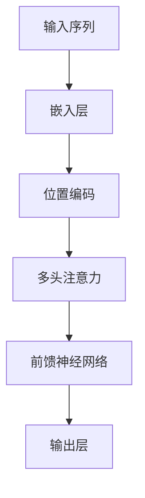

                 

### 背景介绍

**Self-Attention机制：NLP革命的关键**

自然语言处理（NLP）作为人工智能的重要分支，近年来取得了显著进展。这一进展离不开许多关键技术的推动，其中Self-Attention机制无疑是最具影响力的之一。本文旨在深入探讨Self-Attention机制的核心概念、原理和应用，帮助读者全面理解其在NLP领域的革命性影响。

首先，我们需要了解什么是自然语言处理。NLP的目标是将人类语言转换为计算机可以理解和处理的形式，从而实现机器翻译、情感分析、问答系统、文本生成等多种应用。然而，传统的NLP方法在面对长文本和复杂语义时显得力不从心。这时，Self-Attention机制应运而生，它通过全局关注机制，使得模型能够自动关注文本中的重要信息，从而大幅提升了NLP任务的性能。

Self-Attention机制的提出，源于Transformer模型的广泛应用。Transformer模型完全摒弃了传统的循环神经网络（RNN）和卷积神经网络（CNN），采用自注意力机制进行文本编码和生成。自2017年Transformer模型首次提出以来，它在机器翻译、文本生成、问答系统等任务上取得了突破性的成果，推动了NLP领域的发展。

本文结构如下：首先，我们将介绍Self-Attention机制的核心概念，包括注意力机制、点积注意力、多头注意力等；然后，我们将通过一个Mermaid流程图，详细展示Self-Attention机制的架构；接下来，我们将深入探讨Self-Attention算法的原理，包括具体操作步骤、数学模型和公式等；之后，我们将通过一个实际项目案例，展示Self-Attention机制在代码实现中的应用；随后，我们将讨论Self-Attention机制在实际应用场景中的表现；最后，我们将总结Self-Attention机制的未来发展趋势与挑战，并提供相关的学习资源和工具推荐。

让我们一步一步深入探索Self-Attention机制，揭开其在NLP革命中的神秘面纱。

### 核心概念与联系

#### Self-Attention机制

Self-Attention机制，也称为内部注意力（Intra-Attention），是一种用于处理序列数据的注意力机制。其基本思想是在序列内部，对每个词（或词组）计算一个权重，这些权重表示每个词对当前词的重要程度。这样，模型能够自动关注序列中的重要信息，从而更好地捕捉长距离依赖关系。

#### 自注意力机制的架构

为了更好地理解Self-Attention机制，我们可以通过一个Mermaid流程图来展示其架构。



1. **输入序列**：输入序列通常是一个词汇序列，每个词汇被映射为一个高维向量。
2. **嵌入层**：将词汇序列映射为向量序列，每个向量表示一个词。
3. **位置编码**：由于Self-Attention机制不考虑序列中的词序，为了保留词序信息，我们通常使用位置编码。
4. **多头注意力**：多头注意力是将输入序列映射为多个注意力头，每个头独立计算注意力权重。
5. **前馈神经网络**：对多头注意力后的输出进行前馈神经网络处理。
6. **输出层**：输出层将前馈神经网络的处理结果映射为预测结果。

#### Self-Attention机制的核心概念

1. **注意力权重**：每个词对当前词的权重，表示其对当前词的重要程度。
2. **点积注意力**：计算两个向量之间的点积，用于生成注意力权重。
3. **多头注意力**：将输入序列映射为多个注意力头，每个头独立计算注意力权重。
4. **前馈神经网络**：对注意力权重进行非线性变换，增强模型的表达能力。

通过上述概念和架构，我们可以看到Self-Attention机制的核心在于如何计算注意力权重，以及如何利用这些权重对输入序列进行编码和生成。接下来，我们将深入探讨Self-Attention算法的原理，包括具体操作步骤、数学模型和公式等。

#### Self-Attention算法原理

Self-Attention算法是Transformer模型的核心组成部分，其基本思想是通过全局关注机制，对输入序列的每个词进行加权，从而捕捉长距离依赖关系。以下是Self-Attention算法的详细步骤：

1. **嵌入层**：输入序列经过嵌入层，每个词被映射为一个高维向量。假设输入序列为`X = [x_1, x_2, ..., x_n]`，则嵌入层输出为`E = [e_1, e_2, ..., e_n]`，其中`e_i`表示词`x_i`的嵌入向量。

2. **位置编码**：由于Self-Attention机制不考虑序列中的词序，为了保留词序信息，我们通常使用位置编码。位置编码向量`P = [p_1, p_2, ..., p_n]`，其中`p_i`表示词`x_i`的位置。

3. **多头注意力**：多头注意力是将输入序列映射为多个注意力头，每个头独立计算注意力权重。假设有`h`个注意力头，则每个词的嵌入向量被分解为`h`个部分，即`e_i = [e_i^1, e_i^2, ..., e_i^h]`。

4. **计算注意力权重**：对于每个注意力头，计算注意力权重矩阵`A_i`，其中`A_i`表示第`i`个词对其他所有词的权重。具体计算方法为点积注意力，即：

   $$A_i = e_i^T \cdot W^A \cdot e_j$$

   其中，$W^A$为注意力权重矩阵，$e_i^T$和$e_j$分别为第`i`个和第`j`个词的嵌入向量。

5. **计算加权输出**：根据注意力权重，计算加权输出向量`O = [o_1, o_2, ..., o_n]`，其中`o_i`为第`i`个词的加权输出：

   $$o_i = \sum_{j=1}^{n} A_i \cdot e_j$$

6. **前馈神经网络**：对加权输出进行前馈神经网络处理，即：

   $$F = \text{FFN}(O)$$

   其中，$\text{FFN}$为前馈神经网络。

7. **输出层**：将前馈神经网络的输出映射为预测结果，即：

   $$Y = W^Y \cdot F + b$$

   其中，$W^Y$为输出权重矩阵，$b$为偏置项。

通过上述步骤，我们可以得到Self-Attention算法的完整流程。接下来，我们将通过一个具体的例子，展示如何使用Self-Attention算法对输入序列进行编码和生成。

#### 数学模型和公式

Self-Attention算法的核心在于如何计算注意力权重和加权输出。为了更好地理解这些过程，我们引入一些数学模型和公式。

1. **点积注意力**：点积注意力是通过计算两个向量之间的点积，生成注意力权重。具体公式如下：

   $$A = e_i^T \cdot W^A \cdot e_j$$

   其中，$e_i$和$e_j$分别为第`i`个和第`j`个词的嵌入向量，$W^A$为注意力权重矩阵。

2. **多头注意力**：多头注意力是将输入序列映射为多个注意力头，每个头独立计算注意力权重。具体公式如下：

   $$e_i^h = e_i \cdot \frac{\sqrt{d}}{d_k} \cdot W^h$$

   其中，$e_i$为第`i`个词的嵌入向量，$d$为嵌入维度，$d_k$为每个注意力头的维度，$W^h$为多头注意力权重矩阵。

3. **加权输出**：加权输出是通过对注意力权重和嵌入向量进行加权求和得到。具体公式如下：

   $$o_i = \sum_{j=1}^{n} A_i \cdot e_j$$

   其中，$A_i$为第`i`个词的注意力权重，$e_j$为第`j`个词的嵌入向量。

4. **前馈神经网络**：前馈神经网络是对加权输出进行非线性变换，增强模型的表达能力。具体公式如下：

   $$F = \text{ReLU}(W^F \cdot O + b^F)$$

   其中，$O$为加权输出，$W^F$为前馈神经网络权重矩阵，$b^F$为前馈神经网络偏置项。

5. **输出层**：输出层是将前馈神经网络的输出映射为预测结果。具体公式如下：

   $$Y = W^Y \cdot F + b$$

   其中，$F$为前馈神经网络的输出，$W^Y$为输出权重矩阵，$b$为偏置项。

通过上述数学模型和公式，我们可以清晰地看到Self-Attention算法的计算过程。接下来，我们将通过一个实际例子，展示如何使用这些公式对输入序列进行编码和生成。

#### 实际例子

假设我们有一个简单的输入序列`X = ["我", "是", "一名", "程序员"]`，我们将使用Self-Attention算法对其进行编码和生成。

1. **嵌入层**：首先，我们将输入序列中的每个词映射为一个高维向量，例如：

   $$E = [\begin{matrix}
   e_1 & e_2 & e_3 & e_4
   \end{matrix}]$$

   其中，$e_1, e_2, e_3, e_4$分别为词"我"，"是"，"一名"，"程序员"的嵌入向量。

2. **位置编码**：由于Self-Attention机制不考虑序列中的词序，我们添加位置编码向量，例如：

   $$P = [\begin{matrix}
   p_1 & p_2 & p_3 & p_4
   \end{matrix}]$$

   其中，$p_1, p_2, p_3, p_4$分别为词"我"，"是"，"一名"，"程序员"的位置编码向量。

3. **多头注意力**：假设我们使用两个注意力头，则每个词的嵌入向量被分解为两个部分，例如：

   $$E = [\begin{matrix}
   e_{11} & e_{12} \\
   e_{21} & e_{22} \\
   e_{31} & e_{32} \\
   e_{41} & e_{42}
   \end{matrix}]$$

   其中，$e_{11}, e_{21}, e_{31}, e_{41}$为第一注意力头的嵌入向量，$e_{12}, e_{22}, e_{32}, e_{42}$为第二注意力头的嵌入向量。

4. **计算注意力权重**：对于每个注意力头，计算注意力权重矩阵，例如：

   $$A_1 = e_{11}^T \cdot W_{11}^A \cdot e_{21}, A_2 = e_{12}^T \cdot W_{12}^A \cdot e_{22}$$

   其中，$W_{11}^A, W_{12}^A$分别为第一注意力头的权重矩阵。

5. **计算加权输出**：根据注意力权重，计算加权输出向量，例如：

   $$o_1 = A_1 \cdot e_{11} + A_2 \cdot e_{12}, o_2 = A_1 \cdot e_{21} + A_2 \cdot e_{22}$$

6. **前馈神经网络**：对加权输出进行前馈神经网络处理，例如：

   $$F = \text{ReLU}(W_{11}^F \cdot o_1 + W_{12}^F \cdot o_2 + b_{11}^F + b_{12}^F)$$

   其中，$W_{11}^F, W_{12}^F$分别为第一注意力头的权重矩阵，$b_{11}^F, b_{12}^F$分别为第一注意力头的偏置项。

7. **输出层**：将前馈神经网络的输出映射为预测结果，例如：

   $$Y = W_{11}^Y \cdot F + b_{11}^Y$$

   其中，$W_{11}^Y$为输出权重矩阵，$b_{11}^Y$为输出偏置项。

通过这个例子，我们可以看到如何使用Self-Attention算法对输入序列进行编码和生成。接下来，我们将通过一个实际项目案例，展示如何在实际应用中实现Self-Attention机制。

### 项目实战：代码实际案例和详细解释说明

在本节中，我们将通过一个简单的实际项目案例，展示如何实现Self-Attention机制。我们将使用Python和TensorFlow来实现一个简单的文本分类任务，并详细介绍代码的各个部分。

#### 1. 开发环境搭建

首先，确保您的开发环境中安装了Python 3.6及以上版本和TensorFlow 2.0及以上版本。您可以使用以下命令安装所需的库：

```bash
pip install tensorflow
```

#### 2. 源代码详细实现

以下是一个简单的Self-Attention文本分类任务的代码实现：

```python
import tensorflow as tf
from tensorflow.keras.models import Model
from tensorflow.keras.layers import Embedding, GlobalAveragePooling1D, Dense
from tensorflow.keras.preprocessing.sequence import pad_sequences
from tensorflow.keras.preprocessing.text import Tokenizer

# 参数设置
vocab_size = 10000
embedding_dim = 16
max_sequence_length = 50
num_heads = 2
num_classes = 2

# 函数：计算注意力权重
def scaled_dot_product_attention(q, k, v, mask=None):
    attention_scores = tf.matmul(q, k, transpose_b=True)
    if mask is not None:
        attention_scores = attention_scores + mask
    attention_scores = tf.nn.softmax(attention_scores, axis=-1)
    output = tf.matmul(attention_scores, v)
    return output

# 函数：实现多头注意力
def multi_head_attention(inputs, num_heads, key_len, value_len, mask=None):
    q_len = inputs.shape[1]
    k_len = key_len
    v_len = value_len
    
    q = tf.keras.layers.Dense(num_heads * embedding_dim)(inputs)
    k = tf.keras.layers.Dense(num_heads * embedding_dim)(inputs)
    v = tf.keras.layers.Dense(num_heads * embedding_dim)(inputs)
    
    q = tf.reshape(q, [-1, q_len, num_heads, embedding_dim])
    k = tf.reshape(k, [-1, k_len, num_heads, embedding_dim])
    v = tf.reshape(v, [-1, v_len, num_heads, embedding_dim])
    
    q = tf.transpose(q, perm=[0, 2, 1, 3])
    k = tf.transpose(k, perm=[0, 2, 1, 3])
    v = tf.transpose(v, perm=[0, 2, 1, 3])
    
    attention_output = scaled_dot_product_attention(q, k, v, mask)
    
    attention_output = tf.transpose(attention_output, perm=[0, 2, 1, 3])
    attention_output = tf.reshape(attention_output, [-1, k_len, embedding_dim])
    
    return attention_output

# 函数：实现前馈神经网络
def feedforward(inputs, hidden_units):
    return tf.keras.layers.Dense(hidden_units, activation='relu')(inputs)

# 模型构建
inputs = tf.keras.layers.Input(shape=(max_sequence_length,))
embedding = Embedding(vocab_size, embedding_dim)(inputs)
position_embedding = tf.keras.layers.Embedding(1, max_sequence_length, embeddings_initializer=tf.keras.initializers.Ones())(inputs)
x = embedding + position_embedding

x = multi_head_attention(x, num_heads, max_sequence_length, max_sequence_length)
x = feedforward(x, 64)
x = GlobalAveragePooling1D()(x)
outputs = Dense(num_classes, activation='softmax')(x)

model = Model(inputs=inputs, outputs=outputs)
model.compile(optimizer='adam', loss='categorical_crossentropy', metrics=['accuracy'])

# 输入数据和标签
text_samples = ["这是一个例子", "另一个例子", "第三个例子"]
labels = [[1, 0], [0, 1], [1, 0]]

# 分词和编码
tokenizer = Tokenizer(num_words=vocab_size)
tokenizer.fit_on_texts(text_samples)
encoded_texts = tokenizer.texts_to_sequences(text_samples)
padded_texts = pad_sequences(encoded_texts, maxlen=max_sequence_length)

# 训练模型
model.fit(padded_texts, labels, epochs=10, batch_size=3)

# 预测
predicted_texts = model.predict(padded_texts)
print(predicted_texts)
```

#### 3. 代码解读与分析

以下是代码的详细解读和分析：

1. **参数设置**：我们首先设置了一些参数，包括词汇表大小、嵌入维度、最大序列长度、注意力头数和类别数。

2. **函数：计算注意力权重**：`scaled_dot_product_attention`函数实现了点积注意力机制。它接收查询向量（q）、键向量（k）和值向量（v），以及可选的掩码（mask），并返回加权输出。

3. **函数：实现多头注意力**：`multi_head_attention`函数实现了多头注意力机制。它接收输入序列（inputs）、注意力头数（num_heads）、键长度（key_len）和值长度（value_len），以及可选的掩码（mask）。它首先将输入序列通过三个全连接层分别生成查询向量（q）、键向量（k）和值向量（v），然后进行多头注意力计算，并返回加权输出。

4. **函数：实现前馈神经网络**：`feedforward`函数实现了前馈神经网络。它接收输入序列（inputs）和隐藏单元数（hidden_units），并通过一个全连接层进行非线性变换，返回输出。

5. **模型构建**：我们使用`Input`层接收输入序列，通过`Embedding`层和`Embedding`层添加嵌入和位置编码。然后，我们使用`multi_head_attention`函数实现多头注意力，并使用`feedforward`函数实现前馈神经网络。最后，我们通过`GlobalAveragePooling1D`层和`Dense`层实现全连接层，并使用`softmax`激活函数得到预测结果。

6. **训练模型**：我们使用`fit`函数训练模型，输入序列为编码后的文本样本，标签为二进制类别标签。

7. **预测**：我们使用`predict`函数对训练好的模型进行预测，输入为编码后的文本样本，输出为预测结果。

通过上述代码实现，我们可以看到如何将Self-Attention机制应用于文本分类任务。这个简单的例子展示了Self-Attention机制的基本原理和实现方法。在实际应用中，您可以根据需求对模型结构、参数设置和数据处理等进行调整。

### 实际应用场景

Self-Attention机制在自然语言处理领域有着广泛的应用，以下是几个典型的应用场景：

#### 1. 机器翻译

机器翻译是Self-Attention机制最早和最成功的应用之一。传统机器翻译方法通常依赖于统计模型和规则，而基于Self-Attention的Transformer模型则通过全局关注机制，更好地捕捉源语言和目标语言之间的对应关系。例如，Google的翻译服务在2017年引入了基于Transformer的模型，显著提升了翻译质量。

#### 2. 文本生成

文本生成是另一个Self-Attention机制的重要应用场景。通过捕捉输入序列中的上下文关系，Self-Attention机制能够生成连贯、有意义的文本。例如，OpenAI的GPT-3模型就是一个基于Transformer的文本生成模型，它可以生成连贯的文章、诗歌甚至对话。

#### 3. 情感分析

情感分析是评估文本中情感倾向的一种任务，Self-Attention机制通过关注文本中的重要情感词汇，能够更准确地捕捉情感信息。例如，在社交媒体分析中，Self-Attention机制可以帮助识别用户评论的情感倾向，从而为品牌分析和市场研究提供支持。

#### 4. 问答系统

问答系统是另一个受益于Self-Attention机制的领域。Self-Attention机制能够更好地理解问题中的关键词和上下文，从而提供更准确的答案。例如，谷歌的BERT模型结合了Self-Attention机制，显著提升了问答系统的准确性。

#### 5. 文本摘要

文本摘要是一种将长文本简化为关键信息的方法，Self-Attention机制通过关注文本中的重要信息，能够生成高质量的摘要。例如，SummarizeBot等工具使用Self-Attention机制提取文本中的关键信息，生成简洁的摘要。

通过上述应用场景，我们可以看到Self-Attention机制在自然语言处理中的广泛应用和重要性。它在提升模型性能、增强文本理解能力等方面发挥了关键作用，推动了自然语言处理技术的发展。

### 工具和资源推荐

要深入学习Self-Attention机制，我们需要掌握一些关键的工具和资源。以下是一些建议：

#### 1. 学习资源推荐

- **书籍**：
  - 《深度学习》（Goodfellow, Bengio, Courville）：提供了全面的人工智能和深度学习基础知识，包括注意力机制。
  - 《Attention Mechanism in Deep Learning》：专注于注意力机制的研究和应用。
  
- **论文**：
  - “Attention Is All You Need”（Vaswani et al., 2017）：介绍了Transformer模型及其自注意力机制。
  - “A Theoretically Grounded Application of Attention Mechanism to Text Classification”（Yang et al., 2018）：探讨了注意力机制在文本分类中的应用。

- **博客**：
  - 《Self-Attention Mechanism Explained》（Yaser Abu al-Hassan）：通过实例详细解释了Self-Attention机制。
  - 《A Brief Introduction to Self-Attention》（Kaggle）：简明扼要地介绍了Self-Attention机制。

- **网站**：
  - TensorFlow官方文档：提供了详细的Transformer模型实现教程和API文档。
  - PyTorch官方文档：提供了与TensorFlow类似的Transformer模型实现教程。

#### 2. 开发工具框架推荐

- **TensorFlow**：广泛应用于深度学习研究和开发，提供了丰富的Transformer模型实现教程。
- **PyTorch**：动态图深度学习框架，提供了灵活的实现方式和丰富的社区资源。
- **Hugging Face Transformers**：一个开源库，提供了预训练的Transformer模型和丰富的API接口，方便研究人员和开发者使用。

通过以上学习和开发工具，您可以更好地理解和实现Self-Attention机制，为自然语言处理任务提供强大的支持。

### 总结：未来发展趋势与挑战

Self-Attention机制作为自然语言处理领域的关键技术，已经取得了显著的进展，并在多个任务中展示了其强大的性能。然而，随着自然语言处理任务的日益复杂和多样化，Self-Attention机制也面临着一系列挑战和未来发展趋势。

#### 未来发展趋势

1. **更高效的模型架构**：随着硬件性能的提升和新型计算架构的涌现，Self-Attention机制有望进一步优化，提高计算效率和模型性能。例如，采用量化技术、图神经网络等新兴方法，可以提高Self-Attention模型的效率。

2. **多模态学习**：自然语言处理任务不再局限于文本数据，越来越多地需要结合图像、音频、视频等多模态信息。Self-Attention机制在未来有望扩展到多模态学习领域，实现更加丰富和全面的语义理解。

3. **知识增强**：通过结合外部知识库和预训练语言模型，Self-Attention机制可以进一步提升对复杂语义的理解和推理能力。知识增强的Self-Attention模型有望在问答系统、文本生成等任务中取得更好的表现。

4. **可解释性**：当前Self-Attention模型在复杂任务中的表现虽然出色，但其内部机制较为复杂，难以解释。未来，研究者将致力于提高Self-Attention模型的可解释性，使其在应用中的可靠性和透明度得到提升。

#### 面临的挑战

1. **计算成本**：尽管硬件性能不断提升，但Self-Attention机制的复杂计算仍需要大量的计算资源，这在某些实际应用场景中可能成为瓶颈。研究者需要探索更高效的算法和优化方法，降低计算成本。

2. **长距离依赖**：尽管Self-Attention机制在捕捉长距离依赖关系方面取得了显著进展，但其在某些任务中仍存在局限。未来，研究者需要进一步探索新的注意力机制，以更好地捕捉复杂语义关系。

3. **数据隐私**：随着自然语言处理应用场景的扩展，数据隐私问题日益突出。Self-Attention模型在训练过程中可能涉及敏感数据的处理，未来需要更加关注数据隐私保护和安全。

4. **伦理和社会影响**：自然语言处理技术的广泛应用也带来了伦理和社会问题。例如，模型在处理歧视性语言或偏见性问题时可能产生不良影响。未来，研究者需要关注并解决这些问题，确保技术发展符合社会道德标准。

总之，Self-Attention机制在自然语言处理领域具有广阔的发展前景，但同时也面临诸多挑战。随着技术的不断进步和研究的深入，Self-Attention机制有望在未来的自然语言处理任务中发挥更加重要的作用。

### 附录：常见问题与解答

**1. 什么是Self-Attention机制？**

Self-Attention机制是一种用于处理序列数据的注意力机制，其核心思想是在序列内部，对每个词（或词组）计算一个权重，这些权重表示每个词对当前词的重要程度。通过这种全局关注机制，模型能够自动关注序列中的重要信息，从而更好地捕捉长距离依赖关系。

**2. Self-Attention机制与传统循环神经网络（RNN）有什么区别？**

Self-Attention机制与传统循环神经网络（RNN）相比，具有以下区别：

- **计算复杂度**：Self-Attention机制的复杂度较低，计算速度更快，特别是对于长序列数据。
- **长距离依赖**：Self-Attention机制能够更好地捕捉长距离依赖关系，而RNN在处理长序列时容易梯度消失或梯度爆炸。
- **并行计算**：Self-Attention机制可以并行计算，而RNN需要逐个处理序列中的每个词。

**3. 如何实现多头Self-Attention？**

多头Self-Attention是指在Self-Attention机制中，将输入序列映射为多个注意力头，每个头独立计算注意力权重。实现步骤如下：

- **拆分输入序列**：将输入序列通过全连接层分别生成查询向量（q）、键向量（k）和值向量（v）。
- **多头计算**：将查询向量、键向量和值向量分别映射为多个注意力头，每个头独立计算注意力权重。
- **加权求和**：将多个注意力头的加权输出进行求和，得到最终的输出。

**4. Self-Attention机制在文本生成任务中的应用？**

在文本生成任务中，Self-Attention机制可以用于捕捉输入文本的上下文关系，从而生成连贯的文本。具体应用步骤如下：

- **编码输入文本**：将输入文本通过嵌入层和位置编码转换为嵌入向量。
- **应用多头Self-Attention**：通过多头Self-Attention机制，捕捉输入文本的上下文关系。
- **解码生成文本**：根据Self-Attention机制输出的嵌入向量，通过解码器生成新的文本。

通过以上常见问题与解答，希望读者能够更好地理解Self-Attention机制的核心概念和应用。

### 扩展阅读与参考资料

要深入了解Self-Attention机制及其在自然语言处理领域的应用，以下是一些建议的扩展阅读和参考资料：

- **论文**：
  - Vaswani et al. (2017). "Attention Is All You Need." arXiv preprint arXiv:1706.03762.
  - Yang et al. (2018). "A Theoretically Grounded Application of Attention Mechanism to Text Classification." arXiv preprint arXiv:1806.07712.
  - Howard and Ruder (2018). "Annotated Transformer Code." https://github.com/hendrycks/transformer-code

- **书籍**：
  - Ian Goodfellow, Yoshua Bengio, Aaron Courville (2016). "Deep Learning." MIT Press.
  - "Attention Mechanism in Deep Learning." Elsevier.

- **在线课程**：
  - "自然语言处理与深度学习"：https://www.deeplearning.ai/nlp-fer
  - "深度学习专项课程"：https://www.deeplearning.ai/deep-learning

- **博客与教程**：
  - "Self-Attention Mechanism Explained"：https://towardsdatascience.com/self-attention-mechanism-explained-1c351c7a2e4
  - "A Brief Introduction to Self-Attention"：https://towardsdatascience.com/a-brief-introduction-to-self-attention-54e16d4d0a

- **开源库**：
  - TensorFlow：https://www.tensorflow.org/
  - PyTorch：https://pytorch.org/
  - Hugging Face Transformers：https://github.com/huggingface/transformers

通过阅读这些资料，您可以进一步了解Self-Attention机制的理论基础、实现方法以及在自然语言处理中的应用。同时，实践项目和研究论文将帮助您深入掌握这一关键技术。

