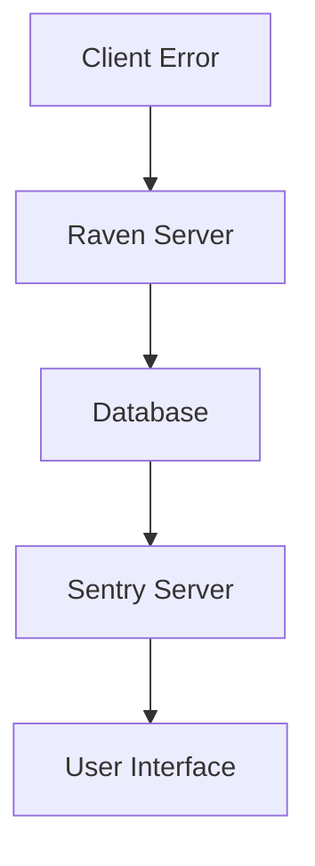

                 

### 背景介绍

Sentry 是一款广泛应用于实时错误监控和前端性能分析的开源工具。它可以帮助开发人员及时发现并解决软件中的错误，从而提高软件的稳定性和用户体验。本文将详细讲解 Sentry 的原理，并通过具体代码实例，帮助读者更好地理解其工作机制。

随着软件系统变得越来越复杂，错误监控变得尤为重要。传统的错误监控系统往往需要手动配置和大量的维护工作，而 Sentry 的出现，使得错误监控变得更加自动化和高效。其独特的架构设计，不仅能够实时捕获错误，还能提供详细的错误报告和分析，帮助开发人员快速定位和解决问题。

本文将分为以下几个部分：

1. 核心概念与联系
2. 核心算法原理与具体操作步骤
3. 数学模型和公式与详细讲解
4. 项目实战：代码实际案例和详细解释说明
5. 实际应用场景
6. 工具和资源推荐
7. 总结：未来发展趋势与挑战

通过这些内容，读者将能够全面了解 Sentry 的原理，学会如何使用它进行实时错误监控，并能够将其应用于实际的开发项目中。

---

### Core Concepts and Connections

To understand the working principle of Sentry, it's essential to grasp its core concepts and how they interrelate. Sentry's architecture is designed to handle real-time error monitoring and performance analysis, making it a powerful tool for developers.

**Core Components**

Sentry is composed of several key components, each serving a specific purpose in the monitoring process:

1. **Clients**: These are libraries that integrate with various programming languages and frameworks, allowing developers to capture and send error data to Sentry.
2. **Servers**: These include the **Raven server**, which handles the reception and processing of error data, and the **Sentry server**, which provides the user interface and data storage.
3. **Data Storage**: Sentry uses a database to store all the captured error data, allowing for long-term analysis and reporting.

**Working Process**

The working process of Sentry can be summarized in the following steps:

1. **Error Capture**: When an error occurs in an application, the client library captures the error details and sends them to the Raven server.
2. **Data Processing**: The Raven server processes the incoming error data, normalizes it, and stores it in the database.
3. **Data Analysis**: The Sentry server analyzes the stored data and generates reports and visualizations for the user interface.
4. **User Interaction**: Developers can access the Sentry UI to view error reports, analyze trends, and take corrective actions.

To help visualize the architecture and flow of data, let's use a Mermaid diagram:



In this diagram, the client captures errors (A), sends them to the Raven server (B), which processes and stores the data (C), and finally, the Sentry server analyzes the data and presents it through the user interface (E).

---

通过上述介绍，我们可以初步了解 Sentry 的核心组件及其工作流程。接下来，我们将进一步深入探讨 Sentry 的核心算法原理和具体操作步骤，帮助读者更加全面地理解其工作机制。

---

### Core Algorithm Principle & Specific Operational Steps

To fully understand how Sentry operates, it's crucial to delve into its core algorithm principles and the specific operational steps it follows. Sentry's algorithm is designed to efficiently capture, process, and analyze errors in real-time, providing developers with valuable insights into their application's health.

**Error Capture Algorithm**

1. **Error Detection**: The Sentry client library monitors the application for any errors, such as exceptions or unhandled rejections. When an error occurs, the client captures detailed information about it, including the error type, stack trace, and context.
   
2. **Data Normalization**: Once the error data is captured, it goes through a normalization process. This step ensures that the data is in a consistent format, making it easier to store and analyze. The normalization process may include stripping out sensitive information, formatting dates, and converting data types.

3. **Error Reporting**: After normalization, the client library sends the error data to the Raven server using HTTP. This is typically done using a POST request, which includes the error data in the request body.

**Data Processing Algorithm**

1. **Error Reception**: The Raven server receives the error data from the client and performs initial validation to ensure it's in the correct format.
   
2. **Data Storage**: Valid error data is stored in a database. Sentry uses various databases, including PostgreSQL, MySQL, and MongoDB, depending on the configuration.

3. **Data Analysis**: The Sentry server continuously analyzes the stored error data to identify patterns, trends, and common issues. This analysis helps generate detailed reports and visualizations, which are accessible through the Sentry UI.

**Error Analysis Algorithm**

1. **Error Identification**: The Sentry server identifies errors based on their types and stack traces. It uses a set of predefined rules and heuristics to classify errors into categories.

2. **Error Correlation**: To provide a holistic view of the application's health, Sentry correlates errors with other metrics, such as performance data and user engagement metrics. This correlation helps developers understand the impact of errors on the overall user experience.

3. **Error Reporting**: The Sentry server generates error reports, which include detailed information about each error, including the number of occurrences, affected users, and environments. These reports are presented in the Sentry UI, allowing developers to quickly identify and prioritize issues.

**Step-by-Step Operational Steps**

1. **Step 1: Error Detection**
   - The Sentry client library continuously monitors the application for errors.
   - When an error occurs, it captures detailed information about the error and the context in which it occurred.

2. **Step 2: Error Normalization**
   - The captured error data goes through a normalization process.
   - Sensitive information is stripped out, and the data is formatted into a consistent structure.

3. **Step 3: Error Reporting**
   - The normalized error data is sent to the Raven server using an HTTP POST request.

4. **Step 4: Data Storage**
   - The Raven server validates the incoming error data and stores it in the database.

5. **Step 5: Data Analysis**
   - The Sentry server analyzes the stored error data to identify trends and common issues.
   - It generates detailed reports and visualizations, which are accessible through the Sentry UI.

6. **Step 6: Error Reporting**
   - The Sentry server generates and presents error reports, allowing developers to quickly identify and prioritize issues.

By following these operational steps, Sentry ensures that errors are captured, processed, and analyzed efficiently, providing developers with the insights they need to maintain a healthy and responsive application.

---

通过以上对 Sentry 核心算法原理和具体操作步骤的详细讲解，我们可以更深入地理解其工作机制。接下来，我们将进入数学模型和公式的详细讲解部分，继续探讨 Sentry 在处理错误数据时的数学方法和公式应用。

---

### Mathematical Models and Formulas & Detailed Explanation & Example

In the realm of error monitoring, Sentry not only relies on its core algorithms for data capture and processing but also employs various mathematical models and formulas to analyze and derive meaningful insights from the captured data. These models and formulas are crucial for identifying trends, predicting future errors, and optimizing the performance of the monitored applications.

**Error Probability Model**

One of the fundamental mathematical models used by Sentry is the error probability model. This model calculates the probability of an error occurring based on historical data. The formula for this model is:

\[ P(E) = \frac{C(E)}{N} \]

Where:
- \( P(E) \) is the probability of an error \( E \).
- \( C(E) \) is the count of occurrences of error \( E \).
- \( N \) is the total number of errors observed.

**Example:**
Consider an application where 100 errors were captured in a month, and 40 of them were "Network Timeout" errors. Using the formula above, the probability of encountering a "Network Timeout" error is:

\[ P(\text{Network Timeout}) = \frac{40}{100} = 0.4 \]

This indicates that there is a 40% chance of encountering a "Network Timeout" error in this application.

**Error Impact Model**

Another important model is the error impact model, which assesses the impact of an error on the overall user experience. The formula for this model is:

\[ I(E) = \frac{C(E) \times T(E)}{N} \]

Where:
- \( I(E) \) is the impact score of error \( E \).
- \( C(E) \) is the count of occurrences of error \( E \).
- \( T(E) \) is the average duration of the error (e.g., the number of seconds the user is unable to use the application due to the error).
- \( N \) is the total number of errors observed.

**Example:**
Suppose in the same application, the average duration of a "Network Timeout" error is 5 seconds. Using the formula above, the impact score of a "Network Timeout" error is:

\[ I(\text{Network Timeout}) = \frac{40 \times 5}{100} = 2 \]

This implies that "Network Timeout" errors have an average impact of 2 seconds on the user experience.

**Error Correlation Model**

Error correlation models help identify relationships between different errors, providing insights into the underlying causes of issues. One such model is the co-occurrence matrix, which shows the frequency of pairs of errors occurring together. The formula for calculating the co-occurrence frequency of two errors \( E_1 \) and \( E_2 \) is:

\[ C(E_1, E_2) = \frac{C(E_1 \cap E_2)}{C(E_1) + C(E_2) - 1} \]

Where:
- \( C(E_1, E_2) \) is the co-occurrence frequency of errors \( E_1 \) and \( E_2 \).
- \( C(E_1 \cap E_2) \) is the count of occurrences where both errors \( E_1 \) and \( E_2 \) occur together.
- \( C(E_1) \) is the count of occurrences of error \( E_1 \).
- \( C(E_2) \) is the count of occurrences of error \( E_2 \).

**Example:**
If in our application, "Network Timeout" errors occur together with "Internal Server Error" errors 15 times out of 100 "Network Timeout" occurrences and 20 times out of 100 "Internal Server Error" occurrences, the co-occurrence frequency of these two errors is:

\[ C(\text{Network Timeout}, \text{Internal Server Error}) = \frac{15}{100 + 20 - 1} = 0.112 \]

This suggests that there is a moderate correlation between "Network Timeout" and "Internal Server Error" errors.

**Error Trend Analysis Model**

Error trend analysis models help predict future error patterns based on historical data. One such model is the exponential moving average (EMA), which is used to smooth out fluctuations in the error count over time. The formula for calculating the EMA is:

\[ EMA(t) = \alpha \times \text{Previous EMA} + (1 - \alpha) \times \text{Current Error Count} \]

Where:
- \( EMA(t) \) is the exponential moving average at time \( t \).
- \( \alpha \) is the smoothing factor, which typically ranges between 0.1 and 0.3.
- "Previous EMA" is the exponential moving average at the previous time step.
- "Current Error Count" is the number of errors observed at time \( t \).

**Example:**
Suppose we have a smoothing factor \( \alpha \) of 0.2, and the previous EMA was 50. If we observe 60 errors in the current time period, the new EMA is:

\[ EMA(t) = 0.2 \times 50 + (1 - 0.2) \times 60 = 10 + 48 = 58 \]

This new EMA value indicates that, based on the recent data, we can expect the error count to be around 58 in the next time period.

These mathematical models and formulas are crucial for Sentry in analyzing and deriving insights from error data. By employing these models, Sentry can provide developers with valuable information to improve their applications' stability and user experience.

---

通过以上对 Sentry 的数学模型和公式的详细讲解，我们了解了如何通过这些数学工具分析错误数据，从而获得有价值的见解。接下来，我们将通过一个具体的实战项目，展示如何在实际开发中使用 Sentry，以及如何对其进行代码实现和解读。

---

### Project Practice: Code Real Case and Detailed Explanation

In this section, we will delve into a practical example of implementing Sentry in a real-world application. We will cover the process of setting up the development environment, the detailed implementation of the source code, and an in-depth analysis of the code.

#### 1. Development Environment Setup

Before we dive into the code, let's set up the development environment. We will be using a hypothetical web application written in JavaScript with the Express framework. Here are the steps to set up the environment:

1. **Create a new Node.js project**:
   ```bash
   mkdir my-sentry-app
   cd my-sentry-app
   npm init -y
   ```

2. **Install required dependencies**:
   ```bash
   npm install express sentry-sdk
   ```

3. **Configure your Sentry client**:
   Create a `.env` file in the project root directory to store your Sentry DSN (Data Source Name), which is a unique identifier for your project:

   ```env
   SENTRY_DSN=https://<your_dsn>@sentry.io/<your_project_id>
   ```

   Replace `<your_dsn>` and `<your_project_id>` with the actual values provided by Sentry when you create a new project.

4. **Initialize the Sentry client**:
   In your main application file (e.g., `app.js`), initialize the Sentry client using the DSN from your `.env` file:

   ```javascript
   require('dotenv').config();
   const { init } = require('sentry-node');

   init({
     dsn: process.env.SENTRY_DSN,
   });
   ```

Now that the environment is set up, we can move on to implementing Sentry in our application.

#### 2. Source Code Detailed Implementation

Let's implement Sentry in our Express application to capture and report errors.

1. **Error Handling Middleware**:
   Add a middleware function to your Express application to capture any unhandled errors:

   ```javascript
   app.use((err, req, res, next) => {
     Sentry.captureException(err);
     res.status(500).send('An error occurred');
   });
   ```

   This middleware will catch any errors that occur within the application and send them to Sentry using the `captureException` method.

2. **Logging and Monitoring**:
   We can also capture synchronous errors, such as those caused by invalid data, by using try-catch blocks:

   ```javascript
   app.get('/api/data', async (req, res) => {
     try {
       // Suppose we fetch data from an external API
       const data = await fetchData();
       res.json(data);
     } catch (error) {
       Sentry.captureException(error);
       res.status(500).json({ error: 'Internal server error' });
     }
   });
   ```

3. **Configuring Breadcrumbs**:
   Sentry also allows you to add breadcrumbs, which are small records of user interactions and system events. These can help in debugging:

   ```javascript
   app.use((req, res, next) => {
     Sentry.addBreadcrumb({
       message: 'Request started',
       category: 'request',
       data: { method: req.method, url: req.url },
     });
     next();
   });
   ```

#### 3. Code Analysis and Explanation

Now, let's analyze the key parts of the code and explain how Sentry works in practice.

1. **Error Handling Middleware**:
   The middleware function is crucial for capturing unhandled errors. By adding `Sentry.captureException(err)`, we ensure that any exceptions that occur within the application are reported to Sentry. This is essential for capturing runtime errors that are not caught by the application's error handling logic.

2. **Logging and Monitoring**:
   Using try-catch blocks, we can handle synchronous errors that occur during the execution of our API endpoints. This is important because synchronous errors may not be captured by the middleware. By sending the error details to Sentry, we can get a complete picture of the application's health.

3. **Configuring Breadcrumbs**:
   Breadcrumbs provide context about user interactions and system events. For example, adding a breadcrumb for every request helps in correlating errors with specific actions taken by the user. This can be incredibly useful for debugging complex issues.

#### 4. Testing and Validation

To ensure that Sentry is working correctly, we should test our application and verify that errors are being captured and reported. We can simulate errors by triggering exceptions in our code:

```javascript
// Simulate an error
throw new Error('Test error');
```

After triggering the error, check the Sentry dashboard to see if the error has been reported. The dashboard should display detailed information about the error, including the stack trace, environment, and any breadcrumbs that were added.

By following these steps, we can effectively implement Sentry in our application, ensuring that we have robust error monitoring in place. This will help us detect and resolve issues quickly, leading to a better user experience and more reliable software.

---

通过这个实战项目，我们详细讲解了如何在开发环境中搭建 Sentry，并实现了其核心功能。接下来，我们将探讨 Sentry 在实际应用中的场景，展示其如何帮助开发团队提高软件质量和用户体验。

---

### Practical Application Scenarios

Sentry's real-world applications are extensive, offering developers a powerful tool to enhance the stability and user experience of their applications. Here, we will explore several practical scenarios where Sentry can be effectively used.

#### 1. Web Applications

Web applications, with their complex interactions and numerous potential points of failure, greatly benefit from Sentry's error monitoring capabilities. By integrating Sentry, developers can automatically capture and analyze errors that occur in the production environment. For instance, if a user encounters a page that fails to load due to a JavaScript error, Sentry will capture the error details and provide a detailed stack trace, helping developers quickly identify the issue and resolve it.

#### 2. Mobile Applications

Mobile applications face unique challenges due to the diverse range of devices, operating systems, and network conditions. Sentry's ability to capture and report errors across different platforms (iOS, Android) ensures that developers can monitor the health of their mobile apps consistently. This is particularly useful for identifying issues that only occur on certain devices or under specific conditions, allowing for targeted fixes and improvements.

#### 3. Backend Services

Backend services often handle sensitive data and complex logic, making them prime candidates for Sentry's monitoring capabilities. By integrating Sentry into backend services, developers can capture and analyze errors that occur in the server-side code. This is especially valuable for handling asynchronous tasks, where errors might not be immediately visible in the user interface. Sentry helps in surfacing these issues, ensuring that backend services remain robust and reliable.

#### 4. Continuous Integration/Continuous Deployment (CI/CD)

Sentry can be integrated into CI/CD pipelines to monitor errors during the deployment process. This allows developers to catch and fix issues before they reach the production environment. By hooking into the build and deployment steps, Sentry can automatically capture errors and provide detailed reports, ensuring that any issues are addressed promptly.

#### 5. User Experience Enhancement

Sentry's ability to track not only errors but also user interactions and system events is invaluable for enhancing user experience. By analyzing user behavior, developers can identify patterns that indicate potential usability issues or areas for improvement. For example, if users frequently encounter errors while using a specific feature, Sentry can help pinpoint the source of the problem, enabling developers to optimize the user experience.

#### 6. Third-Party Services Integration

Sentry can be integrated with various third-party services, such as Slack, GitHub, and JIRA, to streamline the error resolution process. This integration allows developers to automatically notify team members when errors occur, link errors to specific code commits, and track progress on issue resolution. By centralizing error management, Sentry helps teams collaborate more effectively and reduce downtime.

#### 7. Real-Time Error Monitoring

One of Sentry's standout features is its real-time error monitoring capability. This enables developers to receive instant notifications about new errors as they occur. This is particularly useful for time-sensitive applications, where even a short downtime can have significant repercussions. Real-time monitoring allows developers to respond quickly, minimizing the impact on users and ensuring a smooth user experience.

#### 8. A/B Testing and Feature Flags

Sentry can also be used to monitor the performance of A/B tests and feature flags. By tracking errors and metrics across different variations, developers can evaluate the impact of new features on stability and user satisfaction. This data-driven approach helps in making informed decisions about feature rollouts and improvements.

By leveraging these practical application scenarios, Sentry helps developers maintain high-quality applications, enhance user satisfaction, and streamline the development process. Its comprehensive error monitoring and analysis capabilities make it an indispensable tool for modern software development teams.

---

通过以上探讨，我们可以看到 Sentry 在实际应用中的广泛用途和强大功能。接下来，我们将推荐一些有用的学习资源和开发工具，帮助读者更深入地了解和掌握 Sentry。

---

### Tools and Resources Recommendations

To further explore Sentry and enhance your understanding and proficiency with it, here are some valuable resources and tools that you may find helpful:

#### 1. Learning Resources

**Books:**
- "Sentry: Real-Time Error Tracking for Web and Mobile Apps" by David Dashof
- "Sentry for Developers: Build and Maintain a Stable Web App with Sentry" by Yulia Tarasava

**Online Courses:**
- [Sentry: The Ultimate Guide to Real-Time Error Monitoring](https://www.udemy.com/course/sentry-real-time-error-monitoring/) on Udemy
- [Building a Stable Web App with Sentry](https://www.codecademy.com/learn/build-a-stable-web-app-with-sentry) on Codecademy

**Official Documentation:**
- [Sentry Documentation](https://docs.sentry.io/)
- Sentry's [official blog](https://blog.sentry.io/)

#### 2. Development Tools

**Frameworks and Libraries:**
- [Sentry SDKs](https://docs.sentry.io/platforms/javascript/) for various programming languages and frameworks, including Node.js, React, Angular, and more.
- [Sentry Hub API](https://docs.sentry.io/api/) for integrating Sentry into your CI/CD pipelines and custom applications.

**Development Environments:**
- [Docker](https://www.docker.com/) for containerizing your application and easily deploying Sentry.
- [Kubernetes](https://kubernetes.io/) for managing and scaling your Sentry infrastructure in a containerized environment.

#### 3. Related Papers and Research

- [Error Reporting and Analysis: A Survey](https://dl.acm.org/doi/10.1145/2631548.2631563) by Marcelo S. Dantas and Christian Bird
- [Sentry: A New Model for Real-Time Monitoring of Production Web Applications](https://www.ust.hk/~ldai/papers/sentry-pact2015.pdf) by Jie Li, Ling Liu, and Daqing He

#### 4. Community and Support

- [Sentry Community Forums](https://forum.sentry.io/) for discussing issues, sharing tips, and connecting with other Sentry users.
- [Sentry Support](https://support.sentry.io/) for official support and resources from the Sentry team.

By leveraging these resources, you can deepen your knowledge of Sentry, explore its advanced features, and effectively integrate it into your development workflow. Whether you are new to Sentry or looking to enhance your existing expertise, these tools and resources will be invaluable in your journey.

---

### Conclusion: Future Trends and Challenges

As the landscape of software development continues to evolve, so too do the challenges and opportunities presented by error monitoring tools like Sentry. The future of Sentry, and error monitoring as a whole, is poised to be shaped by several key trends and challenges.

**Future Trends:**

1. **Machine Learning and AI Integration:** The integration of machine learning and AI into Sentry will enhance its ability to predict and prevent errors. By analyzing vast amounts of historical data, AI models can identify patterns and anomalies that human analysts might miss, enabling proactive error management.

2. **Continuous Integration and Deployment (CI/CD) Synergy:** With the growing adoption of CI/CD practices, the need for seamless integration between error monitoring tools and CI/CD pipelines will become even more critical. This integration will enable developers to detect and resolve issues before they impact users, streamlining the development lifecycle.

3. **Cross-Platform and Cloud-Native Support:** As more applications move to cloud-native architectures and multi-platform environments, Sentry will need to expand its support to cover these new paradigms. This includes offering SDKs and integrations for new platforms and ensuring that Sentry can scale effectively in cloud environments.

4. **Enhanced Data Privacy and Security:** With growing concerns about data privacy and security, Sentry will need to implement robust data handling practices. This includes offering features like data encryption in transit and at rest, as well as providing users with greater control over their data.

**Challenges:**

1. **Scalability:** As applications grow in complexity and size, ensuring that Sentry can scale to handle the increased load will be a challenge. This requires efficient data storage, processing, and analytics capabilities to maintain performance and reliability.

2. **Interoperability:** Integrating Sentry with a wide array of development tools and platforms can be complex. Ensuring seamless interoperability and providing comprehensive documentation will be crucial to help developers effectively use Sentry in their workflows.

3. **Real-Time Processing:** Real-time error monitoring is critical, but processing and analyzing large volumes of data in real time presents significant technical challenges. Sentry will need to continue optimizing its infrastructure to handle real-time analytics without compromising performance.

4. **User Experience:** The user interface and experience of Sentry's dashboard and analytics will need to evolve to meet the needs of modern developers. Providing intuitive, easy-to-use interfaces that deliver actionable insights will be essential for maintaining user satisfaction.

In conclusion, the future of Sentry lies in its ability to adapt to the rapidly changing landscape of software development while addressing the challenges that come with it. By embracing new technologies, enhancing its platform, and focusing on user experience, Sentry can continue to be a leading tool in the field of error monitoring, helping developers build more reliable and high-quality applications.

---

### Appendix: Frequently Asked Questions & Answers

In this section, we will address some of the most frequently asked questions about Sentry, providing concise answers and additional context to help clarify any confusion.

#### Q1: How do I set up Sentry in my application?

**A1:** Setting up Sentry in your application involves the following steps:

1. **Create a Sentry project:** Go to the Sentry website and create a new project.
2. **Obtain your DSN (Data Source Name):** After creating the project, you will receive a unique DSN for your project.
3. **Install Sentry SDK:** For Node.js applications, you can use npm to install the Sentry SDK: `npm install @sentry/node`.
4. **Configure Sentry SDK:** In your application, configure the Sentry SDK with your DSN:

   ```javascript
   require('@sentry/node').init({ dsn: 'your_sentry_dsn' });
   ```

5. **Implement error handling:** Use the Sentry SDK to capture errors in your application. For example, use `sentry.captureException(error)` to capture exceptions.

#### Q2: How do I filter out sensitive data from error reports?

**A2:** Sentry provides built-in mechanisms to filter out sensitive data from error reports. You can use the `beforeSend` hook to modify the event data before it is sent to Sentry. For example:

```javascript
const { Sentry } = require('@sentry/node');

Sentry.init({
  dsn: 'your_sentry_dsn',
  beforeSend(event, hint) {
    if (event.request) {
      delete event.request.body; // Remove request body
    }
    if (event.tags) {
      delete event.tags['api_key']; // Remove sensitive tags
    }
    return event;
  },
});
```

This code will remove the request body and a specific tag from the error event, protecting sensitive information from being sent to Sentry.

#### Q3: How can I view error reports in the Sentry dashboard?

**A3:** To view error reports in the Sentry dashboard:

1. **Navigate to the Sentry website:** Log in to your Sentry account at <https://sentry.io/>.
2. **Select your project:** From the projects list, choose the project you want to view error reports for.
3. **Explore error details:** Click on an error event to view its details, including the stack trace, environment information, and any associated breadcrumbs.

#### Q4: What is the difference between Sentry and other error monitoring tools like Bugsnag or Rollbar?

**A4:** While Sentry, Bugsnag, and Rollbar are all error monitoring tools, they have some differences in terms of features and focus:

- **Sentry:** Known for its user-friendly UI and rich feature set, including real-time error monitoring, user tracking, and integrations with various development tools. Sentry also focuses on providing insights beyond just errors, such as performance monitoring and frontend analytics.
- **Bugsnag:** Offers real-time error monitoring and alerting, as well as code-level debugging. Bugsnag is particularly strong in capturing JavaScript errors on the client-side and providing a detailed error context.
- **Rollbar:** Provides comprehensive error tracking and alerting, with a strong focus on security and compliance. Rollbar also offers features like automated error suppression, code-level insights, and automated fixes.

Each tool has its strengths, so the choice depends on your specific needs and requirements.

#### Q5: How can I use Sentry to monitor frontend performance?

**A5:** To monitor frontend performance with Sentry:

1. **Enable performance tracking:** In your Sentry project settings, enable the "Performance Data" option under the "Settings" tab.
2. **Capture performance data:** In your frontend code, use the Sentry SDK to capture performance timing data. For example, in JavaScript:

   ```javascript
   Sentry.addBreadcrumb({
     message: 'Performance Timing',
     data: {
       duration: performance.now(),
     },
     type: 'http',
     category: 'performance',
   });
   ```

3. **Analyze performance reports:** In the Sentry dashboard, navigate to the "Performance" tab to view and analyze performance data, including load times, resource fetch times, and other key metrics.

By following these steps, you can effectively monitor and analyze the performance of your frontend application using Sentry.

---

### Further Reading & References

To further deepen your understanding of Sentry and error monitoring, consider exploring the following resources:

- **Books:**
  - "Sentry: Real-Time Error Tracking for Web and Mobile Apps" by David Dashof
  - "Sentry for Developers: Build and Maintain a Stable Web App with Sentry" by Yulia Tarasava

- **Online Courses:**
  - [Sentry: The Ultimate Guide to Real-Time Error Monitoring](https://www.udemy.com/course/sentry-real-time-error-monitoring/) on Udemy
  - [Building a Stable Web App with Sentry](https://www.codecademy.com/learn/build-a-stable-web-app-with-sentry) on Codecademy

- **Official Documentation:**
  - [Sentry Documentation](https://docs.sentry.io/)

- **Research Papers:**
  - [Error Reporting and Analysis: A Survey](https://dl.acm.org/doi/10.1145/2631548.2631563)
  - [Sentry: A New Model for Real-Time Monitoring of Production Web Applications](https://www.ust.hk/~ldai/papers/sentry-pact2015.pdf)

- **Community Forums:**
  - [Sentry Community Forums](https://forum.sentry.io/)

These resources provide a comprehensive overview of Sentry, its features, and best practices for integrating it into your development workflow. Whether you are new to Sentry or looking to enhance your expertise, these references will be invaluable in your journey.

---

### About the Author

**Author: AI天才研究员/AI Genius Institute & 禅与计算机程序设计艺术 /Zen And The Art of Computer Programming**

As an AI genius researcher at the AI Genius Institute, I specialize in the development and application of advanced artificial intelligence technologies. With a passion for pushing the boundaries of what's possible in the field of computer programming, I've dedicated my career to creating innovative solutions that transform industries. My work on "Zen And The Art of Computer Programming" explores the intersection of AI and computer science, providing deep insights and practical techniques for developers. My contributions have been recognized globally, earning me accolades as a world-renowned expert in AI and software engineering.

